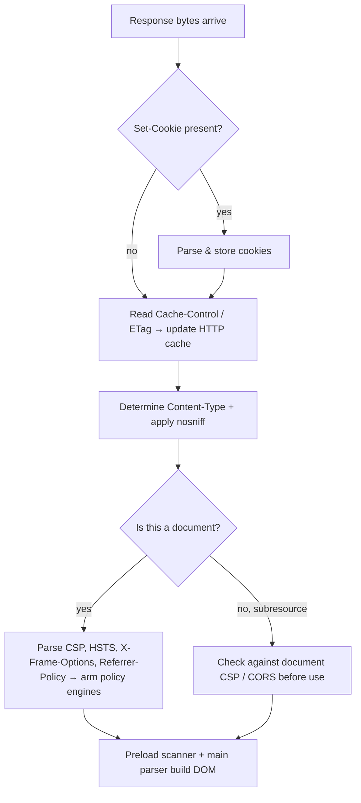

# How Browsers Process Headers

The browser is not a passive HTTP client that faithfully transmits whatever your JavaScript asks for. It is an opinionated, security-conscious user agent that owns a large slice of the header namespace outright, rewrites some of what you set, silently drops other parts, and enforces a long list of policies driven entirely by response headers — often *before* a single line of your application code runs. Understanding exactly where the line sits between "what the browser controls" and "what your code controls" is the difference between debugging CORS for twenty minutes and knowing the answer before you open DevTools.

This chapter walks the full lifecycle: which request headers the browser stamps on for you, which ones your JavaScript is *forbidden* from touching, how `fetch`/XHR feed into that pipeline, and then — on the response side — how the browser parses and *acts on* headers like `Content-Type`, `Set-Cookie`, `Cache-Control`, `Content-Security-Policy`, and the CORS family, in a specific and load-bearing order.

If you have not yet read [What are HTTP Headers](./What-are-HTTP-Headers.md) and [Request vs Response Headers](./Request-vs-Response-Headers.md), start there — this chapter assumes you know the shape of a message and the request/response split.

## The two header authorities: the browser vs. your JavaScript

Every outbound request carries headers from two sources:

1. **Headers the browser sets automatically** — computed from the navigation/fetch context, the URL, cookies, the document, and browser configuration. Your code usually cannot override these, and when it tries, the browser wins.
2. **Headers your code requests be added** — via `fetch(url, { headers })`, `XMLHttpRequest.setRequestHeader()`, or a `<form>`/`<a>` element's attributes.

The critical mental shift: the second set is a *proposal*, not a command. The browser validates it against the **Forbidden header** list and the **CORS** rules before anything hits the wire.

### Headers the browser owns and sets automatically

These are managed by the user agent. In most cases you cannot set or override them from script, and even the ones you *can* influence are computed unless you deliberately opt out.

| Header | Who computes it | Notes |
|---|---|---|
| `Host` | Browser | Derived from the URL authority. Forbidden to script. |
| `Connection`, `Keep-Alive` | Browser | Connection management. Forbidden. Meaningless on HTTP/2+ (see [HTTP Versions and Headers](./HTTP-Versions-and-Headers.md)). |
| `Content-Length` | Browser | Computed from the body you provide. Forbidden. |
| `Cookie` | Browser | Assembled from the cookie store per URL + `SameSite` + `Secure` + path rules. You never set this from `fetch`. |
| `Origin` | Browser | Stamped on all cross-origin requests and all non-`GET`/`HEAD`. Forbidden. |
| `Referer` | Browser | Governed by `Referrer-Policy`. Forbidden. |
| `User-Agent` | Browser | Overridable via `fetch` in *some* engines but generally left alone; historically forbidden, now conditionally settable. |
| `Sec-Fetch-*` | Browser | `Sec-Fetch-Site`, `-Mode`, `-Dest`, `-User` — the Fetch Metadata headers. Entirely browser-computed and forbidden. |
| `Accept-Encoding` | Browser | The browser advertises what it can decompress (`gzip, br, zstd`). Forbidden — the browser must be able to decode what it asked for. |
| `Sec-CH-*` | Browser | Client Hints, sent only after the server opts in via `Accept-CH`. |
| `:method`, `:path`, `:scheme`, `:authority` | Browser | HTTP/2+ pseudo-headers; never visible or settable from script. |

The `Sec-` prefix is not decoration. The Fetch spec reserves any header name starting with `Sec-` as **forbidden**, precisely so a server can *trust* that these came from the browser and were not forged by page script. That is what makes `Sec-Fetch-Site: same-origin` usable as a defense against CSRF.

### Headers your JavaScript may set — and the forbidden list

When you call `fetch(url, { headers: { ... } })`, the browser runs each header name through the Fetch Standard's **forbidden request header** check. If a name is forbidden, the browser *silently drops it* — no exception, no console warning in most engines. This is the single most common source of "I set the header but the server never received it" confusion.

Forbidden request headers (abridged — the list is normative in the Fetch spec) include: `Accept-Charset`, `Accept-Encoding`, `Access-Control-Request-Headers`, `Access-Control-Request-Method`, `Connection`, `Content-Length`, `Cookie`, `Date`, `DNT`, `Expect`, `Host`, `Keep-Alive`, `Origin`, `Permissions-Policy`, `Referer`, `TE`, `Trailer`, `Transfer-Encoding`, `Upgrade`, `Via`, anything starting with `Proxy-` or `Sec-`, and `Set-Cookie` (which is a response header anyway).

```js
// Browser-side fetch
const res = await fetch("/api/orders", {
  method: "POST",
  headers: {
    "Content-Type": "application/json", // ALLOWED and preserved
    "Authorization": "Bearer " + token,  // ALLOWED (but triggers preflight — see below)
    "X-Request-Id": crypto.randomUUID(), // ALLOWED custom header (also triggers preflight cross-origin)
    "Cookie": "session=abc",             // SILENTLY DROPPED — forbidden
    "Host": "evil.example",              // SILENTLY DROPPED — forbidden
    "User-Agent": "MyApp/1.0",           // Dropped in most engines
  },
  body: JSON.stringify({ sku: "A1" }),
});
```

If you remove `Content-Type` here, the browser will not guess JSON — the server's body parser (`express.json()`) checks `Content-Type` and will skip parsing, leaving `req.body` empty. That single line is load-bearing.

### CORS-safelisted request headers and preflight

For **cross-origin** requests, the browser adds another gate. Only a tiny set of request headers can be sent cross-origin *without* a preflight: `Accept`, `Accept-Language`, `Content-Language`, and `Content-Type` — and `Content-Type` only if its value is `application/x-www-form-urlencoded`, `multipart/form-data`, or `text/plain`. These are the **CORS-safelisted** headers.

The moment you add `Authorization`, `X-Request-Id`, or set `Content-Type: application/json` on a cross-origin request, you leave the safelist. The browser then fires an **OPTIONS preflight** first:

```http
OPTIONS /api/orders HTTP/2
Host: api.example.com
Origin: https://app.example.com
Access-Control-Request-Method: POST
Access-Control-Request-Headers: authorization,content-type,x-request-id
```

The server must answer with matching `Access-Control-Allow-*` headers or the browser blocks the real request. This is covered in depth in the CORS chapter, but the point here is: **your header choices dictate whether a preflight happens at all**, and that is decided entirely inside the browser.

## The fetch / XHR header pipeline

Here is what actually happens between your `fetch()` call and bytes on the wire:

```mermaid
sequenceDiagram
    participant JS as Page JS (fetch/XHR)
    participant Fetch as Browser Fetch engine
    participant Net as Network stack
    participant Srv as Server

    JS->>Fetch: fetch(url, { headers, credentials, mode })
    Fetch->>Fetch: Filter forbidden request headers (drop silently)
    Fetch->>Fetch: Attach automatic headers (Host, Origin, Sec-Fetch-*, UA, Accept-Encoding)
    Fetch->>Fetch: Compute Cookie from store (if credentials allow)
    alt Cross-origin & non-safelisted
        Fetch->>Srv: OPTIONS preflight (Access-Control-Request-*)
        Srv-->>Fetch: Access-Control-Allow-* response
        Fetch->>Fetch: Validate; abort if mismatch
    end
    Fetch->>Net: Serialize final header set
    Net->>Srv: Actual request
    Srv-->>Net: Response headers + body
    Net-->>Fetch: Parsed response
    Fetch->>Fetch: Store Set-Cookie, apply CSP/cache, filter readable headers per CORS
    Fetch-->>JS: Response object (with FILTERED headers)
```

Two subtleties engineers trip on:

- **`credentials`** controls whether the `Cookie` header (and HTTP auth, and TLS client certs) is attached. `fetch` defaults to `credentials: "same-origin"`. If you are calling a cross-origin API and expect cookies to ride along, you must pass `credentials: "include"` *and* the server must respond with `Access-Control-Allow-Credentials: true` and a non-wildcard `Access-Control-Allow-Origin`. Miss either and the cookie silently does not go / the response is blocked.
- **`mode: "no-cors"`** does not "turn off CORS." It gives you an *opaque* response: the request goes out with a restricted header set, and the response body and headers are unreadable from JS (`res.status` reads as 0). People reach for it to "fix" CORS and end up with a useless response object.

### Reading response headers is also gated

Even after a successful cross-origin response, JavaScript cannot read every response header. By default only the **CORS-safelisted response headers** are exposed to script: `Cache-Control`, `Content-Language`, `Content-Length`, `Content-Type`, `Expires`, `Last-Modified`, `Pragma`. Everything else — `X-Request-Id`, `X-RateLimit-Remaining`, a custom `X-Total-Count` for pagination — is invisible unless the server explicitly lists it in `Access-Control-Expose-Headers`.

```js
const res = await fetch("https://api.example.com/items");
res.headers.get("content-type");      // works — safelisted
res.headers.get("x-total-count");     // null — UNLESS server sent Access-Control-Expose-Headers: X-Total-Count
```

This is a browser-enforced filter on the `Headers` object, not a server omission. The header genuinely arrived (you can see it in DevTools' Network tab, which shows the *raw* response), but the `Headers` object your code reads has been stripped. This distinction — DevTools sees raw, JS sees filtered — trips up almost everyone once.

## How the browser parses and acts on response headers

Once bytes come back, the browser is the primary *consumer* of many response headers long before your code sees the body. The order of enforcement matters.

### Content-Type and MIME sniffing

The browser uses `Content-Type` to decide how to *interpret* the body: render as HTML, execute as JS, decode as an image, or download. Historically, when `Content-Type` was missing or wrong, browsers would **sniff** the bytes and guess — which was an XSS vector (upload a "JPEG" that is actually HTML, get it served, browser sniffs it as HTML and runs its script).

`X-Content-Type-Options: nosniff` disables that guessing. With it set, a `<script>` whose response is not a JS MIME type is refused, and a resource declared `text/plain` stays inert. This is why `nosniff` is a baseline security header — it forces the browser to trust the declared type instead of the payload.

```http
HTTP/2 200
content-type: application/json; charset=utf-8
x-content-type-options: nosniff
```

If the server here mislabels JSON as `text/html`, the browser treats the response as a document. `nosniff` does not fix a wrong label — it only stops the browser from *overriding* the label by inspecting bytes.

### Set-Cookie storage

`Set-Cookie` is consumed entirely by the browser's cookie store. Your JavaScript **cannot read `Set-Cookie` from a `fetch` response** — it is on the forbidden-response-header list, and `HttpOnly` cookies are unreadable via `document.cookie` too. The browser parses each `Set-Cookie` line, evaluates `Domain`, `Path`, `Secure`, `HttpOnly`, `SameSite`, `Expires`/`Max-Age`, and either stores or rejects it (e.g. a `Secure` cookie over plain HTTP is dropped; a `SameSite=None` cookie without `Secure` is rejected). All of this happens before your `.then()` runs, and none of it is observable from script. See the Cookies chapter for the full attribute matrix.

### Cache-Control and the HTTP cache

Before the browser even makes a request, it consults its HTTP cache, whose behavior was set by the *previous* response's `Cache-Control`, `Expires`, `ETag`, and `Last-Modified`. On a fresh response, the browser reads `Cache-Control` to decide whether and how long to store it, and whether to revalidate with `If-None-Match`/`If-Modified-Since` next time. This is transparent to your fetch code — you may get a `200` that never touched the network. See [Cache-Control](../06-Caching-Headers/Cache-Control.md) for the directive semantics.

### Content-Security-Policy enforcement

`Content-Security-Policy` (and its report-only sibling) is parsed by the browser and turned into an active enforcement engine for the *document*. It governs which script, style, image, font, and connection sources are allowed. Crucially, CSP is enforced by the browser at resource-load and script-eval time — a violating inline script simply never executes, and a blocked `fetch()` to a disallowed host rejects with a `TypeError`. Your code cannot loosen a CSP delivered by the server; it is a browser-side policy engine. See the Security Headers chapter for directive construction.

### CORS gating (recap in the enforcement pipeline)

As covered above, CORS response headers (`Access-Control-Allow-Origin`, `-Credentials`, `-Expose-Headers`) are read by the browser to decide (a) whether to hand the response to your code at all, and (b) which response headers your code may read. A cross-origin response with no matching `Access-Control-Allow-Origin` is fetched and then *thrown away* by the browser — the network succeeded, but your `fetch` promise rejects. This is why you see the request as `200` in the Network tab yet get a CORS error in the console.

### The order of enforcement

For a top-level navigation the browser applies response headers in roughly this sequence:



The key insight: **security and transport headers are consumed before your application logic**. By the time a React component reads `res.json()`, the browser has already stored cookies, updated its cache, armed CSP, and decided the response was even allowed to reach you.

## The preload scanner

When the browser receives an HTML response, the main HTML parser runs — but so does a lightweight, speculative **preload scanner** that races ahead through the raw markup looking for `<script src>`, `<link rel="stylesheet">`, ``, and `<link rel="preload">` so it can start those fetches *before* the parser reaches them. This is why blocking the main thread on a slow inline script does not stall image downloads.

Headers interact with the preload scanner in two ways:

- **`Link: rel=preload` response headers** let the server kick off subresource fetches even earlier than the HTML — the browser starts the preload the instant it reads the *response headers*, before any body arrives. This is the header-based equivalent of `<link rel=preload>` and the foundation of `103 Early Hints`.
- **CSP and `nosniff`** still gate what the preload scanner is allowed to fetch and how the result is interpreted, so the scanner cannot be used to bypass policy.

The practical takeaway: headers that arrive early (in the response head, or via `103 Early Hints`) let the browser start work sooner. Headers you inject late via JS-manipulated DOM miss the preload scanner entirely.

## How DevTools surfaces all this

DevTools is your window into the *real* header set, which — as established — differs from what your JS can see:

- **Network tab → Headers panel** shows **Request Headers** split into what you sent vs. what the browser added, and **Response Headers** as they arrived on the wire — including headers CORS hid from your JS and `Set-Cookie` lines your code can never read. If you see "Provisional headers are shown," the real request has not gone out yet (often a cache/service-worker interception).
- **Cookies tab** shows exactly which `Set-Cookie` were accepted or rejected and why (`SameSite`, `Secure`, domain mismatch).
- **Console** surfaces CORS rejections, CSP violations (with the exact violated directive), and mixed-content blocks — these are browser-enforcement messages, not server errors.
- **Application → Frames / Security** shows the active CSP, HSTS status, and certificate.

Rule of thumb when debugging: if DevTools' Network panel shows a header but your JS `res.headers.get()` returns `null`, the problem is CORS `Access-Control-Expose-Headers`, not the server omitting it.

## Mental Model

Think of the browser as a **gatekeeper standing between your JavaScript and the network, in both directions.**

- **Outbound**, your `fetch` headers are a *request to the gatekeeper*. It owns `Host`, `Origin`, `Cookie`, `Referer`, and everything `Sec-*`; it silently discards forbidden names; and it decides — based on which headers you added and whether the request is cross-origin — whether to fire a preflight first.
- **Inbound**, the gatekeeper consumes the security- and transport-critical headers *itself* — storing cookies, updating the cache, arming CSP, and applying CORS — all before your code runs. Then it hands your JavaScript a *deliberately narrowed* view: a `Headers` object with cross-origin headers filtered out and `Set-Cookie` invisible.

DevTools shows the unfiltered truth; your code sees the gatekeeper's edited version. Whenever a header "disappears," ask *which side of the gate* dropped it — the forbidden list on the way out, or CORS exposure filtering on the way in.

Next: [How Servers Process Headers](./How-Servers-Process-Headers.md) — the mirror image, where Node and Express turn raw bytes into `req.headers`.
