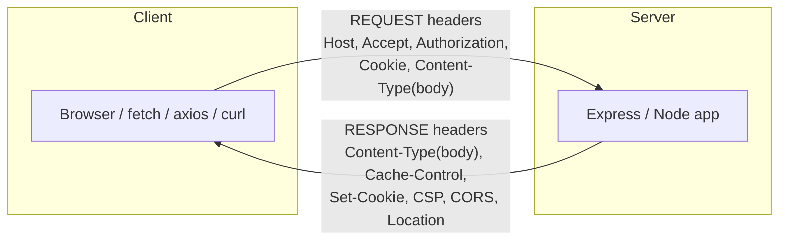

# Request vs Response Headers

## Quick Summary

Headers are classified by *direction*: **request headers** travel client → server and describe the client, its capabilities, and its intent; **response headers** travel server → client and describe the resource, the server, and instructions for handling the reply. Some headers appear in both directions (**representation headers** like `Content-Type`) and mean the same thing — "this is what the body is." Knowing which category a header belongs to tells you *who is allowed to set it*, *who is supposed to obey it*, and *whether you can even touch it from your code*. Setting a response-only header on a request (or vice versa) is a common, silent mistake.

## The four functional groups (RFC 9110 terminology)

Modern HTTP no longer talks about "general/entity headers." RFC 9110 organizes fields as:

1. **Request headers** — sent by the client; give context about the request or client. Examples: `Host`, `Authorization`, `Accept`, `User-Agent`, `Origin`, `Cookie`, `If-None-Match`, `Range`.
2. **Response headers** — sent by the server; give context about the response or server beyond the status line. Examples: `Server`, `Set-Cookie`, `WWW-Authenticate`, `Location`, `Age`, `Vary`, `Access-Control-Allow-Origin`.
3. **Representation headers** — describe the *body* (the "representation") and can appear on either side whenever a body is present. Examples: `Content-Type`, `Content-Length`, `Content-Encoding`, `Content-Language`, `Last-Modified`, `ETag`. On a request they describe the uploaded body; on a response they describe the returned resource.
4. **Fields that apply to the message/connection itself** — e.g. `Connection`, `Date`, `Cache-Control`, `Via`. Several of these are meaningful in both directions.

The practical takeaway: **"request header" and "response header" are about direction and intent, not rigid exclusivity.** A handful are genuinely bidirectional.

## Request headers: the client describing itself and its intent

Request headers answer questions the server needs before it can respond well:

| Question | Header(s) |
|---|---|
| Which site am I talking to? | `Host` |
| Who am I / am I allowed? | `Authorization`, `Cookie` |
| What formats can I accept? | `Accept`, `Accept-Language`, `Accept-Encoding` |
| What am I sending you? | `Content-Type`, `Content-Length` (when there's a body) |
| Do I already have a copy? | `If-None-Match`, `If-Modified-Since` |
| Where did this request originate? | `Origin`, `Referer` |
| What am I / how am I fetching? | `User-Agent`, `Sec-Fetch-*` |
| Only part of the resource, please | `Range` |

Key property: **the server should treat request headers as untrusted input.** They can be forged by any client (`curl -H`), replayed, or manipulated by intermediaries. `Host`, `X-Forwarded-For`, `User-Agent`, and `Referer` are all spoofable. Security bugs come from trusting them (host-header injection, IP-based auth bypass).

## Response headers: the server instructing the client

Response headers answer questions the client has once it receives the reply:

| Question | Header(s) |
|---|---|
| What is this body? | `Content-Type`, `Content-Encoding`, `Content-Length` |
| Can I cache it, how long? | `Cache-Control`, `Expires`, `ETag`, `Age`, `Vary` |
| Where should I go instead? | `Location` (with 3xx / 201) |
| Store this credential | `Set-Cookie` |
| How must you authenticate? | `WWW-Authenticate` (with 401) |
| When can I retry? | `Retry-After` (with 429 / 503) |
| Security policy you must enforce | `Content-Security-Policy`, `Strict-Transport-Security`, `X-Frame-Options` |
| Is cross-origin JS allowed to read this? | `Access-Control-Allow-Origin` and the CORS family |

Key property: **response headers are authoritative** — the browser and intermediaries *obey* them. This is where your application exerts control over caching, security, and client behavior. A CSP header, a `Set-Cookie`, or a `Cache-Control: no-store` is you programming the browser remotely.

## Representation (bidirectional) headers

The most important gotcha for developers: `Content-Type` and friends mean the *same thing* in both directions but describe *different bodies*.

**On a request** — describes the body you're uploading:

```http
POST /api/users HTTP/1.1
Content-Type: application/json      ← "the body I'm sending is JSON"
Content-Length: 33

{"name":"Ada","role":"engineer"}
```

**On a response** — describes the body being returned:

```http
HTTP/1.1 201 Created
Content-Type: application/json      ← "the body I'm returning is JSON"
Location: /api/users/42
```

If a client sends `Content-Type: application/json` but the server expects `application/x-www-form-urlencoded`, the server's body parser produces `undefined`/`{}` — a classic "my POST body is empty" bug in Express when `express.json()` didn't fire because the request `Content-Type` didn't match.

## Where each one comes from in your stack



**Reading request headers (server side):**

```js
app.post('/api/users', (req, res) => {
  req.get('content-type');   // 'application/json'  — case-insensitive lookup
  req.headers['authorization']; // raw value or undefined
  req.headers.host;          // 'app.example.com'
  // NOTE: you READ request headers here; you do not set them.
});
```

**Writing response headers (server side):**

```js
res.set('Cache-Control', 'no-store');          // response header
res.type('application/json');                   // sets Content-Type response header
res.cookie('sid', token, { httpOnly: true });   // emits Set-Cookie response header
res.location('/api/users/42').status(201);      // Location response header
// NOTE: you SET response headers here; res has no business setting request headers.
```

**On the client (browser):** you set *request* headers via fetch/axios and *read* *response* headers — but with hard limits:

```js
const res = await fetch('/api/users', {
  method: 'POST',
  headers: { 'Content-Type': 'application/json' }, // request header you MAY set
  body: JSON.stringify({ name: 'Ada' }),
});
// You CANNOT set Host, Origin, Cookie, Content-Length, User-Agent from JS —
// these are "forbidden request headers"; the browser controls them.

res.headers.get('content-type'); // reading a response header
// You can only read "CORS-safelisted" response headers cross-origin unless the
// server opts others in via Access-Control-Expose-Headers.
```

This asymmetry — clients set request headers but the browser reserves some; clients read response headers but CORS hides some — is a frequent source of "why can't I set/read this header?" confusion. See [Forbidden and Restricted Headers](../02-Core-Concepts/Forbidden-and-Restricted-Headers.md) and [Access-Control-Expose-Headers](../07-CORS/Access-Control-Expose-Headers.md).

## Common mistakes rooted in confusing direction

- **Setting a response header expecting the client to send it.** e.g. configuring `Access-Control-Allow-Origin` and wondering why the *request* doesn't have it — it's a *response* header; the request carries `Origin`.
- **Reading `Set-Cookie` in browser JS.** You can't — it's deliberately hidden from `fetch` responses. The browser stores it; JS sees only non-`HttpOnly` cookies via `document.cookie`.
- **Expecting `Content-Type` on a `GET` request.** A bodyless `GET` has no representation, so no `Content-Type`. Sending one is meaningless.
- **Trusting request headers for security.** `X-Forwarded-For`, `Host`, `Referer`, `Origin` are all attacker-controllable. Validate, don't trust.

## A quick reference table

| Header | Direction | Notes |
|---|---|---|
| `Host` | Request only | Required in HTTP/1.1; becomes `:authority` in H2/H3 |
| `Authorization` | Request only | Credentials |
| `Accept*` | Request only | Content negotiation |
| `Origin` | Request only | Set by browser on cross-origin/unsafe requests |
| `Set-Cookie` | Response only | Never send it as a request header |
| `WWW-Authenticate` | Response only | Pairs with request `Authorization` |
| `Location` | Response only | Redirects / created-resource URL |
| `Server` | Response only | Software identity |
| `Content-Type` | Both | Describes whichever body is present |
| `Content-Length` | Both | Size of whichever body is present |
| `Cache-Control` | Both | Request form (`no-cache`) and response form (`max-age`) differ in meaning |
| `Date` | Both | Message origination time |
| `Via` | Both | Added by proxies in either direction |

## Related Reading

- [End-to-End vs Hop-by-Hop Headers](./End-to-End-vs-Hop-by-Hop-Headers.md) — an orthogonal classification (who *consumes* the header).
- [Header Categories](../02-Core-Concepts/Header-Categories.md) — the functional taxonomy.
- [Forbidden and Restricted Headers](../02-Core-Concepts/Forbidden-and-Restricted-Headers.md).

## Mental Model

**Request headers are the customer's order slip; response headers are the kitchen's instructions taped to the delivery.** The order slip says who's ordering, what they can eat, and what they're allergic to — the kitchen reads it but doesn't trust it blindly. The instructions on the delivery say "reheat for 60s," "contains nuts," "keep for 3 days" — the customer obeys them. `Content-Type` is the label on the container, and a container shows up in both directions, so the same label applies going out and coming back.
