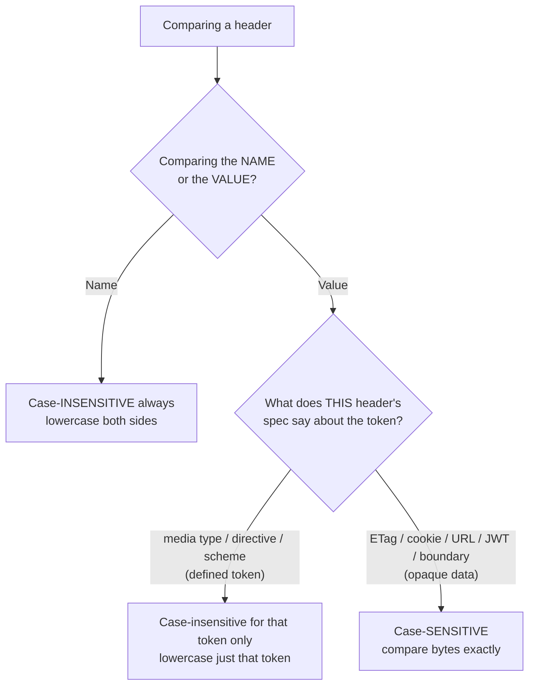
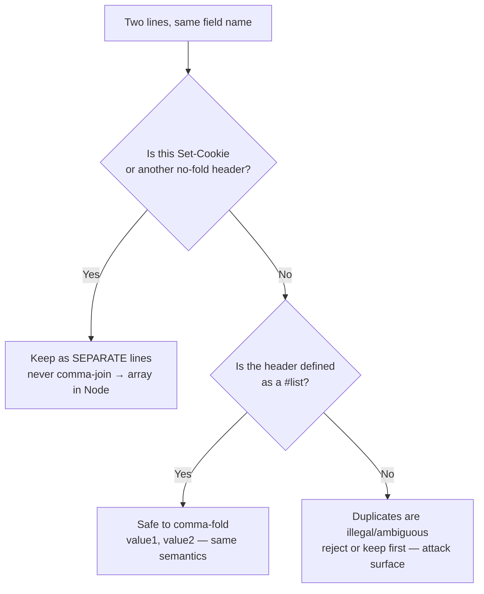

# Case Sensitivity and Ordering

Two properties of HTTP headers feel like trivia until they cause a production outage: **case** and **order**. A signature verification that lowercases a value and breaks. A `Set-Cookie` that a well-meaning proxy folds into one comma-joined line, silently destroying half your users' sessions. An HTTP/2 client that sends `Content-Type` (capitalized) and gets a `400`. An HMAC over "the headers" that passes in test and fails in production because Node reordered them. Every one of these is a case-or-ordering bug.

The rules are precise, and they differ between the *name* and the *value*, and between HTTP/1.1 and HTTP/2+. This chapter pins them down: field names are case-insensitive; field values are case-sensitive *by default* but some are defined otherwise; HTTP/2 and HTTP/3 **require** lowercase names on the wire; duplicate fields combine by comma-folding *except* the headers (led by `Set-Cookie`) that must never be folded; ordering is mostly not semantically significant but is preserved and occasionally load-bearing; and Node/Express normalize names to lowercase, which has direct consequences for anything that signs or hashes headers.

## Field names are case-insensitive — always

RFC 9110 §5.1 is unambiguous: **a field name is a case-insensitive token.** `Content-Type`, `content-type`, `CONTENT-TYPE`, and `Content-type` are the *same* header. Every compliant recipient must match names case-insensitively.

This has been true since HTTP/1.0, and it's why you can never rely on the *capitalization* of a header name to carry meaning. Historically HTTP/1.1 senders used "Train-Case" (`Content-Type`, `X-Request-Id`) as a readability convention — the raw bytes on an HTTP/1.1 connection preserved whatever casing the sender wrote — but recipients were always required to treat them case-insensitively.

The practical consequence in code: **you look up headers in lowercase** in Node, Express, Go, and most modern stacks, because they normalize the name to lowercase on parse. `req.headers['content-type']` works; `req.headers['Content-Type']` returns `undefined` in Node — not because the header is absent, but because Node stored the key lowercased. Express's `req.get('Content-Type')` papers over this by lowercasing your lookup for you.

## Field values: case-sensitive by default, but it depends per-header

Here's the asymmetry that trips people up: **the case-insensitivity applies only to the field *name*, never blanket to the *value*.** A field value is an opaque byte string as far as the core grammar is concerned; whether case matters is defined **per-header** by that header's own specification. There are three buckets:

- **Case-sensitive (the default and the safe assumption):** [`ETag`](../06-Caching-Headers/ETag.md) values are opaque and case-sensitive (`"aBc"` ≠ `"abc"`). Cookie names and values are case-sensitive. URLs/paths in [`Location`](../04-Response-Headers/Location.md) are case-sensitive. `Authorization` credential material (a JWT, a base64 blob) is case-sensitive. Custom header values you define are yours to specify, but default to case-sensitive.
- **Case-insensitive tokens *within* a value, by that header's grammar:** `Content-Type`'s type/subtype and parameter *names* are case-insensitive (`Text/HTML; Charset=UTF-8` ≡ `text/html; charset=utf-8`) — but the parameter *value* of a quoted boundary or a filename is case-sensitive. `Cache-Control` directive names (`no-cache`, `NO-CACHE`) are case-insensitive. `Connection`/`Transfer-Encoding`/`Accept-Encoding` tokens (`gzip`, `close`, `keep-alive`) are case-insensitive. Scheme names in `Authorization`/`WWW-Authenticate` (`Bearer`, `bearer`) are case-insensitive.
- **The mixed case that bites:** a header whose value is *partly* a case-insensitive token and *partly* case-sensitive data. `Content-Type: multipart/form-data; boundary=AbC123` — `multipart/form-data` is case-insensitive, `AbC123` is a case-*sensitive* delimiter. Lowercase the whole value and multipart parsing breaks.

**The rule you internalize: never blanket-lowercase (or uppercase) a header value.** Lowercase only the specific *token* you're comparing (a media type, a directive name, a scheme) after your parser has isolated it. Treat everything else as case-sensitive bytes. See [Header Syntax and Grammar](./Header-Syntax-and-Grammar.md) for the token-vs-quoted-string distinction that governs this.



## HTTP/2 and HTTP/3 REQUIRE lowercase field names

On HTTP/1.1 the name casing on the wire is cosmetic (recipients ignore it). On **HTTP/2 (RFC 9113 §8.2.1)** and **HTTP/3 (RFC 9114 §4.2)** it is a hard protocol rule: **field names MUST be lowercase**, and a receiver **MUST treat a message with an uppercase field-name character as malformed.** There is no `Content-Type` on an HTTP/2 connection — only `content-type`.

Why the change? HTTP/2 and HTTP/3 don't send textual header lines; they send compressed name/value pairs via **HPACK** (H2) and **QPACK** (H3). Compression works by referencing entries in a shared static/dynamic table by index. If names could vary in case, `Content-Type` and `content-type` would be *different* table entries — wrecking compression ratios and creating ambiguity. Mandating lowercase makes the name canonical, so the compressor's static table has exactly one entry per header and dynamic-table hits are maximized.

You almost never see this directly because your HTTP/2 library does the lowercasing for you: browsers, `curl --http2`, Node's `http2` module, and every H2/H3 server transparently emit lowercase names regardless of the casing you wrote in your code. The place it *does* surface:

- **Pseudo-headers** (`:method`, `:path`, `:scheme`, `:authority`, `:status`) are lowercase and colon-prefixed and must precede regular headers — a distinct H2/H3 concept with no HTTP/1.1 equivalent. See [HTTP Versions and Headers](../01-Introduction/HTTP-Versions-and-Headers.md).
- **A hand-built H2 client that sends an uppercase name** gets a `PROTOCOL_ERROR`/`400`. If you're debugging "works on H1, breaks on H2," suspect a manually-cased header.
- **`Connection` and other hop-by-hop headers are forbidden entirely in H2/H3** (RFC 9113 §8.2.2) — another wire-level difference, separate from casing.

The takeaway for your code: **write header names in whatever case reads well; never *depend* on the case surviving.** The moment your response crosses an HTTP/2 hop (which is almost always, given CDNs and LBs terminate H2), names are lowercase.

## Duplicate fields: comma-folding, and the fields that must never be folded

RFC 9110 §5.2–5.3 defines how multiple lines with the same field name relate:

> A recipient MAY combine multiple field lines within a field section that have the same field name into one field line, without changing the semantics of the message, by appending each subsequent field-line value to the combined field value in order, separated by a comma.

This is **comma-folding**, and it's only valid because *list-valued* headers are defined with the `#rule` (comma-separated list) grammar precisely so that folding is semantics-preserving:

```http
Cache-Control: no-cache
Cache-Control: no-store, max-age=0
```

is identical to:

```http
Cache-Control: no-cache, no-store, max-age=0
```

The same applies to `Accept`, `Accept-Encoding`, `Via`, `Vary`, `Access-Control-Allow-Headers`, and every other `#list` header. A sender is even told **not** to emit duplicate lines *unless* the field is a list (or a listed exception) — so if you see duplicates of a non-list header, something is wrong.

### The exceptions that must NOT be combined

Folding is a disaster for headers whose values can legally contain a comma that is *not* a list separator. The archetype is **`Set-Cookie`**:

```http
Set-Cookie: sid=abc; Path=/; Expires=Wed, 09 Jun 2027 10:18:14 GMT; HttpOnly
Set-Cookie: theme=dark; Path=/; Max-Age=31536000
```

A cookie's `Expires` attribute is an HTTP-date, and **HTTP-dates contain a comma** (`Wed, 09 Jun 2027…`). If a proxy folded these two `Set-Cookie` lines into one comma-joined value, you could never unambiguously split them apart again — the comma inside `Expires` is indistinguishable from the separator. So RFC 9110 §5.3 and RFC 6265 declare **`Set-Cookie` a special case that MUST NOT be combined.** Each cookie gets its own field line, start to finish.

Consequences you must respect:

- **On the server, emit multiple cookies as separate `Set-Cookie` lines.** In Node, pass an **array**: `res.setHeader('Set-Cookie', [c1, c2])`. Never concatenate cookies with commas.
- **`req.headers['set-cookie']` is the one header Node always exposes as an array**, never a joined string — precisely because folding it would be lossy.
- **A proxy or gateway that folds `Set-Cookie` is broken** and will corrupt sessions. This is a real bug in some naive middleware and older LB configs; it's why you test cookie-heavy flows through the real edge.
- Other headers with the same hazard (dates or commas in the value) — e.g. `WWW-Authenticate` with multiple challenges — are also handled carefully by parsers rather than blindly folded.



### Singleton headers with illegal duplicates

A third category: headers defined to appear **once** (`Content-Length`, `Host`, `Content-Type`, `Authorization`). Two conflicting copies is not a list to fold — it's an ambiguity, and it's exactly what **request-smuggling** attacks exploit (two `Content-Length` values, or `Content-Length` + `Transfer-Encoding`, interpreted differently by a front-end proxy and back-end server). Node keeps only the first for many of these; a hardened server should **reject** conflicting duplicates rather than silently pick one. See [Header Syntax and Grammar](./Header-Syntax-and-Grammar.md).

## Ordering: mostly not significant, sometimes load-bearing

RFC 9110 §5.3 states that **the order of fields with *different* names is not significant** — a recipient must not depend on `Date` coming before `Server`. But two ordering facts are load-bearing:

1. **The relative order of *same-name* field lines MUST be preserved**, because folding them concatenates in order, and for some headers order changes meaning. `Cache-Control: max-age=1, max-age=2` — a cache uses the first; reordering changes behavior. So intermediaries preserve the order of repeated fields even though they may reorder distinct fields.
2. **Real-world systems leak ordering as a signal even where the spec doesn't require it.** The *order and casing* of request headers is a well-known **fingerprinting** vector: browsers, HTTP libraries, and bots each emit a characteristic header order, and TLS/HTTP fingerprinting (JA3/JA4, Akamai's header-order checks) uses it to distinguish a real Chrome from a script impersonating one. This is why a scraper that sets the right `User-Agent` but the wrong header *order* still gets flagged.

Practically: **don't build correctness on the order of distinct headers** (a proxy or HTTP/2 re-serialization can reorder them), but **do preserve order when you proxy**, and be aware that order is observable. HTTP/2/3 further complicate this: HPACK/QPACK may reorder how fields are encoded, and pseudo-headers are always first.

## How Node and Express normalize header names

This is where the abstract rules become concrete bugs. Node's HTTP parser **lowercases every incoming header name** and exposes them on `req.headers` as a plain object with lowercase keys:

```js
// Node lowercases keys on parse. These are NOT interchangeable:
req.headers['content-type'];   // ✅ the value
req.headers['Content-Type'];   // ❌ undefined — key was stored lowercase
```

Details that matter:

- **`req.headers`** — lowercase-keyed, with duplicate non-list headers joined by `, ` and a hard-coded set kept as single values or arrays. `set-cookie` is **always** an array; a few (`age`, `authorization`, `content-length`, `host`, etc.) keep only the first because duplicates are illegal.
- **`req.rawHeaders`** — a flat array `[name, value, name, value, …]` that preserves the **original casing and order** and every duplicate line, unfolded. This is your source of truth when case or order matters.
- **`req.headersDistinct`** (Node 18.3+) — every header as an array, never joined.
- **Outgoing:** `res.setHeader('X-Foo', v)` stores the name in the casing you gave, but Node lowercases it on the HTTP/2 wire (and may on H1 depending on version). `res.getHeader()` lookups are case-insensitive. Node also exposes `res.setHeaders(new Headers(...))` and, internally, a case-insensitive store.
- **Express** adds `req.get(name)` / `req.header(name)` — case-insensitive lookups (it lowercases your argument) — and `res.set()`/`res.header()` for setting. `req.get('Referrer')` even aliases `Referer`. But under the hood it's the same lowercased `req.headers` object; Express changes the *ergonomics*, not the normalization.

The consequence: **any code that reads a header must be case-insensitive by using the lowercase key (Node) or `req.get()` (Express).** Code that hard-codes `req.headers['Content-Type']` is a latent bug that "works" only if you always test through a path that happens to send that exact casing — and breaks the moment an HTTP/2 hop lowercases it.

## Implications for signatures and HMAC over headers

This is the highest-stakes intersection of case and order, and it's where the abstract rules become a broken production signature. Many systems sign a subset of headers to prove integrity/authenticity: **AWS Signature V4**, **HTTP Message Signatures (RFC 9421)**, webhook signatures (Stripe, GitHub), and OAuth request signing. If the signer and verifier don't **canonicalize** the headers identically before hashing, the signature fails — or, worse, is bypassable.

The pitfalls all stem from this chapter:

- **Case of the name.** The signer might sign `Host: example.com` while an intermediary rewrote it to `host: example.com` (HTTP/2). Any signing scheme MUST canonicalize names to a fixed case — **AWS SigV4 lowercases all signed header names** before building the string-to-sign, precisely so H1/H2 differences don't break the signature. RFC 9421 does the same.
- **Case of the value.** You must **not** normalize the case of the *value* — signing lowercases-the-name but signs the value's bytes as-is (with only whitespace trimming/collapsing). If you lowercase the value, an `ETag` or a case-sensitive token no longer matches what the peer signed.
- **Order of signed headers.** The canonical string lists signed headers in a **defined order** (SigV4 sorts them alphabetically by lowercased name; RFC 9421 uses an explicit ordered list in the `Signature-Input`). You cannot rely on wire order, because proxies and HTTP/2 reorder — so the scheme fixes the order itself.
- **Folding of duplicates.** Repeated signed headers are combined per the `#rule` (comma-join, order preserved) into a single canonical value before hashing. If one side folds and the other doesn't, the hash differs.
- **Whitespace (OWS).** Leading/trailing OWS is stripped and internal runs collapsed to a single space in the canonical form (SigV4 does this). Sign the trimmed value, not the raw bytes with incidental spaces.

Because Node lowercases names and joins duplicates for you on `req.headers`, but *reorders/re-cases* can happen at any hop, **you must reconstruct the canonical string from a deterministic representation** — typically reading `req.rawHeaders` or `req.headers` and then applying the exact canonicalization the signing spec dictates, never trusting the incidental wire form.

```js
// Sketch of canonicalizing signed headers the way SigV4 / RFC 9421 require.
// The point: fix case-of-NAME, fix ORDER, fold duplicates, trim OWS —
// so signer and verifier hash byte-identical strings across H1/H2 and proxies.
function canonicalHeaders(headers, signedNames) {
  return signedNames
    .map((n) => n.toLowerCase())              // names → lowercase (H2-safe, spec-mandated)
    .sort()                                    // fixed order — never trust wire order
    .map((name) => {
      const raw = headers[name];               // Node already joined duplicates with ", "
      const value = String(raw)
        .trim()                                // strip leading/trailing OWS
        .replace(/\s+/g, ' ');                 // collapse internal whitespace runs
      return `${name}:${value}`;               // value case UNTOUCHED — it is signed bytes
    })
    .join('\n');
}
```

Get any of these wrong and you either produce signatures that intermittently fail (usually the moment traffic shifts to an H2 edge) or, if you're too lenient in verification, signatures an attacker can forge by exploiting the normalization gap.

## Common Mistakes

- **Reading `req.headers['Content-Type']` (capitalized).** Returns `undefined` in Node; the key is lowercase. Use the lowercase key or `req.get()`.
- **Blanket-lowercasing a header value.** Breaks `ETag` comparison, cookie values, multipart `boundary`, JWTs, and any case-sensitive token. Lowercase only the specific defined token you're comparing.
- **Comma-joining `Set-Cookie`.** Corrupts cookies whose `Expires` contains a comma; splits sessions. Always use an array / separate lines.
- **Hand-writing uppercase header names for HTTP/2.** Malformed per RFC 9113/9114 → `400`/`PROTOCOL_ERROR`.
- **Depending on the order of distinct headers.** A proxy or H2 re-serialization can reorder them; only same-name order is preserved.
- **Signing headers off the raw wire form.** Case, order, folding, and OWS all differ across hops; you must canonicalize per the signing spec.

## Debugging

- **Chrome DevTools:** the Headers tab shows names in the casing DevTools chooses to display, *not* necessarily the wire casing — for HTTP/2 the wire is lowercase regardless. Use "view source" on the raw headers where available.
- **curl:** `curl -v --http1.1 …` vs `curl -v --http2 …` lets you see the casing difference — H2 shows lowercase names. `curl -sD - -o /dev/null` dumps response headers preserving duplicates like multiple `Set-Cookie` lines.
- **Node:** log `req.rawHeaders` to see original casing, order, and every unfolded duplicate — the ground truth `req.headers` hides.
- **Signature debugging:** log the exact canonical string both signer and verifier build and diff them byte-for-byte; the mismatch is almost always a case, order, fold, or OWS difference.

## Best Practices

- [ ] Always look up headers case-insensitively — lowercase key in Node, `req.get()` in Express.
- [ ] Never blanket-lowercase a value; lowercase only the specific defined token you compare.
- [ ] Emit multiple `Set-Cookie` (and other no-fold headers) as separate lines / arrays, never comma-joined.
- [ ] Let your HTTP/2/3 stack lowercase names for you; never hand-write uppercase names on the wire.
- [ ] Don't build correctness on the order of distinct headers; do preserve order when proxying.
- [ ] For signed headers, canonicalize name-case, order, folding, and OWS exactly as the signing spec (SigV4 / RFC 9421) dictates — read `req.rawHeaders` when you need the truth.
- [ ] Reject conflicting duplicate singleton headers (`Content-Length`, `Host`) to close smuggling gaps.

## Related Headers and Chapters

- [Header Syntax and Grammar](./Header-Syntax-and-Grammar.md) — tokens, quoted-strings, the `#rule`, OWS, and why folding is dead.
- [Structured Field Values](./Structured-Field-Values.md) — a grammar that makes case/parse rules uniform for new headers.
- [Custom and X- Headers](./Custom-and-X-Headers.md) — custom headers you read in lowercase and expose deliberately.
- [HTTP Versions and Headers](../01-Introduction/HTTP-Versions-and-Headers.md) — pseudo-headers and the H2/H3 lowercase requirement in context.
- [How Servers Process Headers](../01-Introduction/How-Servers-Process-Headers.md) — Node/Express normalization in the request lifecycle.
- [ETag](../06-Caching-Headers/ETag.md) — a case-*sensitive* value you must never lowercase.

## Mental Model

Think of a header as an **envelope with a printed label and handwritten contents**. The **label** (the field name) is like a mailing category — "PRIORITY," "priority," "Priority" all route to the same bin; the sorting machine ignores the case entirely, and the modern high-speed sorters (HTTP/2/3) actually *reprint every label in lowercase* so their barcode scanners (HPACK/QPACK) can index them fast. The **contents** (the value) are handwritten and you copy them **exactly** — an ETag or a password is a fingerprint; "smoothing out" the capitalization forges it. When two envelopes share a label you may staple them into one *only if* the category is a comma-list — but `Set-Cookie` is the fragile parcel whose own contents contain commas (dates), so you must never staple those; they travel separately or arrive shredded. And when you need to **sign** the mail so it can't be tampered with, you don't sign the envelope as it happens to look after passing through the post office (which reprints labels and reshuffles the pile) — you first rewrite everything into one agreed canonical form, then sign *that*, so sender and recipient are guaranteed to be looking at byte-identical mail.
