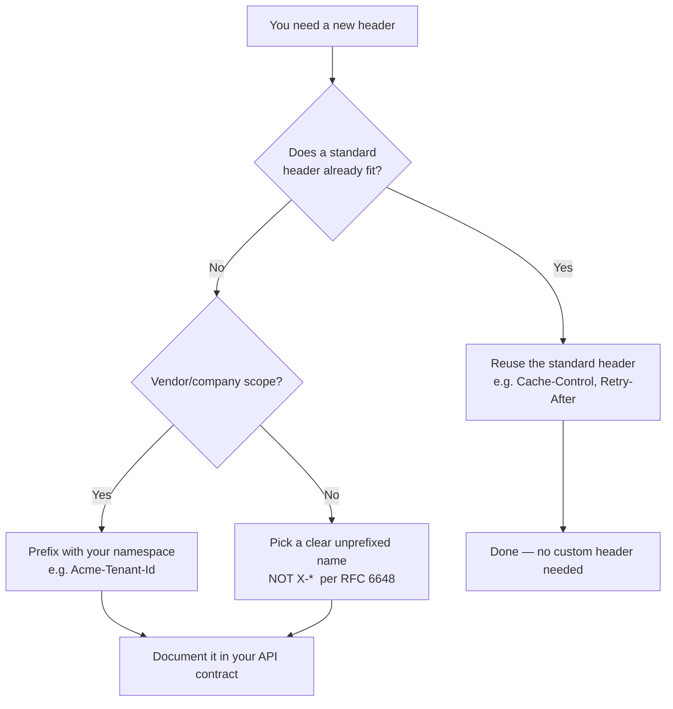
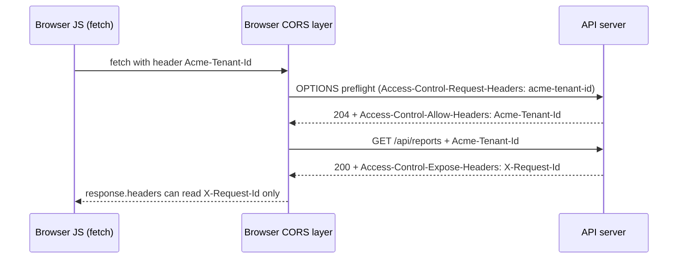

# Custom and X- Headers

Sooner or later every production system grows headers that no RFC defines: `X-Request-Id` for tracing, `X-Tenant-Id` for multi-tenancy, `X-Api-Version` for contract negotiation, `X-RateLimit-Remaining` for client back-off. These are **custom application headers** — fields you invent to carry metadata between your own components. They are legitimate and ubiquitous. They are also the source of a long tail of production incidents: headers stripped silently by a CDN, an `X-` prefix that locked you into a migration you can never finish, a trusted `X-User-Id` that a client forged to impersonate an admin, or a custom header that a browser refused to expose to your own frontend because you forgot [`Access-Control-Expose-Headers`](../07-CORS/Access-Control-Expose-Headers.md).

This chapter is about doing custom headers correctly: why the `X-` prefix was deprecated by **RFC 6648**, how to name a header, when to invent one versus reuse a standard, how custom headers survive (or don't survive) the trip through proxies and CDNs, how CORS gates their visibility, and — most importantly — why a header set by an untrusted client must never be trusted as an identity or authorization signal.

## What a "custom header" actually is

HTTP has no registry gate at the protocol level. A header field is just a `field-name: field-value` line ([Header Syntax and Grammar](./Header-Syntax-and-Grammar.md)), and any sender may emit any name it likes. The distinction between "standard" and "custom" is purely about **who defines the semantics**:

- **Standard headers** are registered in the IANA "HTTP Field Name Registry" and defined by an RFC or equivalent spec. Every compliant party — browsers, proxies, CDNs, frameworks — agrees on what they mean (`Content-Type`, `Cache-Control`, `Authorization`).
- **Custom headers** are defined by *you* (or a vendor). Their meaning is a private contract between your own components. Nothing outside your system knows what `X-Tenant-Id` means, and — crucially — nothing outside your system is obligated to preserve it.

That last point is the whole game. Because intermediaries only guarantee to preserve **end-to-end** headers they understand or are configured to pass, a custom header is only as reliable as the weakest hop that must forward it. See [End-to-End vs Hop-by-Hop Headers](../01-Introduction/End-to-End-vs-Hop-by-Hop-Headers.md).

## The `X-` prefix and why RFC 6648 killed it

For two decades the convention was: "if you invent a header, prefix it with `X-` so it can't collide with a future standard header." `X-Forwarded-For`, `X-Frame-Options`, `X-Requested-With`, `X-Powered-By` — the web is littered with them. The intent was good: a namespace for experimental/private fields, cleanly separated from the "official" namespace.

The problem is what happens when an `X-` header becomes successful. It gets widely deployed, clients and servers depend on it, and then it wants to be standardized. But the standard name **cannot keep the `X-` prefix** (standards aren't "experimental"), so you end up with two names for one thing and a migration that never completes because you can't break the old clients. The canonical scars:

- `X-Forwarded-For` → standardized as [`Forwarded`](../14-Proxies/Proxies-Overview.md) (RFC 7239). Almost nobody migrated. Both still exist, forever.
- `X-Frame-Options` → superseded by `Content-Security-Policy: frame-ancestors`. The old header lingers in every hardening guide.

**RFC 6648 (June 2012), "Deprecating the 'X-' Prefix and Similar Constructs in Application Protocols,"** made this official. Its core recommendations:

1. **Do not prefix new header names with `X-`.** Just pick a good name in the shared namespace.
2. **Creators of new parameters should not assume** an `X-` prefix implies "unstable" or "private" — the prefix carries no protocol meaning.
3. **Existing `X-` headers are grandfathered** — you don't have to rename `X-Forwarded-For`; the world depends on it. The rule is about *new* headers.

The deep reason: there was never a real technical boundary between the `X-` namespace and the standard namespace. Parsers didn't treat them differently. So the prefix bought you nothing but a rename obligation later. RFC 6648's guidance is simply: name the header once, name it well, and if it graduates to a standard the name doesn't have to change.



### So should you still write `X-`?

Pragmatically: **prefer no prefix for new headers**, but recognize two realities. First, some well-known de-facto conventions are still `X-` and you should match the ecosystem (`X-Request-Id` is understood by virtually every APM and log pipeline; inventing `Request-Id` to be "RFC-6648-pure" just makes your traces harder to correlate). Second, many teams still use a **company/product namespace prefix** (`Acme-`, `Shopify-`, `Stripe-`) to avoid collisions and signal ownership — RFC 6648 permits this; it only objects to the specific `X-` construct with its false "experimental" implication. The one thing you should not do is invent a *brand-new* `X-Whatever` header in 2026 and imagine the prefix is protecting you from anything.

## Naming conventions that survive production

A custom header name is a `token` ([Header Syntax and Grammar](./Header-Syntax-and-Grammar.md)) — case-insensitive on the name, ASCII, no spaces. Beyond legality, these conventions save you pain:

- **Use `Hyphen-Case` (a.k.a. `Train-Case`).** `X-Request-Id`, not `X_Request_Id` or `xRequestId`. Underscores in header names are a landmine: Nginx **drops headers containing underscores by default** (`underscores_in_headers off`), and CGI/PHP map `-` and `_` to the same `HTTP_` environment variable, so `X-Foo` and `X_Foo` collide. Stick to hyphens.
- **Namespace vendor headers.** `Acme-Tenant-Id` clearly belongs to you and won't collide with a future standard `Tenant-Id`.
- **Values are ASCII and should be structured.** Header values are conceptually US-ASCII. If you must carry non-ASCII or binary, encode it (Base64, percent-encoding, or RFC 8187 `field*=UTF-8''…`). For anything structured, strongly consider [Structured Field Values](./Structured-Field-Values.md) (RFC 8941) — an Item/List/Dictionary grammar built precisely so custom headers don't each reinvent parsing.
- **Keep them small.** Every custom header rides on *every* request/response it's attached to. A 2 KB debug header on every API call is real bandwidth and pushes you toward [Header Size Limits](./Header-Size-Limits.md).
- **Document them as part of your API contract.** An undocumented custom header is a header your own team will strip, rename, or break next quarter.

## When to invent a header vs reuse a standard one

The default answer is **reuse**. Standard headers are understood by intermediaries, get correct default handling (caching, security, compression), and require no documentation. You invent a custom header only when no standard header expresses the semantics. Some concrete calls:

| You want to… | Don't invent | Use the standard |
| --- | --- | --- |
| Tell the client when to retry | `X-Retry-Seconds` | [`Retry-After`](../04-Response-Headers/Retry-After.md) |
| Carry auth credentials | `X-Auth-Token`, `X-Api-Key`* | [`Authorization`](../09-Authentication/Authorization.md) (`Bearer`/custom scheme) |
| Control caching | `X-Cache-TTL` | [`Cache-Control`](../06-Caching-Headers/Cache-Control.md) |
| Negotiate content type | `X-Format` | [`Accept`](../11-Content-Negotiation/Content-Negotiation-Overview.md) / `Content-Type` |
| Signal the client's real IP | invent nothing new | [`Forwarded`](../14-Proxies/Proxies-Overview.md) / `X-Forwarded-For` (existing de-facto) |

\* `X-Api-Key` is a widespread exception: many APIs do use a custom key header because it's operationally simpler than a full `Authorization` scheme and lets a gateway route on it. That's a legitimate reuse-vs-invent judgment call — just know you're trading standard tooling for convenience.

**Legitimately custom** territory: request correlation (`X-Request-Id`, `traceparent` — the latter is actually a W3C standard now), tenancy (`Acme-Tenant-Id`), feature flags (`X-Feature-Flags`), rate-limit telemetry (`X-RateLimit-Limit`/`-Remaining`/`-Reset` — being standardized as `RateLimit-*`), and internal routing hints that only your infrastructure reads.

## How custom headers work in Express and Node

### Express.js: setting and reading

```js
const express = require('express');
const crypto = require('crypto');
const app = express();

// 1) Attach a correlation id to EVERY response, generating one if the client
//    (or an upstream proxy) didn't already provide it. This is the backbone of
//    distributed tracing: the same id flows through logs across services.
app.use((req, res, next) => {
  // Reuse an inbound id if present so a single request keeps ONE id across hops.
  // Header names are case-insensitive; Node lowercases them, so read lowercase.
  const requestId = req.headers['x-request-id'] || crypto.randomUUID();
  req.requestId = requestId;                 // stash for handlers + loggers
  res.setHeader('X-Request-Id', requestId);  // echo it back so the client can log it too
  next();
});

// 2) Expose rate-limit telemetry to clients as custom response headers.
app.use((req, res, next) => {
  res.setHeader('X-RateLimit-Limit', '1000');
  res.setHeader('X-RateLimit-Remaining', String(getRemaining(req)));
  res.setHeader('X-RateLimit-Reset', String(getResetEpoch(req))); // unix seconds
  next();
});

// 3) Read a custom request header — but NEVER trust it for identity (see Security).
app.get('/api/reports', (req, res) => {
  const tenantId = req.get('Acme-Tenant-Id');   // req.get() is case-insensitive
  if (!tenantId) return res.status(400).json({ error: 'Acme-Tenant-Id required' });
  // tenantId here is a *hint*; authorization must still be derived from the
  // verified session/JWT, not from this client-settable header.
  res.json(getReportsForTenant(req.user, tenantId));
});

app.listen(3000);
```

Every line is load-bearing. Reusing the inbound `x-request-id` (rather than always generating) is what keeps one logical request under a single id as it fans out to microservices — remove it and each service invents its own id, destroying trace correlation. `res.setHeader('X-Request-Id', …)` echoes it so the client can quote the id in a bug report. The rate-limit headers must be strings (Node throws on non-string/number header values). And the tenant read is deliberately treated as an untrusted hint.

### Node.js raw http: identical mechanics, zero defaults

```js
const http = require('http');

http.createServer((req, res) => {
  // Raw http gives you the same lowercase-keyed headers object as Express.
  const requestId = req.headers['x-request-id'] || cryptoRandomId();
  res.setHeader('X-Request-Id', requestId);

  // Reading a custom header that a client MIGHT have sent multiple times:
  // for non-list headers Node keeps only the first; for list headers it joins
  // with ", ". A forged duplicate is an attack surface — validate, don't assume one.
  res.setHeader('Content-Type', 'application/json');
  res.end(JSON.stringify({ ok: true }));
}).listen(3000);
```

The contrast with Express is only that Express adds `req.get()` (case-insensitive convenience) and `res.set()` (accepts objects, arrays, coerces types). The underlying `req.headers` object is the same lowercased map in both. See [How Servers Process Headers](../01-Introduction/How-Servers-Process-Headers.md).

## The CORS trap: your frontend can't see your own custom headers

This is the single most common "why doesn't my custom header work" bug, and it's not a bug — it's the Same-Origin Policy. When browser JavaScript reads a **cross-origin** response, the Fetch spec only lets it see a small **CORS-safelisted** set of response headers: `Cache-Control`, `Content-Language`, `Content-Length`, `Content-Type`, `Expires`, `Last-Modified`, `Pragma`. **Every custom header you set is invisible to `fetch`/`axios` unless the server explicitly opts it in** via [`Access-Control-Expose-Headers`](../07-CORS/Access-Control-Expose-Headers.md).

```js
app.use((req, res, next) => {
  res.setHeader('Access-Control-Allow-Origin', 'https://app.example.com');
  // Without this line, response.headers.get('X-Request-Id') === null in the
  // browser even though the header IS on the wire — the browser hides it from JS.
  res.setHeader('Access-Control-Expose-Headers',
    'X-Request-Id, X-RateLimit-Remaining, X-RateLimit-Reset');
  next();
});
```

```js
// Frontend — only works because the server exposed the header above.
const res = await fetch('https://api.example.com/api/reports', {
  headers: { 'Acme-Tenant-Id': 'acme-42' },   // a custom REQUEST header...
});
console.log(res.headers.get('X-Request-Id')); // ...and a readable custom RESPONSE header
```

There is a **symmetric** trap on the request side. A custom *request* header like `Acme-Tenant-Id` is **not** on the safelist, so sending it makes the request "non-simple" and triggers a **CORS preflight** (`OPTIONS`) — and the server must answer that preflight with [`Access-Control-Allow-Headers: Acme-Tenant-Id`](../07-CORS/CORS-Overview.md) or the real request is blocked. So every custom request header you add costs a preflight round-trip and a server-side allow-list entry. That's a real latency and configuration cost; don't sprinkle custom request headers casually.



## Propagation through proxies, reverse proxies, and CDNs

A custom header only "works" if every hop between sender and reader preserves it. Intermediaries have **no obligation** to forward headers they don't understand, and several will strip, rename, or drop them under specific conditions.

### Reverse proxy (Nginx)

Two Nginx behaviors bite constantly:

```nginx
server {
  # 1) Nginx DROPS request headers with underscores by default. If your app
  #    reads Acme_Tenant_Id (underscore), Nginx silently deletes it upstream.
  #    Either use hyphens (recommended) or opt in:
  underscores_in_headers on;

  location /api/ {
    proxy_pass http://app_upstream;

    # 2) proxy_pass forwards inbound request headers by default, BUT if you set
    #    ANY proxy_set_header in this block you should re-assert the ones you need.
    #    Explicitly forward your custom header so a config change can't lose it:
    proxy_set_header Acme-Tenant-Id $http_acme_tenant_id;
    proxy_set_header X-Request-Id   $http_x_request_id;

    # 3) To surface a custom RESPONSE header from upstream you usually need nothing
    #    (Nginx passes unknown response headers through), but if you add
    #    proxy_hide_header anywhere, be sure you didn't hide yours.
  }
}
```

Note `$http_x_request_id`: Nginx exposes inbound header `X-Request-Id` as the variable `$http_x_request_id` (lowercased, hyphens→underscores). This is also how you'd *generate* one at the edge (`$request_id` is a built-in) and inject it if absent.

### CDN

CDNs are the most aggressive strippers because they optimize for cache efficiency and security:

- **Request headers not in the cache key are often dropped before reaching origin.** Cloudflare, CloudFront, and Fastly forward a curated set by default; a custom request header may be silently removed unless you add it to the origin request policy / cache key. On CloudFront this is an explicit **Origin Request Policy**; on Cloudflare you use Transform Rules or Workers.
- **Custom response headers are usually passed through**, but a CDN may strip hop-by-hop headers, may not forward headers on cached responses if they were computed per-request, and will happily cache a response *including* your custom header — meaning a per-user `X-Request-Id` can get **cached and served to the wrong user** if the response is cacheable. Never put per-request/per-user data in a cacheable response's headers without a correct [`Vary`](../06-Caching-Headers/Cache-Control.md) and cache key.
- **`Vary` interaction:** if your response varies by a custom request header, you must reflect that in the cache key, or the CDN serves one variant to everyone. See [CDN Caching Overview](../15-CDNs/CDN-Caching-Overview.md).

The operating rule: **for any custom header that must survive to origin or back to the client, verify it end-to-end with curl through the real edge**, not just against localhost.

## Security Considerations

This is where custom headers cause the worst incidents, so it gets the most space.

- **Never trust a client-set custom header as an identity or authorization signal.** The archetypal catastrophe: an internal service authenticates by reading `X-User-Id` or `X-Admin: true`, on the assumption that "only our gateway sets that." An attacker who can reach the service directly (SSRF, a misrouted request, a leaked internal endpoint, a flat network) simply sends `X-User-Id: 1` and becomes the admin. Identity must come from a **cryptographically verified** source — a signed JWT in [`Authorization`](../09-Authentication/Authorization.md), a session cookie validated server-side — never from a plaintext header a client can type.
- **If you do propagate identity via headers between internal services, the gateway MUST strip the inbound copy first.** The pattern is: gateway authenticates the user, then *overwrites* `X-User-Id` with the verified value (deleting any client-supplied one) before forwarding. If you forward without stripping, a client can pre-set `X-User-Id` and, depending on proxy merge behavior, have it survive. Explicitly `proxy_set_header X-User-Id $verified_id;` (never `$http_x_user_id`).
- **`X-Forwarded-For` spoofing.** Client IP headers are attacker-controlled unless every hop is trusted. If you rate-limit or geo-gate on `X-Forwarded-For` naively, an attacker prepends fake IPs. Use `Forwarded`/`X-Forwarded-For` only from a trusted proxy, and configure your framework's trust boundary (Express `app.set('trust proxy', …)`) to count from the *right* hop. See [Proxies Overview](../14-Proxies/Proxies-Overview.md).
- **Header injection / response splitting.** If user input flows into a custom header value unfiltered and contains `\r\n`, an attacker can inject additional headers or split the response (CRLF injection). Node's `http` throws `ERR_INVALID_CHAR` on CR/LF in header values — do not strip that protection; validate/encode instead.
- **Information disclosure.** `X-Powered-By: Express`, `Server: nginx/1.25.1`, and verbose custom debug headers (`X-Debug-Sql`, `X-Backend-Host`) hand attackers reconnaissance. Disable `X-Powered-By` (`app.disable('x-powered-by')`) and never ship debug headers to production clients.
- **Cache poisoning via unkeyed custom headers.** If a shared cache stores a response that reflected an untrusted custom request header into its body/headers, and that header isn't in the cache key, the poisoned response is served to everyone.

```js
// Harden a production Express app's header surface.
app.disable('x-powered-by');                    // remove framework fingerprinting
app.set('trust proxy', 1);                       // trust exactly ONE proxy hop (your LB) for XFF
// Overwrite, never trust, identity headers at the trust boundary:
app.use((req, res, next) => {
  delete req.headers['x-user-id'];               // drop any client-supplied identity header
  if (req.session?.userId) req.verifiedUserId = req.session.userId; // derive from verified session
  next();
});
```

## Performance Considerations

- **Every custom header is per-message overhead.** On HTTP/1.1 it's raw bytes on every request and response. A handful of small headers is negligible; a 4 KB base64 blob on every request is not.
- **HTTP/2 HPACK and HTTP/3 QPACK compress repeated headers** with dynamic tables, so a *stable* custom header (same name+value across requests, like `Acme-Tenant-Id` for a session) costs almost nothing after the first request — it's referenced by index. A *high-entropy* custom header (a fresh `X-Request-Id` per request) can't be table-cached and pays full cost each time. Prefer stable values where you can.
- **Custom request headers trigger CORS preflights** (see above), adding an `OPTIONS` round-trip. Cache preflights with [`Access-Control-Max-Age`](../07-CORS/Access-Control-Max-Age.md).
- **Header bloat pushes you toward [Header Size Limits](./Header-Size-Limits.md)** — the 8 KB/16 KB ceilings that yield `431 Request Header Fields Too Large`.

## Debugging

- **Chrome DevTools → Network → Headers:** custom request and response headers appear under "Request Headers"/"Response Headers." If a custom response header is *on the wire* but `response.headers.get()` returns `null`, that's the CORS-expose problem, not a missing header.
- **curl:** `curl -sD - -o /dev/null -H 'Acme-Tenant-Id: acme-42' https://api.example.com/x` dumps response headers so you can confirm your custom header round-trips. Run it **through the real CDN/LB hostname**, not localhost, to catch stripping.
- **Verify propagation hop-by-hop:** curl the origin directly, then through the reverse proxy, then through the CDN, comparing which custom headers survive each layer.
- **Postman / Bruno:** both show all response headers unfiltered (they're not subject to the browser's CORS visibility rules), which makes them useful for confirming a header exists even when the browser hides it.
- **Node/Express logging:** `res.on('finish', () => console.log(req.requestId, res.getHeaders()))` prints the exact custom headers emitted per response.

## Best Practices

- [ ] Do **not** prefix new headers with `X-` (RFC 6648); use a clear name or a company namespace like `Acme-`.
- [ ] Use `Hyphen-Case`, ASCII values, and never underscores (proxies drop them).
- [ ] Reuse a standard header whenever one fits; invent a custom header only for genuinely custom semantics.
- [ ] For structured data, use [Structured Field Values](./Structured-Field-Values.md) instead of ad-hoc grammar.
- [ ] Expose custom response headers to browser JS with [`Access-Control-Expose-Headers`](../07-CORS/Access-Control-Expose-Headers.md); allow custom request headers with `Access-Control-Allow-Headers`.
- [ ] **Never** derive identity/authorization from a client-settable header; strip and overwrite identity headers at the trust boundary.
- [ ] Reuse an inbound `X-Request-Id`/`traceparent` rather than regenerating, to preserve trace correlation.
- [ ] Disable `X-Powered-By` and never ship debug headers to production clients.
- [ ] Verify every business-critical custom header end-to-end through the real CDN/LB with curl.
- [ ] Keep custom headers small; prefer stable values so HPACK/QPACK can compress them.

## Related Headers and Chapters

- [Header Syntax and Grammar](./Header-Syntax-and-Grammar.md) — the token/value rules every custom header must obey.
- [Structured Field Values](./Structured-Field-Values.md) — the modern, parse-once grammar for custom header values.
- [Case Sensitivity and Ordering](./Case-Sensitivity-and-Ordering.md) — why you read custom headers in lowercase and why order can matter.
- [Header Size Limits](./Header-Size-Limits.md) — the ceilings that custom-header bloat runs into.
- [Access-Control-Expose-Headers](../07-CORS/Access-Control-Expose-Headers.md) / [CORS Overview](../07-CORS/CORS-Overview.md) — the gate on custom-header visibility.
- [Authorization](../09-Authentication/Authorization.md) — the correct place for credentials, not `X-Auth-*`.
- [Proxies Overview](../14-Proxies/Proxies-Overview.md) and [CDN Caching Overview](../15-CDNs/CDN-Caching-Overview.md) — where custom headers get stripped or cached.

## Mental Model

Treat a custom header like a **sticky note you attach to a parcel moving through a shipping network you don't fully own**. Your own warehouse and delivery van (your services) read and honor the note. But every third-party depot the parcel passes through (proxy, CDN, load balancer) is free to ignore it, peel it off, or — worse — photocopy it onto the next parcel (caching). So: write the note in a clear standard hand (don't invent cursive with `X-` flourishes RFC 6648 warned against), only attach a note when the pre-printed labels (standard headers) don't already say what you need, tape it down at every depot you control (`proxy_set_header`, expose-headers), and — the rule that prevents disasters — **never let the parcel's own sender write the "deliver to the CEO" note themselves.** Identity is stamped by your verified gateway, not scribbled by whoever mailed the box.
