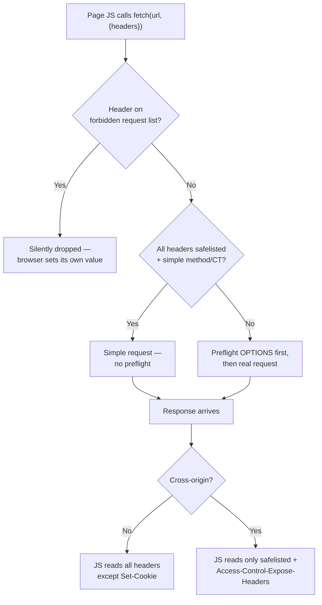

# Forbidden and Restricted Headers

You write `fetch('/api', { headers: { Host: 'evil.com', 'Content-Length': '0', Cookie: 'admin=1' } })`, the request goes out, and *none of those three headers are on the wire*. No error, no warning — they were silently dropped. This is not a bug in `fetch`; it is the Fetch standard doing exactly what it is specified to do. A defined set of **forbidden request headers** and **forbidden response headers** exist because the browser — not the page's JavaScript — must remain the source of truth for anything security-, integrity-, or transport-critical.

This chapter explains which headers the browser reserves, why it reserves each category, the related concept of the **CORS-safelist** (which controls preflighting and read-access), and how all of this shows up in real `fetch`/`XMLHttpRequest` code. The recurring theme: **on the server you can set almost anything; in the browser, JavaScript is a guest and the user agent is the host.**

## Two different "restrictions" people conflate

There are two separate mechanisms, and mixing them up causes a lot of confused debugging:

1. **Forbidden headers** — the browser flatly refuses to let JavaScript **set** (request) or **read** (response) certain header names, *regardless of CORS*. This is about integrity and preventing JS from impersonating the user agent or the transport layer.

2. **The CORS-safelist** — a list of request headers that are considered "safe" enough that setting them does **not** trigger a CORS preflight, and a list of response headers JS may **read** cross-origin by default. This is about the cross-origin trust boundary, not about forbidding — you *can* set non-safelisted headers, you just pay a preflight for it.

Both are defined in the WHATWG Fetch standard, and both are enforced only by browsers. `curl`, Postman, a Node HTTP client, or your Express server obey none of this — they will send `Host: anything` happily. That asymmetry is the whole point: the restrictions protect *users running untrusted page JS*, not machine-to-machine clients you control.

## Forbidden request headers — the browser owns these

The Fetch standard defines a **forbidden request-header** predicate. If page JS tries to set one of these on a `Request`/`fetch`/`XHR`, the browser silently ignores the attempt (or throws for the `Sec-`/`Proxy-` prefixes in some engines). The reasoning differs by group:

**Transport / framing integrity — JS must not corrupt how the message is parsed:**

| Header | Why forbidden |
|---|---|
| `Host` | Determines routing and virtual-host selection; letting JS forge it enables cache poisoning and SSRF-style confusion. The browser derives it from the URL. |
| `Content-Length` | Must exactly match the body the browser actually sends. A JS-set mismatch is the raw material of request smuggling. The browser computes it. |
| `Connection`, `Keep-Alive` | Hop-by-hop transport control; JS has no business managing the socket. |
| `Transfer-Encoding`, `TE`, `Trailer` | Framing/chunking — smuggling territory. |
| `Upgrade` | Protocol switching (WebSocket/h2c) is the browser's job, not the page's. |
| `Expect` | `100-continue` handshake is transport-level. |
| `Content-Transfer-Encoding` | MIME framing artifact. |

**Ambient authority / identity — JS must not spoof who the user or agent is:**

| Header | Why forbidden |
|---|---|
| `Origin` | The browser's attestation of *where this request came from*. The entire CORS and CSRF-defense model collapses if JS can forge it. This is arguably the single most important forbidden header. |
| `Cookie` | The browser attaches cookies according to `SameSite`, `Secure`, `HttpOnly`, path/domain rules. Letting JS set the `Cookie` header directly would bypass all of that (and read `HttpOnly` cookies). |
| `Referer` | Governed by `Referrer-Policy`; JS forging it defeats the privacy controls. |
| `Date` | Message metadata the UA sets. |
| `Access-Control-Request-Headers`, `Access-Control-Request-Method` | These are the *browser's* preflight probes; JS forging them would let it lie to the server about what the real request will contain. |

**Reserved namespaces — anything the browser might use as trustworthy signal:**

| Prefix / header | Why forbidden |
|---|---|
| `Sec-*` (e.g. `Sec-Fetch-Site`, `Sec-Fetch-Mode`, `Sec-CH-UA`, `Sec-WebSocket-Key`) | The `Sec-` prefix is *defined* to be un-forgeable by JS so servers can trust these as browser-attested. See [Sec-Fetch](../03-Request-Headers/Sec-Fetch.md). |
| `Proxy-*` (e.g. `Proxy-Authorization`) | Proxy-directed; JS must not inject into the proxy conversation. |
| `User-Agent` | Historically settable via XHR in some engines; the Fetch spec allows overriding it via the API in limited cases, but it is UA-controlled by default and is being frozen in favor of UA Client Hints. |

The exact list evolves with the spec, but the *principle* is stable and is what you should reason from: **if a header participates in transport framing, ambient authority, or browser attestation, JS cannot set it.** When you find yourself wanting to set one of these from the front end, that is a signal to move the logic to the server or rethink the design — not to look for a workaround (there isn't a legitimate one).

## Forbidden response headers — hidden from JS on read

Symmetrically, a few **response headers cannot be read by JS** even for a same-origin response, via `response.headers.get(...)`:

- **`Set-Cookie`** and **`Set-Cookie2`** — exposing these to page JS would leak session/`HttpOnly` cookie contents, defeating the entire `HttpOnly` protection. The browser applies them but never hands them to JS. (The `Headers.getSetCookie()` method exists for *server-side* fetch/Node and service-worker contexts, not for reading arbitrary sites' cookies from a page.)

That is the headline case. Separately — and this is the part people hit constantly — for **cross-origin** responses, JS can only read a *safelisted* set of response headers unless the server opts in via `Access-Control-Expose-Headers`. That is the CORS-safelist, next.

## The CORS-safelist: preflight avoidance and read-access

### Safelisted *request* headers (no preflight)

A "simple" cross-origin request avoids a CORS preflight only if every header JS set is on the request safelist and the method is `GET`/`HEAD`/`POST`. The safelisted request headers are:

- `Accept`
- `Accept-Language`
- `Content-Language`
- `Content-Type` — **but only** with a value of `application/x-www-form-urlencoded`, `multipart/form-data`, or `text/plain`. Any other `Content-Type` (notably `application/json`) is **not** safelisted and forces a preflight.
- `Range` — safelisted only for a simple byte range (added later to the spec for media).

Additionally these have value-length/character constraints; e.g. safelisted values may not exceed 128 bytes and must avoid CORS-unsafe bytes.

The practical takeaways every full-stack engineer needs burned in:

- **`Content-Type: application/json` triggers a preflight.** This is the number-one reason people see an unexpected `OPTIONS` request before their `POST`. It is *not* forbidden — it is just not safelisted, so the browser sends a preflight `OPTIONS` carrying `Access-Control-Request-Method`/`Access-Control-Request-Headers`, and your server must answer it. See [CORS Overview](../07-CORS/CORS-Overview.md) and [Access-Control-Allow-Headers](../07-CORS/Access-Control-Allow-Headers.md).
- **Any custom header (e.g. `X-Request-Id`, `Authorization`) forces a preflight** cross-origin, because custom headers are never safelisted.

### Safelisted *response* headers (readable without opt-in)

For a cross-origin response, JS may read only these by default:

`Cache-Control`, `Content-Language`, `Content-Length`, `Content-Type`, `Expires`, `Last-Modified`, `Pragma`.

Everything else — `ETag`, `X-Request-Id`, `Authorization`-echoes, custom headers — is *present on the response* but invisible to `response.headers.get()` cross-origin unless the server sends `Access-Control-Expose-Headers: ETag, X-Request-Id`. This is a frequent "the header is there in DevTools but `null` in my code" bug: DevTools shows the raw response, but `fetch` filters it. See [Access-Control-Expose-Headers](../07-CORS/Access-Control-Expose-Headers.md).



## Demonstrating the silent drop

```js
// Front-end code (runs in a browser tab).
const res = await fetch('https://api.example.com/orders', {
  method: 'POST',
  headers: {
    // ---- forbidden request headers: ALL silently ignored ----
    Host: 'internal.example.com',   // dropped — browser sets Host from the URL
    Origin: 'https://trusted.com',  // dropped — browser sets the true Origin
    Cookie: 'session=stolen',       // dropped — browser manages the Cookie header
    'Content-Length': '0',          // dropped — browser computes the real length
    Connection: 'close',            // dropped — hop-by-hop, browser-owned
    'Sec-Fetch-Mode': 'navigate',   // dropped — Sec- prefix is un-forgeable
    Referer: 'https://faked.com',   // dropped — governed by Referrer-Policy

    // ---- these DO go out ----
    'Content-Type': 'application/json', // sent, but NOT safelisted → triggers preflight
    'X-Request-Id': crypto.randomUUID(), // sent, custom → also part of the preflight
    Authorization: `Bearer ${token}`,    // sent, custom → also part of the preflight
  },
  body: JSON.stringify({ item: 'sku-42' }),
});

// On the wire the browser actually sends:
//   Host: api.example.com            (browser's value, not yours)
//   Origin: https://your-page-origin (browser's value)
//   Content-Length: 17               (browser's computed value)
//   Content-Type: application/json
//   X-Request-Id: <uuid>
//   Authorization: Bearer <token>
// ...preceded by an OPTIONS preflight because Content-Type/X-Request-Id/Authorization
// are not safelisted.

// Reading a non-safelisted response header cross-origin:
const etag = res.headers.get('ETag');
// → null, UNLESS the server sent: Access-Control-Expose-Headers: ETag
```

You can verify the drops empirically: open DevTools → Network, fire the request, and inspect the actual **Request Headers** the browser sent. The forbidden ones you tried to set will be absent or replaced by the browser's own values. This is a good thing to demonstrate to teammates who are convinced "the header just isn't working" — it usually isn't a bug, it's the spec.

## Why the browser reserves them — the security argument

Every forbidden header maps to a concrete attack it prevents if JS could set/read it:

- **`Origin`/`Referer` forging** → defeats CORS and CSRF defenses; a malicious script could make cross-origin requests appear same-origin. These *must* be browser-attested.
- **`Cookie` setting/reading** → defeats `HttpOnly` (the whole point of which is that JS cannot touch the cookie), enabling session theft via XSS.
- **`Host`/`Content-Length`/`Transfer-Encoding` forging** → request smuggling and cache poisoning, where a front-end proxy and back-end origin disagree on message boundaries.
- **`Sec-*` forging** → would let a compromised page lie about its fetch context, defeating Fetch-Metadata-based server defenses.
- **`Set-Cookie` reading** → session-cookie exfiltration.

The unifying idea: these headers are **statements the browser makes on the user's behalf about identity and transport**. If the page could rewrite the browser's own statements, the browser could no longer make any trustworthy claim, and every downstream security control that relies on those claims (CORS, `SameSite`, HSTS pinning, Fetch Metadata) would be worthless. So the browser reserves them and enforces the reservation at the API boundary, before a single byte hits the network.

## Server side: none of this constrains you (which is its own hazard)

On the origin, Node/Express/Nginx will set or read any header. That freedom means *you* are responsible for the integrity the browser enforces client-side:

- Don't blindly trust request headers a browser would have forbidden if they arrive from a *non-browser* client — e.g. treat `X-Forwarded-For` and `Origin` from outside your trust boundary as attacker-controlled ([X-Forwarded-For](../14-Proxies/X-Forwarded-For.md)).
- Don't reflect user input into response headers without stripping CR/LF (header injection).
- Do set `Access-Control-Expose-Headers` when your SPA needs to read `ETag`, pagination, or trace headers cross-origin — the browser will hide them otherwise.

## Mental Model

In the browser, think of your JavaScript as a **tenant** and the user agent as the **building management**. You control everything *inside your apartment* (your app's data, most request/response headers). But you cannot repaint the building's address (`Host`), forge the doorman's logbook of who entered (`Origin`, `Sec-Fetch-*`), hand out master keys (`Cookie`/`Set-Cookie`), or rewire the plumbing (`Connection`, `Content-Length`, `Transfer-Encoding`). Management reserves those because other tenants' safety depends on them being trustworthy, and it enforces the rules at the front desk — quietly confiscating anything you're not allowed to carry in, without so much as a note slipped under your door.

On the **server**, you *are* building management. Nothing stops you from doing any of it — which means the integrity the browser guaranteed for free is now entirely your job.
