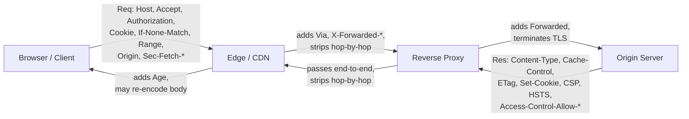

# Header Categories

HTTP defines hundreds of header fields across dozens of RFCs, and new ones ship every year (Client Hints, `Priority`, the `Sec-Fetch-*` family, structured-field headers). If you try to memorize them as a flat list you will drown. The way experienced engineers keep them straight is by categorizing them along two orthogonal axes: **direction** (who is allowed to send it, and on which message) and **purpose** (what job it does). Once a header is placed on that grid, its behavior is largely predictable — you know which side sets it, which side reads it, whether a proxy may rewrite it, and whether it participates in caching or CORS.

This chapter builds that mental grid and then hands you a large reference table you can come back to. It is the map for the rest of the book.

## The two axes that matter

### Axis 1 — Direction: request, response, or representation

RFC 9110 (the current HTTP semantics spec that replaced RFC 7230–7235) organizes fields by where they legitimately appear:

- **Request headers** travel client → server and describe the request or the client: `Host`, `Authorization`, `Accept`, `Cookie`, `Range`, `If-None-Match`. They answer "who is asking, for what, under which conditions."
- **Response headers** travel server → client and describe the response or the server: `Server`, `Set-Cookie`, `WWW-Authenticate`, `Vary`, `Access-Control-Allow-Origin`, `Retry-After`. They answer "who answered, and how should you treat this answer."
- **Representation metadata** describes the *body* (the "representation"), not the message. These are the interesting ones because **they appear on both requests and responses**: `Content-Type`, `Content-Length`, `Content-Encoding`, `Content-Language`, `Last-Modified`, `ETag`. When you `POST` JSON, `Content-Type: application/json` is representation metadata on a request; when the server returns JSON, the same header is representation metadata on a response. RFC 9110 deliberately separates "representation" from "message" so that the same semantics apply in both directions.

RFC 9110 formally deprecated the older term "entity header" in favor of "representation metadata," and it also collapsed the old rigid request-header / response-header / general-header buckets into a looser model where a field's registry entry simply notes where it is *expected*. The direction is a convention enforced by specs and (for browsers) by the Fetch standard — not something the wire protocol checks. See [Request vs Response Headers](../01-Introduction/Request-vs-Response-Headers.md) for the deeper treatment.

There is also a fourth, cross-cutting distinction inherited from RFC 7230: **end-to-end vs hop-by-hop**. Most headers are end-to-end (they survive proxies untouched). A small set — `Connection`, `Keep-Alive`, `Transfer-Encoding`, `TE`, `Trailer`, `Upgrade`, `Proxy-Authenticate`, `Proxy-Authorization` — are hop-by-hop: they apply only to a single connection between two adjacent nodes and **must be stripped by intermediaries** before forwarding. Getting this wrong is a classic source of proxy bugs. See [End-to-End vs Hop-by-Hop Headers](../01-Introduction/End-to-End-vs-Hop-by-Hop-Headers.md).

### Axis 2 — Purpose: the functional taxonomy

Direction tells you *where* a header rides. Purpose tells you *what subsystem* it participates in. This is the taxonomy the rest of the handbook is chaptered around:

| Purpose | What it governs | Representative headers | Chapter |
|---|---|---|---|
| **Authentication / Authorization** | Proving and challenging identity | `Authorization`, `WWW-Authenticate`, `Proxy-Authorization`, `Proxy-Authenticate` | [09](../09-Authentication/Authentication-Overview.md) |
| **Caching** | What may be stored, for how long, and revalidation | `Cache-Control`, `Expires`, `Age`, `Vary`, `Pragma` | [06](../06-Caching-Headers/Cache-Control.md) |
| **Conditional requests** | "Only if it changed / didn't change" | `If-None-Match`, `If-Modified-Since`, `If-Match`, `If-Unmodified-Since`, `ETag`, `Last-Modified` | [12](../12-Conditional-Requests/Conditional-Requests-Overview.md) |
| **Content negotiation** | Client preferences for format/language/encoding | `Accept`, `Accept-Language`, `Accept-Encoding`, `Accept-Charset` | [11](../11-Content-Negotiation/Content-Negotiation-Overview.md) |
| **Compression / transfer coding** | How the body bytes are encoded | `Content-Encoding`, `Transfer-Encoding`, `TE`, `Accept-Encoding` | [10](../10-Compression/Content-Encoding.md) |
| **Range / partial content** | Byte ranges, resumable downloads, media seeking | `Range`, `Accept-Ranges`, `Content-Range`, `If-Range` | [13](../13-Range-Requests/Range-Requests-Overview.md) |
| **CORS** | Cross-origin access grants for the browser | `Origin`, `Access-Control-Allow-*`, `Access-Control-Request-*` | [07](../07-CORS/CORS-Overview.md) |
| **Security** | Hardening the browser's execution context | `Strict-Transport-Security`, `Content-Security-Policy`, `X-Frame-Options`, `Referrer-Policy`, `Permissions-Policy`, `Cross-Origin-*-Policy` | [05](../05-Security-Headers/Content-Security-Policy.md) |
| **Cookies / state** | Client-side state and session continuity | `Set-Cookie`, `Cookie` | [08](../08-Cookies/Cookies-Overview.md) |
| **Proxy / forwarding** | Recording the path a request took | `Forwarded`, `X-Forwarded-For`, `X-Forwarded-Proto`, `X-Forwarded-Host`, `Via` | [14](../14-Proxies/Proxies-Overview.md) |
| **Connection management** | The transport connection itself (hop-by-hop) | `Connection`, `Keep-Alive`, `Upgrade`, `Trailer`, `Expect` | [Connection](../03-Request-Headers/Connection.md) |
| **Representation metadata** | Describing the body | `Content-Type`, `Content-Length`, `Content-Language`, `Content-Disposition`, `Content-Location` | [04](../04-Response-Headers/Content-Type.md) |
| **Routing / addressing** | Which host/resource, redirects | `Host`, `Location`, `Referer`, `:authority` | [Host](../03-Request-Headers/Host.md) |
| **Fetch metadata** | Browser-attested request context | `Sec-Fetch-Site`, `Sec-Fetch-Mode`, `Sec-Fetch-Dest`, `Sec-Fetch-User` | [Sec-Fetch](../03-Request-Headers/Sec-Fetch.md) |
| **Client Hints** | Server-negotiated device/UA metadata | `Accept-CH`, `Sec-CH-UA*`, `Save-Data`, `Priority` | — |

A single header can belong to more than one purpose. `Vary` is a caching header *and* a content-negotiation header — it is the bridge that tells caches which negotiation inputs affect the response. `ETag` is representation metadata *and* the linchpin of conditional requests. `Origin` is a routing/security header on requests and the trigger for the entire CORS machinery. Categories are lenses, not partitions.

## Why the categories are worth internalizing

The payoff of the taxonomy is **predictive power**. When you meet an unfamiliar header, placing it on the grid tells you most of what you need before you read a single line of its RFC:

1. **Who is responsible for setting it correctly.** A response/security header like `Content-Security-Policy` is your server's job; a request/negotiation header like `Accept-Language` is the browser's job and is largely read-only to you in the browser (see [Forbidden and Restricted Headers](./Forbidden-and-Restricted-Headers.md)).
2. **Whether an intermediary will touch it.** Connection-management headers are hop-by-hop and *will* be stripped. Forwarding headers are *added* by each hop. Caching headers are read by every cache in the path. Representation metadata is normally passed through untouched — unless a proxy re-compresses the body, in which case it must rewrite `Content-Encoding` and `Content-Length`.
3. **Whether it interacts with the cache key.** Anything in the negotiation or cookie families potentially needs to be named in `Vary`, or you will serve the wrong cached variant to the wrong client — one of the most expensive header bugs in production.
4. **Whether the browser gates it.** CORS, cookie, and Fetch-metadata headers are governed by the Fetch spec, which restricts what JavaScript may set and what it may read back cross-origin.

Put differently: the category predicts the **control plane** (who owns it), the **data plane** (who reads it), and the **failure mode** (what breaks if it is wrong).

## Direction is enforced differently on each side

A subtlety worth stating explicitly: the wire protocol does not stop you from putting a "response" header on a request or vice versa. Nothing at the TCP/TLS level rejects `Server:` on a request line-block. Enforcement happens at higher layers:

- **Browsers** enforce direction and a forbidden-list via the Fetch standard. `fetch()` will silently drop headers JavaScript is not allowed to set (`Host`, `Origin`, `Cookie`, `Content-Length`, `Connection`, `Sec-*`, …) and will hide response headers JS is not allowed to read unless they are CORS-safelisted or explicitly exposed via `Access-Control-Expose-Headers`.
- **Servers and frameworks** are far more permissive. Node's `http` module and Express will happily send whatever you tell them to. This is powerful and dangerous: you can set a nonsensical header and only discover it when a client, cache, or proxy misbehaves.

So "category" is partly descriptive (what the header means) and partly prescriptive (where the ecosystem *allows* it to appear). The reference table below marks the *expected* direction from the IANA/RFC registry perspective.

## The master reference table

Roughly fifty of the headers you will actually meet, mapped to category and direction. **Req** = appears on requests, **Res** = appears on responses, **Both** = representation metadata or otherwise legitimately bidirectional. **Hop** marks hop-by-hop fields that intermediaries must not forward.

| Header | Category | Direction | Notes |
|---|---|---|---|
| `Host` | Routing/addressing | Req | Mandatory in HTTP/1.1; becomes `:authority` in HTTP/2+. Browser-controlled. |
| `Origin` | CORS/security | Req | Set by browser; triggers CORS. Cannot be set by JS. |
| `Referer` | Routing/analytics | Req | Governed by `Referrer-Policy`. Note the historical misspelling. |
| `User-Agent` | Client identity | Req | Being frozen/replaced by UA Client Hints (`Sec-CH-UA*`). |
| `Accept` | Content negotiation | Req | Media-type preferences with q-values. |
| `Accept-Language` | Content negotiation | Req | Language preferences with q-values. |
| `Accept-Encoding` | Compression negotiation | Req | Advertises `gzip`, `br`, `zstd`, `deflate`. |
| `Accept-Charset` | Content negotiation | Req | Deprecated in practice; UTF-8 assumed. |
| `Authorization` | Auth | Req | Bearer/Basic/Digest credentials. Not forwarded to other origins by browsers. |
| `Proxy-Authorization` | Auth | Req · Hop | Credentials for the *next proxy*, not the origin. |
| `Cookie` | State | Req | Browser-controlled; not settable by JS via fetch. |
| `Content-Type` | Representation | Both | Media type + charset/boundary parameters. |
| `Content-Length` | Representation | Both | Body byte count. Browser-controlled on requests. |
| `Content-Encoding` | Compression | Both | End-to-end body coding (e.g. `br`). Must be rewritten if a proxy re-encodes. |
| `Content-Language` | Representation | Both | Natural language of the body. |
| `Content-Disposition` | Representation | Res (mostly) | `inline` vs `attachment; filename=…`. Also used in multipart. |
| `Content-Location` | Representation | Res | Canonical URL of the returned representation. |
| `Content-Range` | Range | Res | Which bytes this 206 response covers. |
| `Connection` | Connection mgmt | Both · Hop | Lists hop-by-hop headers; `keep-alive`/`close`. Stripped by proxies. |
| `Keep-Alive` | Connection mgmt | Both · Hop | Tuning params for persistent connections. |
| `Upgrade` | Connection mgmt | Both · Hop | Protocol switch (WebSocket, h2c). |
| `Expect` | Connection mgmt | Req | `100-continue` handshake. |
| `TE` | Compression/transfer | Req · Hop | Acceptable transfer codings + trailers. |
| `Transfer-Encoding` | Transfer | Both · Hop | `chunked`, etc. Hop-by-hop; not present in HTTP/2+. |
| `Trailer` | Transfer | Both · Hop | Names fields sent after a chunked body. |
| `Cache-Control` | Caching | Both | Directives on both requests and responses. The primary cache control. |
| `Expires` | Caching | Res | Absolute expiry date; superseded by `Cache-Control: max-age`. |
| `Age` | Caching | Res | Seconds since the response was generated at origin (added by caches). |
| `Vary` | Caching/negotiation | Res | Which request headers form the cache key. Critical and often wrong. |
| `Pragma` | Caching | Req | Legacy `no-cache`; HTTP/1.0 back-compat only. |
| `ETag` | Conditional/representation | Res | Opaque validator for the representation. |
| `Last-Modified` | Conditional/representation | Res | Weak-ish timestamp validator. |
| `If-None-Match` | Conditional | Req | Revalidate against `ETag`; 304 if unchanged. |
| `If-Modified-Since` | Conditional | Req | Revalidate against `Last-Modified`. |
| `If-Match` | Conditional | Req | Optimistic concurrency for writes (412 on mismatch). |
| `If-Unmodified-Since` | Conditional | Req | Write guard by timestamp. |
| `If-Range` | Range/conditional | Req | Make a range request conditional on a validator. |
| `Range` | Range | Req | Requested byte ranges. |
| `Accept-Ranges` | Range | Res | Advertises range support (`bytes`). |
| `Location` | Routing | Res | Redirect target (3xx) or created-resource URL (201). |
| `Retry-After` | Flow control | Res | Delay hint for 503/429/3xx. Seconds or HTTP-date. |
| `Allow` | Capability | Res | Methods allowed on the resource (405 responses). |
| `Server` | Server identity | Res | Origin software banner. Often trimmed for security. |
| `Date` | Metadata | Res | Origin's clock at response generation. |
| `WWW-Authenticate` | Auth | Res | Challenge on 401; names the scheme + realm. |
| `Proxy-Authenticate` | Auth | Res · Hop | Challenge on 407 from a proxy. |
| `Set-Cookie` | State | Res | Establishes cookies. **Never combined** into one line (see grammar chapter). |
| `Strict-Transport-Security` | Security | Res | Forces HTTPS (HSTS). |
| `Content-Security-Policy` | Security | Res | Controls resource loading + script execution. |
| `X-Content-Type-Options` | Security | Res | `nosniff` — disables MIME sniffing. |
| `X-Frame-Options` | Security | Res | Legacy clickjacking guard; superseded by CSP `frame-ancestors`. |
| `Referrer-Policy` | Security/privacy | Res | Controls what `Referer` leaks. |
| `Permissions-Policy` | Security | Res | Gates powerful browser features. |
| `Cross-Origin-Opener-Policy` | Security | Res | Process/browsing-context isolation. |
| `Cross-Origin-Resource-Policy` | Security | Res | Who may embed this resource. |
| `Cross-Origin-Embedder-Policy` | Security | Res | Requires CORP/CORS on subresources. |
| `Access-Control-Allow-Origin` | CORS | Res | The core grant. |
| `Access-Control-Allow-Credentials` | CORS | Res | Permits cookies/credentials cross-origin. |
| `Access-Control-Allow-Methods` | CORS | Res | Preflight response: allowed methods. |
| `Access-Control-Allow-Headers` | CORS | Res | Preflight response: allowed request headers. |
| `Access-Control-Expose-Headers` | CORS | Res | Which response headers JS may read. |
| `Access-Control-Max-Age` | CORS | Res | Preflight cache lifetime. |
| `Access-Control-Request-Method` | CORS | Req | Preflight probe: intended method. |
| `Access-Control-Request-Headers` | CORS | Req | Preflight probe: intended headers. |
| `Forwarded` | Proxy/forwarding | Req | Standardized (RFC 7239) replacement for the `X-Forwarded-*` family. |
| `X-Forwarded-For` | Proxy/forwarding | Req | De-facto client-IP chain. Spoofable at the edge. |
| `X-Forwarded-Proto` | Proxy/forwarding | Req | Original scheme (`https`) before TLS termination. |
| `X-Forwarded-Host` | Proxy/forwarding | Req | Original `Host` before the proxy rewrote it. |
| `Via` | Proxy/forwarding | Both | Records each proxy hop and its protocol. |
| `Sec-Fetch-Site` | Fetch metadata | Req | `same-origin`/`cross-site`/… Browser-attested; not JS-settable. |
| `Sec-Fetch-Mode` | Fetch metadata | Req | `navigate`/`cors`/`no-cors`/… |
| `Sec-Fetch-Dest` | Fetch metadata | Req | `document`/`image`/`script`/… |
| `Accept-CH` | Client Hints | Res | Opts a site into receiving specific hints. |
| `Sec-CH-UA` | Client Hints | Req | Structured UA brand list. Not JS-settable. |
| `Save-Data` | Client Hints | Req | User has requested reduced data usage. |
| `Priority` | Prioritization | Both | RFC 9218 structured field: `u=` urgency, `i` incremental. |

Two structural observations from this table:

- The `Sec-*` prefix is a deliberate signal: it marks headers the **browser sets and forbids JavaScript from forging**, so a server can trust them as browser-attested. This is why Fetch Metadata is a strong CSRF/XS-defense primitive.
- The forwarding family (`X-Forwarded-*`) is the only widely deployed group that is *added by intermediaries on the way in*. Everything about correctly trusting it depends on the trust boundary at your edge — an attacker outside the edge can send any `X-Forwarded-For` they like.

## A diagram of where each category lives on the path

The diagram is the taxonomy in motion: request/negotiation/auth headers flow rightward and are consumed at the origin; response/representation/security headers flow leftward; caching headers are read at every hop; forwarding headers accrete on the way in; and hop-by-hop headers never cross a box boundary.

## Mental Model

Think of an HTTP message as a **shipping container** moving through a logistics network.

- **Direction** is the manifest's shipping label: the *request* label describes the sender and what they want; the *response* label describes the reply. **Representation metadata** is the packing slip taped to the goods themselves — it rides in whichever direction the goods do.
- **Purpose** is the department each sticker belongs to: customs (auth), the warehouse-shelf tag (caching), the "fragile / this-side-up" markings (security), the routing barcodes each depot scans and adds (forwarding), and the "keep refrigerated only between these two trucks" note that the next depot peels off (hop-by-hop connection headers).

When a new header shows up, you don't ask "what does this specific sticker say?" first. You ask "which department, which direction?" That places it on the grid, and the grid tells you who applies it, who reads it, who's allowed to peel it off, and what goes wrong if it's missing or wrong. The rest of this handbook is a tour of each department in that warehouse.
