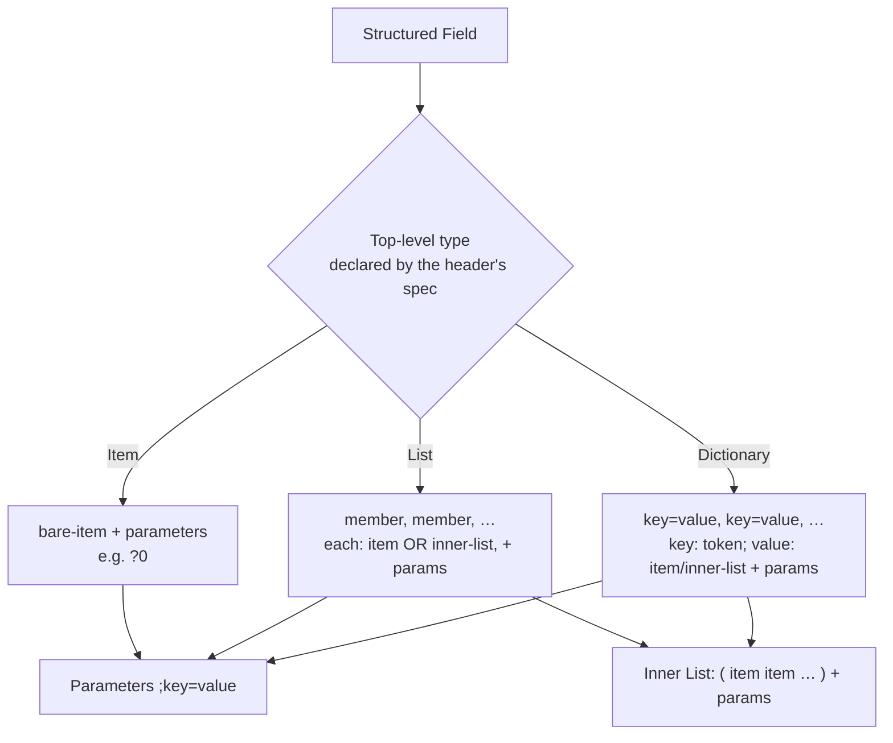

# Structured Field Values

For thirty years, every new HTTP header invented its own micro-grammar. `Cache-Control` uses comma-separated directives with optional `=value`. `Accept` uses commas plus `;q=` parameters. `Content-Type` uses one value plus `;` parameters. `Cookie` uses `;` between pairs but `Set-Cookie` uses it between attributes. `Content-Disposition` bolts on RFC 8187 percent-encoding for Unicode filenames. Each one needed a bespoke parser, each parser had its own edge cases, and each edge case was a bug or a security hole (the whole [Header Syntax and Grammar](./Header-Syntax-and-Grammar.md) chapter exists because of this sprawl).

**Structured Field Values (SFV)**, specified in RFC 8941 (and updated by RFC 9651, which added Dates and Display Strings), is the fix. It defines a small, fixed set of data types and a single serialization/parsing algorithm that *all new headers are expected to use*. Write one SFV parser, and you can read every structured header — present and future — correctly, including the tricky bits like nested parameters and unambiguous binary data.

This chapter covers the type system, the three top-level container shapes, which real headers already use SFV, why it matters for interoperability and security, and how to parse it in Node.

## Why SFV exists

Three concrete problems it solves:

1. **Ambiguity and divergent parsers.** Two implementations of `Cache-Control` could disagree on whether `max-age = 60` (with spaces) is valid, or how to handle a duplicate directive. SFV removes the guesswork: there is exactly one algorithm, and inputs that don't conform are simply *rejected as a whole* rather than partially and inconsistently accepted. This "fail closed" stance kills a class of parser-differential attacks (request smuggling, cache poisoning) that arise when a proxy and an origin parse the same bytes differently.

2. **No more per-header binary/Unicode hacks.** Want to put raw bytes in a header? Classic headers had no answer, so people base64'd values ad hoc and documented it in prose. SFV has a first-class **Byte Sequence** type (`:base64:`). Want non-ASCII text? RFC 9651 adds **Display Strings**. The container knows the type, so the parser knows what to do.

3. **Composability.** Because parameters, inner lists, and typed items are defined once, a header author designs a new header by *composing* existing pieces (“a List of Tokens, each with a `q` Parameter that is a Decimal”) instead of writing grammar from scratch. Less grammar authored means fewer bugs shipped.

The tradeoff: SFV is stricter than the old free-for-all. It has no comments, tightly bounded numeric ranges, and rejects malformed input outright. That strictness is the point — but it means you cannot retrofit SFV onto a legacy header whose real-world traffic contains non-conforming values. SFV is for *new* headers (and a few that were carefully designed to be SFV-compatible).

## The type system

SFV defines a handful of **bare item** types, plus **parameters**, plus three **top-level** container shapes.

### Bare items

| Type | Example | Maps to (JS) | Rules |
|---|---|---|---|
| **Integer** | `42`, `-17` | `number` | Up to 15 digits; range −999,999,999,999,999 … 999,999,999,999,999. |
| **Decimal** | `3.14`, `-0.5` | `number` | Max 12 integer digits, max 3 fractional digits. Not floats-with-exponents. |
| **String** | `"hello world"` | `string` | Double-quoted; only ASCII; `\"` and `\\` escapes; no other escapes, no raw control chars. |
| **Token** | `gzip`, `application/json`, `*` | `string` (tagged) | Bare word starting with ALPHA or `*`, then tchar/`:`/`/`. Used for identifiers, media types, keys. |
| **Byte Sequence** | `:cHJldGVuZA==:` | `Uint8Array`/`Buffer` | Base64 between colons. First-class binary. |
| **Boolean** | `?1` (true), `?0` (false) | `boolean` | The leading `?` is what distinguishes a Boolean from a Token. |
| **Date** (RFC 9651) | `@1659578233` | `Date` | `@` + Integer seconds since Unix epoch. Replaces IMF-fixdate for new headers. |
| **Display String** (RFC 9651) | `%"caf%c3%a9"` | `string` | `%"…"` with UTF-8 percent-encoding. For human-facing Unicode text. |

Two distinctions that trip people up:

- **Token vs String.** `foo` is a Token (an identifier). `"foo"` is a String (arbitrary text). They are *different types*, and a header defines which one a slot expects. A media type like `text/html` is a Token; a filename is a String. Don't quote a Token or bare-word a String.
- **Boolean vs Token.** `?1` is Boolean true. `sponsor` is a Token. The `?` prefix is the only signal — this is deliberate so booleans are unambiguous.

### Parameters

Any item (and any member of a List or Dictionary) can carry **parameters** — an ordered set of `;key=value` pairs where the key is a Token and the value is a bare item. A parameter with no value defaults to Boolean `true`. This is SFV's formalization of the `;q=0.9` pattern you already know from `Accept`:

```
text/html;q=0.9;charset="utf-8"
```

Here `text/html` is a Token item with two parameters: `q` (Decimal `0.9`) and `charset` (String `"utf-8"`).

### The three top-level shapes

Every structured header is defined, in its own spec, as exactly one of these:

1. **Item** — a single bare item plus optional parameters. Example: `Content-Length`-style single numbers, or `Sec-CH-UA-Mobile: ?0` (a Boolean item).

2. **List** — an ordered sequence of items *or inner-lists*, comma-separated, each member optionally parameterized. Example (`Accept-CH`):
   ```
   Accept-CH: Sec-CH-UA, Sec-CH-UA-Mobile, Sec-CH-UA-Platform
   ```
   An **Inner List** is a parenthesized, space-separated group that itself can be a List member and can be parameterized:
   ```
   ("foo" "bar");level=1, ("baz")
   ```

3. **Dictionary** — an ordered map of Token keys to values (each value an item or inner-list, optionally parameterized). Comma-separated `key=value`; a key with no `=` is a Boolean-true member. Example (`Priority`, RFC 9218):
   ```
   Priority: u=1, i
   ```
   `u=1` maps key `u` to Integer `1`; `i` is key `i` with implicit Boolean `true` (incremental).



The crucial architectural point: **you cannot parse a structured field without knowing which of the three shapes its spec declares.** The same bytes `a=1` parse as a Dictionary but are not a valid List or Item. So an SFV parser API always takes the expected type as an argument (`parseDictionary`, `parseList`, `parseItem`).

## Which real headers use SFV

SFV adoption is growing steadily. Headers that are defined as (or explicitly compatible with) Structured Fields include:

- **Client Hints** — the whole family: `Accept-CH` (List of Tokens), `Sec-CH-UA` (List with parameters), `Sec-CH-UA-Mobile` (Boolean Item `?0`/`?1`), `Sec-CH-UA-Platform` (String Item), `Sec-CH-Prefers-Color-Scheme`, etc. Client Hints were designed SFV-native.
- **`Priority`** (RFC 9218, HTTP prioritization) — a Dictionary: `u=` urgency (Integer 0–7), `i` incremental (Boolean).
- **`Cache-Status`** (RFC 9211) and **`Proxy-Status`** (RFC 9209) — how CDNs/proxies report cache hits and forwarding status; both Lists of Items with rich parameters.
- **`Signature`** and **`Signature-Input`** (RFC 9421, HTTP Message Signatures) — Dictionaries carrying Byte Sequences and Inner Lists. This is the payoff of the Byte Sequence type.
- **`Content-Digest` / `Repr-Digest` / `Want-*-Digest`** (RFC 9530) — Dictionaries mapping algorithm Tokens to Byte Sequence digests.
- **`Client-Cert` / `Client-Cert-Chain`** (RFC 9440) — Byte Sequences carrying certificates.

Note what is **not** SFV: `Cache-Control`, `Accept`, `Content-Type`, `Set-Cookie`, `Vary`, and the rest of the classic headers. They are *SFV-ish* in spirit — `Cache-Control` looks almost exactly like a Dictionary, and `Accept` looks almost exactly like a List with parameters — but their deployed traffic contains inputs that a strict SFV parser would reject, so they cannot be retrofitted without breaking the web. Recognizing this "looks structured but isn't officially" distinction saves you from feeding a legacy header into a strict SFV parser and getting spurious rejections.

## Parsing SFV in Node

You should not hand-write an RFC 8941 parser — the escaping, base64 boundaries, and numeric-range rules have subtle edge cases, and a differential between your parser and the sender's is a security bug. Use `structured-headers` (the reference-quality npm library, tracks RFC 8941/9651):

```js
import {
  parseList,
  parseDictionary,
  parseItem,
  serializeDictionary,
} from 'structured-headers';

// --- Parsing the Priority header (a Dictionary) ---------------------------
const priority = parseDictionary('u=1, i');
// Map { 'u' => [1, Map(0)], 'i' => [true, Map(0)] }
//   each entry is [ bareValue, parametersMap ]
const urgency = priority.get('u')?.[0];        // 1  (Integer)
const incremental = priority.get('i')?.[0];    // true (Boolean, implicit)

// --- Parsing Accept-CH (a List of Tokens) ---------------------------------
const hints = parseList('Sec-CH-UA, Sec-CH-UA-Mobile, Sec-CH-UA-Platform');
// each member is [ value, paramsMap ]; value is a Token wrapper
const hintNames = hints.map(([token]) => token.toString());
// [ 'Sec-CH-UA', 'Sec-CH-UA-Mobile', 'Sec-CH-UA-Platform' ]

// --- Parsing a member-with-parameters -------------------------------------
const cacheStatus = parseList('ExampleCache; hit; ttl=376');
const [name, params] = cacheStatus[0];
name.toString();        // 'ExampleCache' (Token)
params.get('hit');      // true  (Boolean-true param, no value)
params.get('ttl');      // 376   (Integer param)

// --- Serializing back out (Dictionary) ------------------------------------
const dict = new Map([
  ['u', [3, new Map()]],           // u = 3
  ['i', [true, new Map()]],        // i (boolean true)
]);
serializeDictionary(dict);         // 'u=3, i'
```

Notes on the API shape that reflect the spec faithfully:

- **Every value comes back as `[bareValue, parametersMap]`.** Parameters are always present (empty `Map` if none) because *any* item may be parameterized. Don't destructure assuming no params.
- **Tokens are wrapped objects, not plain strings.** The library distinguishes a Token from a String precisely because SFV does. Call `.toString()` when you want the identifier text. If you conflate them, you can serialize a Token as a quoted String and change the meaning.
- **Byte Sequences come back as `Uint8Array`/`Buffer`**, already base64-decoded. Booleans as `boolean`, Integers/Decimals as `number`, Dates as `Date`.
- **Parse errors throw.** Per RFC 8941, a field that fails to parse is discarded whole — mirror that: catch, log, and treat the header as absent rather than trying to salvage a partial value.

### Designing your own structured header

If you are inventing an internal header (a `Trace-Context`-style value, a feature-flag bundle), define it as SFV from day one instead of a bespoke CSV. You get free, correct parsers in every language, unambiguous types, and forward-compat parameters:

```
X-Feature-Flags: dark-mode, beta-search;rollout=0.25, new-checkout;region="us-east"
```

That is a List of Tokens where each member can carry typed parameters — no custom grammar, and any SFV `parseList` reads it. Compare to the untyped, ambiguous `X-Feature-Flags: dark-mode,beta-search:0.25,new-checkout:us-east` you'd otherwise hand-roll and hand-parse. (Naming/propagation caveats for custom headers live in [Custom and X- Headers](./Custom-and-X-Headers.md).)

## Mental Model

Classic HTTP headers are like **CSV files where every column invented its own quoting rules** — you need a different, hand-written parser for each one, and every parser has a lurking edge case.

Structured Field Values are **JSON for headers**: a fixed, tiny type system (numbers, strings, tokens, bytes, booleans, dates), three container shapes (a single value = Item, an array = List, an object = Dictionary), and one parser everyone shares. Just as you'd never hand-roll JSON parsing per-field, SFV means you never hand-roll header parsing per-header again.

The one thing JSON doesn't have that SFV does — and the thing to keep front of mind — is that **the container shape is declared out-of-band by the header's spec, not by the bytes.** You must tell the parser "this is a Dictionary" the same way you must know a config file is TOML before you parse it. Get the shape right, and everything else — types, parameters, binary, Unicode — falls out of one well-tested algorithm instead of fifty fragile ones.
