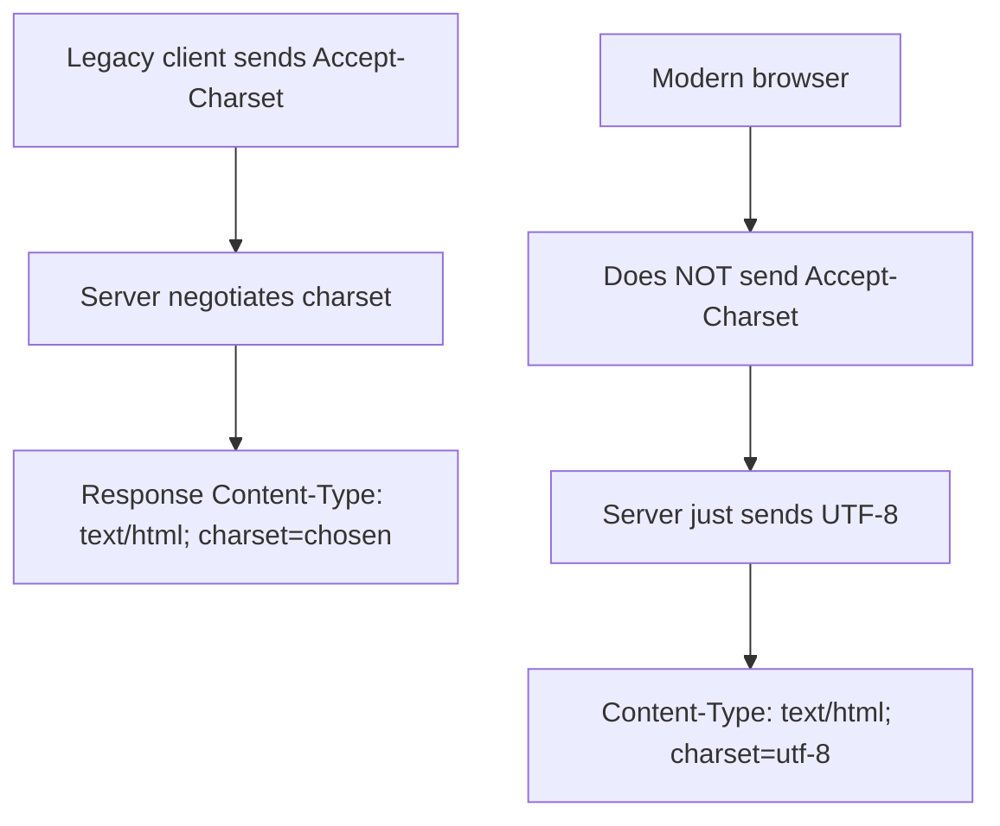
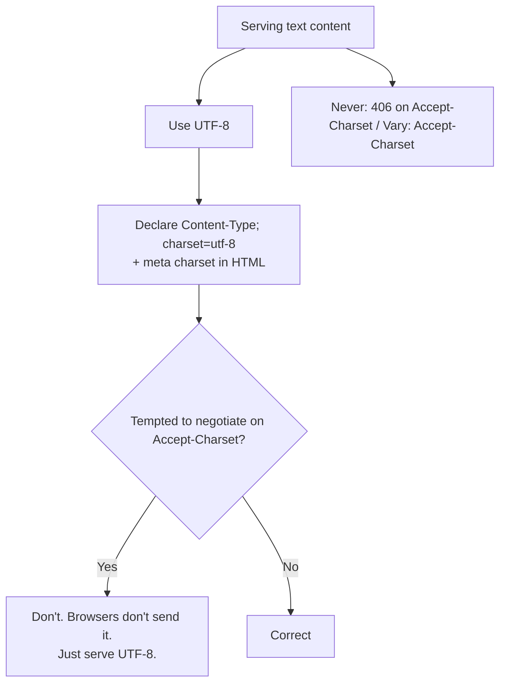

# Accept-Charset

## Quick Summary

`Accept-Charset` is a **request** header by which a client historically advertised **which character encodings it could understand** — e.g. `Accept-Charset: utf-8, iso-8859-1;q=0.5` — so the server could negotiate the response's charset. It is one of the original `Accept-*` content-negotiation headers, but it is now **obsolete and deliberately removed from modern browsers**: the web has standardized on **UTF-8** for essentially everything, so charset negotiation became pointless and, worse, a fingerprinting vector. The **Fetch Standard forbids** JavaScript from setting `Accept-Charset`, and browsers **no longer send it** at all. You will still see it referenced in older specs, legacy systems, and some non-browser HTTP clients, and understanding it matters for maintaining old code — but for any new work the guidance is unambiguous: **use UTF-8 everywhere, declare it via [`Content-Type; charset=utf-8`](./Content-Type.md), and do not rely on `Accept-Charset`**. It's included here primarily so you recognize it, know *why* it's dead, and don't waste effort implementing charset negotiation that no modern client will ever exercise.

## What problem does this header solve?

In the early web, text could be encoded in many incompatible character sets — ASCII, the ISO-8859 family (Latin-1, etc.), Windows-1252, Shift_JIS, EUC-KR, GB2312, and many more. A document encoded in Shift_JIS displayed as garbage ("mojibake") if the client interpreted it as ISO-8859-1. Different clients (old browsers, terminals, regional systems) supported different charsets. `Accept-Charset` let a client tell the server "here are the encodings I can render, ranked by preference," so a server with a document available in multiple encodings could **negotiate and send one the client could actually display** — solving the mojibake problem at the protocol level.

That was a real problem *in the pre-UTF-8 era*. UTF-8 solved it far more thoroughly: a single encoding that represents every character in Unicode, understood by every modern system. Once UTF-8 became universal, there was nothing left to negotiate — everyone accepts UTF-8, and servers just send UTF-8. `Accept-Charset` became a solution to a problem that no longer exists, which is exactly why browsers dropped it.

## Why was it introduced?

`Accept-Charset` was part of HTTP/1.1 (RFC 2068, 1997; RFC 2616, 1999) as one of the proactive-content-negotiation `Accept-*` headers, addressing the genuinely fragmented charset landscape of the 1990s. Over the following decades, **UTF-8 adoption became overwhelming** (it now encodes the vast majority of the web), making charset negotiation increasingly irrelevant. Two forces then killed the header outright: (1) **fingerprinting** — the specific charset list a client advertised added entropy that helped track users, and browsers have been systematically removing such low-value fingerprinting surface; (2) **redundancy** — since everything is UTF-8, the header conveyed no useful choice. Modern HTTP (RFC 9110) notes `Accept-Charset` as **deprecated**, the **WHATWG Fetch Standard forbids** setting it from JS, and browsers stopped sending it (Chrome/Firefox removed it years ago). It survives only in legacy contexts.

## How does it work?

*Historically*, the client sent `Accept-Charset` with weighted charset preferences; the server matched against the encodings it could produce and returned the response in the best-supported charset, declaring it in [`Content-Type; charset=...`](./Content-Type.md). If nothing matched, the server could return `406 Not Acceptable`.



- **Browser behavior:** Modern browsers **do not send** `Accept-Charset` and JS **cannot set** it (forbidden header). They assume UTF-8 and rely on the response's declared charset.
- **Server behavior:** Should **ignore** `Accept-Charset` for negotiation and simply serve UTF-8 with an explicit [`Content-Type; charset=utf-8`](./Content-Type.md). Implementing charset negotiation is wasted effort.
- **Proxy/CDN behavior:** Pass it through if present (from legacy clients), but it rarely appears.
- **Reverse proxy behavior:** No special handling needed; ensure responses declare UTF-8.
- **Non-browser clients:** Some legacy HTTP libraries/tools may still send it; servers can safely ignore it.

## HTTP Request Example

The (legacy) form — you'll rarely see this from a real browser today:

```http
GET /page HTTP/1.1
Host: legacy.example.com
Accept-Charset: utf-8, iso-8859-1;q=0.7, *;q=0.3
```

A modern browser request simply **omits** it:

```http
GET /page HTTP/1.1
Host: www.example.com
Accept: text/html
Accept-Language: en-US, en;q=0.9
```

## HTTP Response Example

The correct modern response — always UTF-8, explicitly declared (no charset negotiation):

```http
HTTP/1.1 200 OK
Content-Type: text/html; charset=utf-8
Content-Length: 1234

<!doctype html><html lang="en">...
```

A legacy `406` (what a server *might* have returned if it couldn't satisfy `Accept-Charset`) — avoid this pattern in new systems:

```http
HTTP/1.1 406 Not Acceptable
Content-Type: text/plain; charset=utf-8

No acceptable charset available
```

## Express.js Example

```js
const express = require('express');
const app = express();

// CORRECT modern approach: ignore Accept-Charset, always serve UTF-8, declare it.
app.get('/page', (req, res) => {
  // Do NOT negotiate charset. Just send UTF-8 and label it.
  res.set('Content-Type', 'text/html; charset=utf-8');
  res.send('<!doctype html><html lang="en"><body>Café — naïve — 日本語</body></html>');
  // Express also defaults text/html and json to charset=utf-8 automatically.
});

// res.json / res.send set UTF-8 by default:
app.get('/api/data', (req, res) => {
  res.json({ msg: 'Café 日本語' }); // Content-Type: application/json; charset=utf-8 (utf-8 implied for JSON)
});

// ANTI-PATTERN (do not do this): attempting charset negotiation.
app.get('/legacy-bad', (req, res) => {
  const ac = req.headers['accept-charset']; // almost always absent from browsers
  // Branching on this is wasted effort — no modern client exercises it.
  res.set('Content-Type', 'text/html; charset=utf-8').send('just use utf-8');
});

app.listen(3000);
```

Why each piece matters: the correct approach is simply to **always emit UTF-8** and declare it via [`Content-Type; charset=utf-8`](./Content-Type.md) — Express does this by default for `res.send`/`res.json`. Reading `req.headers['accept-charset']` (the anti-pattern) is pointless: browsers don't send it, so any negotiation branch is dead code that no real user exercises. The one genuinely important thing is the **explicit `charset=utf-8` declaration on the response**, because *that's* how the browser knows how to decode your bytes — the negotiation header is obsolete, but the response charset declaration remains essential.

## Node.js Example

Raw `http`:

```js
const http = require('http');

http.createServer((req, res) => {
  // Ignore any Accept-Charset; always respond in UTF-8 with an explicit declaration.
  res.setHeader('Content-Type', 'text/html; charset=utf-8');
  // Ensure the string is encoded as UTF-8 on the wire (Node strings → utf8 by default).
  res.end('<!doctype html><meta charset="utf-8"><p>Café 日本語 — emoji 🎉</p>');
}).listen(3000);
```

The lesson: don't inspect `Accept-Charset`; the only charset concern that matters is **declaring UTF-8 on your response** (and, for HTML, also including `<meta charset="utf-8">` as a belt-and-suspenders in-document declaration).

## React Example

React has **no interaction** with `Accept-Charset` — browsers don't send it, and JS can't set it (forbidden header). The relevant charset concerns for React apps are entirely about *response* and *document* declarations, not negotiation:

1. **Serve everything as UTF-8.** Your `index.html` should include `<meta charset="utf-8">` (Create React App/Vite templates do), and your server should send `Content-Type: text/html; charset=utf-8`. This is what makes accented characters, non-Latin scripts, and emoji render correctly.

2. **APIs are UTF-8 JSON.** `fetch(...).then(r => r.json())` decodes UTF-8 automatically; ensure your API sends `application/json` (UTF-8 is the JSON default). No `Accept-Charset` needed.

3. **Don't try to set it.** Any attempt to add `Accept-Charset` to a fetch is silently ignored (forbidden header). There's simply nothing to do here — just use UTF-8 end-to-end.

## Browser Lifecycle

There is **no modern browser lifecycle** for `Accept-Charset`. Browsers:
1. **Do not generate** it on requests.
2. **Do not allow** JS to set it (it's a forbidden header per the Fetch Standard).
3. **Assume UTF-8** and decode responses per the response's declared charset ([`Content-Type; charset`](./Content-Type.md), or `<meta charset>` for HTML, or BOM/detection as fallback).
Its entire (historical) lifecycle — advertise charsets → server negotiates → decode chosen charset — is defunct. The only live charset mechanism today is the **response's** charset declaration.

## Production Use Cases

- **None for new development.** There is no modern use case for *relying on* `Accept-Charset`.
- **Legacy interop (read-only awareness):** understanding it when maintaining old systems or debugging traffic from ancient clients/tools that still send it.
- **Historical protocol understanding:** knowing the `Accept-*` family and why charset negotiation existed and died.
- **The actual production task it's associated with** — ensuring correct text rendering — is handled entirely by **serving and declaring UTF-8**, not by this header.

## Common Mistakes

- **Implementing charset negotiation.** Wasted effort; no modern client sends `Accept-Charset`. Just serve UTF-8.
- **Returning `406` based on it.** Never do this in new systems; it can break clients for no benefit.
- **Trying to set it from JS.** Forbidden and ignored.
- **Confusing it with the response charset.** The *response's* `Content-Type; charset=utf-8` is essential and very much alive; the *request's* `Accept-Charset` is dead. Don't conflate them.
- **Not declaring UTF-8 on responses.** The real bug that causes mojibake — omitting `charset=utf-8` — is unrelated to `Accept-Charset` but often confused with it.
- **Using a non-UTF-8 encoding for new content.** There's no reason to; UTF-8 is universal.

## Security Considerations

- **Fingerprinting (why it was removed).** A client's advertised charset list added tracking entropy; removing `Accept-Charset` reduced fingerprinting surface. Don't reintroduce charset-based client differentiation.
- **Charset confusion / XSS.** Historically, *mismatched or undeclared* charsets enabled attacks (e.g. UTF-7-based XSS where a page's charset was misinterpreted). The mitigation is **always declaring UTF-8 explicitly** on responses (and [`X-Content-Type-Options: nosniff`](../05-Security-Headers/X-Content-Type-Options.md)), not negotiating via `Accept-Charset`.
- **Not a security control itself.** It provides no protection; the security-relevant action is deterministic UTF-8 declaration.

## Performance Considerations

- **Negligible / irrelevant.** Since browsers don't send it, there's nothing to process.
- **Avoids cache fragmentation:** *not* varying on charset (which you shouldn't, since everything is UTF-8) keeps caches simple. Never add `Vary: Accept-Charset`.
- **UTF-8 everywhere** is also operationally simplest — one encoding, no negotiation branches, no per-charset variants.

## Reverse Proxy Considerations

Nginx: ensure responses declare UTF-8; there's no charset negotiation to configure.

```nginx
http {
  charset utf-8;            # append "; charset=utf-8" to text/* Content-Types.
  charset_types text/html text/plain text/css application/javascript application/json;

  server {
    location / {
      proxy_pass http://app_upstream;
      # No Accept-Charset handling needed; the app/proxy just serves UTF-8.
    }
  }
}
```

Key points: the useful directive is `charset utf-8` (to *declare* UTF-8 on responses), not anything about `Accept-Charset`. Don't build negotiation logic around the request header.

## CDN Considerations

- **No negotiation needed:** serve UTF-8 and declare it; don't key caches on `Accept-Charset`.
- **Pass-through:** if a legacy client sends it, CDNs forward it, but it should have no effect on the response.
- **Avoid `Vary: Accept-Charset`:** it would needlessly fragment the cache for zero benefit.
- **Ensure charset declaration** is present on cached text responses so all clients decode correctly.

## Cloud Deployment Considerations

- **Everywhere:** default to UTF-8 in your app, database, and file storage; declare `charset=utf-8` on responses.
- **Object storage (S3/GCS):** set `Content-Type: text/html; charset=utf-8` (or appropriate) on text objects.
- **API Gateways/serverless:** ensure JSON/text responses are UTF-8-declared; ignore `Accept-Charset`.
- **No platform needs charset negotiation** configured.

## Debugging

- **Confirm the browser doesn't send it:** inspect a request in DevTools → Network → Headers; you won't find `Accept-Charset`.
- **Fix mojibake by checking the RESPONSE charset:** DevTools shows the response `Content-Type`; ensure `charset=utf-8`. Garbled text almost always means a missing/incorrect *response* charset, not anything about `Accept-Charset`.
- **curl:** `curl -sD - -o /dev/null https://host/ | grep -i content-type` → verify `charset=utf-8`. Sending `-H 'Accept-Charset: iso-8859-1'` should change nothing.
- **`<meta charset>` check:** view source and confirm the HTML declares UTF-8 near the top.
- **Encoding audit:** ensure files/DB/connection all use UTF-8 to avoid mixed-encoding corruption.

## Best Practices

- [ ] **Use UTF-8 everywhere** (app, DB, files, responses).
- [ ] **Declare** `Content-Type: ...; charset=utf-8` on text responses (and `<meta charset="utf-8">` in HTML).
- [ ] **Do not** implement charset negotiation or branch on `Accept-Charset`.
- [ ] **Never** return `406` based on `Accept-Charset`, and don't add `Vary: Accept-Charset`.
- [ ] Don't attempt to set `Accept-Charset` from JS (forbidden/ignored).
- [ ] Pair UTF-8 declaration with [`X-Content-Type-Options: nosniff`](../05-Security-Headers/X-Content-Type-Options.md) to prevent charset/MIME-confusion attacks.
- [ ] Treat this header as **legacy awareness only**.

## Related Headers

- [Content-Type](./Content-Type.md) — carries the live, essential `charset` declaration on responses (this is what actually matters).
- [Accept](./Accept.md) — media-type negotiation sibling (still relevant).
- [Accept-Language](./Accept-Language.md) — language negotiation sibling (still relevant).
- [Accept-Encoding](../10-Compression/Accept-Encoding.md) — compression negotiation sibling (still relevant).
- [X-Content-Type-Options](../05-Security-Headers/X-Content-Type-Options.md) — mitigates MIME/charset sniffing attacks.
- [Content Negotiation Overview](../11-Content-Negotiation/Content-Negotiation-Overview.md) — the framing chapter (notes charset negotiation is obsolete).

## Decision Tree



## Mental Model

Think of `Accept-Charset` as a **phrasebook a traveler used to hand over listing which alphabets they could read** — Cyrillic, Latin, kanji — back when a document might arrive written in any of a dozen incompatible scripts, and handing you the wrong one meant an unreadable jumble (mojibake). It was a genuine necessity in a Tower-of-Babel era. But then the world adopted a *single universal script that can write every language* (UTF-8) — so there's simply nothing left to ask for; everyone reads the universal script, and every document is written in it. The phrasebook became a quaint relic, and worse, the *specific list* on it turned out to subtly identify travelers (fingerprinting), so the airport stopped issuing it entirely. Today the only thing that matters is that each document clearly *states which script it's written in* (`Content-Type; charset=utf-8`) — and since that's always the universal one, decoding just works. Recognize the old phrasebook when you see it in a museum (legacy systems), but never build anything that depends on it.
