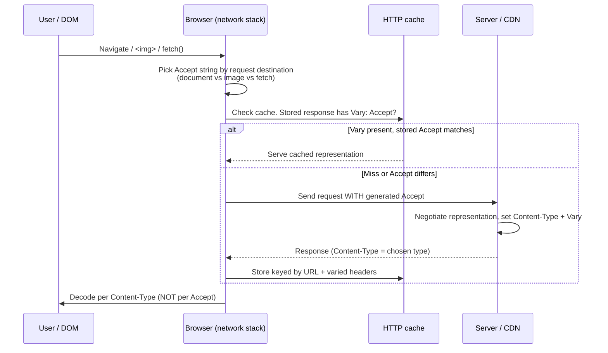
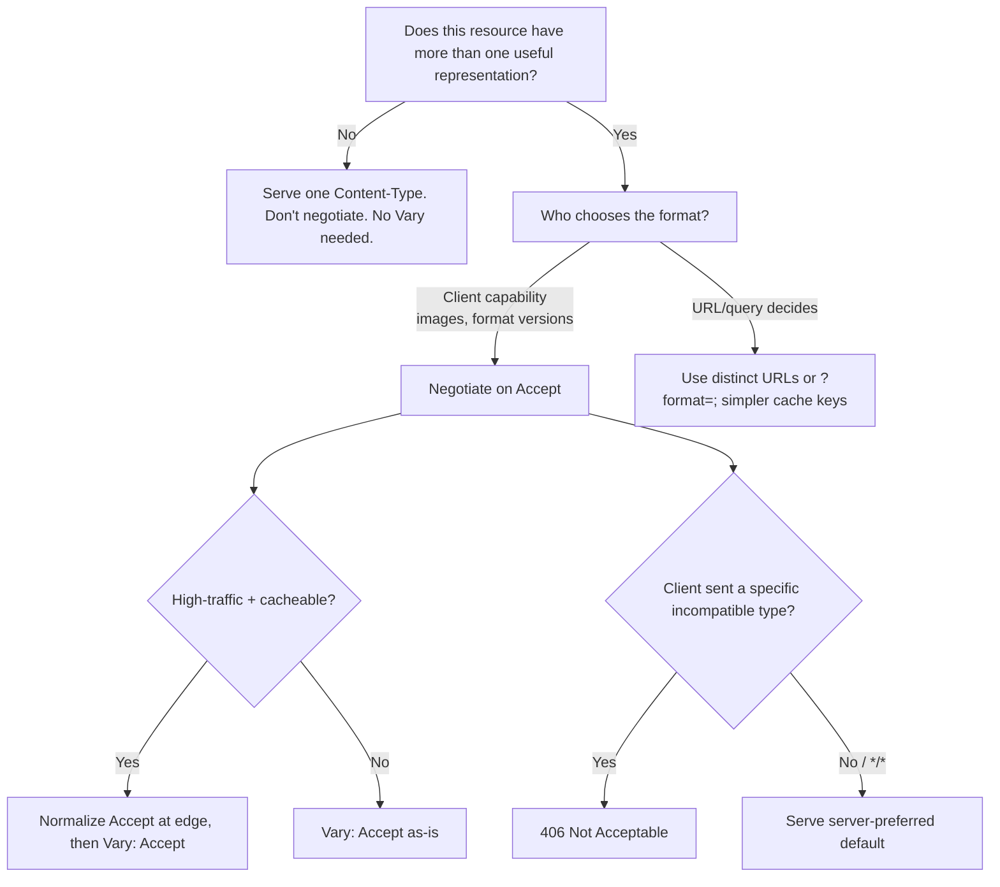

# Accept

## Quick Summary

`Accept` is a **request** header the client sends to tell the server which **media types** (MIME types) it is willing to receive in the response body, and — via **quality values (`q`)** — its *relative preference* among them. It is the driving side of **proactive content negotiation**: the client advertises what it can render (`text/html`, `application/json`, `image/webp`, …), the server picks the best matching **representation** of the resource and echoes its choice in the response [`Content-Type`](../04-Response-Headers/Content-Type.md). If the server can produce nothing acceptable, it may answer `406 Not Acceptable`. `Accept` never describes the request body — that job belongs to the request-side [`Content-Type`](./Content-Type.md).

## What problem does this header solve?

A single URL can legitimately have **multiple representations**. `/api/users/42` might be serializable as JSON, XML, CSV, or an HTML page. `/logo` might exist as AVIF, WebP, PNG, and GIF. The resource (the abstract "user 42" or "the logo") is one thing; the bytes you hand back are a *representation* of it.

Without negotiation you would have to bake the format into the URL (`/api/users/42.json`, `/logo.webp`) or into a query string, fragmenting your cache keys, your links, and your API surface. `Accept` lets **one canonical URL** serve the right bytes to each client based on what that client can actually consume:

- An old browser that can't decode AVIF sends `Accept: image/png` and gets PNG.
- A modern browser sends `Accept: image/avif,image/webp,image/*` and gets AVIF.
- A `curl` script sends `Accept: application/json` against a hypermedia endpoint that also renders HTML and gets machine-readable JSON.

The concrete production win: **stable, shareable, cacheable URLs** that transparently upgrade as clients gain capabilities, without the server guessing from `User-Agent`.

## Why was it introduced?

`Accept` dates back to HTTP/1.0 (RFC 1945, 1996) and was formalized in HTTP/1.1 (RFC 2068 → RFC 2616). The design goal was **format independence**: the web was meant to be a space of *resources* addressable by URI, where the concrete media type was a negotiated detail, not part of the identity of the thing. The mechanism — a comma-separated list of media ranges with `q` weights — is defined today in **RFC 9110 §12.5.1**.

The idea predates the modern reality that most APIs pick JSON and stop thinking about it, but negotiation remained genuinely valuable in two areas that grew *after* the spec: **image format negotiation** (WebP/AVIF rollout) and **API versioning via custom media types** (`application/vnd.myapp.v2+json`). Both lean directly on `Accept`.

## How does it work?

The value is a comma-separated list of **media ranges**, each optionally carrying parameters and a `q` weight between `0` and `1` (up to three decimal places). Everything after the `q` parameter is an "accept extension" and is rarely used.

```
Accept = media-range [ ";" "q=" qvalue [ accept-ext ] ] *( "," ... )
media-range = ( "*/*" | type "/*" | type "/" subtype ) *( ";" parameter )
```

Specificity of a media range, most to least specific: `type/subtype` (e.g. `text/html`) > `type/*` (e.g. `text/*`) > `*/*`. When a representation matches multiple ranges, **the most specific matching range wins**, and its `q` value determines preference. Absent `q`, the default is `q=1.0`. A range with `q=0` means "explicitly not acceptable."

- **Browser behavior:** Browsers generate `Accept` automatically and differently *per request destination*. Navigations send an HTML-leaning value like `text/html,application/xhtml+xml,application/xml;q=0.9,image/avif,image/webp,image/apng,*/*;q=0.8`. `` requests send an image-leaning value (`image/avif,image/webp,image/apng,image/svg+xml,image/*,*/*;q=0.8`). `fetch()`/`XHR` default to `*/*` unless you override. You cannot make the browser lie about navigation `Accept`, but you fully control it for `fetch`/`XHR`.
- **Server behavior:** The server enumerates the representations it can produce for the resource, scores each against the client's media ranges (most-specific match, then `q`), and serves the highest-scoring one — setting response [`Content-Type`](../04-Response-Headers/Content-Type.md) accordingly and, if the choice depends on the header, emitting [`Vary: Accept`](../06-Caching-Headers/Vary.md). If nothing scores above zero, it returns `406 Not Acceptable` (or, pragmatically, serves a sensible default anyway — see Common Mistakes).
- **Proxy behavior:** Forward proxies pass `Accept` through unchanged. Any shared cache that stores a negotiated response **must** honor the response's `Vary` header, keying the cache on the relevant request headers. A proxy that ignores `Vary` will serve JSON to a client that asked for HTML.
- **CDN behavior:** CDNs treat `Accept` as part of the cache key **only** when the origin says `Vary: Accept`. Because raw `Accept` strings are extremely high-cardinality (every browser build sends a slightly different one), naive `Vary: Accept` on a CDN shreds your hit ratio. CDNs solve this with **normalization** — e.g. Cloudflare Polish / Image Resizing collapse `Accept` down to "does it contain `image/webp`/`image/avif`?" before keying. See CDN Considerations.
- **Reverse proxy behavior:** Nginx/Apache/HAProxy forward `Accept` to the upstream untouched. Nginx can *branch* on it with `map $http_accept ...` (e.g. to route WebP-capable clients to pre-generated WebP files), and must be configured to include it in any proxy cache key when the upstream varies on it.

## HTTP Request Example

A browser navigation requesting a page, willing to also take images and anything else at lower priority:

```http
GET /articles/42 HTTP/1.1
Host: blog.example.com
Accept: text/html,application/xhtml+xml,application/xml;q=0.9,image/avif,image/webp,*/*;q=0.8
Accept-Language: en-US,en;q=0.9
```

An API client that will *only* accept JSON — and wants a hard `406` otherwise:

```http
GET /api/users/42 HTTP/1.1
Host: api.example.com
Accept: application/json
```

Requesting a specific API version through a vendor media type:

```http
GET /api/users/42 HTTP/1.1
Host: api.example.com
Accept: application/vnd.example.v2+json, application/json;q=0.5
```

## HTTP Response Example

Server honored `application/json` and signals the choice was negotiated:

```http
HTTP/1.1 200 OK
Content-Type: application/json; charset=utf-8
Vary: Accept
Content-Length: 57

{"id":42,"name":"Ada Lovelace","role":"engineer"}
```

Nothing acceptable could be produced:

```http
HTTP/1.1 406 Not Acceptable
Content-Type: application/json; charset=utf-8
Vary: Accept

{"error":"not_acceptable","supported":["application/json","text/csv"]}
```

## Express.js Example

Express exposes negotiation through `req.accepts()` and the higher-level `res.format()`. Both wrap the [`negotiator`](https://www.npmjs.com/package/negotiator) library, which implements the RFC 9110 scoring rules for you.

```js
const express = require('express');
const app = express();

// --- Pattern 1: res.format() — declarative, sets Vary + 406 automatically ---
app.get('/api/users/:id', async (req, res) => {
  const user = await getUser(req.params.id);

  res.format({
    // Each key is an offered media type. Express scores req.headers.accept
    // against these keys and invokes the handler for the best match.
    'application/json': () => {
      // res.json() sets Content-Type: application/json and serializes.
      res.json(user);
    },
    'text/csv': () => {
      // We won this branch because the client preferred CSV over JSON.
      res.type('text/csv').send(toCsv(user));
    },
    'text/html': () => {
      res.render('user', { user });
    },
    // 'default' fires when nothing matches. WITHOUT this, Express sends 406
    // automatically — which is often exactly what an API wants.
    default: () => {
      res.status(406).json({
        error: 'not_acceptable',
        supported: ['application/json', 'text/csv', 'text/html'],
      });
    },
  });
  // CRITICAL SIDE EFFECT: res.format() appends `Vary: Accept` to the response.
  // If you hand-roll negotiation without setting Vary, shared caches will
  // serve one client's negotiated representation to another. Do not remove it.
});

// --- Pattern 2: req.accepts() — imperative, when you need to branch yourself ---
app.get('/report/:id', async (req, res) => {
  // Returns the best matching type from the offered list, or false if none.
  // The ORDER of your offer list is the server's own preference and breaks
  // ties when the client expresses no preference (e.g. Accept: */*).
  const type = req.accepts(['json', 'csv', 'html']);

  if (!type) {
    // No offered type is acceptable to the client -> 406 is the honest answer.
    return res.status(406).send('Not Acceptable');
  }

  const report = await buildReport(req.params.id);
  res.vary('Accept'); // MUST set Vary manually here; req.accepts() does not.

  switch (type) {
    case 'json': return res.json(report);
    case 'csv':  return res.type('csv').send(toCsv(report));
    case 'html': return res.render('report', { report });
  }
});

// req.accepts() understands extensions ('json') AND full types ('application/json').
// Related helpers, same negotiation engine, different header:
//   req.acceptsCharsets(), req.acceptsEncodings(), req.acceptsLanguages()
```

Why each piece matters: `res.format` centralizes the match-and-dispatch logic and *guarantees* the `Vary: Accept` header is present — the single most-forgotten correctness requirement of content negotiation. The `default` branch is your `406` policy; omit it and Express's built-in `406` fires, which is stricter than most public APIs want (see Common Mistakes). `req.accepts()` returning `false` is the unambiguous "I cannot satisfy you" signal; treat it as `406`, never as "serve the default silently" unless that is a deliberate product decision.

## Node.js Example

Raw `http` gives you no negotiation engine — you parse `Accept` yourself or use `negotiator` directly. This exposes exactly what Express hides.

```js
const http = require('http');
const Negotiator = require('negotiator');

const server = http.createServer((req, res) => {
  // Negotiator reads req.headers and applies RFC 9110 scoring.
  const negotiator = new Negotiator(req);

  // Pass YOUR available representations; get back the client's best pick.
  // The list order encodes the server's preference for tie-breaks.
  const offered = ['application/json', 'text/html'];
  const chosen = negotiator.mediaType(offered); // string | undefined

  // Any response whose body depends on Accept MUST advertise it, so that
  // caches store separate entries per representation. This is not optional.
  res.setHeader('Vary', 'Accept');

  if (!chosen) {
    res.statusCode = 406;
    res.setHeader('Content-Type', 'application/json');
    return res.end(JSON.stringify({ error: 'not_acceptable', supported: offered }));
  }

  res.setHeader('Content-Type', `${chosen}; charset=utf-8`);
  if (chosen === 'application/json') {
    res.end(JSON.stringify({ id: 42, name: 'Ada' }));
  } else {
    res.end('<!doctype html><h1>Ada</h1>');
  }
});

server.listen(3000);
```

The takeaway: negotiation is *your* responsibility on raw Node. The two non-negotiable steps are (1) score the client's `Accept` against the exact set of formats you can emit, and (2) set `Vary: Accept` on every negotiated response.

## React Example

React never sets navigation `Accept` — the browser owns that. Where React *does* control it is in data-fetching, where you should send an explicit `Accept` instead of relying on the `*/*` default so your API can negotiate deterministically and return `406` on drift.

```jsx
import { useEffect, useState } from 'react';

function useUser(id) {
  const [state, setState] = useState({ status: 'loading' });

  useEffect(() => {
    const ac = new AbortController();
    fetch(`/api/users/${id}`, {
      // Be explicit. Default fetch Accept is */*, which tells the server
      // "anything goes" and defeats your negotiation + 406 contract.
      headers: { Accept: 'application/json' },
      signal: ac.signal,
    })
      .then(async (res) => {
        if (res.status === 406) {
          // The server literally cannot give us JSON. Surface it, don't retry blindly.
          throw new Error('Server cannot produce JSON for this resource');
        }
        // Defensive: confirm the server actually honored our Accept before parsing.
        const ct = res.headers.get('content-type') || '';
        if (!ct.includes('application/json')) {
          throw new Error(`Expected JSON, got ${ct}`);
        }
        return res.json();
      })
      .then((data) => setState({ status: 'ready', data }))
      .catch((err) => {
        if (err.name !== 'AbortError') setState({ status: 'error', error: err });
      });

    return () => ac.abort();
  }, [id]);

  return state;
}
```

Note the two guards: handling `406` explicitly (a legitimate, non-transient outcome you should not retry) and verifying the response `Content-Type` before calling `res.json()` — because a misconfigured server or an HTML error page can arrive with a `200` and blow up your parser. For image negotiation, React does *nothing*: you emit `` or a `<picture>` element and the browser's per-request `Accept` plus the server/CDN handles format selection.

## Browser Lifecycle



Key lifecycle facts: the browser chooses the `Accept` string based on the **request destination**, not on anything the developer sets for navigations; it consults the HTTP cache, and if a stored response carried `Vary: Accept`, the browser only reuses it when the current `Accept` matches the stored one; and after receiving the body, the browser decodes according to the **response `Content-Type`**, not the request `Accept` — `Accept` is a *wish*, `Content-Type` is the *fact*.

## Production Use Cases

- **REST API returning JSON, with CSV/Excel export from the same endpoint.** `GET /reports/sales` returns JSON to your SPA (`Accept: application/json`) and CSV to a finance user's download tool (`Accept: text/csv`), same URL, negotiated.
- **Media-type API versioning.** `Accept: application/vnd.example.v2+json` selects v2 of the payload schema without version-in-URL churn; older clients omitting it fall back to v1. Keeps URLs permanent while the schema evolves.
- **Image format negotiation at the edge.** The browser's image `Accept` includes `image/avif`/`image/webp`; the CDN or origin serves the smallest format each client can decode from one ``, no `<picture>` boilerplate.
- **Hypermedia + human-friendly dual endpoints.** The same resource renders as HTML in a browser and as JSON/HAL to an API client, enabling "browsable APIs" (Django REST Framework, Spring HATEOAS style).
- **Content-type gating for security tooling.** Forcing `Accept: application/json` on internal service-to-service calls so an accidentally HTML-rendering error page produces a clean `406`/parse failure instead of being silently consumed.

## Common Mistakes

- **Forgetting `Vary: Accept`.** You negotiate correctly but never tell caches the response depends on `Accept`. A CDN/shared cache then serves the first client's representation (say JSON) to everyone, including browsers that asked for HTML. This is the number-one negotiation bug.
- **Returning `406` too aggressively on public endpoints.** RFC 9110 permits serving a default representation even when nothing matches. Many browsers/tools send imperfect `Accept` values; a strict `406` breaks them. For public APIs, prefer "serve JSON as default, `406` only when the client sent a specific incompatible type."
- **Confusing `Accept` with request `Content-Type`.** `Accept` = "what I want back"; [`Content-Type`](./Content-Type.md) = "what I'm sending you." Developers set `Content-Type: application/json` on a `GET` (meaningless — no body) instead of `Accept: application/json`.
- **Trusting `Accept` for anything but format selection.** It's spoofable client input. Never gate authorization or business logic on it.
- **Relying on `Accept` ordering as preference.** Order in the header is *not* preference; **`q` value is**. `Accept: text/html, application/json` treats both as `q=1.0`; the server's own offer order breaks the tie, not the client's list order.
- **`Vary: Accept` on a high-cardinality endpoint without normalization.** Kills cache hit ratio because every browser build sends a unique `Accept`. Normalize at the edge or vary on a coarser signal.

## Security Considerations

`Accept` is untrusted, client-controlled input, so the risks are indirect rather than a direct injection vector:

- **Cache poisoning via `Vary` mishandling.** If your origin negotiates on `Accept` but omits `Vary: Accept`, or an intermediary ignores `Vary`, an attacker can prime a shared cache with one representation and serve it to victims expecting another (e.g. poisoning an HTML entry with a JSON body, or vice versa). Always emit accurate `Vary`.
- **Content-type confusion / MIME sniffing.** If negotiation lets a client coax the server into returning a body whose bytes don't match the declared type, downstream MIME sniffing can misinterpret it. Pair correct negotiation with [`X-Content-Type-Options: nosniff`](../05-Security-Headers/X-Content-Type-Options.md).
- **Amplified attack surface per format.** Every representation you offer is code that can have bugs (an XML serializer with XXE, a CSV export enabling formula injection). Only offer formats you actually maintain and secure.
- **Do not authorize on `Accept`.** Because it's forgeable, using it for access decisions is a bypass waiting to happen.

## Performance Considerations

- **Cache fragmentation is the dominant concern.** `Vary: Accept` multiplies cache entries by the number of distinct `Accept` strings seen. Raw browser `Accept` values are near-unique per build, so unnormalized varying can approach *zero* shared-cache benefit. Normalize `Accept` to the few dimensions you actually negotiate on.
- **Negotiation cost is negligible.** Scoring a handful of media ranges against a handful of offers is microseconds; it is never your bottleneck.
- **Image negotiation is a bandwidth win.** Serving AVIF/WebP to capable clients from one URL can cut image bytes 30–70% versus PNG/JPEG, more than paying back any cache complexity — provided the edge normalizes `Accept`.
- **Explicit `Accept` on API calls avoids round-trips.** Sending the precise type you want prevents the server from guessing and prevents a wrong-format `200` that forces a client retry.

## Reverse Proxy Considerations

Nginx forwards `Accept` upstream by default. Two common tasks: including it in the proxy cache key when the upstream varies, and branching on it to serve pre-generated variants.

```nginx
# Serve pre-built WebP when the client's Accept advertises it, else the original.
map $http_accept $webp_suffix {
    default        "";
    "~*image/webp" ".webp";   # regex, case-insensitive
}

server {
    location ~* ^/img/(?<name>.+)\.(png|jpe?g)$ {
        root /var/www;
        # try_files checks for name.png.webp first when $webp_suffix is set.
        try_files /img/$name.$1$webp_suffix /img/$name.$1 =404;
        add_header Vary Accept;          # tell caches this depends on Accept
    }

    location /api/ {
        proxy_pass http://backend;
        # Nginx's proxy cache automatically respects an upstream Vary header,
        # but keep the key sane: high-cardinality Accept will fragment it.
        proxy_cache api_cache;
    }
}
```

Nginx honors an upstream `Vary` response header for its own `proxy_cache`, but because raw `Accept` fragments the key badly, teams often normalize (`map` the header down to a coarse token) before it reaches the cache-key computation.

## CDN Considerations

Every major CDN keys on `Accept` **only** when the origin sends `Vary: Accept`, and every one warns that doing so naively destroys hit ratio. The universal fix is **normalization**:

- **Cloudflare:** Doesn't cache on raw `Accept`. For images, **Polish** and **Image Resizing** inspect `Accept` for `image/webp`/`image/avif` and serve the optimal format while keeping the cache key coarse. If you `Vary: Accept` on HTML/JSON, Cloudflare largely ignores it for caching unless you use a Worker to normalize and set a custom cache key.
- **Fastly:** Normalize in VCL — rewrite `req.http.Accept` to a canonical token (`"webp"`, `"avif"`, or `""`) in `vcl_recv` *before* the cache lookup, so all WebP-capable clients share one cache entry.
- **CloudFront:** You must explicitly add `Accept` to the cache policy's included headers to vary on it; because it's high-cardinality, prefer a Lambda@Edge/CloudFront Function that normalizes `Accept` into a small custom header used as the actual cache key.

```vcl
# Fastly VCL: collapse Accept to a low-cardinality token before cache lookup.
sub vcl_recv {
  if (req.http.Accept ~ "image/avif") {
    set req.http.Accept = "avif";
  } else if (req.http.Accept ~ "image/webp") {
    set req.http.Accept = "webp";
  } else {
    unset req.http.Accept;   # everything else shares one entry
  }
}
```

## Cloud Deployment Considerations

- **AWS API Gateway:** REST APIs can route/transform on `Accept` and even map it to different integration responses; HTTP APIs pass it through to your Lambda/service, where you negotiate. Watch mapping-template `Content-Type` handling so a negotiated response isn't overwritten.
- **AWS ALB/ELB:** Layer-7 load balancers forward `Accept` untouched; negotiation happens at your app or a downstream CDN. ALB doesn't cache, so `Vary` concerns move to CloudFront in front of it.
- **GCP / Azure managed platforms (Cloud Run, App Engine, App Service):** `Accept` passes through to the container. Cloud CDN / Azure Front Door will only vary on `Accept` when your origin declares it, and both recommend normalization for the same cardinality reasons.
- **Serverless (Lambda/Cloud Functions):** The full `Accept` string arrives in the event's headers; use `negotiator` inside the function exactly as in the Node example. Cold-start-sensitive code should still set `Vary: Accept` so the platform CDN behaves.

## Debugging

- **Chrome DevTools:** Network tab → select request → **Request Headers** shows the exact `Accept` the browser generated (note how it differs between the document request and image/`fetch` requests). **Response Headers** shows the resulting `Content-Type` and whether `Vary: Accept` came back.
- **curl:** Override and observe.
  ```bash
  curl -i -H 'Accept: text/csv' https://api.example.com/reports/1     # request CSV
  curl -i -H 'Accept: application/vnd.example.v2+json' https://api.example.com/users/42
  curl -sI -H 'Accept: image/avif' https://cdn.example.com/logo | grep -i 'content-type\|vary'
  ```
- **Postman / Bruno:** Set the `Accept` header explicitly in the request Headers tab; both display the returned `Content-Type` and `Vary` so you can confirm negotiation and cache-key correctness.
- **Node.js:** `console.log(req.headers.accept)` to see the raw string; instantiate `new Negotiator(req).mediaTypes()` to see the parsed, `q`-sorted preference list your server computed.
- **Express logging:** `app.use((req, res, next) => { console.log(req.headers.accept, '->', req.accepts(['json','html','csv'])); next(); });` logs input header and chosen type together — the fastest way to diagnose "why did it serve HTML."

## Best Practices

- Send an **explicit `Accept`** from programmatic clients (`fetch`, service-to-service); don't rely on the `*/*` default.
- Always set **`Vary: Accept`** on any response whose body depends on `Accept`. Use `res.format()` (which does it for you) or set it manually.
- Let your **offer list order** encode server preference for tie-breaks; treat client `q` values as authoritative preference.
- For public/browser-facing endpoints, prefer a **sensible default over a hard `406`**; reserve `406` for clients that sent a specific, incompatible type.
- **Normalize `Accept` at the edge** before using it as a cache key; never `Vary: Accept` on high-traffic HTML/JSON without it.
- Pair negotiation with **`X-Content-Type-Options: nosniff`** and validate the response `Content-Type` client-side before parsing.
- Only offer representations you actively maintain and security-test.

## Related Headers

- [`Content-Type` (request)](./Content-Type.md) — describes the *uploaded* body; the counterpart to "what I want back."
- [`Content-Type` (response)](../04-Response-Headers/Content-Type.md) — the server's *answer* to `Accept`; the chosen representation's actual media type.
- [`Accept-Language`](./Accept-Language.md), `Accept-Encoding`, `Accept-Charset` — the sibling negotiation dimensions (language, compression, charset).
- [`Vary`](../06-Caching-Headers/Vary.md) — mandatory partner: tells caches the response varies by `Accept`.
- [`Accept-Encoding`](../10-Compression/Accept-Encoding.md) — negotiates compression, orthogonal to media type.
- [`X-Content-Type-Options`](../05-Security-Headers/X-Content-Type-Options.md) — hardens against MIME sniffing of negotiated bodies.

## Decision Tree



## Mental Model

**`Accept` is a diner telling the waiter, "I'd love the salmon, but I'll take chicken, and honestly anything but shellfish"** — a ranked wishlist (`q` values), not an order the kitchen must fill exactly. The kitchen (server) looks at what's actually cookable today, matches it against the wishlist most-specific-first, and plates the best option — then the label on the plate ([`Content-Type`](../04-Response-Headers/Content-Type.md)) tells the diner what they *actually* got. If the diner said "shellfish only" and the kitchen has none, it can say "nothing for you" (`406`) or, being a friendly diner, just bring the special. And whenever the same table can be served different dishes depending on who's sitting there, the kitchen must tape a note to the ticket ([`Vary`](../06-Caching-Headers/Vary.md)) so the next server doesn't reuse the wrong plate.
