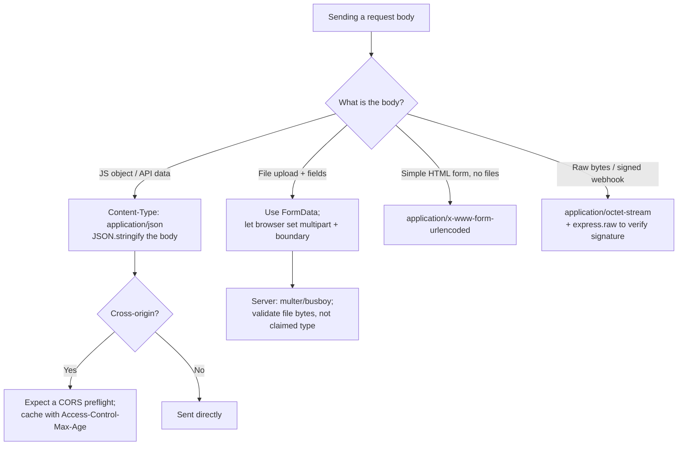

# Content-Type (Request)

## Quick Summary

On a request, `Content-Type` is the **client's declaration of what it is uploading**. When a browser, `fetch`, `axios`, or an HTTP client sends a body with `POST`, `PUT`, or `PATCH`, `Content-Type` tells the server how to decode and parse those bytes: is it JSON, a URL-encoded form, a multipart file upload, or raw text? This header is what your server-side body parsers dispatch on — `express.json()` only runs when the request says `application/json`; `multer` only runs on `multipart/form-data`. Get it wrong and `req.body` is empty even though the bytes arrived intact. The value carries structure: a `type/subtype` plus parameters (`charset=utf-8`, or the all-important `boundary=...` for multipart). It also has surprising security weight: `Content-Type` is one of the three request headers that decide whether a cross-origin request is a CORS "simple request" (no preflight) or triggers a preflight — which is the entire basis of a large class of CSRF defenses. This page focuses on **request semantics**; the response-side counterpart (how the server labels the body it returns) is the canonical page at [../04-Response-Headers/Content-Type.md](../04-Response-Headers/Content-Type.md).

## What problem does this header solve?

A request body is an opaque octet stream. The same bytes `{"id":1}` could be a JSON object the API should parse, a raw text field the server should store verbatim, or one field inside a larger multipart envelope. The server cannot reliably guess — and guessing on the request side is even more dangerous than on the response side, because the body is *attacker-controlled input*.

`Content-Type` on the request solves the concrete problem of **parser dispatch and body decoding**:

1. **Which parser runs.** Node/Express register multiple body parsers. Only the one matching the request `Content-Type` consumes the stream. A `POST` with `Content-Type: text/plain` carrying JSON will sail past `express.json()`, leaving `req.body` undefined — the single most common "why is my body empty" bug.
2. **Character decoding.** `application/json; charset=utf-8` tells the parser how to turn octets into code points before `JSON.parse`. Node defaults to UTF-8 for JSON regardless (per RFC 8259), but for `text/*` and form bodies the `charset` parameter is honored.
3. **Structural framing.** `multipart/form-data; boundary=----X` is unparseable without the boundary — it is the delimiter that separates fields and file parts. The client *must* generate it and put it in the header; the server *must* read it to split the body.
4. **Security posture.** Because a plain HTML `<form>` can only ever send three `Content-Type` values, and cross-origin JS cannot set arbitrary `Content-Type` without triggering a CORS preflight, "require `application/json`" becomes a cheap, effective CSRF barrier.

## Why was it introduced?

`Content-Type` predates HTTP as a header — it comes from **MIME (Multipurpose Internet Mail Extensions), RFC 1341 (1992) and RFC 2045 (1996)**, designed so email could carry more than 7-bit ASCII text. HTTP adopted the MIME `type/subtype; parameter` grammar wholesale. HTTP/1.0 (RFC 1945, 1996) listed it as an entity header; HTTP/1.1 (RFC 2616, then RFC 7231, and now **RFC 9110 §8.3**) defines it as a *representation* header describing the payload's media type in either direction.

The request-side importance grew with the web's shift from simple `<form>` posts to rich API clients. Originally, browsers could only send `application/x-www-form-urlencoded` (default form encoding), `multipart/form-data` (added for file uploads in **RFC 1867**, 1998), and later `text/plain`. The rise of XHR and then `fetch` let JavaScript send `application/json` — but the CORS spec (Fetch Standard) deliberately kept those three legacy form types as "CORS-safelisted" and made *everything else* trigger a preflight, precisely so that adding JS to the platform could not retroactively make old servers vulnerable to new cross-origin request shapes.

## How does it work?

- **Browser behavior:** The browser sets `Content-Type` automatically for `<form>` submissions (`application/x-www-form-urlencoded` by default, or `multipart/form-data` when `enctype` is set and the form has a file input) and generates the `boundary` for multipart. For `fetch`/XHR, if you pass a `FormData` body the browser sets `multipart/form-data` *with the correct boundary for you* — you must **not** set it manually or the boundary won't match. If you pass a `URLSearchParams` body it sets `application/x-www-form-urlencoded`. If you pass a `string`, it defaults to `text/plain;charset=UTF-8` unless you override. For a `Blob` it uses the blob's `type`. Crucially, the value you set feeds into the CORS "simple request" check.
- **Server behavior:** The server reads `Content-Type`, strips parameters, and routes the body stream to the matching parser. Express's `express.json()`, `express.urlencoded()`, `express.text()`, `express.raw()`, and `multer` each carry a `type` matcher (defaulting to a media type) and only consume the stream on a match. A non-matching request leaves the stream unread and `req.body` empty (or `{}`).
- **Proxy behavior:** Forward proxies pass `Content-Type` through untouched; it is an end-to-end representation header, not hop-by-hop. A proxy must not alter it (doing so would misrepresent the body). `no-transform` in `Cache-Control` reinforces this.
- **CDN behavior:** CDNs generally don't cache request bodies (POST/PUT are usually uncacheable), but some API gateways/WAFs inspect request `Content-Type` for routing or to enforce body-size and schema rules. A WAF may reject unexpected content types.
- **Reverse proxy behavior:** Nginx passes `Content-Type` to the upstream unchanged. It matters for `client_max_body_size` (large multipart uploads) and for whether Nginx buffers the request body before proxying. Nginx does not parse the body; it forwards the header and stream to your app.

## HTTP Request Example

A JSON API call (the modern default for SPAs and mobile clients):

```http
POST /api/users HTTP/1.1
Host: api.example.com
Content-Type: application/json; charset=utf-8
Content-Length: 47
Authorization: Bearer eyJhbGciOi...

{"name":"Ada Lovelace","email":"ada@math.dev"}
```

A classic URL-encoded form post (what a plain `<form method="post">` sends):

```http
POST /login HTTP/1.1
Host: example.com
Content-Type: application/x-www-form-urlencoded
Content-Length: 39

username=ada&password=analytical+engine
```

A multipart file upload — note the `boundary` parameter and how each part has its own headers:

```http
POST /api/avatars HTTP/1.1
Host: api.example.com
Content-Type: multipart/form-data; boundary=----WebKitFormBoundary7MA4YWxkTrZu0gW
Content-Length: 554

------WebKitFormBoundary7MA4YWxkTrZu0gW
Content-Disposition: form-data; name="userId"

42
------WebKitFormBoundary7MA4YWxkTrZu0gW
Content-Disposition: form-data; name="avatar"; filename="me.png"
Content-Type: image/png

‰PNG␍␊␚␊...binary bytes...
------WebKitFormBoundary7MA4YWxkTrZu0gW--
```

The `boundary` string appears three ways: in the header, as `--boundary` before each part, and as `--boundary--` (trailing dashes) to close the body. Each part carries its own `Content-Disposition` (giving the field `name` and, for files, `filename`) and optionally its own `Content-Type` (here `image/png` for the file part).

## HTTP Response Example

The request `Content-Type` shapes what the server *does*, and the response confirms the outcome. A well-designed JSON API also enforces the request type:

```http
HTTP/1.1 415 Unsupported Media Type
Content-Type: application/json; charset=utf-8
Accept-Post: application/json

{"error":"This endpoint requires Content-Type: application/json"}
```

`415 Unsupported Media Type` is the correct status when the client sends a body in a type the endpoint refuses to parse. The `Accept-Post` response header (RFC advertises which request content types a resource accepts) tells the client what to send instead. On success you'd see a normal `201 Created` with a response-side `Content-Type` — see [../04-Response-Headers/Content-Type.md](../04-Response-Headers/Content-Type.md).

## Express.js Example

```js
const express = require('express');
const multer = require('multer');
const app = express();

// 1) JSON parser: fires ONLY when the request Content-Type matches application/json
//    (and vendor +json types by default). It reads the stream, JSON.parse()s it,
//    and sets req.body. `limit` caps the body size to stop memory-exhaustion DoS.
app.use(express.json({
  limit: '100kb',            // reject bodies > 100kb with 413. Without this, a huge
                             // JSON payload can OOM the process.
  type: 'application/json',  // the media type this parser claims. Default also matches
                             // */*+json. If the client sends text/plain, this is SKIPPED.
}));

// 2) URL-encoded parser: for classic HTML form posts.
//    extended:true uses the `qs` library so nested objects (a[b]=c) parse; false uses
//    the querystring module (flat only). Removing this makes form.body undefined.
app.use(express.urlencoded({ extended: true, limit: '100kb' }));

// 3) A guard middleware: reject anything that isn't JSON on our API surface.
//    This is a CSRF and robustness control: it forces clients to declare JSON, which
//    (a) a cross-origin browser cannot do without a CORS preflight, and
//    (b) prevents a text/plain body from silently bypassing express.json().
app.use('/api', (req, res, next) => {
  if (['POST', 'PUT', 'PATCH'].includes(req.method)) {
    // req.is() matches the request Content-Type against a type pattern, ignoring params.
    if (!req.is('application/json')) {
      return res.status(415).json({ error: 'Content-Type must be application/json' });
    }
  }
  next();
});

app.post('/api/users', (req, res) => {
  // req.body is populated because express.json() matched the Content-Type and parsed it.
  res.status(201).json({ id: 7, ...req.body });
});

// 4) File uploads: multer only engages on multipart/form-data. It parses the boundary,
//    streams each file part to disk/memory, and populates req.file / req.files, while
//    text fields land in req.body.
const upload = multer({
  dest: '/var/uploads',
  limits: { fileSize: 5 * 1024 * 1024 }, // 5MB cap per file — essential DoS guard.
});
app.post('/api/avatars', upload.single('avatar'), (req, res) => {
  // req.file = { originalname, mimetype, path, size, ... }; req.body.userId = "42".
  // NOTE: req.file.mimetype comes from the CLIENT's per-part Content-Type — it is a
  // claim, not a fact. Never trust it for security decisions; sniff the real bytes.
  res.json({ stored: req.file.path, claimedType: req.file.mimetype });
});

app.listen(3000);
```

Every parser above is a *dispatch on `Content-Type`*. Remove `express.json()` and a JSON POST leaves `req.body` empty. Register `express.json()` *after* `multer` on a multipart route and neither fires correctly, because both try to consume the single-use request stream. Order and `type` matchers are load-bearing.

## Node.js Example

Raw `http` gives you nothing — you must read the `Content-Type`, buffer the stream, and parse by hand:

```js
const http = require('http');

http.createServer((req, res) => {
  if (req.method !== 'POST') { res.statusCode = 405; return res.end(); }

  const ctype = (req.headers['content-type'] || '').split(';')[0].trim();
  const chunks = [];
  let size = 0;

  req.on('data', (c) => {
    size += c.length;
    if (size > 100_000) {           // manual body-size guard — no framework to do it.
      res.statusCode = 413;
      req.destroy();                // stop reading; prevent memory exhaustion.
      return;
    }
    chunks.push(c);
  });

  req.on('end', () => {
    const raw = Buffer.concat(chunks);
    if (ctype === 'application/json') {
      try {
        const body = JSON.parse(raw.toString('utf8')); // JSON is always UTF-8 (RFC 8259).
        res.setHeader('Content-Type', 'application/json');
        return res.end(JSON.stringify({ ok: true, echo: body }));
      } catch {
        res.statusCode = 400;
        return res.end('{"error":"invalid JSON"}');
      }
    }
    if (ctype === 'application/x-www-form-urlencoded') {
      const params = new URLSearchParams(raw.toString('utf8'));
      return res.end(JSON.stringify(Object.fromEntries(params)));
    }
    res.statusCode = 415;           // we don't parse this type.
    res.end();
  });
}).listen(3000);
```

This is exactly what Express automates: sniff `Content-Type`, buffer with a size cap, decode by charset, parse by type, handle malformed input. Multipart parsing by hand is far harder (boundary scanning across chunk edges), which is why `multer`/`busboy` exist.

## React Example

React never sets `Content-Type` on its own — the header is set by whatever HTTP mechanism you use to send data. The critical, easily-missed rule is **let the browser set it for `FormData`**:

```jsx
async function createUser(data) {
  // JSON: YOU set Content-Type. Serialize the body yourself.
  return fetch('/api/users', {
    method: 'POST',
    headers: { 'Content-Type': 'application/json' }, // dispatches express.json()
    body: JSON.stringify(data),                       // must match the declared type
    credentials: 'include',
  });
}

async function uploadAvatar(file, userId) {
  const fd = new FormData();
  fd.append('userId', userId);
  fd.append('avatar', file); // a File/Blob from <input type="file">

  return fetch('/api/avatars', {
    method: 'POST',
    body: fd,
    // DO NOT set Content-Type here. If you write
    //   headers: { 'Content-Type': 'multipart/form-data' }
    // the browser will NOT append the boundary, so the server sees
    //   multipart/form-data; boundary=undefined  -> multer can't split parts -> 500/empty.
    // Omitting it lets the browser emit the full header WITH the generated boundary.
    credentials: 'include',
  });
}
```

With **axios**, the same rules apply: `axios.post(url, jsonObj)` auto-sets `application/json` and stringifies; `axios.post(url, formDataInstance)` lets the platform set the multipart boundary. The lesson developers learn the hard way: for multipart, *never* hardcode the `Content-Type`.

## Browser Lifecycle

1. **Body construction.** You call `fetch(url, { body })`. The browser inspects the body's type: `string` → `text/plain;charset=UTF-8`; `URLSearchParams` → `application/x-www-form-urlencoded;charset=UTF-8`; `FormData` → `multipart/form-data; boundary=<generated>`; `Blob` → the blob's `type`; `ArrayBuffer` → none (you set it).
2. **Explicit override.** If you passed `headers['Content-Type']`, that wins over the inferred value (except that a manual `FormData` type still won't get a boundary — a footgun).
3. **CORS decision.** For a cross-origin request, the browser checks: is the method simple (GET/HEAD/POST) *and* is `Content-Type` one of `application/x-www-form-urlencoded`, `multipart/form-data`, `text/plain`? If yes → **simple request**, sent directly. If the `Content-Type` is anything else (e.g. `application/json`) → the browser sends a **CORS preflight** `OPTIONS` first, listing `Content-Type` in `Access-Control-Request-Headers`.
4. **Transmission.** The header and body are written to the connection.
5. **Server dispatch.** The server's parser matches the type and populates the parsed body.

## Production Use Cases

- **JSON REST APIs:** `application/json` is the default for SPA↔API traffic. Enforcing it doubles as a CSRF control (see below).
- **HTML form posts / server-rendered apps:** `application/x-www-form-urlencoded` from `<form>` without file inputs — login pages, settings forms, non-JS-heavy apps.
- **File uploads:** `multipart/form-data` for avatars, documents, media. The only form encoding that can carry binary file bytes alongside text fields.
- **Webhooks:** Providers (Stripe, GitHub) POST `application/json`; some (Slack slash commands, Twilio) POST `application/x-www-form-urlencoded`. Your handler must match the provider's type exactly.
- **Beacon / analytics:** `navigator.sendBeacon()` sends `text/plain` (or the Blob's type) — deliberately a "simple" type so it fires on page unload without a preflight.
- **Raw payloads:** `application/octet-stream` or a custom type for protobuf, CBOR, or signed webhook bodies you must read raw (use `express.raw()` to verify a signature over the exact bytes).

## Common Mistakes

- **Manually setting `Content-Type` for `FormData`.** This strips the browser-generated `boundary`, so the server can't parse any part. Always let the browser set the multipart header.
- **Sending JSON without declaring it.** Posting a JSON string with the default `text/plain` (or no header) means `express.json()` never runs and `req.body` is empty. Symptom: "the data arrives but `req.body` is `{}`."
- **Trusting the client's part-level `Content-Type` for files.** `req.file.mimetype` is whatever the client claimed (`image/png` on a `.exe`). Validate by sniffing magic bytes (`file-type` library), not the header — otherwise you enable stored-XSS via a fake-typed upload served back later.
- **Charset confusion on form data.** `application/x-www-form-urlencoded` has no reliable charset parameter; browsers encode form fields in the page's charset. Serve pages as UTF-8 to avoid mojibake in submitted data.
- **Registering body parsers in the wrong order or scope.** Applying `express.json()` globally on a route that also uses `multer` can consume the stream first. Scope parsers to the routes that need them.
- **Assuming `Content-Type` guarantees the body shape.** It is a *claim*. A request labeled `application/json` can contain garbage; always `try/catch` the parse and validate the schema (Zod/Joi) afterward.

## Security Considerations

- **CSRF defense via `Content-Type` enforcement.** A cross-origin HTML `<form>` can only send `application/x-www-form-urlencoded`, `multipart/form-data`, or `text/plain` — it *cannot* send `application/json`. And cross-origin `fetch` that tries to set `Content-Type: application/json` triggers a CORS preflight, which your server can reject. So **requiring `Content-Type: application/json` on state-changing endpoints** blocks the classic form-based CSRF: the attacker's page simply can't produce a request your API will parse. This is not a complete CSRF defense on its own (pair it with SameSite cookies and/or tokens), but it is a cheap, effective layer. See [../07-CORS/CORS-Overview.md](../07-CORS/CORS-Overview.md).
- **The `text/plain` loophole.** Because `text/plain` *is* a simple type, an attacker can POST a `text/plain` body cross-origin without a preflight. If your server sniffs/parses `text/plain` bodies as JSON (some misconfigure `express.json({ type: '*/*' })`), you reopen the CSRF hole. Never parse `text/plain` as JSON on authenticated endpoints.
- **Content sniffing on uploads.** Never serve user uploads back with a `Content-Type` derived from the client's claim. A file uploaded as `text/html` (or sniffed as HTML) and served from your origin is stored XSS. Store uploads on a separate origin, force `Content-Disposition: attachment` or a safe `Content-Type`, and send [`X-Content-Type-Options: nosniff`](../05-Security-Headers/X-Content-Type-Options.md).
- **Body-size DoS.** Without a `limit`, a huge body (JSON, multipart) exhausts memory. Always cap with `express.json({ limit })` and `multer({ limits })`, and enforce `client_max_body_size` at the reverse proxy.
- **Parameter smuggling.** Malformed `Content-Type` (`boundary` injection, duplicated headers) has been used in request-smuggling and parser-differential attacks. Keep parsers strict and consistent between your proxy and app.

## Performance Considerations

- **Parser cost scales with body size.** `JSON.parse` on a multi-MB payload blocks the event loop. Cap sizes and, for very large uploads, stream (multipart to disk via `multer`/`busboy`) rather than buffering in memory.
- **Multipart overhead.** Base64 is *not* used by `multipart/form-data` (binary is sent raw), so it's efficient for files — but each part adds boundary and header bytes. For many tiny fields, JSON is leaner.
- **`charset` avoids re-decoding.** Declaring `charset=utf-8` lets the parser decode once, correctly; a wrong or missing charset can force lossy re-decoding or produce mojibake that costs a round-trip to fix.
- **Preflight cost.** Choosing `application/json` on cross-origin requests adds a preflight `OPTIONS` round-trip. Cache it with [`Access-Control-Max-Age`](../07-CORS/Access-Control-Max-Age.md) so it's paid once, not per request.

## Reverse Proxy Considerations

Nginx forwards `Content-Type` untouched but governs body handling around it:

```nginx
server {
  client_max_body_size 10m;          # reject bodies > 10MB (413). MUST exceed your
                                      # largest expected multipart upload, or uploads fail.
  location /api/ {
    proxy_pass http://app_upstream;
    proxy_set_header Content-Type $content_type;  # pass the type through explicitly.
    proxy_request_buffering on;       # buffer the body before sending upstream (default).
                                      # For large streaming uploads, set OFF to stream.
  }

  location /api/uploads/ {
    proxy_pass http://app_upstream;
    client_max_body_size 100m;        # larger cap only where big uploads are expected.
    proxy_request_buffering off;      # stream multipart straight to the app; avoids
                                      # buffering a 100MB file to disk on the proxy.
  }
}
```

`client_max_body_size` is the classic gotcha: an upload larger than this fails at Nginx with `413` before your app ever sees it, so your Express `limit` never gets a chance. Keep the two aligned. A WAF layer may also reject unexpected `Content-Type` values — whitelist the ones your API accepts.

## CDN Considerations

- **POST/PUT bodies are generally not cached**, so CDNs mostly pass request `Content-Type` through. Cloudflare and others expose it to Workers/edge functions for routing and body inspection.
- **WAF rules** on the edge frequently key on request `Content-Type`: blocking uploads of certain types, enforcing JSON on API paths, or rate-limiting multipart uploads. Misconfigured rules can reject legitimate `multipart/form-data`.
- **Body-size limits at the edge** (Cloudflare's request size cap, API Gateway's 10MB payload limit) apply *before* your origin — a large multipart upload can be rejected at the edge regardless of your app config. For big uploads, use direct-to-storage signed URLs (S3) rather than proxying through the CDN/app.

## Cloud Deployment Considerations

- **AWS API Gateway** has a hard 10MB request payload limit and can be configured with request validators keyed on `Content-Type`. For large uploads, generate S3 pre-signed POST/PUT URLs so the file bypasses the gateway entirely.
- **Serverless (Lambda, Cloud Functions):** the platform may base64-encode binary request bodies; your handler must check `isBase64Encoded` and decode before parsing multipart. Framework adapters (`serverless-http`) handle the body-parser dispatch but you must configure binary media types on the gateway or `multipart/form-data` arrives corrupted.
- **Load balancers (ALB/GCLB)** pass `Content-Type` through and enforce their own body-size limits. TLS termination doesn't alter the header, but some LBs add/normalize headers — verify with a direct curl.

## Debugging

- **Chrome DevTools → Network → (request) → Headers → Request Headers:** shows the exact `Content-Type` the browser sent. The **Payload** tab shows how DevTools parsed the body (form data, JSON, or the raw multipart with boundary). If Payload is empty but bytes were sent, the type is likely wrong.
- **curl:** `-H 'Content-Type: application/json' -d '{"a":1}'` sends JSON; `-d name=ada` defaults to `application/x-www-form-urlencoded`; `-F 'avatar=@me.png'` sends `multipart/form-data` with curl generating the boundary; `-F field=value` adds a text part. Use `-v` to see the exact header sent.
- **Postman / Bruno:** the **Body** tab's mode (raw+JSON, x-www-form-urlencoded, form-data) sets the `Content-Type` for you — a common Postman mistake is leaving an old `Content-Type` header set manually while switching body modes, producing a mismatch. Bruno stores the body mode in a versioned `.bru` file so you can review it in git.
- **Node.js:** log `req.headers['content-type']` and `req.is('json')` at the top of a handler to confirm dispatch.
- **Express logging:** a middleware — `app.use((req,res,next)=>{console.log(req.method,req.url,req.headers['content-type'],'body-keys',Object.keys(req.body||{}));next();})` — after your parsers reveals whether the body actually parsed.

## Best Practices

- [ ] Send `Content-Type: application/json` for API requests and let the server enforce it (returns `415` otherwise).
- [ ] Never manually set `Content-Type` when sending a `FormData` body — let the browser generate the `boundary`.
- [ ] Cap request body size at both the app (`express.json({ limit })`, `multer({ limits })`) and the reverse proxy (`client_max_body_size`).
- [ ] Require `application/json` on state-changing endpoints as a CSRF layer; never parse `text/plain` as JSON.
- [ ] Validate uploaded file types by sniffing magic bytes, not the client-supplied part `Content-Type`.
- [ ] Serve user uploads from a separate origin with a safe `Content-Type` and [`X-Content-Type-Options: nosniff`](../05-Security-Headers/X-Content-Type-Options.md).
- [ ] Always `try/catch` body parsing and schema-validate afterward — `Content-Type` is a claim, not a guarantee.
- [ ] Return `415 Unsupported Media Type` (not `400`) when the request type is unacceptable.

## Related Headers

- [Content-Type (Response)](../04-Response-Headers/Content-Type.md) — the canonical page: how the server labels the body it returns; deep dive on charset, sniffing, and rendering dispatch.
- [Accept](./Accept.md) — the request's *response*-type preference; `Content-Type` describes the request body, `Accept` describes what the client wants back. Together they drive content negotiation.
- [Content-Length](../04-Response-Headers/Content-Length.md) — frames how many bytes of body follow the `Content-Type` declaration.
- [Origin](./Origin.md) and [../07-CORS/CORS-Overview.md](../07-CORS/CORS-Overview.md) — `Content-Type` is one of the three headers that decide simple-request vs preflight.
- [X-Content-Type-Options](../05-Security-Headers/X-Content-Type-Options.md) — `nosniff`; the defense against sniffing a mislabeled body.
- [../07-CORS/Access-Control-Max-Age.md](../07-CORS/Access-Control-Max-Age.md) — caches the preflight that a non-simple `Content-Type` triggers.

## Decision Tree



## Mental Model

Think of the request `Content-Type` as the **customs declaration form taped to a shipping crate you're sending to the server**. The crate is full of bytes; the declaration says "this is JSON," "this is a form," or "this is a pallet of file boxes, and here's the tape-color (`boundary`) I used to separate them." The receiving warehouse (your server) reads the declaration to decide which unpacking crew (parser) to dispatch — the JSON crew ignores crates marked "form," and nobody can unpack the multipart pallet without knowing the tape color. Lie on the declaration (or leave it blank) and the right crew never shows up, so your goods sit unopened (`req.body` empty). And because the international shipping rules (CORS) only let *foreign* senders use three old declaration types without a customs inspection (preflight), insisting on the modern "JSON" declaration is a quiet way to make sure a stranger's crate can't slip onto your dock.
