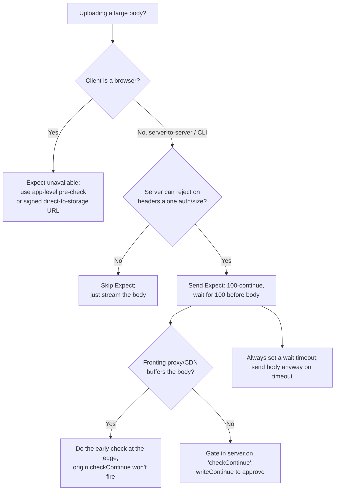

# Expect

## Quick Summary

`Expect` is a request header that lets a client say **"before I send you this (possibly large) body, tell me you'll actually accept it."** In practice it has exactly one standardized value: `Expect: 100-continue`. The client sends the request line and headers, then *pauses* and waits for the server to reply either `100 Continue` (meaning "go ahead, send the body") or a final error status like `401`, `403`, or `413` (meaning "don't bother — you'd be wasting bandwidth"). This is a bandwidth-and-latency optimization for large uploads: it lets the server reject a request on the basis of its headers alone — auth, content-length, permissions — before a single byte of a potentially huge payload crosses the wire. It is a hop-by-hop-ish negotiation handled by HTTP libraries, proxies, and servers largely transparently, but it has real behavioral consequences (curl adds it automatically for big `PUT`s, some servers hang waiting for a `100` that never comes) that bite people in production. If the server doesn't understand `Expect`, it must respond `417 Expectation Failed` for unknown expectations — but for `100-continue` most servers just proceed.

## What problem does this header solve?

Imagine a client uploads a 2 GB video with `PUT /videos/42`. The request requires authentication and the user's token is expired. Without `Expect`, the client streams all 2 GB up to the server, and *only then* does the server read the request, check the token, and return `401 Unauthorized`. The client has burned 2 GB of upload bandwidth (expensive on mobile, slow on ADSL) to learn something the server knew from the headers alone. Worse, some servers may not even read the body of a rejected request, so the connection ends up in a broken state (body half-sent, socket reset) that harms connection reuse.

`Expect: 100-continue` solves this: the client sends only the headers, then waits. The server inspects the headers — `Authorization`, `Content-Length` (is it over the size limit?), `Content-Type`, the target resource's permissions — and decides. If everything looks acceptable it sends `100 Continue` and the client streams the body. If not, it sends the final error status *and the client never sends the body*. It converts "waste the whole upload, then fail" into "fail on headers, save the payload."

## Why was it introduced?

`Expect` and the `100 Continue` mechanism were introduced in **HTTP/1.1 (RFC 2068, 1997; refined in RFC 2616, 1999; now specified in RFC 9110 §10.1.1 and the 1xx handling in RFC 9110 §15.2.1)**. HTTP/1.0 had no interim (1xx) responses at all — a response was a single final message — so there was no way to "check in" mid-request. HTTP/1.1 added the concept of **informational 1xx responses** (of which `100 Continue` and `101 Switching Protocols` are the notable ones), precisely to support this pre-flight-of-the-body handshake.

The design was driven by the era's constraints: uploads over slow, expensive links, and the desire to let servers and intermediary proxies reject oversized or unauthorized uploads early. `Expect` was made extensible ("expectation" tokens), but in practice only `100-continue` was ever standardized and deployed; unknown expectations get `417 Expectation Failed`.

## How does it work?

- **Browser behavior:** Mainstream browsers essentially **do not use `Expect: 100-continue`** for `fetch`/XHR/form uploads. They just send the body. So this header is almost entirely a server-to-server, CLI-tool, and native-HTTP-library concern, not a front-end one. (This is why there's no meaningful React example below.)
- **Client library behavior:** curl adds `Expect: 100-continue` automatically when the body is large (historically > 1 KB) and the method sends a body (`PUT`/`POST`). It then waits up to ~1 second for `100 Continue`; if none arrives, it sends the body anyway. Many other libraries (some Java/.NET stacks) do the same.
- **Server behavior:** On receiving `Expect: 100-continue`, the server may either (a) immediately send `HTTP/1.1 100 Continue` and then read the body, or (b) send a final response (e.g. `401`, `413`, `403`) *without* reading the body, telling the client to abandon the upload. In Node.js this surfaces as the `'checkContinue'` event on the HTTP server; if you don't handle it, Node auto-sends `100 Continue` for you.
- **Proxy behavior:** A forwarding proxy that speaks HTTP/1.1 must handle `Expect` correctly: forward it upstream and relay the `100 Continue` (or final status) back. A broken or HTTP/1.0 proxy that swallows the `100` is the classic cause of a client hanging for the full timeout before sending the body anyway. Proxies may also originate the `100 Continue` themselves.
- **CDN / reverse proxy behavior:** Most CDNs and reverse proxies (Nginx, HAProxy, Cloudflare) understand `100-continue`. Nginx handles it automatically for proxied requests; you can also disable the client-side expectation. Some edges strip `Expect` and buffer the whole body themselves, which quietly defeats the optimization.

## HTTP Request Example

The client sends headers, ending with `Expect`, and then **stops** — it does not send the body yet:

```http
PUT /videos/42 HTTP/1.1
Host: upload.example.com
Authorization: Bearer eyJhbGciOi...
Content-Type: video/mp4
Content-Length: 2147483648
Expect: 100-continue

```

The blank line after the headers is sent, but the 2 GB body is withheld until a `100 Continue` arrives.

## HTTP Response Example

The happy path — server approves, client then sends the body, server finally responds:

```http
HTTP/1.1 100 Continue

```

...(client now streams the 2 GB body)... then:

```http
HTTP/1.1 201 Created
Location: /videos/42
Content-Length: 0

```

The rejection path — server refuses on headers alone, body never sent:

```http
HTTP/1.1 413 Content Too Large
Content-Type: application/json
Content-Length: 44
Connection: close

{"error":"Max upload size is 500 MB"}
```

Here the server saw `Content-Length: 2147483648`, exceeded its limit, and returned `413` immediately — saving 2 GB of transfer. It may add `Connection: close` because the client might still send some buffered body bytes.

## Express.js Example

Express itself does not expose `Expect` handling directly — it sits on Node's HTTP server, and by default Node auto-answers `100 Continue`. To reject early you attach a `'checkContinue'` handler to the underlying server:

```js
const express = require('express');
const app = express();

app.put('/videos/:id', (req, res) => {
  // By the time we get here, Node has already sent 100 Continue (default behavior)
  // and the body is streaming in. Rejecting HERE does not save bandwidth.
  res.status(201).location(`/videos/${req.params.id}`).end();
});

const server = app.listen(3000);

// The real early-rejection lever lives on the raw server, BEFORE the body:
server.on('checkContinue', (req, res) => {
  // Fired when a request carries `Expect: 100-continue`. Node has NOT yet sent
  // the 100 response and the body has NOT been read. We decide here.

  const len = Number(req.headers['content-length'] || 0);
  const MAX = 500 * 1024 * 1024; // 500 MB

  // 1) Reject oversized uploads on Content-Length alone — no body transferred.
  if (len > MAX) {
    res.writeHead(413, { 'Content-Type': 'application/json', 'Connection': 'close' });
    return res.end('{"error":"Max upload size is 500 MB"}');
    // We do NOT call res.writeContinue(), so the client never sends the 2GB body.
  }

  // 2) Reject unauthenticated uploads on the header alone.
  if (!req.headers.authorization) {
    res.writeHead(401, { 'Connection': 'close' });
    return res.end();
  }

  // 3) Approved: tell the client to send the body, then hand off to Express's
  //    normal request pipeline so app.put('/videos/:id') runs.
  res.writeContinue();          // emits `HTTP/1.1 100 Continue`
  server.emit('request', req, res); // route it through the Express app as usual
});
```

Line by line: `server.on('checkContinue', ...)` intercepts requests with `Expect: 100-continue` *before* the body is read — this is the only place the optimization pays off. `res.writeContinue()` sends the interim `100`. If you instead send a final `writeHead(413/401)` and `end()` without `writeContinue()`, the client aborts the upload. `server.emit('request', req, res)` re-injects the request into Express's normal handling once approved. Remove the `checkContinue` handler and Node silently auto-approves every expectation, so a 2 GB unauthorized upload streams fully before your route rejects it.

## Node.js Example

Raw `http` makes the mechanism explicit on both sides. The server:

```js
const http = require('http');

const server = http.createServer((req, res) => {
  // Normal handler: runs only after the body is accepted.
  req.resume();                 // drain the body
  req.on('end', () => { res.writeHead(201); res.end(); });
});

// Default: if you attach NO 'checkContinue' listener, Node auto-sends 100 Continue.
// Attach one to gate uploads:
server.on('checkContinue', (req, res) => {
  if (Number(req.headers['content-length']) > 10_000_000) {
    res.writeHead(413); res.end('too big'); // no writeContinue -> client won't send body
    return;
  }
  res.writeContinue();                       // 'HTTP/1.1 100 Continue'
  server.emit('request', req, res);          // proceed to the normal handler
});

server.listen(3000);
```

The client side, showing how to *wait* for the `100`:

```js
const http = require('http');

const req = http.request({
  host: 'localhost', port: 3000, method: 'PUT', path: '/big',
  headers: { 'Content-Length': Buffer.byteLength(bigBody), 'Expect': '100-continue' },
});

// Fired when the server sends 100 Continue -> NOW send the body.
req.on('continue', () => {
  req.end(bigBody);
});

// Fired if the server sends a FINAL response instead (e.g. 413) — abandon the body.
req.on('response', (res) => {
  if (res.statusCode !== 100) {
    console.log('rejected before upload:', res.statusCode);
    req.destroy(); // don't send the body
  }
});

// IMPORTANT: do NOT call req.end(body) immediately. If you send the body without
// waiting for 'continue', the Expect optimization is pointless. But also, if the
// server never answers, you must time out — see pitfalls below.
```

Node's client emits a `'continue'` event exactly for this: withhold the body until it fires. Note the pitfall — if you both listen for `'continue'` *and* immediately write the body, you double-send.

## React Example

React (and browsers generally) **do not use `Expect: 100-continue`**. The Fetch and XHR APIs give you no way to set it — `Expect` is on the forbidden-header list, so `fetch('/x', { headers: { Expect: '100-continue' } })` silently drops it. Browser upload optimization is handled differently (streaming request bodies, resumable-upload protocols like tus, or chunked direct-to-storage uploads). So there is no meaningful client-side React usage: if you need "reject before the big upload" semantics from a browser, you implement it at the application layer — e.g. a preliminary `POST /uploads` that returns a signed URL and validates size/permissions *before* the browser starts the real transfer. That app-level handshake is the browser-world equivalent of `100-continue`.

## Browser Lifecycle

Because browsers don't emit `Expect`, the "browser lifecycle" here is really the **HTTP client lifecycle** (curl, native libraries, server-to-server):

1. **Body-size check.** The client library decides the body is large enough to warrant `Expect` (curl: historically > 1 KB) and adds `Expect: 100-continue`.
2. **Send headers, pause.** Request line + headers + blank line are written. The body is buffered but not sent.
3. **Wait with a timeout.** The client waits for an interim `100 Continue` (curl waits ~1 s by default).
4. **Branch:**
   - `100 Continue` received → stream the body, then read the final response.
   - Final status (e.g. `413`, `401`) received → do not send the body; surface the error.
   - **Timeout** (no response) → send the body anyway (curl's fallback), so a proxy that swallowed the `100` costs a ~1 s latency penalty per request but doesn't hang forever.
5. **Read final response.**

## Production Use Cases

- **Large file/object uploads to APIs:** `PUT` of multi-hundred-MB objects where the server enforces size limits or auth — reject on `Content-Length`/`Authorization` before the transfer.
- **S3 and cloud storage clients:** AWS SDKs and tools use `100-continue` for large `PutObject` uploads so a permission or size error returns before the payload flies.
- **Server-to-server ETL / replication:** batch jobs pushing large payloads between services benefit from early rejection on backpressure or quota.
- **Enforcing quotas / rate limits early:** an API that meters upload volume can `413`/`429` on headers, saving both parties bandwidth.
- **Proxied upload pipelines:** an upload gateway that authenticates and authorizes before streaming to backend storage.

## Common Mistakes

- **Server never sends `100` and the client hangs.** A server (or intermediary) that receives `Expect: 100-continue` but neither sends `100` nor a final status leaves a strict client waiting. Well-behaved clients time out and send anyway; strict ones stall. Ensure every hop handles the expectation.
- **Sending the body without waiting for `'continue'`.** In Node, writing `req.end(body)` immediately defeats the optimization and, if you also listen for `'continue'`, double-sends.
- **Rejecting in the Express route instead of `checkContinue`.** By the time your `app.put()` handler runs, Node already sent `100` and the body is in transit — you saved nothing. Early rejection *must* happen in `'checkContinue'`.
- **Forgetting the timeout fallback.** A custom client that waits forever for `100` will hang against proxies that swallow interim responses. Always cap the wait and fall back to sending the body.
- **Assuming browsers do it.** Front-end devs sometimes expect `fetch` to negotiate `100-continue`; it doesn't. Build an app-level pre-check instead.
- **Returning `417` for `100-continue`.** `417 Expectation Failed` is for *unknown* expectations. Returning it for `100-continue` breaks clients; either honor it (send `100`) or send the real final status.

## Security Considerations

- **DoS mitigation is the security upside:** early rejection on `Content-Length`/`Authorization` stops an attacker from forcing you to buffer/transfer huge bodies before you reject them. Enforce size limits in `checkContinue`, not after buffering.
- **Content-Length spoofing:** the early decision trusts the client's `Content-Length`. An attacker can send a small `Content-Length` to pass the check, then send more (or use chunked encoding). Never treat the pre-body check as a substitute for enforcing limits *while reading the body* — cap actual bytes read too.
- **Request smuggling surface:** mishandling of `Expect`/`100 Continue` across a proxy↔origin pair with differing interpretations has featured in request-smuggling research. Keep `Expect` handling consistent between your edge and origin, and prefer well-tested proxies.
- **Interim-response confusion:** some old clients/proxies mishandle multiple 1xx responses. Send at most one `100 Continue` per request.

## Performance Considerations

- **The win:** avoiding transfer of a large body that will be rejected — potentially gigabytes and many seconds saved on slow/metered links.
- **The cost:** a full round-trip (send headers → wait → receive `100` → send body) adds one RTT of latency *on every upload that uses it*, even successful ones. For small bodies this latency outweighs any savings, which is why curl only adds `Expect` above a size threshold.
- **Proxy-swallowed `100`:** if an intermediary eats the interim response, the client pays its full wait timeout (~1 s in curl) before sending — a silent, per-request latency tax. This is why many teams *disable* `Expect` (`curl -H 'Expect:'`) when they know the server always accepts.
- **Connection reuse:** correct `100-continue` handling keeps keep-alive connections healthy; a rejected upload where the body was never sent leaves a clean connection (or the server closes it with `Connection: close`).

## Reverse Proxy Considerations

Nginx handles `100-continue` between client and upstream, but you often want to control it:

```nginx
server {
  location /upload/ {
    proxy_pass http://storage_upstream;

    # Nginx buffers the request body by default and speaks 100-continue to the client
    # itself. To let the UPSTREAM make the early-reject decision, stream instead:
    proxy_request_buffering off;      # forward body as it arrives; upstream sees Expect.
    proxy_http_version 1.1;           # 1xx/100-continue requires HTTP/1.1 upstream.

    client_max_body_size 1g;          # Nginx can reject oversized uploads with 413 here
                                      # — its own early rejection, before the upstream.
  }

  # To strip a client's Expect so Nginx never waits (it will just accept and buffer):
  # proxy_set_header Expect "";
}
```

Key points: with `proxy_request_buffering on` (default), Nginx answers `100 Continue` itself and buffers the body, so your origin's `checkContinue` never fires — the optimization moves to Nginx (and its `client_max_body_size`). Turn buffering *off* to push the decision to the origin. `proxy_set_header Expect ""` removes the header entirely, useful when an upstream mishandles it and clients otherwise stall.

## CDN Considerations

- **Cloudflare and most CDNs** understand `100-continue` at the edge; the edge typically answers `100`, buffers/streams the body, and enforces its own request-size limits (Cloudflare's upload cap varies by plan). Your origin usually sees a buffered body, so origin-side `checkContinue` gating is bypassed — do size/auth checks at the edge (Workers, WAF) instead.
- **Interim-response pass-through** is inconsistent across CDNs; don't rely on the client receiving your origin's `100` verbatim.
- **Large uploads through a CDN are often an anti-pattern:** prefer direct-to-storage signed URLs (S3, GCS) so the payload skips the edge and origin entirely; the CDN just serves the small pre-signing request.

## Cloud Deployment Considerations

- **AWS S3 / SDKs** actively use `Expect: 100-continue` for large `PutObject`s; S3 returns the final error (e.g. `403 AccessDenied`) before the body if credentials/permissions fail. Some SDKs let you disable it (`use_expect_continue`) if a fronting proxy misbehaves.
- **API Gateway / Lambda** buffer the entire request; they don't expose a `checkContinue` hook, and payload caps (API Gateway's 10 MB) reject oversized bodies at the gateway. For big uploads use pre-signed S3 URLs.
- **Load balancers (ALB/GCLB)** generally handle or buffer `100-continue` transparently; the origin may never see the `Expect` header. Verify behavior with a direct curl through the LB if you depend on early rejection.
- **HTTP/2 / HTTP/3 backends:** the `Expect: 100-continue` handshake still exists in HTTP/2 (interim `100` frames), but multiplexing and flow control change the calculus; many stacks simply stream and rely on flow control rather than `Expect`.

## Debugging

- **curl:** `curl -v -T bigfile.mp4 https://upload.example.com/videos/42` shows curl adding `Expect: 100-continue`, the `< HTTP/1.1 100 Continue` line, then the upload. To disable and observe the difference: `curl -H 'Expect:' -T bigfile.mp4 ...`. To see the ~1 s stall when a server ignores `Expect`, watch the timing between the header write and the body.
- **Chrome DevTools:** browsers don't send `Expect`, so you won't see this handshake for `fetch`/XHR. Useful only to confirm that your *front-end* uploads are not using it (they aren't).
- **Postman / Bruno:** neither sends `Expect: 100-continue` by default for typical uploads; you generally can't rely on them to exercise this path. Use curl or a raw Node client instead.
- **Node.js:** log inside `server.on('checkContinue', ...)` to confirm it fires, and on the client listen for the `'continue'` event. If `checkContinue` never fires, a proxy/LB is buffering the body and answering `100` itself.
- **Wireshark / tcpdump:** the definitive tool — you can see the headers, the `100 Continue` interim response, and the delayed body on the wire, including a proxy that swallows the `100`.

## Best Practices

- [ ] Do early rejection (size/auth) in `server.on('checkContinue')`, never in the route handler that runs after the body.
- [ ] Always call `res.writeContinue()` to approve, or send a final status (and skip `writeContinue`) to reject — never both.
- [ ] In custom clients, wait for the `'continue'` event before sending the body, but time out and send anyway if it never arrives.
- [ ] Don't trust the pre-body `Content-Length`; still cap bytes actually read to prevent overrun.
- [ ] If a fronting proxy/CDN buffers the body, move size/auth checks to the edge — the origin's `checkContinue` won't fire.
- [ ] Disable `Expect` (`curl -H 'Expect:'`, SDK option, or `proxy_set_header Expect ""`) when an intermediary mishandles it and clients stall.
- [ ] For browser uploads, implement an app-level pre-check (validate then hand back a signed URL) instead of expecting `100-continue`.

## Related Headers

- [Content-Length](../04-Response-Headers/Content-Length.md) — the value the server inspects to reject oversized uploads early; the whole point of `Expect` is to act on it before the body.
- [Content-Type (Request)](./Content-Type.md) — another header the server can reject on during the `100-continue` check (e.g. `415`).
- [Connection](./Connection.md) — a rejection often carries `Connection: close`; `Expect` handling interacts with keep-alive and connection reuse.
- [../10-Compression/Transfer-Encoding.md](../10-Compression/Transfer-Encoding.md) — chunked uploads change how the body is framed relative to the `Expect` decision (no reliable `Content-Length`).
- [Host](./Host.md) — part of the header set the server evaluates before approving the body.

## Decision Tree



## Mental Model

Think of `Expect: 100-continue` as **knocking before you haul a piano up to someone's apartment**. Instead of carrying the 400 lb piano (the 2 GB body) up five flights only to be told "wrong address" or "we're closed" at the door, you first ring the buzzer with just the delivery paperwork (the headers): "I've got a piano for apartment 42, here's the invoice — should I bring it up?" The resident (server) checks the paperwork and either buzzes you in (`100 Continue`) or says "nope, we don't accept pianos / you're not on the list" (`413`/`401`) *before* you break your back. If the buzzer is broken (a proxy that swallows the `100`), you wait a polite moment and then just carry it up anyway — you lose a little time, but the delivery still happens. And crucially: web browsers never knock; they just show up with the piano. So if you want browser uploads to knock first, you have to build your own doorbell (an app-level pre-check).
