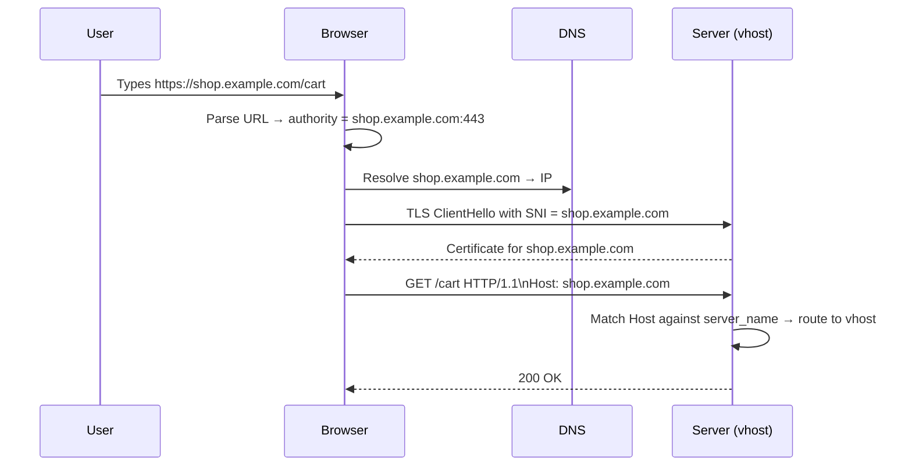
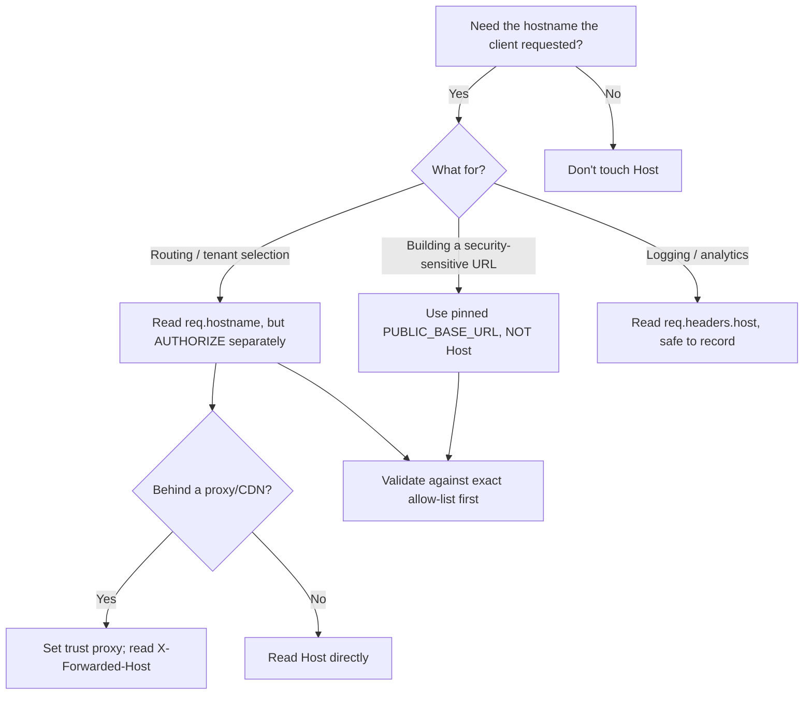

# Host

## Quick Summary

`Host` is the request header that tells the server **which website the client wants** when a single IP address and port serve many sites. It carries the domain (and optional non-default port) from the URL's authority component — e.g. `Host: shop.example.com`. It is set by the client (browser, `fetch`, curl) from the URL, not by application code. In HTTP/1.1 it is **mandatory**: a request without it is a `400 Bad Request` per spec. It is the single most security-sensitive request header that most engineers never think about, because virtually every routing layer — reverse proxies, CDNs, load balancers, and the framework router itself — makes decisions based on its value, and applications routinely reflect it into generated URLs, emails, and cache keys. In HTTP/2 and HTTP/3 it is replaced by the `:authority` pseudo-header.

## What problem does this header solve?

**Name-based virtual hosting.** In the original HTTP/1.0 world, one IP address served one website. The request line contained only the path (`GET /index.html HTTP/1.0`), so the server had no way to know *which* hostname the user typed — it only knew the connection landed on its IP. That was fine when every site had a dedicated machine and a dedicated public IPv4 address.

It stopped being fine the moment shared hosting appeared and IPv4 exhaustion loomed. Consider a $5/month host running 500 customer sites on one IP. When a TCP connection arrives, the server sees `GET /about HTTP/1.0` — is that `alice.com/about` or `bob.com/about`? There is no signal. Without `Host`, the only way to distinguish sites on the same IP is **IP-based virtual hosting**: one IP per site. That does not scale and wastes a finite address space.

`Host` solves this by moving the authority (the hostname) *into the request*, so a single server socket can inspect it and route to the correct virtual host, TLS certificate, document root, and application. Every modern web deployment — from Nginx `server` blocks to AWS ALB host-based routing rules to Cloudflare's multi-tenant edge — depends on it.

## Why was it introduced?

HTTP/1.0 (RFC 1945, 1996) treated `Host` as optional and rarely-used. But by the mid-1990s the "one IP per site" model was clearly unsustainable against IPv4 scarcity. HTTP/1.1 (RFC 2068 in 1997, then RFC 2616 in 1999, now RFC 7230 / RFC 9110) made `Host` **required**: a fully compliant HTTP/1.1 server must reject any request that lacks it, and a client must send it. This was one of the headline changes of HTTP/1.1 and the main enabler of the shared-hosting economy.

TLS created a chicken-and-egg problem: the server must present a certificate during the handshake, *before* it has seen the encrypted `Host` header, so how does it know which cert to send when many HTTPS sites share an IP? The answer was **SNI (Server Name Indication)**, a TLS extension (RFC 6066) where the client sends the hostname *in the clear* during the handshake. So on an HTTPS request there are effectively two copies of the hostname: SNI (TLS layer, plaintext, selects the certificate) and `Host`/`:authority` (HTTP layer, encrypted, selects the virtual host). They usually match; when they don't, that mismatch is itself a signal (and an attack vector — see Security).

## How does it work?

- **Browser behavior:** The browser derives `Host` directly from the URL's authority. For `https://shop.example.com/cart` it sends `Host: shop.example.com`. The port is omitted when it is the scheme default (443 for https, 80 for http) and included otherwise (`Host: localhost:3000`). The browser will not let page JavaScript override it — `Host` is on the [forbidden header names](https://developer.mozilla.org/en-US/docs/Glossary/Forbidden_header_name) list, so `fetch(url, { headers: { Host: 'evil.com' } })` is silently dropped. This is a deliberate integrity guarantee: the hostname the browser routes to and the `Host` it sends are always consistent.
- **Server behavior:** The origin server (or the framework) parses `Host` to select the virtual host, and application code reads it (`req.headers.host`, `req.hostname`) to build absolute URLs, links, and redirects. A raw Node server does nothing with it automatically; a framework or reverse proxy in front does the routing.
- **Proxy behavior:** A **forward proxy** (the client's outbound proxy) receives requests in *absolute-URI* form — `GET http://example.com/path HTTP/1.1` — because the proxy needs the full target to know where to connect. RFC 9110 requires the client to *still* send a `Host` header even in this form, and requires the proxy, when it forwards, to make `Host` match the absolute URI's authority. For HTTPS the browser uses `CONNECT example.com:443` to open an opaque tunnel, so the proxy never sees `Host` at all — it is inside the TLS.
- **CDN behavior:** The CDN edge terminates TLS and uses SNI + `Host` to pick which customer property/zone the request belongs to. When it forwards to origin it typically sets a **Host override** (a.k.a. "origin host header" / "host header override") so origin sees either the original `Host` or a configured value. Getting this wrong is the classic cause of redirect loops and cache fragmentation.
- **Reverse proxy behavior:** Nginx/HAProxy/Envoy match the incoming `Host` against `server_name` (or route rules) to pick a backend, then forward. Nginx defaults to `proxy_set_header Host $proxy_host` (the upstream's name), which is usually *not* what you want — you almost always want `proxy_set_header Host $host` to preserve what the client requested. This one line is behind a huge fraction of "works locally, breaks behind proxy" bugs.

## HTTP Request Example

Standard origin-form request (what a browser sends to a normal server):

```http
GET /cart HTTP/1.1
Host: shop.example.com
Accept: text/html
User-Agent: Mozilla/5.0 (Macintosh; Intel Mac OS X 10_15_7)
```

Absolute-form request to a forward proxy (note the full URI *and* the redundant `Host`):

```http
GET http://shop.example.com/cart HTTP/1.1
Host: shop.example.com
```

HTTP/2 has no `Host` line; the authority is a pseudo-header (shown here in the conventional pseudo-field notation):

```http
:method: GET
:scheme: https
:authority: shop.example.com
:path: /cart
```

A malicious request missing/duplicating `Host` (what an attacker probes with):

```http
GET /reset-password HTTP/1.1
Host: legit.example.com
Host: attacker.example.com
```

## HTTP Response Example

`Host` is a request-only header — servers never send it back. What they *do* send is often *derived* from `Host`: a `Location` redirect, or an absolute link, built from the requested hostname.

```http
HTTP/1.1 301 Moved Permanently
Location: https://shop.example.com/cart
Content-Length: 0
```

The danger: if the server built that `Location` by trusting an attacker-controlled `Host`, the redirect points at the attacker's domain. That is the core of Host header injection (see Security).

## Express.js Example

```js
const express = require('express');
const app = express();

// 1. Trust proxy is REQUIRED when Express sits behind Nginx/ALB/CDN.
//    It makes req.hostname read X-Forwarded-Host (set by the proxy) instead
//    of the Host that the proxy itself sent to Express. Without it, req.hostname
//    is whatever the proxy put in Host — often the internal upstream name,
//    so every absolute URL you build is wrong.
app.set('trust proxy', 1); // trust exactly one hop (the proxy directly in front)

// 2. Host allow-listing middleware. This is the single most effective defense
//    against Host header injection. We refuse to process any request whose
//    host is not one we explicitly serve, BEFORE any code reflects it.
const ALLOWED_HOSTS = new Set(['shop.example.com', 'www.shop.example.com']);

app.use((req, res, next) => {
  // req.hostname strips the port and (with trust proxy) prefers X-Forwarded-Host.
  // We validate against a fixed allow-list — never a regex that an attacker
  // can wiggle through (e.g. `example.com.evil.com`).
  if (!ALLOWED_HOSTS.has(req.hostname)) {
    // 400, not 404: the request is malformed/hostile, not "page missing".
    return res.status(400).type('text/plain').send('Invalid Host');
  }
  next();
});

app.post('/reset-password', (req, res) => {
  const token = 'generated-token-123';

  // 3. NEVER build security-sensitive URLs from req.hostname/req.headers.host.
  //    Even after allow-listing, prefer a hard-configured canonical origin so a
  //    misconfiguration can never leak a reset link to another domain.
  const BASE_URL = process.env.PUBLIC_BASE_URL; // e.g. "https://shop.example.com"
  const resetLink = `${BASE_URL}/reset?token=${token}`;

  // sendPasswordResetEmail(req.body.email, resetLink);
  res.json({ ok: true });
});

// 4. Demonstrating the read path for legitimate, non-security uses (logging).
app.get('/whoami', (req, res) => {
  res.json({
    host: req.headers.host,        // raw header, includes port, unvalidated
    hostname: req.hostname,        // parsed, port-stripped, proxy-aware
    protocol: req.protocol,        // "https" once trust proxy reads X-Forwarded-Proto
  });
});

app.listen(3000);
```

What breaks if you remove each piece: without `trust proxy`, `req.hostname` and `req.protocol` reflect the proxy hop, not the user — every generated link and every OAuth `redirect_uri` becomes wrong. Without the allow-list middleware, any `Host` an attacker sends flows into your app. Without the hard-coded `BASE_URL` in `/reset-password`, an attacker sets `Host: attacker.com` and your email sends them a working reset link for the victim's account.

## Node.js Example

Raw `http` gives you the header verbatim and does *zero* validation — the framework conveniences are gone, which makes the attack surface explicit.

```js
const http = require('http');

const ALLOWED = new Set(['shop.example.com', 'localhost:3000']);

const server = http.createServer((req, res) => {
  const host = req.headers.host; // raw string, exactly as sent, or undefined

  // HTTP/1.1 mandates Host. Node does NOT auto-reject a missing one for you,
  // so a hand-written server must enforce it explicitly.
  if (!host) {
    res.writeHead(400, { 'Content-Type': 'text/plain' });
    return res.end('Missing Host header');
  }

  // Node folds duplicate Host headers into a comma-joined string ("a.com, b.com").
  // A comma in Host is illegal, so treat it as an attack and reject.
  if (host.includes(',')) {
    res.writeHead(400, { 'Content-Type': 'text/plain' });
    return res.end('Multiple Host headers');
  }

  if (!ALLOWED.has(host)) {
    res.writeHead(400, { 'Content-Type': 'text/plain' });
    return res.end('Unknown Host');
  }

  res.writeHead(200, { 'Content-Type': 'application/json' });
  res.end(JSON.stringify({ servedHost: host }));
});

server.listen(3000);
```

Note the manual duplicate-`Host` check: Node's HTTP parser concatenates repeated headers, and a naive `if (host === 'shop.example.com')` would fail-closed here, but code that does substring matching (`host.includes('shop.example.com')`) would *pass* on `shop.example.com, attacker.com`. This is a real bypass class.

## React Example

React never sets `Host` — it is on the browser's forbidden list, and even in Node-based SSR you should not fabricate it. React's relationship to `Host` is entirely indirect and shows up in two places:

1. **Relative vs absolute URLs.** Prefer relative fetches (`fetch('/api/cart')`) so the browser fills in the correct `Host` automatically from the current origin. The moment you hard-code an absolute API base, you are hand-managing hosts across dev/staging/prod.
2. **SSR link generation.** In Next.js or a custom SSR server, code that builds canonical `<link rel="canonical">` tags or absolute OG URLs will read the request's `Host`. This is the *server-side* injection surface hiding inside a React app:

```jsx
// next.js style server component / getServerSideProps — DO NOT trust host blindly
export async function getServerSideProps({ req }) {
  // WRONG: const base = `https://${req.headers.host}`;  // attacker-controllable
  const base = process.env.NEXT_PUBLIC_SITE_URL;         // pinned canonical origin
  return { props: { canonical: `${base}/products/42` } };
}
```

The lesson mirrors the Express one: even inside React tooling, canonical/absolute URLs must come from configuration, not from the request `Host`.

## Browser Lifecycle



1. Parse the typed/clicked URL into scheme, authority, path.
2. Split authority into host and (optional) port; drop the port if it is the scheme default.
3. Resolve the host via DNS.
4. On HTTPS, put the host in the TLS SNI extension so the right certificate is presented.
5. Emit `Host` on the HTTP/1.1 request (or `:authority` on H2/H3) — always matching the URL, never overridable by page script.
6. On any same-origin subsequent navigation/fetch, repeat with the derived host.

## Production Use Cases

- **Multi-tenant SaaS.** `acme.app.example.com` and `globex.app.example.com` hit the same servers; the app reads the subdomain from `Host` to select the tenant, database schema, and branding. The subdomain *is* the tenant identifier.
- **Canonical host redirects.** Redirect `example.com` → `www.example.com` (or the reverse) and always to HTTPS. The redirect target must be a *fixed canonical value*, not a reflection of the incoming `Host`.
- **Environment routing.** `api.staging.example.com` vs `api.example.com` share images/config; `Host` selects which environment banner, feature flags, and downstream services apply.
- **Certificate/SNI selection at the edge.** CDNs and load balancers use SNI + `Host` to serve thousands of customers' certificates and route to the right origin.
- **Cache key composition.** Shared caches key on `Host` + path (+ Vary). Two sites on one CDN never collide because `Host` is part of the key.

## Common Mistakes

- **Reflecting `Host` into `Location`, emails, or `<base>`.** The headline vulnerability. `res.redirect(\`https://${req.headers.host}/next\`)` is exploitable.
- **Substring/regex host checks.** `host.includes('example.com')` matches `example.com.attacker.net`; `/example\.com/` matches `notexample.com`. Use exact set membership.
- **Forgetting `trust proxy` in Express behind a proxy** — `req.hostname`/`req.protocol` become the internal hop, breaking absolute URLs and secure-cookie logic.
- **Nginx leaving the default `Host: $proxy_host`** so origin sees the upstream name instead of the user's host — breaks vhost routing and cache keys.
- **CDN origin-host misconfiguration** causing infinite redirect loops (origin redirects to canonical host, CDN forwards with wrong host, repeat).
- **Assuming a raw Node server rejects a missing `Host`** — it does not; you must enforce it.
- **Including/omitting the port inconsistently** so `Host: example.com` and `Host: example.com:443` produce two cache entries or fail exact-match checks.

## Security Considerations

**Host header injection is the whole story here.** The attacker controls `Host` (curl/Burp send anything; the browser forbidden-list only constrains *page JavaScript*, not the attacker's own tooling). If your app *reflects* that value into anything trust-bearing, you have a vulnerability:

- **Password-reset poisoning.** The classic. App builds the reset link from `Host`, attacker submits the victim's email with `Host: attacker.com`, the victim receives a real email from your domain whose link points at the attacker; clicking it (or the attacker's server auto-following it) leaks the token. Defense: build reset links from a pinned `PUBLIC_BASE_URL`, never from the request.
- **Web cache poisoning.** If `Host` (or an unkeyed header derived from it) influences a cached response but is *not* part of the cache key, an attacker seeds the cache with a response containing their host in a link/script, and every subsequent user gets it. Defense: keep `Host` in the cache key; do not reflect it into cacheable bodies.
- **Routing-based SSRF / access bypass.** Some internal routers grant trust based on `Host` (`Host: localhost` → admin). Sending a spoofed `Host` to an edge that forwards it can reach internal-only vhosts. Defense: authorize on network/identity, not on a client-supplied header.
- **Ambiguous requests (request smuggling adjacency).** Duplicate `Host`, or a `Host` that disagrees with the absolute-URI authority or with `:authority` in H2→H1 downgrades, can be interpreted differently by the proxy and the origin, enabling smuggling. Defense: reject requests with multiple/ambiguous `Host`; ensure your proxy normalizes.

**The universal fix is a strict allow-list at the very edge of the app** plus **never reflecting `Host` into security-relevant output**. SNI-vs-`Host` mismatch detection at the edge is a useful additional signal (a legitimate browser makes them agree).

## Performance Considerations

`Host` itself is tiny and has no measurable transfer cost. Its performance relevance is entirely about **cache correctness and connection reuse**:

- **Cache key.** `Host` is (and must be) part of every shared cache key. Inconsistent host casing or port presence fragments the cache and lowers hit ratio. Normalize to lowercase, canonical form.
- **HTTP/2 connection coalescing.** A single H2 connection can serve multiple hosts if they share an IP and the certificate covers both (same cert, same IP). The browser reuses the connection and just changes `:authority` — saving handshakes. Misconfigured certs prevent coalescing and cost you extra connections.
- **H2/H3 header compression.** `:authority` is HPACK/QPACK-compressed and, being stable across a connection, costs near-zero bytes after the first request. In HTTP/1.1 the full `Host` line is re-sent uncompressed on every request — negligible per request but real at extreme volumes.

## Reverse Proxy Considerations

Nginx: preserve the client's host, or you will break the app behind it.

```nginx
server {
  listen 443 ssl;
  server_name shop.example.com;          # matched against incoming Host

  location / {
    proxy_pass http://app_upstream;
    proxy_set_header Host $host;          # forward the ORIGINAL client host,
                                          # not the default $proxy_host (upstream name)
    proxy_set_header X-Forwarded-Host $host;   # so Express (trust proxy) can read it
    proxy_set_header X-Forwarded-Proto $scheme;
    proxy_set_header X-Real-IP $remote_addr;
  }
}

# Explicitly reject unknown hosts so a default/catch-all vhost can't leak.
server {
  listen 443 ssl default_server;
  ssl_reject_handshake on;                # refuse TLS for unmatched SNI (nginx 1.19.4+)
  return 421;                             # 421 Misdirected Request for anything that slips through
}
```

`$host` is the value from the request line's authority, or the `Host` header, or `server_name` — in that order — after normalization. Prefer it over `$http_host` (the raw, unnormalized header). The `default_server` block is your safety net: without it, a request with an unknown/absent `Host` falls through to the first-defined server block and may be served the wrong site.

## CDN Considerations

- **Origin host header override.** Every CDN lets you control the `Host` sent to origin. Cloudflare's default forwards the visitor's host; overriding it (Transform Rules / "Host Header Override") is needed when your origin (e.g. an S3 bucket, a Heroku app) expects a *specific* host to route correctly. Mismatch here = redirect loops or 404s.
- **Cache key includes host.** By default the edge cache is partitioned by host; multi-tenant setups rely on this. If you use a single origin for many customer hostnames, confirm the host is in the cache key or one tenant will serve another's cached page.
- **SNI vs Host.** The edge selects the certificate by SNI and the property by host. For apex-domain CNAME-flattening and multi-CDN setups, verify both align.
- **421 Misdirected Request.** When a client reuses an H2 connection for a host the edge can't serve on that connection, the correct response is `421`, prompting the browser to open a fresh connection. Ensure your edge emits it rather than mis-serving.

## Cloud Deployment Considerations

- **AWS ALB** supports host-based routing rules (`Host` header conditions) to send `api.example.com` and `app.example.com` to different target groups on one listener. The ALB forwards the original `Host` to targets and adds `X-Forwarded-*`. Health checks hit a raw IP/path, so your app's host allow-list must permit the health-check host (or exempt the health path).
- **GCP / Azure LBs** and **API Gateway** similarly route on host and expect you to configure the origin/backend host expectation.
- **PaaS (Heroku, Render, Fly, App Runner)** route by host at their edge; your dyno/instance sees a platform-managed `Host` (often your custom domain once configured). Pin `PUBLIC_BASE_URL` per environment rather than trusting the runtime host.
- **Serverless (Lambda behind API Gateway / CloudFront)** — the event contains `headers.host` (the API Gateway domain) *and* often the original in `X-Forwarded-Host`; know which one your framework adapter surfaces before you build URLs from it.

## Debugging

- **Chrome DevTools:** Network tab → select request → Headers → *Request Headers*. On HTTP/2 you will see `:authority` instead of `Host` (DevTools shows the pseudo-headers). "Provisional headers are shown" means the request was served from cache/preflight and the real headers weren't captured — reload with cache disabled.
- **curl:** `curl -v https://shop.example.com/` shows the `Host` line under `>`. Override it to test vhost routing without DNS: `curl -v --resolve shop.example.com:443:203.0.113.10 https://shop.example.com/` (correct — sets SNI *and* Host), or force just the header to test injection defenses: `curl -v -H 'Host: attacker.com' https://shop.example.com/`.
- **Postman / Bruno:** Both let you add a custom `Host` header to probe injection handling and vhost routing; useful for confirming your allow-list returns `400`.
- **Node.js:** log `req.headers.host` and, if behind a proxy, `req.headers['x-forwarded-host']` to see the difference between the hop-to-hop and end-to-end host.
- **Express logging:** morgan token — `morgan(':method :req[host] :url :status')` — records the host per request so you can spot spoofing attempts and unexpected values in aggregate.

## Best Practices

- [ ] Treat `Host` (and `X-Forwarded-Host`) as untrusted input, always.
- [ ] Enforce a strict, exact-match allow-list of valid hosts at the app edge; return `400` otherwise.
- [ ] Build all absolute URLs (redirects, reset links, OAuth `redirect_uri`, emails, canonical tags) from a pinned per-environment `PUBLIC_BASE_URL`, never from the request host.
- [ ] Set `trust proxy` in Express to the correct hop count when behind a proxy/CDN.
- [ ] In Nginx, `proxy_set_header Host $host;` and configure a `default_server` that rejects unknown hosts.
- [ ] Reject requests with multiple/ambiguous `Host` headers.
- [ ] Keep `Host` in every shared cache key; never reflect it into cacheable response bodies.
- [ ] Verify CDN origin-host override matches what your origin expects.
- [ ] Prefer relative URLs in front-end fetches so the browser supplies the correct host.

## Related Headers

- [X-Forwarded-Host](../14-Proxies/X-Forwarded-For.md) — the proxy-set copy of the original host; `trust proxy` makes `req.hostname` read it.
- [X-Forwarded-For](../14-Proxies/X-Forwarded-For.md) / X-Forwarded-Proto — companion forwarding headers that reconstruct the original request context.
- [Origin](./Origin.md) — the *scheme + host + port* the request came from; used by CORS/CSRF, and closely related to but distinct from `Host` (Origin is about the *caller*, Host about the *callee*).
- [Referer](./Referer.md) — another client-supplied, spoofable header engineers wrongly trust.
- Location — response header whose value is frequently (and dangerously) built from `Host`.
- Via / Forwarded (RFC 7239) — standardized proxy chain metadata.

## Decision Tree



## Mental Model

`Host` is the **apartment number on the envelope after it's already inside the building.** The street address (IP) got the letter to the building; SNI is what you tell the doorman so they hand you the right mailbox key (certificate); and `Host` is the unit number the letter is actually addressed to, so the mailroom (reverse proxy / router) knows which tenant to deliver it to. The critical intuition: **the sender writes the unit number, so a hostile sender can write any unit number.** You use it to *route* (which tenant), but you never use the sender's claimed unit number to decide *what secrets to mail back* — for that you use your own building directory (pinned configuration).
