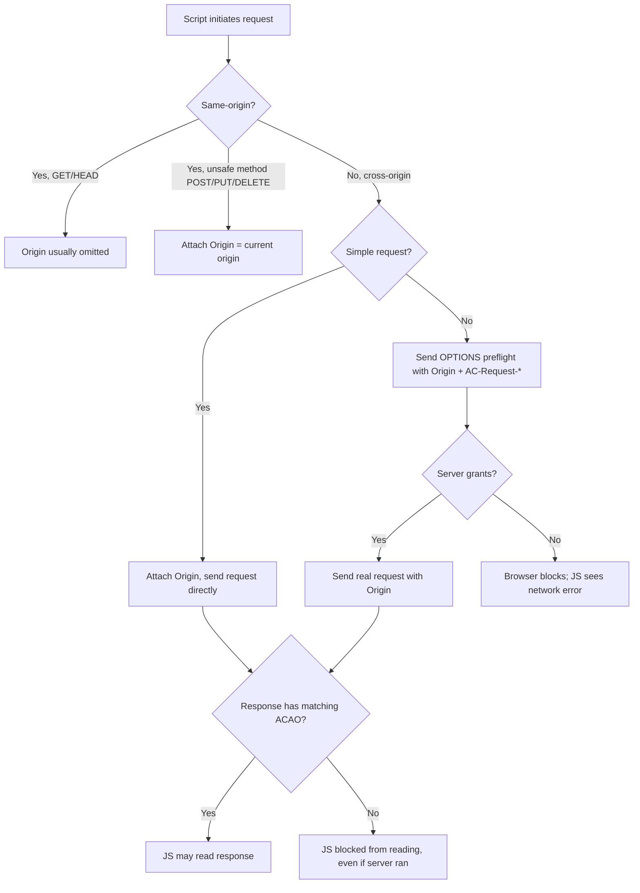
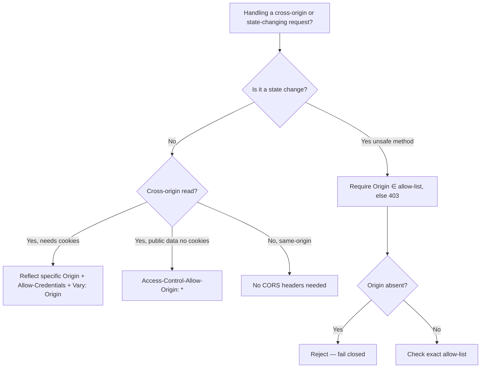

# Origin

## Quick Summary

`Origin` is a request header that names **where a request came from** — the tuple of scheme + host + port (e.g. `Origin: https://app.example.com`), with the path, query, and fragment deliberately stripped off. It is set **by the browser**, not by application code, and — crucially — **page JavaScript cannot forge it**. The browser sends it automatically on all cross-origin requests and on every request that uses an "unsafe" method (anything other than `GET`/`HEAD`). It is the linchpin of two of the browser's most important security mechanisms: **CORS** (the server reads `Origin` to decide whether to grant cross-origin access) and **CSRF defense** (the server reads `Origin` to confirm a state-changing request actually came from an allowed site). Because it is browser-controlled, trimmed of sensitive URL detail, and un-spoofable from script, it is strictly more trustworthy than [Referer](./Referer.md) for these decisions.

## What problem does this header solve?

The browser enforces the **same-origin policy**: script running on `https://app.example.com` should not be able to read data from `https://bank.example.com`. But the modern web *needs* controlled cross-origin communication — a front-end on one origin talking to an API on another, third-party widgets, federated services. The question the server must answer is: *"a request just arrived claiming to be a cross-origin call from site X — should I honor it, and should I let X read my response?"*

To answer that, the server needs a **trustworthy statement of the caller's origin**. It cannot trust anything the calling *script* sets, because a malicious script would just lie. `Origin` solves this by being **stamped by the browser itself**, below the reach of page JavaScript. The server can therefore treat `Origin` as an authentic (if not authenticated) assertion of which security context initiated the request, and make access decisions on it.

The second problem is **CSRF**. A cookie is sent automatically by the browser on any request to its domain — including a `POST` triggered by a malicious page the victim is visiting. The server needs to distinguish "this state-changing request was initiated by my own front-end" from "this was initiated by evil.com using the victim's ambient cookies." `Origin` provides exactly that signal: on a forged cross-site `POST`, the browser attaches `Origin: https://evil.com`, and the server rejects it.

## Why was it introduced?

`Origin` emerged from the CORS work (the "Cross-Origin Resource Sharing" spec, ~2009, later folded into the WHATWG Fetch Standard) and the parallel effort to give servers a reliable CSRF signal (RFC 6454, "The Web Origin Concept," 2011). Before `Origin`, servers trying to detect cross-site requests leaned on [Referer](./Referer.md) — but `Referer` was unreliable: it leaked full URLs (a privacy problem, so it was often stripped by proxies, privacy tools, and `rel=noreferrer`), it could be absent on HTTPS→HTTP transitions, and it carried far more than the server needed.

The designers wanted a header that (1) conveyed *only* the origin tuple — no path, no query, no secrets — so privacy tooling would have no reason to strip it; (2) was defined precisely by the spec and set by the browser so it could be trusted for security decisions; and (3) was sent specifically on the requests that matter for CORS and CSRF (cross-origin and unsafe-method requests). `Origin` is essentially "`Referer`, redesigned as a security primitive with the privacy problems engineered out."

## How does it work?

- **Browser behavior:** The browser computes the current document's origin and attaches `Origin` according to the Fetch Standard's rules: **always** on CORS requests (cross-origin `fetch`/`XHR`), **always** on any request with an unsafe method (`POST`, `PUT`, `DELETE`, `PATCH`) — *even same-origin* — and on cross-origin form submissions and navigations in many cases. For a plain same-origin `GET`/`HEAD` navigation, it is typically **omitted**. Requests from a sandboxed iframe, from `data:` URLs, or after certain redirects get `Origin: null` (see below). Page script cannot set or change it — `Origin` is a [forbidden header name](https://developer.mozilla.org/en-US/docs/Glossary/Forbidden_header_name).
- **Server behavior:** The server reads `Origin` and, for CORS, echoes an allowed value back in `Access-Control-Allow-Origin` (and related headers). For CSRF defense, it compares `Origin` against an allow-list and rejects mismatches on state-changing routes. The server must decide policy; the header is just the input.
- **Proxy behavior:** Forward proxies pass `Origin` through unchanged. It is an end-to-end header; a well-behaved intermediary neither adds nor removes it.
- **CDN behavior:** CDNs often participate in CORS by including `Origin` in the **`Vary`** header logic — a response's `Access-Control-Allow-Origin` depends on the request's `Origin`, so the cache must key on it or it will serve one origin's CORS grant to another. Many CDNs offer CORS handling at the edge.
- **Reverse proxy behavior:** Nginx/Envoy pass `Origin` through. Some deployments terminate CORS at the proxy (adding `Access-Control-Allow-*` there), in which case the proxy reads `Origin` and must be configured with the same allow-list logic the app would use — including proper `Vary: Origin`.

The opaque origin **`null`** deserves special attention. It appears for `Origin: null` requests: sandboxed iframes (`sandbox` without `allow-same-origin`), documents loaded from `data:`/`file:` URLs, and some cross-origin redirect chains. **Never** put `Access-Control-Allow-Origin: null` in your config — attackers can trivially produce a `null` origin (e.g. from a sandboxed iframe) and would gain access. Treat `null` as untrusted.

## HTTP Request Example

A cross-origin API `POST` from a browser front-end:

```http
POST /api/transfer HTTP/1.1
Host: api.example.com
Origin: https://app.example.com
Content-Type: application/json
Cookie: session=abc123

{"to":"acct-42","amount":100}
```

A CORS **preflight** — the browser asks permission before the real request:

```http
OPTIONS /api/transfer HTTP/1.1
Host: api.example.com
Origin: https://app.example.com
Access-Control-Request-Method: POST
Access-Control-Request-Headers: content-type
```

An opaque-origin request (e.g. from a sandboxed iframe):

```http
POST /api/thing HTTP/1.1
Host: api.example.com
Origin: null
```

## HTTP Response Example

The server's CORS answer to the cross-origin `POST` above:

```http
HTTP/1.1 200 OK
Access-Control-Allow-Origin: https://app.example.com
Access-Control-Allow-Credentials: true
Vary: Origin
Content-Type: application/json

{"status":"ok"}
```

The preflight answer:

```http
HTTP/1.1 204 No Content
Access-Control-Allow-Origin: https://app.example.com
Access-Control-Allow-Methods: POST, GET, OPTIONS
Access-Control-Allow-Headers: Content-Type
Access-Control-Allow-Credentials: true
Access-Control-Max-Age: 600
Vary: Origin
```

Note the reflected-but-validated `Access-Control-Allow-Origin` and the mandatory `Vary: Origin` — without `Vary`, a shared cache could hand `app.example.com`'s CORS grant to a different origin.

## Express.js Example

```js
const express = require('express');
const app = express();
app.use(express.json());

// Single source of truth for who may call us cross-origin.
const ALLOWED_ORIGINS = new Set([
  'https://app.example.com',
  'https://admin.example.com',
]);

// ---- CORS handling (reflect-if-allowed, the only correct dynamic pattern) ----
app.use((req, res, next) => {
  const origin = req.get('origin'); // undefined on same-origin GETs

  if (origin && ALLOWED_ORIGINS.has(origin)) {
    // Reflect the SPECIFIC origin, never '*', because we send credentials.
    // '*' is forbidden together with Allow-Credentials: true by spec.
    res.setHeader('Access-Control-Allow-Origin', origin);
    res.setHeader('Access-Control-Allow-Credentials', 'true');
  }
  // ALWAYS Vary on Origin: the response body/headers differ per origin, so a
  // shared cache must not reuse one origin's grant for another. Removing this
  // is a real cross-origin data-leak via cache.
  res.setHeader('Vary', 'Origin');

  // Answer preflights here and short-circuit.
  if (req.method === 'OPTIONS') {
    res.setHeader('Access-Control-Allow-Methods', 'GET,POST,PUT,DELETE,OPTIONS');
    res.setHeader('Access-Control-Allow-Headers', 'Content-Type');
    res.setHeader('Access-Control-Max-Age', '600'); // cache preflight 10 min
    return res.status(204).end();
  }
  next();
});

// ---- CSRF defense on state-changing routes, using Origin as the signal ----
function requireTrustedOrigin(req, res, next) {
  // Only unsafe methods can change state; GET/HEAD are exempt.
  if (['GET', 'HEAD', 'OPTIONS'].includes(req.method)) return next();

  const origin = req.get('origin');
  // Fall back to Referer's origin ONLY if Origin is absent (rare on unsafe methods).
  const source = origin || (req.get('referer') ? new URL(req.get('referer')).origin : null);

  // No trustworthy source, or not in the allow-list → reject. We fail CLOSED.
  if (!source || !ALLOWED_ORIGINS.has(source)) {
    return res.status(403).json({ error: 'Cross-origin request rejected' });
  }
  next();
}

app.post('/api/transfer', requireTrustedOrigin, (req, res) => {
  // At this point we KNOW the request came from an allowed origin, so a
  // malicious site cannot ride the victim's session cookie to reach us.
  res.json({ status: 'ok' });
});

app.listen(3000);
```

Why each line matters: reflecting the *specific* origin (not `*`) is mandatory once `Access-Control-Allow-Credentials: true` is set — the combination `*` + credentials is illegal and the browser blocks it. Dropping `Vary: Origin` lets a CDN serve one tenant's `Access-Control-Allow-Origin` to another. Removing `requireTrustedOrigin` reopens classic CSRF: the browser would attach the session cookie to a forged `POST` from evil.com, and without the `Origin` check the server would process it.

## Node.js Example

```js
const http = require('http');
const { URL } = require('url');

const ALLOWED = new Set(['https://app.example.com']);

const server = http.createServer((req, res) => {
  const origin = req.headers.origin; // lowercased key; value verbatim or undefined

  // Enforce Origin-based CSRF defense before any state change.
  if (!['GET', 'HEAD', 'OPTIONS'].includes(req.method)) {
    if (!origin || !ALLOWED.has(origin)) {
      res.writeHead(403, { 'Content-Type': 'text/plain' });
      return res.end('Forbidden: bad Origin');
    }
  }

  // Minimal CORS reflect-if-allowed.
  if (origin && ALLOWED.has(origin)) {
    res.setHeader('Access-Control-Allow-Origin', origin);
    res.setHeader('Access-Control-Allow-Credentials', 'true');
  }
  res.setHeader('Vary', 'Origin'); // even the raw layer must not skip this

  if (req.method === 'OPTIONS') {
    res.writeHead(204, {
      'Access-Control-Allow-Methods': 'GET,POST,OPTIONS',
      'Access-Control-Allow-Headers': 'Content-Type',
    });
    return res.end();
  }

  res.writeHead(200, { 'Content-Type': 'application/json' });
  res.end(JSON.stringify({ ok: true }));
});

server.listen(3000);
```

The raw layer makes explicit that *nothing* is automatic: Node hands you `req.headers.origin` verbatim and you own every policy decision. Note we compare against a `Set` with exact strings — no substring matching, which would allow `https://app.example.com.evil.com`.

## React Example

React (and the browser) attach `Origin` automatically; you neither set it nor should try to (it is forbidden). Your job on the client is to make sure credentialed cross-origin requests are configured so the *server's* CORS grant is actually honored:

```jsx
async function transfer(amount) {
  const res = await fetch('https://api.example.com/api/transfer', {
    method: 'POST',
    // credentials: 'include' tells the browser to send cookies cross-origin.
    // The browser will ALSO require the server to answer with a specific
    // Access-Control-Allow-Origin + Allow-Credentials: true, or it blocks
    // your code from reading the response. The Origin header is added for you.
    credentials: 'include',
    headers: { 'Content-Type': 'application/json' }, // triggers a preflight
    body: JSON.stringify({ amount }),
  });
  if (!res.ok) throw new Error('rejected');
  return res.json();
}
```

If you ever *see* `Origin` in your React code, something is wrong — it only appears in the browser's outgoing request, visible in DevTools, never in JS-writable objects. The React-relevant subtlety is that a non-simple `Content-Type` or custom header **triggers a CORS preflight** (`OPTIONS` carrying `Origin` + `Access-Control-Request-*`); designing your API so common calls stay "simple" avoids the extra round trip, though for credentialed APIs the preflight is usually unavoidable and cached via `Access-Control-Max-Age`.

## Browser Lifecycle



Key nuance for security review: on a *blocked* CORS request, the server may still have **executed the request** — the browser only prevents the *script* from reading the *response*. That is why CORS is not a substitute for the `Origin`-based CSRF check on state-changing endpoints; CORS protects reads, the `Origin` allow-list protects writes.

## Production Use Cases

- **SPA + separate API host.** `app.example.com` (React) calling `api.example.com` (Express). The API allow-lists the app's origin and reflects it in `Access-Control-Allow-Origin`.
- **CSRF-hardened mutations.** State-changing endpoints reject any request whose `Origin` is not in the allow-list — a lightweight, token-free layer of CSRF defense (best combined with `SameSite` cookies).
- **Multi-tenant / multi-brand front-ends.** One API serves several first-party origins; the reflect-if-in-allow-list pattern grants each without wildcarding.
- **Public read-only APIs.** `Access-Control-Allow-Origin: *` for non-credentialed public data (no cookies, no auth) — the one case where wildcarding is correct.
- **WebSocket / SSE origin checks.** Servers validate the `Origin` of upgrade requests to prevent cross-site WebSocket hijacking (the same-origin policy does *not* natively cover WebSockets).

## Common Mistakes

- **`Access-Control-Allow-Origin: *` with `Allow-Credentials: true`.** Illegal combo; browser blocks it. Reflect the specific origin instead.
- **Blindly reflecting *any* `Origin`.** Echoing back whatever came in, with credentials, is equivalent to allowing all origins to read authenticated responses — a serious data-exposure bug.
- **Allowing `null`.** Attackers produce `Origin: null` from sandboxed iframes; `Access-Control-Allow-Origin: null` grants them access.
- **Substring/regex matching origins.** `origin.endsWith('example.com')` matches `evil-example.com`; `origin.includes('example.com')` matches `example.com.evil.net`. Use exact set membership or a carefully anchored regex.
- **Forgetting `Vary: Origin`** behind a cache — one origin's grant gets served to another.
- **Treating CORS as CSRF protection.** CORS restricts *reading responses*; it does not stop the *request* from executing. Simple cross-origin `POST`s go through without preflight.
- **Relying on `Origin` being present** on same-origin `GET`s (it often isn't) — build logic around when the spec actually sends it.

## Security Considerations

`Origin` is a **security primitive**, and its value comes precisely from what page script *cannot* do to it:

- **Un-spoofable from JavaScript.** A malicious script on evil.com cannot set `Origin: https://app.example.com`; the browser stamps the true origin. This is why it is safe to base access decisions on it *for browser-originated traffic*.
- **But not authentication.** Non-browser clients (curl, server-to-server, a compromised native app) can send any `Origin`. So `Origin` proves "a browser in origin X initiated this," not "user U authorized this." Pair it with real auth. For high-value actions, layer `Origin` checks with `SameSite=Strict/Lax` cookies and/or CSRF tokens (defense in depth).
- **CSRF defense.** Rejecting unsafe-method requests whose `Origin` isn't allow-listed defeats classic cookie-riding CSRF, because the browser truthfully labels the forged request with the attacker's origin.
- **Why more trustworthy than `Referer`.** `Referer` can be stripped (by policy, proxies, privacy tools) — so a missing `Referer` is ambiguous and you can't fail-closed without breaking legitimate users. `Origin` is sent reliably on exactly the requests that matter and carries no sensitive path/query, so it's rarely stripped and safe to require.
- **Opaque `null` is hostile-controllable.** Never trust it.
- **Fail closed.** On unsafe methods, absence or mismatch of `Origin` should be a rejection, not a pass.

## Performance Considerations

- **Preflight round trips.** Non-simple cross-origin requests cost an extra `OPTIONS` before the real call. Mitigate with `Access-Control-Max-Age` (cache the preflight; browsers cap it, ~2 hours in Chrome) and by keeping requests "simple" where feasible.
- **`Vary: Origin` fragments the cache.** Correct for CORS, but it means the cache stores a separate entry per origin. For truly public assets served with `*`, you can *avoid* `Vary: Origin` (since the response is identical for all) and get a single, highly cacheable entry.
- **Header size is trivial.** `Origin` is one short line; no meaningful transfer cost.
- **Edge CORS** (handling `OPTIONS` at the CDN/reverse proxy) removes preflight latency by answering close to the user instead of round-tripping to origin.

## Reverse Proxy Considerations

If you terminate CORS at Nginx, replicate the reflect-if-allowed + `Vary` logic exactly:

```nginx
map $http_origin $cors_ok {
    default                     "";
    "https://app.example.com"   $http_origin;   # exact match only
    "https://admin.example.com" $http_origin;
}

server {
  location /api/ {
    if ($cors_ok != "") {
      add_header Access-Control-Allow-Origin  $cors_ok always;
      add_header Access-Control-Allow-Credentials true always;
    }
    add_header Vary Origin always;              # even when no match

    if ($request_method = OPTIONS) {
      add_header Access-Control-Allow-Methods "GET,POST,OPTIONS" always;
      add_header Access-Control-Allow-Headers "Content-Type" always;
      add_header Access-Control-Max-Age 600 always;
      return 204;
    }
    proxy_pass http://app_upstream;
    proxy_set_header Origin $http_origin;       # pass through to app if it also checks
  }
}
```

The `map` gives you an exact allow-list (no accidental substring match). The `always` flag ensures headers are emitted even on error responses. Note the classic Nginx footgun: adding *any* `add_header` in a `location` drops all inherited `add_header`s from the parent scope — so declare them together.

## CDN Considerations

- **Cache key must include `Origin`** whenever the response's `Access-Control-Allow-Origin` varies by request — enforced via `Vary: Origin`. Some CDNs need this configured explicitly in the cache key, not just via `Vary`.
- **Edge CORS.** Cloudflare Workers / Lambda@Edge / CloudFront function can answer preflights and inject CORS headers at the edge, cutting latency; just re-implement the allow-list carefully.
- **Public assets with `*`.** Fonts, public JSON, and images served cross-origin typically use `Access-Control-Allow-Origin: *` (no credentials) and *omit* `Vary: Origin` for maximum cache efficiency.
- **Don't let the CDN cache a credentialed CORS response publicly** — mark such responses `Cache-Control: private` so an authenticated, origin-specific grant is never stored in a shared cache.

## Cloud Deployment Considerations

- **API Gateway (AWS)** has first-class CORS config that emits `Access-Control-Allow-*` and handles `OPTIONS`; make sure it reflects specific origins (not `*`) if you use cookies/credentials, and that it sets `Vary: Origin`.
- **ALB / App Runner / Cloud Run** pass `Origin` through to your container; CORS is usually handled in-app.
- **S3 / GCS static buckets** have their own CORS configuration (an XML/JSON policy listing `AllowedOrigins`) — this is where cross-origin font/asset loading is granted; bucket CORS is separate from your app's CORS.
- **Managed WAFs** can enforce origin allow-lists at the edge as an extra CSRF layer for mutating routes.

## Debugging

- **Chrome DevTools:** Network → request → Headers shows the outgoing `Origin`. A blocked CORS call surfaces a red console error naming the failing rule (missing `Access-Control-Allow-Origin`, `*`-with-credentials, etc.). The failed request still appears in the Network tab even though your JS got a "network error."
- **curl:** `curl -v -H 'Origin: https://app.example.com' -X POST https://api.example.com/api/transfer` shows exactly what the server returns for a given origin. Test a preflight: `curl -v -X OPTIONS -H 'Origin: https://app.example.com' -H 'Access-Control-Request-Method: POST' https://api.example.com/api/transfer`. curl lets you send *any* `Origin` — useful for confirming your allow-list rejects bad ones (and a reminder that non-browser clients aren't constrained).
- **Postman / Bruno:** Set a custom `Origin` header to probe CORS/CSRF policy. Note both ignore the browser's forbidden-header rules, so they can spoof `Origin` — great for testing server behavior, not representative of real browser constraints.
- **Node.js:** log `req.headers.origin` to see presence/absence patterns across methods and same/cross-origin calls.
- **Express logging:** `morgan(':method :url :req[origin] :status')` to correlate origins with accept/reject outcomes.

## Best Practices

- [ ] Treat `Origin` as trustworthy for *browser* requests, but never as authentication.
- [ ] Maintain a single exact-match origin allow-list; reflect the matched origin, never blanket-echo.
- [ ] Never combine `Access-Control-Allow-Origin: *` with `Allow-Credentials: true`.
- [ ] Never allow `Origin: null`.
- [ ] Always send `Vary: Origin` when the CORS grant depends on the request origin.
- [ ] Enforce an `Origin` allow-list on all state-changing (unsafe-method) routes for CSRF defense; fail closed on absence/mismatch.
- [ ] Combine with `SameSite` cookies and, for high-value actions, CSRF tokens (defense in depth).
- [ ] Use `Access-Control-Max-Age` to amortize preflights.
- [ ] Mark credentialed CORS responses `Cache-Control: private`.

## Related Headers

- [Referer](./Referer.md) — the older, leakier, strippable cousin; `Origin` was designed to replace it for security decisions.
- [Host](./Host.md) — the *callee's* hostname; `Origin` is the *caller's* full origin. Together they describe both ends.
- [CORS Overview](../07-CORS/CORS-Overview.md) and the `Access-Control-Allow-Origin` / `-Credentials` / `-Methods` / `-Headers` / `-Max-Age` family — the response side of the CORS conversation `Origin` opens.
- `Vary` — must include `Origin` for correct caching of origin-dependent responses.
- `Sec-Fetch-Site` / `Sec-Fetch-Mode` — newer browser-set Fetch Metadata headers that give even richer, un-spoofable request-context signals for CSRF-style defenses.
- Cookie / `Set-Cookie` (`SameSite`) — the ambient-credential mechanism `Origin` checks defend against.

## Decision Tree



## Mental Model

`Origin` is the **return address the post office writes for you, in ink you can't erase.** On a normal letter (same-origin GET) the post office doesn't bother — you're mailing yourself. But the moment you send something consequential (a `POST`) or mail across town (cross-origin), the post office stamps *where you actually are* onto the envelope, and there is no way for you to write a fake return address in that ink. The recipient (server) uses that stamp two ways: to decide whether to let you read the reply they hand back (CORS), and to decide whether to act on a demand at all (CSRF). Because the stamp is applied by the trusted post office rather than the sender, it's the one piece of "where did this come from" you can actually believe — as long as you remember that only *browsers* use this particular post office; a determined sender with their own printing press (curl) can forge the whole envelope.
