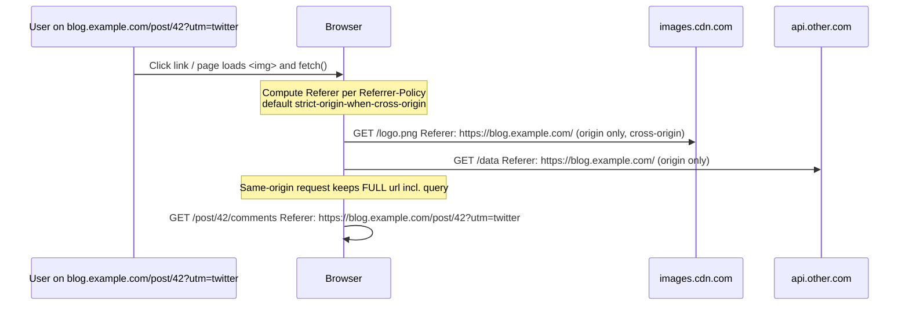
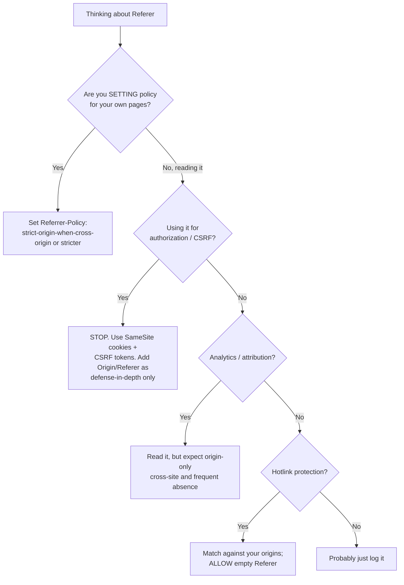

# Referer

## Quick Summary

`Referer` is a **request** header set automatically by the browser that tells the server *where the request came from* — the absolute (or, under policy, trimmed) URL of the page that triggered the navigation, link click, form submission, or sub-resource load. It is the source of most web analytics attribution, a common (and fragile) CSRF signal, and one of the largest silent privacy leaks on the web: by default a browser will tell every image host, script CDN, and API endpoint the exact URL — path and query string included — of the page the user was looking at. It is famously **misspelled** (the correct English word is "referrer"), a typo baked into HTTP/1.0 forever. Its behavior today is almost entirely governed by [`Referrer-Policy`](../05-Security-Headers/Referrer-Policy.md), which is why the two headers must be understood together.

## What problem does this header solve?

In the early web, a site owner had no way to know *how* a visitor arrived. Did they click a link on a partner site? Come from a search engine? Follow an ad? `Referer` answered that: the browser volunteers the originating URL on each request, so the server can build referral reports, attribute conversions to marketing channels, detect hotlinking (other sites embedding your images and stealing your bandwidth), and reconstruct navigation paths.

It also solved a security-adjacent problem cheaply: because the browser sets `Referer` and page JavaScript cannot forge it for a cross-origin request, servers began using it as a lightweight *is this request coming from my own pages?* check — a poor-man's CSRF and hotlink defense. That reuse turned out to be both useful and dangerous, which is the tension this page keeps returning to.

## Why was it introduced?

`Referer` appears in HTTP/1.0 (RFC 1945, 1996) and is formalized in HTTP/1.1 (RFC 2616, 1999; current text RFC 9110). The misspelling was introduced in the original proposal by Phillip Hallam-Baker and was already deployed too widely to fix by the time anyone noticed — so the *header* is `Referer` while the *policy header*, coined much later, correctly spells it [`Referrer-Policy`](../05-Security-Headers/Referrer-Policy.md). Remember: one R in the request header, two R's in the policy.

The header long predates any privacy model. For roughly two decades browsers sent the full URL cross-origin by default, and the web quietly leaked query strings — session tokens, search terms, document IDs, password-reset nonces embedded in URLs — to third parties. The modern era began with the W3C **Referrer Policy** specification (2014 onward), which gave sites control, and culminated around 2020 when Chrome, Firefox, and Safari changed the browser *default* to `strict-origin-when-cross-origin`. That single default change is the most important fact about `Referer` in production today.

## How does it work?

`Referer` is set by the *user agent*, not by application code, and its value is computed from the current document's URL and the applicable referrer policy at the moment the request is initiated. Roughly: the browser takes the "referrer source" (the page URL), strips it according to policy (full URL, origin-only, or nothing), and attaches it to the outgoing request — for navigations, form posts, `fetch`/XHR, and every sub-resource (``, `<script>`, `<link>`, `<iframe>`).

- **Browser behavior:** Computes the value per the effective [`Referrer-Policy`](../05-Security-Headers/Referrer-Policy.md) (from the response header, a `<meta name="referrer">`, or a per-element `referrerpolicy`/`rel="noreferrer"` attribute). Applies hard rules regardless of policy: it **never sends a `Referer` for HTTPS→HTTP downgrades** under the modern default, and it **strips the fragment (`#...`), username, and password** from the URL in all cases. It omits `Referer` entirely when the source is a `data:` or `file:` URL, or when navigation originates from the address bar / bookmark (a "user-initiated" navigation has no referrer).
- **Server behavior:** Reads `Referer` from the request for analytics, hotlink protection, or CSRF checks. The server cannot trust it as an authentication signal — it can be absent, trimmed to origin, spoofed by a non-browser client, or blocked by a privacy extension.
- **Proxy behavior:** `Referer` is an end-to-end header; a well-behaved forward proxy forwards it unchanged. Privacy-focused proxies may strip or rewrite it.
- **CDN behavior:** CDNs frequently *inspect* `Referer` for hotlink protection rules (allow requests only when `Referer` matches your domains) and may log it. Because it can vary the response (allow vs. 403), you may need [`Vary: Referer`](../06-Caching-Headers/Vary.md) if you branch on it — though this fragments the cache badly and is usually avoided.
- **Reverse proxy behavior:** Nginx exposes it as `$http_referer` for logging and access control (`valid_referers`). It is passed upstream untouched unless you rewrite it.



## HTTP Request Example

A same-origin sub-resource request carries the **full** referring URL, including path and query, under the modern default:

```http
GET /assets/app.js HTTP/1.1
Host: blog.example.com
Referer: https://blog.example.com/post/42?utm_source=twitter
Sec-Fetch-Site: same-origin
```

A cross-origin request from the same page is trimmed to the **origin only** (no path, no query) by `strict-origin-when-cross-origin`:

```http
GET /logo.png HTTP/1.1
Host: images.cdn.com
Referer: https://blog.example.com/
Sec-Fetch-Site: cross-site
```

## HTTP Response Example

`Referer` never appears on a response. The server's lever over it is the [`Referrer-Policy`](../05-Security-Headers/Referrer-Policy.md) response header, which instructs the browser what to send on *subsequent* requests originating from this document:

```http
HTTP/1.1 200 OK
Content-Type: text/html; charset=utf-8
Referrer-Policy: strict-origin-when-cross-origin
```

A more locked-down page that wants to leak nothing beyond its own origin — or nothing at all — would send `Referrer-Policy: same-origin` or `Referrer-Policy: no-referrer`.

## Express.js Example

```js
const express = require('express');
const app = express();

// 1) Read Referer for analytics/attribution. Note the misspelling in the header name.
app.use((req, res, next) => {
  // req.get is case-insensitive; both 'referer' and 'referrer' resolve to the same header.
  const referer = req.get('referer') || null;
  // Never trust this for auth. It may be absent, origin-only, or forged by a non-browser.
  req.attribution = referer ? new URL(referer).origin : 'direct';
  next();
});

// 2) Set a sane Referrer-Policy globally so YOUR pages stop leaking full URLs cross-origin.
app.use((req, res, next) => {
  // This governs what the browser will put in Referer on requests FROM pages we serve.
  // strict-origin-when-cross-origin: full URL same-origin, origin-only cross-origin,
  // nothing on HTTPS->HTTP downgrade. Matches the browser default but makes it explicit
  // (and protects users on older browsers that still default to full-URL leakage).
  res.set('Referrer-Policy', 'strict-origin-when-cross-origin');
  next();
});

// 3) Hotlink protection: only serve images when the Referer is one of our own origins.
const ALLOWED = new Set(['https://blog.example.com', 'https://www.example.com']);
app.get('/assets/:img', (req, res, next) => {
  const referer = req.get('referer');
  // Allow requests with NO referer (direct hits, privacy tools, origin-stripped) to avoid
  // false positives — hotlink protection that blocks empty Referer breaks legit users.
  if (referer) {
    let origin;
    try { origin = new URL(referer).origin; } catch { origin = null; }
    if (origin && !ALLOWED.has(origin)) {
      return res.status(403).type('image/svg+xml').send('<svg/>'); // deny hotlinkers
    }
  }
  next(); // fall through to express.static
});

// 4) Referer as a SUPPLEMENTARY CSRF signal — never the only one.
function checkOriginReferer(req, res, next) {
  const source = req.get('origin') || req.get('referer'); // prefer Origin; Referer is fallback
  const ok = source && new URL(source).origin === 'https://app.example.com';
  if (!ok) return res.status(403).json({ error: 'cross-origin request rejected' });
  next(); // still require a CSRF token or SameSite cookie behind this
}
app.post('/api/transfer', checkOriginReferer, /* csrfToken, */ (req, res) => {
  res.json({ ok: true });
});

app.listen(3000);
```

Every piece is load-bearing: the `Referrer-Policy` middleware stops *your* pages leaking; the hotlink check deliberately allows an empty `Referer` so privacy-conscious users are not locked out; the CSRF check prefers [`Origin`](./Origin.md) (which is present on cross-origin state-changing requests and harder to strip) and treats `Referer` only as a fallback behind a real token.

## Node.js Example

Raw `http` gives you the header verbatim and sets nothing for you:

```js
const http = require('http');

http.createServer((req, res) => {
  // Header keys are lowercased by Node. The wire spelling is 'referer'.
  const referer = req.headers['referer'] || '(none)';
  console.log(`${req.method} ${req.url}  from ${referer}`);

  // You are fully responsible for emitting Referrer-Policy — no framework default here.
  res.setHeader('Referrer-Policy', 'strict-origin-when-cross-origin');
  res.end('ok');
}).listen(3000);
```

The contrast with Express is minimal for reading, but note the absence of `req.get()` niceties — you index `req.headers['referer']` directly, and you must remember the misspelling.

## React Example

React never sets `Referer` — the browser does. React's influence is entirely indirect, through the attributes it renders and the fetch options it passes:

```jsx
// 1) Per-link control via rel/referrerPolicy — React just renders the attribute.
function OutboundLink({ href, children }) {
  return (
    // rel="noreferrer" strips Referer entirely for this navigation (and severs window.opener).
    // Use it on links to untrusted third parties so you never leak your current URL.
    <a href={href} target="_blank" rel="noreferrer noopener">{children}</a>
  );
}

// 2) Per-image control — don't leak the page URL to a third-party image host.
function Avatar({ src }) {
  return ;
}

// 3) fetch() inherits the document's Referrer-Policy but can override per request.
async function loadData() {
  const res = await fetch('https://api.other.com/data', {
    referrerPolicy: 'strict-origin-when-cross-origin', // don't send our path/query cross-site
    // referrer: '' would suppress Referer entirely; a specific same-origin URL is also allowed
  });
  return res.json();
}
```

The React-specific gotcha: the JSX prop is `referrerPolicy` (camelCase, correctly spelled with two R's), and the link `rel="noreferrer"` is spelled with two R's — but if you ever set the raw header on a response from your Node/Express layer, it is `Referrer-Policy`. Only the *request* header keeps the one-R typo.

## Browser Lifecycle

1. **Navigation or sub-resource fetch is initiated** from a document at URL `S`.
2. **Determine the effective referrer policy**: per-element (`rel="noreferrer"`, `referrerpolicy`) > document `<meta name="referrer">` > response [`Referrer-Policy`](../05-Security-Headers/Referrer-Policy.md) > browser default (`strict-origin-when-cross-origin`).
3. **Strip unconditionally**: remove fragment, username, password from `S`.
4. **Apply downgrade rule**: if the destination is a less-secure scheme (HTTPS→HTTP), send **no** `Referer` under the default/strict policies.
5. **Apply trimming**: same-origin → full URL; cross-origin → origin-only (default); or full/none per stricter policy.
6. **Omit entirely** when the source is `data:`/`file:`, an address-bar/bookmark navigation, or policy is `no-referrer`.
7. **Attach** the computed value (or nothing) and send the request. The value the server sees is the *result* of all the above — never assume it equals the current page URL.

## Production Use Cases

- **Marketing attribution / analytics:** Google Analytics, Plausible, and homegrown pipelines classify traffic (organic search, referral, direct) primarily from `Referer`. Origin-only trimming means you lose the *path* of the referring page cross-site — a real, deliberate data-quality trade-off for privacy.
- **Hotlink protection:** CDNs and origins reject image/video requests whose `Referer` isn't your domain, stopping other sites from embedding (and billing you for) your media.
- **Supplementary CSRF/abuse checks:** Verify a state-changing POST appears to come from your own origin, as defense-in-depth behind CSRF tokens / `SameSite` cookies.
- **Debugging navigation flows:** Support and observability teams read `Referer` in access logs to reconstruct how a user reached an error page.
- **Affiliate / partner tracking:** Confirming inbound clicks genuinely originated on a partner's site before crediting a commission.

## Common Mistakes

- **Using `Referer` as the sole CSRF defense.** It can be legitimately absent (privacy tools, origin-stripping policy, HTTPS→HTTP), so a "reject if `Referer` doesn't match" rule either blocks real users or is trivially bypassed when you allow-empty. Use `SameSite` cookies + CSRF tokens; treat `Referer`/[`Origin`](./Origin.md) as *additional* signals.
- **Assuming the full URL is present.** Since 2020 the default trims cross-origin requests to origin-only. Analytics code that parses the referring *path* silently gets nothing cross-site.
- **Leaking secrets in URLs.** Putting session tokens, password-reset nonces, or PII in query strings means any cross-origin sub-resource (an ad pixel, a third-party font) historically received them via `Referer`. Never put secrets in the URL, and set a strict [`Referrer-Policy`](../05-Security-Headers/Referrer-Policy.md).
- **Hotlink rules that block empty `Referer`.** Legitimate users behind privacy proxies send no `Referer`; blocking them causes broken images for real customers.
- **Confusing the spellings.** Reading `req.headers['referrer']` (two R's) returns `undefined` — the wire header is `referer`. Conversely, setting `Referer-Policy` (one R) as a response header does nothing; the correct name is `Referrer-Policy`.
- **Branching responses on `Referer` without `Vary`.** If a cache stores a `200` served to an allowed referer and later serves it to a request that should get `403` (or vice versa), you get incorrect behavior unless you [`Vary: Referer`](../06-Caching-Headers/Vary.md) — which then shreds cache efficiency.

## Security Considerations

- **Information disclosure is the primary risk.** Full-URL `Referer` leaks paths and query strings — potentially session IDs, JWTs, document identifiers, internal hostnames — to every third party a page contacts. The mitigation is a strict [`Referrer-Policy`](../05-Security-Headers/Referrer-Policy.md) plus a discipline of never encoding secrets in URLs.
- **HTTPS→HTTP downgrade protection** is built into the modern default: the browser withholds `Referer` when navigating to a less-secure origin, so a passive network attacker on the HTTP leg cannot read the HTTPS URL you came from. Do not weaken this with `unsafe-url`.
- **`Referer` is trivially spoofable by non-browsers.** curl, bots, and servers set any value they like. Never grant authorization based on it.
- **CSRF nuance:** `Referer` *can* strengthen CSRF defenses because page script cannot set it cross-origin — but because it is often stripped, `SameSite=Lax/Strict` cookies and per-request tokens are the real defense; `Referer`/`Origin` checks are belt-and-suspenders.
- **`window.opener` / tabnabbing:** links opened with `target="_blank"` without `rel="noopener"` let the destination control your tab. `rel="noreferrer"` implies `noopener` *and* strips `Referer` — prefer it for untrusted outbound links.

## Performance Considerations

- `Referer` adds a few dozen to a few hundred bytes to every request; on HTTP/2 and HTTP/3, HPACK/QPACK header compression makes the marginal cost negligible for same-value repeats.
- The real performance interaction is with caching: if you make responses *depend* on `Referer` (hotlink allow/deny), you must either handle it at an edge layer that doesn't pollute the shared cache key, or accept cache fragmentation via [`Vary: Referer`](../06-Caching-Headers/Vary.md). Prefer edge/WAF-level referer rules that return the same cacheable body and only gate access.
- Stripping to origin-only (the default) very slightly reduces header size cross-origin — a rounding-error benefit, not a reason to choose a policy.

## Reverse Proxy Considerations

Nginx exposes `Referer` as `$http_referer` and has first-class hotlink support:

```nginx
# Hotlink protection for media. valid_referers lists what is allowed;
# `none` = requests with NO Referer, `blocked` = Referer present but stripped by a firewall.
location /assets/ {
    valid_referers none blocked server_names
                   blog.example.com www.example.com;
    if ($invalid_referer) {          # set to "1" when Referer matches none of the above
        return 403;
    }
    try_files $uri =404;
}

# Log the referring URL for offline attribution analysis.
log_format withref '$remote_addr "$request" ref="$http_referer" ua="$http_user_agent"';
access_log /var/log/nginx/access.log withref;

# Ensure our own pages set a privacy-preserving policy even if the app forgets.
add_header Referrer-Policy "strict-origin-when-cross-origin" always;
```

`valid_referers none blocked` deliberately allows empty/stripped referers so privacy tooling doesn't break legitimate users. `add_header ... always` guarantees the policy is present even on error responses the upstream didn't decorate.

## CDN Considerations

- **Cloudflare / Fastly / CloudFront** all support **hotlink protection** as a config toggle or WAF rule that inspects `Referer` at the edge — cheaper than doing it at origin and it keeps bad traffic off your servers. Cloudflare's "Hotlink Protection" is one click; Fastly/CloudFront use custom VCL / Lambda@Edge / functions.
- CDNs **log `Referer`** in edge access logs; if those logs flow to a third-party analytics vendor, you may be exporting user URLs — audit for privacy/compliance.
- If an edge rule *branches* on `Referer` (200 vs 403), be careful: either exclude `Referer` from the cache key and gate purely on access (return the same body), or add it to the key. Never let a "200 for allowed referer" get cached and replayed to a disallowed one.
- Some CDNs strip or normalize `Referer` on cache-fill requests to origin; verify what your origin actually receives.

## Cloud Deployment Considerations

- **Load balancers (AWS ALB, GCP HTTPS LB)** pass `Referer` through untouched and can log it via access logs — useful for attribution, but again a place user URLs land in storage buckets.
- **API Gateways (AWS API Gateway, Apigee, Kong)** can read `Referer` for basic access rules, but the same "don't use it for auth" rule applies; prefer signed tokens.
- **WAFs (AWS WAF, Cloudflare)** commonly ship managed rules that reference `Referer` for bot/abuse heuristics.
- **Serverless / edge functions (Vercel, Netlify, Lambda@Edge)** are an ideal place to implement `Referer`-based routing or hotlink checks without touching origin — but remember to emit [`Referrer-Policy`](../05-Security-Headers/Referrer-Policy.md) from these layers too, since a bare function response has none by default.

## Debugging

- **Chrome DevTools → Network → (request) → Headers:** find the outgoing `Referer` under Request Headers. If it's origin-only or missing, check the page's effective referrer policy (shown nowhere directly — infer from the [`Referrer-Policy`](../05-Security-Headers/Referrer-Policy.md) response header and any `<meta name="referrer">`).
- **curl:** you must set it yourself — `curl -H 'Referer: https://blog.example.com/post/42' https://images.cdn.com/logo.png` — handy for testing hotlink rules. `curl -e https://blog.example.com/ URL` is the shorthand (`-e` = referer).
- **Postman / Bruno:** add a `Referer` header manually in the request builder; both display the exact bytes sent. Bruno lets you script assertions like `expect(res.status).to.equal(403)` against hotlink rules and version them in git.
- **Node.js:** log `req.headers['referer']` — remember it can be `undefined`.
- **Express logging:** `app.use((req,res,next)=>{console.log(req.method,req.url,'ref:',req.get('referer')||'-');next();})` prints the referrer per request, including the empty case.

## Best Practices

- [ ] Set an explicit [`Referrer-Policy`](../05-Security-Headers/Referrer-Policy.md) (`strict-origin-when-cross-origin` as a floor) on every response — don't rely on the browser default alone.
- [ ] Never put secrets, tokens, or PII in URLs/query strings that appear in `Referer`.
- [ ] Treat `Referer` (and [`Origin`](./Origin.md)) as *supplementary* CSRF signals behind `SameSite` cookies and CSRF tokens — never the sole check.
- [ ] For hotlink protection, allow empty/stripped `Referer` so privacy-conscious users aren't blocked.
- [ ] Use `rel="noreferrer noopener"` on outbound links to untrusted third parties.
- [ ] Set `referrerpolicy="no-referrer"` on third-party sub-resources (images, scripts) that don't need your URL.
- [ ] Avoid branching cacheable responses on `Referer`; if unavoidable, handle it at the edge/WAF, not via [`Vary: Referer`](../06-Caching-Headers/Vary.md).
- [ ] Audit CDN/LB access logs and analytics exports for leaked user URLs.
- [ ] Remember the spelling: request header `Referer` (one R), policy header `Referrer-Policy` (two R's).

## Related Headers

- [Referrer-Policy](../05-Security-Headers/Referrer-Policy.md) — the response header that dictates exactly what the browser puts in `Referer`; the single most important companion.
- [Origin](./Origin.md) — a coarser, more reliable "where from" signal (scheme+host+port, present on cross-origin and state-changing requests); preferred over `Referer` for CSRF checks.
- [Vary](../06-Caching-Headers/Vary.md) — required if a cache stores responses that differ by `Referer`; generally avoided due to cache fragmentation.
- [Sec-Fetch-Site / Sec-Fetch-Mode](./Sec-CH-UA.md) — modern Fetch Metadata request headers that convey same-origin/cross-site context more reliably than `Referer` for security decisions.

## Decision Tree



## Mental Model

`Referer` is the **"who sent you?" note pinned to a visitor as they walk into a shop**. Sometimes it's a detailed letter ("came from page X, section Y, searching for Z" — full URL, same-origin), sometimes just a business card ("from example.com" — origin-only, cross-origin), and sometimes the visitor walks in with nothing (privacy tools, downgrade, `no-referrer`). A good shopkeeper *uses* the note for marketing and to spot people sneaking your goods out a side door (hotlinking) — but never lets someone into the vault just because they're holding a note, because notes are easy to forge and easy to leave at home. And critically: *you* are also a visitor to other shops, so [`Referrer-Policy`](../05-Security-Headers/Referrer-Policy.md) is you deciding how much your own customers reveal on their way out your door.
