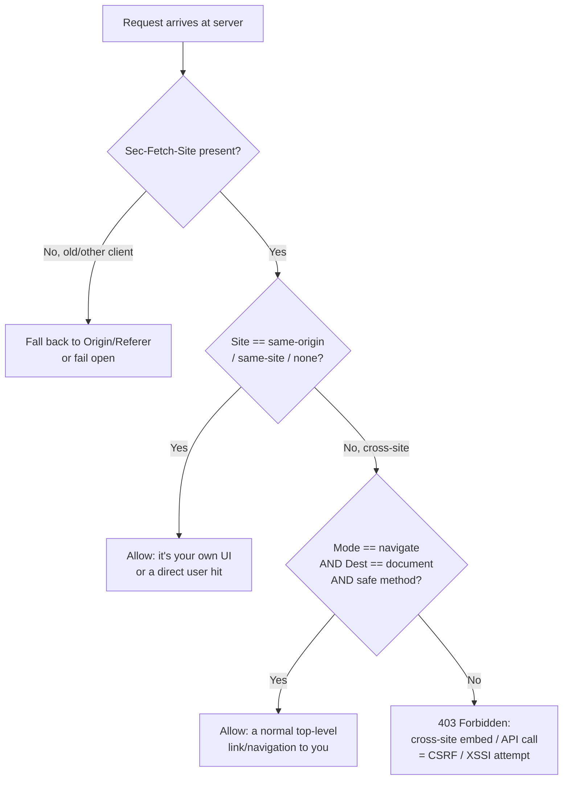
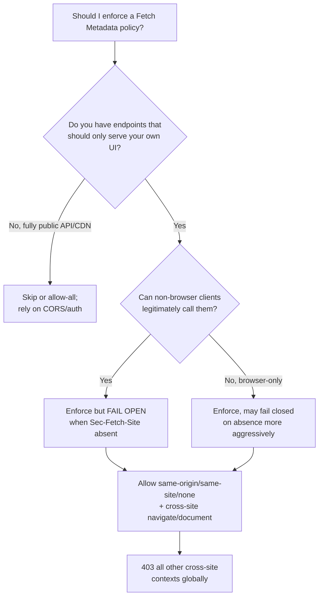

# Sec-Fetch (Fetch Metadata Request Headers)

## Quick Summary

The `Sec-Fetch-*` family — **`Sec-Fetch-Site`**, **`Sec-Fetch-Mode`**, **`Sec-Fetch-User`**, and **`Sec-Fetch-Dest`** — are **request headers the browser sets automatically on every outgoing request** to tell the server *the context in which the request was made*: whether it came from the same site or a cross-site origin, what kind of fetch it is (navigation, CORS, no-cors, websocket), whether a human triggered it, and what resource type it will populate (a `<script>`, an ``, a document, an API call). Together they are called **Fetch Metadata**. They are `Sec-`-prefixed, which makes them **forbidden header names** — page JavaScript cannot set or forge them, so the server can trust them. Their purpose is to let a server implement a **Resource Isolation Policy**: cheaply reject requests whose *context* makes no legitimate sense (a cross-site `` pointing at your JSON API, a cross-origin form POST to your account-delete endpoint), shutting down whole classes of CSRF, XSSI, cross-site leaks, and reflected attacks before your application code even runs.

## What problem does this header solve?

Before Fetch Metadata, a server receiving a request had almost no trustworthy information about *why* the browser sent it. Was `GET /api/account/export` a legitimate `fetch` from your own SPA, or an `` embedded on `evil.com` that the victim's browser dutifully sent *with their cookies attached*? The request bytes look nearly identical. Servers historically leaned on the [`Referer`](../05-Security-Headers/Referrer-Policy.md) and [`Origin`](./Origin.md) headers, but `Referer` is frequently stripped by privacy tools/proxies and is unreliable, and `Origin` is absent on many `GET`s. This ambiguity is the root of **CSRF** (cross-site requests ride the victim's cookies), **XSSI / cross-site script inclusion** (loading your authenticated JSON via `<script>` to read it), and various cross-origin information leaks.

`Sec-Fetch-*` closes the gap by having the browser — which *knows* exactly why it is issuing each request — stamp that context onto the request in a way the page cannot lie about. The server can then apply a blanket rule: "endpoints that only ever serve my own first-party UI should reject any request that arrives with a cross-site, non-navigational, tool-like context." That single rule kills most CSRF and cross-site inclusion attacks with a few lines of middleware, independent of per-endpoint token plumbing.

## Why was it introduced?

Fetch Metadata came out of Google's security work and was standardized in the **Fetch Metadata Request Headers** spec (W3C, first shipped in Chrome 76, 2019; now supported across Chromium, Firefox, and Safari with varying completeness). The motivation was defense-in-depth: existing anti-CSRF mechanisms (synchronizer tokens, `SameSite` cookies) work but require per-form plumbing or have gaps (`SameSite=Lax` still allows top-level cross-site `GET` navigations; token systems are error-prone and easy to forget on a new endpoint). The designers wanted a **declarative, server-side, opt-in isolation policy** that a site could apply globally and that failed *closed* for unexpected contexts.

The `Sec-` prefix is deliberate and specified in the Fetch standard's forbidden-header rules: any header beginning `Sec-` (or `Proxy-`) is a forbidden header name that user-space script (`fetch`, `XMLHttpRequest`) is not permitted to set. This guarantee — the browser is the sole author — is what makes the metadata trustworthy as a security signal, unlike a custom `X-`header an attacker's page could add.

## How does it work?

Four headers describe orthogonal dimensions of a request's provenance. `Sec-Fetch-Site` is the most important for security.

- **`Sec-Fetch-Site`** — the relationship between the request initiator's origin and the target: `same-origin` (identical scheme+host+port), `same-site` (same registrable domain, e.g. `app.example.com` → `api.example.com`), `cross-site`, or `none` (user-initiated with no initiator — typing a URL, a bookmark). This is the axis a Resource Isolation Policy keys on.
- **`Sec-Fetch-Mode`** — the request's mode: `navigate` (a top-level document navigation), `cors` (a `fetch` subject to CORS), `no-cors` (an opaque cross-origin subresource like an ``/`<script>`), `same-origin`, or `websocket`.
- **`Sec-Fetch-User`** — `?1` only when the request was triggered by a genuine user activation (a click, an Enter keypress). Absent otherwise. Distinguishes a user-driven navigation from a script/redirect-driven one.
- **`Sec-Fetch-Dest`** — the *destination* the response will populate: `document`, `image`, `script`, `style`, `font`, `audio`, `empty` (a `fetch`/`XHR` with no element), `iframe`, `worker`, etc. Lets you reject "my JSON API being loaded as a `<script>`" (`Sec-Fetch-Dest: script`).

Behavior across the stack:

- **Browser behavior:** Sets all four on every request from a document/worker context, automatically, based on internal state it alone knows. Page script **cannot** read, set, or remove them. They are sent even on cross-origin `no-cors` requests (unlike `Origin`), which is what makes them uniquely useful.
- **Server behavior:** Reads them and applies a policy. The canonical rule: allow the request if `Sec-Fetch-Site ∈ {same-origin, same-site, none}`, OR it's a top-level navigation (`Sec-Fetch-Mode: navigate` with `Sec-Fetch-Dest: document`) via a safe method; otherwise reject cross-site requests to non-public resources.
- **Proxy behavior:** They are ordinary end-to-end request headers; a well-behaved proxy forwards them untouched. A proxy that strips unknown headers can blind your policy — fail open carefully.
- **CDN / edge behavior:** Increasingly the policy is enforced at the edge (Cloudflare Workers, Fastly, CloudFront Functions) to reject cross-site abuse before it reaches origin. The edge must treat these as part of the cache key considerations only if responses vary by them (rare; usually they gate, not vary).
- **Reverse proxy behavior:** Nginx/Envoy can enforce the same policy in config and 403 early, offloading it from the app.



## HTTP Request Example

A same-origin `fetch` from your own SPA to your API — the benign case your policy allows:

```http
GET /api/account/balance HTTP/1.1
Host: app.example.com
Sec-Fetch-Site: same-origin
Sec-Fetch-Mode: cors
Sec-Fetch-Dest: empty
Cookie: session=…
```

An attacker's page on `evil.com` trying to steal your JSON via `<script src>` — the malicious case your policy blocks:

```http
GET /api/account/balance HTTP/1.1
Host: app.example.com
Sec-Fetch-Site: cross-site
Sec-Fetch-Mode: no-cors
Sec-Fetch-Dest: script
Cookie: session=…
```

Note the browser still attaches the victim's `Cookie` (that is the whole CSRF/XSSI problem), but `Sec-Fetch-Site: cross-site` + `Sec-Fetch-Dest: script` on an endpoint that only ever feeds your own UI is nonsensical, so the server rejects it. A legitimate user clicking a link to your site:

```http
GET /dashboard HTTP/1.1
Host: app.example.com
Sec-Fetch-Site: cross-site
Sec-Fetch-Mode: navigate
Sec-Fetch-User: ?1
Sec-Fetch-Dest: document
```

This is cross-site but it is a real user navigating (`navigate` + `?1` + `document`), so the policy allows it — that is how users reach you from search results or other sites.

## HTTP Response Example

There is no dedicated response header in this family; the server's job is to *react* to the request metadata. A rejection looks like a normal 403, ideally with `Vary` so caches don't serve the rejection to legitimate contexts:

```http
HTTP/1.1 403 Forbidden
Content-Type: text/plain
Vary: Sec-Fetch-Site, Sec-Fetch-Mode, Sec-Fetch-Dest
Content-Length: 24

Cross-site request denied
```

`Vary` here matters if the same URL can legitimately be fetched in some contexts and blocked in others and any shared cache is involved — it keeps the allowed and blocked responses on separate cache keys.

## Express.js Example

A reusable Fetch Metadata Resource Isolation Policy middleware — the production pattern Google publishes:

```js
const express = require('express');
const app = express();

// A global Resource Isolation Policy. Mount it BEFORE your routes so every
// endpoint is protected by default (fail-closed for cross-site abuse).
function fetchMetadataPolicy(options = {}) {
  // Endpoints that MUST be embeddable/loadable cross-site (e.g. a public
  // widget, an oEmbed image, an OG-image). Everything else is isolated.
  const allowCrossSitePaths = options.allowCrossSitePaths || [];

  return function (req, res, next) {
    const site = req.get('Sec-Fetch-Site');

    // 1) No Sec-Fetch-Site => old browser, proxy stripped it, or a non-browser
    //    client (curl, server-to-server). Fetch Metadata is defense-in-depth,
    //    not your only control, so we FAIL OPEN here and let other auth run.
    if (!site) return next();

    // 2) same-origin/same-site are your own surfaces; 'none' is a direct user
    //    action (typed URL, bookmark). All safe -> allow.
    if (site === 'same-origin' || site === 'same-site' || site === 'none') {
      return next();
    }

    // 3) From here, site === 'cross-site'. Allow explicitly-public resources.
    if (allowCrossSitePaths.some((p) => req.path.startsWith(p))) {
      return next();
    }

    // 4) Allow legitimate cross-site TOP-LEVEL navigations (users clicking a
    //    link to you from another site). Must be a real navigation to a
    //    document via a safe method — not an embedded subresource or a POST.
    const mode = req.get('Sec-Fetch-Mode');
    const dest = req.get('Sec-Fetch-Dest');
    const isSafe = req.method === 'GET' || req.method === 'HEAD';
    if (mode === 'navigate' && dest === 'document' && isSafe) {
      return next();
    }

    // 5) Everything else is a cross-site embed / API call / cross-site POST:
    //    the shape of CSRF, XSSI, and cross-site data theft. Reject.
    res.set('Vary', 'Sec-Fetch-Site, Sec-Fetch-Mode, Sec-Fetch-Dest');
    return res.status(403).type('text/plain').send('Cross-site request denied');
  };
}

app.use(fetchMetadataPolicy({ allowCrossSitePaths: ['/public/', '/og-image/'] }));

app.get('/api/account/balance', requireAuth, (req, res) => {
  res.json({ balance: 4200 }); // now safe from cross-site <script>/ theft.
});

app.listen(3000);
```

Every branch is deliberate: step 1 fails *open* because these headers are additive hardening, not a replacement for authentication — breaking non-browser clients would be worse than the marginal risk. Step 2 whitelists your own origins and direct user actions. Step 4 is the subtle one: without it you would break users arriving from Google or a shared link, because that navigation is legitimately `cross-site`. Step 5 is the payoff — a cross-site `no-cors` `<script>`/`` or a cross-site form POST is denied globally, so forgetting a CSRF token on one new endpoint no longer exposes it.

## Node.js Example

Raw `http` differs only in that you read headers off `req.headers` (always lowercased) and there is no routing sugar — the logic is identical:

```js
const http = require('http');

http.createServer((req, res) => {
  const site = req.headers['sec-fetch-site'];
  const mode = req.headers['sec-fetch-mode'];
  const dest = req.headers['sec-fetch-dest'];

  const allowed =
    !site ||                                   // absent -> fail open (non-browser).
    site === 'same-origin' ||
    site === 'same-site' ||
    site === 'none' ||
    (mode === 'navigate' && dest === 'document' && req.method === 'GET');

  if (!allowed) {
    res.writeHead(403, { 'Content-Type': 'text/plain' });
    return res.end('Cross-site request denied');
  }

  // ... normal handling
  res.writeHead(200, { 'Content-Type': 'application/json' });
  res.end(JSON.stringify({ ok: true }));
}).listen(8080);
```

The takeaway matching the Express version: the policy is pure request-header inspection, so it slots into any framework or even a serverless handler with no dependencies.

## React Example

React (and any browser code) **cannot touch these headers** — they are `Sec-`-prefixed forbidden header names, so `fetch(url, { headers: { 'Sec-Fetch-Site': 'same-origin' } })` is silently ignored by the browser. This is a feature: it means an attacker's script cannot forge them either. React's only relationship to Fetch Metadata is understanding *which of its requests get which values*, so you don't accidentally trip your own policy:

```jsx
// A same-origin API call from your SPA: the browser stamps
// Sec-Fetch-Site: same-origin, Mode: cors, Dest: empty -> your policy allows it.
fetch('/api/account/balance', { credentials: 'include' })
  .then((r) => r.json());

// A cross-origin call to a DIFFERENT site's API you legitimately use:
// Sec-Fetch-Site: cross-site, Mode: cors. THAT site's policy decides; yours
// isn't involved because the request doesn't come to your server.
fetch('https://api.partner.com/data', { mode: 'cors' });
```

The practical guidance for React apps: serve your SPA and its API from the **same origin (or same site)** so your own requests carry `same-origin`/`same-site` and never fight your isolation policy. If you split `app.example.com` (React) from `api.example.com` (backend), they are `same-site` (shared registrable domain), which the standard policy still allows — but a truly cross-*site* API split would require loosening the policy or relying on CORS instead.

## Browser Lifecycle

1. **Request initiated** — from a navigation, `fetch`, `XHR`, ``, `<script>`, worker, etc. The browser knows the initiator's origin, the request mode, the destination element, and whether a user gesture is active.
2. **Metadata computed** — it derives `Sec-Fetch-Site` by comparing initiator vs target origin (same-origin / same-site / cross-site / none), sets `Sec-Fetch-Mode` from the fetch mode, `Sec-Fetch-Dest` from the destination, and `Sec-Fetch-User: ?1` only if a transient user activation is present.
3. **Headers attached** — appended to the outgoing request; script has no hook to intercept or alter them.
4. **Redirects** — on a cross-origin redirect the values are recomputed for the new hop (e.g., a same-origin request that redirects to another site becomes `cross-site`), so the policy sees the true final context.
5. **Sent on all requests, including `no-cors`** — unlike `Origin`, which is omitted from many simple `GET`s, Fetch Metadata is present even on opaque cross-site subresource loads, which is exactly the attack surface it defends.

## Production Use Cases

- **Global anti-CSRF layer:** reject cross-site state-changing requests (`Sec-Fetch-Site: cross-site` + non-`navigate`) without per-form tokens, complementing `SameSite` cookies.
- **XSSI / data-theft prevention:** block your authenticated JSON/API endpoints from being loaded as `<script>`/``/`<link>` cross-site (`Sec-Fetch-Dest: script|image|style` from cross-site).
- **Clickjacking depth:** reject cross-site `Sec-Fetch-Dest: iframe` for pages that should never be framed, backing up `X-Frame-Options`/CSP `frame-ancestors`.
- **Edge WAF rules:** enforce the isolation policy at Cloudflare/CloudFront so abusive cross-site traffic never reaches origin.
- **Bot/abuse triage:** requests missing all `Sec-Fetch-*` from a claimed-browser `User-Agent` are suspicious (a real Chrome always sends them).

## Common Mistakes

- **Failing closed when the headers are absent.** Non-browser clients (curl, mobile SDKs, server-to-server) send nothing; a 403 on missing `Sec-Fetch-Site` breaks legitimate integrations. Fail open and rely on your primary auth.
- **Forgetting the cross-site navigation allowance.** Blocking all `cross-site` requests kills users arriving via links from other sites/search engines. You must allow `navigate` + `document` + safe method.
- **Treating it as your only CSRF defense.** It is defense-in-depth. Old browsers, stripped-header proxies, and non-browser clients bypass it — keep `SameSite` cookies and/or tokens.
- **Trying to set them from script.** They are forbidden header names; your `fetch` overrides are dropped, and reading them client-side is impossible.
- **Ignoring `Vary`** when a shared cache can serve the same URL to different fetch contexts, causing a cached 403 to be served to a legitimate navigation (or vice versa).
- **Assuming universal support.** Coverage is broad now but historically Safari/Firefox lagged; the "fail open on absence" rule also handles older versions gracefully.

## Security Considerations

- **Trustworthy by construction:** because `Sec-`-prefixed headers are forbidden to script, a page — malicious or not — cannot forge `Sec-Fetch-Site: same-origin`. This is what elevates them from a hint to a security control, unlike spoofable `X-Requested-With`.
- **CSRF:** the classic cross-site form POST or fetch arrives as `Sec-Fetch-Site: cross-site` with `Mode: cors`/`no-cors` (not `navigate` for the state-changing method), so the policy denies it — a global backstop even where `SameSite` is `None` for legitimate reasons.
- **XSSI / cross-site script inclusion:** loading authenticated JSON via `<script>` shows `Dest: script` cross-site; blocking it prevents the classic array/JSONP-style data-exfiltration.
- **Cross-site leaks (XS-Leaks):** timing/size side-channels on cross-site embeds are mitigated when the resource simply refuses cross-site `no-cors` loads.
- **Does not replace `Origin`/CORS:** CORS governs whether the *response* is readable cross-origin; Fetch Metadata governs whether you *serve* the request at all. Use both. Also pair with [Cross-Origin-Resource-Policy](../05-Security-Headers/Content-Security-Policy.md) for a response-side embargo.
- **Redirect awareness:** because values recompute per hop, an attacker cannot launder a cross-site request into same-origin via an open redirect on your domain — the final hop's initiator is still cross-site.

## Performance Considerations

- **Effectively free:** four short request headers (a few dozen bytes) the browser already computes; no extra round-trips, no client compute you pay for.
- **Cheaper than token systems:** a global middleware check is O(1) header comparison versus generating, storing, and validating CSRF tokens per session/form.
- **Early rejection saves origin work:** enforcing at the edge/reverse proxy means abusive cross-site traffic is dropped before it consumes app CPU, DB connections, or downstream calls.
- **HTTP/2/3 header compression (HPACK/QPACK):** these small, repetitive headers compress well across a connection, so their on-wire cost is negligible after the first request.

## Reverse Proxy Considerations

Enforce the isolation policy in Nginx to shield the app entirely:

```nginx
map $http_sec_fetch_site $blocked_cross_site {
    default        0;
    "cross-site"   1;   # only cross-site is a candidate for blocking.
    ""             0;    # absent -> allow (non-browser / old client): fail open.
}

server {
    listen 443 ssl;
    server_name app.example.com;

    location /api/ {
        # Allow legitimate cross-site top-level navigations even to /api if any.
        # For pure APIs (never navigated to), block ALL cross-site contexts:
        if ($blocked_cross_site) {
            add_header Vary "Sec-Fetch-Site, Sec-Fetch-Mode, Sec-Fetch-Dest" always;
            return 403;
        }
        proxy_pass http://app_upstream;
    }
}
```

Nginx forwards `Sec-Fetch-*` upstream by default (they are ordinary headers), so even if you enforce at the app you get them intact. The `$http_sec_fetch_site` variable is Nginx's auto-mapping of the header. Keep the fail-open on empty. Envoy and HAProxy can express the same with header-match filters.

## CDN Considerations

- **Cloudflare / CloudFront Functions / Fastly:** implement the policy in an edge function to reject cross-site abuse at the POP, cutting origin load and blast radius. The edge already receives these headers untouched from the browser.
- **Caching:** normally these headers *gate* rather than *vary* a response, so you do not add them to the cache key. Only add `Vary: Sec-Fetch-Site` if the *same URL* legitimately returns different bodies for different contexts and you cache both — otherwise you fragment the cache needlessly.
- **WAF integration:** modern managed WAF rulesets include Fetch Metadata heuristics (e.g., flag claimed-browser UAs that omit `Sec-Fetch-*`).

## Cloud Deployment Considerations

- **API Gateways (AWS API Gateway, Apigee, Kong):** can enforce the policy via request-validation/authorizer logic before invoking your Lambda/backend, so abusive cross-site calls never trigger billable compute.
- **Load balancers (ALB/GCP LB):** pass these headers through untouched; they don't interpret them, so enforcement lives at the app or a Lambda@Edge/CloudFront Function.
- **Serverless:** the middleware pattern works unchanged in a Lambda/Cloud Function handler — read the header from the event, 403 early to avoid downstream cost.
- **Multi-origin apps:** if your platform serves frontend and API on different hostnames, confirm they share a registrable domain so requests are `same-site`; otherwise your policy must explicitly permit the specific cross-site pair (better: use CORS for that boundary).

## Debugging

- **Chrome DevTools → Network → any request → Headers:** the Request Headers section shows `Sec-Fetch-Site`/`Mode`/`User`/`Dest`. Trigger the same URL as a navigation, a `fetch`, and an `` and compare the values to understand your policy's behavior.
- **curl:** curl sends *no* `Sec-Fetch-*` headers, so it's the perfect way to verify your fail-open path. To simulate an attack, set them manually: `curl -H 'Sec-Fetch-Site: cross-site' -H 'Sec-Fetch-Mode: no-cors' -H 'Sec-Fetch-Dest: script' https://app.example.com/api/account/balance` — expect a 403 from your policy. (This works from curl precisely because curl isn't a browser; a real page can't forge them.)
- **Postman / Bruno:** like curl, they don't send Fetch Metadata; use them to confirm non-browser clients still work (fail-open) and to script assertions on your 403 responses.
- **Node.js / Express logging:** `app.use((req,res,next)=>{console.log(req.method, req.path, req.get('Sec-Fetch-Site'), req.get('Sec-Fetch-Mode'), req.get('Sec-Fetch-Dest')); next();})` to see the real distribution of contexts hitting each endpoint before you tighten the policy.

## Best Practices

- [ ] Apply a global Resource Isolation Policy middleware before all routes (fail-closed by default for cross-site).
- [ ] Allow `same-origin`, `same-site`, and `none` unconditionally.
- [ ] Allow cross-site `Sec-Fetch-Mode: navigate` + `Dest: document` + safe method (real user navigations).
- [ ] Fail **open** when `Sec-Fetch-Site` is absent (non-browser/old clients) and rely on primary auth.
- [ ] Explicitly whitelist endpoints meant to be embedded/loaded cross-site (public widgets, OG images).
- [ ] Treat it as defense-in-depth alongside `SameSite` cookies, CSRF tokens, and CORS — never the sole control.
- [ ] Serve your SPA and API on the same origin/site so first-party requests never trip the policy.
- [ ] Consider enforcing at the edge/reverse proxy to drop abuse before origin.
- [ ] Log the metadata distribution before tightening, to avoid breaking legitimate cross-site navigations.

## Related Headers

- [Origin](./Origin.md) — the other server-trustworthy provenance signal; present on CORS and cross-origin requests but absent on many simple `GET`s, which is the gap Fetch Metadata fills. Use both.
- [Referrer-Policy](../05-Security-Headers/Referrer-Policy.md) / `Referer` — the legacy, spoofable/strippable way servers guessed request context; Fetch Metadata is its trustworthy successor.
- [Content-Security-Policy](../05-Security-Headers/Content-Security-Policy.md) — `frame-ancestors` and `Sec-Fetch-Dest: iframe` together harden against clickjacking.
- [CORS-Overview](../07-CORS/CORS-Overview.md) / [Access-Control-Allow-Origin](../07-CORS/Access-Control-Allow-Origin.md) — CORS decides if a cross-origin response is *readable*; Fetch Metadata decides if the request is *served at all*. Complementary layers.
- [Forbidden and Restricted Headers](../02-Core-Concepts/Forbidden-and-Restricted-Headers.md) — explains the `Sec-` prefix rule that makes these headers unforgeable by script.

## Decision Tree



## Mental Model

Think of Fetch Metadata as a **tamper-proof shipping manifest the browser staples to every package**, filled out by a courier who cannot be bribed by the sender. `Sec-Fetch-Site` says *where the package originated relative to you* — from your own building (`same-origin`), your own campus (`same-site`), a stranger's address (`cross-site`), or hand-delivered by a walk-in (`none`). `Sec-Fetch-Dest` says *what shelf it's meant for* — the front-desk document tray, the image gallery, the script room. `Sec-Fetch-Mode` says *how it was shipped* and `Sec-Fetch-User` whether *a person pressed send*. Your mailroom (the server) writes one rule: "packages for the private vault only come from inside campus or a real walk-in visitor; a stranger mailing something addressed to the script room is fraud — refuse it." Because the manifest is filled by an incorruptible courier (the `Sec-`-forbidden browser), the sender can't forge "I'm from inside the building," so the rule actually holds.
