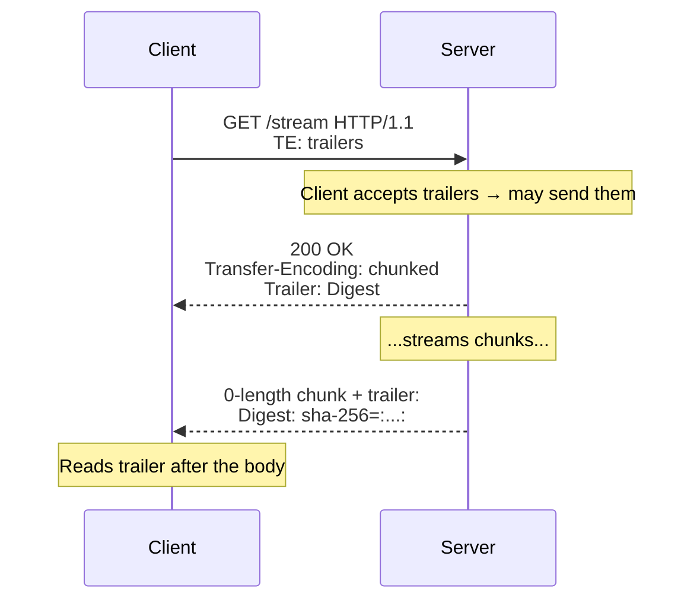

# TE

## Quick Summary

`TE` (Transfer-Encoding acceptance) is a **request** header — and a **hop-by-hop** one — by which a client tells the *immediately-connected server* which **transfer encodings** it's willing to accept in the response, and, most importantly, whether it's willing to accept **trailers** (header fields sent *after* the chunked body). Its canonical modern value is `TE: trailers`, meaning "I can handle trailing headers." Historically it could also list transfer codings like `TE: gzip, deflate` with q-values, but in practice `chunked` is always acceptable (and needn't be listed), and content compression is negotiated via [`Accept-Encoding`](../10-Compression/Accept-Encoding.md) instead — so `TE`'s real remaining job is the **trailers opt-in**. It is easy to confuse with [`Accept-Encoding`](../10-Compression/Accept-Encoding.md): `Accept-Encoding` negotiates *end-to-end content* compression (the representation is gzip'd), while `TE` negotiates *hop-by-hop transfer* coding and trailer support (how the body is framed on this one connection). Like other connection-management headers, `TE` **does not exist in HTTP/2 or HTTP/3** (those protocols have their own trailer/framing mechanisms), and it's listed in [`Connection`](./Connection.md) as hop-by-hop so it isn't forwarded. In modern app development you rarely set it by hand; it matters most for **gRPC-over-HTTP/2 fallbacks, trailers, and understanding chunked framing**.

## What problem does this header solve?

Two related, low-level problems in HTTP/1.1.

**First, trailers.** With [`Transfer-Encoding: chunked`](../10-Compression/Transfer-Encoding.md), a server can send certain header fields *after* the body — "trailers" — which is essential when a value can only be computed *once the whole body is generated*: an integrity checksum/digest of a streamed response, a gRPC status code delivered after a streamed message, or timing metadata. But sending trailers to a client that doesn't understand them would confuse it. `TE: trailers` is the client's explicit statement "yes, I can handle trailing headers, feel free to send them" — a required opt-in for a server to safely use trailers.

**Second (historically), transfer-coding negotiation.** In principle a hop could apply a *transfer* coding (compress the body just for this connection, distinct from the resource's own encoding) and needed to know the peer accepted it. In practice this never became meaningful — `chunked` is universally supported and content compression is handled end-to-end by [`Accept-Encoding`](../10-Compression/Accept-Encoding.md) — so this role of `TE` withered, leaving `TE: trailers` as the practically-relevant use.

## Why was it introduced?

`TE` was introduced with HTTP/1.1 (RFC 2068, 1997; RFC 2616, 1999), specified today in **RFC 9110 §10.1.4** (and framing in RFC 9112). It existed to complete the transfer-coding model: since HTTP/1.1 added chunked transfer encoding and the ability for hops to apply transfer codings, a client needed a way to advertise what transfer codings and features (notably trailers) it could accept on that hop. The `chunked` coding and trailers were the novel HTTP/1.1 capabilities; `TE` was the negotiation knob. As the web consolidated (chunked universal, compression moved to `Accept-Encoding`), the header's practical footprint shrank to the **`trailers` opt-in**. In HTTP/2/3, framing and trailers are handled natively by the protocol (HEADERS frames after DATA, with an END_STREAM flag), so `TE` (and `Connection`/`Transfer-Encoding`) were dropped — indeed HTTP/2 explicitly permits only `TE: trailers` if present at all, and forbids other transfer-coding tokens.

## How does it work?

The client sends `TE` on a request to the *next hop*. A server may then use a listed transfer coding and, if `TE: trailers` is present, may append trailer fields after the chunked body (declaring them with the [`Trailer`](../04-Response-Headers/Content-Type.md) response header).



- **Browser behavior:** Browsers generally do **not** send `TE` (they don't need trailer support for normal navigation and handle chunked transparently). `TE` is a [forbidden header](../02-Core-Concepts/Forbidden-and-Restricted-Headers.md) name, so page JS **cannot set it**. Browsers decode chunked responses transparently but expose trailers minimally, if at all.
- **Server behavior:** Reads `TE`; only sends trailers when `TE: trailers` is present, declaring them via [`Trailer`](../04-Response-Headers/Content-Type.md). Ignores unsupported transfer codings.
- **Proxy behavior:** As a **hop-by-hop** header (it appears in [`Connection`](./Connection.md)), a proxy must **not forward** `TE`; it negotiates transfer coding/trailers independently per hop and regenerates as needed.
- **CDN behavior:** Manages transfer framing per hop; may or may not propagate trailer support to the origin.
- **Reverse proxy behavior:** Nginx handles chunked framing; trailer support through proxies is limited and version-dependent.

## HTTP Request Example

The practically-relevant use — opting into trailers:

```http
GET /export HTTP/1.1
Host: api.example.com
TE: trailers
```

The historical (rarely-used) transfer-coding form with q-values:

```http
GET /data HTTP/1.1
Host: legacy.example.com
TE: gzip, deflate;q=0.5, trailers
Connection: TE
```

(Note `Connection: TE` marks `TE` as hop-by-hop so it isn't forwarded.)

## HTTP Response Example

A chunked response with a trailer (sent only because the client offered `TE: trailers`):

```http
HTTP/1.1 200 OK
Content-Type: application/octet-stream
Transfer-Encoding: chunked
Trailer: Digest

400
<1024 bytes of streamed data>
0
Digest: sha-256=:4a7f...:

```

The `Trailer: Digest` response header announces which field will appear after the body; the `Digest` trailer arrives after the terminating `0` chunk.

## Express.js Example

Trailers are uncommon in Express apps, but here's how the mechanics work when you *do* need them (e.g. an integrity digest computed only after streaming):

```js
const express = require('express');
const crypto = require('crypto');
const app = express();

app.get('/export', (req, res) => {
  // 1) Only send trailers if the client opted in with TE: trailers.
  const acceptsTrailers = (req.headers['te'] || '').toLowerCase().includes('trailers');

  res.setHeader('Content-Type', 'application/octet-stream');
  if (acceptsTrailers) {
    // 2) Declare which trailer field(s) will follow the body.
    res.setHeader('Trailer', 'Digest');
  }

  const hash = crypto.createHash('sha256');
  // 3) Stream chunks (writing without Content-Length → chunked transfer encoding).
  const stream = getExportStream();
  stream.on('data', (chunk) => { hash.update(chunk); res.write(chunk); });
  stream.on('end', () => {
    if (acceptsTrailers) {
      // 4) Send the trailer AFTER the body — its value (the digest) is only known now.
      res.addTrailers({ Digest: `sha-256=:${hash.digest('base64')}:` });
    }
    res.end();
  });
});

app.listen(3000);
```

Why each piece matters: the `TE: trailers` check (step 1) is mandatory — sending trailers to a client that didn't opt in can confuse it, so you gate the entire trailer behavior on it. `res.setHeader('Trailer', 'Digest')` (step 2) pre-declares the trailing field so the recipient knows to expect it. The whole *point* of trailers appears in step 4: the digest can only be computed **after** streaming the full body, so it must be sent *after* the body — impossible with normal (leading) headers. Node's `res.addTrailers()` handles the chunked-trailer wire format. In practice, most apps never need this; it's for streaming integrity, gRPC-style status, or post-body metadata.

## Node.js Example

Raw `http` trailer handling:

```js
const http = require('http');
const crypto = require('crypto');

http.createServer((req, res) => {
  const te = (req.headers['te'] || '').toLowerCase();
  const wantsTrailers = te.includes('trailers');

  res.writeHead(200, {
    'Content-Type': 'text/plain',
    ...(wantsTrailers ? { Trailer: 'Content-MD5' } : {}), // declare the trailer
  });

  const hash = crypto.createHash('md5');
  const payload = ['part1\n', 'part2\n', 'part3\n'];
  for (const p of payload) { hash.update(p); res.write(p); } // chunked (no Content-Length)

  if (wantsTrailers) {
    res.addTrailers({ 'Content-MD5': hash.digest('base64') }); // trailer after body
  }
  res.end();
}).listen(3000);

// Reading trailers as a client:
http.get('http://localhost:3000/', { headers: { TE: 'trailers' } }, (res) => {
  res.on('end', () => console.log('trailers:', res.trailers)); // { 'content-md5': '...' }
  res.resume();
});
```

The essentials: gate on `TE: trailers`, declare via `Trailer`, stream the body, then `addTrailers()`; on the client, request with `TE: trailers` and read `res.trailers` after `end`.

## React Example

React (and browser JS generally) has essentially **no interaction** with `TE`:

1. **You cannot set it.** `TE` is a [forbidden header](../02-Core-Concepts/Forbidden-and-Restricted-Headers.md); `fetch`/`axios` attempts to set it are ignored. The browser manages transfer framing itself.

2. **Trailers are largely invisible to browser JS.** Even when a server sends trailers, the Fetch API exposes them minimally/not at all in most browsers — so React apps typically can't read HTTP trailers. If you need post-body metadata in a browser app, put it *in the body* (e.g. a final JSON line/event in a stream) rather than in trailers.

3. **gRPC-Web is the practical exception.** gRPC uses HTTP trailers for status; because browsers can't read trailers well, **gRPC-Web** encodes the trailer-equivalent *into the response body* and a proxy translates to/from real gRPC. So a React app using gRPC-Web relies on this translation — `TE`/trailers matter to the *infrastructure*, not your React code.

Bottom line: for React, treat `TE` as invisible plumbing; deliver end-of-stream metadata in the body.

## Browser Lifecycle

1. Browsers typically **don't send** `TE` and **can't be made to** via JS (forbidden header).
2. They decode [chunked](../10-Compression/Transfer-Encoding.md) responses transparently regardless.
3. If a server sends trailers, browsers generally **don't expose** them to page JS (Fetch trailer support is minimal).
4. Under HTTP/2/3 there is no `TE` (except the allowed `TE: trailers` token in h2 semantics); trailers are carried natively by the protocol.
5. Net effect: `TE` has essentially no browser-visible lifecycle; it's an infrastructure/server-to-server concern.

## Production Use Cases

- **Trailers for post-body metadata:** integrity digests/checksums of streamed responses, computed only after the body.
- **gRPC (and gRPC-Web bridges):** gRPC-over-HTTP/2 uses trailers for status codes; `TE: trailers` is part of that ecosystem.
- **Streaming pipelines** where a summary/signature must follow the streamed data.
- **Server-to-server APIs** (not browsers) that explicitly support trailers.
- **Understanding chunked framing** and hop-by-hop transfer semantics when debugging proxies.

## Common Mistakes

- **Confusing `TE` with [`Accept-Encoding`](../10-Compression/Accept-Encoding.md).** `TE` = hop-by-hop transfer coding/trailers; `Accept-Encoding` = end-to-end content compression. Use `Accept-Encoding` for gzip/br of content.
- **Sending trailers without checking `TE: trailers`.** Can confuse clients; always gate on the opt-in.
- **Forwarding `TE` through a proxy.** It's hop-by-hop; forwarding is a bug.
- **Expecting browsers to send it or read trailers.** They don't (forbidden header; minimal trailer exposure).
- **Using `TE`/trailers on HTTP/2/3 like HTTP/1.1.** Framing/trailers are native there; only `TE: trailers` is meaningful, and via protocol mechanisms.
- **Putting critical data only in trailers for browser clients.** They usually can't read it; put it in the body.
- **Not declaring trailers with [`Trailer`](../04-Response-Headers/Content-Type.md).** Recipients should be told which fields will trail.

## Security Considerations

- **Trailer smuggling / injection.** Because trailers arrive after the body, sloppy handling can enable request/response smuggling or header-injection-style issues if a hop merges trailers into the header set unsafely. Many servers/proxies **ignore or strip trailers** for exactly this reason. Never let trailers override security-relevant headers (auth, content-type, CSP); allowlist expected trailer fields.
- **Hop-by-hop hygiene.** `TE` must be stripped per hop (it's in [`Connection`](./Connection.md)); mishandling hop-by-hop headers is part of the request-smuggling threat surface. Use conformant proxies.
- **Trust boundaries.** Don't trust trailer values for authorization or integrity unless you control the producer and the channel.
- **DoS via streaming.** As with any chunked/streaming response, enforce size/time limits so trailer-bearing streams can't be abused to hold resources.

## Performance Considerations

- **Trailers enable single-pass streaming with post-hoc metadata:** you can start sending a large response immediately and append a checksum at the end, instead of buffering to compute it first — a real latency/memory win for large streamed payloads.
- **`TE`/trailers add negligible overhead** themselves; the benefit is avoiding a buffering pass.
- **Compression is not `TE`'s job:** use [`Accept-Encoding`](../10-Compression/Accept-Encoding.md) for payload compression; don't try to shrink responses via `TE`.
- **HTTP/2/3** handle trailers more efficiently (native framing) than HTTP/1.1 chunked trailers.

## Reverse Proxy Considerations

Trailer/`TE` support through proxies is limited and version-dependent:

```nginx
server {
  location /stream/ {
    proxy_pass http://app_upstream;
    proxy_http_version 1.1;        # needed for chunked/keep-alive to upstream.
    proxy_set_header Connection ""; # manage hop-by-hop headers correctly.
    # Note: Nginx historically has LIMITED trailer support; test whether trailers
    # survive the proxy. Many setups drop trailers. TE is hop-by-hop (not forwarded).
  }
}
```

Key points: don't assume trailers survive a proxy hop — many proxies (including older Nginx) drop or don't forward them. Test end-to-end if you rely on trailers. `TE` is hop-by-hop and managed per connection, not forwarded.

## CDN Considerations

- **Trailer support varies widely** across CDNs; many don't forward trailers to clients. Verify before relying on them.
- **`TE` is hop-by-hop:** the CDN negotiates transfer framing with the origin and with the client independently.
- **gRPC-Web** at the edge translates trailers into body content because browsers/CDNs handle real trailers poorly.
- **Client hop is usually HTTP/2/3:** where trailers are protocol-native, but browser exposure is still minimal.

## Cloud Deployment Considerations

- **gRPC on load balancers:** L7 LBs that support gRPC (HTTP/2) handle trailers as part of gRPC status; ensure your LB/gateway supports gRPC if you use it.
- **API gateways:** many strip trailers or don't support them; check before designing around trailers.
- **Serverless:** trailer support is often unavailable; deliver end-of-stream metadata in the body.
- **Managed platforms:** treat trailers as unsupported unless documented; for browser clients, use in-body end markers.

## Debugging

- **curl:** `curl -v --raw -H 'TE: trailers' https://host/stream` shows the raw chunked body and any trailers after the terminating `0` chunk. Without `--raw`, curl de-chunks.
- **Node client:** request with `{ headers: { TE: 'trailers' } }` and inspect `res.trailers` after the `end` event.
- **Wireshark/tcpdump:** to see actual chunk/trailer bytes on the wire when diagnosing whether a proxy dropped trailers.
- **Proxy pass-through test:** send trailers from origin and check whether they arrive at the client through your proxy/CDN (they often don't).
- **Browser:** expect trailers to be unreadable from `fetch`; verify by checking that any needed metadata is in the body instead.

## Best Practices

- [ ] Use `TE: trailers` (server-to-server) only when you actually need **trailers**; gate trailer emission on the client's opt-in.
- [ ] Declare trailing fields with the [`Trailer`](../04-Response-Headers/Content-Type.md) header.
- [ ] Use [`Accept-Encoding`](../10-Compression/Accept-Encoding.md) for content compression — **not** `TE`.
- [ ] Don't rely on trailers for **browser** clients; put end-of-stream metadata in the body.
- [ ] **Test** whether proxies/CDNs forward trailers before depending on them.
- [ ] Never let trailers override security-relevant headers; allowlist expected trailer fields.
- [ ] Treat `TE` as hop-by-hop — don't forward it; don't use it on HTTP/2/3 beyond the `trailers` token.
- [ ] Don't attempt to set `TE` from browser JS (forbidden/ignored).

## Related Headers

- [Transfer-Encoding](../10-Compression/Transfer-Encoding.md) — the chunked framing `TE` relates to; trailers ride on chunked bodies.
- [Trailer](../04-Response-Headers/Content-Type.md) — declares which fields appear in the trailer section.
- [Accept-Encoding](../10-Compression/Accept-Encoding.md) — end-to-end content compression negotiation (frequently confused with `TE`).
- [Connection](./Connection.md) — lists hop-by-hop headers including `TE`; controls persistence.
- [Content-Length](../04-Response-Headers/Content-Length.md) — the alternative framing; trailers need chunked, not `Content-Length`.
- [End-to-End vs Hop-by-Hop Headers](../01-Introduction/End-to-End-vs-Hop-by-Hop-Headers.md) — why `TE` is hop-by-hop and not forwarded.
- [HTTP Versions and Headers](../01-Introduction/HTTP-Versions-and-Headers.md) — why `TE` is absent in HTTP/2/3.

## Decision Tree

```mermaid
flowchart TD
    A[Need post-body metadata / trailers?] --> B{Client is a browser?}
    B -- Yes --> C[Put metadata in the BODY<br/>(browsers can't read trailers)]
    B -- No, server-to-server --> D{Client sent TE: trailers?}
    D -- Yes --> E[Send trailers; declare with Trailer header]
    D -- No --> C
    A --> F[Need payload compression?]
    F -- Yes --> G[Use Accept-Encoding, NOT TE]
    A --> H{HTTP/2 or /3?}
    H -- Yes --> I[Use native trailers; TE only as 'trailers' token]
```

## Mental Model

Think of `TE: trailers` as **telling a courier "I'm fine receiving a package that has its final paperwork stapled to the *outside back*, filled in after it was sealed."** Most deliveries have all their labels on the front, written before shipping (normal leading headers). But some information can only be known *after* the box is packed and weighed — a final weight, a tamper-seal signature, a "packed by" stamp (a checksum computed only after streaming the whole body). Trailers are that back-of-box paperwork. But the courier will only staple it there if you've confirmed *you can handle a package labeled that way* (`TE: trailers`) — otherwise they'd risk you being baffled by paperwork in an unexpected place. Two practical realities: **home customers (browsers) generally can't read the back-of-box paperwork at all**, so anything important for them must go inside the box (in the body); and **sorting facilities along the way (proxies/CDNs) often just peel that back paperwork off and toss it**, so you can't count on it surviving unless you've verified the whole route handles it. Don't confuse this with *shrink-wrapping the contents to save space* — that's a completely different service ([`Accept-Encoding`](../10-Compression/Accept-Encoding.md)).
