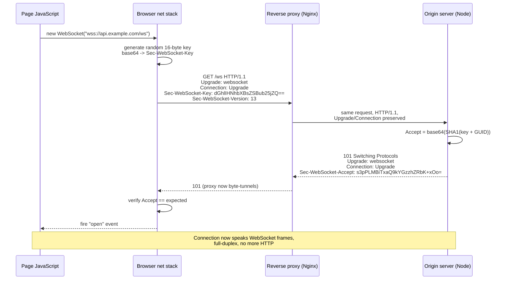
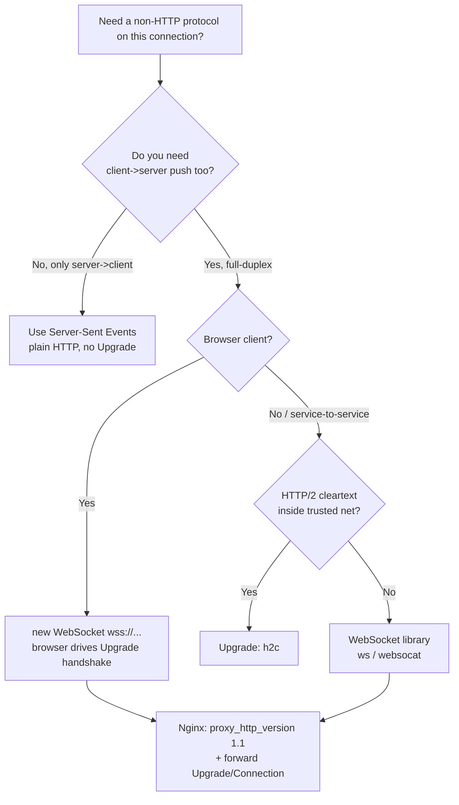

# Upgrade

## Quick Summary

`Upgrade` is a **request header** (with a matching response header) that asks a server to switch the current connection from HTTP to a *different application protocol on the same TCP connection*. The client advertises the protocols it can speak (`Upgrade: websocket`), and because switching protocols means the connection must not be pooled, reused, or forwarded blindly, the request must also list `Upgrade` in the [`Connection`](./Connection.md) header (`Connection: Upgrade`) — `Upgrade` is a hop-by-hop, connection-scoped header. If the server agrees, it replies `101 Switching Protocols` with its own `Upgrade` and `Connection: Upgrade`, and from the byte after the response's blank line the connection speaks the new protocol. In practice its one dominant production use is the **WebSocket handshake**; a secondary use is `h2c` (cleartext HTTP/2 upgrade). Crucially, browsers *never* use `Upgrade` to negotiate HTTPS-based HTTP/2 or HTTP/3 — that is done via TLS ALPN, not this header.

## What problem does this header solve?

You have an already-established, working TCP (or TLS) connection speaking HTTP/1.1, and you want to start speaking a protocol HTTP cannot express — a full-duplex, low-latency, message-framed channel (WebSocket) for a chat app, a live dashboard, a multiplayer game, or collaborative editing. Opening a *separate* connection on a non-HTTP port is a non-starter in the real world: corporate firewalls, proxies, and NATs only reliably pass traffic on 80/443, and browsers only expose HTTP(S) to page JavaScript. So the problem is: **how do you bootstrap a non-HTTP protocol over the exact same port and connection that HTTP just used, while every proxy in the path still understands what happened?**

`Upgrade` solves this by defining an in-band negotiation. The client sends a normal, legal HTTP/1.1 request that happens to say "if you can, stop being HTTP after this response and become *this* protocol instead." The server either declines (answers as normal HTTP) or accepts with `101 Switching Protocols`, after which both endpoints tear down HTTP framing and run the agreed protocol over the surviving socket. No new port, no new connection, firewall-friendly, proxy-visible.

## Why was it introduced?

`Upgrade` was defined in **HTTP/1.1 (RFC 2616, 1999, §14.42)** as a general, forward-looking mechanism: the authors knew HTTP would not be the last protocol to run over TCP and wanted a graceful way to transition an existing connection to TLS (`Upgrade: TLS/1.0`, RFC 2817) or to future protocols without inventing new ports. The TLS-upgrade use case (`STARTTLS`-style opportunistic encryption over port 80) largely failed in the browser world — browsers went with dedicated HTTPS on 443 instead — so for years `Upgrade` was a mostly-unused curiosity.

It found its killer application with **WebSocket (RFC 6455, 2011)**, which is defined precisely as an `Upgrade`-based handshake: a specially-crafted HTTP/1.1 GET that upgrades to the `websocket` protocol. Later, **HTTP/2 (RFC 7540, 2015)** defined `Upgrade: h2c` for *cleartext* HTTP/2 negotiation over port 80. The current HTTP semantics spec **RFC 9110 (2022, §7.8)** re-specifies `Upgrade` cleanly and, tellingly, notes it applies only to HTTP/1.1; HTTP/2 and HTTP/3 forbid it as a connection-level mechanism because they have their own multiplexing and negotiation.

## How does it work?

The handshake is a normal HTTP/1.1 request with three cooperating pieces: the `Upgrade` header naming the target protocol, `Connection: Upgrade` marking `Upgrade` as hop-by-hop, and (for WebSocket) a set of `Sec-WebSocket-*` headers that prove the client is a real WebSocket client and let the server compute a verification token.

- **Browser behavior:** Page JavaScript never sets `Upgrade` by hand — it is a [forbidden header name](../02-Core-Concepts/Forbidden-and-Restricted-Headers.md) that `fetch`/`XMLHttpRequest` refuse to set. Instead you construct `new WebSocket('wss://…')`, and the browser's networking stack synthesizes the entire handshake: it picks a random 16-byte `Sec-WebSocket-Key`, sends `Upgrade: websocket`, `Connection: Upgrade`, `Sec-WebSocket-Version: 13`, verifies the server's `Sec-WebSocket-Accept`, and only then fulfills the `WebSocket` object's `open` event. If verification fails the browser drops the connection and never exposes the raw bytes.
- **Server behavior:** The server must detect the upgrade intent (a GET with `Connection: Upgrade` and `Upgrade: websocket`), validate `Sec-WebSocket-Version: 13`, compute `Sec-WebSocket-Accept = base64(SHA1(Sec-WebSocket-Key + "258EAFA5-E914-47DA-95CA-C5AB0DC85B11"))`, and write a raw `101 Switching Protocols` response. From then on it must speak WebSocket frames on the socket, not HTTP.
- **Proxy behavior:** Because `Upgrade` and `Connection` are **hop-by-hop**, a conformant HTTP/1.1 proxy must consume them and not blindly forward them. To carry WebSockets a proxy must *explicitly* be WebSocket-aware: recognize the `101`, stop parsing HTTP, and start byte-tunneling in both directions. A generic HTTP-only proxy that buffers responses or strips hop-by-hop headers will silently break the handshake.
- **CDN behavior:** Most CDNs (Cloudflare, Fastly, CloudFront) support WebSockets but often require it to be explicitly enabled and will not *cache* anything about a `101` exchange. They tunnel the connection. Idle-timeout limits at the edge are the usual source of mysterious disconnects.
- **Reverse proxy behavior:** Nginx, HAProxy, Envoy all support WebSocket proxying but must be told to forward the `Upgrade`/`Connection` headers to the upstream (Nginx clears hop-by-hop headers by default), and to use HTTP/1.1 upstream (WebSocket cannot ride HTTP/1.0). This is the single most common WebSocket deployment bug.



## HTTP Request Example

The raw WebSocket opening handshake the browser sends. Every header is load-bearing:

```http
GET /ws/chat HTTP/1.1
Host: api.example.com
Upgrade: websocket
Connection: Upgrade
Sec-WebSocket-Key: dGhlIHNhbXBsZSBub25jZQ==
Sec-WebSocket-Version: 13
Sec-WebSocket-Protocol: chat.v2, json
Sec-WebSocket-Extensions: permessage-deflate; client_max_window_bits
Origin: https://app.example.com
```

`Upgrade: websocket` names the target protocol. `Connection: Upgrade` is mandatory — it flags `Upgrade` as connection-scoped so intermediaries handle it correctly; without it many servers reject the handshake. `Sec-WebSocket-Key` is a random 16-byte nonce, base64-encoded; it is *not* a security token but a sanity check that the peer is a real WebSocket implementation (a caching proxy replaying a stored response cannot produce a matching `Accept`). `Sec-WebSocket-Version: 13` is the only version modern servers accept. `Sec-WebSocket-Protocol` is an optional application-level subprotocol offer; the server echoes back the one it picks. `Sec-WebSocket-Extensions` negotiates framing extensions like per-message compression. `Origin` lets the server enforce an origin allowlist — critical, because WebSockets are **not** subject to CORS.

An `h2c` (cleartext HTTP/2) upgrade looks different and targets `h2c`:

```http
GET / HTTP/1.1
Host: internal.example.com
Connection: Upgrade, HTTP2-Settings
Upgrade: h2c
HTTP2-Settings: AAMAAABkAAQAAP__
```

## HTTP Response Example

The server accepting the WebSocket upgrade:

```http
HTTP/1.1 101 Switching Protocols
Upgrade: websocket
Connection: Upgrade
Sec-WebSocket-Accept: s3pPLMBiTxaQ9kYGzzhZRbK+xOo=
Sec-WebSocket-Protocol: chat.v2
Sec-WebSocket-Extensions: permessage-deflate
```

Status `101` (not `200`) tells the client the switch is happening. `Sec-WebSocket-Accept` is the proof: `base64(SHA1(Sec-WebSocket-Key + "258EAFA5-E914-47DA-95CA-C5AB0DC85B11"))`. The magic GUID is fixed by RFC 6455; the browser recomputes it and refuses the connection on mismatch. There is **no response body** — the bytes after the blank line are the first WebSocket frames. If the server declines, it simply answers with a normal status (e.g., `200`, `426 Upgrade Required`, or `400`) and stays on HTTP.

## Express.js Example

Express itself only handles the HTTP request/response cycle; the `Upgrade` handshake happens on the raw `'upgrade'` event of the underlying Node server, *before* Express routing. The production pattern is to run a WebSocket library (`ws`) that hooks that event, and share the HTTP server so both live on one port:

```js
const express = require('express');
const http = require('http');
const { WebSocketServer } = require('ws');

const app = express();
app.get('/health', (req, res) => res.send('ok')); // normal HTTP routes stay on Express.

// Create the HTTP server explicitly so we can attach a WS server to the SAME socket.
// If you let app.listen() create the server internally, you cannot hook 'upgrade'.
const server = http.createServer(app);

// noServer: true -> the ws library does NOT bind its own port/handshake listener;
// we drive the handshake manually so we can authenticate BEFORE upgrading.
const wss = new WebSocketServer({ noServer: true });

// The 'upgrade' event fires when a request carries Connection: Upgrade.
// It is emitted on the raw server, bypassing Express middleware entirely.
server.on('upgrade', (req, socket, head) => {
  // Authenticate here, while it is still a plain HTTP request and we can 401.
  // Once we send 101 there is no HTTP status left to reject with.
  const token = new URL(req.url, 'http://x').searchParams.get('token');
  if (!isValidToken(token)) {
    // Write a raw HTTP rejection and destroy the socket. No Express res here.
    socket.write('HTTP/1.1 401 Unauthorized\r\n\r\n');
    return socket.destroy();
  }

  // Origin allowlist: WebSockets are NOT protected by CORS, so the browser will
  // happily connect from any origin. This check is your only cross-origin defense.
  const origin = req.headers.origin;
  if (origin !== 'https://app.example.com') {
    socket.write('HTTP/1.1 403 Forbidden\r\n\r\n');
    return socket.destroy();
  }

  // Hand off to ws: it computes Sec-WebSocket-Accept, writes 101, and upgrades.
  wss.handleUpgrade(req, socket, head, (ws) => {
    wss.emit('connection', ws, req); // fire the normal connection event.
  });
});

wss.on('connection', (ws, req) => {
  ws.on('message', (data) => ws.send(`echo: ${data}`)); // full-duplex from here on.
  ws.on('close', () => clearInterval(ws._ping));
  // Heartbeat: detect dead peers (half-open TCP) so we don't leak connections.
  ws._ping = setInterval(() => ws.ping(), 30000);
});

server.listen(3000);
```

Every piece matters: `http.createServer(app)` is what lets HTTP and WebSocket cohabit one port; the `'upgrade'` listener is the *only* place to authenticate because after `101` there is no HTTP status code to reject with; the `Origin` check substitutes for the CORS protection WebSockets lack; `noServer: true` gives you that pre-upgrade window; and the heartbeat prevents connection leaks from silently-dropped TCP sockets, which is the classic WebSocket production failure.

## Node.js Example

The raw `http` module exposes the mechanism directly — this is what libraries like `ws` build on, and it shows exactly what travels on the wire:

```js
const http = require('http');
const crypto = require('crypto');

const WS_GUID = '258EAFA5-E914-47DA-95CA-C5AB0DC85B11'; // fixed by RFC 6455.

const server = http.createServer((req, res) => {
  // Normal HTTP requests (no Upgrade) land here.
  res.writeHead(426, { 'Content-Type': 'text/plain' });
  res.end('Upgrade Required'); // 426 tells non-WS clients this endpoint needs WebSocket.
});

// 'upgrade' fires for any request with Connection: Upgrade. `socket` is the raw TCP socket.
server.on('upgrade', (req, socket, head) => {
  const key = req.headers['sec-websocket-key'];
  if (req.headers['upgrade']?.toLowerCase() !== 'websocket' || !key) {
    return socket.destroy(); // not a valid WS handshake.
  }

  // The core of the protocol: prove we understood the handshake.
  const accept = crypto
    .createHash('sha1')
    .update(key + WS_GUID)
    .digest('base64');

  // Write the 101 by hand. Note CRLF line endings and the terminating blank line.
  socket.write(
    'HTTP/1.1 101 Switching Protocols\r\n' +
    'Upgrade: websocket\r\n' +
    'Connection: Upgrade\r\n' +
    `Sec-WebSocket-Accept: ${accept}\r\n` +
    '\r\n'
  );

  // From here `socket` carries WebSocket frames, not HTTP. You now parse the
  // RFC 6455 framing yourself (opcode, mask, payload length). In production use `ws`.
  socket.on('data', (buf) => {
    /* decode frame, respond with frames */
  });
});

server.listen(8080);
```

This differs meaningfully from Express: there is no `res` object in the upgrade path, you write raw bytes to the socket, and you own the `Sec-WebSocket-Accept` computation and all subsequent framing. The lesson is that `101` is a point of no return — after the blank line the HTTP abstraction is gone.

## React Example

React never touches `Upgrade` directly — it is browser-synthesized and script-forbidden. React's involvement is opening the `WebSocket` object and managing its lifecycle inside effects:

```jsx
import { useEffect, useRef, useState } from 'react';

function useChatSocket(url) {
  const [messages, setMessages] = useState([]);
  const wsRef = useRef(null);

  useEffect(() => {
    // Constructing WebSocket triggers the browser's Upgrade handshake internally.
    // Use wss:// in production — ws:// is blocked on https:// pages (mixed content).
    const ws = new WebSocket(url);
    wsRef.current = ws;

    ws.onmessage = (e) => setMessages((m) => [...m, e.data]);

    // Reconnect on close: the browser will NOT auto-reconnect a dropped WebSocket.
    ws.onclose = () => {
      /* schedule a backoff reconnect here */
    };

    // Cleanup on unmount / url change: close the socket so React Strict Mode's
    // double-invoke in dev and route changes don't leak connections.
    return () => ws.close();
  }, [url]);

  const send = (text) => wsRef.current?.send(text);
  return { messages, send };
}
```

Two production truths React developers hit: use `wss://` (an `https://` page cannot open a `ws://` socket — the mixed-content rule), and *you* own reconnection, because a broken TCP connection does not re-handshake itself. The `Upgrade` header is entirely below this layer; React only sees the resulting `WebSocket` events.

## Browser Lifecycle

1. **`new WebSocket(url)`** — the browser parses the URL (`ws`/`wss` scheme), enforces mixed-content rules, and queues a connection.
2. **TCP/TLS connect** — a fresh connection is opened (WebSockets are never taken from the HTTP connection pool because the socket will be repurposed).
3. **Handshake request** — the browser generates a random `Sec-WebSocket-Key`, sends the GET with `Upgrade`/`Connection`/`Sec-WebSocket-Version` and any `Sec-WebSocket-Protocol`/`Extensions` you requested, plus an `Origin`.
4. **Response validation** — on `101`, the browser recomputes `Sec-WebSocket-Accept` and compares; verifies the negotiated subprotocol/extensions are ones it offered. Any mismatch, wrong status, or missing header → fail, no `open` event.
5. **`open` fires** — `readyState` becomes `OPEN`; framing begins. Outgoing frames from the browser are always **masked** (RFC 6455 requirement) to defend intermediaries against cache-poisoning; server frames are unmasked.
6. **Duplex phase** — `message`, `ping`/`pong`, and `send()` operate on frames until either side sends a close frame.
7. **Close** — `close` event with a code; the browser does not reconnect.

## Production Use Cases

- **Real-time features:** chat, notifications, presence, collaborative editing (CRDT/OT), live sports/finance tickers, multiplayer game state — anything needing server-push and sub-100ms bidirectional latency where polling is wasteful.
- **Live dashboards / observability:** streaming metrics and logs to a browser without hammering an HTTP endpoint every second.
- **`h2c` upgrade:** internal service-to-service HTTP/2 over cleartext (no TLS) inside a trusted network, e.g., a sidecar-to-app hop, negotiated via `Upgrade: h2c`.
- **GraphQL subscriptions:** `graphql-ws` runs the subscription transport over a WebSocket upgraded from HTTP.
- **When *not* to use it:** one-way server→client streaming is better served by **Server-Sent Events** (plain HTTP, auto-reconnect, works through more infrastructure). Reach for WebSocket only when you genuinely need client→server push too.

## Common Mistakes

- **Forgetting `Connection: Upgrade`.** Sending `Upgrade: websocket` alone (or a proxy stripping the `Connection` header) makes conformant servers ignore the upgrade and answer as plain HTTP.
- **Reverse proxy not forwarding hop-by-hop headers.** Nginx clears `Upgrade`/`Connection` by default; without `proxy_set_header Upgrade $http_upgrade;` the handshake silently degrades to a normal request and the WebSocket never opens.
- **Proxy using HTTP/1.0 upstream.** WebSocket requires HTTP/1.1; `proxy_http_version 1.1;` is mandatory in Nginx.
- **Authenticating after upgrade.** Once `101` is sent there is no HTTP status left; auth must happen in the `'upgrade'` handler, not in `wss.on('connection')`.
- **Assuming CORS protects WebSockets.** It does not. Skipping the `Origin` check leaves you open to Cross-Site WebSocket Hijacking (CSWSH).
- **No heartbeat.** Load balancers and NATs silently drop idle connections; without `ping`/`pong` you leak half-open sockets and users see phantom "connected" states.
- **Expecting browsers to use `Upgrade` for HTTP/2.** They never do over TLS — see below.

## Security Considerations

- **Cross-Site WebSocket Hijacking (CSWSH):** the browser attaches cookies to the handshake automatically and the Same-Origin Policy / CORS does **not** gate WebSocket connections. A malicious page can open a socket to your authenticated endpoint using the victim's cookies. Defend with a strict `Origin` allowlist in the `'upgrade'` handler *and* a CSRF-style token in the URL/subprotocol; never rely on cookies alone.
- **Client masking (RFC 6455):** browsers must mask outgoing frames with a random key so a poisoned intermediary cannot be tricked into caching attacker-crafted bytes as an HTTP response. Servers must reject unmasked client frames.
- **Request smuggling via `Upgrade`:** because `Upgrade`/`Connection` are hop-by-hop and interpreted differently by front-end vs back-end servers, mismatched handling has produced smuggling and "h2c smuggling" attacks (tunneling past an edge proxy that thinks it terminated the connection). Ensure every hop agrees on whether an upgrade occurred; disable `h2c` upgrades at edges that shouldn't tunnel.
- **`wss://` (TLS) always in production:** `ws://` is cleartext and trivially sniffed/injected; also blocked from `https://` pages as mixed content.
- **No length limits by default:** enforce max message size on the server (`ws`'s `maxPayload`) to prevent memory-exhaustion DoS via giant frames.

## Performance Considerations

- **One long-lived connection replaces a flood of requests.** A WebSocket eliminates per-message HTTP header overhead and TLS handshakes; after the single `Upgrade`, frames carry only a few bytes of framing.
- **Connection count is the cost.** Each socket pins server memory and a file descriptor; 100k concurrent WebSockets is a capacity-planning problem (event-loop, `ulimit`, LB connection limits) that request/response never has.
- **`permessage-deflate`** (negotiated via `Sec-WebSocket-Extensions`) compresses message payloads — great for JSON, but its per-connection compression context costs memory; disable for high-connection-count/low-payload workloads.
- **Sticky sessions or a shared bus:** because a socket lives on one origin instance, horizontal scaling needs sticky LB routing or a pub/sub backplane (Redis) so any node can push to any client.
- **Idle timeouts:** edge/LB idle timeouts kill quiet connections; the heartbeat interval must be shorter than the smallest timeout in the path.

## Reverse Proxy Considerations

Nginx needs explicit configuration to carry the upgrade, because it strips hop-by-hop headers and defaults to HTTP/1.0 upstream:

```nginx
# Map keeps Connection correct: send "upgrade" for WS requests, "" (close) otherwise,
# so normal HTTP through the same block isn't forced into an upgrade.
map $http_upgrade $connection_upgrade {
    default upgrade;
    ''      close;
}

upstream app { server 127.0.0.1:3000; }

server {
    listen 443 ssl;
    server_name api.example.com;

    location /ws/ {
        proxy_pass http://app;

        proxy_http_version 1.1;                        # WebSocket cannot ride HTTP/1.0.
        proxy_set_header Upgrade $http_upgrade;        # forward the client's Upgrade token.
        proxy_set_header Connection $connection_upgrade; # rebuild the hop-by-hop Connection.

        proxy_set_header Host $host;
        proxy_set_header X-Forwarded-For $proxy_add_x_forwarded_for;
        proxy_set_header X-Forwarded-Proto $scheme;

        proxy_read_timeout 3600s;   # don't kill idle sockets after the default 60s.
        proxy_send_timeout 3600s;
    }
}
```

The three critical lines are `proxy_http_version 1.1`, `proxy_set_header Upgrade`, and `proxy_set_header Connection`. Omit any one and the handshake fails or degrades to a plain 200. The long `proxy_read_timeout` prevents Nginx from closing quiet-but-alive sockets. HAProxy and Envoy handle WebSockets more transparently but still respect idle timeouts you must raise.

## CDN Considerations

- **Cloudflare** supports WebSockets on all plans but tunnels rather than caches them; the `101` and subsequent frames pass through. Watch the ~100s edge idle timeout and the connection-duration caps on some plans — heartbeats keep sockets alive.
- **AWS CloudFront** supports WebSockets natively (tunnels the upgrade to the origin), but the 10-minute idle-timeout on the origin connection means heartbeats are mandatory for chat-style apps.
- **Fastly** supports WebSocket passthrough on request; nothing about the exchange is cacheable.
- **Universal gotcha:** CDNs and WAFs may buffer responses or enforce request/response size limits that assume HTTP semantics; an aggressive WAF can misclassify frame bytes. Test the full handshake through the edge, and disable response buffering for the WS path.

## Cloud Deployment Considerations

- **AWS ALB** supports WebSockets and preserves the upgrade, but its default **idle timeout is 60s** — set a heartbeat under that or raise the timeout, or connections drop mid-conversation.
- **AWS API Gateway** has a dedicated **WebSocket API** product with its own `$connect`/`$disconnect`/route model — it does *not* transparently proxy raw `Upgrade` to a Lambda; you adopt its routing model instead.
- **GCP HTTPS Load Balancer** supports WebSockets automatically once the backend responds with `101`; mind the backend timeout.
- **Kubernetes Ingress (nginx-ingress):** needs the same `Upgrade`/`Connection`/`proxy_http_version 1.1` handling, usually via annotations; and readiness/liveness probes must not count long-lived sockets as stuck.
- **Serverless (Lambda/Cloud Functions):** classic request/response functions cannot hold a WebSocket; use the platform's managed WebSocket product or a stateful container/EC2/Fargate service.

## Debugging

- **Chrome DevTools → Network:** filter by **WS**; click the connection to see the handshake request/response headers (`Upgrade`, `Connection`, `Sec-WebSocket-*`) and a live **Messages** tab showing every frame in/out with direction and opcode. A handshake that shows `200`/`400` instead of `101` means an intermediary broke the upgrade.
- **curl:** `curl -i -N -H "Connection: Upgrade" -H "Upgrade: websocket" -H "Sec-WebSocket-Key: dGhlIHNhbXBsZSBub25jZQ==" -H "Sec-WebSocket-Version: 13" http://localhost:8080/ws` — expect `101` and a matching `Sec-WebSocket-Accept`. `-N` disables buffering. Also `websocat wss://api.example.com/ws` for a full interactive client.
- **Postman / Bruno:** Postman has a first-class WebSocket request type (New → WebSocket) that shows the handshake and lets you send frames; Bruno focuses on HTTP, so use it to verify the pre-upgrade `426`/auth behavior.
- **Node.js:** log inside `server.on('upgrade', (req) => console.log(req.headers))` to confirm `Upgrade`/`Connection`/`Origin` arrived intact through your proxies.
- **Express logging:** normal request loggers (morgan) will **not** see WebSocket traffic because it bypasses the middleware stack — instrument the `'upgrade'` event and the `ws` `connection`/`close`/`error` events instead.

## Best Practices

- [ ] Use `wss://` (TLS) in production; never `ws://`.
- [ ] Authenticate and authorize inside the `'upgrade'` handler, before sending `101`.
- [ ] Enforce a strict `Origin` allowlist — CORS does not protect WebSockets (CSWSH defense).
- [ ] Add a CSRF-style token (query param or subprotocol) in addition to cookies.
- [ ] In Nginx, set `proxy_http_version 1.1` and forward `Upgrade`/`Connection`.
- [ ] Raise idle timeouts on every hop (proxy, LB, CDN) and run a heartbeat under the smallest one.
- [ ] Cap message size (`maxPayload`) to prevent memory-exhaustion DoS.
- [ ] Implement client-side reconnect with backoff — browsers never auto-reconnect.
- [ ] Prefer Server-Sent Events for one-way server→client streams.
- [ ] Return `426 Upgrade Required` on the WS endpoint for non-WebSocket clients.

## Related Headers

- [Connection](./Connection.md) — must list `Upgrade` (`Connection: Upgrade`); it marks `Upgrade` as hop-by-hop so intermediaries handle it correctly. The two are inseparable.
- [Origin](./Origin.md) — the only cross-origin signal available for WebSocket handshakes; your allowlist against CSWSH depends on it.
- `Sec-WebSocket-Key` / `Sec-WebSocket-Accept` / `Sec-WebSocket-Version` / `Sec-WebSocket-Protocol` / `Sec-WebSocket-Extensions` — the WebSocket-specific handshake headers `Upgrade` orchestrates (all browser-set, script-forbidden).
- [Forbidden and Restricted Headers](../02-Core-Concepts/Forbidden-and-Restricted-Headers.md) — explains why page script can never set `Upgrade`/`Connection`/`Sec-WebSocket-*` itself.
- [HTTP Versions and Headers](../01-Introduction/HTTP-Versions-and-Headers.md) — why HTTP/2 and HTTP/3 forbid `Upgrade` and use ALPN instead.

### Why HTTP/2 and HTTP/3 don't use `Upgrade`

Over HTTPS, browsers negotiate HTTP/2 and HTTP/3 during the **TLS handshake via ALPN** (Application-Layer Protocol Negotiation) — the client lists `h2`, `http/1.1` in the TLS ClientHello and the server picks one *before any HTTP is spoken*. This is a round-trip cheaper and cleaner than an in-band `Upgrade`, and it is why you never see `Upgrade: h2` on the wire. The cleartext `Upgrade: h2c` path exists only for non-TLS HTTP/2 and is rarely used (and disabled by most browsers). Inside HTTP/2 and HTTP/3 themselves, the connection-level `Upgrade` mechanism is **forbidden** (RFC 9113 §8.3.1); they multiplex streams and have their own extended-CONNECT (`:protocol`) mechanism (RFC 8441) to carry WebSockets over HTTP/2. So `Upgrade` is fundamentally an HTTP/1.1 feature.

## Decision Tree



## Mental Model

Think of `Upgrade` as **asking the taxi you're already riding in to become a submarine**. You (the client) are mid-trip on the HTTP road with a working connection. Instead of hailing a completely new vehicle (a fresh connection on a weird port that firewalls would block), you ask the driver: "if you're able, once we finish this sentence, stop being a taxi and become a submarine so we can go somewhere roads can't." `Connection: Upgrade` is you tapping the partition so the *driver* (this hop specifically) knows the request is about the vehicle itself, not a destination to forward. The `101 Switching Protocols` is the driver saying "converting now" — and from the very next moment the road (HTTP) is gone and you're both underwater speaking sonar (WebSocket frames). Every checkpoint along the way (proxy, CDN, load balancer) has to be explicitly told "let submarines through," or they'll wave you back onto the road.
