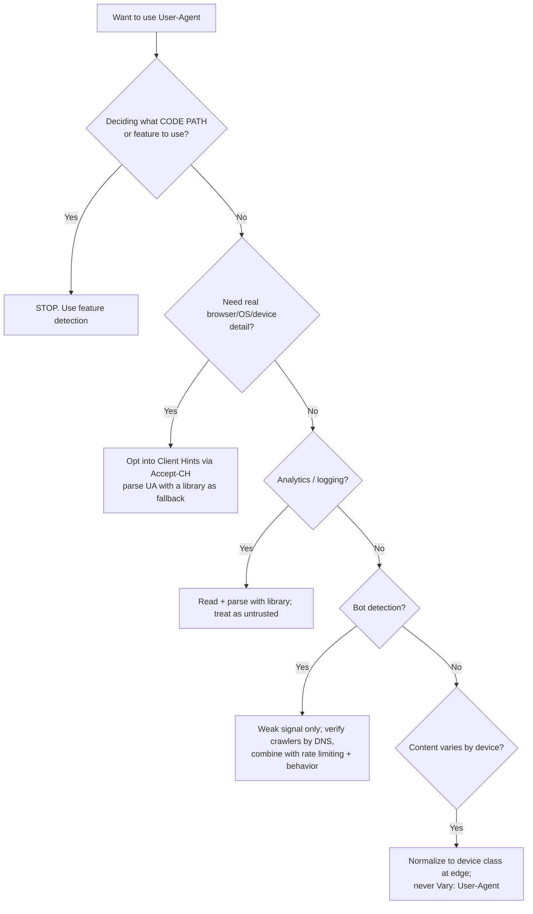

# User-Agent

## Quick Summary

`User-Agent` is a **request** header the client sends on virtually every HTTP request to identify itself — historically the browser, its rendering engine, and the operating system, but in practice a sprawling, semi-fictional string that encodes decades of web-compatibility history. Servers read it for bot detection, analytics, feature-gating, and (badly) for delivering different content per browser. It is the single most abused and least reliable header on the web: every value it contains lies about something, it is trivially spoofed, and it is a significant browser-fingerprinting surface. Browsers are actively **freezing and reducing** it, replacing structured detection with the **User-Agent Client Hints** family ([`Sec-CH-UA`](./Sec-CH-UA.md)). Understanding `User-Agent` in 2026 means understanding both the legacy string and its managed decline.

## What problem does this header solve?

The original problem was legitimate: a server serving many client types wants to know *what it is talking to* so it can send appropriate content — a text browser vs. a graphical one, a mobile vs. desktop layout, a client that supports a feature vs. one that doesn't. `User-Agent` gave the client a place to announce its identity, and servers a way to log, count, and adapt.

In production today the header solves a narrower and messier set of problems: **traffic analytics** (what browsers/OSes/devices use your site), **bot and crawler identification** (Googlebot, uptime monitors, scrapers announce themselves here), **coarse OS/device routing** (offer the iOS app on iPhones, serve a different download for Windows vs. macOS), and **security telemetry** (flag anomalous or empty UAs). Notably, it should *no longer* solve "which browser is this, so I can branch my code" — that path (UA sniffing) is an anti-pattern that feature detection replaced.

## Why was it introduced?

`User-Agent` is in HTTP/1.0 (RFC 1945, 1996) and HTTP/1.1 (RFC 2616 / current RFC 9110). But its *content* is a museum of the browser wars. Mosaic sent `Mozilla/1.0`. When Netscape ("Mozilla") became dominant, servers began sending frames and rich content only to `Mozilla`. Internet Explorer, wanting that same content, began its UA with `Mozilla/4.0 (compatible; MSIE ...)` — impersonating its competitor. Every subsequent browser inherited the lie: Safari, Chrome, and Edge all still begin their UA with `Mozilla/5.0` and include `AppleWebKit`, `KHTML, like Gecko`, `Safari`, and `Chrome` tokens — a chain of "like the popular one" impersonations accreted over 30 years so that server sniffing logic wouldn't accidentally exclude them.

Because the string became unreliable, unstructured, and privacy-invasive, the platform introduced **User-Agent Client Hints** (2020, Chromium-led) — a structured, opt-in, privacy-tiered replacement ([`Sec-CH-UA`](./Sec-CH-UA.md) and friends). Chrome's **UA Reduction** program (rolled out through 2022–2024) then began *freezing* the legacy `User-Agent` string, capping version numbers and collapsing OS/device detail so the string leaks far less entropy. That migration is ongoing and is the defining production fact about this header.

## How does it work?

The client constructs a `User-Agent` string (or a reduced one) and sends it on each request. The server may read it, log it, branch on it, or ignore it. Nothing about the *protocol* interprets it — it is opaque to caches and proxies unless a server explicitly makes responses depend on it, in which case correctness requires [`Vary: User-Agent`](../06-Caching-Headers/Vary.md) (which fragments caches catastrophically — see below).

- **Browser behavior:** Emits a (increasingly frozen/reduced) UA string on every request. Chrome/Edge now send a *reduced* UA with a fixed minor version (`0.0.0`) and generic platform, and expose real detail only via Client Hints on request. `navigator.userAgent` in JS returns the same reduced string.
- **Server behavior:** Reads `User-Agent` for logging, analytics, bot rules, and (legacy) content adaptation. Should parse with a maintained library, never hand-rolled regex, and should treat the value as untrusted.
- **Proxy behavior:** Passes `User-Agent` through end-to-end. Some transparent proxies or "reduce data" services rewrite it.
- **CDN behavior:** CDNs read UA for bot management and device classification (Cloudflare adds `cf-device-type`, Akamai has EdgeScape/device characteristics). They may *normalize* UA into a device class to avoid caching per-UA. Making the cached response depend on raw UA via [`Vary: User-Agent`](../06-Caching-Headers/Vary.md) can create thousands of cache variants and destroy hit ratio.
- **Reverse proxy behavior:** Nginx exposes `$http_user_agent` for logging and `map`-based blocking. Passed upstream untouched.

```mermaid
sequenceDiagram
    participant B as Browser (Chrome, reduced UA)
    participant CDN as CDN / Bot Manager
    participant S as Origin server
    B->>CDN: GET /  User-Agent: Mozilla/5.0 ... Chrome/120.0.0.0 ...<br/>Sec-CH-UA: "Chromium";v="120", ...
    Note over CDN: Classify: real browser vs bot,<br/>device type from UA + hints
    CDN->>S: forward + cf-device-type: mobile
    S->>S: parse UA with library -> {browser, os, device}
    Note over S: If server needs full version/platform,<br/>respond Accept-CH: Sec-CH-UA-Full-Version-List, ...
    S-->>B: 200 + Accept-CH: Sec-CH-UA-Platform-Version, ...
    B->>S: subsequent requests now include requested high-entropy hints
```

## HTTP Request Example

A modern desktop Chrome request under UA Reduction — note the frozen `0.0.0` build number and the paired Client Hints:

```http
GET / HTTP/2
Host: app.example.com
User-Agent: Mozilla/5.0 (Windows NT 10.0; Win64; x64) AppleWebKit/537.36 (KHTML, like Gecko) Chrome/120.0.0.0 Safari/537.36
Sec-CH-UA: "Not_A Brand";v="8", "Chromium";v="120", "Google Chrome";v="120"
Sec-CH-UA-Mobile: ?0
Sec-CH-UA-Platform: "Windows"
```

Googlebot announcing itself honestly (verify by reverse DNS, not by trusting the string):

```http
GET /article/42 HTTP/1.1
Host: blog.example.com
User-Agent: Mozilla/5.0 (compatible; Googlebot/2.1; +http://www.google.com/bot.html)
```

## HTTP Response Example

The server does not send `User-Agent`. Its lever is `Accept-CH`, which asks the browser to start sending specific high-entropy Client Hints on subsequent requests, plus [`Vary`](../06-Caching-Headers/Vary.md) so caches partition correctly:

```http
HTTP/1.1 200 OK
Content-Type: text/html; charset=utf-8
Accept-CH: Sec-CH-UA-Full-Version-List, Sec-CH-UA-Platform-Version, Sec-CH-UA-Model
Vary: Sec-CH-UA, Sec-CH-UA-Platform
```

`Accept-CH` is the opt-in mechanism that replaces reading detail out of the UA string; `Vary` on the *hints* (not raw UA) keeps the cache correct without exploding into one entry per full UA string.

## Express.js Example

```js
const express = require('express');
const { UAParser } = require('ua-parser-js'); // maintained parser; never hand-roll UA regex
const app = express();

// 1) Parse the UA once per request into structured fields for logging/analytics.
app.use((req, res, next) => {
  const ua = req.get('user-agent') || '';
  // A maintained library keeps up with new browsers/OSes and reduced UAs.
  const parsed = new UAParser(ua).getResult();
  req.client = {
    browser: parsed.browser.name || 'unknown',
    os: parsed.os.name || 'unknown',
    deviceType: parsed.device.type || 'desktop', // 'mobile' | 'tablet' | undefined(desktop)
    isBot: /bot|crawler|spider|crawling|monitor/i.test(ua) || ua === '',
  };
  next();
});

// 2) Opt into high-entropy Client Hints — the FORWARD-compatible way to get real
//    version/platform detail as the UA string keeps getting reduced.
app.use((req, res, next) => {
  res.set('Accept-CH', 'Sec-CH-UA-Full-Version-List, Sec-CH-UA-Platform-Version, Sec-CH-UA-Model');
  // Persist the opt-in across navigations so we don't lose a round-trip each time.
  res.set('Critical-CH', 'Sec-CH-UA-Full-Version-List');
  // If we branch content on hints, caches must key on them — NOT on raw User-Agent.
  res.append('Vary', 'Sec-CH-UA, Sec-CH-UA-Platform');
  next();
});

// 3) Block obvious empty/abusive UAs at the edge of the app (defense-in-depth, not security).
app.use((req, res, next) => {
  if (req.client.isBot && req.path.startsWith('/api/private')) {
    return res.status(403).json({ error: 'automated access not permitted' });
  }
  next();
});

// 4) Coarse OS routing — a LEGITIMATE remaining use: offer the right native app.
app.get('/download', (req, res) => {
  const os = req.client.os.toLowerCase();
  if (os.includes('mac')) return res.redirect('/downloads/app.dmg');
  if (os.includes('windows')) return res.redirect('/downloads/app.exe');
  return res.redirect('/downloads/all-platforms');
});

app.listen(3000);
```

Why each part matters: parsing with `ua-parser-js` avoids the classic bug where a hand-written regex misclassifies a new browser (Edge as Chrome, or a reduced UA as "unknown"); `Accept-CH`/`Critical-CH` future-proof you against ongoing UA reduction; `Vary` keys on *hints* so you don't fragment the cache per raw UA; the bot block is telemetry-grade only (a spoofed UA sails through — real bot defense needs reverse DNS + rate limiting + behavior analysis).

## Node.js Example

Raw `http` reads the header and sets nothing:

```js
const http = require('http');
const https = require('https');

// Reading the client's UA:
http.createServer((req, res) => {
  const ua = req.headers['user-agent'] || '(empty)';
  console.log(`${req.method} ${req.url}  UA="${ua}"`);
  res.end('ok');
}).listen(3000);

// Setting a HONEST UA when Node is itself the client (server-to-server calls).
// Many APIs REQUIRE a descriptive UA and rate-limit or 403 the default 'node' UA.
https.get('https://api.github.com/repos/nodejs/node', {
  headers: { 'User-Agent': 'my-service/1.4.2 (+https://example.com/bot-info)' },
}, res => { res.resume(); });
```

The important server-side lesson: when *your* Node process makes outbound requests, set a descriptive `User-Agent` (product name, version, contact URL). Anonymous or default UAs get throttled or blocked by well-run APIs (GitHub, for instance, rejects requests with no UA).

## React Example

React never sets `User-Agent` — the browser controls it; JS can only *read* it and only get high-entropy detail asynchronously via the Client Hints API:

```jsx
import { useEffect, useState } from 'react';

function useClientInfo() {
  const [info, setInfo] = useState({ mobile: null, platform: null });
  useEffect(() => {
    // navigator.userAgent returns the SAME reduced string the server sees — avoid parsing it.
    // Prefer the structured, privacy-tiered Client Hints API:
    if (navigator.userAgentData) {
      // Low-entropy fields are synchronous:
      const { mobile, platform } = navigator.userAgentData;
      // High-entropy fields require an async, permissioned request:
      navigator.userAgentData
        .getHighEntropyValues(['platformVersion', 'fullVersionList', 'model'])
        .then(high => setInfo({ mobile, platform, ...high }));
    } else {
      // Safari/Firefox lack userAgentData today — fall back to feature detection, NOT UA sniffing.
      setInfo({ mobile: /Mobi/i.test(navigator.userAgent), platform: null });
    }
  }, []);
  return info;
}
```

The React-relevant anti-pattern: branching component logic on `navigator.userAgent` regexes ("if Safari, do X"). This breaks constantly as UAs freeze and change. **Feature-detect** (`'IntersectionObserver' in window`, `CSS.supports(...)`) instead; reserve UA/hints for coarse product decisions (which app store badge to show), never for capability decisions.

## Browser Lifecycle

1. **Request built.** The browser assembles the (reduced) `User-Agent` string and the low-entropy `Sec-CH-UA*` hints from a fixed template — no per-request computation.
2. **First response with `Accept-CH`.** If the server asks for high-entropy hints, the browser records the opt-in for the origin.
3. **Subsequent requests** to that origin include the requested hints; `Critical-CH` can trigger a same-navigation retry so the very first HTML already gets them.
4. **`navigator.userAgent`** returns the reduced string; `navigator.userAgentData` exposes structured low-entropy fields synchronously and high-entropy fields via a permissioned async call.
5. **No caching semantics** are attached by the browser itself — UA only affects caching if a server declares [`Vary: User-Agent`](../06-Caching-Headers/Vary.md), which makes the browser (and every shared cache) key entries per exact UA string.

## Production Use Cases

- **Analytics dashboards:** browser/OS/device breakdowns to prioritize QA and support matrices.
- **Bot and crawler handling:** identify declared crawlers (Googlebot, Bingbot, uptime monitors) for logging, robots handling, or rendering decisions — always verified by reverse DNS for anything that grants access.
- **Coarse device/OS routing:** the right download binary, the correct app-store badge, mobile-vs-desktop redirects for legacy apps (modern apps use responsive CSS instead).
- **Security telemetry / WAF signals:** empty, malformed, or known-malicious UAs feed abuse scoring (one weak signal among many).
- **Compatibility shims:** serving a polyfill bundle to older engines — though feature detection / differential serving by module support (`<script type="module">`) is now preferred.

## Common Mistakes

- **UA sniffing for capabilities.** Branching features on browser name/version is brittle and breaks under UA reduction and new entrants. Use feature detection.
- **Hand-rolled UA regex.** DIY parsers misclassify Edge as Chrome, Chromium-based browsers as Safari, and reduced UAs as unknown. Use and *update* a maintained library.
- **Trusting UA for security/authorization.** It's spoofed in one line of curl. Never gate access purely on it.
- **`Vary: User-Agent` for caching.** The UA cardinality is effectively unbounded; this creates a distinct cache entry per string, collapsing hit ratio. Vary on Client Hints or a normalized device class instead.
- **Blocking empty UAs indiscriminately.** Some legitimate clients and privacy tools send none; hard blocks cause false positives. Score, don't outright ban.
- **Assuming the version number is real.** Under reduction, Chrome's minor/build is frozen at `0.0.0`; parsing it for exact-version logic yields wrong answers. Request `Sec-CH-UA-Full-Version-List` if you truly need the build.
- **Forgetting outbound UA on server-to-server calls.** Default Node/fetch UAs get rate-limited or rejected; always set a descriptive product UA.

## Security Considerations

- **Untrusted input.** `User-Agent` is fully attacker-controlled. Treat it as tainted: never interpolate it unescaped into SQL, shell commands, log-injection-prone sinks, or HTML (stored XSS via UA displayed on an admin dashboard is a real class of bug).
- **Fingerprinting surface.** A full legacy UA contributes meaningful entropy to cross-site tracking. UA reduction + Client Hints exist precisely to *shrink* this: low-entropy hints are sent freely, high-entropy ones require explicit `Accept-CH` opt-in, letting privacy tooling and users see and limit what's exposed.
- **Bot spoofing.** Scrapers impersonate Googlebot or real browsers. The only reliable verification for declared crawlers is **reverse + forward DNS** on the source IP; the string alone proves nothing.
- **Weak security signal.** UA can contribute to anomaly scoring (mismatched UA vs. TLS fingerprint vs. behavior) but must never be a standalone control.

## Performance Considerations

- The UA string is large (100–200+ bytes) and sent on every request; HTTP/2 HPACK and HTTP/3 QPACK compress the repeated value to near-zero on subsequent requests within a connection, so wire cost is minimal in practice.
- **Cache fragmentation is the real perf risk.** [`Vary: User-Agent`](../06-Caching-Headers/Vary.md) can turn one cacheable resource into thousands of edge variants, gutting CDN hit ratios and hammering origin. Normalize to a small device-class dimension or vary on hints.
- Client Hints reduce redundant data: the browser sends only the low-entropy set until a server opts into more, keeping typical request headers leaner than the maximal legacy UA + all details.
- Server-side UA parsing has a small CPU cost; cache parse results per unique string if you parse on a hot path.

## Reverse Proxy Considerations

```nginx
# Log the UA for analytics/abuse review.
log_format uacombined '$remote_addr "$request" $status ua="$http_user_agent"';
access_log /var/log/nginx/access.log uacombined;

# Map known-bad or empty UAs to a block flag (defense-in-depth, not real security).
map $http_user_agent $bad_ua {
    default        0;
    ""             1;                 # empty UA
    "~*(sqlmap|nikto|masscan)" 1;     # obvious scanners
}
server {
    if ($bad_ua) { return 403; }

    # If you MUST vary content by device, normalize to a class rather than raw UA,
    # so the cache key has low cardinality:
    map $http_user_agent $device {
        default              "desktop";
        "~*Mobi"             "mobile";
        "~*Tablet|iPad"      "tablet";
    }
    location / {
        proxy_pass http://app_upstream;
        proxy_set_header X-Device-Class $device;   # app branches on a 3-value header
        # Do NOT add `Vary: User-Agent`; if caching per device, vary on X-Device-Class instead.
    }
}
```

Key point: never let raw UA into the cache key. Collapse it to a bounded `$device` class at the edge and pass that upstream, so caching remains effective.

## CDN Considerations

- **Cloudflare** injects `cf-device-type` (`mobile`/`tablet`/`desktop`) and offers Bot Management that scores UA alongside many other signals; you can cache per `cf-device-type` cleanly. It also supports serving different content by device without raw-UA `Vary`.
- **Akamai** provides device characteristics (EdgeScape / Device Characterization) so you branch on a normalized profile, not the string.
- **Fastly / CloudFront** let you compute a device class in VCL / CloudFront Functions and add it to the cache key — again avoiding `Vary: User-Agent`.
- **Universal gotcha:** if origin sends `Vary: User-Agent`, most CDNs will either ignore it (serving one variant to all — wrong content) or honor it and shatter the cache. Neither is good; design device adaptation around a normalized key.
- CDNs verify declared search-engine bots by IP for you in bot-management products — lean on that rather than trusting the UA string.

## Cloud Deployment Considerations

- **Load balancers (ALB, GCP LB)** pass UA through and can log it. AWS ALB doesn't parse it; device logic lives in your app or a CDN in front.
- **API Gateways (AWS API Gateway, Apigee, Kong)** can use UA in usage plans / throttling keys and WAF rules, but as a weak signal only.
- **AWS WAF / Cloudflare WAF** ship managed rules referencing UA for known-bad-bot lists; keep them updated and expect false positives on privacy tools.
- **Edge functions (Lambda@Edge, Cloudflare Workers, Vercel Edge)** are the right place to normalize UA into a device class and to set `Accept-CH`/`Vary` correctly before content reaches the cache.
- **Managed platforms (Vercel/Netlify)** expose parsed UA/device in their request context (`request.headers` + geo/device helpers) so you rarely parse raw strings yourself.

## Debugging

- **Chrome DevTools → Network → Request Headers:** see the exact `User-Agent` sent. Use **More tools → Network conditions → User agent** to *override* the UA for testing device/OS branches (this also toggles Client Hints in Chrome). The **Console** can print `navigator.userAgentData.getHighEntropyValues([...])`.
- **curl:** `curl -A 'Mozilla/5.0 (iPhone; CPU iPhone OS 17_0 like Mac OS X) ...' https://app.example.com` sets the UA to test routing; `curl -H 'User-Agent:' URL` sends an empty one to test your empty-UA handling.
- **Postman / Bruno:** Postman sends its own `PostmanRuntime/...` UA by default — override it in Headers to emulate browsers/bots. Bruno lets you script `expect(res.status).to.equal(403)` for UA-block rules and commit them to git.
- **Node.js:** log `req.headers['user-agent']`; for outbound calls confirm your product UA with a request-bin/echo service.
- **Express logging:** `app.use((req,res,next)=>{console.log(req.method,req.url,'UA:',req.get('user-agent')||'(none)');next();})`.

## Best Practices

- [ ] Use feature detection, not UA sniffing, for anything capability-related.
- [ ] Parse UA only with a maintained library, and keep it updated.
- [ ] Migrate detail-gathering to User-Agent Client Hints via `Accept-CH`/`Critical-CH` ([`Sec-CH-UA`](./Sec-CH-UA.md)).
- [ ] Treat `User-Agent` as untrusted, spoofable input; never authorize on it and always sanitize before logging/rendering.
- [ ] Verify declared crawlers by reverse+forward DNS, not by the string.
- [ ] Never `Vary: User-Agent`; normalize to a bounded device class and vary on that or on Client Hints ([`Vary`](../06-Caching-Headers/Vary.md)).
- [ ] Set a descriptive `User-Agent` on all outbound server-to-server requests.
- [ ] Score, don't hard-block, empty/anomalous UAs to avoid false positives.

## Related Headers

- [Sec-CH-UA (and the Client Hints family)](./Sec-CH-UA.md) — the structured, privacy-tiered replacement for reading detail out of `User-Agent`; opt in with `Accept-CH`.
- [Accept](./Accept.md) / [Accept-Language](./Accept-Language.md) — the *content-negotiation* headers; prefer these plus feature detection over UA sniffing for what to serve.
- [Vary](../06-Caching-Headers/Vary.md) — governs cache keying; the reason `Vary: User-Agent` is dangerous and hint-based varying is preferred.

## Decision Tree



## Mental Model

`User-Agent` is the **costume a browser wears to a 30-year-long masquerade ball**. Everyone dresses as "Mozilla" because that's what the bouncers (servers) learned to let in decades ago; Chrome wears an AppleWebKit-and-Safari costume so the WebKit-only doors open, and so on — a pile of impersonations stacked so nobody gets turned away by ancient sniffing code. You *can* read the costume to guess who's inside, but costumes are cheap to fake and increasingly generic (UA reduction is the party organizers handing out identical plain masks to protect guests' privacy). If you genuinely need to know who someone is, you politely *ask them directly and specifically* — that's Client Hints ([`Sec-CH-UA`](./Sec-CH-UA.md)) — and if it matters for security, you check their ID against a trusted registry (reverse DNS), never the costume.
