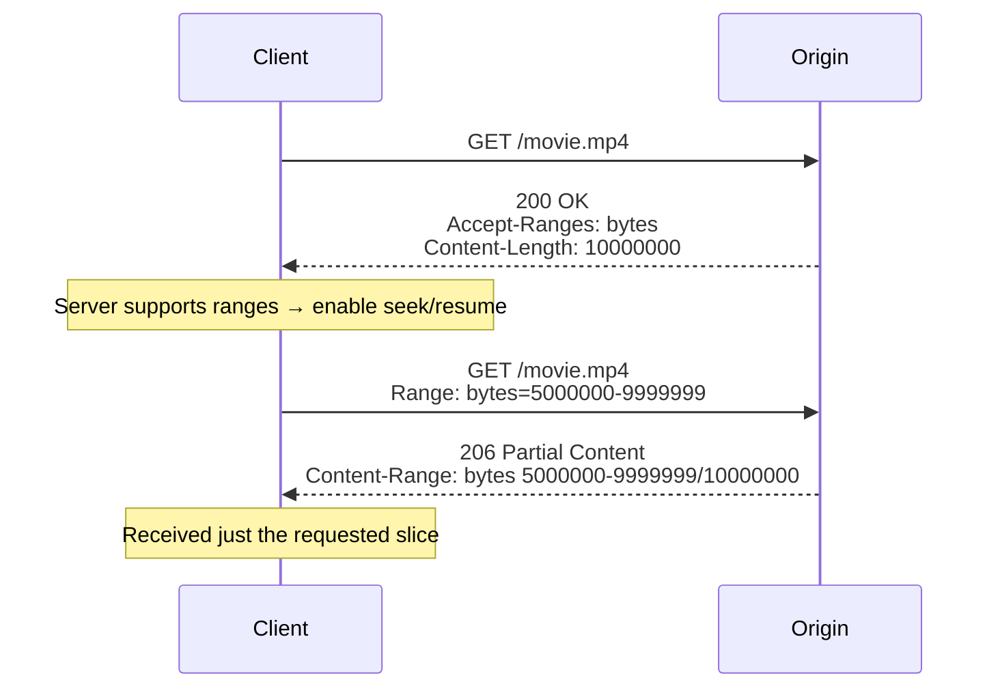

# Accept-Ranges

## Quick Summary

`Accept-Ranges` is a **response** header by which a server **advertises whether it supports range requests** for a resource — almost always `Accept-Ranges: bytes` (it supports byte ranges) or `Accept-Ranges: none` (it does not). It is the server's way of telling clients "you may ask me for *parts* of this resource" — enabling resumable downloads, media seeking, and parallel/segmented fetching via the [`Range`](../13-Range-Requests/Range.md) request header. When a client sees `Accept-Ranges: bytes`, it knows it can send `Range: bytes=...` to fetch a slice and receive a `206 Partial Content` with a [`Content-Range`](../13-Range-Requests/Content-Range.md); when it sees `Accept-Ranges: none` (or the header is absent), it should fetch the whole resource. It's a small, advisory header — a *capability announcement*, not a directive — but it's the entry point to the entire range-request subsystem that underpins video streaming, large-file downloads, and download managers.

## What problem does this header solve?

Range requests are powerful but only useful if the client knows the server supports them. Without an advertisement, a client would have to *guess*: blindly send a `Range` header and hope for a `206` (rather than a `200` with the whole body). That's wasteful and unreliable — some servers ignore `Range` entirely and return the full resource, so a download manager that assumed range support could silently re-download gigabytes.

`Accept-Ranges` removes the guesswork. On a normal (full) response, the server states its capability up front: `bytes` means "resumable downloads and seeking will work here," `none` means "don't bother asking for parts." This lets clients:
- **enable a "resume" button** for downloads only when it will actually work,
- **allow media seeking** (a `<video>` scrubber) only against range-capable sources,
- **spin up parallel segmented downloads** confident each range will be honored,
- and **avoid re-downloading** whole files when a connection drops, if the server supports resuming.

It turns "try it and see" into a declared contract.

## Why was it introduced?

`Accept-Ranges` was introduced with HTTP/1.1's range mechanism (RFC 2068, 1997; RFC 2616, 1999), specified today in **RFC 7233 (2014, "Range Requests")** and **RFC 9110 §14.3 (2022)**. Range requests were added to HTTP/1.1 to support **resumable and partial transfers** — resuming interrupted downloads and fetching portions of large resources — and `Accept-Ranges` is the discovery half of that feature: a way for servers to declare the capability so clients don't have to probe for it. The two defined values (`bytes` and `none`) reflect that HTTP's only standardized range unit is bytes; `none` exists specifically so a server can *explicitly* say "I could support ranges in general, but not for this resource," which is more informative than simply omitting the header.

## How does it work?

The server includes `Accept-Ranges` on a normal `200 OK` (full) response to advertise capability. Clients that want a slice then send a [`Range`](../13-Range-Requests/Range.md) request; the server responds `206 Partial Content` with [`Content-Range`](../13-Range-Requests/Content-Range.md) (satisfiable) or `416 Range Not Satisfiable` (invalid range).



- **Browser behavior:** Browsers read `Accept-Ranges` to decide whether to attempt range requests (for media seeking, resuming downloads). Media elements rely on it; download managers use it to enable "resume."
- **Server behavior:** The origin sets `Accept-Ranges: bytes` for resources it can serve in parts (static files, media, stored objects) and `none` (or omits it) for dynamically-generated/streamed content it can't slice. It must then actually honor [`Range`](../13-Range-Requests/Range.md) with `206`/`416`.
- **Proxy behavior:** Forwards `Accept-Ranges`; a caching proxy that stores full objects can serve ranges from them and advertise `bytes`.
- **CDN behavior:** CDNs advertise `bytes` for cacheable objects and serve ranges from cached/slice storage — central to media delivery. Some can *add* range support even if the origin didn't (`proxy_force_ranges`-style behavior).
- **Reverse proxy behavior:** Nginx sets `Accept-Ranges: bytes` for static files automatically and can force ranges for proxied upstreams.

## HTTP Request Example

`Accept-Ranges` is a **response** header — clients don't send it. The relevant client action is a normal GET (whose response advertises capability) followed optionally by a `Range` request:

```http
GET /downloads/ubuntu.iso HTTP/1.1
Host: mirror.example.com
```

```http
GET /downloads/ubuntu.iso HTTP/1.1
Host: mirror.example.com
Range: bytes=524288000-
```

## HTTP Response Example

Advertising byte-range support on a full response:

```http
HTTP/1.1 200 OK
Content-Type: application/octet-stream
Content-Length: 1048576000
Accept-Ranges: bytes
ETag: "iso-v1-strong"
```

Explicitly declaring no range support (e.g. a dynamically generated stream):

```http
HTTP/1.1 200 OK
Content-Type: application/json
Transfer-Encoding: chunked
Accept-Ranges: none
```

The subsequent partial response when a range is honored:

```http
HTTP/1.1 206 Partial Content
Content-Range: bytes 524288000-1048575999/1048576000
Content-Length: 524288000
Accept-Ranges: bytes
```

## Express.js Example

`res.sendFile`/`express.static` set `Accept-Ranges: bytes` and handle ranges automatically. For custom handlers you set it explicitly to match your actual capability:

```js
const express = require('express');
const fs = require('fs');
const app = express();

// 1) Static files: Express advertises Accept-Ranges: bytes and serves 206 for you.
app.use('/downloads', express.static('files', {
  acceptRanges: true,   // default true; set false to disable range support entirely.
}));

// 2) Custom file handler: advertise bytes AND honor Range (they must be consistent).
app.get('/media/:file', (req, res) => {
  const path = `/data/${req.params.file}`;
  const { size } = fs.statSync(path);

  res.set('Accept-Ranges', 'bytes');   // announce capability on every response.

  const range = req.headers['range'];
  if (!range) {
    res.set('Content-Length', size);
    return fs.createReadStream(path).pipe(res);   // full 200
  }
  const [s, e] = range.replace('bytes=', '').split('-');
  const start = parseInt(s, 10);
  const end = e ? parseInt(e, 10) : size - 1;
  if (start >= size || end >= size || start > end) {
    return res.status(416).set('Content-Range', `bytes */${size}`).end();
  }
  res.status(206)
     .set('Content-Range', `bytes ${start}-${end}/${size}`)
     .set('Content-Length', end - start + 1);
  fs.createReadStream(path, { start, end }).pipe(res);
});

// 3) A dynamically-streamed endpoint that CANNOT serve ranges: say so honestly.
app.get('/api/live-export', (req, res) => {
  res.set('Accept-Ranges', 'none');    // don't let clients think they can seek this.
  res.type('application/json');
  streamRowsTo(res);                    // chunked stream; no Range support.
});

app.listen(3000);
```

Why each piece matters: the header is a **promise**, so it must match reality — advertising `Accept-Ranges: bytes` while ignoring `Range` (returning `200` with the whole body) misleads clients into thinking resume/seek works when it doesn't. Conversely, `Accept-Ranges: none` on the live-export endpoint (route 3) is honest signaling that stops clients from attempting doomed seeks on an unsliceable stream. For files, prefer `express.static`/`sendFile` (route 1) — they keep the advertisement and the `206`/`416` handling consistent for you.

## Node.js Example

Raw `http`:

```js
const http = require('http');
const fs = require('fs');

http.createServer((req, res) => {
  const path = '/data/movie.mp4';
  const { size } = fs.statSync(path);
  res.setHeader('Accept-Ranges', 'bytes');   // advertise on every response

  const range = req.headers['range'];
  if (!range) {
    res.setHeader('Content-Type', 'video/mp4');
    res.setHeader('Content-Length', size);
    return fs.createReadStream(path).pipe(res);
  }
  const [s, e] = range.replace('bytes=', '').split('-');
  const start = parseInt(s, 10), end = e ? parseInt(e, 10) : size - 1;
  res.writeHead(206, {
    'Content-Type': 'video/mp4',
    'Content-Range': `bytes ${start}-${end}/${size}`,
    'Content-Length': end - start + 1,
  });
  fs.createReadStream(path, { start, end }).pipe(res);
}).listen(3000);
```

The contract: advertise `bytes` and *actually* serve `206`/`416` — the announcement and the behavior must agree.

## React Example

React never sets `Accept-Ranges` (response header) and rarely reads it — the browser uses it internally. Where it matters:

1. **Media seeking depends on it.** A `<video>`/`<audio>` element can only scrub smoothly if the source advertises `Accept-Ranges: bytes` and honors ranges. If your origin/CDN doesn't, seeking degrades to full re-downloads or fails.

```jsx
function VideoPlayer({ src }) {
  // Smooth scrubbing requires the server to send Accept-Ranges: bytes and serve 206s.
  return <video src={src} controls preload="metadata" />;
}
```

2. **Resumable-download features.** If you build (or use a library for) resumable downloads, you check `Response.headers.get('accept-ranges')` to decide whether to enable "resume"; `bytes` → resume with `Range`, `none`/absent → restart from scratch.

3. **Server-config, not React, is the fix.** Janky video or missing resume in a React app usually traces to a server/CDN not advertising or honoring ranges — the remedy is server-side.

## Browser Lifecycle

1. The browser makes a normal GET and reads `Accept-Ranges` on the `200` response.
2. **`bytes`** → the browser knows it may issue [`Range`](../13-Range-Requests/Range.md) requests for seeking/resuming.
3. On a seek/resume, it sends `Range` (often with [`If-Range`](../12-Conditional-Requests/If-Range.md)) and expects `206` + [`Content-Range`](../13-Range-Requests/Content-Range.md).
4. **`none`/absent** → the browser fetches the whole resource; media may still play but seeking to un-buffered regions may require re-fetching from the start or be unavailable.
5. Media elements repeat range requests per seek, relying on the initial capability advertisement.

## Production Use Cases

- **Video/audio streaming:** advertise `bytes` so `<video>`/`<audio>` seeking works and only needed regions are fetched.
- **Large-file downloads:** enable resumable downloads (ISOs, installers, datasets, backups).
- **Download managers / mobile apps:** show a "resume" capability and use parallel segmented fetches.
- **CDN media delivery:** edge byte-range/slice serving of popular media.
- **Progressive document viewers:** fetch specific page ranges of large PDFs.
- **Honest "no ranges" signaling:** `none` for dynamically streamed endpoints so clients don't attempt seeks.

## Common Mistakes

- **Advertising `bytes` but ignoring `Range`.** Returning `200` with the full body when a `Range` was sent breaks resume/seek and wastes bandwidth — the advertisement lied.
- **Omitting it on range-capable resources.** Clients may not attempt ranges, disabling seek/resume unnecessarily.
- **Forgetting the paired headers.** A `206` must include [`Content-Range`](../13-Range-Requests/Content-Range.md); a `416` should include `Content-Range: bytes */total`.
- **Advertising ranges without a strong validator.** For safe resume, pair with a strong [`ETag`](../06-Caching-Headers/ETag.md) and [`If-Range`](../12-Conditional-Requests/If-Range.md); otherwise resumed splices can corrupt.
- **Assuming `Accept-Ranges` implies a specific unit other than bytes.** The only widely-used unit is `bytes`.
- **Inconsistent capability across a fleet/CDN.** If some nodes support ranges and others don't for the same URL, clients get flaky behavior.

## Security Considerations

- **Range amplification / DoS.** Advertising and honoring ranges opens the range subsystem to abuse — crafted multi-range requests historically amplified server work (the Apache "Range header DoS", CVE-2011-3192). Bound the number of ranges per request, enforce minimum range sizes, and cap ranged work. `Accept-Ranges` isn't the vulnerability, but enabling ranges means you must harden range handling.
- **Not authorization.** Advertising ranges doesn't change access control; enforce auth before serving any range or full body.
- **Information exposure via range behavior.** Range responses reveal exact sizes (via `Content-Range`); usually benign, occasionally sensitive for protected resources.
- **Consistency with [`If-Range`](../12-Conditional-Requests/If-Range.md).** If you support ranges, support the `If-Range` interlock so resumed partials can't splice mismatched versions.

## Performance Considerations

- **Enables massive bandwidth savings:** clients fetch only needed regions (seeking) or only the remainder (resume) instead of whole files.
- **Improves resilience:** dropped connections resume instead of restarting large downloads.
- **Parallel segmented downloads** can boost throughput on high-latency links (multiple range connections).
- **CDN slice caching** serves popular media regions from the edge without pulling whole files.
- **Negligible header cost;** the value is unlocking the range feature, not the bytes of the header.

## Reverse Proxy Considerations

Nginx advertises and serves ranges for static files automatically; for upstreams you can force range support:

```nginx
server {
  location /downloads/ {
    root /var/www;
    # Nginx sets Accept-Ranges: bytes and serves 206/416 for static files automatically.
  }

  location /media/ {
    proxy_pass http://origin_upstream;
    proxy_cache media_cache;
    proxy_cache_valid 200 206 1d;
    proxy_force_ranges on;    # advertise + serve ranges even if upstream omits Accept-Ranges.
    slice 1m;                 # cache in slices; enables efficient range serving.
    proxy_set_header Range $slice_range;
    add_header Accept-Ranges bytes always;
  }

  location /api/stream/ {
    proxy_pass http://app_upstream;
    # A streamed endpoint that can't be sliced: don't force ranges.
    add_header Accept-Ranges none always;
  }
}
```

Key points: `proxy_force_ranges on` + `slice` is the standard way to add range/seek support and efficient large-media caching in front of an origin. Keep the advertisement consistent with actual behavior; declare `none` for genuinely unsliceable streams.

## CDN Considerations

- **CDNs advertise `Accept-Ranges: bytes` for cacheable objects** and serve ranges from cache/slice storage — essential for video and large downloads.
- **Some CDNs add range support** even when the origin doesn't (fetching the whole object once, then serving ranges from cache).
- **Cloudflare/CloudFront/Fastly/Akamai** support range serving; ensure your origin advertises `bytes` and provides a strong [`ETag`](../06-Caching-Headers/ETag.md) for safe resume via [`If-Range`](../12-Conditional-Requests/If-Range.md).
- **Consistency:** make sure all edge nodes present the same capability and size for a URL.

## Cloud Deployment Considerations

- **Object storage (S3/GCS/Azure Blob):** natively advertise `Accept-Ranges: bytes` and serve `206`/`416` — the recommended origin for downloads/media.
- **API Gateways:** may buffer or not support ranges; verify for large-file endpoints, or serve those from object storage/CDN directly.
- **Load balancers:** pass `Accept-Ranges` and range responses through untouched.
- **Serverless:** streaming ranged responses from a function is constrained by size/time limits; prefer redirecting to signed storage/CDN URLs for large files rather than proxying ranges through a function.

## Debugging

- **Chrome DevTools → Network:** on a full response, check for `Accept-Ranges: bytes` in Response Headers. Seeking a `<video>` should produce `206` rows.
- **curl (capability):** `curl -sD - -o /dev/null https://host/file | grep -i accept-ranges` → expect `Accept-Ranges: bytes`.
- **curl (verify honoring):** `curl -sD - -o /dev/null -r 0-1023 https://host/file` → expect `206` and `Content-Range`; if you get `200`, the server advertised but didn't honor ranges.
- **curl (resume):** `curl -C - -O https://host/file.iso` auto-resumes using ranges (works only if the server supports them).
- **Postman / Bruno:** assert the `Accept-Ranges` header value; then send a `Range` and assert `206`.
- **Node.js:** log the `Accept-Ranges` you set and confirm your handler actually returns `206`/`416` for `Range` requests.

## Best Practices

- [ ] Advertise `Accept-Ranges: bytes` on resources you can serve in parts, and **actually honor** [`Range`](../13-Range-Requests/Range.md) with `206`/`416`.
- [ ] Use `Accept-Ranges: none` for genuinely unsliceable (dynamically streamed) resources so clients don't attempt seeks.
- [ ] Pair range support with a strong [`ETag`](../06-Caching-Headers/ETag.md) and honor [`If-Range`](../12-Conditional-Requests/If-Range.md) for safe resume.
- [ ] Include [`Content-Range`](../13-Range-Requests/Content-Range.md) on `206` and `bytes */total` on `416`.
- [ ] Keep capability and size **consistent** across the fleet/CDN.
- [ ] Bound multi-range requests to prevent amplification/DoS.
- [ ] Serve large media/downloads from object storage/CDN for reliable range support.
- [ ] Enforce authorization before serving any range or full body.

## Related Headers

- [Range](../13-Range-Requests/Range.md) — the request header clients use once `Accept-Ranges: bytes` is advertised.
- [Content-Range](../13-Range-Requests/Content-Range.md) — describes which bytes a `206` contains.
- [If-Range](../12-Conditional-Requests/If-Range.md) — guards that a resumed range belongs to the same version.
- [ETag](../06-Caching-Headers/ETag.md) / [Last-Modified](../06-Caching-Headers/Last-Modified.md) — validators for safe resume.
- [Content-Length](./Content-Length.md) — total size on full responses; per-range length on `206`.
- [Transfer-Encoding](../10-Compression/Transfer-Encoding.md) — chunked streaming; typically `Accept-Ranges: none` for such responses.
- [Range Requests Overview](../13-Range-Requests/Range-Requests-Overview.md) — the full partial-content model.

## Decision Tree

```mermaid
flowchart TD
    A[Serving a resource] --> B{Can I serve arbitrary byte slices?<br/>(static file / stored object)}
    B -- Yes --> C[Accept-Ranges: bytes<br/>+ honor Range → 206/416]
    C --> D[Pair with strong ETag + If-Range<br/>for safe resume]
    B -- No (dynamic stream) --> E[Accept-Ranges: none<br/>(honest: no seeking)]
    C --> F{Large media/downloads?}
    F -- Yes --> G[Serve from object storage/CDN<br/>with slice caching]
```

## Mental Model

Think of `Accept-Ranges: bytes` as a **sign on a bakery counter that reads "Yes, we sell by the slice."** Without the sign, a customer who only wants two slices has to guess — and might be handed the entire loaf (a full `200`) after asking. The sign removes the doubt: seeing "sold by the slice," the customer confidently asks for "slices 5 through 8" (a `Range` request) and gets exactly those (`206`), perfectly cut and labeled with where they came from in the loaf ([`Content-Range`](../13-Range-Requests/Content-Range.md)). A bakery that makes *made-to-order smoothies* instead posts "whole servings only" (`Accept-Ranges: none`) — honest, because you can't hand someone "the middle third" of a smoothie being poured. The cardinal rule is that the sign must be **truthful**: a counter advertising "by the slice" that then shoves the whole loaf at every slice-request has broken its promise — the sign is only useful if the counter actually cuts.
