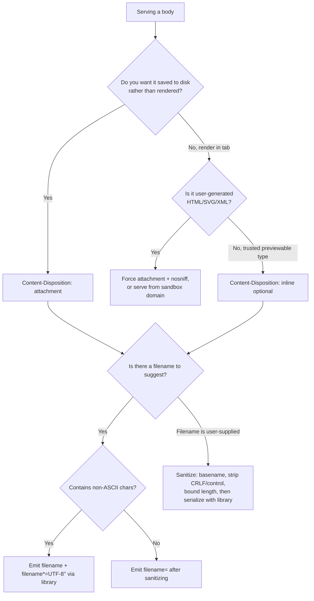

# Content-Disposition

## Quick Summary

`Content-Disposition` tells the recipient how a body should be *presented*: rendered **inline** in the browser (like a PDF shown in the tab) or treated as an **attachment** to be saved to disk (a download), optionally with a suggested `filename`. It is primarily a **response** header on downloads, but it also appears inside each part of a `multipart/form-data` **request** body to name form fields and uploaded files. The header carries a disposition type (`inline` / `attachment` / `form-data`) plus parameters, most importantly `filename` (ASCII fallback) and `filename*` (RFC 5987 percent-encoded UTF-8 for non-ASCII names). It is a small header with an outsized security footprint: it turns arbitrary bytes into "safe downloads" instead of executable inline content, and its `filename` is a classic reflected-injection sink if you echo a user-supplied name without sanitization.

## What problem does this header solve?

A server returns bytes with a [`Content-Type`](./Content-Type.md), but that alone doesn't say what the *user experience* should be. Should the browser open this `application/pdf` in its built-in viewer, or download it? Should this `text/html` blob — perhaps a user-generated export — render (and run any embedded script) in the origin's security context, or be saved as an inert file? And when the user does save it, what should the file be **named**? A URL like `/api/reports/download?id=8842` is a terrible filename; the user wants `Q3-2026-revenue.pdf`.

`Content-Disposition` answers both: it forces the *download-vs-render* decision independently of `Content-Type`, and it supplies a human-meaningful filename decoupled from the URL. Forcing `attachment` is also a security control — it prevents a browser from rendering user-controlled HTML/SVG inline on your origin (a reflected-XSS avenue) by making it a saved file instead. On uploads, `Content-Disposition: form-data` is the mechanism that lets a single `multipart/form-data` request carry many named fields and files in one body.

## Why was it introduced?

`Content-Disposition` originates in **MIME email** (RFC 1806, 1995, then RFC 2183), where it distinguished message text (`inline`) from attachments. HTTP borrowed it, and it was informally used for years before being formally specified for the web in **RFC 6266 (2011), "Use of the Content-Disposition Header Field in HTTP"**. A hard problem RFC 6266 had to solve was **non-ASCII filenames**: the original `filename` parameter is limited to ASCII, so names with accents, CJK characters, or emoji couldn't be represented safely and interoperably. The solution was the `filename*` parameter using the encoding of **RFC 5987 ("Character Set and Language Encoding for HTTP Header Field Parameters")**: `filename*=UTF-8''<percent-encoded-utf8>`. Servers send **both** — a plain ASCII `filename` for legacy clients and a `filename*` for modern ones, which take precedence. For request bodies, the `form-data` disposition type comes from **RFC 7578 ("Returning Values from Forms: multipart/form-data")**.

## How does it work?

The response header names a disposition and parameters; the client decides presentation accordingly. In `multipart/form-data`, each part begins with its own `Content-Disposition: form-data; name="field"` (plus `filename="..."` for file parts) and optional `Content-Type`.

- **Browser behavior:** `inline` (or absent) → the browser renders the body if it has a handler for the `Content-Type` (HTML, images, PDF via the built-in viewer); otherwise it downloads. `attachment` → always a download (Save dialog or auto-save to Downloads), using `filename*`/`filename` as the suggested name. The browser sanitizes the suggested name against its own rules (strips path separators, may remap dangerous characters) before writing to disk.
- **Server behavior:** the origin sets the header to force downloads (exports, invoices, generated files) or to serve inline (previewable documents). It is responsible for encoding non-ASCII filenames correctly and for sanitizing any user-derived filename.
- **Proxy behavior:** forward proxies pass it through unchanged; it does not affect caching or framing.
- **CDN behavior:** CDNs forward it and cache it with the object. Some object stores/CDNs (S3 + CloudFront) let you *override* `Content-Disposition` per request via a query parameter (e.g., S3's `response-content-disposition`), so one stored object can be served inline or as a named download depending on the link.
- **Reverse proxy behavior:** Nginx can add or override it (e.g., `add_header Content-Disposition` on a download location) and, when serving via `X-Accel-Redirect`/internal locations, can attach a disposition to a file streamed from disk.

## HTTP Request Example

A `multipart/form-data` upload — each part carries its own `Content-Disposition: form-data`:

```http
POST /api/profile HTTP/1.1
Host: app.example.com
Content-Type: multipart/form-data; boundary=----WebKitBoundary7MA4YWxk
Content-Length: 421

------WebKitBoundary7MA4YWxk
Content-Disposition: form-data; name="displayName"

Emran Hossain
------WebKitBoundary7MA4YWxk
Content-Disposition: form-data; name="avatar"; filename="photo café.png"
Content-Type: image/png

<...binary PNG bytes...>
------WebKitBoundary7MA4YWxk--
```

Each part's `name` maps to a form field; the `filename` on the file part is the original client-side name (untrusted input the server must sanitize).

## HTTP Response Example

Force a download with a non-ASCII filename — note **both** `filename` (ASCII fallback) and `filename*` (UTF-8):

```http
HTTP/1.1 200 OK
Content-Type: application/pdf
Content-Length: 88213
Content-Disposition: attachment; filename="invoice.pdf"; filename*=UTF-8''facture-caf%C3%A9-2026.pdf
Cache-Control: private, no-store
```

Serve inline (render in the browser tab) — the default for a previewable type but stated explicitly:

```http
HTTP/1.1 200 OK
Content-Type: application/pdf
Content-Disposition: inline; filename="preview.pdf"
```

## Express.js Example

```js
const express = require('express');
const path = require('path');
const contentDisposition = require('content-disposition'); // handles filename*/RFC 5987
const app = express();

// 1) The easy, correct way: res.download() streams a file AND sets
//    Content-Disposition: attachment with a properly-encoded filename.
app.get('/reports/:id/pdf', requireAuth, (req, res) => {
  const filePath = resolveReportPath(req.params.id); // your logic; must be inside a safe root
  const suggested = `report-${req.params.id}.pdf`;
  // res.download(path, filename): sets Content-Type from the extension, sets
  // Content-Disposition: attachment; filename="..."; filename*=UTF-8''... (Express
  // uses the content-disposition module internally, so non-ASCII is handled),
  // then streams the file. The callback runs on finish/error.
  res.download(filePath, suggested, (err) => {
    if (err && !res.headersSent) res.status(404).end();
  });
});

// 2) res.attachment(): sets the header (and Content-Type) but you send the body.
//    Useful when the body is generated in memory, not read from a file.
app.get('/export/users.csv', requireAuth, (req, res) => {
  res.attachment('users-export.csv');       // Content-Disposition: attachment; filename="users-export.csv"
  res.type('text/csv');                       // ensure the MIME type is correct
  const cursor = getUserCursor();
  cursor.on('data', (u) => res.write(`${u.id},${u.email}\n`));
  cursor.on('end', () => res.end());
});

// 3) Reflected filename — the DANGEROUS case, done SAFELY.
//    A user asks to download something under a name they supplied. Never echo it raw.
app.get('/files/:id/download', requireAuth, async (req, res) => {
  const record = await getFile(req.params.id, req.user);   // authz check: they own it
  const raw = req.query.name ?? record.originalName ?? 'download';

  // Sanitize: strip path separators, control chars, CR/LF (header injection),
  // and quotes; collapse to a safe basename. NEVER interpolate `raw` directly
  // into the header string.
  const safe = path.basename(String(raw))          // drop any directory components
    .replace(/[\r\n"]/g, '')                        // kill CRLF (header injection) and quotes
    // eslint-disable-next-line no-control-regex
    .replace(/[-]/g, '')          // strip control characters
    .slice(0, 200) || 'download';                   // bound the length; fallback if empty

  // Let the content-disposition module build the header — it emits both a
  // sanitized ASCII `filename` and an RFC 5987 `filename*` for us, correctly.
  res.setHeader('Content-Disposition', contentDisposition(safe, { type: 'attachment' }));
  res.setHeader('Content-Type', record.mimeType || 'application/octet-stream');
  res.setHeader('X-Content-Type-Options', 'nosniff'); // stop MIME-sniffing into an executable render
  streamFileToResponse(record, res);
});

app.listen(3000);
```

Why each line matters: `res.download`/`res.attachment` remove the temptation to hand-build the header (and get RFC 5987 wrong). In the reflected case, `path.basename` defeats `../` and absolute paths, the `\r\n` strip defeats **header injection** (an attacker putting `\r\nSet-Cookie: ...` into the filename), stripping control chars defeats terminal/UI spoofing, and letting the `content-disposition` module serialize the value means the ASCII fallback and UTF-8 `filename*` are always well-formed. `X-Content-Type-Options: nosniff` stops a browser from ignoring your `Content-Type` and rendering the download as HTML.

## Node.js Example

Raw `http` gives no helpers — you must encode `filename*` yourself, which shows exactly what Express does under the hood:

```js
const http = require('http');
const fs = require('fs');

// Build an RFC 6266 header with an ASCII fallback + RFC 5987 filename*.
function contentDisposition(filename, type = 'attachment') {
  const base = require('path').basename(filename).replace(/[\r\n"]/g, '');
  // ASCII fallback: replace any non-ASCII byte with '_' so legacy clients get a name.
  const ascii = base.replace(/[^\x20-\x7e]/g, '_');
  // RFC 5987: percent-encode the UTF-8 bytes; encodeURIComponent covers most,
  // but RFC 5987 also requires encoding a few extra chars.
  const encoded = encodeURIComponent(base)
    .replace(/['()*]/g, (c) => '%' + c.charCodeAt(0).toString(16).toUpperCase());
  return `${type}; filename="${ascii}"; filename*=UTF-8''${encoded}`;
}

http.createServer((req, res) => {
  if (req.url.startsWith('/download/')) {
    const filePath = '/var/data/invoice.pdf';
    const { size } = fs.statSync(filePath);
    res.writeHead(200, {
      'Content-Type': 'application/pdf',
      'Content-Length': size,
      'Content-Disposition': contentDisposition('facture-café-2026.pdf'),
      'X-Content-Type-Options': 'nosniff',
    });
    return fs.createReadStream(filePath).pipe(res);
  }
  res.writeHead(404).end();
}).listen(3000);
```

The two subtleties raw Node forces you to confront: (1) `filename*` must be percent-encoded UTF-8 with the `UTF-8''` prefix, and a few characters (`'`, `(`, `)`, `*`) that `encodeURIComponent` leaves alone must also be encoded; (2) you should always ship an ASCII `filename` fallback for old clients. This is exactly the boilerplate the `content-disposition` npm module (used by Express) exists to remove.

## React Example

React cannot set response headers, so it never produces `Content-Disposition` — but it consumes it in two common patterns:

1. **Triggering a download.** For a same-origin authenticated file, you often can't just use a plain `<a href download>` because you need to send an `Authorization` header. So you fetch the blob and read the server's suggested filename from `Content-Disposition`:

```jsx
async function downloadReport(id, token) {
  const res = await fetch(`/reports/${id}/pdf`, {
    headers: { Authorization: `Bearer ${token}` }, // why fetch, not <a>: needs auth header
  });
  const blob = await res.blob();

  // Parse the server's suggested filename from Content-Disposition.
  const cd = res.headers.get('Content-Disposition') || '';
  const star = /filename\*=UTF-8''([^;]+)/i.exec(cd);       // prefer filename* (UTF-8)
  const plain = /filename="?([^";]+)"?/i.exec(cd);          // fall back to filename
  const name = star ? decodeURIComponent(star[1]) : (plain ? plain[1] : 'download.pdf');

  // Create an object URL and click a synthetic <a> to save with the right name.
  const url = URL.createObjectURL(blob);
  const a = document.createElement('a');
  a.href = url;
  a.download = name;          // the browser uses this as the save name.
  a.click();
  URL.revokeObjectURL(url);   // free the blob memory once the download starts.
}
```

2. **Uploading files.** When a React form sends `FormData`, the browser generates the `multipart/form-data` body and writes a `Content-Disposition: form-data; name=...; filename=...` for each part automatically — you never write it by hand:

```jsx
const fd = new FormData();
fd.append('displayName', name);
fd.append('avatar', file);                 // File object -> becomes a file part
await fetch('/api/profile', { method: 'POST', body: fd });
// Do NOT set Content-Type manually: the browser must set it to include the
// multipart boundary. The per-part Content-Disposition headers are auto-generated.
```

## Browser Lifecycle

1. **Response arrives.** The browser reads `Content-Disposition` alongside [`Content-Type`](./Content-Type.md).
2. **Disposition decision.** `attachment` → the resource is always downloaded, never rendered, regardless of type. `inline`/absent → the browser renders if it has a handler for the type, else downloads.
3. **Filename selection.** For a download it prefers `filename*` (decoding the RFC 5987 UTF-8 value); if absent it uses `filename`; if both are absent it derives a name from the URL path.
4. **Client-side sanitization.** The browser strips path separators and dangerous characters from the suggested name and resolves collisions (`report (1).pdf`). It will not let the server write outside the Downloads folder.
5. **Rendering context (security).** For `inline` HTML/SVG from your origin, the content runs in your origin's context — which is why forcing `attachment` (or serving user content from a separate sandbox domain) matters for XSS.
6. **`nosniff` interaction.** With `X-Content-Type-Options: nosniff`, the browser won't reinterpret a declared `application/octet-stream` download as HTML — closing a sniffing-based render.

## Production Use Cases

- **Generated documents:** invoices, statements, receipts, PDFs, and reports served as `attachment` with a human-readable, dated filename.
- **Data exports:** CSV/XLSX/JSON exports of tables — `attachment` so spreadsheets don't render as garbled text in the tab.
- **Previewable media:** PDFs and images served `inline` for in-tab preview, with a "Download" button that hits an `attachment` variant of the same object.
- **Object-store downloads:** S3/GCS presigned URLs with `response-content-disposition` to attach a friendly name to an opaque object key.
- **User-uploaded file re-download:** serving back a file the user uploaded under its original (untrusted) name — the reflected-filename sanitization case.
- **Forcing safety on risky types:** serving user-generated HTML/SVG/XML as `attachment` (+ `nosniff`) so it can never render script inline on your origin.

## Common Mistakes

- **Interpolating an untrusted filename directly into the header.** `res.setHeader('Content-Disposition', 'attachment; filename="' + req.query.name + '"')` is a header-injection and content-spoofing bug. Always sanitize and prefer a library.
- **Only sending `filename`, breaking non-ASCII names.** Users with accented/CJK/emoji filenames get mojibake or a mangled name. Always emit `filename*` (RFC 5987 UTF-8) alongside the ASCII fallback.
- **Encoding `filename*` wrong.** Forgetting the `UTF-8''` prefix, using raw UTF-8 instead of percent-encoding, or failing to encode `'`, `(`, `)`, `*` produces a header some browsers ignore. Use the `content-disposition` module.
- **Setting `Content-Type` manually on a `FormData` upload.** Overriding it drops the multipart boundary and the server can't parse the parts. Let the browser set it.
- **Relying on disposition alone for XSS safety.** `attachment` helps, but without `X-Content-Type-Options: nosniff` a browser may still sniff and render. Combine them.
- **Assuming `inline` guarantees rendering.** If the browser lacks a handler for the type, `inline` still results in a download. It's a hint, not a command.
- **Putting a path in `filename`.** `filename="../../etc/passwd"` — browsers strip it, but never rely on the client; sanitize server-side too.

## Security Considerations

- **Reflected-filename header injection.** If the filename is user-controlled and contains `\r\n`, an attacker can inject additional response headers (e.g., `Set-Cookie`, a fake `Content-Type`) — a classic CRLF/HTTP-response-splitting bug. Strip CR/LF and control characters; better, let a library serialize the value.
- **Content-spoofing / dangerous extensions.** An attacker may try to make a download land as `invoice.pdf.exe` or `report.html` to trigger execution or a misleading render. Control the extension server-side; don't derive it solely from user input.
- **Inline XSS via user content.** Serving user-uploaded HTML/SVG/XML `inline` from your origin lets embedded `<script>` run in your security context, stealing cookies/tokens. Serve such content as `attachment`, from an isolated *sandbox domain*, or with a restrictive [`Content-Security-Policy`](../05-Security-Headers/Content-Security-Policy.md), and always with `X-Content-Type-Options: nosniff`.
- **Path traversal on the server side.** The `filename` should never be used to locate the file on disk. Resolve the *content* by an internal ID and use `path.basename` on any name you echo back.
- **Authorization before disposition.** Downloads often bypass normal page auth flows (direct links, presigned URLs). Enforce authz on the download route itself; a friendly filename on a leaked object is still a leak.

## Performance Considerations

- **Negligible header cost.** `Content-Disposition` is a tiny header with no framing or caching impact of its own.
- **Streaming vs buffering.** Prefer streaming large downloads (`res.download`, `pipe`) so you don't buffer whole files in memory; the header is set once before the stream begins.
- **Cache-key note.** If one URL serves both an `inline` and an `attachment` variant based on a query param, that param must be part of the cache key (`Vary` won't help since it keys on request headers, not query) — otherwise a CDN can serve the wrong disposition.
- **Object-store override cost.** Overriding disposition per-request on S3/CloudFront (via `response-content-disposition`) can defeat edge caching because the query string becomes part of the request; weigh flexibility vs cache hit rate.

## Reverse Proxy Considerations

```nginx
server {
  # Force downloads for a directory of generated exports.
  location /exports/ {
    root /var/www;
    # add_header runs in addition to any upstream header; here we serve from disk.
    add_header Content-Disposition 'attachment';        # force save, don't render
    add_header X-Content-Type-Options 'nosniff' always; # stop MIME sniffing
  }

  # X-Accel-Redirect pattern: the app authorizes, then delegates the byte-streaming
  # to Nginx via an internal location, while STILL controlling the filename.
  location /protected-files/ {
    internal;                                # only reachable via X-Accel-Redirect
    root /var/secure-storage;
    # The app sets Content-Disposition on its response; Nginx forwards it because
    # X-Accel-Redirect preserves the app's headers. So the app owns the filename,
    # Nginx owns the fast file I/O.
  }
}
```

Key points: `add_header` lets the proxy impose or override a disposition for static locations. The `X-Accel-Redirect` (Nginx) / `X-Sendfile` (Apache) pattern is the production way to serve authenticated downloads efficiently: your app does the auth and sets `Content-Disposition`, then hands the actual byte-pushing to the web server. Ensure `add_header` uses `always` when you need it on error responses too.

## CDN Considerations

- **Cached with the object.** CDNs cache `Content-Disposition` as part of the stored response; changing the intended disposition of an already-cached object requires a purge or a distinct URL.
- **Per-request override on object stores.** S3 (`response-content-disposition`) and GCS support overriding disposition via signed-URL query parameters, so one object can be linked as inline preview or named download. This is the cleanest way to attach friendly names to opaque keys.
- **Query-param cache fragmentation.** Because those overrides live in the query string, each distinct filename/disposition is a separate cache entry — fine for infrequent downloads, wasteful for hot objects.
- **Edge functions.** Cloudflare Workers / CloudFront Functions can add or rewrite `Content-Disposition` at the edge (e.g., force `attachment` on user-content buckets) without touching the origin — a good place to enforce a download-everything policy for untrusted content.

## Cloud Deployment Considerations

- **S3 / GCS:** set `ContentDisposition` as object metadata at upload time, or override per-request via presigned URL parameters. This is the standard way to serve downloads at scale without proxying bytes through your app.
- **CloudFront / API Gateway:** can pass through or inject the header; API Gateway binary-media settings matter for non-text downloads (base64 handling).
- **Serverless (Lambda/Cloud Functions):** set `Content-Disposition` in the response object; for large files prefer a presigned S3 URL or Lambda response streaming rather than buffering the whole file in the function's memory.
- **Isolated content domains:** a common production pattern is serving all user-uploaded content from a separate origin (e.g., `usercontent.example.net`) with forced `attachment` + `nosniff`, so even a rendering slip can't run script in your app's origin.

## Debugging

- **Chrome DevTools → Network:** the response Headers pane shows the exact `Content-Disposition`. If a file renders when you expected a download (or vice versa), check the disposition type and `Content-Type`. The download appears in `chrome://downloads` with the resolved filename.
- **curl:** `curl -sD - -o /dev/null https://example.com/reports/8/pdf` prints the header so you can verify the `filename*` encoding. `curl -OJ URL` respects the server's `Content-Disposition` filename when saving (`-J`), letting you confirm the resolved name.
- **Postman / Bruno:** both show `Content-Disposition` in response headers; Postman's "Save Response → Save to a file" uses it. Bruno test scripts can assert the header contains a correctly-encoded `filename*`.
- **Node.js / Express logging:** log `res.getHeader('content-disposition')` on `finish` to confirm what you emit; on uploads, log each part's parsed `filename` (via `multer`/`busboy`) to see the untrusted client name before sanitization.
- **Header-injection test:** send a filename containing `%0d%0aSet-Cookie:x=1` and confirm your sanitization strips it (the response must contain no injected header).

## Best Practices

- [ ] Use `res.download()` / `res.attachment()` (or the `content-disposition` module) instead of hand-building the header.
- [ ] Always emit both an ASCII `filename` fallback and an RFC 5987 `filename*=UTF-8''...` for non-ASCII names.
- [ ] Sanitize any user-derived filename: `path.basename`, strip CR/LF and control characters, bound the length.
- [ ] Never interpolate untrusted input directly into the header string (CRLF injection).
- [ ] Serve user-generated HTML/SVG/XML as `attachment` with `X-Content-Type-Options: nosniff`, ideally from an isolated content domain.
- [ ] Enforce authorization on the download route itself, not just the page that links to it.
- [ ] Don't set `Content-Type` manually on `FormData` uploads — let the browser add the multipart boundary.
- [ ] For large files, stream (don't buffer) and, on cloud, prefer presigned URLs with `response-content-disposition`.
- [ ] Control the file extension server-side; don't trust a user-supplied extension to decide execution/rendering.

## Related Headers

- [Content-Type](./Content-Type.md) — decides *how* inline content renders; `Content-Disposition` decides *whether* it renders at all vs downloads. They work together.
- [X-Content-Type-Options](../05-Security-Headers/X-Content-Type-Options.md) — `nosniff` stops the browser from overriding your `Content-Type`, closing MIME-sniffing renders of downloads.
- [Content-Length](./Content-Length.md) — set alongside a download so the client shows an accurate progress bar.
- [Content-Security-Policy](../05-Security-Headers/Content-Security-Policy.md) — mitigates inline-XSS risk when user content must be served inline.
- [Content-Encoding](../10-Compression/Content-Encoding.md) — a download may still be compressed on the wire; disposition governs presentation, not encoding.

## Decision Tree



## Mental Model

Think of `Content-Disposition` as the **instruction sticker on a package handed to a courier (the browser)**: `inline` says "open it and show the contents on the counter," `attachment` says "don't open it — file it away in the customer's drawer under this name." The `filename` is the label you write on the folder. The security lesson is what happens when you let a stranger dictate the label: if they can write newlines into it, they smuggle extra instructions onto the sticker (header injection); if they can force it "open on the counter," their booby-trapped document detonates in your storefront (inline XSS). So you always print the label yourself from a trusted template, scrub anything the customer wrote, and when in doubt, file it away sealed (`attachment` + `nosniff`) rather than opening it in your shop.
