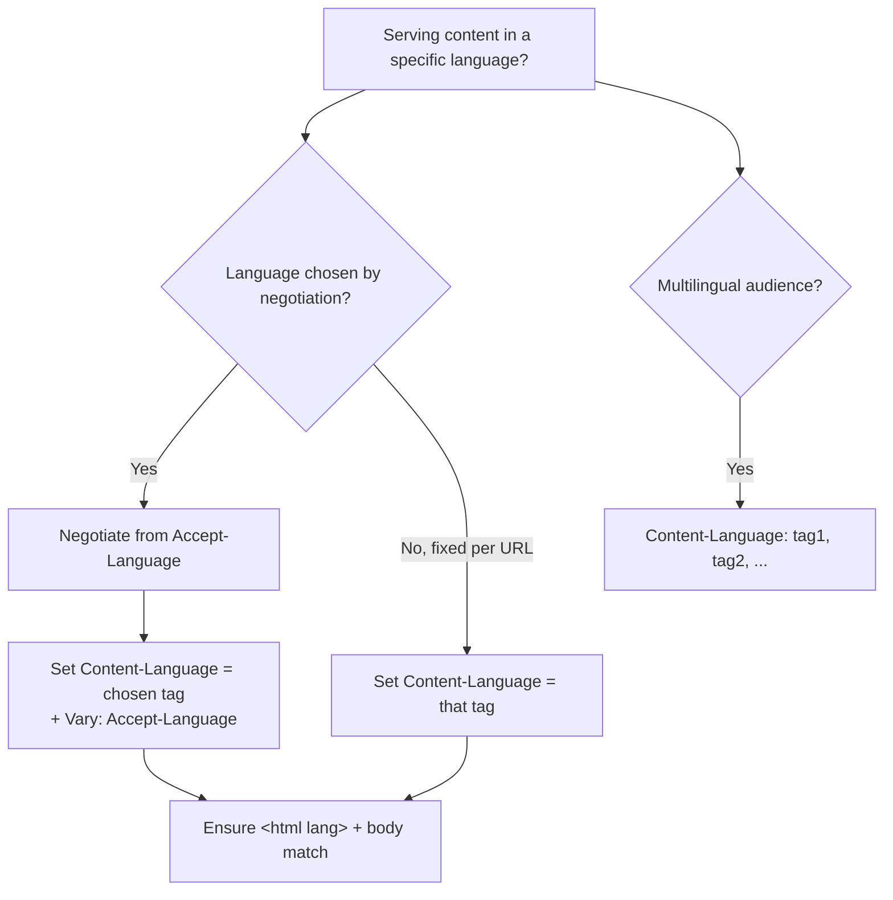

# Content-Language

## Quick Summary

`Content-Language` is a **response** (and occasionally request) header that states the **natural language(s) of the content in the body** — e.g. `Content-Language: fr` (French), `Content-Language: en-US` (US English), or `Content-Language: de, en` (content intended for German *and* English speakers). It is the *response-side answer* to the client's [`Accept-Language`](../03-Request-Headers/Accept-Language.md) request preference: the client says "I'd like French," the server negotiates and returns the chosen representation, and `Content-Language` labels *which* language it actually sent. Critically, it describes the **intended audience's language**, not necessarily every language present in the document — a page teaching French to English speakers might be `Content-Language: en` because it's *for* English speakers. It is a core part of HTTP's **content negotiation** for internationalization (i18n), it pairs with [`Vary: Accept-Language`](../06-Caching-Headers/Vary.md) so caches keep language variants separate, and it helps browsers, search engines, and assistive technology understand and handle multilingual content correctly. It is *metadata*, not a rendering directive — the HTML `lang` attribute does the actual per-element language marking.

## What problem does this header solve?

A single URL often serves different-language representations of the same resource: `/welcome` might return English, French, or Japanese depending on the user. Once a server has *chosen* a language (via negotiation), two problems arise:

1. **The client needs to know which language it got.** A browser, screen reader, or translation tool benefits from knowing the content is French so it can apply correct hyphenation, spell-check, voice/pronunciation, and offer "translate this page." Search engines use it to serve the right-language result to the right users.

2. **Caches must not cross-serve languages.** If a shared cache stored the French version and served it to an English user (or vice-versa), that's a correctness bug. `Content-Language` (with [`Vary: Accept-Language`](../06-Caching-Headers/Vary.md)) documents the negotiated dimension so caches key variants correctly.

`Content-Language` solves both: it *labels* the delivered representation's language so clients and intermediaries handle it appropriately. It's the response counterpart that closes the negotiation loop opened by [`Accept-Language`](../03-Request-Headers/Accept-Language.md).

## Why was it introduced?

`Content-Language` was introduced with HTTP/1.1 (RFC 2068, 1997; RFC 2616, 1999) as part of the **content-negotiation** and **entity metadata** system, specified today in **RFC 9110 §8.5 (2022)**. HTTP/1.1 formalized the idea that one resource can have multiple *representations* selected by request headers (the `Accept-*` family), and every negotiable dimension needs a response header that names the chosen variant — [`Content-Type`](./Content-Type.md) for media type, [`Content-Encoding`](../10-Compression/Content-Encoding.md) for compression, and `Content-Language` for natural language. It uses **BCP 47 language tags** (`en`, `en-US`, `fr`, `zh-Hant`), the same standardized tags used by `Accept-Language` and the HTML `lang` attribute, so language identification is consistent across the stack. The deliberate "intended audience" semantics (rather than "languages contained") comes straight from the spec, distinguishing it from a mere content-scan.

## How does it work?

After negotiating (or by fixed configuration), the server sets `Content-Language` to the BCP 47 tag(s) of the representation it's returning, and — if the choice depended on the request — adds [`Vary: Accept-Language`](../06-Caching-Headers/Vary.md).

```mermaid
sequenceDiagram
    participant C as Client
    participant S as Server
    C->>S: GET /welcome<br/>Accept-Language: fr-FR, fr;q=0.9, en;q=0.5
    Note over S: Negotiate → best match is French
    S-->>C: 200 OK<br/>Content-Language: fr<br/>Vary: Accept-Language<br/>(French body)
    Note over C: Apply French locale handling;<br/>cache keyed on Accept-Language
```

- **Browser behavior:** The browser uses `Content-Language` as a hint (e.g. for "translate this page" prompts, and combined with the document `lang`). It does **not** override the HTML `lang` attribute for rendering; per-element language marking is the `lang` attribute's job. It's mostly advisory metadata for the browser.
- **Server behavior:** The origin negotiates the language from [`Accept-Language`](../03-Request-Headers/Accept-Language.md) (or user setting), returns that representation, sets `Content-Language`, and adds `Vary: Accept-Language` when the choice is request-dependent.
- **Proxy behavior:** Forwards it; a shared proxy must honor `Vary: Accept-Language` to keep language variants separate.
- **CDN behavior:** Caches language variants keyed by `Accept-Language` (via `Vary` or a normalized cache key) and serves `Content-Language` with each.
- **Reverse proxy behavior:** Nginx can set `Content-Language` (e.g. `add_header Content-Language fr`) for statically-served localized content or pass the app's value through.

As a **request** header (rarer), `Content-Language` describes the language of a request body the client is *sending* (e.g. `POST`ing a French document) — same semantics, opposite direction.

## HTTP Request Example

The client expresses preference via `Accept-Language` (not `Content-Language`):

```http
GET /welcome HTTP/1.1
Host: www.example.com
Accept-Language: fr-FR, fr;q=0.9, en;q=0.5
```

A rare request-side use — uploading French content:

```http
POST /documents HTTP/1.1
Host: api.example.com
Content-Type: text/plain; charset=utf-8
Content-Language: fr

Bonjour, ceci est un document en français.
```

## HTTP Response Example

A negotiated French page:

```http
HTTP/1.1 200 OK
Content-Type: text/html; charset=utf-8
Content-Language: fr
Vary: Accept-Language
Cache-Control: public, max-age=300

<!doctype html>
<html lang="fr">...
```

Content intended for a multilingual audience:

```http
HTTP/1.1 200 OK
Content-Type: text/html; charset=utf-8
Content-Language: de, en
```

A resource *about* French but written *for* English speakers (audience semantics):

```http
HTTP/1.1 200 OK
Content-Type: text/html; charset=utf-8
Content-Language: en
```

## Express.js Example

```js
const express = require('express');
const app = express();

const SUPPORTED = ['en', 'fr', 'de', 'ja'];

// 1) Negotiate language from Accept-Language and label the response.
app.get('/welcome', (req, res) => {
  // req.acceptsLanguages() ranks the client's Accept-Language against ours.
  const lang = req.acceptsLanguages(SUPPORTED) || 'en';   // best match or default

  res.set('Content-Language', lang);   // label WHICH language we chose.
  res.vary('Accept-Language');         // caches must key on the negotiated dimension.
  res.set('Cache-Control', 'public, max-age=300');

  res.type('html').send(renderWelcome(lang)); // body + <html lang="..."> should match.
});

// 2) Static localized files: set Content-Language per directory/file.
app.use('/fr', (req, res, next) => { res.set('Content-Language', 'fr'); next(); },
        express.static('public/fr'));
app.use('/de', (req, res, next) => { res.set('Content-Language', 'de'); next(); },
        express.static('public/de'));

// 3) Multilingual content for several audiences.
app.get('/eu-notice', (req, res) => {
  res.set('Content-Language', 'de, fr, en');
  res.type('html').send(renderEuNotice());
});

app.listen(3000);
```

Why each piece matters: `req.acceptsLanguages(SUPPORTED)` performs the negotiation (matching the client's ranked [`Accept-Language`](../03-Request-Headers/Accept-Language.md) against your supported set) and returns the best fit — you then *label* that choice with `Content-Language`. The `res.vary('Accept-Language')` line is essential: without it, a shared cache could serve the French copy to an English user (cross-serving language variants). The `Content-Language` value should agree with the document's `<html lang>` and the actual body — a mismatch confuses translation tools and screen readers. For static localized trees (route 2), setting `Content-Language` per path keeps the metadata accurate without per-file logic.

## Node.js Example

Raw `http` with simple negotiation:

```js
const http = require('http');

const SUPPORTED = ['en', 'fr', 'de'];

function pickLanguage(acceptLanguage) {
  // Parse "fr-FR,fr;q=0.9,en;q=0.5" → ranked base tags, pick first supported.
  const ranked = (acceptLanguage || '')
    .split(',')
    .map(part => {
      const [tag, q] = part.trim().split(';q=');
      return { tag: tag.split('-')[0].toLowerCase(), q: q ? parseFloat(q) : 1 };
    })
    .sort((a, b) => b.q - a.q);
  return (ranked.find(r => SUPPORTED.includes(r.tag)) || { tag: 'en' }).tag;
}

http.createServer((req, res) => {
  const lang = pickLanguage(req.headers['accept-language']);
  res.setHeader('Content-Language', lang);
  res.setHeader('Vary', 'Accept-Language');
  res.setHeader('Content-Type', 'text/html; charset=utf-8');
  res.end(`<!doctype html><html lang="${lang}"><body>${greeting(lang)}</body></html>`);
}).listen(3000);
```

The contract: negotiate from `Accept-Language`, label with `Content-Language`, and set `Vary: Accept-Language`.

## React Example

React doesn't set `Content-Language` (server response header), but it interacts with the concept:

1. **Reading it for locale-aware behavior.** A React app can read `Content-Language` from a fetch response to know the returned locale (e.g. to format dates/numbers to match). Cross-origin reads need [`Access-Control-Expose-Headers`](../07-CORS/Access-Control-Expose-Headers.md).

```jsx
async function loadContent(url) {
  const res = await fetch(url, { headers: { 'Accept-Language': navigator.language } });
  const lang = res.headers.get('content-language') || 'en';  // what we actually got
  const html = await res.text();
  return { lang, html }; // use `lang` to set document.documentElement.lang, formatters, etc.
}
```

2. **SSR / Next.js i18n.** Server-rendered React that does locale routing (`/fr/...`, `/de/...`) should emit `Content-Language` matching the rendered locale and set `<html lang>` accordingly. Frameworks with i18n routing handle much of this; ensure the header and `lang` attribute agree.

3. **`lang` attribute is the real rendering signal.** In the DOM, set `<html lang={locale}>` — that's what drives hyphenation, screen readers, and spell-check. `Content-Language` is complementary HTTP-level metadata, not a substitute for `lang`.

## Browser Lifecycle

1. The client sends [`Accept-Language`](../03-Request-Headers/Accept-Language.md); the server negotiates and returns a representation with `Content-Language`.
2. The browser treats `Content-Language` as **metadata/hint** — e.g. to inform "translate this page" and, secondarily, language handling — but relies on the HTML `lang` attribute for actual per-element language behavior.
3. If the response varies by language, the browser (and any shared cache) keys the cached copy on `Accept-Language` per [`Vary`](../06-Caching-Headers/Vary.md).
4. Assistive tech and translation features use the language signal (ideally consistent between `Content-Language` and `lang`).
5. JS can read `Content-Language` via `Response.headers` (subject to CORS exposure cross-origin).

## Production Use Cases

- **Internationalized sites/apps:** label negotiated locale pages/APIs so clients, caches, and crawlers handle them correctly.
- **SEO for multilingual sites:** help search engines associate content with the right language/region (alongside `hreflang` link tags and `lang`).
- **Localized static content:** per-locale directories/files labeled with `Content-Language`.
- **API responses with localized messages:** label the language of returned error messages/content.
- **Translation tooling & accessibility:** give browsers/screen readers/translators an accurate language signal.
- **Multilingual documents:** declare multiple intended-audience languages.

## Common Mistakes

- **Confusing "languages contained" with "intended audience."** `Content-Language` describes who the content is *for*; a French lesson for English speakers is `en`.
- **Omitting [`Vary: Accept-Language`](../06-Caching-Headers/Vary.md).** Shared caches then cross-serve language variants — an English user gets the French page.
- **Mismatch with `<html lang>` / actual content.** Confuses screen readers, translation, and spell-check. Keep them consistent.
- **Treating it as a rendering directive.** It doesn't change rendering; the `lang` attribute does.
- **Non-BCP-47 values.** Use standard tags (`en-US`, `zh-Hant`), not ad-hoc strings.
- **Setting it but not actually localizing.** Labeling `fr` while serving English is worse than no label.
- **Assuming clients act on it strongly.** Most browsers treat it as a mild hint; it's not a guarantee of behavior.

## Security Considerations

- **Low risk; mostly metadata.** `Content-Language` carries little security weight on its own.
- **Cache-key correctness (privacy/correctness).** As with all negotiated dimensions, failing to `Vary` can cause a shared cache to serve the wrong variant — a correctness issue that, for personalized/locale-gated content, could leak the wrong regional content. Use `Vary`/correct cache keys.
- **Locale-based access decisions.** Don't gate security or access purely on language/locale headers — they're client-influenced and not identity.
- **Injection hygiene.** If you derive `Content-Language` from user input, validate against your supported BCP 47 set to avoid header injection.

## Performance Considerations

- **Cache fragmentation by language.** `Vary: Accept-Language` (or a language-keyed cache) creates one cache entry per language — necessary for correctness, but keep the supported set bounded and normalize `Accept-Language` to your supported tags to avoid excessive variants.
- **Negligible header cost;** the impact is in cache-key design, not bytes.
- **Normalization helps hit ratio:** map the client's full `Accept-Language` to your small supported set before keying, so you store a few variants (`en`, `fr`, `de`) not thousands.
- **CDN language routing** (edge selecting locale) can improve latency by serving the right variant from the edge.

## Reverse Proxy Considerations

Nginx can set `Content-Language` for localized static trees and must preserve `Vary`:

```nginx
server {
  location /fr/ {
    root /var/www;
    add_header Content-Language fr always;
    add_header Vary Accept-Language always;
  }
  location /de/ {
    root /var/www;
    add_header Content-Language de always;
    add_header Vary Accept-Language always;
  }

  location /app/ {
    proxy_pass http://app_upstream;   # app sets Content-Language after negotiation.
    # Ensure Vary: Accept-Language from upstream is preserved for correct caching.
  }
}
```

Key points: for statically-served locale directories, set `Content-Language` (and `Vary: Accept-Language`) per path. For app-negotiated content, let the app set the header and make sure the proxy/cache honors `Vary` so variants don't cross-serve.

## CDN Considerations

- **Variant caching:** CDNs cache per-language variants keyed on `Accept-Language` (via `Vary` or a normalized custom cache key) and serve `Content-Language` with each.
- **Normalize `Accept-Language` at the edge** to your supported set to bound variants and keep hit ratio high (raw `Accept-Language` is high-cardinality).
- **Edge locale routing:** some CDNs can pick a locale at the edge (by geo or `Accept-Language`) and serve the matching `Content-Language` variant.
- **Cloudflare/CloudFront/Fastly** support `Vary`-based or custom-key language caching; verify your CDN keys on the language dimension.

## Cloud Deployment Considerations

- **Object storage (S3/GCS):** can store `Content-Language` as object metadata for localized files served directly/via CDN.
- **API Gateways:** ensure `Content-Language` and `Vary: Accept-Language` pass through if your backend negotiates language.
- **Managed platforms (Vercel/Netlify):** i18n routing features set locale; ensure `Content-Language`/`lang` are emitted and caching keys on locale.
- **Serverless:** negotiate in the handler and set `Content-Language` + `Vary` per response.

## Debugging

- **Chrome DevTools → Network:** check `Content-Language` in Response Headers; compare with `<html lang>` and the actual content language.
- **curl (negotiation):** `curl -sD - -o /dev/null -H 'Accept-Language: fr' https://host/welcome | grep -i 'content-language\|vary'` → expect `Content-Language: fr` and `Vary: Accept-Language`. Repeat with `de` and confirm it changes.
- **Postman / Bruno:** send different `Accept-Language` values and assert the returned `Content-Language`.
- **Cache cross-serve test:** request `fr` then `en` through the CDN and confirm you don't get the French body for the English request (inspect `Content-Language`).
- **Node.js/Express:** log the negotiated language and the `Content-Language`/`Vary` you set.
- **SEO check:** verify `Content-Language`, `<html lang>`, and any `hreflang` link tags agree.

## Best Practices

- [ ] Set `Content-Language` (BCP 47 tags) on localized responses to label the delivered language.
- [ ] Add [`Vary: Accept-Language`](../06-Caching-Headers/Vary.md) whenever the language is negotiated from the request.
- [ ] Keep `Content-Language`, the document `<html lang>`, and the actual content **consistent**.
- [ ] Understand the **intended-audience** semantics (not "languages contained").
- [ ] Normalize `Accept-Language` to your supported set before caching to bound variants.
- [ ] Use `lang` attributes for actual rendering/accessibility; `Content-Language` is complementary metadata.
- [ ] Validate any user-derived language value against your supported BCP 47 tags.
- [ ] Pair with `hreflang`/sitemaps for multilingual SEO.

## Related Headers

- [Accept-Language](../03-Request-Headers/Accept-Language.md) — the request preference this header answers.
- [Vary](../06-Caching-Headers/Vary.md) — `Vary: Accept-Language` keeps language variants separate in caches.
- [Content-Type](./Content-Type.md) — the media-type dimension of negotiation (with `charset`).
- [Content-Encoding](../10-Compression/Content-Encoding.md) — the compression dimension of the same entity-metadata family.
- [Content-Location](./Content-Location.md) — can point to the specific-language variant's URL.
- [Access-Control-Expose-Headers](../07-CORS/Access-Control-Expose-Headers.md) — needed to read `Content-Language` from cross-origin JS.
- [Content Negotiation Overview](../11-Content-Negotiation/Content-Negotiation-Overview.md) — the framing chapter.

## Decision Tree



## Mental Model

Think of `Content-Language` as the **language label on a translated book's cover** — "Édition française" — that tells you, before you open it, which readership this particular printing is for. The customer asked the bookseller for a French edition ([`Accept-Language`](../03-Request-Headers/Accept-Language.md)); the bookseller found the French printing and handed it over with its cover clearly marked (`Content-Language: fr`). The subtlety that trips people up is *intended audience vs. contents*: a French-language textbook *teaching English* is still labeled "for English learners" if that's who it's written for — the label is about the reader, not merely the words inside. And just as a warehouse must shelve the French and German printings on *separate* shelves so a French customer never accidentally receives the German edition ([`Vary: Accept-Language`](../06-Caching-Headers/Vary.md)), a cache must keep language variants apart. The cover label doesn't *translate* the book — the actual translation (rendering, hyphenation, screen-reader pronunciation) is the job of the text and its per-page markup (the `lang` attribute); `Content-Language` is simply the honest label on the outside.
