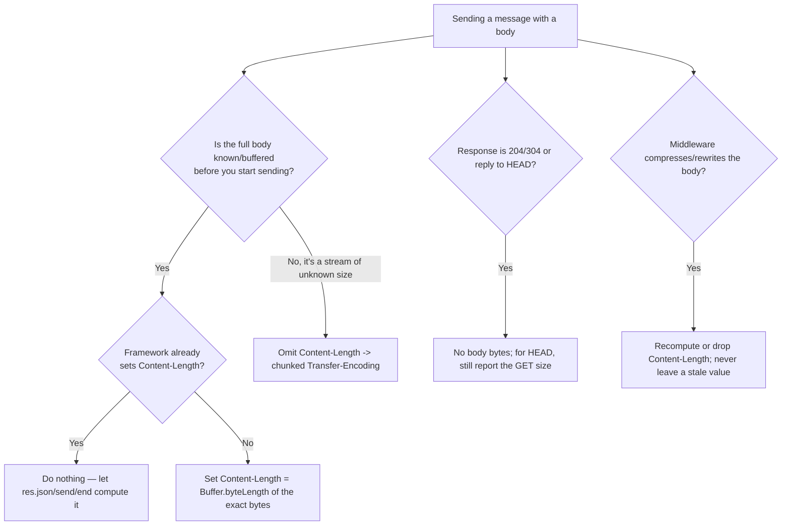

# Content-Length

## Quick Summary

`Content-Length` is the header that tells the recipient exactly how many **octets (bytes)** the message body contains. It appears on **both requests and responses**, and its value is a non-negative decimal count of the bytes *after* header/body separator (the blank line), measured on the wire — i.e., after any [`Content-Encoding`](../10-Compression/Content-Encoding.md) compression has been applied but not counting the headers themselves. It is the primary **message-framing** mechanism in HTTP/1.x: it is how a parser knows where one message ends and the next begins on a persistent, reused TCP connection. It is mutually exclusive with chunked [`Transfer-Encoding`](../10-Compression/Transfer-Encoding.md) — a message uses one framing or the other, never both — and the request-smuggling vulnerability class (CL.TE / TE.CL) is born precisely when two servers disagree about which one wins. In HTTP/2 and HTTP/3 the header is largely informational because framing is handled by the binary protocol layer, not by counting bytes.

## What problem does this header solve?

HTTP/1.x runs multiple request/response exchanges over a single reused TCP connection ([keep-alive](./Keep-Alive.md)). TCP is a byte stream with no notion of message boundaries — bytes just arrive. So the receiver faces a fundamental question after it finishes reading the headers: **"How many bytes of body should I read before the next message begins?"** Read too few and you leave part of the body in the buffer, corrupting the *next* message. Read too many and you block forever waiting for bytes that will never come, or you swallow the head of the next message.

`Content-Length` answers that question deterministically: "read exactly N bytes, then the body is done, then look for the next message." Without it (and without chunked encoding), the only way to signal "body is finished" is to **close the connection** — which is exactly how HTTP/1.0 worked and why it was slow: every response cost a fresh TCP (and later TLS) handshake. So `Content-Length` is what makes connection reuse possible for bodies of known size, and it is what lets a client show a real download progress bar (it knows the total up front) instead of an indeterminate spinner.

## Why was it introduced?

`Content-Length` dates back to HTTP/1.0 (RFC 1945, 1996), inherited from MIME, where it described the size of an entity. In HTTP/1.0 its role was modest: bodies could also be delimited by connection close, so the header was optional and often omitted. HTTP/1.1 (RFC 2068 in 1997, RFC 2616 in 1999, re-specified in **RFC 7230** in 2014 and again in **RFC 9112 "HTTP/1.1"** in 2022) made persistent connections the *default*, which forced the framing question to the front. RFC 7230/9112 laid down a strict precedence: if `Transfer-Encoding` is present, it defines the body length and `Content-Length` **must be ignored** (and per RFC 9112 a message with both is suspicious and should be rejected); otherwise `Content-Length` defines it; otherwise the body runs to connection close (responses) or is assumed empty (requests). This precise message-length algorithm exists precisely because ambiguity here is not a cosmetic bug — it is the root cause of HTTP request smuggling.

## How does it work?

A receiver parses the status/request line, then the header block terminated by a blank line (`CRLF CRLF`), then applies the RFC 9112 body-length rules. If `Content-Length: N` is the governing header, it reads exactly `N` octets and considers the body complete. The count is of raw wire bytes of the (possibly compressed) representation — for a gzipped response, `Content-Length` is the size of the *gzip stream*, not the original file.

- **Browser behavior:** On responses, the browser uses `Content-Length` to allocate buffers, drive download progress UI, and know when the body is complete so it can reuse the connection. If the server sends fewer bytes than promised and closes, the browser reports a `net::ERR_CONTENT_LENGTH_MISMATCH` / truncated download. On requests with a body (POST/PUT), the browser sets `Content-Length` automatically from the payload size (or uses chunked for streams of unknown length).
- **Server behavior:** For a buffered response (a string/Buffer of known size), the server sets `Content-Length` itself. For a streamed response of unknown length it omits it and uses chunked `Transfer-Encoding`. The server also reads the *request* `Content-Length` to know how many body bytes to consume from the socket before parsing the next pipelined request.
- **Proxy behavior:** A forward proxy must preserve correct framing. If it buffers a response it may set/rewrite `Content-Length`; if it streams it may switch to chunked. A proxy that recompresses a body **must** update `Content-Length` (or drop it in favor of chunked) — a stale length is a framing bug.
- **CDN behavior:** CDNs frequently buffer whole objects, so a cached response usually carries an accurate `Content-Length`. When a CDN compresses on the fly (Brotli/gzip at the edge) it recomputes the length or switches to chunked. Range responses ([`Content-Range`](../13-Range-Requests/Content-Range.md)) carry a `Content-Length` equal to the size of the returned *range*, not the full object.
- **Reverse proxy behavior:** Nginx buffers upstream responses by default and will emit a `Content-Length` it computed; with `proxy_buffering off` or streaming upstreams it forwards chunked. The dangerous case is a reverse proxy and an app server that parse framing differently — the substrate of CL.TE/TE.CL smuggling.

## HTTP Request Example

A JSON POST — the client counts the UTF-8 body bytes and declares them:

```http
POST /api/orders HTTP/1.1
Host: shop.example.com
Content-Type: application/json
Content-Length: 58

{"sku":"WIDGET-01","qty":3,"coupon":"SUMMER-2026-FREE"}
```

The body here is exactly 58 bytes. The server reads precisely 58 octets from the socket and hands them to the JSON parser. If `Content-Length` said `57`, the server would truncate the last brace and the parse would fail; if it said `59`, the server would block waiting for one more byte that never arrives (or consume the first byte of the next pipelined request).

## HTTP Response Example

A fixed, fully-buffered response:

```http
HTTP/1.1 200 OK
Content-Type: application/json; charset=utf-8
Content-Length: 40
Cache-Control: no-store

{"id":"ord_88f2","status":"confirmed"}
```

A gzip-compressed response — note the length is the size of the *compressed* stream:

```http
HTTP/1.1 200 OK
Content-Type: text/html; charset=utf-8
Content-Encoding: gzip
Content-Length: 1024
Vary: Accept-Encoding
```

A `HEAD` response — the server reports the length the equivalent `GET` *would* return, but sends **no body**:

```http
HTTP/1.1 200 OK
Content-Type: video/mp4
Content-Length: 734003200
Accept-Ranges: bytes
```

## Express.js Example

```js
const express = require('express');
const fs = require('fs');
const app = express();

// 1) Buffered JSON: Express sets Content-Length for you.
app.get('/api/order/:id', (req, res) => {
  const order = { id: req.params.id, status: 'confirmed' };
  // res.json() serializes to a string, computes Buffer.byteLength(body),
  // and sets Content-Length automatically. You do NOT set it by hand here —
  // if you did and it disagreed with the real byte count, the response breaks.
  res.json(order);
});

// 2) Explicit length for a HEAD-friendly endpoint. Clients issue HEAD to learn
//    the size of a resource before downloading it (e.g. resumable downloaders).
app.head('/downloads/report.pdf', (req, res) => {
  const { size } = fs.statSync('/var/data/report.pdf');
  res.set('Content-Type', 'application/pdf');
  res.set('Content-Length', String(size)); // must match the GET body exactly.
  res.set('Accept-Ranges', 'bytes');        // advertise range support.
  res.end();                                // HEAD: headers only, no body.
});

// 3) Streaming a file of KNOWN size: set Content-Length so the browser shows a
//    real progress bar. If the size is known, prefer fixed length over chunked.
app.get('/downloads/report.pdf', (req, res) => {
  const path = '/var/data/report.pdf';
  const { size } = fs.statSync(path);
  res.set('Content-Type', 'application/pdf');
  res.set('Content-Length', String(size)); // known up front -> progress bar works.
  fs.createReadStream(path).pipe(res);      // Node streams the bytes; we asserted the total.
});
// If the file changes size between statSync and the stream finishing, the byte
// count will mismatch Content-Length and the client sees a truncated/overrun error.

// 4) Streaming of UNKNOWN size: DO NOT set Content-Length. Let Express/Node use
//    chunked Transfer-Encoding, which frames each chunk with its own length.
app.get('/export/live.csv', (req, res) => {
  res.set('Content-Type', 'text/csv');
  // No Content-Length. Node sees a streamed body of unknown length and switches
  // to `Transfer-Encoding: chunked` automatically the moment you write() without
  // having declared a length.
  const rows = getRowStream();             // e.g. a DB cursor -> Readable stream
  rows.on('data', (row) => res.write(formatCsvRow(row)));
  rows.on('end', () => res.end());          // end() writes the terminating 0-length chunk.
});

app.listen(3000);
```

The rule Express encodes for you: **known-size buffered body → `Content-Length`; unknown-size stream → chunked**. The two dangerous manual mistakes are (a) setting `Content-Length` to a value that doesn't equal the real byte count, and (b) setting both `Content-Length` and streaming a body whose size you don't actually control.

## Node.js Example

The raw `http` module makes the fixed-vs-chunked decision explicit and visible:

```js
const http = require('http');

http.createServer((req, res) => {
  if (req.method === 'POST' && req.url === '/echo') {
    // Read the request body using the declared Content-Length as the guide.
    const declared = Number(req.headers['content-length'] || 0);
    let received = 0;
    const chunks = [];
    req.on('data', (c) => { chunks.push(c); received += c.length; });
    req.on('end', () => {
      // Node already enforces framing against Content-Length; `received` should
      // equal `declared`. Comparing them is a cheap integrity check.
      if (declared && received !== declared) {
        res.statusCode = 400;
        return res.end('length mismatch');
      }
      const body = Buffer.concat(chunks);
      // Explicitly set Content-Length: we know the exact size (echoing input).
      res.writeHead(200, {
        'Content-Type': 'application/octet-stream',
        'Content-Length': body.length, // number is fine; Node stringifies it.
      });
      res.end(body);
    });
    return;
  }

  if (req.url === '/stream') {
    // No Content-Length set + multiple write() calls => Node emits
    // Transfer-Encoding: chunked automatically. You can verify with `curl -v`.
    res.writeHead(200, { 'Content-Type': 'text/plain' });
    res.write('first\n');
    setTimeout(() => { res.write('second\n'); res.end(); }, 50);
    return;
  }

  res.writeHead(404).end();
}).listen(3000);
```

Key Node behaviors: (1) if you call `res.end(buffer)` in one shot, Node computes and sets `Content-Length` for you; (2) if you `res.write()` incrementally *without* a `Content-Length`, Node switches to chunked; (3) if you set `Content-Length` **and** write more or fewer bytes than declared, Node emits a `write after end` / truncation error and the client sees a broken response. Node also refuses to send a body-framing header on responses that must not have one (204, 304, responses to HEAD).

## React Example

React never sets or reads `Content-Length` directly — it has no access to raw response headers, and framing is handled entirely below the `fetch`/XHR layer by the browser. The relationship is indirect but real:

1. **Upload progress.** When a React app uploads a file, the browser sets the request `Content-Length` from the `File`/`Blob` size. That known total is what makes an upload progress bar meaningful. `fetch` cannot report upload progress, so apps use `XMLHttpRequest` (or Axios, which wraps XHR) to get `progressEvent.total` — a value derived from `Content-Length`:

```jsx
function useUpload() {
  return React.useCallback((file, onProgress) => {
    return new Promise((resolve, reject) => {
      const xhr = new XMLHttpRequest();
      xhr.open('POST', '/api/upload');
      // The browser sets Content-Length from file.size automatically.
      xhr.upload.onprogress = (e) => {
        // e.total comes from the request Content-Length; e.lengthComputable is
        // false if the size is unknown (streamed body / chunked).
        if (e.lengthComputable) onProgress(e.loaded / e.total);
      };
      xhr.onload = () => resolve(xhr.response);
      xhr.onerror = reject;
      xhr.send(file); // sending a File/Blob -> Content-Length = file.size.
    });
  }, []);
}
```

2. **Download progress.** To show a download progress bar in React you read the *response* `Content-Length` and stream the body:

```jsx
async function download(url, onProgress) {
  const res = await fetch(url);
  const total = Number(res.headers.get('Content-Length')); // 0/NaN if chunked.
  const reader = res.body.getReader();
  let received = 0;
  const chunks = [];
  for (;;) {
    const { done, value } = await reader.read();
    if (done) break;
    chunks.push(value);
    received += value.length;
    if (total) onProgress(received / total); // only possible because we know the total.
  }
  return new Blob(chunks);
}
```

If the server sent a chunked response with no `Content-Length`, `res.headers.get('Content-Length')` is `null` and the progress bar degrades to indeterminate — a concrete, user-visible consequence of the framing choice made on the server.

## Browser Lifecycle

1. **Response headers arrive.** The browser parses the header block and applies the RFC 9112 body-length algorithm: `Transfer-Encoding` present → chunked framing; else `Content-Length` present → read exactly N bytes; else read to connection close.
2. **Buffer sizing / progress.** With a known `Content-Length`, the browser can pre-size buffers and report progress (`Content-Downloaded / total`).
3. **Body read.** It reads exactly N octets of the (possibly compressed) body.
4. **Decoding.** If `Content-Encoding: gzip/br` is set, the browser inflates *after* framing — so the decompressed size is larger than `Content-Length`; the header always describes the on-wire byte count.
5. **Completion + connection reuse.** When N bytes are read, the message is complete and the connection returns to the keep-alive pool for the next request.
6. **Mismatch handling.** If the connection closes with fewer than N bytes received, the browser marks the transfer failed (`ERR_CONTENT_LENGTH_MISMATCH`) and does not treat the partial body as valid.

## Production Use Cases

- **File downloads with progress bars:** set `Content-Length` on the response so the client knows the total and can render an accurate progress bar and ETA.
- **`HEAD` size probes:** resumable downloaders and video players issue `HEAD` to learn the resource size (and `Accept-Ranges`) before deciding how to fetch it in [range requests](../13-Range-Requests/Range.md).
- **Request-body limits:** API gateways and Express (`express.json({ limit })`) read the request `Content-Length` to reject oversized payloads *before* buffering them, protecting memory.
- **Streaming exports / SSE / real-time feeds:** deliberately omit `Content-Length` and use chunked encoding for bodies whose size is unknown until the stream ends.
- **Proxy/CDN buffering decisions:** intermediaries use presence/absence of `Content-Length` to decide whether to buffer (known size) or stream (chunked) an object.

## Common Mistakes

- **Setting `Content-Length` by hand when a framework already sets it.** Double-setting or setting a wrong value produces truncation (`ERR_CONTENT_LENGTH_MISMATCH`) or a hung connection. Let `res.json`/`res.send`/`res.end(buffer)` compute it.
- **Counting characters instead of bytes.** `Content-Length` is **bytes**, not string length. A body containing multi-byte UTF-8 (emoji, accented characters) has more bytes than `.length` characters. Use `Buffer.byteLength(str, 'utf8')`, never `str.length`.
- **Sending `Content-Length` with a body on `204`/`304` or a `HEAD`.** These responses must have no body; some parsers treat a body-framing mismatch here as an error. For `HEAD` you may (and often should) send the length the GET would produce, but you must send zero body bytes.
- **Leaving a stale `Content-Length` after transforming the body.** If a proxy/middleware gzips or rewrites the body but forgets to update (or drop) `Content-Length`, framing breaks. Recompute or switch to chunked.
- **Setting both `Content-Length` and `Transfer-Encoding: chunked`.** This is the ambiguity that enables request smuggling and, per RFC 9112, should be rejected. Never emit both.
- **Assuming compressed size.** Setting `Content-Length` to the *uncompressed* file size while sending gzip bytes (or vice versa) corrupts framing. The value must be the on-wire byte count after encoding.

## Security Considerations

The marquee risk is **HTTP request smuggling**, which arises directly from `Content-Length`/`Transfer-Encoding` framing disagreement between two servers in a chain (typically a front-end proxy/CDN and a back-end app server).

- **CL.TE:** the front-end uses `Content-Length` to frame the request, the back-end uses `Transfer-Encoding: chunked`. An attacker sends a request with both headers crafted so the front-end forwards what it thinks is one request, but the back-end sees a *second, smuggled* request hidden in the body. That smuggled request gets prefixed onto the *next* victim's request on the reused connection.
- **TE.CL:** the reverse — front-end honors `Transfer-Encoding`, back-end honors `Content-Length`. Same outcome, opposite parsing.
- **TE.TE:** both support `Transfer-Encoding` but one can be tricked into ignoring it via header obfuscation (`Transfer-Encoding : chunked`, duplicated headers, etc.), collapsing into a CL/TE split.

```mermaid
sequenceDiagram
    participant A as Attacker
    participant FE as Front-end proxy (uses Content-Length)
    participant BE as Back-end app (uses Transfer-Encoding)
    participant V as Victim
    A->>FE: POST with BOTH Content-Length and Transfer-Encoding: chunked
    Note over FE: Frames by Content-Length -> forwards whole blob as one request
    FE->>BE: forwards blob on a reused keep-alive connection
    Note over BE: Frames by chunked -> sees 0-length terminator early;<br/>the trailing bytes are treated as the START of the next request
    V->>FE: GET /account (legit)
    FE->>BE: forwards victim request
    Note over BE: Prepends the smuggled leftover bytes to the victim's request
    BE-->>V: Victim gets attacker-controlled/poisoned response
```

Mitigations: (1) **never emit both headers**; (2) prefer HTTP/2 to the back-end, which has unambiguous binary framing and no `Content-Length`-based body delimitation; (3) configure front-ends to **reject** requests containing both headers or containing malformed/obfuscated `Transfer-Encoding` (RFC 9112 mandates this); (4) ensure the whole chain (CDN → reverse proxy → app) uses the same, up-to-date HTTP parser semantics. Beyond smuggling, an overlarge or absent `Content-Length` on requests is a DoS vector (memory exhaustion) — enforce a request-body size limit at the edge and in the app.

## Performance Considerations

- **Known length enables progress + parallelism.** Clients can pre-allocate, show progress, and (with `Accept-Ranges`) parallelize downloads via range requests when they know the total size.
- **Fixed length avoids chunk overhead.** Chunked encoding adds per-chunk size prefixes and a terminator; for a body of known size, a single `Content-Length` is marginally leaner and lets intermediaries make better buffering decisions.
- **But buffering-to-compute-length adds latency.** To emit a `Content-Length` you must know the full body, which means buffering it in memory. For large or slow-to-generate bodies, buffering just to compute a length increases time-to-first-byte and memory pressure; streaming with chunked encoding is faster and leaner there. The trade-off is *progress bar + framing simplicity* vs *low TTFB + low memory*.
- **HTTP/2/3 negate most of this.** Their framing layers carry length in DATA/HEADERS frames, so `Content-Length` becomes advisory and the fixed-vs-chunked performance question mostly disappears.

## Reverse Proxy Considerations

```nginx
server {
  location /downloads/ {
    proxy_pass http://app_upstream;

    # Nginx buffers the upstream response by default and will forward the
    # upstream's Content-Length (or compute one). For large files, buffering
    # to disk/memory delays TTFB — turn buffering off to stream through:
    proxy_buffering off;   # forwards chunked/streamed body without buffering.
  }

  location /api/ {
    proxy_pass http://app_upstream;

    # SECURITY: reject smuggling attempts. Nginx already refuses requests with
    # both Content-Length and Transfer-Encoding, but be explicit about limits:
    client_max_body_size 5m;   # reject requests whose Content-Length exceeds 5MB.
  }

  # If Nginx itself gzips a response (gzip on;), it recomputes framing and will
  # drop the upstream Content-Length in favor of chunked, because the compressed
  # size differs from the upstream's declared length.
  gzip on;
  gzip_types application/json text/plain;
}
```

Key points: Nginx will not forward a body with a `Content-Length` that disagrees with the bytes it sends — when it transforms (gzip) or streams, it switches framing. `client_max_body_size` uses the request `Content-Length` to cheaply reject oversized uploads. Ensure your reverse proxy and app agree on framing to avoid smuggling; keep both on current versions.

## CDN Considerations

- **Buffered objects carry accurate lengths.** CDNs that cache whole objects store and serve a correct `Content-Length`, which improves client progress UX and enables byte-range serving from the edge.
- **Edge compression changes length.** When a CDN applies Brotli/gzip at the edge, it recomputes `Content-Length` (or serves chunked) and adds `Vary: Accept-Encoding` so compressed/uncompressed variants stay distinct.
- **Range responses.** For a `206 Partial Content` reply the `Content-Length` equals the size of the returned byte range, and [`Content-Range`](../13-Range-Requests/Content-Range.md) carries the full-object size. Video/CDN players depend on this.
- **Smuggling at the edge is a headline CDN CVE class.** Multiple large-scale smuggling incidents traced to a CDN/edge and origin disagreeing on `Content-Length` vs `Transfer-Encoding`. Modern CDNs normalize or reject ambiguous framing; keep origin behavior spec-compliant so the CDN's normalization doesn't mask a latent origin bug.

## Cloud Deployment Considerations

- **AWS ALB / GCP HTTPS LB:** pass `Content-Length` through and enforce their own request-size limits. Historically, the **AWS Application Load Balancer 502 issue** is a *keep-alive timeout* mismatch (see [`Keep-Alive`](./Keep-Alive.md)), not a length issue — but LBs are also a smuggling front-end, so keep the LB and target parsers aligned.
- **API Gateways (AWS API Gateway, Apigee, Kong):** impose maximum payload sizes read from the request `Content-Length` (e.g., API Gateway's 10 MB limit). Requests exceeding it are rejected at the gateway before your code runs. Some gateways buffer the entire body (to inspect/transform it), which forces a `Content-Length` and defeats streaming.
- **Serverless (Lambda, Cloud Functions):** typically buffer the full request and response, so bodies are size-bounded and a `Content-Length` is set for you; true streaming requires opt-in (Lambda response streaming) and drops the fixed length.
- **Managed platforms:** verify how they handle large/streamed bodies — many buffer, which changes framing from chunked to fixed and can add latency for big payloads.

## Debugging

- **Chrome DevTools → Network:** the **Size** column shows transferred bytes; the response Headers pane shows `Content-Length`. A mismatch shows as a failed/red request with `ERR_CONTENT_LENGTH_MISMATCH`. The Timing tab reveals whether the body streamed (chunked) or arrived as one buffered blob.
- **curl:** `curl -sD - -o /dev/null https://example.com/file` prints response headers including `Content-Length`. `curl -v` shows whether the request/response used `Content-Length` or `Transfer-Encoding: chunked`. `curl -I` sends a `HEAD` to read the length without downloading the body. `curl --data-binary @file -v` shows the request `Content-Length` curl computed.
- **Postman / Bruno:** both display `Content-Length` in the response headers and the body size. Bruno test scripts can assert `res.headers['content-length']` equals the actual byte count in a CI suite.
- **Node.js:** log `req.headers['content-length']` to see what the client declared; before `res.end()`, `res.getHeader('content-length')` (or its absence, meaning chunked) shows your framing. Compare bytes received to the declared length to catch truncation.
- **Express logging:** `app.use((req,res,next)=>{res.on('finish',()=>console.log(req.method,req.url,'reqCL=',req.headers['content-length'],'resCL=',res.getHeader('content-length')));next();});` prints request and response framing per call.
- **Smuggling checks:** tools like the Burp Suite "HTTP Request Smuggler" and `smuggler.py` send crafted CL/TE payloads to detect front-end/back-end disagreement.

## Best Practices

- [ ] Let your framework compute `Content-Length` for buffered bodies; only set it manually when you truly know the exact byte count.
- [ ] Always measure **bytes** (`Buffer.byteLength(str, 'utf8')`), never string `.length`.
- [ ] For streamed bodies of unknown size, omit `Content-Length` and let chunked `Transfer-Encoding` frame the message.
- [ ] Never emit both `Content-Length` and `Transfer-Encoding: chunked` on the same message.
- [ ] Set `Content-Length` on downloadable files so clients get accurate progress bars; advertise `Accept-Ranges` for resumability.
- [ ] For `HEAD`, report the length the equivalent `GET` would return, and send zero body bytes.
- [ ] Recompute or drop `Content-Length` whenever a middleware/proxy transforms (compresses/rewrites) the body.
- [ ] Enforce a request-body size limit at the edge and in the app using the request `Content-Length`.
- [ ] Keep every hop (CDN → reverse proxy → app) on spec-compliant, up-to-date HTTP parsers to close smuggling gaps; prefer HTTP/2 to the origin.

## Related Headers

- [Transfer-Encoding](../10-Compression/Transfer-Encoding.md) — the mutually-exclusive alternative framing; `chunked` overrides `Content-Length`, and having both is the root of CL.TE/TE.CL smuggling.
- [Content-Encoding](../10-Compression/Content-Encoding.md) — `Content-Length` counts the bytes *after* this compression is applied (the on-wire size), not the original size.
- [Content-Range](../13-Range-Requests/Content-Range.md) and [Range](../13-Range-Requests/Range.md) — on a `206` response, `Content-Length` is the size of the returned range; `Content-Range` carries the full length.
- [Content-Type](./Content-Type.md) — describes *what* the bytes are; `Content-Length` describes *how many* there are.
- [Connection](../03-Request-Headers/Connection.md) and [Keep-Alive](./Keep-Alive.md) — persistent connections are the reason accurate framing (and thus `Content-Length`) matters; without reuse, connection close could delimit bodies.

## Decision Tree



## Mental Model

Think of `Content-Length` as the **"this parcel contains exactly N items" label on a box moving down a shared conveyor belt (the reused TCP connection)**. The receiver at the end reads the label, counts out exactly N items, and knows the *next* box begins right after — no gaps, no guessing. Chunked encoding is the alternative: instead of one label on the outside, each handful of items comes in its own small labeled bag, and an empty bag means "that's the end." The catastrophe (request smuggling) happens when two workers on the line read *different* labels on the same box — one trusts the outer count, the other trusts the little bags — so they disagree about where this box ends and the next begins, and an attacker slips a hidden parcel into someone else's order. The safety rule is simple: one label per box, and every worker reads the same one.
