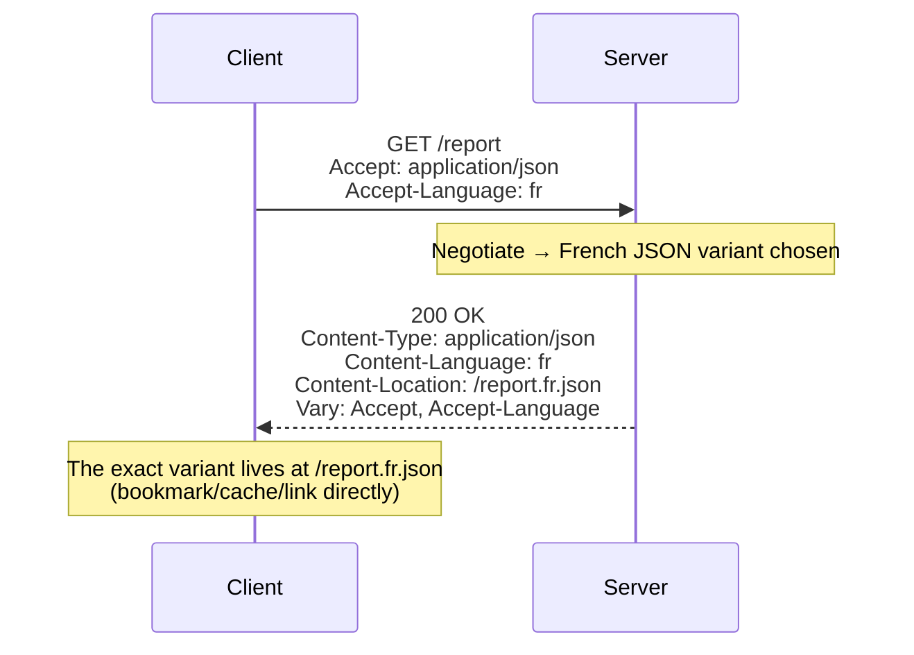
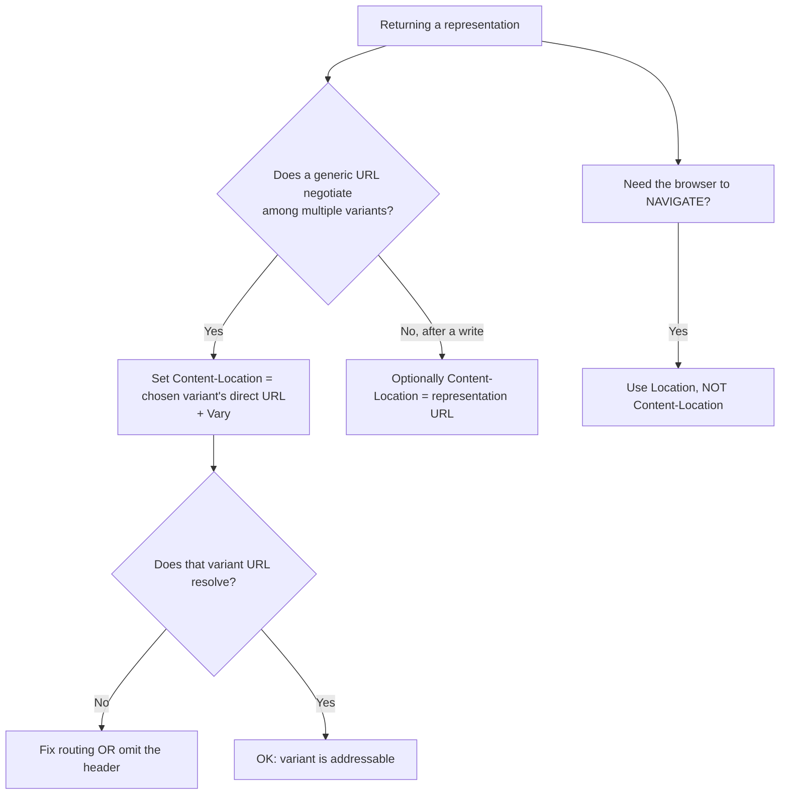

# Content-Location

## Quick Summary

`Content-Location` is a **response** header that gives the **specific URL of the representation returned in the body** — the concrete, direct address of *the exact variant* the server chose. It is easily confused with [`Location`](./Location.md), but they are fundamentally different: `Location` says "the resource is *elsewhere* — go there" (redirects, resource creation), while `Content-Location` says "the content I'm *giving you right now* also lives directly at this specific URL." Its primary use is with **content negotiation**: when a request to a generic URL like `/report` returns, say, the JSON French variant, `Content-Location: /report.fr.json` tells the client the direct address of that specific representation, so it can bookmark, cache, or re-request that exact variant without re-negotiating. It also appears after `PUT`/`POST` to indicate where the submitted/created representation can be found. It is *informational metadata* about the returned entity, not a navigation instruction — browsers do **not** redirect or change the address bar because of it.

## What problem does this header solve?

When a server uses **content negotiation**, a single "generic" URL (`/report`) transparently returns one of several representations (`/report.en.html`, `/report.fr.json`, `/report.pdf`) based on request headers like [`Accept`](../03-Request-Headers/Accept.md) and [`Accept-Language`](../03-Request-Headers/Accept-Language.md). This is convenient, but it hides a fact the client sometimes needs: **which specific variant did I actually get, and does it have its own stable address?** Without that, the client can't bookmark the exact PDF it received, can't link others directly to the French version, and can't cache the negotiated result under the variant's own key.

`Content-Location` solves this by disclosing the **direct URL of the chosen representation**. Now the client knows: "you asked `/report` and, based on your headers, here's `/report.fr.json` — you can fetch *that* URL directly next time to get this exact variant." It makes negotiated resources *addressable* at the variant level.

Secondarily, on writes (`PUT`/`POST`/`PATCH`), `Content-Location` can tell the client **where the representation described in the response body lives** — useful when the response echoes the created/updated resource so the client knows its canonical variant URL. This is subtly different from `Location` (which, on `201 Created`, points to the *newly created resource*).

## Why was it introduced?

`Content-Location` was introduced with HTTP/1.1 (RFC 2068, 1997; RFC 2616, 1999) as part of the **entity/representation metadata** system, specified today in **RFC 9110 §8.7 (2022)**. It exists because HTTP/1.1 formalized the *resource* vs *representation* distinction: a resource (identified by its request URI) can have multiple representations, and negotiation picks one. The spec needed a way for a response to say "the representation you're holding also has its *own* identifier" — enabling variant-level addressing, caching, and reference. RFC 9110 is careful to define its precise semantics (and to distinguish it from [`Location`](./Location.md)): `Content-Location` refers to the *representation in this message*, and when it differs from the request URI it indicates the representation is *also* accessible at that specific URL. The spec also notes the subtle case where `Content-Location` equals the effective request URI (the representation is the resource itself).

## How does it work?

The server sets `Content-Location` to the URL of the specific representation contained in the response body. It's purely informational — clients read it but the browser does not navigate.



- **Browser behavior:** The browser reads `Content-Location` as metadata but does **not** redirect, change the URL bar, or treat it like `Location`. JS can read it via `Response.headers` (subject to CORS exposure cross-origin). Historically browsers have been cautious about it (past ambiguities in older specs), so it's more useful to APIs/tooling than to end-user navigation.
- **Server behavior:** The origin sets it during negotiation (to the chosen variant's URL) or after writes (to the representation's URL). It should be consistent with [`Content-Type`](./Content-Type.md)/[`Content-Language`](./Content-Language.md).
- **Proxy behavior:** Forwards it untouched; it's representation metadata.
- **CDN behavior:** Passes it through; can be used alongside `Vary` to reason about variants.
- **Reverse proxy behavior:** Nginx passes the app's `Content-Location` through; you can set it via `add_header` for statically-mapped variants.

## HTTP Request Example

A negotiated request to a generic URL:

```http
GET /report HTTP/1.1
Host: api.example.com
Accept: application/json
Accept-Language: fr
```

## HTTP Response Example

Negotiation disclosing the chosen variant's direct URL:

```http
HTTP/1.1 200 OK
Content-Type: application/json
Content-Language: fr
Content-Location: /report.fr.json
Vary: Accept, Accept-Language
Cache-Control: public, max-age=300

{"titre":"Rapport"}
```

After a `PUT` that echoes the stored representation:

```http
HTTP/1.1 200 OK
Content-Type: application/json
Content-Location: /api/articles/42
ETag: "v9"

{"id":42,"title":"Updated"}
```

Contrast with [`Location`](./Location.md) on a `201 Created` (different meaning — points to the new resource, causes clients to know *where it was created*):

```http
HTTP/1.1 201 Created
Location: /api/articles/43
Content-Location: /api/articles/43
Content-Type: application/json

{"id":43,"title":"New"}
```

## Express.js Example

```js
const express = require('express');
const app = express();
app.use(express.json());

const VARIANTS = {
  'application/json': { ext: 'json', type: 'application/json' },
  'text/html': { ext: 'html', type: 'text/html; charset=utf-8' },
  'application/pdf': { ext: 'pdf', type: 'application/pdf' },
};

// 1) Content negotiation: return the chosen variant AND disclose its direct URL.
app.get('/report', (req, res) => {
  const accepted = req.accepts(Object.keys(VARIANTS)) || 'application/json';
  const lang = req.acceptsLanguages(['en', 'fr']) || 'en';
  const v = VARIANTS[accepted];

  // The specific variant's own stable URL:
  const variantUrl = `/report.${lang}.${v.ext}`;

  res.type(v.type);
  res.set('Content-Language', lang);
  res.set('Content-Location', variantUrl);   // "this exact variant lives here"
  res.vary('Accept, Accept-Language');
  res.send(renderReport(accepted, lang));
});

// 2) The variant URLs themselves resolve directly (so Content-Location is real).
app.get('/report.:lang.:ext', (req, res) => {
  res.type(req.params.ext).send(renderReport(mimeFor(req.params.ext), req.params.lang));
});

// 3) After a PUT, point to the canonical representation URL.
app.put('/api/articles/:id', (req, res) => {
  const updated = updateArticle(req.params.id, req.body);
  res.set('Content-Location', `/api/articles/${req.params.id}`); // where this representation lives
  res.set('ETag', `"${updated.version}"`);
  res.json(updated);
});

app.listen(3000);
```

Why each piece matters: in route 1, `Content-Location` gives the negotiated variant a **concrete, directly-fetchable address** — but that promise is only honest if route 2 actually serves those variant URLs. Setting `Content-Location: /report.fr.json` while no such URL resolves is misleading. The `res.vary(...)` line keeps caches from cross-serving variants. Note the difference from [`Location`](./Location.md): `Content-Location` here does **not** trigger any client redirect — it's metadata saying "by the way, this specific representation is also at this URL." In route 3, `Content-Location` clarifies that the JSON in the body corresponds to the canonical `/api/articles/42` representation.

## Node.js Example

Raw `http`:

```js
const http = require('http');

http.createServer((req, res) => {
  if (req.url === '/report') {
    const accept = req.headers['accept'] || '';
    const wantsJson = accept.includes('application/json');
    const ext = wantsJson ? 'json' : 'html';
    const type = wantsJson ? 'application/json' : 'text/html; charset=utf-8';

    res.setHeader('Content-Type', type);
    res.setHeader('Content-Location', `/report.en.${ext}`); // direct URL of this variant
    res.setHeader('Vary', 'Accept');
    return res.end(wantsJson ? '{"ok":true}' : '<p>ok</p>');
  }
  res.statusCode = 404;
  res.end();
}).listen(3000);
```

The point: after negotiation, disclose the chosen representation's concrete URL — and make sure that URL is actually resolvable.

## React Example

React apps rarely need `Content-Location`, but it's useful in a few cases:

1. **Deep-linking a negotiated variant.** If your API negotiates format/language at a generic URL, reading `Content-Location` lets your React app construct a *direct* shareable link to the exact variant the user is viewing:

```jsx
async function loadReport() {
  const res = await fetch('/report', { headers: { Accept: 'application/json' } });
  // The exact variant's direct URL (for "copy link", bookmarking, or caching key).
  const variantUrl = res.headers.get('content-location'); // e.g. "/report.en.json"
  const data = await res.json();
  return { data, shareUrl: variantUrl };
}
```

2. **Cross-origin caveat.** To read `Content-Location` from a cross-origin response, the server must send [`Access-Control-Expose-Headers: Content-Location`](../07-CORS/Access-Control-Expose-Headers.md).

3. **Don't confuse it with navigation.** `Content-Location` never causes navigation; if you want the browser to *go* somewhere, that's [`Location`](./Location.md) (redirect) handled by the browser, or client-side routing — not this header.

## Browser Lifecycle

1. A negotiated (or write) response includes `Content-Location`.
2. The browser reads it as **metadata** — it does **not** change the address bar, does **not** redirect, and does **not** treat it like `Location`.
3. JS may read it via `Response.headers` (cross-origin requires [CORS exposure](../07-CORS/Access-Control-Expose-Headers.md)).
4. It can inform caching/bookmarking of the specific variant (though browser cache keying is primarily by request URL + [`Vary`](../06-Caching-Headers/Vary.md)).
5. No user-visible navigation effect — purely informational.

## Production Use Cases

- **Content negotiation:** disclose the direct URL of the chosen format/language variant for bookmarking, sharing, and direct re-fetch.
- **REST APIs echoing representations:** after `PUT`/`PATCH`, indicate the canonical representation URL of the body.
- **Variant-level caching/linking:** let clients and tools reference the exact variant.
- **Report/export endpoints:** a generic `/export` returns the chosen format and points to `/export.csv`/`/export.xlsx`.
- **Data APIs with multiple serializations:** JSON/XML/CSV variants each addressable directly.

## Common Mistakes

- **Confusing it with [`Location`](./Location.md).** `Location` = "go here" (redirect/created resource, browser acts on it). `Content-Location` = "this content is also at here" (metadata, no navigation). Swapping them breaks redirects or misleads clients.
- **Pointing to a non-resolvable URL.** If `Content-Location: /report.fr.json` doesn't actually serve that variant, the header lies.
- **Expecting the browser to navigate.** It won't — `Content-Location` never redirects or changes the URL bar.
- **Omitting [`Vary`](../06-Caching-Headers/Vary.md).** With negotiation, still needed so caches don't cross-serve variants.
- **Inconsistent metadata.** `Content-Location` should agree with [`Content-Type`](./Content-Type.md)/[`Content-Language`](./Content-Language.md) of the body.
- **Relative vs absolute confusion.** It can be relative or absolute; ensure it resolves correctly against the request URL.
- **Overusing it.** For most simple, non-negotiated resources it adds nothing; use it where variant addressing genuinely helps.

## Security Considerations

- **Low risk; informational.** `Content-Location` mostly carries metadata and doesn't trigger navigation, so its attack surface is small.
- **Avoid leaking internal paths.** Don't expose internal/implementation URLs that reveal server structure or unintended endpoints.
- **Don't reflect untrusted input.** If you build `Content-Location` from request data, validate it to avoid pointing clients at attacker-influenced or invalid URLs (defense-in-depth; unlike `Location`, it won't redirect, but misleading links can still be abused in some flows).
- **Not an access-control signal.** It merely names a representation's URL; enforce authorization on that URL independently.
- **CORS exposure trade-off.** Exposing it cross-origin is generally safe but be deliberate about revealing variant URL structure.

## Performance Considerations

- **Negligible cost;** a single header.
- **Enables variant-direct fetching:** clients can bypass re-negotiation by fetching the specific variant URL, saving a negotiation round or improving cache hits on the variant.
- **Pairs with [`Vary`](../06-Caching-Headers/Vary.md):** together they make negotiated caching correct and variant-addressable.
- **No inherent caching effect of its own;** cache keying is still driven by request URL + `Vary`.

## Reverse Proxy Considerations

Nginx passes the app's `Content-Location` through; you can set it for statically-mapped variants:

```nginx
server {
  location = /report {
    proxy_pass http://app_upstream;   # app negotiates and sets Content-Location.
    # Ensure Vary and Content-Location from upstream are preserved.
  }

  location ~ ^/report\.(en|fr)\.(json|html)$ {
    root /var/www;                    # the concrete variant files that Content-Location points to.
  }
}
```

Key points: if your app advertises variant URLs via `Content-Location`, make sure the proxy actually serves those URLs (they must resolve). Preserve upstream `Content-Location`/`Vary`.

## CDN Considerations

- **Pass-through:** CDNs forward `Content-Location`.
- **Variant addressing:** the concrete variant URLs it points to can be cached directly, complementing negotiated caching at the generic URL (keyed by `Vary`).
- **Consistency:** ensure the variant URLs resolve at the edge too.
- **CORS:** if browsers need to read it cross-origin, ensure [`Access-Control-Expose-Headers: Content-Location`](../07-CORS/Access-Control-Expose-Headers.md) isn't stripped.

## Cloud Deployment Considerations

- **Object storage (S3/GCS):** variant files can be stored at their concrete keys and referenced via `Content-Location` from a negotiating endpoint.
- **API Gateways:** ensure `Content-Location` passes through; some may strip uncommon headers.
- **Serverless:** set it in the handler when negotiating or echoing representations; ensure the variant URLs are routed.
- **Managed platforms:** rarely special-cased; treat as normal response metadata.

## Debugging

- **Chrome DevTools → Network:** check `Content-Location` in Response Headers; confirm it's *not* causing navigation (it shouldn't).
- **curl (negotiation):** `curl -sD - -o /dev/null -H 'Accept: application/json' https://host/report | grep -i 'content-location\|vary'` → inspect the variant URL; then fetch that URL directly and confirm it resolves.
- **Postman / Bruno:** read `Content-Location` and verify the variant URL returns the same representation.
- **Contrast test:** confirm `Content-Location` does *not* behave like `Location` — a browser fetch should not redirect.
- **Node.js/Express:** log the `Content-Location` you set and verify the corresponding variant route exists.
- **CORS:** verify `Access-Control-Expose-Headers` if a browser app must read it.

## Best Practices

- [ ] Use `Content-Location` to disclose the **direct URL of the chosen representation** during negotiation.
- [ ] Ensure the URL it points to **actually resolves** to that variant.
- [ ] Keep it distinct from [`Location`](./Location.md) — it never triggers navigation.
- [ ] Pair negotiated responses with [`Vary`](../06-Caching-Headers/Vary.md) so caches don't cross-serve variants.
- [ ] Keep it consistent with [`Content-Type`](./Content-Type.md)/[`Content-Language`](./Content-Language.md).
- [ ] Don't leak internal/implementation URLs; validate any request-derived value.
- [ ] Expose it via [`Access-Control-Expose-Headers`](../07-CORS/Access-Control-Expose-Headers.md) if browser JS must read it cross-origin.
- [ ] Use it where variant addressing helps; skip it for simple non-negotiated resources.

## Related Headers

- [Location](./Location.md) — the *navigation* header (redirects/created resource); frequently confused with `Content-Location` but semantically opposite.
- [Content-Type](./Content-Type.md) / [Content-Language](./Content-Language.md) — describe the chosen representation's media type and language; `Content-Location` gives its URL.
- [Vary](../06-Caching-Headers/Vary.md) — keeps negotiated variants correctly cached.
- [Accept](../03-Request-Headers/Accept.md) / [Accept-Language](../03-Request-Headers/Accept-Language.md) — the request preferences that drive negotiation.
- [ETag](../06-Caching-Headers/ETag.md) — validator for the specific representation.
- [Access-Control-Expose-Headers](../07-CORS/Access-Control-Expose-Headers.md) — needed to read it cross-origin.
- [Content Negotiation Overview](../11-Content-Negotiation/Content-Negotiation-Overview.md) — the framing chapter.

## Decision Tree



## Mental Model

Think of `Content-Location` as the **"also available individually as item #F-207" sticker on a product you received from a *combo counter***. You walked up to a generic counter and asked for "the report, in French, as JSON" ([`Accept`](../03-Request-Headers/Accept.md)/[`Accept-Language`](../03-Request-Headers/Accept-Language.md)); the clerk handed you exactly that and stuck on a note: "FYI, this specific item is also stocked directly at aisle F-207" (`Content-Location: /report.fr.json`) — so next time you can grab it straight from the shelf without describing your preferences again. The crucial contrast is with a **"we've moved — new address inside" forwarding card** ([`Location`](./Location.md)): that card *sends you somewhere else* and you act on it, whereas the `Content-Location` sticker just *informs* you where the thing you're already holding can be found individually — you don't go anywhere, the address bar doesn't change, nothing redirects. And the sticker must be honest: if it says "aisle F-207" but that shelf is empty, it's a broken promise.
