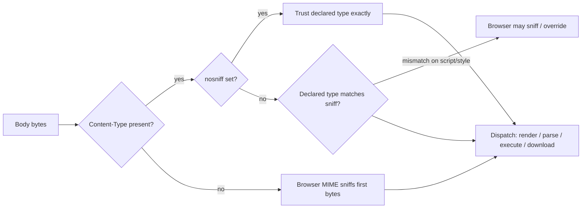
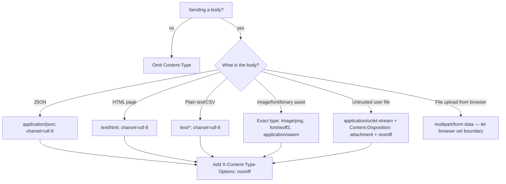

# Content-Type

## Quick Summary

`Content-Type` is the **representation header** that declares the media type (MIME type) of the message body — literally, "what kind of bytes are in this payload and how should you interpret them." It appears in both directions: on a request it describes the body you are uploading (`POST`/`PUT`/`PATCH`), on a response it describes the body the server is returning. It is the single most consequential header for how a browser handles a body: whether it renders HTML, parses JSON, executes a script, displays an image, or triggers a download. Its value has structure — a `type/subtype` plus optional parameters like `charset` and `boundary`. Get it wrong and you get anything from garbled mojibake to a stored-XSS vulnerability. It is set by the server (or your app framework) on responses, and by the client (fetch/axios/form) on requests. This is the **canonical page**; the [request-side Content-Type page](../03-Request-Headers/Content-Type.md) cross-links here.

## What problem does this header solve?

Bytes are ambiguous. The sequence `3C 68 74 6D 6C 3E` could be a fragment of an HTML document, a string field inside a JSON blob, a column in a CSV, or arbitrary binary that just happens to contain those octets. HTTP is a byte-transfer protocol; the body is an opaque octet stream. Without an out-of-band signal, the recipient has to *guess* how to decode and process it — and guessing is both unreliable and dangerous.

`Content-Type` is that out-of-band signal. It solves three concrete problems:

1. **Parsing/rendering dispatch.** The browser needs to decide: paint this as a page, hand it to the JSON parser, decode it as an image, or download it. `Content-Type` is the primary input to that decision.
2. **Character decoding.** Text is not bytes; it is bytes plus an encoding. `text/html; charset=utf-8` tells the decoder to turn the octets back into the right code points. Wrong charset → mojibake (`é` instead of `é`) or, worse, an encoding-based XSS bypass.
3. **Server-side body parsing.** On the request side, your framework's body parser (`express.json()`, `express.urlencoded()`, `multer`) only fires when the request `Content-Type` matches. A mismatch is the classic "my `req.body` is empty" bug.

The alternative — content sniffing (guessing from the bytes) — is exactly what browsers historically did and exactly what caused a decade of security holes. `Content-Type` plus [`X-Content-Type-Options: nosniff`](../05-Security-Headers/X-Content-Type-Options.md) is the fix.

## Why was it introduced?

The MIME (Multipurpose Internet Mail Extensions) type system predates HTTP. It was defined for email in **RFC 1341 (1992)** and **RFC 1521 (1993)** to let email carry more than 7-bit ASCII text — attachments, images, multiple encodings. HTTP borrowed the whole apparatus wholesale: when Tim Berners-Lee's team needed a way to say "this response is HTML vs. this response is a GIF," reusing MIME's `type/subtype` grammar was the obvious move. HTTP/1.0 (**RFC 1945, 1996**) formalized `Content-Type` using MIME media types, and it has carried through HTTP/1.1 (RFC 2616 → **RFC 7231** → **RFC 9110**) essentially unchanged.

The IANA Media Types registry is the authoritative list of registered types. The syntax is defined in **RFC 2045/2046** (the MIME grammar) and the HTTP-specific rules in **RFC 9110 §8.3**. The `charset` parameter and the tortured history of default charsets (see below) trace back to this email lineage — email was ASCII-first, and HTTP inherited the assumption that "text without a charset" defaults to `ISO-8859-1`, a default that modern specs have since walked back.

## How does it work?

A `Content-Type` value has this structure:

```
Content-Type: type "/" subtype *( ";" parameter )
                    │              │
                    │              └─ e.g. charset=utf-8, boundary=..., profile=...
                    └─ e.g. text/html, application/json, image/png, multipart/form-data
```

- **`type`** — the top-level category: `text`, `image`, `audio`, `video`, `application`, `font`, `multipart`, `message`, `model`.
- **`subtype`** — the specific format: `html`, `json`, `png`, `form-data`. May carry a **structured suffix** (`+json`, `+xml`, `+zip`) as in `application/vnd.api+json` or `image/svg+xml` — the suffix tells generic tooling the underlying serialization even for a vendor-specific type.
- **parameters** — `; charset=utf-8`, `; boundary=----WebKitFormBoundary...`, `; version=1`. Parameter names are case-insensitive; the media type itself is case-insensitive; parameter *values* may be case-sensitive.

**Browser behavior.** The browser reads `Content-Type` to choose a *decoder path*: navigate-and-render (`text/html`), execute (`text/javascript` for `<script>`), parse (JSON via `fetch().json()`), display inline (`image/*`, `application/pdf` with a viewer), or download (unknown/`application/octet-stream`, or any type combined with [`Content-Disposition: attachment`](./Content-Disposition.md)). It also reads the `charset` parameter to decode text. **Crucially**, absent `nosniff`, the browser may *override* the declared type by sniffing the first bytes — the source of many bugs. For subresources loaded via `<script>`, `<link rel=stylesheet>`, modules, and `fetch`, a wrong or missing `Content-Type` combined with `nosniff` causes the browser to **refuse** the resource (a blocked script/style).

**Server behavior.** The server (your app) is responsible for setting an accurate `Content-Type` on every response with a body. Static-file servers derive it from the file extension via a MIME map. App frameworks set it based on the API you call (`res.json()` → `application/json`, `res.send(string)` → `text/html`). On the request side, the server reads `Content-Type` to route the body to the correct parser; it should treat it as untrusted (a client can lie).

**Proxy behavior.** Forward proxies generally pass `Content-Type` through untouched — it is an end-to-end representation header, not hop-by-hop. A proxy must **not** alter it based on its own sniffing. Transforming proxies (rare, e.g. image-optimizing proxies) that change the body *must* update `Content-Type` to match, or they corrupt the contract.

**CDN behavior.** CDNs cache the response including its `Content-Type` and replay it verbatim. The subtlety: if the origin omits or mis-sets the type, the CDN caches the *wrong* type and serves it to everyone until the cache is purged. Some CDNs (Cloudflare, Fastly) can rewrite or add `Content-Type` at the edge, and many derive it from extension for static assets. Compression at the edge keys off `Content-Type` (only compress text-ish types).

**Reverse proxy behavior.** Nginx/Apache set `Content-Type` for static files from their `mime.types` map and pass through whatever an upstream app sets for proxied responses. A common misconfiguration: Nginx serving a `.js` or `.wasm` file with the wrong type because its `mime.types` is stale, breaking module loading or WebAssembly instantiation under `nosniff`.



## HTTP Request Example

A JSON API call — the client declares the body it is uploading:

```http
POST /api/users HTTP/1.1
Host: api.example.com
Content-Type: application/json; charset=utf-8
Content-Length: 48

{"name":"Ada Lovelace","role":"staff engineer"}
```

A traditional HTML form submission (note the different type — this is why `express.urlencoded()` exists):

```http
POST /login HTTP/1.1
Host: example.com
Content-Type: application/x-www-form-urlencoded
Content-Length: 29

username=ada&password=secret1

```

A file upload with `multipart/form-data` — the `boundary` parameter is mandatory and delimits parts:

```http
POST /upload HTTP/1.1
Host: example.com
Content-Type: multipart/form-data; boundary=----Boundary7MA4YWxkTrZu0gW

------Boundary7MA4YWxkTrZu0gW
Content-Disposition: form-data; name="avatar"; filename="me.png"
Content-Type: image/png

<binary png bytes>
------Boundary7MA4YWxkTrZu0gW--
```

## HTTP Response Example

```http
HTTP/1.1 200 OK
Content-Type: application/json; charset=utf-8
Content-Length: 27
X-Content-Type-Options: nosniff

{"id":42,"name":"Ada"}
```

An HTML page:

```http
HTTP/1.1 200 OK
Content-Type: text/html; charset=utf-8
Cache-Control: no-cache

<!doctype html><html>…</html>
```

A binary download, pairing `Content-Type` with [`Content-Disposition`](./Content-Disposition.md):

```http
HTTP/1.1 200 OK
Content-Type: application/octet-stream
Content-Disposition: attachment; filename="report.pdf"
X-Content-Type-Options: nosniff
```

## Express.js Example

```js
const express = require('express');
const app = express();

// --- Request side: Content-Type routes the body to the right parser ---

// express.json() ONLY runs when the request Content-Type matches its `type`
// option (default: application/json and *+json). If a client POSTs JSON but
// forgets the header, req.body is {} — the parser never fired. This is the
// #1 "empty body" bug.
app.use(express.json());              // parses application/json → req.body
app.use(express.urlencoded({ extended: true })); // parses form posts

// You can widen what json() accepts (e.g. a vendor type) via `type`:
app.use(express.json({ type: ['application/json', 'application/vnd.api+json'] }));

// --- Response side: set an accurate, explicit Content-Type ---

app.get('/api/user', (req, res) => {
  // res.json() sets Content-Type: application/json; charset=utf-8 for you AND
  // serializes with JSON.stringify. Prefer this over res.send(JSON.stringify)
  // because it guarantees the header and the body agree.
  res.json({ id: 42, name: 'Ada' });
});

app.get('/legacy', (req, res) => {
  // res.type() sets ONLY the Content-Type; it accepts a full type,
  // an extension, or a bare subtype. All three set text/html:
  res.type('html');                    // → text/html; charset derived
  res.type('.html');                   // → text/html
  res.type('text/html');               // → text/html
  res.send('<h1>hi</h1>');             // res.send(string) defaults to text/html
});

app.get('/download.csv', (req, res) => {
  // For a type Express doesn't know a charset for, set it explicitly so
  // spreadsheets and browsers decode UTF-8 (accented names) correctly.
  res.type('text/csv; charset=utf-8');
  res.attachment('export.csv');        // adds Content-Disposition: attachment
  res.send('name,role\nAda,engineer\n');
});

app.get('/logo.svg', (req, res) => {
  // SVG is XML that browsers will render — and can contain <script>. Serving
  // untrusted SVG as image/svg+xml on your own origin is an XSS vector.
  // For trusted assets, the correct type is image/svg+xml.
  res.type('image/svg+xml').sendFile(__dirname + '/logo.svg');
});

// Harden every response against MIME sniffing. Without this, a browser may
// re-interpret a text/plain body as HTML and execute injected markup.
app.use((req, res, next) => {
  res.setHeader('X-Content-Type-Options', 'nosniff');
  next();
});

app.listen(3000);
```

Why each line matters: removing `express.json()` breaks JSON body parsing silently; using `res.send(JSON.stringify(obj))` instead of `res.json()` risks a body/header mismatch (you'd send JSON with a `text/html` type); omitting `charset=utf-8` on CSV corrupts non-ASCII characters in Excel; dropping `nosniff` reopens the sniffing attack surface.

**The `res.send()` type-inference gotcha:** `res.send(anObject)` calls `res.json()`, but `res.send(aString)` defaults to `text/html`. So `res.send('{"ok":true}')` sends *JSON-looking text labeled as HTML* — a subtle bug. Always use `res.json()` for JSON.

## Node.js Example

Raw `http` module — nothing sets `Content-Type` for you; you own it entirely:

```js
const http = require('http');

const server = http.createServer((req, res) => {
  // Reading the request Content-Type (untrusted input from the client).
  const reqType = req.headers['content-type'] || '';
  const isJson = reqType.split(';')[0].trim() === 'application/json';

  if (req.method === 'POST' && isJson) {
    let raw = '';
    req.setEncoding('utf8');           // decode incoming bytes as UTF-8
    req.on('data', (chunk) => { raw += chunk; });
    req.on('end', () => {
      let body;
      try { body = JSON.parse(raw); }  // must parse manually — no framework
      catch { res.writeHead(400); return res.end('bad json'); }

      // Setting the response Content-Type explicitly. charset=utf-8 is REQUIRED
      // for correct decoding of non-ASCII; without it, browsers historically
      // assumed ISO-8859-1 for text/* and mangled multibyte characters.
      const payload = JSON.stringify({ received: body });
      res.writeHead(200, {
        'Content-Type': 'application/json; charset=utf-8',
        'Content-Length': Buffer.byteLength(payload), // byte count, not .length
        'X-Content-Type-Options': 'nosniff',
      });
      res.end(payload);
    });
  } else {
    res.writeHead(415, { 'Content-Type': 'text/plain; charset=utf-8' });
    res.end('Unsupported Media Type'); // correct status for wrong request type
  }
});

server.listen(3000);
```

Note `Buffer.byteLength()` for [`Content-Length`](./Content-Length.md) — string `.length` counts UTF-16 code units, not bytes, so any multibyte character would make the header lie. Also note the `415 Unsupported Media Type` status: that is the semantically correct response when the client's request `Content-Type` is not one you accept.

## React Example

React never sets response `Content-Type` — it runs in the browser and the server owns responses. React interacts with it on the **request** side (when it uploads) and by **reading** it (when it decides how to handle a response).

```jsx
import { useState } from 'react';

function UserForm() {
  const [status, setStatus] = useState('');

  async function submitJson() {
    const res = await fetch('/api/users', {
      method: 'POST',
      // You MUST set this request header or express.json() won't parse the body.
      headers: { 'Content-Type': 'application/json' },
      body: JSON.stringify({ name: 'Ada' }),
    });

    // Branch on the RESPONSE Content-Type so you parse correctly. Calling
    // res.json() on an HTML error page throws "Unexpected token <".
    const type = res.headers.get('content-type') || '';
    if (type.includes('application/json')) {
      setStatus(JSON.stringify(await res.json()));
    } else {
      setStatus(await res.text());  // e.g. a proxy's HTML 502 page
    }
  }

  async function uploadFile(file) {
    const form = new FormData();
    form.append('avatar', file);
    // DO NOT set Content-Type here. If you do, you overwrite the auto-generated
    // multipart boundary and the server can't parse the body. Let the browser
    // set "multipart/form-data; boundary=..." itself.
    await fetch('/upload', { method: 'POST', body: form });
  }

  return (
    <>
      <button onClick={submitJson}>Save</button>
      <input type="file" onChange={(e) => uploadFile(e.target.files[0])} />
      <pre>{status}</pre>
    </>
  );
}
```

The two load-bearing rules: (1) set `Content-Type: application/json` yourself for JSON bodies; (2) **never** set it manually for `FormData` — the browser must generate the `boundary`. Overriding it is a frequent "multipart parse failed" bug.

## Browser Lifecycle

1. **Receive headers.** The browser parses the response line and headers, extracting `Content-Type` before the body finishes arriving.
2. **Determine "sniffing" eligibility.** If [`X-Content-Type-Options: nosniff`](../05-Security-Headers/X-Content-Type-Options.md) is present, the declared type is authoritative and sniffing is disabled. Otherwise, for top-level navigations and some subresources, the browser may run its MIME Sniffing algorithm (WHATWG spec) over the first ~1445 bytes.
3. **Dispatch by type.** `text/html` → HTML parser + rendering pipeline; `application/json` → depends on context (fetch parses it; a navigation may show it in a JSON viewer or download it); `image/*` → image decoder; `text/css` → CSS parser (rejected if `nosniff` and type ≠ `text/css`); `text/javascript`/`application/javascript` → JS engine (rejected under `nosniff` if the type isn't a JS MIME type); unknown → download.
4. **Charset resolution.** For text types, the browser picks encoding by priority: BOM > `Content-Type; charset` > `<meta charset>` for HTML > heuristic/locale default. A `charset` in the header overrides an in-document `<meta>` for the transport layer's decode.
5. **Content-Disposition override.** If [`Content-Disposition: attachment`](./Content-Disposition.md) is present, the browser downloads regardless of a renderable `Content-Type`.
6. **CORS/CORB/ORB gate.** For cross-origin subresources, the type participates in Opaque Response Blocking (ORB, successor to CORB): an HTML/JSON/XML response requested as a script/image is blocked to prevent cross-site leaks.

## Production Use Cases

- **JSON APIs.** `application/json; charset=utf-8` on every API response; clients branch on it to parse safely.
- **Serving user-generated files.** Uploaded files served back with `application/octet-stream` + `Content-Disposition: attachment` + `nosniff` so a malicious `.html` upload can't run as HTML on your origin.
- **Static asset pipelines.** `.js` as `text/javascript`, `.mjs` as `text/javascript`, `.css` as `text/css`, `.wasm` as `application/wasm`, `.woff2` as `font/woff2`. Wrong types break module loading and WASM `instantiateStreaming` under `nosniff`.
- **PDFs and previews.** `application/pdf` with `Content-Disposition: inline` to preview in the browser's viewer, or `attachment` to force download.
- **Server-Sent Events.** `text/event-stream` is required or the `EventSource` API won't consume the stream.
- **Content negotiation.** Same URL returns `application/json` or `text/csv` based on the request [`Accept`](../03-Request-Headers/Accept.md) header; `Content-Type` reflects which representation was chosen (see [Content Negotiation Overview](../11-Content-Negotiation/Content-Negotiation-Overview.md)).

## Common Mistakes

- **Body/header mismatch.** Sending JSON bytes with `Content-Type: text/html` (via `res.send(JSON.stringify(...))`). Clients that trust the header break.
- **Omitting `charset` on text.** Non-ASCII becomes mojibake; historically also enabled UTF-7-based XSS.
- **Setting `Content-Type` for `FormData` in fetch.** Clobbers the auto-generated `boundary`; server can't parse multipart.
- **Serving untrusted uploads with their claimed type.** An attacker uploads `evil.html` claiming `text/html`; served on your origin, it executes as same-origin script. Serve as `octet-stream` + `attachment` + `nosniff`.
- **Wrong static-asset types.** `.js` served as `text/plain` → module script blocked under `nosniff`. `.svg` served as `text/plain` → not rendered.
- **Trusting the request `Content-Type` for security decisions.** It is client-controlled; validate the actual bytes for anything security-sensitive.
- **Vendor `+json` types skipping the parser.** `application/vnd.api+json` won't hit a naively configured `express.json()` unless you widen its `type` option (default already matches `*+json` in modern Express/body-parser, but older configs miss it).

## Security Considerations

`Content-Type` is a first-class security control, not a convenience.

- **MIME sniffing → XSS.** Without [`X-Content-Type-Options: nosniff`](../05-Security-Headers/X-Content-Type-Options.md), a browser may treat a `text/plain` (or missing-type) response containing `<script>` as HTML and execute it. Set `nosniff` globally.
- **Reflected/stored file XSS.** Serving user content as `text/html` or `image/svg+xml` on your origin runs attacker markup/JS in your security context. Mitigations: serve downloads as `application/octet-stream` + `Content-Disposition: attachment`; host user content on a separate, cookieless origin; add `nosniff` and a restrictive [`Content-Security-Policy`](../05-Security-Headers/Content-Security-Policy.md).
- **SVG is executable.** `image/svg+xml` can contain `<script>` and event handlers. Never serve untrusted SVG inline from a trusted origin; sanitize (DOMPurify with SVG profile) or serve as an attachment.
- **charset bypass.** `charset=utf-7` or omitted charset historically let attackers smuggle script past filters. Always pin `charset=utf-8`.
- **ORB/CORB.** Correct types let the browser block cross-site reads of sensitive JSON/HTML. Mislabeling sensitive JSON as `text/plain` can defeat this protection.
- **415 over 200.** Reject unexpected request types with `415`, don't best-effort parse them; lenient parsing enables smuggling and confused-deputy bugs.

## Performance Considerations

- **Compression gating.** Reverse proxies/CDNs decide whether to gzip/brotli based on `Content-Type` (compress `text/*`, `application/json`, `application/javascript`, `image/svg+xml`; skip already-compressed `image/png`, `application/zip`). A wrong type means you either compress incompressible data (wasted CPU) or leave compressible text uncompressed (wasted bytes). See [Content-Encoding](../10-Compression/Content-Encoding.md).
- **No inherent latency cost.** The header itself is a few bytes. The performance impact is entirely indirect — through compression decisions, caching (it's part of the cached representation and interacts with [`Vary`](../06-Caching-Headers/Vary.md) when you negotiate), and avoiding a sniffing pass.
- **`instantiateStreaming` and streaming parsers.** `application/wasm` enables streaming compilation; the wrong type forces the slower buffer-then-compile path.

## Reverse Proxy Considerations

Nginx derives static-file types from `mime.types` and passes through upstream types for proxied responses:

```nginx
http {
    include       mime.types;                 # maps extensions → types
    default_type  application/octet-stream;   # fallback for unknown extensions

    # Force correct types for assets the default map misses or gets wrong:
    types {
        application/wasm  wasm;
        font/woff2        woff2;
    }

    # Compress based on Content-Type. Must list every text-ish type you serve.
    gzip on;
    gzip_types text/plain text/css application/json application/javascript
               text/xml application/xml image/svg+xml;

    server {
        location /api/ {
            proxy_pass http://app_upstream;
            # Do NOT override upstream Content-Type here; let the app own it.
        }
    }
}
```

Pitfalls: a stale `mime.types` serving `.mjs`/`.wasm` as `application/octet-stream` (breaks modules/WASM under `nosniff`); `charset` handling via `charset utf-8;` + `charset_types` if you want Nginx to append the charset to text responses that lack it. Apache uses `AddType`/`AddCharset` in `mime.types`/`.htaccess` analogously.

## CDN Considerations

- CDNs cache and replay `Content-Type` verbatim; a wrong origin type is served to every edge user until purged.
- Cloudflare/Fastly can rewrite `Content-Type` at the edge (Transform Rules / VCL) — useful to fix a legacy origin, dangerous if it desyncs from the body.
- Edge compression (Cloudflare Brotli, Fastly gzip) keys off `Content-Type`; misclassified assets are silently left uncompressed.
- Some CDNs "guess" types for extensionless URLs; pin the type at the origin to avoid edge heuristics.
- If you negotiate content, set [`Vary`](../06-Caching-Headers/Vary.md) so the CDN keys separate cache entries per representation — otherwise it may serve JSON to a client that asked for CSV.

## Cloud Deployment Considerations

- **S3 / object storage.** The `Content-Type` is stored as object metadata at upload time. A common bug: uploading with the SDK's default `binary/octet-stream` so every asset downloads instead of rendering. Set `ContentType` explicitly on `PutObject`, and for static-website hosting rely on the extension map.
- **API Gateway (AWS).** Binary media types must be declared or the gateway base64-mangles bodies; the `Content-Type` and the gateway's `binaryMediaTypes` list must align. Lambda proxy integrations must return a correct `Content-Type` in the response object.
- **CloudFront / Cloud CDN.** Cache the type; override via response-headers policies / Lambda@Edge if the origin is wrong.
- **App platforms (Vercel/Netlify/Cloud Run).** Framework responses set the type; static files use the platform's MIME map. Configure headers rules for anything the map misses (e.g. `.wasm`).
- **Load balancers (ALB/NLB).** L4/L7 LBs pass `Content-Type` through unchanged; they don't sniff.

## Debugging

- **Chrome DevTools:** Network tab → select request → Headers → Response Headers shows `Content-Type`; the "Type" column shows how DevTools classified it. A body rendered as text when you expected JSON usually means a wrong type.
- **curl:** `curl -sI https://example.com/asset.js | grep -i content-type` (headers only via `-I`/`-sI`), or `curl -sv` to see the full exchange. Add `-H 'Accept: application/json'` to test negotiation.
- **Postman:** Response → Headers tab; Postman auto-pretty-prints based on the returned `Content-Type`.
- **Bruno:** Shows response headers and picks the body viewer from `Content-Type`; the raw view reveals mismatches.
- **Node.js:** `res.getHeader('content-type')` to inspect what you set; `req.headers['content-type']` to see what the client sent.
- **Express logging:** `morgan` with a custom token, or `app.use((req,res,next)=>{ res.on('finish',()=>console.log(res.getHeader('content-type'))); next(); })` to log the outgoing type per response.

## Best Practices

- Always set an explicit, accurate `Content-Type` on every response with a body.
- Pin `charset=utf-8` on all `text/*` and text-based `application/*` (JSON, XML) responses.
- Use `res.json()` for JSON; never hand-serialize into `res.send(string)`.
- Add [`X-Content-Type-Options: nosniff`](../05-Security-Headers/X-Content-Type-Options.md) globally.
- Serve untrusted user files as `application/octet-stream` + `Content-Disposition: attachment`, ideally from a separate origin.
- Never set `Content-Type` manually for `FormData`/multipart in fetch.
- Reject unexpected request types with `415`, don't guess.
- Keep your reverse-proxy/CDN MIME maps current (`.mjs`, `.wasm`, `.woff2`, `.avif`).
- Use the `+json`/`+xml` structured suffix for vendor types so generic tooling understands them.
- Set [`Vary`](../06-Caching-Headers/Vary.md) when the type depends on request negotiation.

## Related Headers

- [Content-Type (request)](../03-Request-Headers/Content-Type.md) — the request-side view; same header, describes the uploaded body.
- [X-Content-Type-Options](../05-Security-Headers/X-Content-Type-Options.md) — `nosniff` makes the declared type authoritative.
- [Content-Disposition](./Content-Disposition.md) — pairs with type to force inline vs. download.
- [Content-Length](./Content-Length.md) / [Content-Encoding](../10-Compression/Content-Encoding.md) / [Content-Language](./Content-Language.md) — sibling representation headers.
- [Accept](../03-Request-Headers/Accept.md) — the client's request for a particular type; drives negotiation.
- [Vary](../06-Caching-Headers/Vary.md) — cache-keys on the negotiated representation.
- [Content-Security-Policy](../05-Security-Headers/Content-Security-Policy.md) — defense-in-depth alongside correct types.

## Decision Tree



## Mental Model

**`Content-Type` is the label on a shipping container.** The bytes inside are identical black boxes until the label tells the recipient what's in them and how to open them: "perishable, keep at 4°C" (`charset`), "fragile glass" (`image/svg+xml` — handle carefully, it can bite), or "hazardous — do not open, forward to disposal" (`octet-stream` + `attachment`). MIME sniffing is the recipient prying the box open to guess the contents when the label is missing or ignored — occasionally helpful, frequently how someone gets hurt. `nosniff` is the rule "trust the label, never pry." And a container's label means the same thing whether it's going out or coming back — which is why `Content-Type` lives on both requests and responses.
