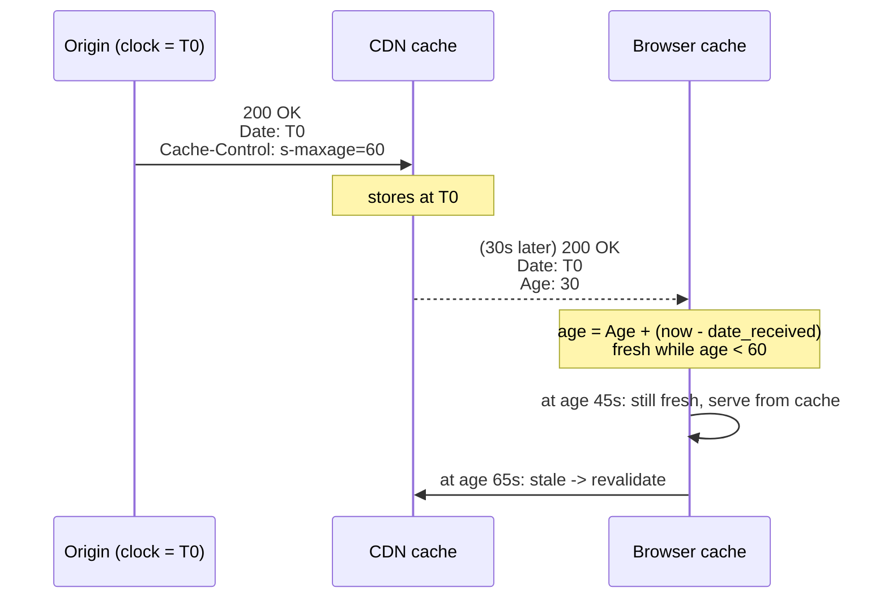
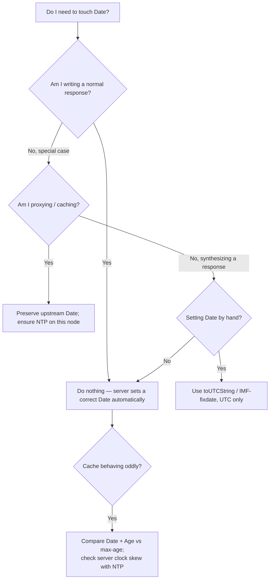

# Date

## Quick Summary

`Date` is a response header that records the instant the message was **originated** — the moment the origin server generated the response. It is set automatically by essentially every conforming HTTP server and is written in a fixed, machine-parseable timestamp format (IMF-fixdate, e.g. `Date: Tue, 07 Jul 2026 14:32:10 GMT`). It looks trivial, but it is quietly load-bearing for caching: `Date` is the reference clock against which a shared cache computes a response's [`Age`](../06-Caching-Headers/Age.md), and therefore whether the response is still fresh under [`Cache-Control`](../06-Caching-Headers/Cache-Control.md)'s `max-age`/`s-maxage`. When server and cache clocks disagree (clock skew), the age math goes wrong and caches serve content that is too stale or too fresh. This page covers the exact format, who sets it, how it drives freshness math, and why NTP-synced clocks are a caching correctness requirement, not just hygiene.

## What problem does this header solve?

Caching is fundamentally about time: "this response was fresh for 60 seconds — has that window elapsed?" To answer that, every cache in the path needs a common, unambiguous notion of *when the response was born*. Without an origination timestamp, a cache that receives a response can't compute how old it already is by the time it arrives, and a downstream cache can't account for time the response spent sitting in an upstream cache. `Date` provides that anchor: it stamps the response with the origin's wall-clock time at generation, so any cache can compute `age = now − Date` (corrected by the [`Age`](../06-Caching-Headers/Age.md) header) and compare it against the freshness lifetime.

It also solves a plain diagnostic problem: correlating events across a distributed system. When you see a response's `Date` alongside your logs, tracing spans, and CDN timestamps, you can reconstruct the true ordering of events even when the client's own clock is wrong.

## Why was it introduced?

`Date` has been part of HTTP since HTTP/1.0 (RFC 1945, 1996) and was formalized in HTTP/1.1 (RFC 2616, 1999; now RFC 9110 §6.6.1, 2022). Its primary motivation was the caching model: HTTP/1.0's freshness relied on the [`Expires`](../06-Caching-Headers/Expires.md) absolute date, and to compare "now" against an absolute expiry a cache needs to know the server's clock, because client and server clocks routinely disagree. `Date` gives the cache the server's clock at response time, so it can convert absolute `Expires` and relative `max-age` into a consistent age calculation relative to the *origin's* timeline rather than the (possibly wrong) local one.

The spec mandates the format tightly precisely because it is machine-consumed by caches: HTTP-date has exactly one preferred form (IMF-fixdate) and two obsolete forms parsers must still accept. The rigidity is deliberate — freshness math must never be ambiguous about what time a response claims to be from.

## How does it work?

`Date` carries an HTTP-date in **IMF-fixdate** format: `<day-name>, <day> <month> <year> <hour>:<minute>:<second> GMT`. It is always GMT/UTC (the literal string `GMT`), always fixed-width, and uses English day/month abbreviations:

```
Date: Tue, 07 Jul 2026 14:32:10 GMT
```

- **Browser behavior:** The browser reads `Date` mainly to seed cache freshness math when computing a stored response's age, and it tolerates a wrong local clock by using `Date` as the origin's reference. It does not display or otherwise act on `Date` for rendering. If `Date` is missing, the browser (a cache) may substitute its own reception time.
- **Server behavior:** The origin **must** generate a `Date` for responses (with narrow exceptions: a server without a reliable clock may omit it, and it is not sent on 1xx/some early responses). Node's `http` module and Express both set it automatically; you rarely set it by hand.
- **Proxy / reverse proxy behavior:** A proxy passes the origin's `Date` through unchanged — it is an end-to-end header describing origination, not the hop. A cache uses the received `Date` (plus `Age`) to compute how old the stored response is. If a proxy generates a response *itself* (an error page), it sets its own `Date`.
- **CDN behavior:** The CDN preserves the origin's `Date` on cached responses (that is the whole point — it must remember when the origin generated the content) and adds/updates [`Age`](../06-Caching-Headers/Age.md) to report how long it has been holding the response. On responses the CDN synthesizes, it stamps its own `Date`.

The core relationship — `Date` anchors the timeline, `Age` measures elapsed time in caches, `Cache-Control` sets the budget:



## HTTP Request Example

`Date` may legally appear on a request, but in practice clients almost never send it and servers ignore it — a client's clock is untrusted. A normal request carries no `Date`:

```http
GET /api/products/42 HTTP/1.1
Host: shop.example.com
Accept: application/json
```

## HTTP Response Example

The origin stamps origination time; a CDN forwards that same `Date` and adds `Age` to say how long it has held the copy:

```http
HTTP/1.1 200 OK
Date: Tue, 07 Jul 2026 14:32:10 GMT
Cache-Control: public, s-maxage=60
Age: 30
Content-Type: application/json
Content-Length: 184
```

Here the response was born at 14:32:10 GMT, has lived in caches for 30 seconds, and is fresh for another 30 (60 − 30). A browser receiving this at 14:32:45 computes age ≈ 35 and still serves it from cache.

## Express.js Example

Express (via Node's core `http` module) sets `Date` automatically on every response — you almost never touch it. The realistic production code is about *not breaking* it and understanding when to leave it alone.

```js
const express = require('express');
const app = express();

app.get('/api/products/:id', (req, res) => {
  // Express/Node has ALREADY queued a correct `Date` header for this response,
  // generated from the server's system clock at response time. You do not set it.
  res.set('Cache-Control', 'public, s-maxage=60'); // the freshness budget measured against Date.
  res.json({ id: req.params.id, name: 'Widget' });
  // On the wire this ships e.g. `Date: Tue, 07 Jul 2026 14:32:10 GMT` for free.
});

// Node lets you DISABLE the automatic Date (rarely a good idea):
const http = require('http');
const server = http.createServer(app);
server.sendDate = true; // default true. Setting false omits Date -> breaks age math downstream.

// If you ever set Date manually, it MUST be IMF-fixdate/UTC. Date.prototype
// .toUTCString() produces exactly that format:
app.get('/custom', (req, res) => {
  res.set('Date', new Date().toUTCString()); // e.g. "Tue, 07 Jul 2026 14:32:10 GMT"
  res.send('ok');
  // Never send a local-timezone or ISO-8601 string here: caches parse IMF-fixdate.
  // `new Date().toISOString()` (2026-07-07T14:32:10.000Z) is WRONG for this header.
});

app.listen(3000);
```

Key points: you get a correct `Date` for free, so the production discipline is (1) don't set `server.sendDate = false`, which would strip it and blind downstream caches' age math, and (2) if you ever do set it, use `toUTCString()` (IMF-fixdate) — never `toISOString()`, which caches cannot parse as an HTTP-date.

## Node.js Example

Raw Node behaves identically because Express delegates to it. The instructive detail is the `sendDate` toggle and manual override:

```js
const http = require('http');

const server = http.createServer((req, res) => {
  // Node auto-adds Date unless server.sendDate === false.
  res.writeHead(200, { 'Content-Type': 'text/plain' });
  res.end('ok');
});

// server.sendDate defaults to true. Only turn it off if a downstream tier
// authoritatively re-stamps Date; otherwise caches lose their age reference.
server.sendDate = true;

server.listen(3000);
```

The contrast with Express is nil — both rely on Node core, which is the layer that owns the automatic `Date`. What changes downstream is whether a proxy/CDN preserves it (they do) versus regenerates it on synthesized responses.

## React Example

React never sets or reads `Date`. It is client-side code with no access to write response headers, and no React feature depends on the value. The indirect relationship is entirely through the browser's HTTP cache: when React `fetch`es data, the browser uses the response's `Date` (with [`Age`](../06-Caching-Headers/Age.md)) to decide whether a cached copy is still fresh under [`Cache-Control`](../06-Caching-Headers/Cache-Control.md) — a decision that happens beneath `fetch`, invisibly to React. In SSR (Next.js), the Node server rendering React emits `Date` automatically like any Node server. The only time a frontend engineer consciously looks at `Date` is in DevTools, to sanity-check why a response is or isn't being served from cache (comparing `Date` + `Age` against `max-age`).

## Browser Lifecycle

1. **Response received.** The browser records the local time of reception and reads the response's `Date` header.
2. **Age computation.** For a cacheable response, it computes the initial age using the algorithm in RFC 9111: roughly `age = max(Age header, now − Date) + time-since-received`. `Date` is the origin anchor; `Age` accounts for time spent in upstream caches; the local clock covers time since it arrived.
3. **Freshness check.** It compares that age against the freshness lifetime derived from `max-age`/`s-maxage`/`Expires`. Fresh → serve from cache; stale → revalidate. `Date` is a direct input here.
4. **Clock-skew tolerance.** Because age is anchored to the server's `Date` rather than the client's clock, a mildly wrong client clock does not by itself corrupt freshness — the calculation is relative to the origin's timeline.
5. **No rendering effect.** `Date` never influences parsing, layout, or JS execution. It is purely a caching/diagnostic input.

## Production Use Cases

- **Cache age math.** The foundational use: shared caches and browsers compute [`Age`](../06-Caching-Headers/Age.md) relative to `Date` to enforce [`Cache-Control`](../06-Caching-Headers/Cache-Control.md) freshness. Every CDN hit/miss decision leans on it.
- **Detecting clock skew.** Comparing a response's `Date` to your own synced clock reveals whether a server's clock has drifted — a fast, dependency-free health check. A server whose `Date` is minutes off is mis-computing freshness for everyone.
- **Distributed-trace correlation.** `Date` is a coarse, universally present timestamp for lining up an HTTP exchange against logs and traces when finer instrumentation is missing.
- **Conditional-request fallback reasoning.** Together with [`Last-Modified`](../06-Caching-Headers/Cache-Control.md), `Date` bounds heuristic-freshness calculations for responses without explicit `max-age`.

## Common Mistakes

- **Sending a non-IMF-fixdate value.** Writing `Date` with `toISOString()`, a local timezone, or a Unix epoch. Caches parse HTTP-date; a malformed value is treated as invalid and age math falls back to reception time, silently degrading caching. Always use `toUTCString()`.
- **Disabling `sendDate`.** Turning off Node's automatic `Date` (or a proxy stripping it) removes the age reference; downstream caches then treat the response as freshly received on every hop, over-caching stale content.
- **Ignoring clock skew.** Running servers without NTP so their clocks drift. A server 5 minutes fast makes every response appear 5 minutes "younger" to a cache that trusts its own clock less, or 5 minutes "older" the other way — either serving stale content or evicting fresh content early.
- **Confusing `Date` with `Last-Modified`.** `Date` is when *this response message* was generated; `Last-Modified` is when the *resource content* last changed. They usually differ; conflating them corrupts conditional-request logic.
- **Assuming millisecond precision.** HTTP-date is second-resolution. Do not rely on `Date` for sub-second ordering.

## Security Considerations

- **Clock-skew as a caching-correctness (and mild security) issue.** Grossly wrong clocks can make a cache serve content past its intended lifetime, which for authenticated or rapidly-changing data edges into a correctness/exposure concern — a stale response held too long may show data the user should no longer see.
- **Not a secret, but a leak of clock state.** `Date` reveals the server's wall clock. This is essentially harmless, though in exotic cases a badly-off clock can weaken time-dependent protocols (e.g., token/nonce validity windows) that share the same skewed clock.
- **Cross-check for replay/expiry logic.** Systems that validate signed URLs or JWTs against `exp`/`iat` depend on synced clocks; the same NTP discipline that keeps `Date` honest keeps those validations correct. Skew that shows up in `Date` is a red flag for the whole time-dependent security surface.
- **No injection surface.** `Date` is server-generated from the system clock, not reflected from client input, so it is not a header-injection vector.

## Performance Considerations

`Date` is ~35 bytes on every response. On HTTP/1.1 it is sent per response uncompressed; on HTTP/2/3 it changes every second so it is a poor candidate for static HPACK/QPACK indexing (its value is never stable long enough to reuse), making it one of the few headers that genuinely costs a small amount of header bytes per response. That cost is trivial and non-negotiable — you cannot drop `Date` without breaking caching. The real performance angle is indirect and large: a correct `Date` (plus synced clocks) is what lets CDNs and browsers make correct freshness decisions, which is the difference between a cache hit at edge latency and a full origin round-trip. Clock skew that corrupts age math manifests as either wasteful early revalidations (extra RTTs) or over-long caching (stale content) — both performance/correctness regressions traceable to `Date`.

## Reverse Proxy Considerations

Nginx sets `Date` on responses it generates and passes the origin's `Date` through on proxied responses. The key operational concern is clock synchronization and not accidentally stripping it.

```nginx
server {
  location /api/ {
    proxy_pass http://app_upstream;

    # Nginx forwards the upstream's Date untouched (end-to-end header).
    # It also computes cache age relative to that Date for proxy_cache.
    proxy_cache app_cache;
    proxy_cache_valid 200 60s;   # freshness enforced using the response's Date/Age.

    add_header X-Cache-Status $upstream_cache_status;  # HIT/MISS, for verifying age math.
  }
}
```

Operationally, the non-config requirement dominates: **run NTP (chrony/systemd-timesyncd) on every origin and cache node**. Nginx's `proxy_cache` age calculation, like every cache's, trusts the `Date`/`Age` timeline; if the origin's clock and the Nginx node's clock disagree, cached objects expire early or late. There is no Nginx directive that fixes clock skew — the fix is time synchronization at the OS level. Avoid `proxy_hide_header Date` or `more_clear_headers Date` unless you have a very deliberate reason.

## CDN Considerations

- **`Date` is preserved, `Age` is added.** A CDN must keep the origin's `Date` on cached objects so downstream tiers know true origination time, and it stamps/updates [`Age`](../06-Caching-Headers/Age.md) to report edge dwell time. Debug caching by reading both together (`age = Age + local dwell`, checked against `s-maxage`).
- **CDN clocks are NTP-synced by the provider** — you don't manage them, but a skewed *origin* clock still poisons the math the CDN performs, so origin NTP remains your responsibility.
- **Synthesized responses get the CDN's `Date`.** Edge error pages, redirects, and challenge pages carry the CDN node's `Date`, not the origin's.
- **Watch `Date` vs `Age` consistency.** If a CDN shows an `Age` that, added to `Date`, exceeds "now," you are looking at clock skew between origin and edge — a real, debuggable signal.

## Cloud Deployment Considerations

- **Clock sync is table stakes.** Cloud VMs/containers should use the platform time service (AWS Time Sync, GCP metadata NTP, Azure host time). Containers inherit the host clock, so the host must be synced. Skew here silently corrupts every cache tier's age math and any JWT/signed-URL expiry.
- **Load balancers** pass `Date` through and stamp their own on self-generated errors (e.g., an ALB 502). Seeing an LB-generated `Date` during an incident helps confirm the response came from the LB, not the origin.
- **API gateways** with response caching (AWS API Gateway) use `Date`/`Cache-Control` to age cached entries; a skewed gateway clock mis-ages them.
- **Serverless (Lambda, Cloud Functions):** the runtime's `Date` comes from the managed host clock, which the provider keeps synced — one less thing to manage, but the freshness implications are identical.

## Debugging

- **Chrome DevTools → Network → Headers → Response Headers:** read `Date` and `Age`. If a response is unexpectedly served from cache (or not), check `Date + Age` against `max-age` to see the freshness math.
- **curl:** `curl -sI https://shop.example.com | grep -i '^date:'` prints the server's `Date`. Compare against your synced clock (`date -u`) to spot skew in one line.
- **Skew check one-liner:** `curl -sI <url> | grep -i date` next to `date -u` — a difference of more than a couple seconds means the origin clock is drifting.
- **Postman / Bruno:** the response Headers tab shows `Date`; in Bruno you can assert freshness in a test script by parsing `res.headers.date` and `res.headers.age`.
- **Node.js:** inspect `res.getHeaders().date` before `res.end()` to confirm the auto-generated value; check `server.sendDate` if `Date` is unexpectedly absent.
- **Express logging:** `app.use((req,res,next)=>{res.on('finish',()=>console.log(res.getHeader('date'), res.getHeader('age')));next();})` to watch origination time vs reported age per response.

## Best Practices

- [ ] Let the server set `Date` automatically — do not hand-roll it.
- [ ] Never disable Node's `server.sendDate` unless a downstream tier authoritatively re-stamps it.
- [ ] If you must set `Date` manually, use IMF-fixdate via `new Date().toUTCString()`, never `toISOString()`.
- [ ] Run NTP (chrony/systemd-timesyncd/cloud time service) on every origin and cache node — clock skew is a caching-correctness bug.
- [ ] Monitor origin clock skew (compare `Date` against a trusted clock) as part of health checks.
- [ ] Do not strip `Date` at proxies/CDNs — downstream age math depends on it.
- [ ] When debugging cache freshness, always read `Date` and [`Age`](../06-Caching-Headers/Age.md) together.
- [ ] Distinguish `Date` (message origination) from `Last-Modified` (content change) in conditional-request logic.

## Related Headers

- [Age](../06-Caching-Headers/Age.md) — measures how long a response has sat in shared caches; combined with `Date` it yields the response's total age for freshness checks.
- [Cache-Control](../06-Caching-Headers/Cache-Control.md) — sets the freshness budget (`max-age`/`s-maxage`) that age (computed from `Date`) is compared against.
- [Expires](../06-Caching-Headers/Expires.md) — the legacy absolute-date freshness signal; caches convert it relative to `Date` to handle clock differences.
- [Last-Modified](../06-Caching-Headers/Cache-Control.md) — often confused with `Date`, but describes when the *content* changed, not when the *response* was generated.
- [Retry-After](./Retry-After.md) — another time-bearing response header; its HTTP-date form uses the same IMF-fixdate format as `Date`.

## Decision Tree



## Mental Model

Think of `Date` as the **"packed on" date printed on a carton of milk at the dairy (the origin)**. Every fridge along the way (CDN, proxy, browser cache) reads that packed-on date, adds how long the carton has already been in transit and on shelves (the [`Age`](../06-Caching-Headers/Age.md) sticker), and compares the total against the "best before N days" rule ([`Cache-Control: max-age`](../06-Caching-Headers/Cache-Control.md)) to decide whether to sell it or pull it. The whole system only works if every fridge and the dairy agree on what time it is — if the dairy's clock is set five minutes fast (clock skew), it prints a packed-on date in the future, and fridges either dump perfectly good milk early or keep spoiled milk too long. That is why NTP-synced clocks aren't hygiene; they are what makes the "best before" system tell the truth.
