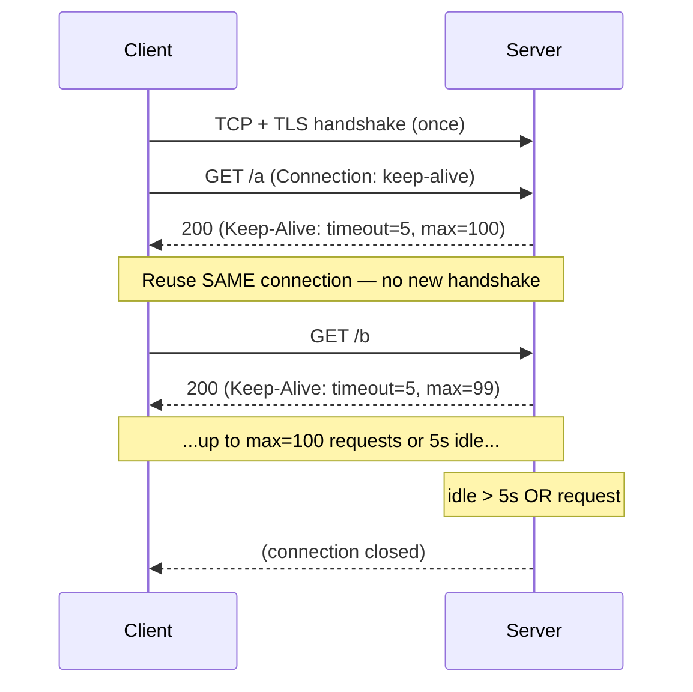

# Keep-Alive

## Quick Summary

`Keep-Alive` is a **hop-by-hop** header (appearing on both requests and responses) that fine-tunes the parameters of an HTTP/1.1 **persistent connection** — specifically `timeout` (how many seconds an idle connection may stay open before being closed) and `max` (how many more requests may be sent on this connection) — e.g. `Keep-Alive: timeout=5, max=100`. It is a companion to the [`Connection`](../03-Request-Headers/Connection.md) header: in HTTP/1.1, persistent connections are the *default*, and `Connection: keep-alive` (or its absence) signals the intent to reuse the connection, while `Keep-Alive` communicates the *tuning parameters* for that reuse. It exists to avoid the enormous cost of tearing down and re-establishing a TCP (and TLS) connection for every request. It is strictly a **hop-by-hop** header — it applies only to the single connection between two adjacent nodes (client↔proxy, proxy↔origin) and must be stripped/regenerated at each hop, never forwarded end-to-end. Critically, **`Keep-Alive` does not exist in HTTP/2 or HTTP/3** — those protocols manage connection lifetime and multiplexing at the protocol layer, and sending `Keep-Alive` (or `Connection`) there is a protocol error.

## What problem does this header solve?

Establishing a connection is expensive. Each new HTTP/1.1 request over a fresh connection pays for a **TCP handshake** (a round-trip) and, for HTTPS, a **TLS handshake** (one or two more round-trips plus asymmetric crypto). On a page that loads dozens of resources, opening a brand-new connection per request would add seconds of latency and heavy CPU/socket churn on the server. This was the reality of HTTP/1.0, where connections closed after each response by default.

**Persistent connections** solve the core problem: keep the TCP/TLS connection open and reuse it for many requests, amortizing the handshake cost across all of them. But persistence needs *governance*: how long should an idle connection linger (holding a server socket) before it's closed? How many requests should one connection serve before being recycled (to balance load, free resources, or apply new TLS parameters)? `Keep-Alive` answers exactly these tuning questions — `timeout` bounds idle lifetime, `max` bounds request count — letting each side communicate and coordinate connection-reuse limits so connections are reused *efficiently* without being held open wastefully or overloaded indefinitely.

## Why was it introduced?

Persistent connections began as an *extension* to HTTP/1.0 (the informal `Connection: keep-alive` convention, with a `Keep-Alive` header carrying parameters) to escape HTTP/1.0's one-request-per-connection default. **HTTP/1.1 (RFC 2068, 1997; RFC 2616, 1999)** then made persistent connections the *default* behavior — you had to opt *out* with `Connection: close`. The `Keep-Alive` header (documented informally and later described in RFC 2068's era) carried the `timeout`/`max` tuning. Modern HTTP (RFC 9112, 2022) treats HTTP/1.1 persistence as default and keeps `Connection` as the control header; `Keep-Alive`'s parameter role persists in practice for servers/proxies to advertise their idle-timeout and request-count limits. Its existence is entirely a product of the TCP/TLS-handshake cost problem — and its **absence** in HTTP/2/3 reflects that those protocols solved connection efficiency far more thoroughly (a single long-lived connection multiplexing many concurrent streams), making per-connection keep-alive tuning obsolete.

## How does it work?

On an HTTP/1.1 connection, once persistence is in effect (default, or explicit [`Connection: keep-alive`](../03-Request-Headers/Connection.md)), a server may include `Keep-Alive: timeout=N, max=M` to advertise its reuse limits. The client and server then reuse the same connection for subsequent requests until an idle `timeout` elapses or `max` requests are reached, after which the connection is closed.



- **Browser behavior:** Browsers reuse HTTP/1.1 connections automatically and maintain a pool per origin; they respect the server's close signals. Browsers don't expose `Keep-Alive` tuning to page JS. On HTTP/2/3, connection reuse/multiplexing is handled by the protocol, not this header.
- **Server behavior:** The origin advertises its idle `timeout` and per-connection request `max`, and closes connections that exceed them. These are tuning/resource-management knobs.
- **Proxy behavior:** As a **hop-by-hop** header, a proxy must **not forward** `Keep-Alive` (or `Connection`) to the next hop; it manages each hop's persistence independently and may regenerate the header for its own connections.
- **CDN behavior:** CDNs keep persistent (and often pooled/reused) connections to origins and to clients independently, tuning keep-alive per hop; client↔CDN is frequently HTTP/2/3 (no `Keep-Alive`), while CDN↔origin may be HTTP/1.1.
- **Reverse proxy behavior:** Nginx manages upstream keep-alive via the `keepalive` directive in `upstream {}` and client keep-alive via `keepalive_timeout`/`keepalive_requests`; it strips hop-by-hop headers appropriately.

## HTTP Request Example

An HTTP/1.1 request opting into persistence (usually implicit in 1.1):

```http
GET /a HTTP/1.1
Host: www.example.com
Connection: keep-alive
```

## HTTP Response Example

A response advertising keep-alive limits:

```http
HTTP/1.1 200 OK
Content-Type: text/html; charset=utf-8
Connection: keep-alive
Keep-Alive: timeout=5, max=100
Content-Length: 1234
```

Closing the connection (opting out of further reuse):

```http
HTTP/1.1 200 OK
Content-Type: text/html; charset=utf-8
Connection: close
Content-Length: 1234
```

In **HTTP/2** there is no `Keep-Alive`/`Connection` — the response simply uses the multiplexed connection:

```http
:status: 200
content-type: text/html; charset=utf-8
content-length: 1234
```

## Express.js Example

Node's HTTP server handles keep-alive automatically; you tune it via server settings rather than per-response headers. Setting `Keep-Alive`/`Connection` by hand is usually unnecessary and can be counterproductive:

```js
const express = require('express');
const http = require('http');
const app = express();

app.get('/', (req, res) => res.send('ok')); // persistence is automatic in HTTP/1.1

const server = http.createServer(app);

// 1) Tune keep-alive at the SERVER level (not per response).
//    keepAliveTimeout: how long an idle socket stays open (ms). Node default ~5s.
server.keepAliveTimeout = 65_000;   // e.g. 65s — often set ABOVE the LB idle timeout.
//    headersTimeout must be >= keepAliveTimeout to avoid race conditions on reused sockets.
server.headersTimeout = 66_000;
//    maxRequestsPerSocket caps requests per connection (like Keep-Alive max). 0 = unlimited.
server.maxRequestsPerSocket = 0;

server.listen(3000);

// 2) Rarely: force-close a specific connection (e.g. after a sensitive op or on error).
app.get('/logout', (req, res) => {
  res.set('Connection', 'close');   // signal no reuse of THIS connection.
  res.send('bye');
});
```

Why each piece matters: keep-alive is a **connection/transport** concern, so you tune it on the `http.Server` (`keepAliveTimeout`, `headersTimeout`, `maxRequestsPerSocket`), not by emitting `Keep-Alive` headers in route handlers — Node manages the wire header for you. The most important production detail is the **LB-timeout race**: if your server's `keepAliveTimeout` is *shorter* than the load balancer's idle timeout, the server can close a pooled connection just as the LB sends another request on it, causing sporadic `502`s — the fix (seen widely with AWS ALB) is to set the server's keep-alive *higher* than the LB's (e.g. server 65s vs ALB 60s), and keep `headersTimeout > keepAliveTimeout`. Hand-setting `Keep-Alive: timeout=...` in a handler doesn't change Node's actual socket behavior — the server settings do.

## Node.js Example

Raw `http`, plus a keep-alive-enabled *client* (agent):

```js
const http = require('http');

// Server: tune persistence at the server object.
const server = http.createServer((req, res) => {
  res.writeHead(200, { 'Content-Type': 'text/plain' });
  res.end('ok');
});
server.keepAliveTimeout = 65_000;
server.headersTimeout = 66_000;
server.listen(3000);

// Client: reuse connections via a keep-alive Agent (huge win for many requests).
const agent = new http.Agent({
  keepAlive: true,          // reuse sockets instead of a new handshake per request.
  maxSockets: 50,           // pool size per host.
  keepAliveMsecs: 1000,     // initial delay for TCP keep-alive probes.
});

function call(path) {
  return new Promise((resolve) => {
    http.get({ host: 'localhost', port: 3000, path, agent }, (res) => {
      res.resume();
      res.on('end', resolve);
    });
  });
}
// Firing many calls now reuses pooled connections — no per-request TCP/TLS setup.
```

The lesson: on the **client** side, a keep-alive `Agent` (or `undici`/`fetch` with a pool) is what actually delivers connection reuse; on the **server** side, the `http.Server` timeouts govern how long connections live.

## React Example

React never sets `Keep-Alive` — it's a transport-layer header the browser manages entirely. The relationship is purely about *performance you get for free*:

1. **Connection reuse speeds up your app automatically.** When a React app fires many `fetch`/`axios` calls to the same origin, the browser reuses persistent connections (HTTP/1.1 keep-alive, or HTTP/2/3 multiplexing) — you don't manage this, but it's why a burst of API calls doesn't pay a handshake each time.

2. **HTTP/2/3 makes it moot.** Most production React apps are served over HTTP/2 or HTTP/3, where `Keep-Alive` doesn't exist — the browser opens one connection per origin and multiplexes all requests over it, eliminating HTTP/1.1's connection-count limits (the old "6 connections per host" bottleneck). This is a bigger win than keep-alive tuning ever was.

3. **You don't and can't set it in fetch.** `Connection`/`Keep-Alive` are [forbidden headers](../02-Core-Concepts/Forbidden-and-Restricted-Headers.md) — the browser controls the connection. (Note: the `fetch` `keepalive: true` *option* is unrelated — it lets a request outlive page unload, e.g. for analytics beacons, and is not this header.)

## Browser Lifecycle

1. The browser opens a TCP/TLS connection to an origin and, in HTTP/1.1, keeps it in a per-origin pool for reuse.
2. It reuses pooled connections for subsequent same-origin requests, avoiding new handshakes, honoring the server's `Keep-Alive: timeout`/`max` and any `Connection: close`.
3. On idle timeout, reaching `max`, or `Connection: close`, the connection is closed and removed from the pool.
4. Under HTTP/2/3, the browser uses a single multiplexed connection per origin — no `Keep-Alive` header, connection lifetime managed by the protocol (PING frames, GOAWAY, etc.).
5. Page JS never sees or controls this; the `fetch` `keepalive` option is a separate feature.

## Production Use Cases

- **Reducing latency and CPU** by reusing TCP/TLS connections across a page's/app's many requests.
- **Server/proxy resource tuning:** `timeout`/`max` (and server-level equivalents) to balance socket reuse vs resource holding.
- **Upstream connection pooling:** reverse proxies/CDNs pooling keep-alive connections to origins for throughput.
- **Avoiding LB↔server keep-alive races** (setting server keep-alive above the LB idle timeout to prevent `502`s).
- **HTTP client pooling:** Node/services using keep-alive agents to call downstream APIs efficiently.
- **Graceful connection recycling:** capping requests per connection to rotate TLS sessions or rebalance.

## Common Mistakes

- **Setting `Keep-Alive`/`Connection` in HTTP/2/3.** They don't exist there — it's a protocol error. Don't copy HTTP/1.1 habits into h2/h3 code.
- **Forwarding it through a proxy.** It's **hop-by-hop**; forwarding `Keep-Alive`/`Connection` end-to-end is a bug (and a smuggling-adjacent hazard).
- **Server keep-alive shorter than the LB idle timeout.** Causes intermittent `502`s (the LB reuses a socket the server just closed). Set server keep-alive *higher* (e.g. Node 65s vs ALB 60s).
- **`headersTimeout <= keepAliveTimeout` in Node.** Can cause premature socket errors on reused connections; keep `headersTimeout` slightly larger.
- **Hand-setting `Keep-Alive` headers expecting behavior change.** In Node, the *server settings* govern socket lifetime, not a header you write in a handler.
- **Not using a keep-alive agent on the client.** Node HTTP clients without `keepAlive: true` pay a handshake per request to downstreams.
- **Confusing it with the `fetch` `keepalive` option.** Different feature (request survives page unload), not this header.

## Security Considerations

- **Slowloris / connection-exhaustion DoS.** Persistent connections held open by slow/malicious clients can exhaust server sockets. Enforce sane `keepAliveTimeout`, request-count caps, header/body read timeouts, and connection limits; front with a hardened proxy/CDN.
- **Hop-by-hop hygiene.** `Keep-Alive`/`Connection` must be stripped per hop; mishandling hop-by-hop headers is part of the broader request-smuggling threat surface (a hostile client can try to smuggle hop-by-hop directives). Use conformant proxies.
- **Resource fairness.** Unlimited `max` or very long timeouts can let a few clients monopolize connections; tune to your capacity.
- **TLS session considerations.** Recycling connections (`max`) periodically can be part of key/session hygiene, though modern TLS handles this well.
- **Prefer HTTP/2/3** where possible — its connection model is both faster and avoids several HTTP/1.1 keep-alive foot-guns.

## Performance Considerations

- **The core win: amortized handshakes.** Reusing one connection for many requests removes repeated TCP+TLS round-trips — often the single biggest latency reduction for multi-request pages/APIs.
- **Tuning trade-off:** longer `timeout`/higher `max` improve reuse (fewer handshakes) but hold more server sockets; shorter values free resources faster but re-handshake more. Tune to traffic shape.
- **Upstream pooling** (proxy/CDN↔origin keep-alive) dramatically improves backend throughput and reduces origin CPU.
- **HTTP/2/3 supersede it:** multiplexing over one connection removes HTTP/1.1's per-host connection limits and head-of-line blocking at the connection level — a larger, structural performance gain than keep-alive tuning.
- **Client agents matter:** without keep-alive pooling, chatty service-to-service calls pay handshakes repeatedly.

## Reverse Proxy Considerations

Nginx tunes client and upstream keep-alive separately and strips hop-by-hop headers:

```nginx
http {
  # Client-facing keep-alive:
  keepalive_timeout 65s;         # idle timeout for client connections.
  keepalive_requests 1000;       # max requests per client connection (~Keep-Alive max).

  upstream app {
    server 10.0.0.10:3000;
    keepalive 32;                # pool of idle keep-alive connections to the upstream.
    keepalive_requests 1000;
    keepalive_timeout 60s;
  }

  server {
    location / {
      proxy_pass http://app;
      proxy_http_version 1.1;    # REQUIRED for upstream keep-alive.
      proxy_set_header Connection "";  # strip hop-by-hop Connection so pooling works.
    }
  }
}
```

Key points: `proxy_http_version 1.1` and `proxy_set_header Connection ""` are **required** to actually pool upstream keep-alive connections (without them, Nginx defaults to HTTP/1.0-style close per request). Tune client keep-alive (`keepalive_timeout`) relative to any front LB. Nginx correctly treats `Keep-Alive`/`Connection` as hop-by-hop and doesn't forward them.

## CDN Considerations

- **Independent per-hop keep-alive:** client↔CDN and CDN↔origin are separate connections with separate keep-alive tuning; the CDN pools connections to your origin for efficiency.
- **Client hop is usually HTTP/2/3:** so `Keep-Alive` typically doesn't appear on the client side; connection efficiency is via multiplexing.
- **Origin keep-alive tuning:** ensure your origin's `keepAliveTimeout` is compatible with the CDN's connection reuse to avoid reset/`502` races (same principle as with an LB).
- **Cloudflare/CloudFront/Fastly** maintain long-lived pooled connections to origins; keep origin timeouts generous.

## Cloud Deployment Considerations

- **AWS ALB:** default idle timeout 60s — set your app server's `keepAliveTimeout` **above** it (e.g. 65s) to avoid intermittent `502`s from the ALB reusing a socket the app closed. This is a very common Node-on-ALB gotcha.
- **GCP/Azure LBs:** have their own idle timeouts; align server keep-alive to exceed them.
- **API Gateways:** may not expose HTTP/1.1 keep-alive tuning; connection management is largely handled for you.
- **Serverless:** connection reuse is limited/opaque (per-invocation); for calling downstream services from Lambda, reuse a keep-alive agent across invocations (module-scope) to amortize handshakes.
- **HTTP/2/3 at the edge:** most managed platforms serve clients over h2/h3, so client-side keep-alive is a non-issue; focus tuning on the origin hop.

## Debugging

- **curl:** `curl -v https://host/ https://host/` (two URLs) shows "Re-using existing connection" when keep-alive works. `curl -sD - https://host/ | grep -i keep-alive` shows advertised `timeout`/`max`.
- **Chrome DevTools → Network:** the "Connection ID" column (enable it) shows which requests reused a connection; the Protocol column shows `http/1.1` vs `h2`/`h3`.
- **`ss`/`netstat`:** observe established connections and their lifetimes on the server.
- **Load testing:** compare throughput/latency with and without client keep-alive agents to quantify the benefit.
- **502 diagnosis (LB):** intermittent `502`s under an ALB often mean server `keepAliveTimeout` < LB idle timeout — raise the server value.
- **Node:** inspect `server.keepAliveTimeout`/`headersTimeout` and, on clients, whether an agent with `keepAlive: true` is used.

## Best Practices

- [ ] Rely on HTTP/1.1's **default** persistence; use [`Connection: close`](../03-Request-Headers/Connection.md) only when you deliberately want to end a connection.
- [ ] Tune keep-alive at the **server/proxy level** (`keepAliveTimeout`, `maxRequestsPerSocket`, Nginx `keepalive*`), not via per-response headers.
- [ ] Set your app server's keep-alive **higher** than any front LB/CDN idle timeout to avoid `502` races; keep Node's `headersTimeout > keepAliveTimeout`.
- [ ] Use **keep-alive client agents/pools** for service-to-service calls.
- [ ] Enable **upstream keep-alive** in reverse proxies (`proxy_http_version 1.1` + `proxy_set_header Connection ""`).
- [ ] **Never** send `Keep-Alive`/`Connection` on HTTP/2/3, and never forward them across hops.
- [ ] Enforce idle/request timeouts and connection limits to mitigate slowloris/exhaustion.
- [ ] Prefer **HTTP/2/3** — its connection model outperforms and simplifies keep-alive concerns.

## Related Headers

- [Connection](../03-Request-Headers/Connection.md) — the control header that governs persistence (`keep-alive`/`close`); `Keep-Alive` carries its tuning parameters.
- [Transfer-Encoding](../10-Compression/Transfer-Encoding.md) — chunked framing relies on persistent connections; also hop-by-hop.
- [Upgrade](../03-Request-Headers/Upgrade.md) — switches protocols on a connection (e.g. WebSockets); another connection-management header.
- [Content-Length](./Content-Length.md) — framing that lets a persistent connection know where one response ends and the next begins.
- [End-to-End vs Hop-by-Hop Headers](../01-Introduction/End-to-End-vs-Hop-by-Hop-Headers.md) — explains why `Keep-Alive`/`Connection` must not be forwarded.
- [HTTP Versions and Headers](../01-Introduction/HTTP-Versions-and-Headers.md) — why `Keep-Alive` is absent in HTTP/2/3.

## Decision Tree

```mermaid
flowchart TD
    A[Managing connection reuse] --> B{HTTP/2 or HTTP/3?}
    B -- Yes --> C[Do nothing — protocol multiplexes.<br/>No Keep-Alive/Connection.]
    B -- No, HTTP/1.1 --> D[Persistence is default]
    D --> E[Tune at server/proxy level<br/>(keepAliveTimeout, maxRequests, upstream keepalive)]
    E --> F{Behind an LB/CDN?}
    F -- Yes --> G[Set server keep-alive ABOVE the LB idle timeout]
    D --> H{Need to end a connection?}
    H -- Yes --> I[Connection: close]
    A --> J[Never forward Keep-Alive/Connection across hops]
```

## Mental Model

Think of `Keep-Alive` as the **arrangement you make with a taxi driver to "keep the meter running and wait"** instead of hailing a brand-new cab for every errand. Hailing fresh each time (HTTP/1.0) means repeatedly finding a car, negotiating, and buckling up (the TCP+TLS handshake) — enormous overhead for a series of quick stops. Keeping the same cab waiting (persistent connection) lets you run errand after errand with zero re-hailing cost; `Keep-Alive: timeout=5, max=100` is you and the driver agreeing on the terms — "wait up to 5 minutes idle, and we'll do up to 100 stops before you clock off." Two rules keep it sane: the arrangement is strictly **between you and *this* driver** (hop-by-hop) — you can't promise it on behalf of a driver on the other side of town (the next proxy hop) — and if the dispatcher's rules (the load balancer's idle timeout) say "release idle cabs after 60 seconds," you'd better tell your driver to wait a bit *longer* than that, or you'll walk out to find the cab gone right as you needed it (the `502` race). And in the modern city (HTTP/2/3), this whole arrangement is obsolete: you get one chauffeur who ferries *all* your parcels simultaneously in one trip (multiplexing), so there's nothing to negotiate at all.
