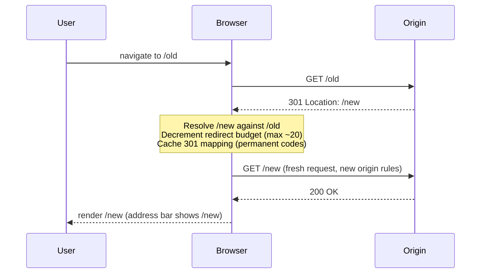
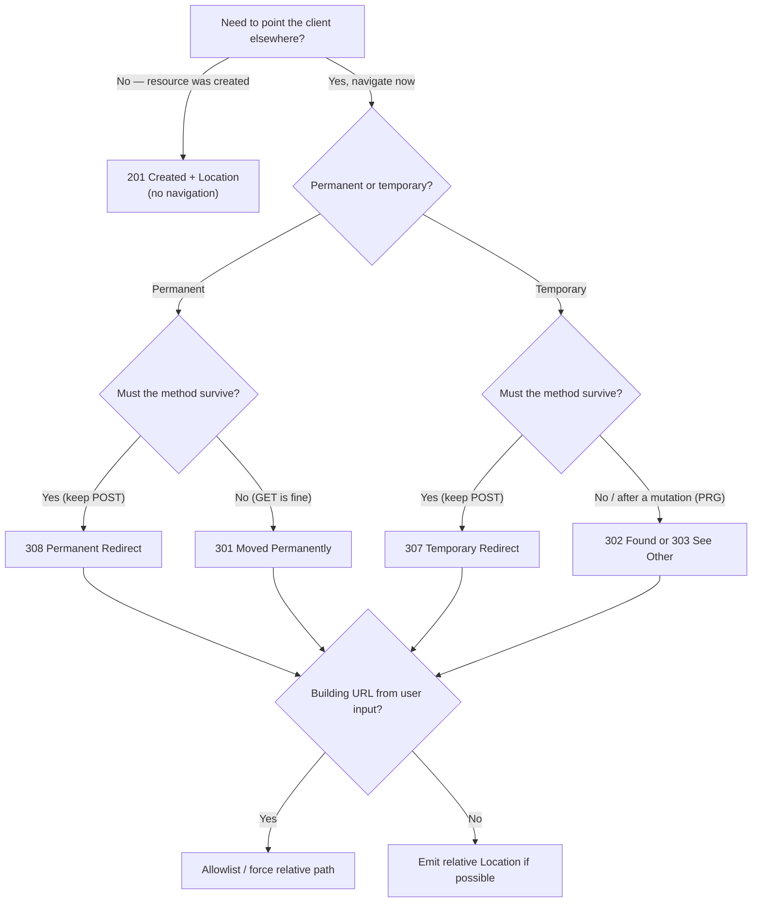

# Location

## Quick Summary

`Location` is a response header the **server** sets to tell the client *where to go next*. It carries a single URI and has exactly two jobs, disambiguated entirely by the status code it rides with. With a `3xx` redirect status it means **"the resource you want lives here — go fetch it"**; with `201 Created` it means **"the resource you just created lives here."** It is the header behind every login redirect, every `POST-then-redirect`, every shortened-URL expansion, and every "we moved to HTTPS" hop. Because the browser acts on it *automatically and invisibly*, `Location` is also one of the most dangerous headers to build from untrusted input — it is the substrate of the open-redirect vulnerability class.

## What problem does this header solve?

HTTP responses are, by default, terminal: the server sends bytes, the client renders them, done. But an enormous fraction of real web traffic is not "here is the content" — it is "the content you asked for is *elsewhere*." A user bookmarks `http://shop.example.com` and you want them on `https://www.shop.example.com`. A user POSTs a checkout form and you must not let them re-submit it by refreshing. An old article at `/blog/2019/old-slug` was renamed and you don't want to 404 the thousand inbound links pointing at it. A REST client POSTs to `/orders` and needs to know the canonical URL of the order it just created so it can `GET` it later.

Every one of these is "the answer to your request is a different URL." `Location` is the standardized, machine-actionable way to say that. Without it, the only alternative is an HTML page with a "click here" link — which breaks API clients, breaks SEO link equity, and forces a manual step on every navigation.

## Why was it introduced?

`Location` is one of the original HTTP/1.0 headers (RFC 1945, 1996) and was carried forward and tightened in HTTP/1.1 (RFC 2616, then RFC 7231 §7.1.2, the current authority). The early web needed redirects immediately: sites reorganized, content moved between servers, and the whole point of hypertext was that a URL was a stable name that could *forward* to wherever the bytes actually lived.

The subtle history is in the **status codes**, not the header. HTTP/1.0 shipped with `301 Moved Permanently` and `302 Found` (originally, and misleadingly, named "Moved Temporarily"). The problem: the spec *said* a `302` must preserve the request method, but every browser in existence changed `POST` to `GET` on `302`. The written standard and the deployed reality diverged. RFC 2616 resolved this by minting two new codes that pinned down the behavior everyone actually wanted: `303 See Other` ("definitely switch to GET") and `307 Temporary Redirect` ("definitely keep the method"). Later, RFC 7538 added `308 Permanent Redirect` as the method-preserving twin of `301`. So today we have a clean matrix, retrofitted onto a messy origin. `Location` itself never changed; what changed is the precise contract of the status code it accompanies.

## How does it work?

The header is trivial on the wire — `Location: <URI>` — but its *semantics are entirely a function of the accompanying status code*, and the behavior of every intermediary depends on whether that status is cacheable.

The redirect matrix is the thing to internalize:

| Status | Meaning | Method preserved on next request? | Cacheable by default? |
|--------|---------|-----------------------------------|-----------------------|
| `301 Moved Permanently` | Resource permanently at new URL | **No** (POST→GET in practice) | **Yes** |
| `302 Found` | Resource temporarily elsewhere | **No** (POST→GET in practice) | No |
| `303 See Other` | Fetch the result from another URL | **No** (always GET) — by spec | No |
| `307 Temporary Redirect` | Same resource, temporarily elsewhere | **Yes** (POST stays POST) | No |
| `308 Permanent Redirect` | Same resource, permanently elsewhere | **Yes** (POST stays POST) | **Yes** |

The two axes are **permanent vs temporary** (does the client/cache remember this forever?) and **method-preserving vs method-changing** (does a POST become a GET, or stay a POST, when following the redirect?). `303` is the special "always GET, and re-fetch from the new URL" that powers the Post/Redirect/Get pattern.

- **Browser behavior:** On any `3xx` with a `Location`, the browser issues a *new* request to the target automatically — no script, no user action. It resolves relative URLs against the request URL, decrements a redirect budget (Chrome caps at ~20 hops, then throws `ERR_TOO_MANY_REDIRECTS`), and for `301`/`308` may cache the mapping so future navigations skip the round trip entirely. Crucially, the browser re-evaluates the *target's* origin: cookies, referrer policy, and mixed-content rules apply to the new URL, not the old one. For `301`/`302`/`303` a POST body is dropped and the method becomes GET; for `307`/`308` the method and body are replayed verbatim (the browser will re-POST). On `201 Created`, the browser does **nothing** with `Location` — it is metadata for scripts/APIs, not a navigation instruction.
- **Server behavior:** The origin server generates `Location` and picks the status code. This is where the contract is defined. The value may be absolute (`https://host/path`) or, since RFC 7231, relative (`/path` or even `../sibling`) — the client resolves it. The server is responsible for making the target reachable and for never reflecting untrusted input into it (open-redirect defense).
- **Proxy behavior:** A forward proxy relays the `3xx` and `Location` to the client untouched; the *client* follows it (the proxy does not chase the redirect on the client's behalf for browser traffic). A proxy may cache `301`/`308` responses per normal cache rules.
- **CDN behavior:** CDNs treat redirects as cacheable objects when the status permits (`301`/`308`). A common pattern is *edge redirects*: the CDN serves the `301`/`Location` from cache without ever hitting origin — e.g. apex-to-www or HTTP-to-HTTPS at the edge. CDNs also let you author redirect rules (Cloudflare Bulk Redirects, CloudFront Functions) so the `Location` is synthesized at the edge. Watch relative `Location` values: if the CDN rewrites the request path, a relative target can resolve wrong.
- **Reverse proxy behavior:** This is the classic footgun. When Nginx/HAProxy sits in front of an app that emits an **absolute** `Location` built from the internal `Host` (e.g. `http://localhost:3000/dashboard`), the browser receives a broken redirect pointing at the internal address/scheme. Nginx's `proxy_redirect` directive rewrites the `Location` back to the public origin; alternatively the app must trust `X-Forwarded-Host`/`X-Forwarded-Proto` (via `app.set('trust proxy', ...)`) so it builds a correct absolute URL — or, best, emit a *relative* `Location` and sidestep the whole problem.

## HTTP Request Example

A form POST that will be redirected (Post/Redirect/Get):

```http
POST /login HTTP/1.1
Host: app.example.com
Content-Type: application/x-www-form-urlencoded
Content-Length: 29

username=ada&password=secret
```

## HTTP Response Example

The server processes the login, then tells the browser to GET the dashboard — a `303` so the POST is not replayed:

```http
HTTP/1.1 303 See Other
Location: /dashboard
Content-Length: 0
```

A `201 Created` uses the same header for an entirely different purpose — announcing the new resource's canonical URL (no navigation happens):

```http
HTTP/1.1 201 Created
Location: /orders/8f3a2c
Content-Type: application/json
Content-Length: 52

{"id":"8f3a2c","status":"pending","total":4200}
```

An HTTP→HTTPS permanent upgrade, method-preserving so API POSTs survive the hop:

```http
HTTP/1.1 308 Permanent Redirect
Location: https://app.example.com/checkout
Content-Length: 0
```

## Express.js Example

```js
const express = require('express');
const app = express();

// Trust the reverse proxy so req.protocol / req.hostname reflect the PUBLIC
// origin (from X-Forwarded-Proto / X-Forwarded-Host), not the internal socket.
// Without this, res.redirect() with a host-relative path is fine, but any
// ABSOLUTE URL you build from req.protocol/req.get('host') would leak the
// internal http://localhost:3000. '1' = trust the first proxy hop.
app.set('trust proxy', 1);

app.use(express.urlencoded({ extended: false }));

// --- 1. Post/Redirect/Get: the canonical safe redirect after a mutation ---
app.post('/login', async (req, res) => {
  const user = await authenticate(req.body.username, req.body.password);
  if (!user) {
    // 302 back to the form. Method changes to GET (browsers do this on 302),
    // which is exactly what we want: show the login page via GET.
    return res.redirect('/login?error=1');
  }
  req.session.userId = user.id;
  // res.redirect() defaults to 302. For PRG we WANT the method to become GET
  // so a refresh re-GETs /dashboard instead of re-POSTing /login. 302 or 303
  // both achieve this; 303 states the intent explicitly.
  res.redirect(303, '/dashboard');
});

// --- 2. Permanent move: renamed resource, preserve SEO link equity ---
app.get('/blog/old-slug', (req, res) => {
  // 301 is cacheable and tells search engines to transfer ranking to the new
  // URL. Browsers and CDNs may cache this mapping and skip the round trip.
  // WARNING: 301 is sticky — browsers cache it aggressively. Never 301 during
  // testing or you'll poison user caches. Use 302 while iterating.
  res.redirect(301, '/blog/new-slug');
});

// --- 3. 201 Created: Location as resource identifier, NOT a redirect ---
app.post('/orders', async (req, res) => {
  const order = await createOrder(req.body);
  // res.location() sets the header WITHOUT sending a 3xx or ending the
  // response — decoupling "set Location" from "redirect". Here it advertises
  // the new resource's URL alongside a 201 body. The browser will not navigate.
  res.location(`/orders/${order.id}`);
  res.status(201).json(order);
});

// --- 4. Preserving the method: API endpoint that moved but still takes POST ---
app.post('/v1/webhooks', (req, res) => {
  // 307 keeps the method AND replays the body, so the client re-POSTs to v2
  // with the same payload. A 301/302/303 here would silently turn the POST
  // into a bodyless GET and lose the webhook payload.
  res.redirect(307, '/v2/webhooks');
});

app.listen(3000);
```

The two Express APIs to keep straight:

- **`res.redirect([status], url)`** sets `Location`, sets the status (default `302`), sends a tiny HTML body ("Redirecting to …") for legacy clients, and **ends** the response. It also performs URL resolution: `res.redirect('back')` uses the `Referer`, and `res.redirect('..')` is resolved relative to the current path.
- **`res.location(url)`** sets *only* the `Location` header and returns, letting you continue building the response (as in the `201` case). It does **not** set a status or end the response.

A subtle Express gotcha: `res.redirect('back')` reads the `Referer` header, which is attacker-controllable and often absent — it is a mild open-redirect vector and unreliable. Prefer an explicit allowlisted path.

## Node.js Example

Raw `http` — no framework sugar, so every mechanic is visible:

```js
const http = require('http');

http.createServer((req, res) => {
  if (req.url === '/old' && req.method === 'GET') {
    // A redirect is just: a 3xx status line + a Location header + (optionally)
    // a tiny body. There is no magic. writeHead sets both at once.
    res.writeHead(301, {
      Location: '/new',
      'Content-Type': 'text/html',
    });
    // The body is a courtesy for ancient/non-following clients. Modern browsers
    // never render it; they act on Location before painting anything.
    res.end('<a href="/new">Moved permanently</a>');
    return;
  }

  if (req.url === '/orders' && req.method === 'POST') {
    // 201 + Location = "created, and here it is". No navigation on the client.
    const id = Math.random().toString(36).slice(2, 8);
    res.writeHead(201, {
      Location: `/orders/${id}`,
      'Content-Type': 'application/json',
    });
    res.end(JSON.stringify({ id }));
    return;
  }

  res.writeHead(404).end();
}).listen(3000);
```

The client side is where redirect-following lives. Node's `http.request` does **not** follow redirects — you get the raw `3xx` and must chase `Location` yourself, which is why libraries like `undici`/`fetch` exist:

```js
// fetch (Node 18+) follows redirects by default (up to 20). To inspect the
// hop instead of following it, set redirect: 'manual'.
const res = await fetch('https://example.com/old', { redirect: 'manual' });
console.log(res.status);              // 301
console.log(res.headers.get('location')); // /new  (may be relative!)
// You must resolve relative Locations against the request URL yourself:
const target = new URL(res.headers.get('location'), 'https://example.com/old');
```

## React Example

React never sets `Location` — it is a server response header — but React apps *consume* it constantly, and there are two very different modes:

**1. `fetch`/`axios` following redirects transparently.** When a SPA calls an API, the browser follows any `3xx` before your `.then()` ever runs. You usually only care about the *final* response, but two properties expose the redirect:

```jsx
async function submitOrder(payload) {
  const res = await fetch('/api/orders', {
    method: 'POST',
    headers: { 'Content-Type': 'application/json' },
    body: JSON.stringify(payload),
  });
  // res.redirected is true if any hop occurred; res.url is the FINAL url.
  // The 201 case: read the Location header to learn the new resource URL.
  if (res.status === 201) {
    const location = res.headers.get('Location'); // /orders/8f3a2c
    return location; // navigate the SPA router here, don't do a full reload
  }
}
```

A critical SPA pitfall: if your API returns a `302`/`303` redirect to an HTML login page when a session expires, `fetch` will *silently follow it*, and your `.then()` receives a `200` full of HTML instead of the `401` JSON you expected. The fix is to make APIs return `401` (never redirect API calls) and reserve redirects for full-page navigations. If you cannot change the API, use `redirect: 'manual'` and inspect the opaque redirect yourself.

**2. Client-side "redirects" that are not HTTP redirects at all.** React Router's `<Navigate>` / `useNavigate()` and Next.js's `redirect()` (in a Server Action or route handler) look like redirects but operate at different layers. Next's server-side `redirect()` genuinely emits an HTTP `Location` + `3xx` during SSR; React Router's client navigation just swaps components and pushes history — no HTTP `Location` is involved. Knowing which layer you're in tells you whether cookies/caching/SEO rules apply.

## Browser Lifecycle

Step by step, what happens when a response with `Location` + `3xx` lands:



1. Response headers arrive; browser sees status ∈ `3xx` and a `Location`.
2. **Resolve** the target URL against the current request URL (relative → absolute).
3. **Method decision:** `301/302/303` → new request is `GET`, body discarded; `307/308` → method and body replayed.
4. **Budget check:** decrement the redirect counter; if a loop or >~20 hops, abort with `ERR_TOO_MANY_REDIRECTS`.
5. **Cache:** `301/308` may be stored so the next navigation skips the hop entirely (this is why a bad `301` is so hard to undo — it lives in the user's browser cache).
6. Issue the new request. Cookies, `Referrer-Policy`, HSTS, and mixed-content checks are evaluated against the **target** origin.
7. On the final `2xx`, render, and update the address bar to the final URL.

The whole dance is invisible: the user sees one navigation, and the intermediate `3xx` never paints.

## Production Use Cases

- **HTTP → HTTPS upgrade.** `301`/`308` at the edge or reverse proxy so no plaintext content is ever served. Pair with `Strict-Transport-Security` so subsequent visits skip the redirect entirely.
- **Apex → www (or vice versa) canonicalization.** One canonical host prevents duplicate-content SEO penalties and cookie-scoping confusion.
- **Post/Redirect/Get.** After any state-changing POST, `303` to a GET-able results page so a browser refresh does not re-submit the order/comment/payment.
- **URL shorteners / vanity links.** `301`/`302` from `/promo` to the long campaign URL; `302` when the target rotates.
- **REST resource creation.** `201 Created` + `Location` giving the canonical URL of the new resource, per REST convention.
- **Auth flows.** OAuth 2.0 is *built* on redirects: the authorization endpoint `302`s back to your `redirect_uri` with a code. Login-required interstitials `302` to `/login?returnTo=…`.
- **Legacy content migration.** Bulk `301`s from old slugs to new, preserving inbound link equity and bookmarks.

## Common Mistakes

- **Using `302`/`303` where the method must survive.** Redirecting a `POST /api/x` with `302` silently turns it into `GET /api/x` and drops the body. Use `307`/`308` for method-critical redirects.
- **Using `301` too early.** `301`/`308` are cached hard by browsers. Ship a permanent redirect to the wrong place and users are stuck with it until their cache expires — you cannot recall it server-side. Use `302` until the mapping is final.
- **Absolute `Location` built from the internal host** behind a reverse proxy, leaking `http://localhost:3000/…` to the client. Emit relative URLs or configure `proxy_redirect`/`trust proxy`.
- **Reflecting user input into `Location`** — the open-redirect bug (see Security).
- **Treating `201`'s `Location` as a redirect.** It is not; no navigation occurs. Conversely, sending a `3xx` when you meant "resource created here."
- **Redirect loops** — A `301`s to B, B `301`s to A, or an HTTPS-redirect rule that fires again on the HTTPS request. Manifests as `ERR_TOO_MANY_REDIRECTS`.
- **Redirecting API/XHR calls to HTML login pages**, poisoning SPA fetches with `200` HTML instead of `401` JSON.

## Security Considerations

The dominant risk is the **open redirect** (CWE-601). If you build `Location` from unvalidated user input:

```js
// DANGEROUS: attacker crafts /login?returnTo=https://evil.example.com
app.post('/login', (req, res) => {
  authenticate(req.body);
  res.redirect(req.query.returnTo); // <-- open redirect
});
```

An attacker sends victims a link to *your* trusted domain that transparently bounces them to a phishing clone — the victim sees your domain in the link, trusts it, and lands on the attacker's page with your session context or is harvested for credentials. Open redirects also chain into OAuth token theft (a permissive `redirect_uri` leaks authorization codes) and are used to bypass SSRF/URL allowlists. Defenses:

- **Allowlist targets.** Only redirect to a fixed set of known paths, or validate that the parsed URL's host is in your allowlist.
- **Force relative.** Strip the origin: accept only paths beginning with a single `/` (reject `//evil.com`, which is protocol-relative and resolves to an external host — a classic bypass) and reject `\`, `%2F%2F`, and backslash tricks.
- **Never trust `Referer`** (`res.redirect('back')`).

```js
function safeReturnTo(input) {
  // Only allow same-origin absolute PATHS. Reject anything with a scheme,
  // host, or protocol-relative "//" prefix.
  if (typeof input !== 'string') return '/';
  if (!input.startsWith('/') || input.startsWith('//')) return '/';
  return input;
}
```

Secondary concerns: redirecting from HTTPS to HTTP downgrades the connection (leaks data, strips HSTS context); redirects can leak query-string secrets via the target's `Referer`; and a `301` cached by a shared proxy could serve a stale/hijacked target to many users.

## Performance Considerations

Every redirect is a full extra round trip: DNS (if new host) + TCP + TLS + request + response, before the user sees anything. On mobile networks a redirect chain of 3 hops can add 500ms–1s of pure latency. Rules:

- **Collapse chains.** `http://apex` → `https://apex` → `https://www` is three hops; rewrite rules should jump straight to the final `https://www` in one hop.
- **Cache permanent redirects.** `301`/`308` let browsers and CDNs skip the hop on repeat visits; pair with a `Cache-Control` for shared caches.
- **Prefer HSTS over HTTP→HTTPS redirects** for repeat visitors: after the first visit, the browser upgrades to HTTPS *itself* with zero network round trips.
- **Redirect at the edge, not origin.** A CDN serving a cached `301` responds in single-digit milliseconds vs a full origin round trip.

## Reverse Proxy Considerations

Nginx in front of a Node app that emits absolute `Location`s:

```nginx
location / {
    proxy_pass http://127.0.0.1:3000;
    proxy_set_header Host $host;                 # app sees the public host
    proxy_set_header X-Forwarded-Proto $scheme;  # app knows it's HTTPS

    # Rewrite Location headers the app emitted against its internal address
    # back to the public origin. Without this, a redirect to
    # http://127.0.0.1:3000/dashboard reaches the browser verbatim and breaks.
    proxy_redirect http://127.0.0.1:3000/ https://app.example.com/;
    # 'default' derives the rewrite from proxy_pass + Host automatically:
    # proxy_redirect default;
}
```

The cleaner fix is upstream: set `trust proxy` in Express (or read `X-Forwarded-*` yourself) so the app builds correct absolute URLs, or — best of all — emit **relative** `Location` values (`/dashboard`) which need no rewriting at any layer. Also do HTTP→HTTPS redirects *in Nginx* with `return 308 https://$host$request_uri;` rather than round-tripping to the app.

## CDN Considerations

- **Edge redirects.** Author apex→www, HTTP→HTTPS, and legacy-slug redirects as CDN rules (Cloudflare Rules/Bulk Redirects, CloudFront Functions, Fastly VCL) so they resolve in milliseconds at the edge and never touch origin.
- **Cacheability.** CDNs cache `301`/`308` responses; a poisoned or mistaken permanent redirect can be served to every user until you purge the edge cache. Purge deliberately after changing a `301`.
- **Relative `Location` + path rewriting.** If the CDN rewrites the request path (e.g. strips a prefix), a relative `Location` resolves against the *rewritten* path and can point somewhere unexpected. Test relative redirects behind path-rewriting CDNs.
- **Loop risk.** An origin HTTP→HTTPS redirect *plus* a CDN HTTP→HTTPS redirect can ping-pong if the CDN talks to origin over HTTP. Terminate TLS decisions in exactly one place.

## Cloud Deployment Considerations

- **ALB/ELB (AWS):** Application Load Balancers can emit redirects natively (listener rules with a `redirect` action) — do HTTP→HTTPS there so instances never see plaintext. The ALB sets `X-Forwarded-Proto`; your app must trust it to build correct absolute `Location`s.
- **API Gateway:** Returns `Location` from integration responses; mapping templates must forward it. Be careful with stage prefixes (`/prod`) polluting relative paths.
- **Vercel/Netlify:** Declarative redirects in `vercel.json`/`_redirects` run at the edge with configurable `permanent`/status; prefer these to app-level redirects for canonical-host and legacy-path rules.
- **App Engine / Cloud Run behind a Google LB:** Same `X-Forwarded-Proto`/`X-Forwarded-Host` story — trust the proxy or emit relative URLs.

Across all platforms the invariant is the same: **decide where TLS/host canonicalization happens (usually the edge/LB), do it once, and make sure the app trusts the forwarded headers so any absolute `Location` it builds is correct.**

## Debugging

- **Chrome DevTools → Network:** Redirects show as separate rows with `3xx` status; enable "Preserve log" or you'll lose the intermediate hops when the page navigates. The final request's "Initiator" and each row's Location reveal the chain. `res.redirected`/`res.url` in the console confirm fetch-level following.
- **curl:** `curl -I https://example.com/old` shows the `3xx` + `Location` without following. `curl -IL` follows and prints *every* hop's headers — the fastest way to see a full redirect chain and catch loops.
- **Postman:** "Automatically follow redirects" toggle (Settings) — turn it *off* to inspect the raw `3xx`/`Location`; on to see the terminal response.
- **Bruno:** Same idea — the request settings expose a follow-redirects flag; disable it to assert on the `Location` header in tests.
- **Node:** `fetch(url, { redirect: 'manual' })` returns an opaque-redirect response; read `.headers.get('location')`. Raw `http.request` never follows, so it's ideal for asserting the exact header value.
- **Express logging:** Log `res.getHeader('Location')` and `res.statusCode` in a finishing middleware to audit which handler emitted which redirect.

## Best Practices

- Choose the status code deliberately: permanent+method-preserving = `308`; permanent+GET = `301`; temporary+GET = `302`/`303`; temporary+method-preserving = `307`.
- Use `303` for Post/Redirect/Get; use `307`/`308` whenever a POST/PUT/PATCH body must survive.
- Prefer **relative** `Location` values to avoid host/scheme leakage behind proxies.
- Never build `Location` from raw user input; allowlist or force same-origin paths.
- Delay `301`/`308` until the mapping is truly permanent — they are cached and effectively irreversible client-side.
- Collapse redirect chains to a single hop; pair HTTP→HTTPS redirects with HSTS.
- Return `401`/`403` (never a redirect) for API/XHR auth failures.
- For `201 Created`, always include `Location` with the new resource's canonical URL.
- Do canonical-host and TLS redirects once, at the edge/LB, and `trust proxy` in the app.

## Related Headers

- **[Host](../03-Request-Headers/Host.md)** / `X-Forwarded-Host` — determine the authority an absolute `Location` should reference; the source of reverse-proxy `Location` breakage.
- **[Refresh]** (non-standard) and the `<meta http-equiv="refresh">` tag — client-side alternatives to `Location`; slower and worse for SEO.
- **[Strict-Transport-Security](../05-Security-Headers/Strict-Transport-Security.md)** — replaces repeat HTTP→HTTPS redirects with client-side upgrades.
- **[Content-Location]** — *not* a redirect; identifies the specific URL of the entity in the body (content negotiation), often confused with `Location`.
- **[Cache-Control](../06-Caching-Headers/Cache-Control.md)** — governs how long `301`/`302` redirects are cached by browsers/CDNs.
- **[Set-Cookie](../08-Cookies/Set-Cookie.md)** — cookies set alongside a redirect are stored before the next hop; auth flows rely on this ordering.

## Decision Tree



## Mental Model

`Location` is a **forwarding address written on the outside of the envelope**, and the status code is the *instruction stamped next to it*. `301`/`308` are a permanent change-of-address card the post office (browser/CDN) files away and reuses forever; `302`/`307` are a "gone fishing, mail me here for now" note that's honored once and forgotten. The method-preservation split is whether the postal service **repacks your parcel exactly as sent** (`307`/`308` — same method and body) or **quietly replaces it with an empty GET postcard** (`301`/`302`/`303`). And `201`'s `Location` is not forwarding at all — it's the post office handing you back a receipt that says "your new mailbox is at this address." The whole system runs automatically and invisibly, which is exactly why writing that address from a stranger's dictation (user input) is how your customers end up delivered to a con artist's door.
