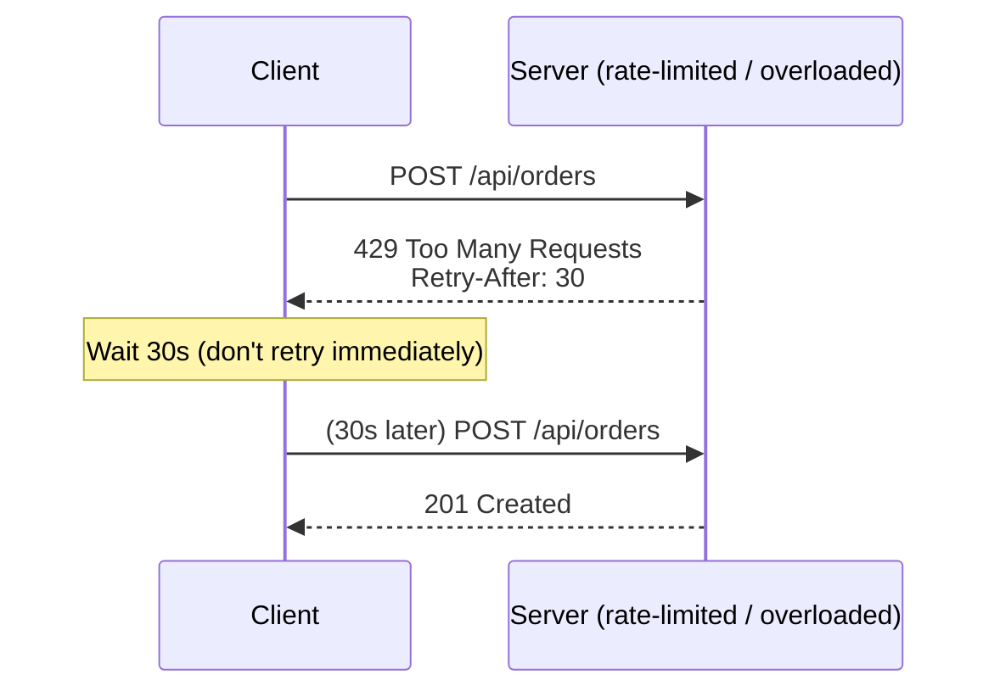
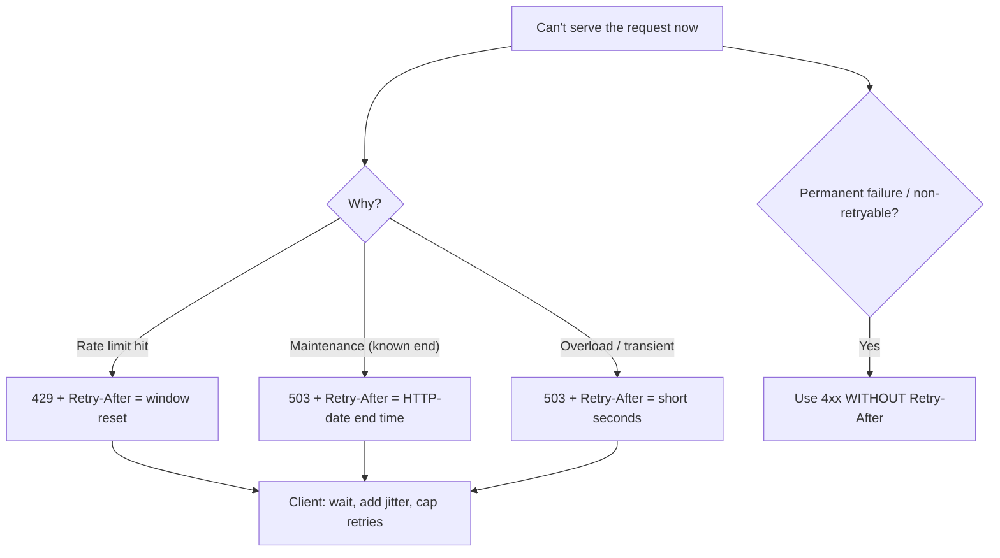

# Retry-After

## Quick Summary

`Retry-After` is a **response** header that tells a client **how long to wait before retrying** a request — either as a number of seconds (`Retry-After: 120`) or as an HTTP date (`Retry-After: Wed, 21 Oct 2026 07:28:00 GMT`). It appears most commonly on three status codes: **`503 Service Unavailable`** (server is overloaded or down for maintenance — "come back in N seconds"), **`429 Too Many Requests`** (rate limit hit — "you're throttled until then"), and **`3xx` redirects** paired with temporary unavailability. It is the server's mechanism for **cooperative backoff**: instead of leaving clients to guess when to retry (and hammer the server with a thundering herd of immediate retries), the server *tells* them exactly when it will be ready. Well-behaved clients honor it; done right, it protects an overloaded service from retry storms, gives rate-limited clients a precise wake-up time, and turns chaotic failure into orderly recovery. It's a small header with outsized importance for resilience, and it's the polite counterpart to client-side exponential backoff.

## What problem does this header solve?

When a server can't serve a request *right now* — it's overloaded, deploying, or the client exceeded a rate limit — the client faces a question: **when should I try again?** If every client retries immediately (or on a naive fixed interval), a struggling server gets buried under a **retry storm** (the "thundering herd"): the very load that caused the failure is amplified by synchronized retries, turning a transient blip into a sustained outage. And rate-limited clients that retry too soon just get rejected again, wasting requests and never learning when the limit resets.

`Retry-After` solves this by moving the retry decision from *guesswork* to *instruction*. The server, which knows its own state (maintenance window length, rate-limit reset time, estimated recovery), tells the client precisely how long to wait. This:
- **prevents thundering-herd retries** by spacing clients out to a server-chosen time,
- **gives rate-limited clients an exact reset time** instead of blind retrying,
- **communicates maintenance windows** ("back in 5 minutes") so clients can back off intelligently,
- and **coordinates graceful degradation** — clients, SDKs, and job queues can schedule the retry rather than spin.

It converts "client guesses, server suffers" into "server directs, client complies."

## Why was it introduced?

`Retry-After` has been part of HTTP since **HTTP/1.1 (RFC 2068, 1997; RFC 2616, 1999)**, specified today in **RFC 9110 §10.2.3 (2022)**. It was introduced alongside `503 Service Unavailable` to let servers communicate temporary unavailability with an *estimated duration*, so clients and caches wouldn't retry prematurely during maintenance or overload. Its use with **`429 Too Many Requests`** came later, formalized in **RFC 6585 (2012)** which introduced the `429` status specifically for rate limiting — `Retry-After` being the natural way to tell a throttled client when its window resets. The two-format design (delay-seconds or HTTP-date) reflects two real needs: a *relative* countdown for "wait N seconds" (rate limits, short overloads) and an *absolute* time for "we'll be back at this specific moment" (scheduled maintenance). Its whole reason for being is orderly, server-directed retry behavior.

## How does it work?

The server sets `Retry-After` on a response indicating temporary unavailability or throttling. A cooperating client parses it and delays its retry accordingly.



Two value formats:
- **Delay-seconds:** `Retry-After: 120` → wait 120 seconds from now.
- **HTTP-date:** `Retry-After: Wed, 21 Oct 2026 07:28:00 GMT` → wait until that absolute time.

Behavior by tier:

- **Browser behavior:** Browsers do **not** automatically retry `429`/`503` based on `Retry-After` for normal navigations/`fetch` (with a narrow historical exception around some redirect handling). Your application code (or an SDK) reads and honors it. Note: JavaScript can read `Retry-After` from a `fetch` response only if it's [CORS-exposed](../07-CORS/Access-Control-Expose-Headers.md) for cross-origin responses.
- **Server behavior:** The origin sets it on `503`/`429` (and sometimes `3xx`) with an accurate delay/time derived from its actual state (rate-limit reset, maintenance end).
- **Proxy behavior:** Forwards it; a proxy generating its own `503` (upstream down) may set its own `Retry-After`.
- **CDN behavior:** CDNs emit `Retry-After` on their own `429`/`503` (edge rate limiting, origin unreachable) and pass through the origin's. Some honor it for origin retries.
- **Reverse proxy behavior:** Nginx can emit `Retry-After` on `503` (e.g. from `limit_req`/`limit_conn` or maintenance pages) and passes upstream values through.

## HTTP Request Example

`Retry-After` is a **response** header — clients don't send it. The client's role is to *honor* it on the retry. The triggering request is ordinary:

```http
POST /api/orders HTTP/1.1
Host: api.example.com
Authorization: Bearer eyJ...
Content-Type: application/json

{"item":"sku-1"}
```

## HTTP Response Example

Rate limited (`429`) with a relative delay:

```http
HTTP/1.1 429 Too Many Requests
Content-Type: application/json
Retry-After: 30
RateLimit-Limit: 100
RateLimit-Remaining: 0
RateLimit-Reset: 30

{"error":"rate_limited","message":"Try again in 30 seconds"}
```

Scheduled maintenance (`503`) with an absolute time:

```http
HTTP/1.1 503 Service Unavailable
Content-Type: text/html
Retry-After: Wed, 08 Jul 2026 02:00:00 GMT

<h1>Down for maintenance until 02:00 UTC</h1>
```

Overload (`503`) with a short backoff:

```http
HTTP/1.1 503 Service Unavailable
Retry-After: 5
```

## Express.js Example

```js
const express = require('express');
const app = express();

// 1) Rate limiting: on 429, tell the client exactly when its window resets.
const rateLimit = require('express-rate-limit');
app.use('/api/', rateLimit({
  windowMs: 60_000,
  max: 100,
  standardHeaders: true,   // emits RateLimit-* AND sets Retry-After on 429 automatically.
  legacyHeaders: false,
  // express-rate-limit computes Retry-After from the remaining window for you.
}));

// 2) Manual 429 with a precise Retry-After (e.g. a custom quota system).
app.post('/api/expensive', async (req, res) => {
  const { allowed, resetInSeconds } = await quota.check(req.user.id);
  if (!allowed) {
    return res
      .status(429)
      .set('Retry-After', String(resetInSeconds))   // delay-seconds format
      .json({ error: 'quota_exceeded', retryAfter: resetInSeconds });
  }
  res.json(await doWork(req.user.id));
});

// 3) Maintenance mode: 503 with an absolute end time so clients back off correctly.
let MAINTENANCE_UNTIL = null; // a Date, set during deploys
app.use((req, res, next) => {
  if (MAINTENANCE_UNTIL && MAINTENANCE_UNTIL > new Date()) {
    return res
      .status(503)
      .set('Retry-After', MAINTENANCE_UNTIL.toUTCString())  // HTTP-date format
      .type('text/plain')
      .send('Down for maintenance');
  }
  next();
});

// 4) Overload shedding: shed load with a short backoff instead of collapsing.
app.use((req, res, next) => {
  if (server.isOverloaded()) {
    return res.status(503).set('Retry-After', '5').end();  // brief, jittered on the client side.
  }
  next();
});

app.listen(3000);
```

Why each piece matters: in route 1, `standardHeaders: true` makes `express-rate-limit` emit both the modern `RateLimit-*` headers and `Retry-After`, so clients get a precise reset time for free. Route 2 shows the manual pattern — the `Retry-After` value must reflect the *actual* reset (`resetInSeconds`), or clients retry too early (rejected again) or too late (wasted capacity). Route 3 uses the **HTTP-date** form for a known maintenance window, which is more robust than a countdown across clock differences for a fixed end time. Route 4 is load-shedding: returning `503` + a short `Retry-After: 5` under overload lets the server *survive* by spacing retries, rather than accepting every request and crashing. Emitting `429`/`503` **without** `Retry-After` leaves clients guessing — the header is what makes backoff cooperative.

## Node.js Example

Raw `http`:

```js
const http = require('http');

http.createServer((req, res) => {
  // Simple in-memory rate limiter for illustration.
  const { limited, resetSeconds } = checkRate(req.socket.remoteAddress);
  if (limited) {
    res.writeHead(429, {
      'Content-Type': 'application/json',
      'Retry-After': String(resetSeconds),   // seconds until the window resets
    });
    return res.end(JSON.stringify({ error: 'rate_limited' }));
  }

  if (isDeploying()) {
    res.writeHead(503, { 'Retry-After': maintenanceEnd().toUTCString() }); // absolute time
    return res.end('maintenance');
  }

  res.writeHead(200, { 'Content-Type': 'application/json' });
  res.end(JSON.stringify({ ok: true }));
}).listen(3000);
```

The essential move: on `429`/`503`, always attach an accurate `Retry-After` (seconds for dynamic resets, date for fixed windows).

## React Example

React apps (or their fetch/SDK layer) should **read `Retry-After` and honor it** on retries, rather than retrying blindly:

```jsx
async function fetchWithRetry(url, options, maxRetries = 3) {
  for (let attempt = 0; attempt <= maxRetries; attempt++) {
    const res = await fetch(url, options);
    if (res.status !== 429 && res.status !== 503) return res;   // success or non-retryable

    // Parse Retry-After: it's either seconds or an HTTP date.
    const ra = res.headers.get('retry-after');                  // note: needs CORS-expose cross-origin
    let waitMs;
    if (ra && /^\d+$/.test(ra)) {
      waitMs = parseInt(ra, 10) * 1000;                         // delay-seconds
    } else if (ra) {
      waitMs = Math.max(0, Date.parse(ra) - Date.now());        // HTTP-date
    } else {
      waitMs = Math.min(1000 * 2 ** attempt, 30_000);           // fallback: exp backoff
    }
    // Add jitter to avoid synchronized retries across clients (thundering herd).
    waitMs += Math.random() * 1000;
    if (attempt === maxRetries) return res;                     // give up, surface the error
    await new Promise(r => setTimeout(r, waitMs));
  }
}

// Usage in a component:
function useOrders() {
  const [state, setState] = React.useState({ loading: true });
  React.useEffect(() => {
    fetchWithRetry('/api/orders', {})
      .then(r => r.ok ? r.json() : Promise.reject(r))
      .then(data => setState({ loading: false, data }))
      .catch(() => setState({ loading: false, error: 'Please try later' }));
  }, []);
  return state;
}
```

Key points for React devs:
1. **Honor `Retry-After` if present**, fall back to exponential backoff if not, and **add jitter** so many clients don't retry at the same instant.
2. **Cross-origin readability:** `fetch` can only read `Retry-After` on a cross-origin response if the server sends [`Access-Control-Expose-Headers: Retry-After`](../07-CORS/Access-Control-Expose-Headers.md).
3. **Cap retries and surface a graceful message** — don't retry forever; show "try again later" and stop hammering.

## Browser Lifecycle

1. A request receives a `429`/`503` (or certain `3xx`) with `Retry-After`.
2. For normal navigations/`fetch`, the browser **does not** auto-retry based on `Retry-After` — your code/SDK must read and honor it. (There are narrow, historical redirect-related behaviors, but you should not rely on automatic retry.)
3. Your code parses the value (seconds or date), waits (ideally with jitter), then retries.
4. Cross-origin JS can read the header only if it's [CORS-exposed](../07-CORS/Access-Control-Expose-Headers.md).
5. Caches may use `Retry-After` on `503` to decide how long to consider the resource unavailable.

## Production Use Cases

- **Rate limiting (`429`):** tell throttled clients exactly when their window resets.
- **Maintenance windows (`503`):** communicate a fixed end time so clients/monitors back off gracefully.
- **Overload / load-shedding (`503`):** return short, jittered backoffs to survive traffic spikes without collapse.
- **Third-party API SDKs:** SDKs (Stripe, GitHub, cloud providers) read `Retry-After` to schedule retries automatically.
- **Job queues / workers:** background workers hitting rate-limited APIs reschedule tasks based on `Retry-After`.
- **Circuit breakers:** feed `Retry-After` into breaker logic to decide when to probe a recovering dependency.

## Common Mistakes

- **Omitting `Retry-After` on `429`/`503`.** Leaves clients guessing → thundering-herd retries and repeated rejections.
- **Inaccurate values.** A `Retry-After` shorter than the real reset causes immediate re-rejection; much longer than needed wastes capacity. Compute it from actual state.
- **No jitter on the client.** Even with `Retry-After`, if every client waits the *exact* same interval they retry simultaneously — add randomness.
- **Wrong format parsing.** Clients must handle *both* seconds and HTTP-date; assuming one breaks on the other.
- **Not CORS-exposing it.** Cross-origin JS can't read `Retry-After` without [`Access-Control-Expose-Headers`](../07-CORS/Access-Control-Expose-Headers.md).
- **Infinite retries.** Cap attempts; honoring `Retry-After` forever can still storm a permanently-down service.
- **Using it on non-retryable errors.** `Retry-After` implies "try again"; don't put it on `4xx` errors that won't succeed on retry (except `429`).
- **Clock skew with HTTP-date.** Absolute times depend on synced clocks; for very short waits, seconds are safer.

## Security Considerations

- **DoS resilience is the point.** Correct `Retry-After` + load-shedding protects against retry-amplified outages; omitting it can turn a spike into a self-inflicted DoS.
- **Don't leak sensitive timing.** A precise `Retry-After` on rate limits can reveal quota internals; usually fine, but avoid exposing exact security-relevant timings (e.g. lockout durations that aid enumeration) more than necessary.
- **Abuse via forced backoff.** A malicious upstream/proxy could set a huge `Retry-After` to stall clients; clients should **cap** the honored delay (e.g. ignore absurd values) to avoid being trivially stalled.
- **Rate-limit evasion awareness.** `Retry-After` is advisory — abusive clients ignore it. Enforce limits server-side regardless; the header is cooperation, not enforcement.
- **CORS exposure trade-off.** Exposing `Retry-After` cross-origin is generally safe and useful, but be deliberate about what timing you reveal.

## Performance Considerations

- **Prevents retry storms** — the single biggest performance/availability benefit; orderly backoff keeps a struggling service recoverable.
- **Improves client efficiency:** clients wait the right amount instead of spamming rejected requests.
- **Enables graceful degradation:** load-shedding with `Retry-After` sheds excess traffic cheaply (a tiny `503`) rather than doing expensive work it can't complete.
- **Negligible wire cost;** its value is entirely in behavior coordination.
- **Pair with `RateLimit-*` headers** (limit/remaining/reset) for richer client-side scheduling.

## Reverse Proxy Considerations

Nginx can emit `Retry-After` on rate-limit/maintenance `503`s and pass upstream values through:

```nginx
http {
  limit_req_zone $binary_remote_addr zone=api:10m rate=10r/s;

  server {
    location /api/ {
      limit_req zone=api burst=20 nodelay;
      limit_req_status 429;                       # return 429 (not default 503) on limit.
      # Add a Retry-After hint on rate-limited responses:
      error_page 429 = @rate_limited;
      proxy_pass http://app_upstream;
    }

    location @rate_limited {
      add_header Retry-After 10 always;           # tell clients to wait 10s.
      return 429;
    }

    # Maintenance mode: serve 503 + Retry-After from a flag file.
    if (-f /etc/nginx/maintenance.on) {
      return 503;
    }
    error_page 503 @maintenance;
    location @maintenance {
      add_header Retry-After 300 always;          # back in ~5 minutes.
      return 503;
    }
  }
}
```

Key points: `limit_req_status 429` makes Nginx return the correct status for rate limiting, and the `@rate_limited`/`@maintenance` named locations attach `Retry-After`. Nginx passes an upstream's `Retry-After` through by default. Use `add_header ... always` so the header is present even on error responses.

## CDN Considerations

- **Edge rate limiting / WAF:** CDNs emit `429`/`503` with `Retry-After` when their own rate limits or bot rules trigger (Cloudflare, Fastly, CloudFront, Akamai).
- **Origin unreachable:** a CDN returning `503` because the origin is down may set its own `Retry-After` and can use it to decide when to re-probe the origin.
- **Pass-through:** CDNs generally forward the origin's `Retry-After`; ensure it isn't stripped.
- **Custom error pages:** if you serve branded `429`/`503` pages at the edge, include `Retry-After` on them.
- **CORS:** if your API is cross-origin, ensure the CDN doesn't strip [`Access-Control-Expose-Headers: Retry-After`](../07-CORS/Access-Control-Expose-Headers.md).

## Cloud Deployment Considerations

- **API Gateways (AWS API Gateway, Apigee, Kong):** their throttling returns `429`; configure them to include `Retry-After` (or the reset in `RateLimit-*`). Some emit `Retry-After` automatically on throttle.
- **Load balancers:** during backend draining/health-check failure they may return `503`; configure `Retry-After` where supported.
- **Managed platforms (Vercel/Netlify):** platform rate limits/edge functions can return `429`/`503`; set `Retry-After` in your handler.
- **Cloud SDKs:** AWS/GCP/Azure SDKs honor `Retry-After` in their built-in retry logic — rely on it rather than hand-rolling backoff when calling cloud APIs.
- **Autoscaling interplay:** during scale-up, `503` + `Retry-After` sheds load while new instances come online.

## Debugging

- **Chrome DevTools → Network:** on a `429`/`503`, check Response Headers for `Retry-After`; the Console/Timing shows whether your code retried after the right delay.
- **curl:** `curl -sD - -o /dev/null https://api.example.com/limited` and inspect `Retry-After` (hammer it to trigger `429`). `curl -i` shows status + header together.
- **Postman / Bruno:** assert `res.status === 429` and parse `Retry-After`; a test script can compute the wait.
- **Load test:** use a load tool to trip rate limits/overload and verify `Retry-After` values are accurate and honored by your client/SDK.
- **Node.js/Express logging:** log the `Retry-After` you set alongside the status, and (on the client) log the parsed wait time.
- **Clock check:** for HTTP-date values, verify client/server clocks are synced so the computed wait is correct.

## Best Practices

- [ ] Always send `Retry-After` on `429` and on `503` (maintenance/overload) with an **accurate** delay/time.
- [ ] Use **delay-seconds** for dynamic resets/short waits and **HTTP-date** for fixed maintenance windows.
- [ ] On the client, **honor `Retry-After`**, fall back to exponential backoff if absent, and **add jitter**.
- [ ] **Cap** honored delays and total retry attempts to avoid being stalled or storming a dead service.
- [ ] Parse **both** formats (seconds and HTTP-date) on the client.
- [ ] Expose it cross-origin via [`Access-Control-Expose-Headers: Retry-After`](../07-CORS/Access-Control-Expose-Headers.md) when your API is consumed by browsers on other origins.
- [ ] Pair with `RateLimit-Limit`/`Remaining`/`Reset` for richer client scheduling.
- [ ] Use `503` + short `Retry-After` for **load-shedding** under overload rather than accepting doomed work.
- [ ] Enforce limits server-side regardless — `Retry-After` is cooperative, not enforcement.

## Related Headers

- `RateLimit-Limit` / `RateLimit-Remaining` / `RateLimit-Reset` — the (IETF-draft) rate-limit headers that complement `Retry-After` with quota details.
- [Access-Control-Expose-Headers](../07-CORS/Access-Control-Expose-Headers.md) — required to read `Retry-After` from cross-origin JS.
- [Cache-Control](../06-Caching-Headers/Cache-Control.md) — how long caches may reuse/avoid re-requesting; interacts with `503` handling.
- [Date](./Date.md) — reference point for HTTP-date `Retry-After` values and clock-skew reasoning.
- [Connection](../03-Request-Headers/Connection.md) — during overload, servers may also close/limit connections.
- [Location](./Location.md) — on `3xx` responses that may accompany temporary unavailability.

## Decision Tree



## Mental Model

Think of `Retry-After` as the **"back in 15 minutes" clock a shopkeeper hangs on the door when they step out** — or the **deli counter's "now serving #47, please wait" sign** when the line is too long. Without it, everyone who finds the door locked keeps rattling the handle every few seconds (retry storm), which helps no one and stresses the door. With the clock, customers glance at it, go run another errand, and come back at the stated time — orderly, calm, and the shopkeeper returns to a queue instead of a mob. The two formats map neatly to the two situations: a *countdown* ("15 minutes") for "I'll be back shortly" (rate limits, brief overload), and a *specific time* ("back at 2:00") for a planned closure (maintenance). The catch is that it only works with **cooperative customers** — a determined shoplifter ignores the sign entirely — so the shopkeeper still locks the register (enforces limits server-side). And smart customers don't *all* return at the exact posted second (that would just recreate the mob), so they each add a little randomness (jitter) to their return time.
