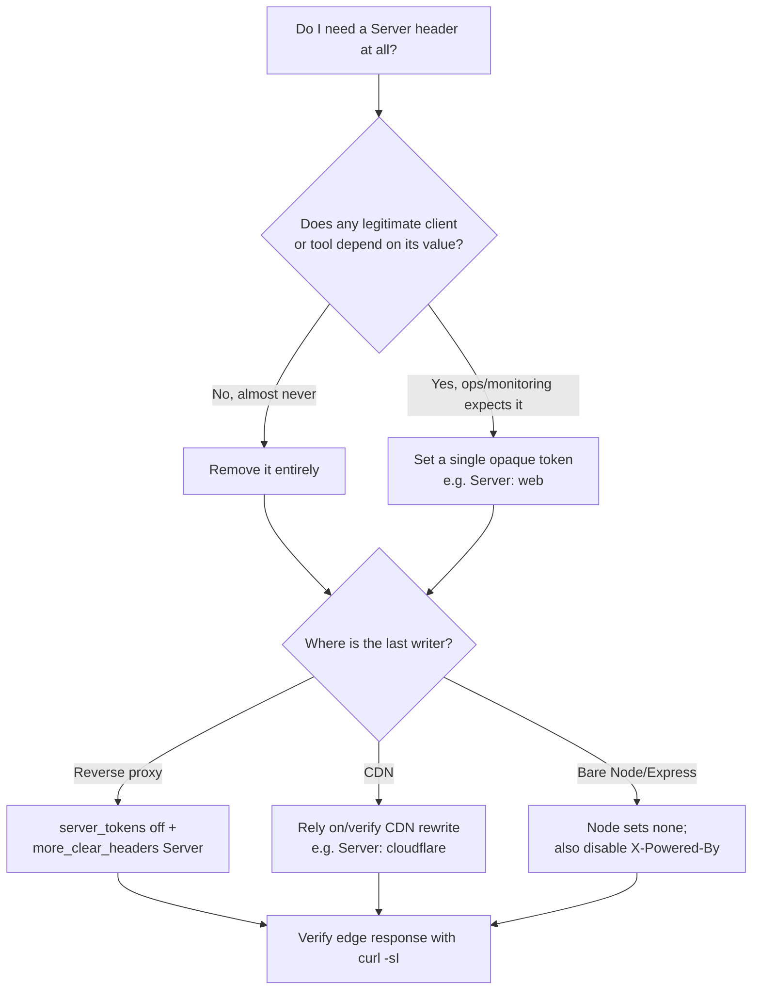

# Server

## Quick Summary

`Server` is a response header, set by the origin server (or a reverse proxy in front of it), that identifies the software — and often the exact version — handling the request. A typical value is `Server: nginx/1.25.3` or `Server: Apache/2.4.57 (Ubuntu)`. It is purely informational: no browser behavior depends on it, no cache keys off it, and no client feature is unlocked by it. Its practical significance in production is almost entirely about **information disclosure** — it hands attackers and automated scanners a free fingerprint of your stack and its patch level. Because it provides no value to legitimate clients and measurable value to attackers, the mainstream security posture is to suppress or genericize it. This page covers what it advertises, why it is a fingerprinting liability, and exactly how to remove or override it in Express, Node, Nginx, and at the CDN/load-balancer edge — alongside the related `X-Powered-By` header that leaks the same class of information at the application layer.

## What problem does this header solve?

Historically, `Server` solved a diagnostic and interoperability problem. In the early web, clients and intermediaries needed to know which server implementation they were talking to in order to work around known bugs and quirks — the HTTP/1.0 and 1.1 eras were full of servers that violated the spec in specific, identifiable ways, and a client could special-case behavior based on the `Server` string. It also helped operators and monitoring tools attribute traffic and diagnose which tier answered a request in a multi-server topology.

In modern production systems that original problem has almost entirely evaporated. HTTP implementations are far more conformant, clients no longer branch on server identity, and you have far better tools (structured logs, tracing headers, APM) to attribute a response to a tier. What remains is the *residual* problem the header now creates: it is a standing advertisement of your attack surface. So in practice the question is inverted — the header no longer solves a problem you have; it *is* a problem you manage.

## Why was it introduced?

`Server` dates to the original HTTP/1.0 specification (RFC 1945, 1996) and was carried forward into HTTP/1.1 (RFC 2616, 1999; re-specified in RFC 7231, 2014, and now RFC 9110, 2022). It was defined as the response-side counterpart to the request-side [`User-Agent`](../03-Request-Headers/User-Agent.md): if the client announces who *it* is, the server announces who *it* is. The specification explicitly frames the value as a list of product tokens and comments describing the software, ordered by significance (the primary server, then significant subproducts/modules).

RFC 9110 §10.2.4 even contains a security note that has aged into the mainstream recommendation: implementers *should not* include fine-grained detail (like exact version numbers or enabled modules) because doing so makes it easier for attackers to exploit known holes. The header was introduced in an era of good-faith interoperability; the hardening advice was bolted on later as the adversarial reality of the public internet set in.

## How does it work?

- **Browser behavior:** Browsers ignore `Server` entirely for functionality. They do not render differently, cache differently, or gate any feature on it. It is visible only in DevTools' Network → Headers panel. There is no JavaScript API to read it (`fetch` responses expose `Headers`, but `Server` is not a forbidden header, so it *is* readable cross-origin only if CORS-exposed — same-origin it is always readable, but nothing meaningful is done with it).
- **Server behavior:** The origin sets `Server` automatically. Nginx emits `Server: nginx` (with version if `server_tokens on`), Apache emits `Server: Apache/...`, Node's `http` module emits nothing by default, and Express does *not* set `Server` (it sets `X-Powered-By: Express` instead — a different but equivalent leak). Whichever process writes the final response bytes owns the header.
- **Proxy behavior:** A forwarding proxy generally passes `Server` through untouched, since it is an end-to-end header describing the origin. It may append its own product token, but most do not.
- **CDN behavior:** CDNs frequently **overwrite** `Server` with their own identity — Cloudflare replaces it with `Server: cloudflare`, Fastly may show `Server: Varnish`, CloudFront often surfaces via `X-Cache`/`Via` rather than replacing `Server`. This is a side benefit: the CDN masks your origin's software behind the edge's generic string.
- **Reverse proxy behavior:** A reverse proxy (Nginx, HAProxy, Envoy) in front of your app decides the final `Server` value the client sees. If Nginx proxies to a Node origin, the client sees Nginx's `Server`, not Node's — the reverse proxy is the last writer. This is the single best place to control the header for an entire fleet.

## HTTP Request Example

`Server` is a response-only header; there is no request form. A plain request that will elicit a `Server` header in the response:

```http
GET /index.html HTTP/1.1
Host: shop.example.com
User-Agent: curl/8.5.0
Accept: */*
```

## HTTP Response Example

A verbose, over-sharing response — the anti-pattern that hands an attacker your patch level and OS:

```http
HTTP/1.1 200 OK
Server: Apache/2.4.57 (Ubuntu) OpenSSL/3.0.2 PHP/8.1.2
X-Powered-By: PHP/8.1.2
Content-Type: text/html; charset=utf-8
Content-Length: 5122
```

A hardened response — either fully suppressed or genericized to a single opaque token:

```http
HTTP/1.1 200 OK
Server: nginx
Content-Type: text/html; charset=utf-8
Content-Length: 5122
```

The first response tells a scanner exactly which CVEs to try against Apache 2.4.57, OpenSSL 3.0.2, and PHP 8.1.2 on Ubuntu. The second tells it nothing actionable.

## Express.js Example

Express never sets a `Server` header of its own — but it sets `X-Powered-By: Express`, which leaks the same class of information (your framework). The production-correct move is to disable that leak and, if a `Server` header is present from an upstream, strip or genericize it.

```js
const express = require('express');
const app = express();

// 1) Kill the framework fingerprint. Express adds `X-Powered-By: Express` to
//    every response by default. It provides zero value to clients and tells
//    attackers to try Express/Node-specific exploits. Disable it globally.
app.disable('x-powered-by');
// Equivalent: app.set('x-powered-by', false);
// If removed, every response advertises "Express" -> targeted attack surface.

// 2) If you terminate HTTP directly in Node (no reverse proxy), Node's core
//    http server does NOT send `Server` — so there is nothing to strip there.
//    But if some middleware or upstream sets it, remove/override it centrally.
app.use((req, res, next) => {
  // Remove any Server header inherited from an upstream/middleware...
  res.removeHeader('Server');
  // ...or set a single opaque token if your policy requires the header present:
  // res.setHeader('Server', 'web');   // generic, versionless, non-actionable.
  next();
});

// 3) Helmet does NOT remove Server (it can't reliably, since a fronting proxy
//    often sets it) but it DOES remove X-Powered-By as one of its defaults.
//    Using helmet is the idiomatic way to get this plus a suite of other
//    security headers in one line:
const helmet = require('helmet');
app.use(helmet()); // helmet.hidePoweredBy() is on by default.

app.get('/', (req, res) => res.send('ok'));

app.listen(3000);
```

The load-bearing lines: `app.disable('x-powered-by')` removes the framework leak (this is the one that matters most for a bare Express app); `res.removeHeader('Server')` scrubs any inherited value; `helmet()` bundles the `X-Powered-By` removal with the rest of your security header baseline so it can't be forgotten.

## Node.js Example

The raw `http` module is instructive precisely because it is *quiet* by default — Node sends no `Server` header at all, so a bare Node origin already leaks nothing at this layer:

```js
const http = require('http');

const server = http.createServer((req, res) => {
  // Node core sets NO Server header. This response ships without one.
  // If you WANT the header (some monitoring expects it), set a generic value:
  res.setHeader('Server', 'api'); // opaque token, no version -> not fingerprintable.
  res.writeHead(200, { 'Content-Type': 'application/json' });
  res.end('{"ok":true}');
});

server.listen(3000);
```

The contrast with a fronting Nginx matters: if this Node process sits behind Nginx, the *client* never sees Node's `Server: api` — Nginx replaces it with its own `Server: nginx`. Whoever writes the last hop wins, so a bare Node origin's silence is only visible when Node is directly exposed.

## React Example

React never touches `Server`. A React app is client-side JavaScript that renders in the browser; it neither sets response headers nor reads `Server` for any purpose. The only indirect relationship is diagnostic: when you inspect a failed API call in DevTools, the `Server` header on the response tells you which tier answered — useful for a frontend engineer triaging whether a 502 came from the CDN edge (`Server: cloudflare`) or the origin (`Server: nginx`). In SSR frameworks (Next.js), the *Node server* rendering React can emit or suppress `Server`/`X-Powered-By` just like any Express app — Next.js disables `X-Powered-By` when you set `poweredByHeader: false` in `next.config.js`. But that is the server runtime, not React itself.

## Browser Lifecycle

1. **Response received.** The browser parses all response headers, including `Server`, into the response's header list.
2. **Storage.** The header is retained with the response for the lifetime of the Network panel entry (and in HAR exports), but is **not** used in the cache key, freshness calculation, or any rendering decision.
3. **No side effects.** Unlike `Content-Type` (drives parsing) or `Cache-Control` (drives storage), `Server` triggers nothing. The rendering, caching, and security pipelines all ignore it.
4. **Developer visibility only.** It surfaces in DevTools and is available to same-origin `fetch`/`XHR` via `response.headers.get('server')`. Cross-origin, it is only readable if the server lists it in [`Access-Control-Expose-Headers`](../07-CORS/Access-Control-Expose-Headers.md) — which you would essentially never do for `Server`.

## Production Use Cases

- **Tier attribution during incident triage.** In a stack where different paths hit different servers, a distinctive `Server` (or a custom `Server`-like token) lets an on-call engineer instantly see which tier answered a bad response — though most teams use a dedicated tracing header for this rather than `Server`.
- **Confirming edge vs origin.** Seeing `Server: cloudflare` confirms the CDN answered; seeing your origin's value confirms a cache miss or bypass reached the origin.
- **Migration verification.** During a server migration (Apache → Nginx, or moving behind a new proxy), watching `Server` flip is a quick smoke test that traffic is routing through the new tier.
- **Security auditing (the inverse use).** Pen-testers and your own security scans read `Server` to flag over-disclosure; the production goal is to make that read return nothing useful.

## Common Mistakes

- **Leaving version numbers on.** `Server: nginx/1.25.3` or `Apache/2.4.57 (Ubuntu) PHP/8.1.2` tells an attacker exactly which CVEs apply. This is the single most common mistake and the whole reason the header is a topic.
- **Disabling `Server` but forgetting `X-Powered-By`.** These are two separate leaks. An Express app behind Nginx may show a generic `Server: nginx` yet still ship `X-Powered-By: Express` from the app — half-hardened.
- **Assuming Node/Express set `Server`.** They don't. Engineers sometimes spend effort "removing" a `Server` header that was actually being set by the fronting Nginx — the fix belongs at the proxy, not the app.
- **Relying on obscurity as a control.** Hiding `Server` raises the cost of *targeted* attacks but is not a substitute for patching. Treat it as defense-in-depth, never as the defense.
- **Genericizing at the app but not the proxy (or vice versa).** In a layered stack, only the *last writer* matters to the client. Scrub at the app and the proxy re-adds its own version if `server_tokens on` — you must fix the tier that writes the final bytes.

## Security Considerations

- **Fingerprinting and CVE targeting.** A precise `Server` string lets automated scanners (and mass-exploitation botnets) skip reconnaissance and go straight to version-specific exploits. Suppressing/genericizing it forces attackers to fingerprint you behaviorally, which is slower and noisier and gives your detection a chance.
- **Correlated disclosure.** `Server`, [`X-Powered-By`], error page fingerprints, and default file paths together paint a complete stack picture. Harden them as a set — a single leaked component often implies the rest.
- **Not a header-injection or smuggling vector.** `Server` is server-controlled and not reflected from client input, so it is not itself an injection surface. The risk is purely disclosure.
- **Defense-in-depth, not a control.** OWASP and RFC 9110 both frame version suppression as reducing attacker information, not as preventing exploitation. Patch first; hide second.
- **CDN masking is a genuine benefit.** Fronting your origin with a CDN that rewrites `Server` (e.g., `cloudflare`) both hides your software and hides your origin IP, compounding the obscurity benefit with real network-level protection.

## Performance Considerations

`Server` has a negligible but nonzero cost: it is a few bytes on every response. On HTTP/1.1 it is sent uncompressed on the wire per response; on HTTP/2 and HTTP/3 it is subject to HPACK/QPACK header compression and, being a stable value, is efficiently indexed after the first response, so its marginal cost across a connection approaches zero. There is no reason to keep it for performance and no meaningful performance penalty to removing it. The only "performance" angle is that shorter, genericized values are marginally cheaper than long multi-product strings — an irrelevant micro-optimization compared to the security rationale.

## Reverse Proxy Considerations

The reverse proxy is the correct place to control `Server` for an entire fleet, because it writes the final bytes the client sees.

```nginx
http {
  # 1) Drop the version number from Nginx's own Server header.
  #    `server_tokens off` turns `Server: nginx/1.25.3` into `Server: nginx`
  #    and also removes the version from default error pages.
  server_tokens off;

  server {
    listen 443 ssl;
    server_name shop.example.com;

    location / {
      proxy_pass http://app_upstream;

      # 2) Strip any Server header the upstream (Node/Express) set, so the
      #    client sees only what WE decide. Without this, an upstream Server
      #    value could pass through.
      proxy_hide_header Server;

      # 3) Optionally replace it with a single opaque token. Requires the
      #    headers-more module (more_set_headers), since core Nginx cannot
      #    fully override its own Server string:
      # more_set_headers "Server: web";

      # 4) Also strip the application framework leak if the upstream sets it:
      proxy_hide_header X-Powered-By;
    }
  }
}
```

Core Nginx can only *shorten* its own `Server` (`server_tokens off`) — it cannot change the token to an arbitrary string. To fully override it (e.g., to `Server: web` or to remove it entirely), you need the third-party `headers-more-nginx-module`, whose `more_set_headers "Server: ..."` and `more_clear_headers Server` directives give complete control. `proxy_hide_header` prevents upstream values from leaking through. Apache's equivalent is `ServerTokens Prod` (minimizes the token to `Apache`) plus `ServerSignature Off`.

## CDN Considerations

- **Cloudflare** rewrites `Server` to `cloudflare` on proxied traffic, effectively masking your origin's software for free. Your origin's `Server` is only visible on requests that bypass the CDN (direct-to-origin), which is another reason to lock origin access to the CDN's IP ranges.
- **Fastly / Varnish-based** edges commonly surface `Server: Varnish` or add `Via`/`X-Served-By`; you can rewrite `Server` in VCL if you want a custom value.
- **CloudFront** typically preserves the origin's `Server` but adds `Via` and `X-Cache: Hit/Miss from cloudfront`. If you want CloudFront to strip the origin `Server`, use a response-headers policy or a Lambda@Edge/CloudFront Function to remove it.
- **Universal point:** the CDN is another "last writer." Even a perfectly hardened origin can be undone if the CDN is configured to pass through a verbose origin `Server`, and conversely a lazy origin is masked by a CDN that rewrites it. Verify the *edge* response, not just the origin.

## Cloud Deployment Considerations

- **Load balancers (AWS ALB/NLB, GCP LB):** ALB adds its own `Server: awselb/2.0` on responses it generates itself (e.g., 502/503 from the LB), and passes the origin's `Server` through on normal proxied responses. So a client may see `awselb/2.0` during an outage and your origin's value otherwise — worth knowing when triaging.
- **API Gateways (AWS API Gateway, Apigee, Kong):** many inject their own identifying headers and may or may not strip the origin's `Server`. Configure the gateway's response transformation to remove `Server`/`X-Powered-By` if your policy requires it.
- **Managed platforms (Vercel, Netlify, Cloudflare Pages):** these front your functions with their own edge and typically present the platform's `Server` value (`Vercel`, `Netlify`) rather than your runtime's — masking the underlying stack automatically.
- **PaaS (Heroku, Render, Fly.io):** their routing layer usually adds a `Via`/platform header; check whether your app's `Server`/`X-Powered-By` still leaks through and disable at the app.

## Debugging

- **Chrome DevTools → Network → (request) → Headers → Response Headers:** read the `Server` (and `X-Powered-By`) value the client actually received. This is the edge/last-writer value, which is what matters.
- **curl:** `curl -sI https://shop.example.com | grep -i '^server:'` prints just the header. Use `curl -sI` (HEAD) for a header-only dump, or `curl -sD - -o /dev/null <url>`.
- **Postman:** the response's Headers tab lists `Server`; use it to compare edge vs origin by hitting the CDN URL and the origin URL directly.
- **Bruno:** inspect `res.headers['server']` in a test script to assert your hardening holds — e.g., `expect(res.headers['server']).to.not.match(/\d/)` to fail the build if any version number leaks.
- **Node.js:** to see what your own server emits, log `res.getHeaders()` in a `res.on('finish', ...)` hook; to see what an upstream sent, log the proxied response headers.
- **Express logging:** `app.use((req,res,next)=>{res.on('finish',()=>console.log('server=',res.getHeader('server'),'xpb=',res.getHeader('x-powered-by')));next();})` confirms both leaks are absent.

## Best Practices

- [ ] Disable `X-Powered-By` in Express (`app.disable('x-powered-by')` or Helmet's default).
- [ ] Set `server_tokens off` in Nginx / `ServerTokens Prod` + `ServerSignature Off` in Apache to strip versions.
- [ ] Genericize or remove the final `Server` value at the last writer (proxy/CDN) — `more_clear_headers Server` or `more_set_headers "Server: web"` with headers-more.
- [ ] Verify the **edge** response, not just the origin, with `curl -sI` against the public URL.
- [ ] Add a CI/Bruno assertion that no response header contains a version number.
- [ ] Front the origin with a CDN that rewrites `Server`, and lock origin access to the CDN's IPs so the real value can't be probed directly.
- [ ] Treat suppression as defense-in-depth — keep patching regardless of what the header says.
- [ ] Audit `Server`, `X-Powered-By`, error pages, and default paths together as one disclosure surface.

## Related Headers

- [X-Powered-By](../05-Security-Headers/X-Frame-Options.md) — the application-layer twin leak (framework/runtime); disable it alongside `Server`. (Managed by `app.disable('x-powered-by')` / Helmet.)
- [User-Agent](../03-Request-Headers/User-Agent.md) — the request-side counterpart; the client's self-identification, of which `Server` is the response-side mirror.
- [Via](../14-Proxies/X-Forwarded-For.md) — added by proxies/CDNs to record the path; often reveals intermediary software the way `Server` reveals origin software.
- [Strict-Transport-Security](../05-Security-Headers/Strict-Transport-Security.md) and the rest of the security-header baseline — hardening `Server` is one item in the same checklist Helmet manages.

## Decision Tree



## Mental Model

Think of `Server` as the **uniform your building's front-desk staff wear**. A badge reading "Front Desk — Acme Corp, Building 4, running Access-Control System v2.4.57, last patched March" is wildly over-sharing: a burglar now knows exactly which lock-picking kit to bring. A plain, unbranded uniform ("staff") tells a legitimate visitor everything they need (yes, this is the desk) while telling a would-be intruder nothing actionable. You don't remove the desk — you just stop printing your security vendor and patch date on the shirt. And remember the front desk that *greets* the visitor is whoever is physically at the door: if a security company (the CDN/reverse proxy) staffs your lobby, their uniform is what the visitor sees, not your internal team's — so harden the tier that actually faces the street.
