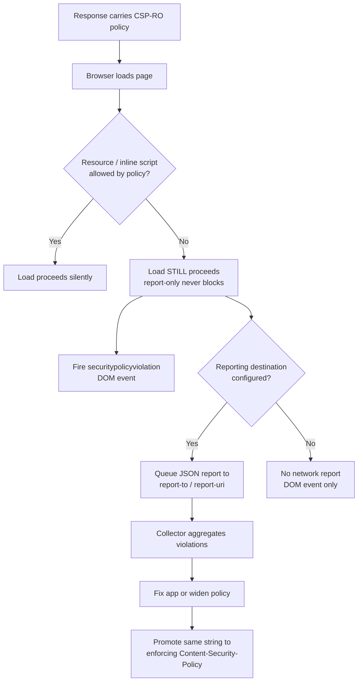
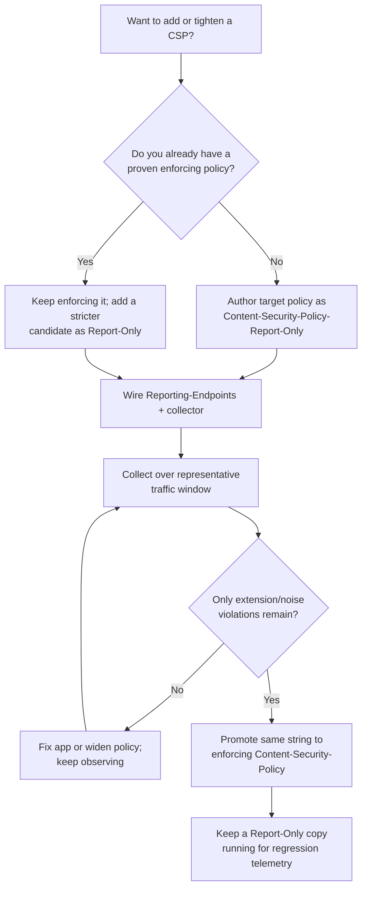

# Content-Security-Policy-Report-Only

## Quick Summary

`Content-Security-Policy-Report-Only` (CSP-RO) is a **response** header that carries the *exact same policy syntax* as [`Content-Security-Policy`](./Content-Security-Policy.md) but with one crucial difference: **it never blocks anything.** When a resource would violate the policy, the browser lets the load proceed as if the policy were not there, and instead fires a `securitypolicyviolation` DOM event and (if a reporting destination is configured) POSTs a JSON violation report. It is the **rollout and telemetry twin** of CSP — the safe, non-breaking way to author, test, and continuously monitor a Content-Security-Policy without risking a broken production site. You author your intended strict policy here first, watch real browsers tell you every place it would have broken, fix your app or widen the policy, and only then promote the same string to the enforcing header. Because enforce and report-only are independent headers, you run **both at once**: a proven policy enforcing today, and a stricter candidate policy reporting for tomorrow's tightening.

## What problem does this header solve?

A strict CSP is the web's best XSS defense, but it is also the single easiest security header to deploy catastrophically. The moment you send an enforcing `Content-Security-Policy: default-src 'self'`, the browser starts *blocking* everything the policy does not explicitly allow: your Google Analytics snippet, your Intercom widget, that one inline `<script>` your CMS injects, the Stripe iframe, the fonts loaded from a CDN, an inline `onclick` a contractor added three years ago. On a real application with dozens of third-party integrations and years of accumulated inline handlers, a first-attempt enforcing policy will break the site for every user, instantly, in production.

The core problem is **you cannot know what your policy will break until real browsers run real pages against it.** Static analysis and staging never capture the full matrix of third-party scripts, A/B-test injections, browser-extension interference, regional CDNs, and legacy code paths that only fire for some users. CSP-RO solves this precisely: it lets the browser evaluate the candidate policy against *every real page load in production* and report every violation **without ever degrading the user experience.** You get the complete, real-world list of what would break — collected from actual traffic — before you flip the switch. It converts "deploy and pray" into "measure, then enforce."

## Why was it introduced?

Report-Only mode has existed since **CSP Level 1** (W3C, ~2012). The CSP designers understood from the outset that an allowlist-based, browser-enforced policy is only useful if operators can adopt it, and that a security control which breaks production on first deploy will simply be turned off and never used. So the specification shipped enforcement and observation as *two separate headers from day one*: `Content-Security-Policy` (enforce) and `Content-Security-Policy-Report-Only` (observe).

The reporting mechanism itself evolved alongside CSP. Level 1/2 used the `report-uri` directive, which POSTed a `application/csp-report` JSON body to a URL. **CSP Level 3** and the broader **Reporting API** introduced `report-to`, which references a named endpoint declared in the [`Reporting-Endpoints`](./Reporting-Endpoints-and-Report-To.md) (or older `Report-To`) header, uses the `application/reports+json` envelope, batches reports, and unifies CSP reporting with other report types (COOP, COEP, deprecations, crashes, NEL). Report-Only is the feature that makes all of this operationally sane: the specification explicitly frames it as *the* supported migration path — author in Report-Only, observe, then enforce.

## How does it work?

The browser parses `Content-Security-Policy-Report-Only` into a policy object identical to an enforcing one. It then evaluates every resource load and script execution against it — but the **disposition** is `"report"` instead of `"enforce"`. On a would-be violation the browser (a) allows the resource anyway, (b) fires a `SecurityPolicyViolationEvent` on the `document`, and (c) queues a violation report to whatever destination the policy names (`report-uri` and/or `report-to`). Enforcing and report-only policies are wholly independent: they have separate directives, separate dispositions, and separate report streams distinguished by a `disposition` field in the report body.

- **Browser behavior:** Parses CSP-RO exactly like CSP but with `disposition: "report"`. It performs the full source-list matching for every fetch, inline script, `eval`, style, frame, form submission, etc., and on a mismatch it **allows the load**, dispatches the DOM event, and sends a report. Multiple `Content-Security-Policy-Report-Only` headers each produce their own independent report stream (unlike enforced policies, whose *intersection* applies, report-only policies do not affect page behavior at all, so they simply each report). Nonces and hashes are validated the same way, which is how you test whether your nonce plumbing actually works before enforcing.
- **Server behavior:** The origin (or edge) *sets* the header. It is purely additive telemetry — the server emits the candidate policy string and, critically, must also emit a [`Reporting-Endpoints`](./Reporting-Endpoints-and-Report-To.md) header (or legacy `Report-To`) if it wants network reports, and must stand up a collector to receive them.
- **Proxy behavior:** Forward proxies pass the header through untouched; it has no caching or connection semantics. The only proxy concern is that a proxy which strips "unknown" headers could drop it.
- **CDN behavior:** CDNs commonly *inject* CSP-RO at the edge (Cloudflare Workers, Fastly VCL, Lambda@Edge) so security teams can roll out and monitor policies without an app deploy. Because CSP-RO is response-header-only and non-caching, the edge can safely add or vary it per-route.
- **Reverse proxy behavior:** Nginx/HAProxy typically `add_header` the CSP-RO value. A common pattern is to enforce a baseline CSP from the app and add a stricter Report-Only candidate at the reverse proxy, keeping the two lifecycles separate.



## HTTP Request Example

CSP-RO is a response header; there is no request form. The request-side artifact is the **violation report** the browser POSTs. Legacy `report-uri` form:

```http
POST /csp-report HTTP/2
Host: example.com
Content-Type: application/csp-report
Content-Length: 287

{
  "csp-report": {
    "document-uri": "https://example.com/checkout",
    "referrer": "",
    "violated-directive": "script-src-elem",
    "effective-directive": "script-src-elem",
    "original-policy": "default-src 'self'; script-src 'self' 'nonce-r4nd0m'; report-uri /csp-report",
    "disposition": "report",
    "blocked-uri": "https://cdn.thirdparty.com/widget.js",
    "status-code": 200,
    "script-sample": ""
  }
}
```

The `disposition: "report"` field is what tells your collector this came from CSP-RO (an enforced-policy violation reads `"enforce"`). Newer browsers using `report-to` send the [Reporting API](./Reporting-Endpoints-and-Report-To.md) envelope with `Content-Type: application/reports+json` instead.

## HTTP Response Example

The canonical rollout shape: a **proven policy enforcing**, a **stricter candidate reporting**, and one `Reporting-Endpoints` header naming both destinations.

```http
HTTP/2 200 OK
Content-Type: text/html; charset=utf-8
Content-Security-Policy: default-src 'self'; script-src 'self' 'unsafe-inline' https://cdn.thirdparty.com; object-src 'none'; report-to csp-enforce
Content-Security-Policy-Report-Only: default-src 'self'; script-src 'self' 'nonce-Xy9Kd2mP' 'strict-dynamic'; object-src 'none'; base-uri 'none'; frame-ancestors 'none'; report-to csp-candidate
Reporting-Endpoints: csp-enforce="https://example.com/csp/enforce", csp-candidate="https://example.com/csp/candidate"
```

Here today's live site is protected by a permissive-but-real enforced policy (still allowing `'unsafe-inline'` because the app isn't nonce-ready yet), while the Report-Only header tests the *strict* nonce-based target. Reports from each land on separate endpoints so you can tell "am I breaking the current policy?" from "would the strict future policy break?".

## Express.js Example

```js
const express = require('express');
const crypto = require('crypto');
const app = express();

// 1) Per-response nonce. The strict CANDIDATE policy relies on it, so we must
//    generate a fresh, unguessable nonce for every single response and make it
//    available to the template that renders <script nonce="...">.
app.use((req, res, next) => {
  res.locals.nonce = crypto.randomBytes(16).toString('base64');
  next();
});

// 2) Declare where reports go. Without Reporting-Endpoints, `report-to` names
//    resolve to nothing and you get DOM events but ZERO network reports.
app.use((req, res, next) => {
  res.set(
    'Reporting-Endpoints',
    'csp-enforce="https://example.com/csp/enforce", ' +
    'csp-candidate="https://example.com/csp/candidate"'
  );
  next();
});

// 3) The two policies, side by side.
app.use((req, res, next) => {
  const nonce = res.locals.nonce;

  // ENFORCING: what actually protects users today. Deliberately conservative so
  // it does not break the live site. Remove this and you have no active defense.
  res.set('Content-Security-Policy',
    "default-src 'self'; " +
    "script-src 'self' 'unsafe-inline' https://cdn.thirdparty.com; " +
    "object-src 'none'; " +
    "report-to csp-enforce");

  // REPORT-ONLY: the strict target we WANT to enforce next quarter. It removes
  // 'unsafe-inline', switches to nonce + 'strict-dynamic', locks base-uri and
  // frame-ancestors. Because it is Report-Only, it can be aggressive without any
  // risk of breaking the page — the browser only reports what WOULD break.
  res.set('Content-Security-Policy-Report-Only',
    "default-src 'self'; " +
    `script-src 'self' 'nonce-${nonce}' 'strict-dynamic'; ` +
    "style-src 'self' 'nonce-" + nonce + "'; " +
    "object-src 'none'; base-uri 'none'; frame-ancestors 'none'; " +
    "report-to csp-candidate");

  next();
});

// 4) The collector for candidate-policy violations. Newer browsers POST the
//    Reporting API envelope (application/reports+json, an ARRAY of reports);
//    older ones POST application/csp-report (a single {"csp-report": {...}}).
//    We must parse BOTH content types or we silently lose half our data.
app.post('/csp/candidate',
  express.json({ type: ['application/reports+json', 'application/csp-report', 'application/json'] }),
  (req, res) => {
    const body = req.body;
    const reports = Array.isArray(body)
      ? body.map(r => r.body)               // Reporting API: [{ type, body, ... }]
      : [body['csp-report'] || body];       // legacy: { "csp-report": {...} }

    for (const r of reports) {
      // Log the two fields that matter for triage: what was blocked, and which
      // directive rejected it. Group by these to build your "fix list".
      console.warn('[CSP-RO]', {
        directive: r['effective-directive'] || r.effectiveDirective,
        blocked: r['blocked-uri'] || r.blockedURL,
        doc: r['document-uri'] || r.documentURL,
      });
    }
    // Always 204: the browser does not care about the body, and returning fast
    // keeps the fire-and-forget report path from backing up.
    res.status(204).end();
  });

app.listen(3000);
```

Every piece is load-bearing: without the per-request nonce the strict candidate would report *every* inline script as a violation (masking real problems); without `Reporting-Endpoints` you get no network reports; parsing only one content type silently drops the other browser family's reports; and running the strict policy as Report-Only (not enforce) is the entire point — it gathers the breakage list with zero user impact.

## Node.js Example

Raw `http` gives no defaults, so you set both headers and route the collector by hand:

```js
const http = require('http');
const crypto = require('crypto');

http.createServer((req, res) => {
  // Collector endpoint.
  if (req.method === 'POST' && req.url === '/csp/candidate') {
    let raw = '';
    req.on('data', c => (raw += c));
    req.on('end', () => {
      try {
        const parsed = JSON.parse(raw);           // both envelopes are JSON
        const list = Array.isArray(parsed) ? parsed : [parsed];
        for (const item of list) {
          const r = item.body || item['csp-report'] || item;
          console.warn('[CSP-RO]', r['effective-directive'] || r.effectiveDirective,
                                   r['blocked-uri'] || r.blockedURL);
        }
      } catch { /* ignore malformed spam */ }
      res.statusCode = 204;                        // fire-and-forget: no body
      res.end();
    });
    return;
  }

  // Page response with a Report-Only candidate policy.
  const nonce = crypto.randomBytes(16).toString('base64');
  res.setHeader('Reporting-Endpoints', 'csp-candidate="/csp/candidate"');
  res.setHeader('Content-Security-Policy-Report-Only',
    `default-src 'self'; script-src 'self' 'nonce-${nonce}' 'strict-dynamic'; ` +
    `object-src 'none'; base-uri 'none'; report-to csp-candidate`);
  res.setHeader('Content-Type', 'text/html');
  res.end(`<!doctype html><script nonce="${nonce}">console.log('ok')</script>`);
}).listen(3000);
```

The contrast with Express: nothing is parsed for you, so you must manually accumulate the request body and defensively `JSON.parse` (report endpoints are public and get spammed with garbage). This is exactly what `helmet` and `express.json` abstract away.

## React Example

React never sets CSP-RO — it has no access to response headers. Its relationship is entirely indirect, but React apps are among the **hardest** to bring under a strict CSP, which makes Report-Only mode indispensable for them:

- **Inline styles and `style` props.** React's `style={{...}}` and many CSS-in-JS libraries (styled-components, Emotion) inject inline `<style>` tags at runtime. A strict `style-src 'self'` will report every one of these. Report-Only mode surfaces the full list so you can either add a nonce integration or switch the library to nonce/hoisted styles *before* enforcing.
- **`dangerouslySetInnerHTML`** can introduce inline scripts that violate `script-src` — CSP-RO flags them.
- **Dev tooling.** Vite/webpack dev servers use inline scripts and `eval` (source maps, HMR). You keep a looser policy in dev and use Report-Only in production to validate the real build.

You can also observe violations client-side, which is invaluable during a React rollout because it gives you the component context the network report lacks:

```jsx
React.useEffect(() => {
  const onViolation = (e) => {
    // e.effectiveDirective, e.blockedURI, e.sourceFile, e.lineNumber
    // Ship to your telemetry with the current route so you can map a violation
    // to the React component/page that caused it.
    fetch('/telemetry/csp', {
      method: 'POST',
      body: JSON.stringify({
        directive: e.effectiveDirective,
        blocked: e.blockedURI,
        source: e.sourceFile,
        line: e.lineNumber,
        route: window.location.pathname,
      }),
      keepalive: true, // survive page unload
    });
  };
  document.addEventListener('securitypolicyviolation', onViolation);
  return () => document.removeEventListener('securitypolicyviolation', onViolation);
}, []);
```

The `securitypolicyviolation` event fires for **both** enforced and report-only policies (check `e.disposition` to tell them apart), so this listener doubles as live monitoring after you promote to enforce.

## Browser Lifecycle

1. **Response arrives.** The browser parses every `Content-Security-Policy` (disposition `enforce`) and `Content-Security-Policy-Report-Only` (disposition `report`) header into independent policy objects.
2. **Resource evaluation.** For each fetch, inline script, `eval`, style, frame, or form submission, the browser finds the governing directive in *each* policy and checks the source/nonce/hash.
3. **Enforced violation** → block the resource, fire `securitypolicyviolation` (`disposition: "enforce"`), queue a report.
4. **Report-Only violation** → **allow** the resource, fire `securitypolicyviolation` (`disposition: "report"`), queue a report. The page behaves exactly as if CSP-RO were absent.
5. **Report delivery.** For `report-to`, reports are batched by the Reporting API and delivered (with retries, out-of-band) to the named [`Reporting-Endpoints`](./Reporting-Endpoints-and-Report-To.md). For legacy `report-uri`, each violation POSTs immediately as `application/csp-report`.
6. **DOM event.** Any page script listening on `securitypolicyviolation` receives the event synchronously, regardless of disposition — this is your zero-infrastructure monitoring hook.

## Production Use Cases

- **Safe first rollout.** Ship your target strict policy as CSP-RO only. Run it across all production traffic for one to two weeks, aggregate the reports, and build the exact list of scripts/styles/frames to allow. Then promote the same string to enforcing.
- **Iterative tightening.** You enforce a moderate policy today and simultaneously run a stricter *candidate* as Report-Only. When the candidate stops generating legitimate violations, promote it to enforce and start a new, even stricter candidate.
- **Permanent regression telemetry.** Keep a Report-Only policy running forever alongside your enforced one. A sudden spike in `script-src` violations to an unknown host is a strong signal of a live injection attack, a compromised third-party dependency, or a rogue browser extension in the wild.
- **Third-party integration validation.** Before adding a new analytics/chat/payment vendor, add their origins to a Report-Only candidate and confirm what they actually load (they often pull sub-resources from undocumented CDNs) before touching the enforced policy.
- **Edge-driven security experiments.** Security teams inject CSP-RO at the CDN/edge to trial policies across the whole fleet without waiting for an application deploy.

## Common Mistakes

- **Treating CSP-RO as protection.** Report-Only **blocks nothing.** A site running *only* `Content-Security-Policy-Report-Only` has no CSP defense at all — an XSS payload executes freely and merely generates a report. Report-Only is a measurement tool, not a control.
- **Shipping CSP-RO with no reporting destination.** Without a [`Reporting-Endpoints`](./Reporting-Endpoints-and-Report-To.md)/`report-uri` and a live collector, you get no network reports and learn nothing. (You still get DOM events, but nobody's listening in production by default.)
- **Confusing the two headers.** Some teams accidentally put the enforcing policy in the Report-Only header (so nothing is protected) or the strict candidate in the enforcing header (so the site breaks). Name your endpoints distinctly (`csp-enforce` vs `csp-candidate`) to keep them straight.
- **Ignoring report noise from extensions.** Browser extensions and injected content frequently trigger CSP-RO violations for URIs you don't control (`chrome-extension:`, `moz-extension:`, injected inline scripts). Filter these out before drawing conclusions, or you'll chase phantom breakage.
- **Promoting too early.** Enforcing before the report stream has gone quiet across *all* user segments (mobile, regional CDNs, logged-in vs anonymous) breaks the site for the untested cohort. Wait for a representative traffic window.
- **Forgetting `report-uri` vs `report-to` browser split.** Older browsers only understand `report-uri`; newer ones prefer `report-to`. Specify both during transition or you lose reports from part of your audience.

## Security Considerations

- **CSP-RO provides zero enforcement** — it must never be your only line of defense. Its security *value* is observational: it is an early-warning system for injection and third-party compromise when run permanently alongside an enforced policy.
- **Report endpoints are attack surface.** They are public, unauthenticated POST targets. Attackers can flood them (DoS/cost), and the report contents (`document-uri`, `referrer`, `script-sample`) are attacker-influenceable — never render them unescaped in a dashboard (stored XSS in your own tooling) and never trust `blocked-uri` as a safe URL.
- **Information leakage in reports.** `document-uri` and `referrer` can contain sensitive path parameters or tokens. The spec already strips some cross-origin data (`blocked-uri` is truncated to the origin for cross-origin resources), but you should still treat report bodies as sensitive and store them accordingly.
- **`script-sample`** includes up to 40 characters of the offending inline script, which can help identify attacks but may also capture snippets of legitimate sensitive inline data — handle with care.
- Because CSP-RO is where you validate your **nonce/hash plumbing**, a rollout that "looks clean" in Report-Only but wasn't actually testing nonces (e.g., nonce not injected into templates) gives false confidence — verify that legitimate inline scripts carry the nonce and do *not* report.

## Performance Considerations

- **Report volume is the primary cost.** A broad Report-Only policy on a high-traffic site can generate an enormous flood of POSTs — one per violation per page view, and a single misconfigured directive can mean dozens of violations per load. This can overwhelm an under-provisioned collector and inflate egress/log costs.
- **Sampling.** Use CSP Level 3 sampling — e.g., send `report-to` to an endpoint but rely on the browser/collector to sample, or set up server-side sampling — to keep volume manageable. For very high traffic, sample a small percentage of sessions rather than all of them.
- **`report-to` batches, `report-uri` doesn't.** The modern Reporting API batches and delivers reports out-of-band with retries and backoff, which is far gentler on both the browser and your collector than the legacy `report-uri`'s immediate-POST-per-violation behavior.
- **No page-load cost from the policy itself.** Parsing an extra header is negligible; the real performance surface is entirely on the reporting/collector side.
- **Duplicate work.** Running enforce + report-only + a candidate means the browser evaluates every resource against multiple policies. This is cheap per-resource but worth knowing if you stack many policies.

## Reverse Proxy Considerations

Add a strict Report-Only candidate at Nginx while the app owns the enforced policy:

```nginx
server {
  location / {
    proxy_pass http://app_upstream;

    # The app already sets an enforcing Content-Security-Policy. Here we add a
    # stricter CANDIDATE in Report-Only to trial a tightening without an app deploy.
    add_header Content-Security-Policy-Report-Only
      "default-src 'self'; script-src 'self' 'strict-dynamic' 'nonce-$request_id'; object-src 'none'; base-uri 'none'; frame-ancestors 'none'; report-to csp-candidate"
      always;

    # Name the destination the report-to token above resolves to.
    add_header Reporting-Endpoints
      "csp-candidate=\"https://example.com/csp/candidate\"" always;
  }

  # Collector, proxied to the reporting service.
  location = /csp/candidate {
    proxy_pass http://report_collector;
  }
}
```

Key points: use `always` so the header is added even on error responses (violations happen on error pages too). Note that `$request_id` is a per-request unique value but is **not** a cryptographic nonce and, more importantly, the reverse proxy cannot inject that same value into the HTML `<script nonce>` — so a real nonce-based candidate must be generated by the app, not the proxy. The proxy pattern works best for source-list (host-based) candidates, not nonce-based ones.

## CDN Considerations

- **Edge injection is the killer feature.** Cloudflare Workers, Fastly Compute, Akamai EdgeWorkers, and Lambda@Edge can attach `Content-Security-Policy-Report-Only` to responses fleet-wide, letting a security team roll out and iterate policies across every property without any origin deploy.
- **Response-header-only, non-caching.** CSP-RO does not participate in cache keys, so the edge can safely add or vary it per route or per cohort (e.g., Report-Only for 5% of traffic).
- **Cloudflare** exposes CSP-RO management in its dashboard and can also aggregate reports. **Fastly** commonly sets it via VCL/Compute. Watch that if *both* the app and the edge set a Report-Only header, the browser evaluates both independently and you get two report streams — name endpoints distinctly to avoid confusion.
- **Report endpoint on the same edge.** Hosting the collector as an edge function (Cloudflare Worker → queue, Lambda → SQS) absorbs the report flood close to users and keeps it off your origin.

## Cloud Deployment Considerations

- **Managed platforms.** Vercel/Netlify/Cloudflare Pages let you set CSP-RO via config (`headers` in `vercel.json`/`_headers`) so you can roll out per-route policies declaratively.
- **API gateways / load balancers** (AWS ALB, API Gateway, GCP LB) pass the header through; some allow injecting response headers at the edge, another place to attach a candidate policy.
- **Collector as a managed function.** Point `report-to` at an API Gateway → Lambda → CloudWatch/Kinesis, or a Cloud Run service, so the report flood scales independently of your app. Rate-limit and sample at the gateway.
- **Observability integration.** Vendors like report-uri.com, Datadog, and Sentry ingest CSP reports directly — pointing `Reporting-Endpoints` at them offloads storage, dedup, and dashboards so you spend effort *fixing* violations, not building plumbing.

## Debugging

- **Chrome DevTools → Console:** every CSP-RO violation logs a `[Report Only]`-prefixed message naming the blocked resource and the violated directive — the fastest way to see what a candidate would break. The **Network** tab shows the report POSTs; filter by your endpoint path.
- **DevTools → Application → (Reporting):** newer Chrome surfaces queued Reporting API reports, including CSP ones, so you can see exactly what will be delivered.
- **curl:** `curl -sD - -o /dev/null https://example.com/ | grep -i 'content-security-policy-report-only\|reporting-endpoints'` confirms the headers are actually emitted (a shockingly common failure is the header never reaching the browser).
- **`securitypolicyviolation` event:** paste a `document.addEventListener('securitypolicyviolation', e => console.log(e.disposition, e.effectiveDirective, e.blockedURI))` into the console to watch violations live, disposition-tagged.
- **Postman / Bruno:** hit your collector endpoint with a sample `application/reports+json` array and a sample `application/csp-report` object to confirm it parses both shapes and returns `204`.
- **Node.js/Express logging:** log grouped violation counts by `effective-directive` + `blocked-uri`; the top few entries are your fix list. A directive whose reports drop to zero is ready to enforce.

## Best Practices

- [ ] Author every new/tightened CSP as `Content-Security-Policy-Report-Only` first — never deploy an enforcing policy blind.
- [ ] Always pair CSP-RO with a [`Reporting-Endpoints`](./Reporting-Endpoints-and-Report-To.md) (and legacy `report-uri`) and a live collector, or you learn nothing.
- [ ] Run enforce + report-only **simultaneously**: proven policy protecting today, stricter candidate reporting for tomorrow.
- [ ] Use **distinct endpoint names** (`csp-enforce`, `csp-candidate`) so you can tell current-policy breakage from candidate breakage.
- [ ] Collect across a **representative traffic window** (mobile, regional, authenticated) before promoting — don't enforce off a weekend's data.
- [ ] Filter out browser-extension noise (`chrome-extension:`, injected inline) before triaging.
- [ ] Sample and rate-limit the collector on high-traffic sites to control report volume and cost.
- [ ] Keep a **permanent** Report-Only policy after enforcing, as live injection/regression telemetry.
- [ ] Never render report contents unescaped in dashboards; treat `document-uri`/`referrer`/`script-sample` as sensitive and untrusted.
- [ ] Verify nonce/hash plumbing actually works in Report-Only (legitimate inline scripts should *not* report).

## Related Headers

- [Content-Security-Policy](./Content-Security-Policy.md) — the enforcing header; CSP-RO is its non-breaking twin with identical syntax. You author here, then promote the exact same string there.
- [Reporting-Endpoints / Report-To](./Reporting-Endpoints-and-Report-To.md) — declare the named destinations that CSP's `report-to` directive references; the Reporting API delivery layer for all report types.
- [NEL](./NEL.md) — Network Error Logging, another Reporting-API consumer; CSP-RO reports network violations, NEL reports network *failures*, and both flow through the same `Reporting-Endpoints` plumbing.
- [Cross-Origin-Opener-Policy](./Cross-Origin-Opener-Policy.md) and [Cross-Origin-Embedder-Policy](./Cross-Origin-Embedder-Policy.md) — also have Report-Only variants and use the same Reporting API for their violation reports.
- [Strict-Transport-Security](./Strict-Transport-Security.md) — another security header, but note it has *no* report-only mode, which is exactly why HSTS rollout (with its long `max-age` commitment) is riskier than CSP rollout.

## Decision Tree



## Mental Model

`Content-Security-Policy-Report-Only` is a **dress rehearsal with a stenographer.** The enforcing CSP is opening night: if an actor (resource) isn't on the approved cast list, security throws them out and the audience notices. Report-Only is the rehearsal — the same script, the same cast list, but nobody gets ejected. Instead a stenographer in the wings writes down every single time someone who *wasn't* on the list walked on stage. You run the rehearsal against real performances (production traffic), read the stenographer's notes (the violation reports), and either add the missing actors to the official list or cut them from the show. Only when a rehearsal runs with an empty notebook do you promote that exact script to opening night — and even then you keep a stenographer permanently in the wings, because if an uninvited actor ever wanders on during a real performance, that's your first sign someone broke into the theater.
