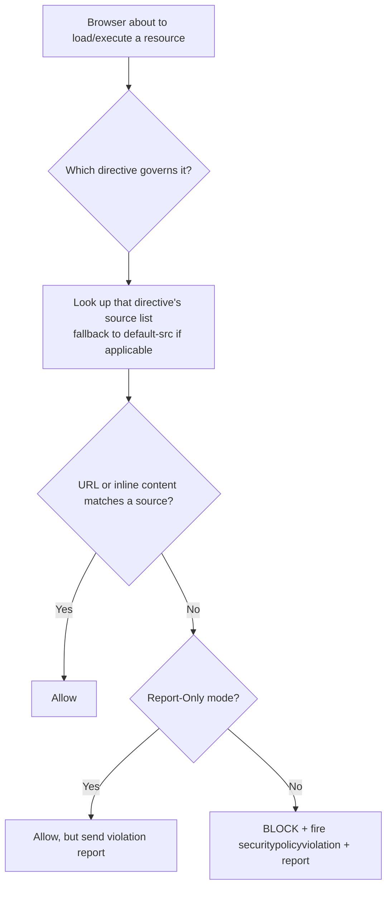
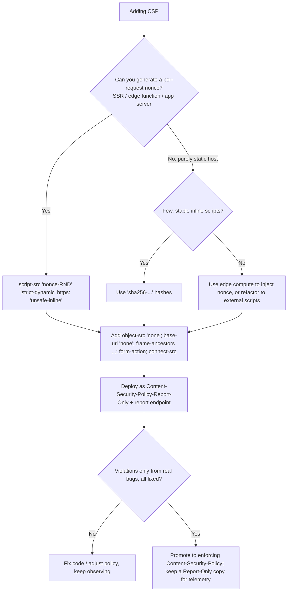

# Content-Security-Policy

## Quick Summary

`Content-Security-Policy` (CSP) is a **response** header — the single most powerful defense-in-depth control the web platform offers. It is an allowlist, enforced by the browser, declaring **which sources of content the page is permitted to load and execute**: which origins scripts may come from, whether inline scripts run, where the page may connect (`fetch`/XHR/WebSocket), what can frame it and what it can frame, where forms may submit, and more. Its headline job is to **neuter Cross-Site Scripting (XSS)**: even if an attacker injects `<script>` into your HTML, a good CSP means the browser refuses to execute it. Secondary jobs: clickjacking defense (`frame-ancestors`), blocking data exfiltration (`connect-src`), stopping mixed content, and controlling plugins/embeds. It is set by the server/edge, enforced entirely client-side, ships with a **Report-Only** mode for safe rollout, and is notoriously easy to get wrong — a policy with `'unsafe-inline'` in `script-src` provides essentially *no* XSS protection.

## What problem does this header solve?

**XSS is the problem.** Decades of web apps concatenate untrusted data into HTML. Any miss — one unescaped user field, one `dangerouslySetInnerHTML`, one vulnerable dependency — lets an attacker inject markup that the browser runs *with the full authority of your origin*: it can read `document.cookie` (if not `HttpOnly`), forge requests with the user's session, keylog, exfiltrate the DOM, or pivot to the internal network. Output encoding and input validation are the primary defense, but they are 100%-or-nothing: a single gap is total compromise.

CSP is the **second wall**. It assumes injection *will* happen and limits the blast radius:

- **Injected `<script>alert(document.cookie)</script>`** — blocked, because inline scripts aren't allowed (no `'unsafe-inline'`, no matching nonce/hash).
- **Injected `<script src="https://evil.com/x.js">`** — blocked, because `evil.com` isn't in `script-src`.
- **Injected ``** — the inline `onerror` handler won't execute (inline event handlers are inline script), *and* `connect-src` can forbid the connection to `evil.com` even if it did.
- **A malicious `<iframe>` overlaying your UI to trick clicks (clickjacking)** — `frame-ancestors` decides who may frame you; a page framing yours from `evil.com` is denied.
- **Exfiltration via a rogue `<form action="https://evil.com">`** — `form-action` restricts submission targets.

CSP converts "one injection = full origin compromise" into "one injection = maybe a broken image," provided the policy is strict.

## Why was it introduced?

CSP grew out of research by Mozilla (Brandon Sterne) and the observation that XSS was — and remains — the most prevalent serious web vulnerability. **CSP Level 1** was a W3C spec around 2012 (shipping as `X-Content-Security-Policy`/`X-WebKit-CSP` prefixed headers first). **CSP Level 2 (2015)** standardized the unprefixed `Content-Security-Policy` header and added **nonces** and **hashes** (so you could allow *specific* inline scripts without opening the floodgates with `'unsafe-inline'`), plus `frame-ancestors`, `base-uri`, `form-action`. **CSP Level 3** added **`'strict-dynamic'`**, `worker-src`, `manifest-src`, the newer `Report-To`/reporting API, and hash-based external script allowlisting.

The historical alternatives it superseded/absorbed:

- **`X-Frame-Options`** (clickjacking) → subsumed by `frame-ancestors`, which is more expressive.
- Ad-hoc **input sanitization only** → CSP adds enforcement the browser guarantees regardless of server-side bugs.
- **`X-XSS-Protection`** (the buggy, now-removed browser XSS auditor) → replaced by real CSP.

CSP's design philosophy: *declarative allowlisting the browser enforces, with a non-breaking observability mode (Report-Only) so operators can measure before enforcing.*

## How does it work?

A CSP is a set of **directives**, semicolon-separated; each directive is a name followed by a space-separated list of **source expressions**:

```
Content-Security-Policy: default-src 'self'; script-src 'self' https://cdn.example.com; object-src 'none'
```

When the browser is about to fetch/execute a resource, it finds the **governing directive** for that resource type and checks the URL/inline-content against that directive's source list. If nothing matches, the load is **blocked** and (optionally) reported.

### Directives — what each governs

| Directive | Controls |
|---|---|
| `default-src` | Fallback for most `*-src` directives that are absent. The backbone of a policy. |
| `script-src` | JavaScript: `<script>`, inline scripts, `eval`, event handlers, `javascript:` URLs. **The XSS-critical one.** |
| `script-src-elem` / `script-src-attr` | Finer split: `<script>` elements vs inline event-handler attributes. |
| `style-src` | CSS: `<style>`, `<link rel=stylesheet>`, inline `style=`, `style.innerHTML`. |
| `img-src` | Images and favicons. |
| `connect-src` | `fetch`, XHR, `WebSocket`, `EventSource`, `navigator.sendBeacon`, `<a ping>`. **Exfiltration control.** |
| `font-src` | `@font-face` sources. |
| `frame-src` | What may be loaded *into* iframes on this page. |
| `frame-ancestors` | Who may embed *this* page in a frame. **Clickjacking control; supersedes `X-Frame-Options`.** |
| `child-src` | Legacy fallback for `frame-src` + `worker-src`. |
| `worker-src` | Web/Shared/Service workers. |
| `manifest-src` | Web app manifest. |
| `media-src` | `<audio>`/`<video>`/`<track>`. |
| `object-src` | `<object>`/`<embed>` (plugins). Best practice: `'none'`. |
| `base-uri` | Restricts `<base href>` — stops attackers rewriting relative-URL resolution. Set to `'self'` or `'none'`. |
| `form-action` | Allowed `<form action>` targets. Stops form-based exfiltration/phishing redirects. |
| `frame-ancestors`, `base-uri`, `form-action` | **Do not fall back to `default-src`** — you must set them explicitly. |
| `upgrade-insecure-requests` | Rewrites all `http://` subresource URLs to `https://` before fetching (a boolean directive, no value). |
| `block-all-mixed-content` | (deprecated) Blocks HTTP subresources on HTTPS pages; largely replaced by upgrade + browser default blocking. |
| `sandbox` | Applies iframe-sandbox-like restrictions to the page itself. |
| `report-uri` (deprecated) / `report-to` | Where to POST violation reports. |

### Source expressions — the allowlist vocabulary

- **`'self'`** — the page's own origin (scheme+host+port). Not subdomains.
- **`'none'`** — nothing; blocks everything for that directive. `object-src 'none'` is standard.
- **Host/scheme sources** — `https://cdn.example.com`, `*.example.com`, `https:`, `data:` (allows `data:` URIs — risky for scripts).
- **`'unsafe-inline'`** — allows inline `<script>`, `<style>`, `on*=` handlers, `javascript:` URLs. **In `script-src` this defeats CSP's XSS protection** — an injected inline script is now allowed.
- **`'unsafe-eval'`** — allows `eval`, `new Function`, `setTimeout("string")`, etc. Needed by some legacy libs; avoid.
- **`'nonce-<base64>'`** — allow a specific inline script/style that carries a matching `nonce` attribute. The nonce must be **unpredictable and per-response**.
- **`'sha256-<base64>'`** (or sha384/512) — allow a specific inline script/style whose content hashes to this value. Good for static inline snippets.
- **`'strict-dynamic'`** — see below; the key to a modern, maintainable strict CSP.
- **`'unsafe-hashes'`** — allow specific inline event handlers by hash without allowing all inline.
- **`'wasm-unsafe-eval'`** — allow WebAssembly compilation without full `'unsafe-eval'`.

### Nonces, hashes, and `'strict-dynamic'` — the modern strict policy

The old way to allow your own inline scripts was `'unsafe-inline'` — which also allows the *attacker's* inline scripts. Useless. The modern way:

- **Nonce:** the server generates a fresh random value per response, puts it in the header (`script-src 'nonce-r4nd0m'`) and on each legit inline `<script nonce="r4nd0m">`. The browser runs only scripts bearing the matching nonce; the attacker can't guess it (it changes every response), so injected scripts are blocked. **The nonce must be cryptographically random and unique per response**, never reused or predictable.
- **Hash:** for static inline scripts, put `'sha256-…'` of the exact script text in the policy. No per-response work, but you must recompute on every content change.
- **`'strict-dynamic'`:** the problem with host allowlists (`script-src https://cdn.example.com …`) is they're both leaky (an open redirect or JSONP endpoint on an allowed host can be abused) and brittle (long, hard to maintain, and studies showed the majority of real-world allowlists were trivially bypassable). `'strict-dynamic'` says: **"trust scripts loaded by an already-trusted (nonce/hash'd) script, and ignore host allowlists entirely."** So you nonce your one bootstrap script; it can then dynamically inject the scripts *it* trusts (your bundler chunks, third-party tags it chose), and those inherit trust — without you maintaining a host allowlist. Injected `<script src>` from an attacker has no nonce and wasn't loaded by a trusted script, so it's blocked. This is the Google-recommended shape of a strong CSP.

A recommended strict policy (CSP3):

```
Content-Security-Policy:
  script-src 'nonce-{RANDOM}' 'strict-dynamic' https: 'unsafe-inline';
  object-src 'none';
  base-uri 'none';
  require-trusted-types-for 'script';
```

The `https:` and `'unsafe-inline'` here are **deliberate fallbacks for old browsers**: CSP3-aware browsers honor the nonce + `'strict-dynamic'` and *ignore* `'unsafe-inline'` and host allowlists; CSP1/2 browsers ignore `'strict-dynamic'` and fall back to `https:`/`'unsafe-inline'`. Graceful degradation, not a hole (modern browsers ignore the weak parts).

- **Browser behavior:** Parses every CSP header (multiple headers/policies combine — the *intersection* of all policies must allow a load, i.e., adding a second policy can only *tighten*). For each resource, selects the governing directive and checks the source. On violation: blocks the load (or, in Report-Only, allows it) and dispatches a `securitypolicyviolation` DOM event + optionally POSTs a JSON report. Inline scripts/styles are checked against nonce/hash/`'unsafe-inline'`. `eval` is gated by `'unsafe-eval'`.
- **Server behavior:** Generates the policy (and per-response nonce). No enforcement server-side — the browser does it. For SSR, the server must inject the nonce into both the header and the rendered `<script>` tags.
- **Proxy behavior:** Forwards the header (end-to-end). A proxy that rewrites HTML (injecting analytics, etc.) can *break* CSP by adding inline scripts without a nonce — a real gotcha with some enterprise proxies/ad injectors.
- **CDN behavior:** Can add/override CSP at the edge. Edge workers (Cloudflare Workers, Lambda@Edge) are a common place to inject a per-response nonce, since a static CDN can't generate randomness per response without compute.
- **Reverse proxy behavior:** Nginx/Apache commonly set a *static* CSP (no nonce). To use nonces you need dynamic generation, which usually means the app or an edge function, not a static `add_header`.



## HTTP Request Example

CSP is response-only. The related request-side artifacts are **violation reports** the browser POSTs when a policy is violated (to your `report-uri`/`report-to` endpoint):

```http
POST /csp-report HTTP/2
Host: example.com
Content-Type: application/csp-report

{
  "csp-report": {
    "document-uri": "https://example.com/page",
    "referrer": "",
    "violated-directive": "script-src-elem",
    "effective-directive": "script-src-elem",
    "original-policy": "default-src 'self'; script-src 'self' 'nonce-abc'",
    "blocked-uri": "https://evil.example/inject.js",
    "status-code": 200
  }
}
```

(The newer Reporting API uses `Content-Type: application/reports+json` and a slightly different envelope via `Report-To`/`Reporting-Endpoints`.)

## HTTP Response Example

A strict, nonce-based production policy (note the per-response nonce and reporting):

```http
HTTP/2 200 OK
content-type: text/html; charset=utf-8
content-security-policy: default-src 'self'; script-src 'self' 'nonce-Xy9Kd2mP' 'strict-dynamic' https: 'unsafe-inline'; style-src 'self' 'nonce-Xy9Kd2mP'; img-src 'self' data: https://images.cdn.example.com; connect-src 'self' https://api.example.com; font-src 'self'; object-src 'none'; base-uri 'none'; form-action 'self'; frame-ancestors 'none'; upgrade-insecure-requests; report-to csp-endpoint
reporting-endpoints: csp-endpoint="https://example.com/csp-report"
```

Report-Only mode (measure without breaking anything):

```http
HTTP/2 200 OK
content-security-policy-report-only: default-src 'self'; script-src 'self' 'nonce-Xy9Kd2mP' 'strict-dynamic'; report-to csp-endpoint
reporting-endpoints: csp-endpoint="https://example.com/csp-report"
```

## Express.js Example

Use `helmet.contentSecurityPolicy`. The critical production pattern is **per-request nonce generation** wired into both the header and your SSR templates.

```js
const express = require('express');
const helmet = require('helmet');
const crypto = require('crypto');

const app = express();

// 1) Generate a fresh, unpredictable nonce for EVERY response, before Helmet runs.
app.use((req, res, next) => {
  // 16 random bytes, base64. Must be per-response and unguessable — reuse or predictability
  // lets an attacker's injected <script nonce="..."> match and execute. This is the whole point.
  res.locals.cspNonce = crypto.randomBytes(16).toString('base64');
  next();
});

// 2) Build the policy, referencing the nonce via a function (Helmet calls it per request).
app.use(
  helmet.contentSecurityPolicy({
    useDefaults: true, // start from Helmet's sane baseline, then override — don't hand-list everything.
    directives: {
      defaultSrc: ["'self'"],
      scriptSrc: [
        "'self'",
        // Helmet substitutes the actual nonce per response. WITHOUT this, none of your
        // inline SSR scripts run under a strict policy.
        (req, res) => `'nonce-${res.locals.cspNonce}'`,
        "'strict-dynamic'", // trust scripts our nonce'd bootstrap loads; ignore host allowlist in modern browsers.
        'https:',           // fallback for CSP2 browsers that ignore 'strict-dynamic'.
      ],
      styleSrc: ["'self'", (req, res) => `'nonce-${res.locals.cspNonce}'`],
      imgSrc: ["'self'", 'data:', 'https://images.cdn.example.com'],
      connectSrc: ["'self'", 'https://api.example.com'], // ONLY where the app may fetch/WebSocket. Blocks exfil.
      objectSrc: ["'none'"],  // kill Flash/plugin injection vectors outright.
      baseUri: ["'none'"],    // stop <base> hijacking of relative URLs. Does NOT inherit from default-src.
      formAction: ["'self'"], // forms may only submit to us. Does NOT inherit from default-src.
      frameAncestors: ["'none'"], // clickjacking: nobody may frame us. Supersedes X-Frame-Options.
      upgradeInsecureRequests: [], // empty array => emit the boolean directive; upgrades http subresources.
    },
    // reportOnly: true, // flip this during rollout to observe without blocking.
  })
);
```

Line-by-line consequences:

- **Nonce middleware** — remove it and `res.locals.cspNonce` is undefined; every inline script is blocked (nonce is empty) or, worse, you fall back to `'unsafe-inline'` and lose XSS protection.
- **`useDefaults: true`** — inherits Helmet's baseline (`default-src 'self'`, `object-src 'none'`, `base-uri 'self'`, `form-action 'self'`, etc.). Removing it means any directive you forget is simply absent (and falls back to `default-src`, or nothing for the non-inheriting three).
- **`scriptSrc` nonce function** — Helmet evaluates it per response, injecting the current nonce. A static string here would reuse one nonce forever (predictable → useless).
- **`'strict-dynamic'`** — lets your bootstrap chunk load the rest without a host allowlist; drop it and you're back to maintaining a brittle list of every CDN.
- **`connectSrc`** — the exfiltration wall. Omit it and it falls back to `default-src 'self'`; if `default-src` were broadened you'd silently allow beacons to arbitrary hosts.
- **`objectSrc 'none'`, `baseUri 'none'`** — classic CSP-bypass vectors closed. `base-uri` and `form-action` and `frame-ancestors` **do not inherit** `default-src`, so they must be explicit.
- **`upgradeInsecureRequests: []`** — empty array emits the valueless directive; complements HSTS. Remove and a stray `http://` image on an HTTPS page becomes mixed content.
- **`reportOnly`** — during rollout, set `true`, ship it, watch reports, fix violations, then enforce.

Render the nonce in your SSR HTML (whatever template engine / React SSR you use):

```js
app.get('/', (req, res) => {
  res.send(`<!doctype html><html><head>
    <script nonce="${res.locals.cspNonce}">window.__BOOT__ = ${JSON.stringify({ ok: true })}</script>
  </head><body><div id="root"></div>
    <script nonce="${res.locals.cspNonce}" src="/bundle.js"></script>
  </body></html>`);
});
```

Any inline `<script>` without the matching `nonce` attribute — including anything an attacker injects — will not execute.

## Node.js Example

Raw `http` with a nonce, no Helmet — to expose the mechanics:

```js
const http = require('http');
const crypto = require('crypto');

http
  .createServer((req, res) => {
    const nonce = crypto.randomBytes(16).toString('base64'); // per-response, unpredictable

    res.setHeader(
      'Content-Security-Policy',
      [
        "default-src 'self'",
        `script-src 'nonce-${nonce}' 'strict-dynamic' https: 'unsafe-inline'`,
        "object-src 'none'",
        "base-uri 'none'",
        "frame-ancestors 'none'",
      ].join('; ')
    );

    res.writeHead(200, { 'Content-Type': 'text/html' });
    // The nonce in the tag MUST equal the nonce in the header, or the script is blocked.
    res.end(`<script nonce="${nonce}">console.log('allowed')</script>`);
  })
  .listen(3000);
```

The takeaway mirrors HSTS: CSP is *just headers + matching markup*; all enforcement is the browser's. The only non-trivial part is threading a fresh nonce through both.

## React Example

React itself renders no inline scripts in normal usage (JSX becomes DOM via the bundle), so a plain CSR SPA usually needs only a host/nonce policy for its bundle and API. The friction points are **SSR** and **inline styles/data**:

- **`dangerouslySetInnerHTML`** injects raw HTML; if it ever contains a `<script>`, CSP (no `'unsafe-inline'`) will block it — which is exactly the safety you want, but be aware.
- **Inline styles** (`style={{...}}`) are set via the CSSOM (`element.style`), which CSP's `style-src` treats as inline styling. Strict `style-src` without `'unsafe-inline'` **can break `style={{}}`** unless you use a nonce-friendly approach or hashes; many teams allow `'unsafe-inline'` for styles only (styles are a much smaller XSS risk than scripts) or migrate to CSS classes/CSS-in-JS that emits `<style nonce>`.
- **SSR (Next.js / Remix / custom):** you must generate a nonce per request and put it on every `<script>` React emits.

**Next.js** nonce pattern via middleware (App Router):

```js
// middleware.js — runs per request at the edge/server, so it can generate a nonce.
import { NextResponse } from 'next/server';

export function middleware(request) {
  const nonce = Buffer.from(crypto.randomUUID()).toString('base64'); // per-request nonce

  const csp = [
    `default-src 'self'`,
    // 'strict-dynamic' lets Next's bootstrap load its chunks without a host allowlist.
    `script-src 'self' 'nonce-${nonce}' 'strict-dynamic' https:`,
    `style-src 'self' 'nonce-${nonce}'`,
    `object-src 'none'`,
    `base-uri 'none'`,
    `frame-ancestors 'none'`,
  ].join('; ');

  const requestHeaders = new Headers(request.headers);
  // Next reads this header and stamps the nonce onto the <script> tags it renders. Without it,
  // Next's own inline scripts would be blocked by a strict, nonce-based CSP.
  requestHeaders.set('x-nonce', nonce);
  requestHeaders.set('Content-Security-Policy', csp);

  const response = NextResponse.next({ request: { headers: requestHeaders } });
  response.headers.set('Content-Security-Policy', csp); // also send to the browser
  return response;
}
```

In a Server Component you read the nonce (`headers().get('x-nonce')`) and pass it to any manual `<script nonce={nonce}>`; Next automatically nonces its framework scripts when it detects a nonce in the CSP. This is the canonical "nonces in SSR" story: **the same random value must appear in the header and on every inline script React/Next emits for that response.**

For CSR-only React on a static host, you can't generate per-request nonces (no server compute), so use either **hashes** of your (few) inline scripts or an edge function to inject nonces — a purely static file server can't do nonce-based CSP correctly.

## Browser Lifecycle

1. **Response arrives**; browser parses all `Content-Security-Policy` (enforced) and `Content-Security-Policy-Report-Only` (observed) headers. Multiple policies all apply; a load must satisfy *every* enforced policy.
2. **HTML parsing / resource discovery.** As each `<script>`, ``, `<link>`, `fetch`, etc. is encountered, the browser resolves the governing directive.
3. **Inline script/style check** — must match a nonce (attribute equals a `'nonce-…'` in the policy), a hash, or `'unsafe-inline'`; otherwise blocked before execution.
4. **External resource check** — URL matched against the directive's source list (host, scheme, `'self'`, `'strict-dynamic'` chain).
5. **`eval`/`new Function`** gated at call time by `'unsafe-eval'`.
6. **On violation:** the resource is blocked (or allowed in Report-Only); a `SecurityPolicyViolationEvent` fires on `document`; a report is queued to `report-uri`/`report-to`.
7. **Navigation/framing checks** — `frame-ancestors` is evaluated when *another* page tries to frame this one (checked on the framed response). `form-action` at submit time. `base-uri` when a `<base>` is parsed.

## Production Use Cases

- **XSS mitigation on any app rendering user content** — comments, dashboards, CMS, email clients. A strict nonce+`'strict-dynamic'` policy is the goal.
- **Clickjacking protection** via `frame-ancestors 'none'` (or `'self'`), replacing `X-Frame-Options` — banking, admin panels, anything with state-changing clicks.
- **Third-party script governance** — locking down which analytics/ads/tag-manager scripts can run; a compromised third-party tag can't pull in arbitrary code if `'strict-dynamic'` gates it.
- **Data-exfiltration prevention** — `connect-src` restricting where the app may beacon, containing a compromised dependency's ability to phone home.
- **Enforcing HTTPS subresources** — `upgrade-insecure-requests` during an HTTP→HTTPS migration alongside [Strict-Transport-Security](./Strict-Transport-Security.md).
- **Report-Only telemetry** — running CSP-RO permanently in parallel to catch regressions and spot injection attempts in the wild.

## Common Mistakes

- **`script-src 'unsafe-inline'`** — the cardinal sin. It re-allows exactly the injected inline scripts CSP exists to block. A nonce/hash present *without* `'strict-dynamic'` and *alongside* `'unsafe-inline'` still ignores the nonce in old browsers... but the real issue is people add `'unsafe-inline'` to "make things work" and silently gut the policy. (Note: when a nonce or hash is present, modern browsers **ignore** `'unsafe-inline'` — that's the intended graceful fallback — but relying on `'unsafe-inline'` alone provides no protection.)
- **`'unsafe-eval'` for convenience** — opens `eval`-based injection; often added to satisfy a legacy lib. Prefer replacing the lib or using `'wasm-unsafe-eval'`/Trusted Types.
- **Reusing or hard-coding a nonce** — a static or predictable nonce is guessable/reusable by the attacker and no better than `'unsafe-inline'`.
- **Over-broad allowlists** — `script-src 'self' https:` or `*` allows most of the web; open redirects/JSONP on allowed hosts become bypasses. This is why `'strict-dynamic'` (drop host allowlists) is preferred.
- **Forgetting `base-uri` and `object-src`** — both are common CSP bypass vectors (`<base>` hijack, plugin injection). Set `base-uri 'none'`, `object-src 'none'`.
- **Assuming `default-src` covers everything** — `frame-ancestors`, `form-action`, `base-uri`, `report-*`, `sandbox`, `upgrade-insecure-requests` **do not** fall back to `default-src`.
- **Deploying enforce mode blindly** — breaks the site (blocked scripts/styles). Always Report-Only first, then enforce.
- **Setting CSP via `<meta http-equiv>` and expecting `frame-ancestors`/`report-uri`/sandbox to work** — several directives are **ignored** in the meta form; use the HTTP header for anything security-critical.
- **Ignoring inline styles in React** — strict `style-src` can break `style={{}}` and CSS-in-JS; plan for it (nonce'd `<style>`, hashes, or allow inline styles only).
- **Not monitoring reports** — without a report endpoint you're flying blind on both breakage and real attack attempts.

## Security Considerations

- **CSP is defense-in-depth, not a replacement for output encoding.** A strict CSP contains XSS; correct escaping *prevents* it. Do both.
- **Strictness ranking:** nonce + `'strict-dynamic'` (best) > hashes > tight host allowlist > `'unsafe-inline'`/`*` (no real protection). Aim for the top.
- **`'strict-dynamic'` neutralizes the "allowlist bypass" class** (open redirect/JSONP on an allowlisted CDN) by ignoring host allowlists entirely in favor of propagated trust.
- **`base-uri` and `object-src`** close two well-known bypasses; treat them as mandatory in any hardened policy.
- **Trusted Types (`require-trusted-types-for 'script'`)** is the CSP3 capstone against DOM XSS: it forces dangerous sinks (`innerHTML`, `script.src`, etc.) to accept only typed, sanitized values, eliminating most DOM-XSS at the source. Pair with a strict `script-src`.
- **Report endpoints can leak** URLs/referrers and be spammed; validate/sample reports, and don't trust their contents.
- **CSP does not stop CSRF** (use SameSite cookies/tokens) or protect data at rest — it's about what the *page* may load/do.
- **`frame-ancestors` is the modern clickjacking control** — see [X-Frame-Options](./X-Frame-Options.md); when both are present, browsers that support `frame-ancestors` prefer it.

## Performance Considerations

- **Header size** — strict policies with many directives/hosts can be several hundred bytes to a couple KB. On HTTP/2/3 with HPACK/QPACK, a *stable* policy compresses well across a connection; a per-response **nonce changes every response**, so that portion can't be compressed away — keep the policy otherwise stable and reasonably short.
- **Nonce generation** — 16 random bytes per response is negligible CPU (`crypto.randomBytes`), but it means responses can't be cached identically at a shared cache if the nonce is in the cached HTML. Cache *around* the nonce (edge-inject) or accept that nonce'd HTML is per-response.
- **`'strict-dynamic'` shrinks the policy** (no long host allowlist) — a maintainability *and* size win.
- **Enforcement is cheap** for the browser (allowlist checks); the real cost is developer/operational time to build and maintain a correct policy.
- **Report volume** — a broad Report-Only policy on a high-traffic site can generate huge report traffic; sample and rate-limit the endpoint.

## Reverse Proxy Considerations

Static CSP (no nonce) is easy in Nginx; nonce-based CSP is not, because Nginx can't easily thread a per-response value into both header and HTML.

```nginx
# Static policy (no nonce). 'always' emits it on error responses too.
add_header Content-Security-Policy "default-src 'self'; object-src 'none'; base-uri 'none'; frame-ancestors 'none'; upgrade-insecure-requests" always;
```

Beware Nginx's `add_header` inheritance: any `add_header` in a nested `location` drops CSP set at the `server` level — re-declare or centralize via `include`. For **nonces**, generate them in the app or an edge function; a common pattern is Nginx setting a static baseline and the app overriding with a nonce'd policy for HTML responses. Do **not** have two components each emit a full CSP header unintentionally — multiple enforced policies intersect (only tighten), which can block legitimate loads unexpectedly. Also ensure HTML-rewriting proxies/ad-injectors don't insert non-nonce'd inline scripts that your policy will (correctly) block.

## CDN Considerations

- **Static CDNs** can serve a static CSP fine but can't generate per-response nonces — use **edge compute** (Cloudflare Workers, Lambda@Edge, Fastly Compute) to inject a nonce into both the header and the streamed HTML, or use hashes.
- **Edge-injected nonce pattern:** the worker generates a nonce, streams the HTML replacing a placeholder token with the nonce, and sets the header — keeping the origin cacheable.
- **CDN feature managers** (Cloudflare "Managed Transforms"/response header rules) can add a baseline CSP; confirm they don't conflict with the app's header (two policies intersect).
- **Third-party CDN scripts** you load must be covered — `'strict-dynamic'` avoids listing them individually if your bootstrap loads them.
- **HTML caching + nonce** — cache the HTML with a placeholder and substitute per request at the edge, or mark nonce'd HTML `Cache-Control: private, no-store`.

## Cloud Deployment Considerations

- **AWS CloudFront** — a **response headers policy** can add a *static* CSP; for nonces use **Lambda@Edge / CloudFront Functions** to inject per-request. API Gateway can add headers via gateway responses.
- **Vercel/Netlify** — static CSP via config file; nonces via middleware/edge functions (Next.js middleware pattern above).
- **GCP/Azure** — external HTTPS LB / Front Door header rules for static policy; app or edge functions for nonces.
- **Serverless/SSR functions** are the natural home for nonce generation since they run per request.
- **Multiple layers each capable of setting CSP** (edge + app) — decide one authoritative owner for the *enforced* policy to avoid unintended intersection; you *may* intentionally add a second Report-Only policy for telemetry.

## Debugging

- **Chrome DevTools:** Console shows explicit `Refused to … because it violates the following Content Security Policy directive: "…"` messages naming the blocked resource and the offending directive — the fastest way to iterate. Network tab → response Headers to confirm the exact policy sent. The **Application → Frames** and the `securitypolicyviolation` event help too.
- **`securitypolicyviolation` event:** `document.addEventListener('securitypolicyviolation', e => console.log(e.violatedDirective, e.blockedURI))` — programmatic visibility into what's blocked.
- **curl:** `curl -sI https://example.com | grep -i content-security-policy` (use `-i`/`-D -` to see the raw, possibly long, header; note curl doesn't enforce CSP, it just shows it).
- **Postman / Bruno:** inspect the response header value; they don't enforce, so useful to read the exact policy and diff across environments.
- **Node.js:** in a smoke test, assert the header: `https.get(url, r => assert(/script-src[^;]*nonce-/.test(r.headers['content-security-policy'])))`.
- **Express logging:** log `res.getHeader('Content-Security-Policy')` on `finish` in dev; in tests use supertest `.expect('Content-Security-Policy', /object-src 'none'/)`.
- **Report endpoint:** stand up `/csp-report` early (even just logging) so you see violations from real browsers during Report-Only rollout. Google's **CSP Evaluator** tool scores a policy's strictness and flags bypasses.

## Best Practices

- [ ] **Report-Only first**, measure, fix, then enforce.
- [ ] Target a **strict policy**: `script-src 'nonce-{random}' 'strict-dynamic'` with `https:`/`'unsafe-inline'` fallbacks for old browsers.
- [ ] Generate a **fresh, unpredictable nonce per response**; thread it into the header and every inline `<script>`.
- [ ] Never rely on `'unsafe-inline'` in `script-src`; avoid `'unsafe-eval'`.
- [ ] Set `object-src 'none'`, `base-uri 'none'` — close common bypasses.
- [ ] Set `frame-ancestors` explicitly (it doesn't inherit `default-src`); also keep [X-Frame-Options](./X-Frame-Options.md) for legacy.
- [ ] Set `form-action` and `connect-src` to contain phishing/exfiltration.
- [ ] Add `upgrade-insecure-requests` and pair with [HSTS](./Strict-Transport-Security.md).
- [ ] Use the **HTTP header**, not `<meta>`, for security-critical directives.
- [ ] Wire a **report endpoint** (`Reporting-Endpoints` + `report-to`) and keep a permanent Report-Only policy for telemetry.
- [ ] Consider **Trusted Types** (`require-trusted-types-for 'script'`) to kill DOM XSS.
- [ ] Use `helmet.contentSecurityPolicy` with `useDefaults` and per-request nonce functions.
- [ ] Validate with **CSP Evaluator**; keep the policy short via `'strict-dynamic'`.

## Related Headers

- [X-Frame-Options](./X-Frame-Options.md) — `frame-ancestors` supersedes it; ship both for coverage across browser versions.
- [X-Content-Type-Options](./X-Content-Type-Options.md) — `nosniff` complements CSP by stopping MIME-confusion script execution CSP's `script-src` also guards.
- [Strict-Transport-Security](./Strict-Transport-Security.md) — transport-level HTTPS enforcement; CSP's `upgrade-insecure-requests` is the content-level counterpart.
- `Content-Security-Policy-Report-Only` — same syntax, non-enforcing; the rollout/telemetry twin (dedicated page).
- `Reporting-Endpoints` / `Report-To` — carry the reporting destinations CSP's `report-to` references.
- [Cross-Origin-Opener-Policy](./Cross-Origin-Opener-Policy.md) / [Cross-Origin-Embedder-Policy](./Cross-Origin-Embedder-Policy.md) — isolation headers that pair with CSP for a hardened origin.
- [Set-Cookie](../08-Cookies/Set-Cookie.md) — CSP contains what an XSS can *do*; `HttpOnly` keeps the session cookie out of a script's reach in the first place.
- [X-XSS-Protection](./X-XSS-Protection.md) — the deprecated auditor CSP replaced.

## Decision Tree



## Mental Model

**CSP is the bouncer with a guest list for your page.** Escaping user input is the lock on the front door — do it well and no one uninvited gets in. But locks fail, so you also post a bouncer (CSP) who checks every script, image, connection, and frame against the list and turns away anything not on it — even if it somehow got inside. `'unsafe-inline'` is firing the bouncer and letting anyone who's already indoors do whatever they want. A **nonce** is a wristband stamped fresh at the door each night: your own scripts wear tonight's stamp, an injected script has no stamp and gets ejected — and it can't forge one because tomorrow's stamp is unpredictable. **`'strict-dynamic'`** is telling the bouncer, "stop checking IDs against a huge printed list of venues; instead, trust whoever *my* wristbanded people personally vouch for" — shorter list, fewer forgeries, same door.
