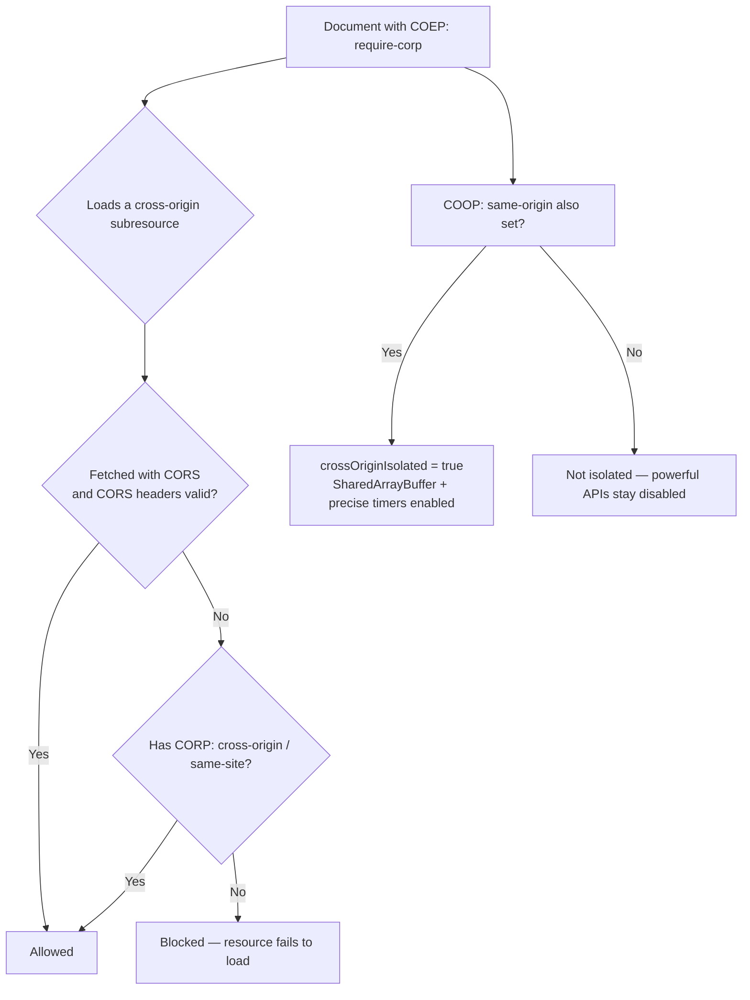

# Cross-Origin-Embedder-Policy

## Quick Summary

`Cross-Origin-Embedder-Policy` (COEP) is a **response** header that lets a document declare it will **only load cross-origin subresources that explicitly opt in** to being embedded — via `Cross-Origin-Embedder-Policy: require-corp` (or the softer `credentialless`). Its purpose is narrow but critical: COEP is one of the two headers (with [`Cross-Origin-Opener-Policy`](./Cross-Origin-Opener-Policy.md)) required to put a page into a state called **"cross-origin isolation."** Cross-origin isolation is the *entry ticket* to powerful browser features that were disabled across the board after the **Spectre** family of CPU side-channel attacks — most importantly `SharedArrayBuffer`, high-resolution `performance.now()` timers, and `performance.measureUserAgentSpecificMemory()`. Without COEP + COOP, those APIs are simply unavailable. COEP works by demanding that every cross-origin resource the page pulls in (images, scripts, fonts, iframes, etc.) either carries a permissive [`Cross-Origin-Resource-Policy`](./Cross-Origin-Resource-Policy.md) (CORP) header or is fetched with CORS — so that no cross-origin data can end up in the page's process without the provider's consent. It's an all-or-nothing, embedding-time gate, and enabling it is a deliberate project (you must audit every cross-origin dependency), not a one-line security hardening.

## What problem does this header solve?

In 2018, **Spectre** showed that a malicious script could use CPU speculative-execution side channels to read memory *in its own process* that it shouldn't be able to — including data from cross-origin resources that happened to be loaded into the same process. Two ingredients made this practical in browsers: **high-precision timers** (to measure the tiny timing differences the attack relies on) and **shared memory** (`SharedArrayBuffer`, which enables building an even higher-resolution timer). To protect users, browsers **globally disabled `SharedArrayBuffer`** and **reduced timer precision** — a blunt but necessary mitigation.

But those features are genuinely needed by high-performance web apps (WebAssembly threads, video/image processing, games, in-browser compilers). The web platform's answer: **re-enable them, but only for pages that prove no un-consented cross-origin data shares their process.** That proof is **cross-origin isolation**, and COEP is the half of it that governs *embedded subresources*: it guarantees that everything the page loads cross-origin has *opted in* (via CORP or CORS), so an attacker can't sneak sensitive cross-origin data into the isolated process to read it via a side channel. In short, COEP solves "how can a page safely regain access to powerful, side-channel-sensitive APIs?" by locking down what it's allowed to embed.

## Why was it introduced?

COEP was introduced (circa 2020, WHATWG **HTML/Fetch standards**) as part of the **cross-origin isolation** design created specifically to safely restore `SharedArrayBuffer` and precise timers post-Spectre. The model needed two guarantees: (1) no cross-origin document can obtain a reference to your window (handled by [`COOP`](./Cross-Origin-Opener-Policy.md)), and (2) no cross-origin *subresource* lands in your process without consent (handled by COEP). Only when *both* are satisfied does the browser set `self.crossOriginIsolated === true` and unlock the gated APIs. The two values reflect two eras/strategies: **`require-corp`** (every cross-origin resource must send [CORP](./Cross-Origin-Resource-Policy.md) or be CORS-fetched) came first; **`credentialless`** was added later as a more deployable option (cross-origin *no-cors* requests are sent *without credentials*, so they can't return per-user data, removing the need for every third party to add CORP). COEP exists because regaining these features *required* a machine-checkable promise about embedded content.

## How does it work?

When a document is served with `Cross-Origin-Embedder-Policy: require-corp`, the browser enforces that **every cross-origin subresource** it fetches must be *allowed to be embedded*:

- fetched with **CORS** (and the server returns valid CORS headers), **or**
- returned with a permissive [`Cross-Origin-Resource-Policy`](./Cross-Origin-Resource-Policy.md) (`cross-origin`, or `same-site` where applicable).

Any cross-origin resource that satisfies neither is **blocked** (the load fails). Combined with a matching [`COOP`](./Cross-Origin-Opener-Policy.md) (`same-origin`), the page becomes cross-origin isolated.



- **Browser behavior:** The browser enforces the embedding rules, blocks non-compliant cross-origin resources, and — only with COEP **and** COOP — sets `self.crossOriginIsolated = true`, unlocking `SharedArrayBuffer`, unthrottled `performance.now()`, and `measureUserAgentSpecificMemory()`.
- **Server behavior:** The document server sets COEP; the *providers* of cross-origin resources must add [CORP](./Cross-Origin-Resource-Policy.md) (or support CORS) for their resources to remain embeddable in COEP pages.
- **Proxy/CDN behavior:** Must pass COEP/CORP through untouched; a CDN serving assets consumed by COEP pages should add CORP to those assets.
- **Reverse proxy behavior:** Often where you inject COEP (and CORP on served assets) centrally.
- **iframes:** Cross-origin iframes embedded in a COEP page must themselves send COEP (and appropriate CORP), or they're blocked — a major deployment consideration for embedded third-party frames.

## HTTP Request Example

COEP is a **response** header; there's no request-side form the app sets. The browser's fetches for subresources in a COEP page carry the usual request headers (and, under `require-corp`, may be sent as CORS requests). A normal navigation:

```http
GET /app HTTP/1.1
Host: app.example.com
```

## HTTP Response Example

Enabling cross-origin isolation (COEP + COOP together):

```http
HTTP/1.1 200 OK
Content-Type: text/html; charset=utf-8
Cross-Origin-Embedder-Policy: require-corp
Cross-Origin-Opener-Policy: same-origin
```

The more deployable variant:

```http
HTTP/1.1 200 OK
Content-Type: text/html; charset=utf-8
Cross-Origin-Embedder-Policy: credentialless
Cross-Origin-Opener-Policy: same-origin
```

A cross-origin asset opting in to being embedded (served by the *provider*):

```http
HTTP/1.1 200 OK
Content-Type: image/png
Cross-Origin-Resource-Policy: cross-origin
```

Report-only mode (audit before enforcing):

```http
HTTP/1.1 200 OK
Cross-Origin-Embedder-Policy-Report-Only: require-corp
Reporting-Endpoints: coep-endpoint="https://reports.example.com/coep"
```

## Express.js Example

```js
const express = require('express');
const app = express();

// 1) Enable cross-origin isolation on the DOCUMENT: COEP + COOP together.
//    Only both together set crossOriginIsolated = true.
app.use((req, res, next) => {
  res.set('Cross-Origin-Embedder-Policy', 'require-corp');   // gate embedded subresources
  res.set('Cross-Origin-Opener-Policy', 'same-origin');      // isolate the browsing context
  next();
});

// 2) Serve YOUR OWN static assets with CORP so they remain embeddable under COEP.
app.use('/assets', (req, res, next) => {
  res.set('Cross-Origin-Resource-Policy', 'same-origin'); // same-origin assets: same-site/same-origin is fine
  next();
}, express.static('public'));

// 3) helmet can manage these headers, but COEP is OFF by default in helmet
//    because it breaks pages with un-audited cross-origin resources.
const helmet = require('helmet');
app.use(helmet({
  crossOriginEmbedderPolicy: true,   // opt-in explicitly; audit your subresources first.
  crossOriginOpenerPolicy: { policy: 'same-origin' },
}));

// 4) Report-only rollout: observe what WOULD break before enforcing.
app.use((req, res, next) => {
  res.set('Cross-Origin-Embedder-Policy-Report-Only', 'require-corp');
  res.set('Reporting-Endpoints', 'coep="https://reports.example.com/coep"');
  next();
});

// A feature that REQUIRES cross-origin isolation:
app.get('/wasm-threads', (req, res) => {
  // The served page can use SharedArrayBuffer ONLY because COEP+COOP are set.
  res.sendFile(__dirname + '/wasm-threads.html');
});

app.listen(3000);
```

Why each piece matters: setting COEP **and** [COOP](./Cross-Origin-Opener-Policy.md) together (route 1) is mandatory — neither alone grants isolation, and `crossOriginIsolated` stays `false` if either is missing. Route 2 is the flip side: your *own* assets must carry [CORP](./Cross-Origin-Resource-Policy.md) or they'll be blocked *by your own page* under `require-corp` — a classic "I enabled COEP and my images vanished" gotcha. Route 3 notes that `helmet` deliberately leaves COEP **off** by default because turning it on breaks any page with un-audited third-party resources — you must opt in after auditing. Route 4 (report-only) is the safe rollout path: it tells you which cross-origin resources *would* be blocked, via reports, before you flip to enforcement and break production.

## Node.js Example

Raw `http`:

```js
const http = require('http');

http.createServer((req, res) => {
  // Document: enable isolation.
  res.setHeader('Cross-Origin-Embedder-Policy', 'require-corp');
  res.setHeader('Cross-Origin-Opener-Policy', 'same-origin');
  res.setHeader('Content-Type', 'text/html; charset=utf-8');
  res.end(`<!doctype html>
    <script>
      // true ONLY if BOTH COEP and COOP are correctly set AND all subresources comply.
      console.log('isolated:', self.crossOriginIsolated);
      if (self.crossOriginIsolated) {
        const sab = new SharedArrayBuffer(1024); // available only when isolated
      }
    </script>`);
}).listen(3000);
```

The observable test is `self.crossOriginIsolated` — if it's `false` despite setting both headers, a non-compliant cross-origin subresource (or a missing header on an iframe) is preventing isolation.

## React Example

React apps that need `SharedArrayBuffer` (WASM threads: ffmpeg.wasm, SQLite WASM, image/video processing, some game engines) **must** be served cross-origin-isolated:

```jsx
function useCrossOriginIsolated() {
  // Reflects whether the server set COEP + COOP correctly and subresources comply.
  return typeof window !== 'undefined' && window.crossOriginIsolated;
}

function VideoTranscoder() {
  const isolated = useCrossOriginIsolated();
  if (!isolated) {
    // ffmpeg.wasm (threaded) needs SharedArrayBuffer → needs isolation.
    return <p>This feature requires cross-origin isolation (COEP + COOP). Check server headers.</p>;
  }
  // Safe to load a threaded WASM module here.
  return <TranscoderUI />;
}
```

Key points for React devs:
1. **It's a server-header requirement, not a code change.** Your build tool/host must send COEP + COOP on the document. (Vite/webpack dev servers and hosts like Vercel/Netlify have config for this.)
2. **Every cross-origin asset must comply.** Third-party scripts (analytics, maps, fonts, embeds) without CORP/CORS will be **blocked** under `require-corp` — breaking your app. Audit them; use `credentialless` or proxy/self-host non-compliant assets.
3. **Third-party iframes** (YouTube, Stripe, ads) must themselves send COEP or they won't load in an isolated page — often the hardest part; `credentialless` helps but doesn't cover iframes (they need their own COEP).
4. **Roll out with report-only** first to find breakage without shipping it to users.

## Browser Lifecycle

1. The document response arrives with `Cross-Origin-Embedder-Policy: require-corp` (and ideally [COOP](./Cross-Origin-Opener-Policy.md) `same-origin`).
2. For **every cross-origin subresource** the page fetches, the browser checks CORS success or a permissive [CORP](./Cross-Origin-Resource-Policy.md) header; non-compliant resources are **blocked**.
3. Cross-origin iframes must themselves be COEP-enabled or they're blocked.
4. If COEP is satisfied **and** COOP isolates the browsing context, the browser sets `self.crossOriginIsolated = true`.
5. With isolation, `SharedArrayBuffer`, high-resolution `performance.now()`, and `measureUserAgentSpecificMemory()` become available.
6. Under `credentialless`, cross-origin no-cors requests are sent without credentials (so they can't leak per-user data), relaxing the CORP requirement for those.
7. Violations can be reported via [`Reporting-Endpoints`](./Reporting-Endpoints-Report-To.md)/report-only.

## Production Use Cases

- **WebAssembly threads:** any WASM built with threads (`SharedArrayBuffer`) — ffmpeg.wasm, SQLite WASM, PDF/image processing, physics/game engines.
- **High-performance in-browser compute:** parallel data processing, ML inference (some backends), audio/video editing.
- **Precise memory measurement:** `performance.measureUserAgentSpecificMemory()` for perf monitoring.
- **High-resolution timing:** unthrottled `performance.now()` for fine-grained profiling (also the reason it's gated).
- **Defense-in-depth:** even without needing those APIs, COEP+COOP reduce the risk of cross-origin data leaking into your process (Spectre-class hardening).

## Common Mistakes

- **Enabling COEP without CORP on your own assets** → your own images/scripts/fonts get blocked ("everything disappeared"). Add [CORP](./Cross-Origin-Resource-Policy.md) to same-origin/cross-origin assets you control.
- **Expecting isolation from COEP alone.** You need **both** COEP and [COOP](./Cross-Origin-Opener-Policy.md); `crossOriginIsolated` stays false otherwise.
- **Un-audited third parties.** Analytics, maps, ad, and font providers without CORP/CORS break under `require-corp`. Audit first; use `credentialless`, self-host, or proxy.
- **Third-party iframes not sending COEP** → blocked in isolated pages; often the biggest blocker (Stripe/YouTube/etc. must support it).
- **Flipping to enforce in production without report-only.** Guaranteed to break something; roll out with `-Report-Only` first.
- **Assuming `credentialless` fixes iframes.** It relaxes no-cors subresource requirements, but iframes still need their own COEP.
- **Not testing `self.crossOriginIsolated`.** Ship a check; silent failure means the gated API just isn't there.

## Security Considerations

- **This *is* a security feature** — the mitigation for Spectre-class cross-origin data leakage. Its guarantee is "no un-consented cross-origin resource shares my process."
- **Trade-off with functionality:** the stricter the isolation, the more third-party content breaks; `credentialless` trades some strictness for deployability (no-cors cross-origin requests lose credentials).
- **Doesn't replace other headers:** COEP/COOP complement [CSP](./Content-Security-Policy.md), [CORP](./Cross-Origin-Resource-Policy.md), and CORS; each addresses a different vector.
- **Reporting:** use report-only + [`Reporting-Endpoints`](./Reporting-Endpoints-Report-To.md) to detect violations without breaking users.
- **Credential exposure via CORS:** if you switch cross-origin resources to CORS to satisfy COEP, ensure you don't inadvertently expose credentialed responses (see [`Access-Control-Allow-Credentials`](../07-CORS/Access-Control-Allow-Credentials.md)).

## Performance Considerations

- **Unlocks performance features:** the whole point — `SharedArrayBuffer` enables multithreaded WASM (major speedups for compute-heavy tasks).
- **Possible extra CORS preflights/fetches:** switching subresources to CORS to satisfy COEP can add preflights; prefer CORP (a simple response header) where possible.
- **`credentialless` reduces friction:** avoids requiring every third party to add CORP, at the cost of no-cors requests losing credentials (fine for public assets).
- **No direct latency cost from the header itself;** the cost is in the compliance work and any added CORS round-trips.

## Reverse Proxy Considerations

Nginx injecting COEP/COOP on documents and CORP on assets:

```nginx
server {
  # Documents: enable cross-origin isolation.
  location / {
    proxy_pass http://app_upstream;
    add_header Cross-Origin-Embedder-Policy "require-corp" always;
    add_header Cross-Origin-Opener-Policy "same-origin" always;
  }

  # Your own static assets: add CORP so they're embeddable under COEP.
  location /assets/ {
    root /var/www;
    add_header Cross-Origin-Resource-Policy "cross-origin" always;
    add_header Cross-Origin-Embedder-Policy "require-corp" always; # if these assets are docs/workers
  }
}
```

Key points: centralizing COEP/COOP at the proxy is convenient, but you must **also** ensure every cross-origin asset (yours and third parties') carries CORP or supports CORS. For assets you serve to *other* people's COEP pages, adding `Cross-Origin-Resource-Policy: cross-origin` is what keeps them embeddable.

## CDN Considerations

- **CDNs must pass COEP/COOP/CORP through** and, for assets consumed by COEP pages, should be configured to add [CORP](./Cross-Origin-Resource-Policy.md).
- **Third-party CDNs you consume** (fonts, scripts) must send CORP/CORS or you can't use them under `require-corp` — many popular CDNs now add `Cross-Origin-Resource-Policy: cross-origin`, but verify.
- **`credentialless`** reduces reliance on third-party CORP for no-cors subresources.
- **Edge injection:** Cloudflare/Fastly/CloudFront can add these headers via rules; ensure consistency across all asset paths.

## Cloud Deployment Considerations

- **Managed hosts (Vercel/Netlify/Cloudflare Pages):** set COEP/COOP via `vercel.json`/`_headers`/config; these platforms document cross-origin isolation setup for WASM-threads apps.
- **Object storage (S3/GCS) for assets:** set `Cross-Origin-Resource-Policy` metadata on objects consumed by COEP pages.
- **API Gateways/LBs:** pass the headers through; inject at the edge if needed.
- **Dev servers:** Vite/webpack need COEP/COOP configured in dev to test isolation locally (otherwise `crossOriginIsolated` is false in dev).

## Debugging

- **Console:** check `self.crossOriginIsolated` — `true` means COEP+COOP+compliance all succeeded.
- **Chrome DevTools → Network:** blocked subresources show a COEP-related error; the request fails with a specific reason. The Console logs which resource was blocked and why.
- **DevTools → Application → Frames:** shows the isolation status and header values per frame.
- **Report-only mode:** deploy `Cross-Origin-Embedder-Policy-Report-Only` + [`Reporting-Endpoints`](./Reporting-Endpoints-Report-To.md) to collect violations without breaking the page.
- **curl:** `curl -sD - -o /dev/null https://app/ | grep -i 'cross-origin'` to confirm the headers are present.
- **Audit subresources:** list every cross-origin URL the page loads and verify each returns CORP or supports CORS.

## Best Practices

- [ ] Set COEP **with** [COOP](./Cross-Origin-Opener-Policy.md) (`same-origin`) — both are required for isolation.
- [ ] Add [`Cross-Origin-Resource-Policy`](./Cross-Origin-Resource-Policy.md) to **your own** assets so they're not blocked by your COEP page.
- [ ] **Audit all cross-origin subresources and iframes** before enforcing; ensure each sends CORP or supports CORS.
- [ ] Roll out with **report-only** (`Cross-Origin-Embedder-Policy-Report-Only`) + [`Reporting-Endpoints`](./Reporting-Endpoints-Report-To.md) first.
- [ ] Prefer **`credentialless`** when third-party no-cors resources can't add CORP (note: iframes still need their own COEP).
- [ ] Test `self.crossOriginIsolated` in the app and gate powerful features on it.
- [ ] Self-host or proxy non-compliant third-party assets when needed.
- [ ] Only enable it when you actually need the gated APIs (or want the hardening) — it's a project, not a freebie.

## Related Headers

- [Cross-Origin-Opener-Policy](./Cross-Origin-Opener-Policy.md) — the other half of cross-origin isolation (isolates the browsing context).
- [Cross-Origin-Resource-Policy](./Cross-Origin-Resource-Policy.md) — how resource providers opt in to being embeddable under COEP.
- [Content-Security-Policy](./Content-Security-Policy.md) — complementary; controls sources but not process isolation.
- [Access-Control-Allow-Origin](../07-CORS/Access-Control-Allow-Origin.md) / [Access-Control-Allow-Credentials](../07-CORS/Access-Control-Allow-Credentials.md) — CORS is one way to satisfy COEP for subresources.
- [Reporting-Endpoints / Report-To](./Reporting-Endpoints-Report-To.md) — where COEP violation reports are sent.
- [Cross-Origin-Opener-Policy](./Cross-Origin-Opener-Policy.md) — see for the `crossOriginIsolated` flag mechanics.

## Decision Tree

```mermaid
flowchart TD
    A[Do I need SharedArrayBuffer /<br/>precise timers / measureUserAgentSpecificMemory?] --> B{Yes?}
    B -- No --> C[COEP optional (hardening only)]
    B -- Yes --> D[Must achieve cross-origin isolation]
    D --> E[Set COEP + COOP: same-origin]
    E --> F{All cross-origin subresources compliant?}
    F -- No --> G[Add CORP / CORS / self-host / use credentialless]
    F -- Yes --> H{crossOriginIsolated === true?}
    H -- Yes --> I[Powerful APIs unlocked]
    H -- No --> J[Fix remaining blocked resources/iframes]
    D --> K[Roll out with report-only first]
```

## Mental Model

Think of COEP as the **"clean room" admission policy for a high-security lab** that you must satisfy before you're handed the dangerous-but-powerful equipment (`SharedArrayBuffer`, precise timers). Because a spy (Spectre) once smuggled secrets out by *timing* what was in the room, the lab was locked down and the powerful equipment confiscated from everyone. To get it back, your room must prove it's clean: **every item brought in from outside** (cross-origin subresources) must come with a signed consent slip from its owner saying "yes, this may be embedded here" ([CORP](./Cross-Origin-Resource-Policy.md)) — or be brought in through the vetted airlock (CORS). Anything without consent is turned away at the door (blocked). And cleanliness requires *two* locks, not one: this admission policy (COEP) **plus** a guarantee that no outsider can peer in through the windows ([COOP](./Cross-Origin-Opener-Policy.md)). Only when both locks are engaged does the lab flip its "CLEAN — isolated" sign to green (`crossOriginIsolated = true`) and wheel in the powerful equipment. It's demanding on purpose: you can't get the dangerous tools back without proving nothing un-vetted shares your room.
