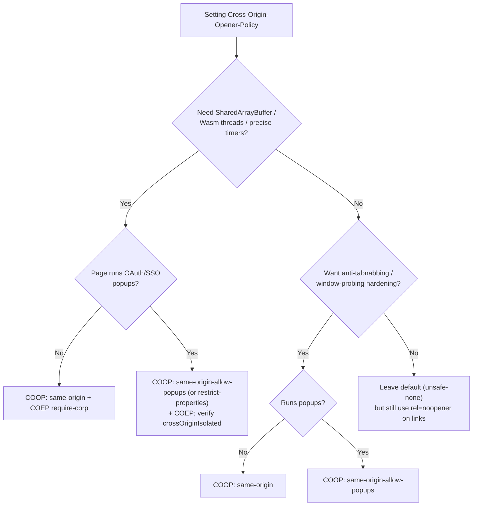

# Cross-Origin-Opener-Policy

## Quick Summary

`Cross-Origin-Opener-Policy` (COOP) is a response header the origin sets on **top-level HTML documents** to control whether the document keeps a direct scripting relationship — via `window.opener`, `window.open()` return values, and named frame targets — with cross-origin pages that opened it or that it opens. Its central value, `same-origin`, tells the browser: *if this document and the page across the `opener` boundary are not same-origin, sever the connection and place them in different browsing-context groups.* Practically, this does two things. First, it hardens you against cross-window attacks (tabnabbing, cross-origin `window` probing, and — combined with [Cross-Origin-Embedder-Policy](./Cross-Origin-Embedder-Policy.md) — Spectre-style speculative-execution side channels) by preventing other origins from holding a live reference to your `window`. Second, it is one of the **two required ingredients** (COOP `same-origin` + COEP `require-corp`/`credentialless`) that make a document **cross-origin isolated** (`self.crossOriginIsolated === true`), which is the gate that re-enables `SharedArrayBuffer`, high-resolution `performance.now()` timers, and `performance.measureUserAgentSpecificMemory()`. COOP alone does not unlock those APIs; it is one half of the pair — see the isolation diagram on the [COEP page](./Cross-Origin-Embedder-Policy.md).

## What problem does this header solve?

Two windows that reference each other via `window.opener` share a scripting relationship even across origins — limited by the same-origin policy, but not eliminated. A malicious page you link to with `<a target="_blank">` receives a live `window.opener` pointing at *your* window, and can do `opener.location = 'https://phishing.example/login'` to silently navigate your original tab to a phishing clone while the user is looking at the new tab. That is **tabnabbing**. More subtly, cross-origin windows in the same *browsing context group* can be co-located in the **same OS process**, and a same-process attacker can use CPU speculative-execution side channels (Spectre) to read memory — including secrets — that the process holds, defeating the same-origin policy's usual memory boundary.

COOP solves both by letting a document declare *"do not keep me in the same browsing-context group as cross-origin openers/openees."* When enforced, cross-origin `opener` references are severed (reads return `null`), and the browser is free to put your document in its **own process**. That closes tabnabbing and removes cross-origin windows from your process, which is a prerequisite for safely handing your process powerful, high-precision primitives again.

## Why was it introduced?

The trigger was **Spectre (2018)**. Speculative execution let attacker JavaScript read arbitrary memory in its own process via timing side channels. Browsers' first emergency response was to *disable the sharp tools that make side channels practical*: `SharedArrayBuffer` (which gives an attacker a high-resolution timer by spinning a counter in a worker) was removed from the web, and `performance.now()` resolution was coarsened. But those primitives are genuinely needed (WebAssembly threads, video processing, emulators, ffmpeg-in-the-browser).

The web platform's answer was **cross-origin isolation**: give those primitives back, but *only* to documents that have provably ejected all cross-origin content from their process/agent cluster, so a side channel can't read anything that isn't already same-origin. Achieving that ejection needs control over two boundaries — the **opener** boundary (COOP) and the **embedding** boundary (COEP). COOP was specified in the HTML Standard / WHATWG "cross-origin opener policy" work (~2019-2020, shipping in Chrome 83 / Firefox 79 era) precisely to close the opener half. Its `same-origin-allow-popups` variant and later `same-origin-allow-popups-plus-coep` / `restrict-properties` refinements were added to keep OAuth popup flows working while still isolating.

## How does it work?

COOP is evaluated on **top-level document navigations only** (not iframes — iframes are governed by COEP/CORP and framing controls). The header takes one of these values:

- **`unsafe-none`** (the default): no isolation. The document may share a browsing context group with cross-origin openers/openees; `window.opener` works cross-origin.
- **`same-origin-allow-popups`**: this document keeps `opener`/references to **popups it opens**, but any cross-origin document that opened *it* is disconnected. The pragmatic setting for identity providers and pages that open OAuth popups.
- **`same-origin`**: full opener isolation. The document only stays connected to same-origin documents across the opener boundary; all cross-origin opener relationships are severed. Required for cross-origin isolation.
- **`same-origin` + `COOP: same-origin-allow-popups`** refinements and `restrict-properties` (newer) narrow specific window properties instead of fully cutting the reference, easing popup-based SSO while retaining most protection.

The matching rule: on navigation, the browser compares the COOP (and origin) of the document being left and the document being entered. If they don't "match" (e.g., one is `same-origin` and the other is cross-origin), the browser **swaps browsing context group** — the new document goes into a fresh group, `window.opener` becomes `null`, and back/forward relationships across that boundary are cut.

```mermaid
sequenceDiagram
    participant A as Page A (attacker or IdP)
    participant B as Browser
    participant C as Your page (COOP: same-origin)
    A->>B: window.open('https://you.example')  or  <a target=_blank>
    B->>C: Navigate new context to your page
    Note over B,C: Your COOP=same-origin, opener is cross-origin ⇒ MISMATCH
    B->>B: Put your page in a NEW browsing-context group<br/>(own process eligible)
    B-->>C: window.opener === null
    B-->>A: reference to your window === null
    Note over A,C: Tabnabbing impossible; processes separable
```

- **Browser behavior:** Parses COOP on top-level responses, decides browsing-context-group membership on each navigation, severs cross-origin `opener`/openee references on mismatch, and enables per-document process isolation. It also reports mismatches via the Reporting API when `report-to` is attached.
- **Server behavior:** Emits COOP on top-level HTML responses. It is document-scoped; setting it on API/JSON/asset responses is a no-op.
- **Popup interaction:** With `same-origin`, `window.open()` to a cross-origin URL returns a window whose reference you cannot script cross-origin (and vice-versa). Use `same-origin-allow-popups` (or `restrict-properties`) when you legitimately need to talk to popups (OAuth).
- **Proxy / CDN / reverse proxy behavior:** All pass COOP through untouched; it is meaningful only to the browser. CDNs and reverse proxies are commonly used to *inject* it at the edge. Ensure it survives to the browser and is set on document responses.

## HTTP Request Example

COOP has no request form; the browser never sends it. A top-level navigation is ordinary:

```http
GET /app HTTP/1.1
Host: app.example.com
Sec-Fetch-Dest: document
Sec-Fetch-Mode: navigate
```

## HTTP Response Example

Full opener isolation (also step one toward cross-origin isolation), with reporting:

```http
HTTP/1.1 200 OK
Content-Type: text/html; charset=utf-8
Cross-Origin-Opener-Policy: same-origin; report-to="coop-endpoint"
Cross-Origin-Embedder-Policy: require-corp
Reporting-Endpoints: coop-endpoint="https://reports.example.com/coop"
```

An identity provider / page that opens OAuth popups but still wants to be protected from its own opener:

```http
HTTP/1.1 200 OK
Content-Type: text/html; charset=utf-8
Cross-Origin-Opener-Policy: same-origin-allow-popups
```

## Express.js Example

```js
const express = require('express');
const app = express();

// COOP is a TOP-LEVEL DOCUMENT policy. Apply it to page routes only.
app.get(['/', '/app', '/dashboard'], (req, res) => {
  // same-origin: sever every cross-origin opener/openee relationship and make this
  // document eligible for its own process/browsing-context group.
  // report-to names a Reporting-Endpoints group so violations are observable.
  res.setHeader('Cross-Origin-Opener-Policy', 'same-origin; report-to="coop"');
  res.setHeader('Reporting-Endpoints', 'coop="https://reports.example.com/coop"');

  // If (and only if) you also need SharedArrayBuffer / precise timers, pair with COEP.
  // COOP alone hardens against tabnabbing; COOP + COEP together = crossOriginIsolated.
  res.setHeader('Cross-Origin-Embedder-Policy', 'require-corp');

  res.type('html').send('<!doctype html><title>App</title>...');
  // Remove COOP and: (a) a page you link to with target=_blank can navigate your tab
  // (tabnabbing), and (b) crossOriginIsolated stays false, so SharedArrayBuffer is unavailable
  // no matter what COEP says.
});

// A route that runs an OAuth popup flow: full same-origin would break the popup's
// ability to postMessage back to the opener. Use same-origin-allow-popups.
app.get('/login', (req, res) => {
  res.setHeader('Cross-Origin-Opener-Policy', 'same-origin-allow-popups');
  res.type('html').send('<!doctype html><title>Login</title>...');
});

app.listen(3000);
```

With **Helmet**:

```js
const helmet = require('helmet');
app.use(helmet({
  // Helmet can set COOP for you; default is same-origin. Override per-need.
  crossOriginOpenerPolicy: { policy: 'same-origin' },
  // Helmet also manages COEP and CORP — see those pages.
}));
```

Every line matters: without COOP `same-origin` (or `same-origin-allow-popups`), the browsing context group is shared and `crossOriginIsolated` can never become true; with plain `same-origin` on a page that relies on OAuth popups, the popup↔opener `postMessage` channel breaks and login silently fails.

## Node.js Example

```js
const http = require('http');

http.createServer((req, res) => {
  if (req.url === '/app') {
    // Raw http sets nothing by default — you own the exact string.
    res.setHeader('Cross-Origin-Opener-Policy', 'same-origin');
    res.setHeader('Cross-Origin-Embedder-Policy', 'require-corp'); // needed for isolation
    res.setHeader('Content-Type', 'text/html; charset=utf-8');
    return res.end('<!doctype html><title>App</title>');
  }
  res.statusCode = 404;
  res.end();
}).listen(3000);
```

The contrast with Express: nothing (not even Helmet defaults) is applied for you, which is safer against accidental isolation, but means every document route must set COOP deliberately.

## React Example

React does not set COOP — it's emitted by whatever serves your HTML (Express, Next.js, CDN). But React code is the direct **consumer** of what COOP enables and the **victim** of what it breaks:

```jsx
// 1) Feature-detect isolation before using isolation-gated APIs.
function useSharedBuffer(size) {
  return React.useMemo(() => {
    if (!self.crossOriginIsolated) {
      // COOP + COEP were NOT both satisfied. SharedArrayBuffer is undefined here.
      console.warn('Not cross-origin isolated: falling back to ArrayBuffer');
      return new ArrayBuffer(size);
    }
    return new SharedArrayBuffer(size); // only reachable when COOP=same-origin + COEP set.
  }, [size]);
}

// 2) OAuth popup: COOP=same-origin on the opener would null out this handle.
function useOAuthPopup() {
  return React.useCallback(() => {
    const popup = window.open('https://idp.example/authorize', 'oauth', 'width=480,height=640');
    // With COOP `same-origin`, `popup` is disconnected and postMessage from the IdP
    // cannot reach us. The opener page must be served with
    // Cross-Origin-Opener-Policy: same-origin-allow-popups for this to work.
    window.addEventListener('message', (e) => {
      if (e.origin === 'https://idp.example') handleToken(e.data);
    });
    return popup;
  }, []);
}
```

The practical lesson for React apps: if you adopt COOP `same-origin` for isolation, audit every `window.open`, every `postMessage`, and every third-party SDK (Stripe, Auth0, Firebase, social logins) that relies on popup/opener communication — those are the things that break, and they break in *your* components.

## Browser Lifecycle

1. **Top-level response arrives.** Browser reads `Cross-Origin-Opener-Policy`.
2. **Group decision.** It compares the leaving document's and arriving document's COOP + origin. Match → stay in the same browsing-context group. Mismatch → **browsing-context-group swap**.
3. **On swap:** `window.opener` is set to `null` (both directions), named-window targeting across the boundary is cut, and the document becomes eligible to run in its own OS process.
4. **Isolation computation.** If COOP is `same-origin` **and** COEP is `require-corp`/`credentialless`, the document is marked `crossOriginIsolated = true`, which un-gates `SharedArrayBuffer`, unclamped `performance.now()`, and memory-measurement APIs.
5. **Popups.** `window.open` results honor the policy: `same-origin-allow-popups` keeps openee handles; `same-origin` cuts cross-origin ones.
6. **Reporting.** Mismatches (and "would-be" mismatches under report-only) are sent to the `report-to` group.

## Production Use Cases

- **Anti-tabnabbing hardening** on any page that opens external links or is linkable — `same-origin` (or at least `same-origin-allow-popups`) prevents a linked page from navigating your tab. (Note `rel="noopener"` fixes the per-link case; COOP fixes it document-wide, including inbound openers.)
- **Enabling `SharedArrayBuffer` / Wasm threads** (video editors, in-browser IDEs, emulators, ffmpeg.wasm, image processing) — COOP `same-origin` is the mandatory opener half of cross-origin isolation.
- **High-resolution timing** for performance tools and profilers that need unclamped `performance.now()`.
- **`measureUserAgentSpecificMemory()`** for memory-leak monitoring in production.
- **Identity providers / SSO hubs** — `same-origin-allow-popups` (or `restrict-properties`) to protect the hub while keeping popup OAuth flows alive.

## Common Mistakes

- **Expecting COOP alone to enable `SharedArrayBuffer`.** It won't — you also need COEP. `crossOriginIsolated` requires both. Setting only COOP and wondering why `SharedArrayBuffer` is still undefined is the #1 confusion.
- **Breaking OAuth popups with `same-origin`.** Full `same-origin` severs the opener↔popup channel that Google/Auth0/Stripe/social logins use. Use `same-origin-allow-popups` (or `restrict-properties`) on pages that run those flows.
- **Setting COOP on iframes and expecting isolation.** COOP applies to *top-level* documents; iframes are handled by COEP/CORP. A COOP header on a framed document is largely inert for isolation.
- **Forgetting it's origin-scoped, not just per-page.** A single non-COOP page in the same origin/flow can keep you in a shared group during a navigation chain; the whole navigation path needs consistent policy.
- **Assuming `rel="noopener"` and COOP are interchangeable.** `noopener` only affects links *you* author; COOP also protects against inbound openers and is document-wide.

## Security Considerations

- **Closes tabnabbing:** cross-origin openers can no longer read or navigate `window.opener`, killing the classic "background tab swapped to a phishing page" attack across the whole document.
- **Cross-origin window probing:** severing the reference prevents cross-origin pages from probing your `window` (frame counts, navigation timing, `window.length`, login-state oracles).
- **Spectre / side channels:** by ejecting cross-origin documents from your browsing-context group (and process), COOP removes cross-origin secrets from the address space a speculative-execution side channel could read. This is why it's a *precondition* for re-enabling the sharp timing/`SharedArrayBuffer` tools.
- **Not a framing control:** COOP does not stop you being embedded in an iframe — that is [X-Frame-Options](./X-Frame-Options.md) / CSP `frame-ancestors`. Different boundary.
- **Report-only first:** deploy `Cross-Origin-Opener-Policy-Report-Only` to discover breakage (severed openers, popup flows) before enforcing.

## Performance Considerations

- **More processes, more memory.** Isolating a document into its own process improves security but increases the browser's process/memory footprint — a deliberate trade-off.
- **The payoff is capability, not speed per se:** `SharedArrayBuffer` + Wasm threads can dramatically speed up CPU-heavy client work (encoding, image processing) that would otherwise be single-threaded — but only once isolation is achieved.
- **Header cost is negligible;** it's a small header on document responses. Set it centrally and let it be cached with the HTML.
- **Navigation cost:** a browsing-context-group swap discards the shared process link; harmless in practice but means no shared BFCache across the boundary in some cases.

## Reverse Proxy Considerations

Nginx stamping COOP (and its COEP partner) on document responses:

```nginx
server {
  location / {
    proxy_pass http://app_upstream;
    # Full opener isolation + reporting. `always` covers error pages too.
    add_header Cross-Origin-Opener-Policy "same-origin" always;
    add_header Cross-Origin-Embedder-Policy "require-corp" always;  # the other half
    add_header Reporting-Endpoints 'coop="https://reports.example.com/coop"' always;
  }

  # OAuth callback / login page that needs popups:
  location /login {
    proxy_pass http://app_upstream;
    add_header Cross-Origin-Opener-Policy "same-origin-allow-popups" always;
  }
}
```

Remember Nginx's `add_header` inheritance trap: if a nested `location` adds any header, it must re-declare all inherited ones or they're dropped.

## CDN Considerations

- **Cloudflare / Fastly / CloudFront:** inject via Transform Rules / VCL / Response Headers Policy. A frequent enterprise pattern is stamping COOP at the edge to enforce a baseline even on legacy origins.
- **Consistency across the app:** the CDN must set COOP on *all* top-level document paths involved in a navigation flow, or a single non-isolated hop breaks isolation.
- **Cache correctness:** if you flip COOP on, purge cached HTML so users don't get the old headerless document.
- **COEP dependency:** because isolation needs COEP too, the CDN often has to also ensure every embedded sub-resource carries CORP / passes CORS — see the [COEP](./Cross-Origin-Embedder-Policy.md) and [CORP](./Cross-Origin-Resource-Policy.md) pages.

## Cloud Deployment Considerations

- **Vercel / Netlify:** set via `next.config.js` `headers()` / `vercel.json` / `_headers`. Next.js docs explicitly cover COOP+COEP for enabling `SharedArrayBuffer`.
- **AWS:** CloudFront **Response Headers Policy** is the clean place to attach COOP; ALB won't add it.
- **Static hosting:** ensure the platform lets you set response headers on HTML; if it can't, front it with a CDN that can.
- **OAuth-heavy apps:** map which routes run popups and give them `same-origin-allow-popups` while the rest get `same-origin`.

## Debugging

- **Chrome DevTools → Application → Frames:** shows each frame's COOP/COEP status and whether the document is **cross-origin isolated**. The **Security** and **Issues** panels flag COOP mismatches and what they break.
- **`self.crossOriginIsolated`** in the console: the single fastest check of whether COOP+COEP succeeded.
- **`window.opener`** in the console after a cross-origin open: `null` confirms COOP severed it.
- **curl:** `curl -sD - -o /dev/null https://app.example.com/ | grep -i cross-origin-opener` to confirm the emitted value.
- **Postman / Bruno:** inspect response headers on the page GET; assert `Cross-Origin-Opener-Policy` equals the expected policy.
- **Report-Only:** `Cross-Origin-Opener-Policy-Report-Only` + `Reporting-Endpoints` surfaces would-be breakage from real users before enforcement.

## Best Practices

- [ ] Use `same-origin` on pages that need cross-origin isolation or maximal anti-tabnabbing.
- [ ] Use `same-origin-allow-popups` (or `restrict-properties`) on pages that run OAuth/SSO popup flows.
- [ ] Always pair with [COEP](./Cross-Origin-Embedder-Policy.md) `require-corp`/`credentialless` if the goal is `SharedArrayBuffer`/precise timers — COOP alone is insufficient.
- [ ] Set it only on top-level HTML documents, centrally (middleware / reverse proxy / CDN).
- [ ] Roll out with `Cross-Origin-Opener-Policy-Report-Only` and a reporting endpoint first.
- [ ] Audit every `window.open`/`postMessage`/third-party popup SDK before enforcing `same-origin`.
- [ ] Verify with `self.crossOriginIsolated` and DevTools → Application → Frames.

## Related Headers

- [Cross-Origin-Embedder-Policy](./Cross-Origin-Embedder-Policy.md) — the embedding half of cross-origin isolation; **COOP + COEP together** make `crossOriginIsolated` true. See the isolation diagram there.
- [Cross-Origin-Resource-Policy](./Cross-Origin-Resource-Policy.md) — resources declare who may embed them; COEP (which COOP partners with) requires embedded resources to carry CORP or pass CORS.
- [X-Frame-Options](./X-Frame-Options.md) / CSP `frame-ancestors` — control *framing*, a different boundary from the *opener* boundary COOP governs.
- [Content-Security-Policy](./Content-Security-Policy.md) & [Permissions-Policy](./Permissions-Policy.md) — the broader "reduce blast radius" security-header family.
- `Reporting-Endpoints` — destination for COOP violation reports.

## Decision Tree



## Mental Model

Think of browsing-context groups as **shared office suites** and COOP as your decision about **whether to share walls with strangers**. By default (`unsafe-none`), when another company (origin) opens a door to your office — or you to theirs — you end up in one open-plan suite: you can see each other's desks through the glass (`window.opener` works), and if a fire (Spectre) starts, smoke travels because you share ventilation (the same OS process). `COOP: same-origin` says *"give my company its own sealed suite with its own ventilation; if a stranger tries to hold the door open to me, cut the connection."* Now no outsider can reach in to move your furniture (tabnabbing) or peer at your desks, and because your air supply is sealed, the building manager (browser) is finally willing to hand you the dangerous power tools (`SharedArrayBuffer`, precision timers) — but *only after* you've also sealed the loading dock where you receive deliveries, which is the [COEP](./Cross-Origin-Embedder-Policy.md) half of the same lockdown. `same-origin-allow-popups` is the compromise: sealed suite, but you keep a private intercom line to the courier windows you personally opened (OAuth popups).
