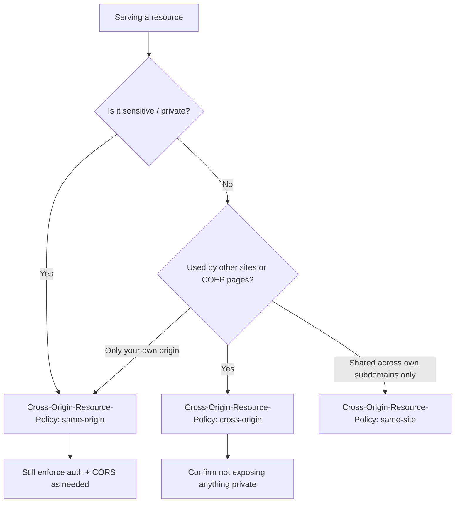

# Cross-Origin-Resource-Policy

## Quick Summary

`Cross-Origin-Resource-Policy` (CORP) is a **response** header by which a resource declares **who is allowed to embed/load it**, from the resource's own perspective — `Cross-Origin-Resource-Policy: same-origin` (only pages from the exact same origin may load me), `same-site` (only same-site pages), or `cross-origin` (anyone may load me). It flips the usual direction of control: where CORS lets a *reader* request permission to read a cross-origin response, CORP lets the *resource provider* proactively say "don't let other sites load me at all." Its two jobs are (1) a defense against **cross-origin data leakage / side-channel attacks** — most importantly **Spectre** — by preventing sensitive resources (like your private JSON or images) from being pulled into a hostile page's process, and (2) it is the mechanism by which resources **opt in to being embeddable** under [`Cross-Origin-Embedder-Policy`](./Cross-Origin-Embedder-Policy.md) (COEP). It is small, cheap, and increasingly essential: sensitive endpoints should set `same-origin` to block cross-site loads, while public assets (fonts, images, CDN scripts) meant to be used by other sites — *especially* COEP-isolated ones — must set `cross-origin`.

## What problem does this header solve?

Two related problems.

**First, cross-origin data leakage via speculative-execution side channels (Spectre).** A malicious page can load your resource with a plain ``, `<script>`, or `fetch` (no-cors) tag — the browser will fetch it and place the bytes into the *attacker's* process (even though the attacker's JS can't directly *read* the response). Spectre-class attacks can then read that in-process memory via timing side channels. So even resources that CORS "protects" from direct reading can leak if they end up in a hostile process. CORP addresses this by letting a resource say "**never** put me in a cross-origin process" (`same-origin`/`same-site`), so the browser refuses to load it into other sites at all — the data never enters the attacker's process.

**Second, the COEP opt-in.** [`Cross-Origin-Embedder-Policy: require-corp`](./Cross-Origin-Embedder-Policy.md) pages (needed for `SharedArrayBuffer` and precise timers) will only load cross-origin subresources that *explicitly consent* to embedding. CORP is that consent signal: a public asset must send `Cross-Origin-Resource-Policy: cross-origin` to remain usable inside COEP-isolated pages. Without CORP (or CORS), the asset is blocked.

So CORP simultaneously *blocks* unwanted cross-site loads of sensitive resources and *permits* wanted cross-site loads of public ones.

## Why was it introduced?

CORP was introduced (WHATWG **Fetch Standard**, around 2018–2020) as a direct response to **Spectre** (2018), which invalidated the browser's long-held assumption that same-process cross-origin data was safe as long as scripts couldn't *read* it directly. It began as an opt-in protection (`same-origin`) letting sites shield sensitive resources from being loaded cross-origin, and became central to the **cross-origin isolation** design ([COEP](./Cross-Origin-Embedder-Policy.md) + [COOP](./Cross-Origin-Opener-Policy.md)) that safely re-enabled `SharedArrayBuffer`/precise timers. Its three values map cleanly onto the web's origin/site trust boundaries. It was deliberately made a *simple response header* (unlike CORS's request/response dance) so that any resource — even a static image with no server logic — can declare its embedding policy trivially, which is exactly what mass adoption (fonts, CDN assets) required.

## How does it work?

The browser checks CORP when a resource is loaded in a cross-origin context. If the resource's CORP is stricter than the loading context's relationship, the load is **blocked**.

```mermaid
flowchart TD
    A[Page at evil.com loads a resource from example.com] --> B{Resource's CORP value?}
    B -- same-origin --> C{Same origin as the loader?}
    C -- No --> BLOCK1[Blocked]
    C -- Yes --> OK1[Allowed]
    B -- same-site --> D{Same site as the loader?}
    D -- No --> BLOCK2[Blocked]
    D -- Yes --> OK2[Allowed]
    B -- cross-origin --> OK3[Allowed for anyone]
    B -- absent --> E{Loader is COEP: require-corp?}
    E -- Yes --> BLOCK3[Blocked (no opt-in)]
    E -- No --> OK4[Allowed (legacy default)]
```

- **`same-origin`** — only pages from the *exact* same origin (scheme+host+port) may load the resource. Best for sensitive/private resources.
- **`same-site`** — only same-site pages (same registrable domain, roughly) may load it. Looser than same-origin.
- **`cross-origin`** — any page may load it. Required for public assets used by other sites and by COEP-isolated pages.

Behavior by tier:
- **Browser behavior:** Enforces CORP on cross-origin loads (``, `<script>`, `fetch`, fonts, etc.), blocking non-compliant ones; also treats CORP as the [COEP](./Cross-Origin-Embedder-Policy.md) embedding opt-in.
- **Server behavior:** The resource provider sets CORP per resource — `same-origin` for sensitive, `cross-origin` for public.
- **Proxy/CDN behavior:** Must pass CORP through; CDNs serving public assets should add `cross-origin` so those assets work in COEP pages.
- **Reverse proxy behavior:** A convenient central place to set CORP per path (strict for app/API paths, `cross-origin` for public asset paths).

## HTTP Request Example

CORP is a **response** header with no request-side form. The triggering request is an ordinary cross-origin subresource load (e.g. an image the browser fetches for another site's page). The browser applies CORP to the *response*.

```http
GET /avatar.png HTTP/1.1
Host: cdn.example.com
```

## HTTP Response Example

A sensitive API response locked to its own origin:

```http
HTTP/1.1 200 OK
Content-Type: application/json
Cross-Origin-Resource-Policy: same-origin

{"balance": 4210}
```

A public asset opting in to cross-origin embedding (also required for COEP pages):

```http
HTTP/1.1 200 OK
Content-Type: font/woff2
Cross-Origin-Resource-Policy: cross-origin
Cache-Control: public, max-age=31536000, immutable
```

Same-site scoping (usable across subdomains of the same site):

```http
HTTP/1.1 200 OK
Content-Type: image/png
Cross-Origin-Resource-Policy: same-site
```

## Express.js Example

```js
const express = require('express');
const app = express();

// 1) Sensitive resources: block cross-origin loads entirely.
app.get('/api/account', (req, res) => {
  res.set('Cross-Origin-Resource-Policy', 'same-origin'); // no other site may load this JSON.
  res.json({ balance: 4210 });
});

// 2) Public assets meant to be used by other sites AND embeddable in COEP pages.
app.use('/public', (req, res, next) => {
  res.set('Cross-Origin-Resource-Policy', 'cross-origin'); // anyone may load; COEP opt-in.
  next();
}, express.static('public-assets'));

// 3) Same-site assets shared across your own subdomains.
app.use('/shared', (req, res, next) => {
  res.set('Cross-Origin-Resource-Policy', 'same-site');
  next();
}, express.static('shared-assets'));

// 4) helmet applies a conservative default. Its default CORP is 'same-origin',
//    which is safe but will BLOCK your assets from being used by other origins /
//    COEP pages unless you override per public path.
const helmet = require('helmet');
app.use(helmet({
  crossOriginResourcePolicy: { policy: 'same-origin' }, // global default
}));
// ...then override to 'cross-origin' on public asset routes as in (2).

app.listen(3000);
```

Why each piece matters: route 1 (`same-origin`) is the Spectre defense — it stops a malicious page from pulling your private JSON into its process at all, even via a no-cors `fetch`. Route 2 (`cross-origin`) is the opposite need: any asset you *want* other sites (or your own [COEP](./Cross-Origin-Embedder-Policy.md) pages) to use **must** send `cross-origin`, or it'll be blocked. The `helmet` note (route 4) is a common gotcha: helmet defaults CORP to `same-origin` globally, which is a good secure default but silently breaks cross-origin use of your assets — you must override `cross-origin` on public paths. The rule of thumb: **default strict (`same-origin`), open up (`cross-origin`) only what's genuinely public.**

## Node.js Example

Raw `http`:

```js
const http = require('http');

http.createServer((req, res) => {
  if (req.url === '/api/secret') {
    res.setHeader('Cross-Origin-Resource-Policy', 'same-origin'); // shield sensitive data
    res.setHeader('Content-Type', 'application/json');
    return res.end('{"secret":true}');
  }
  if (req.url.startsWith('/cdn/')) {
    res.setHeader('Cross-Origin-Resource-Policy', 'cross-origin'); // public, embeddable
    res.setHeader('Content-Type', 'image/png');
    return res.end(readAsset(req.url));
  }
  res.statusCode = 404;
  res.end();
}).listen(3000);
```

The pattern: strict CORP on sensitive endpoints, `cross-origin` on public/CDN assets.

## React Example

React doesn't set CORP (server header), but React apps are affected on both sides:

1. **Consuming third-party assets under COEP.** If your React app is [cross-origin isolated](./Cross-Origin-Embedder-Policy.md) (COEP), every cross-origin asset it loads (fonts, images, CDN scripts) must send `Cross-Origin-Resource-Policy: cross-origin` (or support CORS) or it's **blocked** — a broken image/font in your UI whose fix is the provider's CORP header.

```jsx
// If this app is served with COEP: require-corp, this cross-origin image must
// come with Cross-Origin-Resource-Policy: cross-origin, or it won't load.
function Avatar({ url }) {
  return  console.warn('CORP/COEP blocked', url)} />;
}
```

2. **Publishing assets for others.** If you serve a widget/font/script for other sites to embed, set `cross-origin` so their pages (including COEP ones) can use it.

3. **Protecting your API.** Set `same-origin` on your app's private endpoints so a malicious page can't slurp them into its process (defense-in-depth alongside auth and CORS).

## Browser Lifecycle

1. A page loads a resource cross-origin (via tag or fetch).
2. The browser reads the response's `Cross-Origin-Resource-Policy`.
3. It compares the resource's policy to the loading page's relationship (same-origin/same-site/cross-origin) and **blocks** the load if the policy is stricter than allowed.
4. Under [COEP `require-corp`](./Cross-Origin-Embedder-Policy.md), a cross-origin resource **without** CORP (and not CORS-fetched) is blocked (no opt-in).
5. Compliant resources load normally; the header has no other runtime effect.
6. Blocks surface as failed loads/console errors and can be surfaced via reporting when paired with COEP report-only.

## Production Use Cases

- **Shielding sensitive resources:** `same-origin` on private APIs, user data, authenticated images/documents — a Spectre-class defense-in-depth.
- **COEP opt-in for public assets:** `cross-origin` on fonts, images, and scripts consumed by isolated pages.
- **Serving embeddable widgets/SDKs:** `cross-origin` so partner sites can load them.
- **Cross-subdomain asset sharing:** `same-site` for assets shared among your own subdomains but not the wider web.
- **Hardening a whole app:** default `same-origin`, selectively `cross-origin` for public paths.

## Common Mistakes

- **Global `same-origin` breaking public assets.** A blanket strict CORP (e.g. helmet default) blocks your fonts/images/scripts from other origins and COEP pages. Override `cross-origin` on public paths.
- **Forgetting CORP on assets used by COEP pages** → blocked under `require-corp`. Add `cross-origin`.
- **Confusing CORP with CORS.** CORP controls *whether the browser loads the resource cross-origin at all* (provider-driven, no request negotiation); CORS controls *whether JS may read a cross-origin response* (reader-driven, with preflight/credentials). They solve different problems and are often both needed.
- **Setting `cross-origin` on sensitive data.** That *removes* the protection; use `same-origin` for private resources.
- **Assuming `same-site` == `same-origin`.** `same-site` is looser (subdomains/ports differ but same registrable domain).
- **Not testing under COEP.** Assets may work in a normal page but break in an isolated one.

## Security Considerations

- **Primary purpose is security:** CORP is a Spectre-era mitigation preventing sensitive cross-origin resources from entering hostile processes. `same-origin` on private resources is the protective setting.
- **Defense-in-depth, not a substitute for auth/CORS:** CORP blocks *loading*, but you still need authentication (so the data requires credentials), CORS (to control reading), and [CSP](./Content-Security-Policy.md). Layer them.
- **`cross-origin` is an intentional exposure:** only set it on resources that are genuinely public — it explicitly permits any site to load them.
- **Interacts with COEP/COOP:** CORP is the opt-in that makes [cross-origin isolation](./Cross-Origin-Embedder-Policy.md) usable without breaking public assets.
- **No credential handling itself:** unlike CORS, CORP doesn't govern credentials; a `cross-origin` no-cors load still won't expose the body to script, but under `credentialless` COEP such requests drop credentials.

## Performance Considerations

- **Negligible cost:** a single short response header.
- **Enables COEP performance features indirectly:** by letting public assets opt in, CORP is what allows isolated pages (needed for `SharedArrayBuffer`) to still use CDNs/fonts.
- **Cheaper than CORS for the opt-in:** a static `cross-origin` header requires no preflight/negotiation, so it's the low-overhead way to make assets embeddable under COEP.
- **No caching interaction of its own,** but set it consistently across cached variants so behavior is stable.

## Reverse Proxy Considerations

Nginx setting CORP per path (strict by default, open for public assets):

```nginx
server {
  # Sensitive app/API paths: block cross-origin loads.
  location /api/ {
    proxy_pass http://app_upstream;
    add_header Cross-Origin-Resource-Policy "same-origin" always;
  }

  # Public assets: opt in to cross-origin embedding (incl. COEP pages).
  location /assets/ {
    root /var/www;
    add_header Cross-Origin-Resource-Policy "cross-origin" always;
    add_header Cache-Control "public, max-age=31536000, immutable" always;
  }
}
```

Key points: a central proxy is a good place to enforce "strict by default, open by exception." Ensure `cross-origin` is set on every public asset path (fonts, images, JS) that other origins or your COEP pages consume, and keep sensitive paths `same-origin`.

## CDN Considerations

- **Public CDN assets need `cross-origin`** to be usable by other sites and COEP-isolated pages. Many public CDNs (fonts, popular libraries) now add `Cross-Origin-Resource-Policy: cross-origin` — verify the ones you depend on.
- **CDNs must pass CORP through** from origin and can inject it via edge rules.
- **Cloudflare/Fastly/CloudFront** support adding CORP headers; set `cross-origin` for shared assets, `same-origin` for private cached content.
- **Consistency across variants:** ensure CORP is present on all representations of an asset.

## Cloud Deployment Considerations

- **Object storage (S3/GCS/Azure Blob):** set `Cross-Origin-Resource-Policy` as object metadata — `cross-origin` for public assets served to other sites/COEP pages.
- **Managed hosts (Vercel/Netlify):** configure CORP via `_headers`/`vercel.json`; align with any COEP setup.
- **API Gateways/LBs:** pass CORP through; inject at the edge for centralized policy.
- **Fonts/asset services:** ensure `cross-origin` so consuming apps (especially isolated ones) aren't blocked.

## Debugging

- **Chrome DevTools → Network/Console:** a CORP-blocked resource fails to load with a console message naming CORP (e.g. "blocked by Cross-Origin-Resource-Policy"). The Network entry shows the failed request.
- **curl:** `curl -sD - -o /dev/null https://cdn/asset.woff2 | grep -i cross-origin-resource-policy` to confirm the value.
- **Test under COEP:** load the resource inside a `require-corp` page and confirm it isn't blocked; if it is, the provider needs `cross-origin` (or CORS).
- **Cross-site load test:** try loading a `same-origin` resource from a different origin (e.g. a test page) and verify the browser blocks it.
- **Reporting:** pair with [COEP report-only + `Reporting-Endpoints`](./Reporting-Endpoints-Report-To.md) to catch blocked embeds.

## Best Practices

- [ ] Default sensitive/private resources to `Cross-Origin-Resource-Policy: same-origin`.
- [ ] Set `cross-origin` **only** on genuinely public assets, and on anything consumed by [COEP](./Cross-Origin-Embedder-Policy.md)-isolated pages.
- [ ] Use `same-site` for assets shared across your own subdomains but not the public web.
- [ ] Override framework defaults (e.g. helmet's global `same-origin`) on public asset paths.
- [ ] Understand CORP (load control, provider-side) vs CORS (read control, reader-side) — use both where needed.
- [ ] Set CORP on assets served from CDNs/object storage that other sites embed.
- [ ] Test resources under a COEP page to confirm they're not blocked.
- [ ] Treat CORP as **defense-in-depth**, not a replacement for auth/CORS/CSP.

## Related Headers

- [Cross-Origin-Embedder-Policy](./Cross-Origin-Embedder-Policy.md) — requires embedded cross-origin resources to opt in via CORP (or CORS); CORP is that opt-in.
- [Cross-Origin-Opener-Policy](./Cross-Origin-Opener-Policy.md) — the third isolation header (browsing-context isolation).
- [Access-Control-Allow-Origin](../07-CORS/Access-Control-Allow-Origin.md) — CORS controls *reading* cross-origin responses; complementary to CORP's *loading* control.
- [Content-Security-Policy](./Content-Security-Policy.md) — controls what sources a page may load (from the loader's side); complementary.
- [X-Content-Type-Options](./X-Content-Type-Options.md) — another resource-hardening header (MIME sniffing).
- [Reporting-Endpoints / Report-To](./Reporting-Endpoints-Report-To.md) — where related violation reports go.

## Decision Tree



## Mental Model

Think of `Cross-Origin-Resource-Policy` as the **"who may check this book out" stamp inside a library book**, set *by the library that owns it*. Some books are stamped "reference only — this branch" (`same-origin`): they physically cannot leave the building, so a thief from across town can't even carry them out to examine at leisure (Spectre reading in-process). Some are stamped "any branch in our system" (`same-site`). And some are stamped "free to borrow, anyone, anywhere" (`cross-origin`) — the public reference works you *want* widely shared, like a common dictionary (fonts, CDN scripts). The subtle but crucial contrast with CORS: CORS is the *reader* filling out a request slip asking permission to *read* a borrowed book, whereas CORP is the *owning library* deciding up front whether the book may *leave the building at all* — a decision made by the owner, stamped once, no negotiation. And there's a special rule for the ultra-secure "clean room" ([COEP](./Cross-Origin-Embedder-Policy.md)): it refuses to admit *any* book that isn't explicitly stamped "free to borrow" — so a dictionary that forgot its "anyone" stamp gets turned away at the clean-room door even though it's perfectly public.
