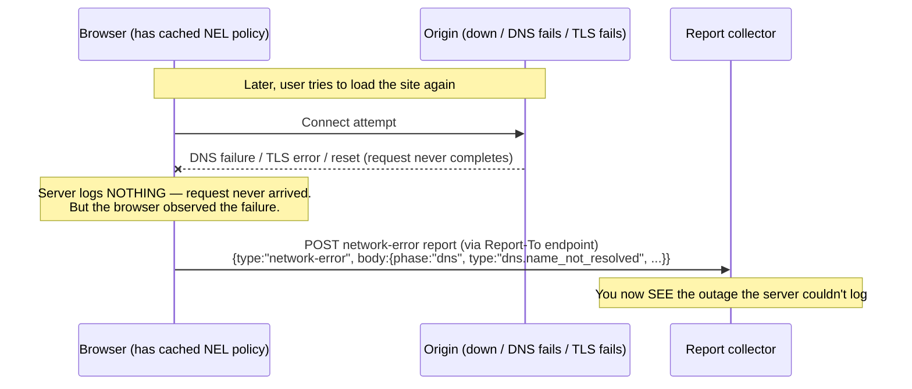
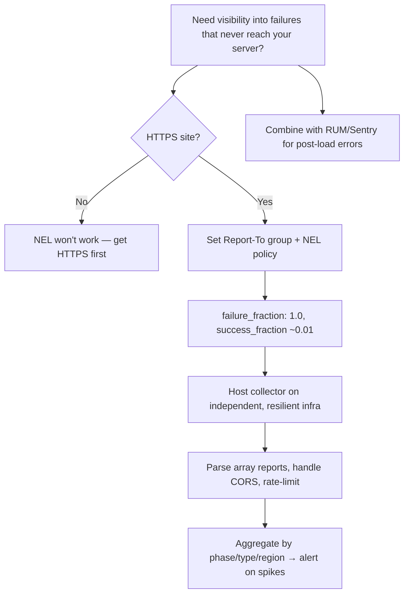

# NEL (Network Error Logging)

## Quick Summary

`NEL` (Network Error Logging) is a **response** header that asks the browser to **collect and report network-level errors** that occur when clients try to reach your site — DNS failures, TCP/TLS handshake failures, connection resets, timeouts, HTTP protocol errors, and more — and deliver them to a report endpoint defined via [`Report-To`](./Reporting-Endpoints-Report-To.md). Its value is a JSON policy: `NEL: {"report_to":"default","max_age":86400,"include_subdomains":true,"success_fraction":0.01,"failure_fraction":1.0}`. The revolutionary thing about NEL is that it captures failures **that never reach your server** — if a user's DNS can't resolve you, or their TLS handshake fails, or the connection to your origin drops, *your server logs show nothing* (the request never arrived), yet those users are experiencing an outage. NEL turns the *client's* browser into a distributed network-health probe that reports these otherwise-invisible failures back to you. It's the observability tool for the "it works for me but users say the site is down" class of problem — regional ISP issues, CDN edge failures, certificate problems, and connectivity outages you'd otherwise be blind to. It depends on the legacy [`Report-To`](./Reporting-Endpoints-Report-To.md) header (not `Reporting-Endpoints`) for its delivery endpoint.

## What problem does this header solve?

Server-side logs and even RUM (real-user-monitoring) JavaScript share a fatal blind spot: **they only see requests that succeed enough to run**. Consider the failures they miss:

- A user's DNS resolver can't resolve your domain → **no request reaches you, no JS runs** → you see nothing, but the user sees a dead site.
- A TLS handshake fails (bad cert, protocol mismatch, MITM) → connection never completes → invisible to you.
- A CDN edge or a regional ISP has connectivity problems → users in that region can't connect → your dashboards look green.
- Connections reset/time out mid-handshake → the request never becomes a log line.

In all these cases, the very failure prevents the normal telemetry from firing. You learn about the outage from angry tweets, not your monitoring. NEL solves this by asking the **browser itself** — which *does* observe the failure — to record it and report it out-of-band once connectivity is restored (or via a working connection). It gives you visibility into **connection-establishment and network-layer failures across your real user base**, geographically and by ISP, which is impossible to get from the server side alone. It's the difference between "we're up" (server view) and "users can actually reach us" (client view).

## Why was it introduced?

NEL is a **W3C specification** built on top of the **Reporting API**, created to close the network-observability gap that server logs and JS RUM cannot cover. It emerged alongside the Reporting API and [`Report-To`](./Reporting-Endpoints-Report-To.md) (which it reuses for delivery) because the same "browser reports things out-of-band" infrastructure that carried [CSP](./Content-Security-Policy.md) violations was ideal for carrying network errors too. Large-scale operators (CDNs, big sites) drove it: at scale, a small percentage of users hitting DNS/TLS/connectivity failures represents thousands of affected people you'd otherwise never detect, and correlating those failures by region/ISP/edge is invaluable for diagnosing partial outages, cert misconfigurations, and routing problems. It deliberately samples (`success_fraction`/`failure_fraction`) so you can collect *some* success baselines and *all* failures without drowning in traffic. Its dependence on `Report-To` (rather than the newer `Reporting-Endpoints`) reflects its origin in the first-generation Reporting API.

## How does it work?

The browser, on receiving a page with a valid `NEL` policy (over HTTPS), **caches the policy** (for `max_age`) and thereafter monitors requests to that origin. When a request fails at the network layer (or succeeds, within the sampled fraction), the browser generates a report and delivers it via the [`Report-To`](./Reporting-Endpoints-Report-To.md) group named in the policy — even reporting *failures to connect* on the *next* successful connection or to a *different* endpoint.



- **Browser behavior:** Caches the NEL policy per origin (HTTPS only), monitors connection/network outcomes, samples successes and failures per the fractions, and delivers reports via the referenced [`Report-To`](./Reporting-Endpoints-Report-To.md) group — including delivering queued failure reports once a working connection exists.
- **Server behavior:** The origin sets `NEL` (and a `Report-To` group) on HTTPS responses; a collector receives the reports. The server can't observe the failures itself — that's the point.
- **Report collector:** Receives `network-error` reports (JSON) describing phase (`dns`/`connection`/`application`), error type, sampling, elapsed time, protocol, and server IP.
- **Proxy/CDN behavior:** CDNs often set NEL to monitor edge health; must pass it (and `Report-To`) through.
- **Reverse proxy behavior:** A central place to inject NEL + `Report-To` on all HTTPS responses.

## HTTP Request Example

`NEL` is a **response** header; there's no request-side form. The browser's *report delivery* is a POST to your collector (via the [`Report-To`](./Reporting-Endpoints-Report-To.md) endpoint):

```http
POST /nel HTTP/1.1
Host: reports.example.com
Content-Type: application/reports+json

[{"age":210,"type":"network-error","url":"https://app.example.com/",
  "body":{"phase":"dns","type":"dns.name_not_resolved","sampling_fraction":1.0,
          "elapsed_time":210,"protocol":"","server_ip":""}}]
```

## HTTP Response Example

A typical NEL setup (NEL policy + its `Report-To` endpoint) — must be over HTTPS:

```http
HTTP/1.1 200 OK
Content-Type: text/html; charset=utf-8
Report-To: {"group":"nel-endpoint","max_age":2592000,"endpoints":[{"url":"https://reports.example.com/nel"}]}
NEL: {"report_to":"nel-endpoint","max_age":2592000,"include_subdomains":true,"success_fraction":0.01,"failure_fraction":1.0}
```

- `failure_fraction: 1.0` → report **all** failures (you want every one).
- `success_fraction: 0.01` → sample 1% of successes (a baseline, without flooding).
- `include_subdomains: true` → apply to subdomains too.
- `max_age` → how long the browser caches the policy.

## Express.js Example

```js
const express = require('express');
const app = express();

// 1) Set NEL + Report-To on HTTPS responses. NEL requires HTTPS.
app.use((req, res, next) => {
  // The Report-To group NEL will deliver to:
  res.set('Report-To', JSON.stringify({
    group: 'nel',
    max_age: 30 * 24 * 3600,
    endpoints: [{ url: 'https://reports.example.com/nel' }],
  }));
  // The NEL policy: report all failures, sample 1% of successes.
  res.set('NEL', JSON.stringify({
    report_to: 'nel',
    max_age: 30 * 24 * 3600,
    include_subdomains: true,
    success_fraction: 0.01,   // baseline of successes
    failure_fraction: 1.0,    // capture EVERY failure
  }));
  next();
});

// 2) The collector for network-error reports (batched application/reports+json).
app.post('/nel',
  express.json({ type: ['application/reports+json', 'application/json'] }),
  (req, res) => {
    const reports = Array.isArray(req.body) ? req.body : [req.body];
    for (const r of reports) {
      if (r.type === 'network-error') {
        // r.body.phase: dns | connection | application
        // r.body.type:  dns.name_not_resolved | tcp.timed_out | tls.failed | http.error | ok ...
        console.log('NEL', r.body.phase, r.body.type, r.url, r.body.server_ip);
        // → aggregate by phase/type/region for outage detection & alerting.
      }
    }
    res.status(204).end();
  }
);

// 3) Cross-origin collector needs CORS (browser sends reports as CORS requests).
app.options('/nel', (req, res) => {
  res.set('Access-Control-Allow-Origin', req.headers.origin || '*');
  res.set('Access-Control-Allow-Methods', 'POST, OPTIONS');
  res.set('Access-Control-Allow-Headers', 'Content-Type');
  res.status(204).end();
});

app.listen(3000);
```

Why each piece matters: NEL only works over **HTTPS** (browsers ignore it on plain HTTP), and it **requires** a `Report-To` group (route 1) — it does *not* use the newer `Reporting-Endpoints`. The sampling design is deliberate: `failure_fraction: 1.0` captures every failure (rare and precious), while `success_fraction` is kept tiny (successes are abundant; 1% is plenty for a baseline) so you don't drown your collector. The collector (route 2) keys reports by `phase` (`dns`/`connection`/`application`) and `type` — aggregating these by geography/ISP is what surfaces "users in region X can't resolve DNS" that your server logs *cannot* show. Cross-origin collectors need CORS (route 3) or reports silently vanish.

## Node.js Example

Raw `http` collector + policy:

```js
const https = require('https');
const fs = require('fs');

https.createServer({ key: fs.readFileSync('key.pem'), cert: fs.readFileSync('cert.pem') },
  (req, res) => {
    if (req.method === 'POST' && req.url === '/nel') {
      let body = '';
      req.on('data', c => (body += c));
      req.on('end', () => {
        try {
          JSON.parse(body).forEach(r => {
            if (r.type === 'network-error')
              console.log('NEL', r.body.phase, r.body.type, r.url);
          });
        } catch {}
        res.statusCode = 204; res.end();
      });
      return;
    }
    // Document response with NEL policy (HTTPS required):
    res.setHeader('Report-To', JSON.stringify({
      group: 'nel', max_age: 86400, endpoints: [{ url: 'https://reports.example.com/nel' }],
    }));
    res.setHeader('NEL', JSON.stringify({ report_to: 'nel', max_age: 86400, failure_fraction: 1.0 }));
    res.setHeader('Content-Type', 'text/html; charset=utf-8');
    res.end('<!doctype html><p>ok</p>');
  }).listen(443);
```

The essentials: HTTPS, a `Report-To` group, a `NEL` policy referencing it, and a collector that parses the batched `network-error` reports.

## React Example

React doesn't set `NEL` (server header), and — crucially — **NEL captures failures that React never gets a chance to observe**:

1. **The blind spot NEL fills for SPAs.** If a user can't resolve your domain or the TLS handshake fails, your React bundle never loads, so no error boundary, no `window.onerror`, no RUM script fires. NEL is the *only* way to learn those users exist. It's server/infra config, but it directly explains "users report the app won't load but our monitoring is green."

2. **Complements client-side error tracking.** Sentry/RUM catch JS errors and failed `fetch`es *after* the app loads; NEL catches connection/DNS/TLS failures *before* it loads. Together they cover the full failure spectrum.

3. **Nothing to do in React code** — but knowing NEL exists changes how you diagnose "can't reach the app" incidents: check your NEL reports (by region/ISP/phase), not just your app logs.

## Browser Lifecycle

1. The browser receives an HTTPS response with a valid `NEL` policy (and a `Report-To` group) and **caches the policy** for `max_age`.
2. On subsequent requests to that origin, the browser **monitors** the network outcome (DNS resolution, TCP connect, TLS handshake, HTTP response).
3. **Failures** (per `failure_fraction`) and a sample of **successes** (per `success_fraction`) generate `network-error` reports.
4. Reports are queued and delivered out-of-band via the referenced [`Report-To`](./Reporting-Endpoints-Report-To.md) endpoint — including delivering *connection-failure* reports once a working connection is available (possibly to a different, reachable endpoint).
5. The policy applies to subdomains if `include_subdomains` is set.
6. Plain-HTTP responses are ignored (NEL is HTTPS-only).

## Production Use Cases

- **Detecting invisible outages:** DNS, TLS, or connectivity failures that never reach your logs.
- **Regional/ISP problem detection:** aggregate reports by geography/network to spot partial outages.
- **CDN edge health monitoring:** catch failing edges/POPs from the client's perspective.
- **Certificate/TLS misconfiguration detection:** spot handshake failures across the user base.
- **Post-deploy connectivity validation:** confirm real users can actually connect after infra changes.
- **SLA/uptime measurement from the client side:** true reachability, not just server availability.

## Common Mistakes

- **Using `Reporting-Endpoints` instead of `Report-To`.** NEL specifically depends on `Report-To`; wiring it to `Reporting-Endpoints` won't deliver reports.
- **Serving NEL over plain HTTP.** Browsers ignore it; NEL is HTTPS-only.
- **`success_fraction: 1.0`.** Reporting *every* success floods your collector with useless volume; sample successes tiny (e.g. 0.01) and set `failure_fraction: 1.0`.
- **Cross-origin collector without CORS.** Reports fail to deliver silently.
- **Collector expecting a single object.** Reports arrive as a JSON *array* (`application/reports+json`).
- **Expecting real-time alerts.** Failure reports may be delayed until the client regains connectivity; NEL is near-real-time at best.
- **Ignoring privacy implications.** Reports reveal client network/geo info — disclose and handle per policy.
- **No aggregation.** Raw reports are noise; value comes from grouping by phase/type/region.

## Security Considerations

- **Privacy:** NEL reports include client-observed network details (server IP, protocol, timing, and implicitly the client's network/region). Treat as sensitive; disclose in your privacy policy and handle per GDPR/CCPA.
- **Collector hardening:** it ingests attacker-influenceable data at scale — validate, rate-limit, and don't render report contents unsafely.
- **DoS via report volume:** a widespread failure (or attack) can generate huge report bursts; sampling + collector rate-limiting are essential.
- **HTTPS-only by design:** ensures the policy itself isn't tampered with in transit.
- **Not an enforcement or protection mechanism:** NEL is pure observability; it doesn't fix or block anything. It complements security headers by revealing TLS/connection issues that might indicate attacks (e.g. TLS interception spikes).
- **Data minimization:** collect only what you need; consider aggregating/anonymizing at ingestion.

## Performance Considerations

- **Out-of-band, non-blocking:** report generation/delivery doesn't affect page performance.
- **Sampling controls volume:** `success_fraction`/`failure_fraction` let you tune collector load; capture all failures, few successes.
- **Collector scale:** at large user counts even sampled reports are substantial — size the ingestion pipeline.
- **Negligible header cost;** operational cost is in the collector and storage.
- **Diagnostic speed-up:** faster detection of network/regional outages reduces MTTR — an indirect but real reliability win.

## Reverse Proxy Considerations

Nginx setting NEL + Report-To on HTTPS responses:

```nginx
server {
  listen 443 ssl;
  server_name app.example.com;

  add_header Report-To '{"group":"nel","max_age":2592000,"endpoints":[{"url":"https://reports.example.com/nel"}]}' always;
  add_header NEL '{"report_to":"nel","max_age":2592000,"include_subdomains":true,"success_fraction":0.01,"failure_fraction":1.0}' always;

  location /nel {
    proxy_pass http://report_collector;   # your ingestion service
  }

  location / { proxy_pass http://app_upstream; }
}
```

Key points: set both headers on all HTTPS responses (`always`), and ensure the collector path handles the batched POSTs (and CORS if cross-origin). NEL only helps if the policy is broadly cached across your user base.

## CDN Considerations

- **CDNs frequently offer NEL** to monitor their own edge/POP health from the client side; some inject it automatically.
- **Edge-observed outages:** NEL reports can reveal a failing CDN edge that the origin (behind it) can't see.
- **Cloudflare/Fastly/etc.** may provide NEL/reporting integrations or dashboards; check vendor docs.
- **Consistency:** apply NEL across the property and pass `Report-To` through; keep the collector reachable even when the main site isn't (host it on a separate, resilient domain).

## Cloud Deployment Considerations

- **Separate, resilient collector domain:** host your report endpoint on infrastructure independent of the site being monitored, so failure reports can still be delivered when the main site is unreachable.
- **Managed hosts (Vercel/Netlify):** set NEL/`Report-To` via `_headers`/config; use a serverless or SaaS collector.
- **Third-party collectors:** Report URI and similar accept NEL reports.
- **Multi-region collector:** ensures reports from affected regions can reach *some* endpoint.
- **API Gateways/LBs:** pass the headers through; route the collector path.

## Debugging

- **Chrome DevTools → Application → Reporting API:** shows the NEL policy and generated network-error reports; Network shows the outgoing report POSTs.
- **Simulate failures:** temporarily break DNS/TLS in a test environment (or use a bad host) and confirm reports arrive at your collector.
- **curl (verify headers):** `curl -sD - -o /dev/null https://app/ | grep -i 'nel\|report-to'` — confirm both are present and NEL references the right group.
- **Collector test:** POST a sample `network-error` report and confirm ingestion.
- **Aggregate & visualize:** group reports by `phase`/`type`/region to spot patterns; a spike in `dns.name_not_resolved` from one region signals a regional DNS/CDN issue.
- **Cross-origin check:** ensure the collector returns CORS so cross-origin reports deliver.

## Best Practices

- [ ] Serve `NEL` **only over HTTPS**, paired with a [`Report-To`](./Reporting-Endpoints-Report-To.md) group (not `Reporting-Endpoints`).
- [ ] Set `failure_fraction: 1.0` and a small `success_fraction` (e.g. `0.01`) to capture all failures without flooding.
- [ ] Host the collector on **independent, resilient** infrastructure (ideally a separate domain) so failure reports still deliver during outages.
- [ ] Handle **CORS** on the collector and parse `application/reports+json` **arrays**.
- [ ] **Aggregate** reports by phase/type/region for outage detection and alerting.
- [ ] **Rate-limit** and secure the collector; treat report data as sensitive (privacy).
- [ ] Use `include_subdomains` where appropriate and a sensible `max_age`.
- [ ] Combine with client-side RUM/error tracking for full failure coverage.

## Related Headers

- [Reporting-Endpoints / Report-To](./Reporting-Endpoints-Report-To.md) — NEL depends on `Report-To` for delivery; the general reporting infrastructure.
- [Strict-Transport-Security](./Strict-Transport-Security.md) — HTTPS enforcement; NEL is HTTPS-only and can reveal TLS issues.
- [Content-Security-Policy](./Content-Security-Policy.md) — another Reporting-API consumer (violation reports).
- [Cross-Origin-Embedder-Policy](./Cross-Origin-Embedder-Policy.md) — also reports via the Reporting API.
- [Access-Control-Allow-Origin](../07-CORS/Access-Control-Allow-Origin.md) — needed on a cross-origin collector.
- [Server](../04-Response-Headers/Server.md) — server identity; NEL reports include `server_ip`.

## Decision Tree



## Mental Model

Think of NEL as **stationing a reporter inside every customer's phone to call you when they *can't even reach your store*** — the failures your in-store cameras (server logs) and your greeter (JavaScript RUM) fundamentally cannot witness, because those only work *once a customer is already inside*. If a customer's GPS can't find your address (DNS failure), or the road to your store is washed out (connection failure), or your door's lock is jammed (TLS handshake failure), your in-store systems record a perfectly quiet, empty day — while hundreds of customers stand stranded outside, invisible to you. The NEL reporter watches the customer's *attempt to arrive*, notes exactly where it broke down ("couldn't find the address," "road blocked in the north district"), and — cleverly — calls in the report *as soon as they reach any working phone line*, even if it's a competitor's. Because you'd be swamped if every reporter also called to say "arrived fine," they only report *all* the failures and a tiny random sample of successes (the sampling fractions). It's the one tool that answers the maddening question: "our monitoring says we're up — so why are people saying they can't reach us?"
