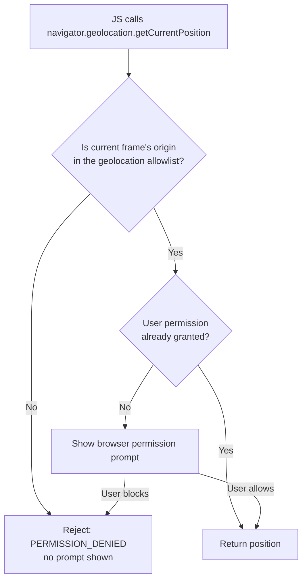

# Permissions-Policy

## Quick Summary

`Permissions-Policy` is a response header the origin uses to **declare which powerful browser features may run**, and **which origins may run them**, inside the document and its nested frames. Camera, microphone, geolocation, fullscreen, autoplay, payment, USB, accelerometer, clipboard, the Federated Credential Management API, and dozens more are each an individually gate-able "policy-controlled feature." Rather than trusting that your own code — or, more importantly, the third-party scripts and iframes you embed — will behave, you enumerate an **allowlist per feature** and the browser enforces it: a call to `navigator.geolocation.getCurrentPosition()` from a disallowed context simply fails, no matter what the JavaScript wants. It is the modern successor to `Feature-Policy`, ships enabled in all current browsers, and pairs with the iframe `allow` attribute to delegate features to embedded content. It does not stop XSS or framing (that is [Content-Security-Policy](./Content-Security-Policy.md) and [X-Frame-Options](./X-Frame-Options.md)); it reduces the *capability blast radius* of any code that does run.

## What problem does this header solve?

A modern web page is rarely just your code. It loads an analytics tag, an ad network, a chat widget, a payment iframe, a map embed, a video player — each running JavaScript with access to the same DOM and, by default, the same powerful device APIs your first-party code has. If any of those third parties (or an attacker who has compromised one of them, or an XSS payload on your own page) calls `getUserMedia`, they can request the camera and microphone. They can start geolocation prompts, trigger fullscreen, autoplay audio, or open a Web Payment sheet. Even if the browser shows a permission prompt, prompt fatigue and clickjacked prompts mean users grant things they shouldn't.

`Permissions-Policy` solves this by moving the decision from *runtime trust* to *declarative, browser-enforced policy*. You state, up front, "geolocation is allowed only for my own origin; camera and microphone are allowed for nobody; fullscreen is allowed for my origin and the video-provider iframe." Now the capability is unavailable to any other context regardless of what code runs there. It is the principle of least privilege applied to browser features — you shrink the set of dangerous things any script on the page *can even attempt*, which limits the damage of a compromised dependency or an injected script.

## Why was it introduced?

The API originally shipped as **`Feature-Policy`** around 2018 (Chrome 60-ish era), born from the observation that CSP controlled *content sources* but nothing controlled *device/API capabilities*. `Feature-Policy` used a different syntax — space-separated feature names each followed by an origin list: `Feature-Policy: geolocation 'self' https://maps.example.com`.

The feature was renamed and re-specified as **`Permissions-Policy`** (W3C Permissions Policy spec, ~2020) with a new, structured syntax borrowed from HTTP Structured Fields: `Permissions-Policy: geolocation=(self "https://maps.example.com")`. The rename disambiguated it from the unrelated Permissions API and unified the underlying model. For a transition period browsers accepted both headers; today you should send **only `Permissions-Policy`** — `Feature-Policy` is deprecated and being removed. The header also absorbed the older standalone allow/deny toggles that used to live in features like `document.domain` restrictions and became the vehicle for gating brand-new APIs (FLoC/`interest-cohort`, Topics, FedCM, attribution reporting) as they shipped, so vendors could ship a capability *off-by-default-for-third-parties* from day one.

## How does it work?

The header value is a comma-separated list of **feature=allowlist** entries. Each allowlist is a space-separated set of origin tokens inside parentheses, plus two special keywords:

- `*` — allowed in this document **and all nested frames of any origin**.
- `self` — allowed in this document and same-origin nested frames.
- `"https://origin.example"` — a specific origin (quoted string), allowing that origin (including in a nested frame).
- `()` — **empty allowlist: the feature is disabled everywhere**, including your own origin.

Example: `Permissions-Policy: geolocation=(self "https://maps.vendor.com"), camera=(), fullscreen=*`.

- **Browser behavior:** The browser parses the header when the document loads and computes, per feature, an *allowlist* that is intersected down the frame tree. When JS calls a policy-controlled API, the browser checks whether the **current browsing context** is in that feature's allowlist. If not, the call rejects/throws (e.g., `getCurrentPosition` invokes its error callback with `PERMISSION_DENIED`, `getUserMedia` rejects with `NotAllowedError`, `requestFullscreen` rejects). A feature disabled by policy can never be re-enabled by a child frame — policy only ever narrows going down the tree.
- **Server behavior:** The origin server emits the header on document (HTML) responses. It is a *document-level* policy, so it matters on navigations, not on sub-resource responses like images or JSON. Set it once, centrally, alongside your other security headers.
- **iframe delegation:** A parent grants a feature to a child frame in two coordinated places: the parent's `Permissions-Policy` allowlist must include the child's origin, **and** the `<iframe allow="...">` attribute must opt the frame in. Both are required — the header sets the outer bound, the attribute activates it for that specific frame.
- **Proxy behavior:** Forward proxies do not interpret `Permissions-Policy`; they pass it through. It is an end-to-end header meaningful only to the browser.
- **CDN behavior:** CDNs pass it through and can *inject* it at the edge (Cloudflare Transform Rules / Workers, Fastly VCL) — a common way to enforce a baseline policy without touching origin code. Ensure it is set on HTML responses and not stripped.
- **Reverse proxy behavior:** Nginx/Apache/HAProxy typically add it via `add_header` on HTML routes, centralizing policy at the edge of your own infrastructure.



Note the two-layer model: `Permissions-Policy` is the **first gate** (is this feature even permitted in this context?). The classic **permission prompt** is the second gate (does the user consent?). Policy denial happens *before* any prompt — the user is never asked for a feature policy has disabled.

## HTTP Request Example

There is no request counterpart; the browser does not send `Permissions-Policy`. A navigation request is ordinary:

```http
GET / HTTP/1.1
Host: app.example.com
Accept: text/html,application/xhtml+xml
```

The related request-side signal is the (now-standardized) `Sec-Fetch-*` metadata, but the policy itself is response-only.

## HTTP Response Example

A locked-down first-party app that uses geolocation for its own store-locator, embeds a payment iframe, and disables everything else:

```http
HTTP/1.1 200 OK
Content-Type: text/html; charset=utf-8
Permissions-Policy: geolocation=(self), payment=(self "https://checkout.stripe.com"), camera=(), microphone=(), usb=(), fullscreen=(self), autoplay=(), interest-cohort=()
Content-Security-Policy: default-src 'self'
X-Content-Type-Options: nosniff
```

Reading it: geolocation only for the app's own origin; payment allowed for the app and Stripe's checkout iframe; camera, microphone, USB, autoplay, and FLoC cohort calculation disabled for everyone (including the first party); fullscreen for the first party only.

A reporting-enabled policy (violations are sent to a collector via the Reporting API):

```http
HTTP/1.1 200 OK
Content-Type: text/html; charset=utf-8
Permissions-Policy: camera=(), geolocation=(self)
Reporting-Endpoints: perms="https://reports.example.com/pp"
```

## Express.js Example

```js
const express = require('express');
const app = express();

// A single, centralized security-headers middleware applied to HTML routes.
// Permissions-Policy is a DOCUMENT policy: it only matters on navigations,
// so scoping it to page responses (not the JSON API) keeps API responses lean.
function securityHeaders(req, res, next) {
  // Build the policy as an ordered list of feature=allowlist entries.
  // Every feature you DON'T list falls back to its spec default allowlist
  // (many powerful features default to `self`, but NOT all — so be explicit).
  const policy = [
    'geolocation=(self)',            // only our own origin may call the Geolocation API.
    'camera=()',                     // empty list => camera disabled everywhere, us included.
    'microphone=()',                 // same: no getUserMedia audio anywhere on the page.
    'payment=(self "https://checkout.stripe.com")', // delegate payment to our checkout iframe.
    'fullscreen=(self)',             // our video player can go fullscreen; embeds cannot.
    'usb=()',                        // WebUSB fully off — high-risk device access.
    'autoplay=()',                   // block auto-playing media from any embed (UX + abuse).
    'interest-cohort=()',            // opt out of FLoC/Topics cohort computation.
  ].join(', ');

  res.setHeader('Permissions-Policy', policy);
  // If you remove a feature from this list, the browser applies that feature's
  // DEFAULT allowlist instead of your intent — which for e.g. `fullscreen` is `*`
  // in some engines, silently re-opening a capability. Be exhaustive for anything risky.
  next();
}

// Apply only to page renders, where the resulting document is a browsing context.
app.get(['/', '/store', '/checkout'], securityHeaders, (req, res) => {
  res.type('html').send('<!doctype html><title>App</title>...');
});

// The JSON API does not create a browsing context, so Permissions-Policy is a no-op there;
// omit it to avoid confusion and bytes.
app.get('/api/stores', (req, res) => res.json([/* ... */]));

app.listen(3000);
```

Using **Helmet**, which manages security headers as a bundle:

```js
const helmet = require('helmet');

// Helmet does NOT set Permissions-Policy by default (policies are app-specific),
// so you set it explicitly. Helmet still handles CSP, HSTS, X-Content-Type-Options, etc.
app.use(helmet()); // sensible defaults for the other security headers.
app.use((req, res, next) => {
  res.setHeader(
    'Permissions-Policy',
    'geolocation=(self), camera=(), microphone=(), payment=(self "https://checkout.stripe.com"), interest-cohort=()'
  );
  next();
});
```

Every entry is load-bearing: dropping `camera=()`/`microphone=()` means a compromised third-party script can invoke `getUserMedia` and trigger a camera prompt; dropping `interest-cohort=()` opts your users into cohort computation; forgetting `payment` in the allowlist means your legitimate Stripe iframe's `PaymentRequest` silently fails.

## Node.js Example

Raw `http` differs only in that nothing is set for you — you write the exact header string:

```js
const http = require('http');

const PERMISSIONS_POLICY =
  'geolocation=(self), camera=(), microphone=(), fullscreen=(self), payment=(self "https://checkout.stripe.com"), interest-cohort=()';

http.createServer((req, res) => {
  if (req.url === '/' || req.url === '/checkout') {
    // Set on the DOCUMENT response only. Order of features is irrelevant; syntax is strict:
    // structured-field parsing means a malformed token (e.g. missing quotes on an origin)
    // makes the browser ignore THAT entry, not the whole header.
    res.setHeader('Permissions-Policy', PERMISSIONS_POLICY);
    res.setHeader('Content-Type', 'text/html; charset=utf-8');
    return res.end('<!doctype html><title>App</title>');
  }
  res.statusCode = 404;
  res.end();
}).listen(3000);
```

## React Example

React never sets or reads `Permissions-Policy` — it is a response header emitted by whatever serves your HTML (Express, Next.js, a CDN, an S3+CloudFront front). React's relationship is **indirect but decisive** in two ways:

1. **Your feature policy determines whether your React code's device calls work.** If you write a component that calls `navigator.geolocation.getCurrentPosition` but your server sends `geolocation=()`, the effect's error callback fires with `PERMISSION_DENIED` and the feature is dead — with no prompt and no obvious cause. The policy is set outside React but breaks React features.

2. **`<iframe>` delegation is expressed in JSX via the `allow` attribute.** When you embed a payment or video iframe in a React tree, you must set `allow` to activate the delegated feature (and the top document's `Permissions-Policy` must permit that origin):

```jsx
function CheckoutFrame() {
  return (
    // `allow` activates delegated features for THIS frame. Both the outer
    // Permissions-Policy allowlist AND this attribute must include the capability,
    // or PaymentRequest inside the iframe throws NotAllowedError.
    <iframe
      title="Secure checkout"
      src="https://checkout.stripe.com/pay/session_123"
      allow="payment 'src'; fullscreen"   // 'src' = the frame's own src origin.
      sandbox="allow-scripts allow-forms allow-same-origin"
    />
  );
}

function StoreLocator() {
  const [pos, setPos] = React.useState(null);
  React.useEffect(() => {
    // Works ONLY if the document was served with geolocation=(self) or broader.
    navigator.geolocation.getCurrentPosition(
      (p) => setPos(p.coords),
      (err) => console.warn('geo blocked (policy or user):', err.code) // 1 = PERMISSION_DENIED
    );
  }, []);
  return pos ? <Map center={pos} /> : <p>Locating…</p>;
}
```

In Next.js, the policy is configured in `next.config.js` `headers()` or middleware, not in the component — same separation: the framework serves the header, the component consumes the capability.

## Browser Lifecycle

1. **Document response arrives.** The browser parses `Permissions-Policy` as a structured field and builds a per-feature allowlist for the top-level document.
2. **Frame tree construction.** For each nested `<iframe>`, the browser computes the child's *inherited* policy = parent's allowlist **∩** the frame's `allow` attribute. A feature the parent has disabled can never be enabled in a child — intersection only narrows.
3. **API call.** When script calls a policy-controlled API, the browser looks up the calling context's allowlist for that feature.
4. **Policy check (gate 1).** If the context is not allowed, the call fails immediately (throw / rejected promise / error callback), and no user prompt appears. A violation report may be queued if reporting is configured.
5. **Permission check (gate 2).** If policy allows, the normal user-permission flow runs (prompt if not previously decided).
6. **Reporting.** Policy violations are delivered via the Reporting API to endpoints named in `Reporting-Endpoints`, either as `Report-Only` observations or alongside enforcement.

## Production Use Cases

- **Disable unused high-risk features globally** as a baseline: `camera=(), microphone=(), usb=(), serial=(), payment=(), geolocation=()` on every page shrinks the attack surface for third-party scripts and XSS.
- **Delegate exactly one feature to exactly one vendor iframe:** payment to Stripe/Braintree, camera to a KYC/identity-verification embed, geolocation to a maps provider — allowlist that origin and set the frame's `allow`.
- **Opt out of behavioral-advertising cohorts:** `interest-cohort=()` (and Topics equivalents) is a standard privacy-posture line item.
- **Prevent autoplay abuse:** `autoplay=()` stops embedded ads/videos from auto-playing sound.
- **Report-only rollout:** ship `Permissions-Policy-Report-Only` first to discover which features your real traffic uses before enforcing.

## Common Mistakes

- **Confusing `()` with omission.** `camera=()` disables the camera. *Leaving `camera` out entirely* applies the spec default (for many features that default is `self`, not "off"). If you want a feature off, write the empty allowlist explicitly.
- **Forgetting the two-part iframe handshake.** Setting `<iframe allow="camera">` without listing the frame's origin in the parent's `Permissions-Policy` (or vice-versa) leaves the feature disabled. Both must agree.
- **Still sending `Feature-Policy`.** The old header and old syntax (`geolocation 'self'`) are deprecated; mixing them causes confusion and some engines ignore the legacy one. Send only `Permissions-Policy`.
- **Unquoted origins.** Origins must be quoted strings: `payment=(self "https://x.com")`, not `payment=(self https://x.com)`. An unquoted origin is a parse error for that entry.
- **Setting it on API/JSON responses.** It only affects browsing contexts (documents). On an XHR/`fetch` JSON response it does nothing.
- **Assuming it prompts.** Policy denial is silent — no prompt. Teams often debug "the prompt never shows" not realizing policy killed the call before the prompt stage.
- **Expecting `*` to override a parent's denial.** In a nested frame, `*`/`allow` can never re-grant a feature the ancestor disabled.

## Security Considerations

- **It is a blast-radius control, not a vulnerability fix.** `Permissions-Policy` limits what *any* code (including injected XSS or a compromised dependency) can do with device/API features. It complements, and does not replace, [CSP](./Content-Security-Policy.md) (which limits what code/resources load) and [X-Frame-Options](./X-Frame-Options.md) (framing).
- **Least privilege for third parties.** The strongest posture is deny-by-default: disable every powerful feature, then delegate the minimum to the minimum origins. This is the primary defense against a malicious or hijacked ad/analytics/chat script silently accessing the camera, mic, or location.
- **Defends against clickjacked permission prompts.** By disabling a feature outright, you ensure a framed attacker cannot trick a user into approving a camera/geolocation prompt for content the user misunderstands.
- **Does not encrypt or authenticate anything.** It is purely a capability gate enforced by the browser; a non-browser client ignores it. Never treat it as server-side authorization.
- **Report-Only leaks nothing sensitive** but violation reports can reveal which features your site uses to a report collector — keep the collector first-party or trusted.

## Performance Considerations

- **Effectively free.** It is a small header on document responses, parsed once per navigation. No measurable runtime cost.
- **Prefer edge/central injection over per-route logic** to avoid recomputing the string; a static header value is ideal and cacheable.
- **Keep it off sub-resource responses** — sending it on every JSON/image response wastes a few dozen bytes each and signals nothing (it is document-scoped).
- **`interest-cohort=()` / Topics opt-out** has privacy value with zero perf cost.

## Reverse Proxy Considerations

Nginx applying a baseline policy to HTML responses:

```nginx
server {
  # Apply the policy to page routes. `always` ensures it's added even on error
  # responses (4xx/5xx) that still render HTML.
  location / {
    proxy_pass http://app_upstream;
    add_header Permissions-Policy
      "geolocation=(self), camera=(), microphone=(), usb=(), payment=(self \"https://checkout.stripe.com\"), fullscreen=(self), interest-cohort=()"
      always;
  }

  # Do NOT add it to static asset locations; it's meaningless there and just bloats responses.
  location /assets/ {
    proxy_pass http://app_upstream;
  }
}
```

Note the escaped quotes around the origin — the structured-field syntax requires quoted origins, and Nginx needs them escaped inside its own quoted string. A frequent bug is `add_header` being *replaced* (not merged) when a nested `location` also sets headers; if a route sets any `add_header`, it must re-declare all inherited ones.

## CDN Considerations

- **Cloudflare:** Inject or override via Transform Rules ("Modify Response Header") or a Worker. A common enterprise pattern is a Worker that stamps a corporate baseline `Permissions-Policy` on every HTML response, guaranteeing coverage even for legacy origins that don't set it.
- **Fastly:** Set it in VCL (`set resp.http.Permissions-Policy = "…";`) in `vcl_deliver`.
- **CloudFront:** Use a **Response Headers Policy** (managed feature) to attach `Permissions-Policy` at the edge without Lambda@Edge.
- **Gotcha:** Ensure the CDN doesn't cache an HTML response *without* the header and then serve it after you add the header at origin — purge after policy changes. Also confirm the CDN isn't stripping it as an "unknown" header.

## Cloud Deployment Considerations

- **Vercel / Netlify:** Configure via `vercel.json` `headers` or `_headers` / `next.config.js`. Scope to routes that serve HTML.
- **AWS ALB / API Gateway:** ALB won't add it; use CloudFront's Response Headers Policy or set it in the app. API Gateway can inject via a Gateway Response header mapping, but it's cleaner at the CDN.
- **Static hosting (S3 + CloudFront):** S3 can't set response headers conditionally well; use the CloudFront Response Headers Policy.
- **Kubernetes ingress (nginx-ingress):** add via `configuration-snippet` annotation, same escaping rules as raw Nginx.

## Debugging

- **Chrome DevTools:** The **Network** panel → document request → **Response Headers** shows the raw `Permissions-Policy`. The **Application → Frames** and the **Issues** panel surface policy violations. When an API call is policy-blocked you'll see a console message like *"Permissions policy violation: geolocation is not allowed in this document."*
- **`document.featurePolicy` / `document.permissionsPolicy`** (where supported) can be queried: `document.featurePolicy.allowsFeature('geolocation')` returns a boolean for the current context — the fastest way to confirm the effective policy.
- **curl:** `curl -sD - -o /dev/null https://app.example.com/ | grep -i permissions-policy` dumps the header as sent.
- **Postman / Bruno:** inspect the response headers on a GET to the page; add a test asserting the header contains your expected entries (`pm.response.headers.get('Permissions-Policy')`).
- **Node/Express logging:** log `res.getHeader('Permissions-Policy')` in a `res.on('finish')` hook to confirm what actually shipped per route.
- **Report-Only mode:** deploy `Permissions-Policy-Report-Only` with a `Reporting-Endpoints` collector to observe violations from real traffic before enforcing.

## Best Practices

- [ ] Send **only** `Permissions-Policy` (drop legacy `Feature-Policy`).
- [ ] Deny-by-default: explicitly `feature=()` every powerful feature you don't use — don't rely on defaults.
- [ ] Delegate the minimum features to the minimum origins; pair the header allowlist with the iframe `allow` attribute.
- [ ] Include `interest-cohort=()` (and Topics opt-out) as a privacy baseline.
- [ ] Set it only on HTML/document responses, centrally (middleware, reverse proxy, or CDN).
- [ ] Roll out with `Permissions-Policy-Report-Only` + a reporting endpoint before enforcing.
- [ ] Re-declare inherited headers in nested Nginx `location` blocks so `add_header` isn't dropped.
- [ ] Verify with `document.featurePolicy.allowsFeature(...)` and DevTools Issues after each change.

## Related Headers

- [Content-Security-Policy](./Content-Security-Policy.md) — controls *what resources/code load*; `Permissions-Policy` controls *what capabilities that code may use*. Deploy them together for defense in depth.
- [X-Frame-Options](./X-Frame-Options.md) / CSP `frame-ancestors` — control whether you can be framed; `Permissions-Policy` controls what features frames get.
- [Cross-Origin-Opener-Policy](./Cross-Origin-Opener-Policy.md), [Cross-Origin-Embedder-Policy](./Cross-Origin-Embedder-Policy.md), [Cross-Origin-Resource-Policy](./Cross-Origin-Resource-Policy.md) — the cross-origin isolation family; different axis (process/embedding isolation) but part of the same "reduce the blast radius" security posture.
- [Referrer-Policy](./Referrer-Policy.md) — another declarative, browser-enforced privacy control shipped alongside it.
- `Reporting-Endpoints` — names the collector for `Permissions-Policy` violation reports.

## Decision Tree

```mermaid
flowchart TD
    A[Choosing Permissions-Policy per feature] --> B{Does my own code use<br/>this feature?}
    B -- No --> C{Does any embedded<br/>iframe need it?}
    C -- No --> D["feature=() — disable everywhere"]
    C -- Yes --> E["feature=(\"https://that-origin\") + iframe allow"]
    B -- Yes --> F{Only my origin?}
    F -- Yes --> G["feature=(self)"]
    F -- No, plus a vendor --> H["feature=(self \"https://vendor\")"]
    B -- Uncertain --> I["Ship Permissions-Policy-Report-Only<br/>+ Reporting-Endpoints, observe, then lock down"]
```

## Mental Model

Think of `Permissions-Policy` as the **circuit breaker panel for a building you're renting out**. The building has powerful utilities — high-voltage lines (camera/mic), gas (payment), water mains (geolocation), industrial machinery (USB/serial). By default a lot of it is live. As the landlord (origin) you walk to the breaker panel and **flip off every circuit no tenant should touch** (`camera=()`), leave your own workshop's circuit on (`geolocation=(self)`), and run a dedicated, labeled line to exactly one trusted contractor's suite (`payment=(self "https://checkout.stripe.com")` + the iframe `allow`). Tenants (third-party scripts and frames) can flip their own switches all they like, but if the breaker is off at the panel, nothing downstream gets power — and a sub-tenant can never restore a circuit the landlord killed. The permission *prompt* is a separate thing: even on a live circuit, the appliance still asks the user before it turns on. Policy decides what's wired; the prompt decides what's switched on.
