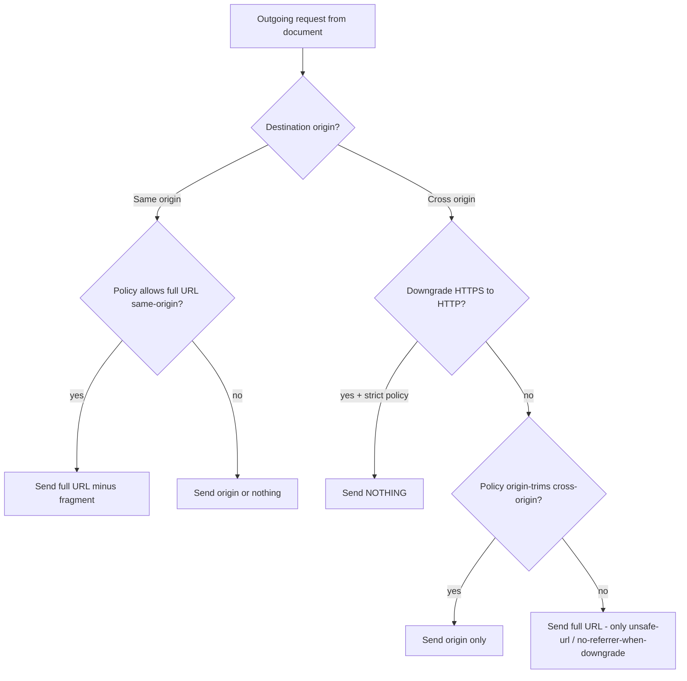
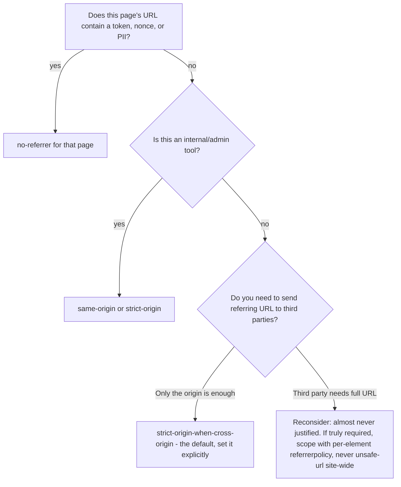

# Referrer-Policy

## Quick Summary

`Referrer-Policy` is a **response header** (also settable via a `<meta>` tag and per-element `referrerpolicy` attributes) that tells the browser **how much of the current document's URL to reveal in the `Referer` request header** of outgoing requests and navigations. It does not add information — it strips it. The server sets a policy; the browser enforces it on every subresource fetch, navigation, and `fetch()`/XHR that leaves the document. The modern browser default when no policy is set is `strict-origin-when-cross-origin`, which sends the full URL to same-origin destinations, only the origin to cross-origin HTTPS destinations, and nothing when downgrading HTTPS→HTTP. The whole feature exists to stop sensitive data in URLs — session tokens, password-reset nonces, internal paths, PII query strings — from leaking to third parties and analytics endpoints via the `Referer` header.

## What problem does this header solve?

The `Referer` header (misspelled since RFC 1945, and the misspelling is now normative) is stamped by the browser onto outbound requests to tell the destination *which page linked here*. That is useful for analytics and abuse detection, but it is a chronic **privacy and security leak** because the URL of the current page is often loaded with secrets:

- **Credentials and tokens in URLs.** Password reset links (`/reset?token=abc123`), magic-login links, OAuth `code`/`state` parameters, signed S3 URLs, and API keys embedded in query strings all end up in the address bar. Without a referrer policy, every ``, `<script>`, analytics pixel, and outbound link on that page ships that full URL to a third party in the `Referer` header.
- **Cross-origin path leakage.** An internal admin tool at `https://app.internal/customers/93412/ssn` that loads a Google Font or a Sentry script would, by default on legacy policy, hand the full path to those third parties.
- **HTTPS→HTTP downgrade leakage.** Historically the `Referer` was sent even when navigating from a secure page to an insecure one, exposing the secure URL over plaintext to any network observer.

`Referrer-Policy` is the control surface that lets a site decide, precisely, how much of that URL the browser is allowed to disclose — per destination, per protocol, per origin relationship. See the request-side counterpart in [Referer](../03-Request-Headers/Referer.md).

## Why was it introduced?

The `Referer` header dates to the earliest HTTP specs and had no privacy controls. The first attempt at control was **`rel="noreferrer"`** on links (HTML5) and the non-standard `X-Referrer-Policy`-style hacks. The **W3C Referrer Policy specification** (first working drafts around 2014, Candidate Recommendation in 2017) unified this into a single `Referrer-Policy` header, a `<meta name="referrer">` element, and per-element `referrerpolicy` attributes.

The critical historical inflection was the shift in **browser defaults**. For decades the implicit default was `no-referrer-when-downgrade` — send the full URL everywhere except on HTTPS→HTTP downgrades. Starting in 2020 (Chrome 85, Firefox 87, then Safari), browsers changed the **default with no header present** to `strict-origin-when-cross-origin`. This was a privacy-motivated, industry-wide change: even sites that never heard of the header suddenly stopped leaking full cross-origin paths. Understanding this default shift is essential — a lot of "our referrer analytics broke" incidents trace directly to it.

## How does it work?

The policy is a single token (or a comma-separated fallback list; the browser uses the last value it understands). It governs the value of the `Referer` header the browser generates for **outgoing requests originating from this document**: subresource loads, `fetch`/XHR, navigations, prefetches, and form submissions.

- **Browser behavior:** On every outgoing request, the browser computes the `Referer` value by taking the current document's URL and applying the active policy: it may send the **full URL** (path + query, but the fragment `#…` is *never* sent), only the **origin** (`https://example.com/`), or **nothing**. The policy source precedence is: per-request/element policy (`referrerpolicy` attribute, `rel="noreferrer"`, `fetch(..., {referrerPolicy})`) > document policy (`Referrer-Policy` response header or `<meta name="referrer">`) > browser default. The browser also never sends a referrer whose value would be a non-HTTP(S) URL (e.g., from a `file:` or `data:` document).
- **Server behavior:** The server's only role is to *emit* the `Referrer-Policy` header (or the meta tag) on the document response. It cannot force a client to honor it, but all evergreen browsers do. On the receiving end, a server *reads* the resulting `Referer` request header — the policy on the sending site determines how much it sees.
- **Proxy behavior:** Forward proxies pass `Referrer-Policy` through untouched (it is an end-to-end response header). A proxy that strips or rewrites `Referer` on the request side can override the browser's computed value, but that is a request-header concern, not a policy concern.
- **CDN behavior:** CDNs commonly *inject* a default `Referrer-Policy` on all responses (Cloudflare's "Security Header" / Managed Transform, Fastly VCL, CloudFront response-header policies). If your origin also sets one, you can end up with duplicate or conflicting values — the browser takes the header as a single field; multiple values become a comma list and the last understood token wins.
- **Reverse proxy behavior:** Nginx/Apache/Envoy typically add `Referrer-Policy` centrally with `add_header`, so every app behind the proxy inherits a consistent policy without touching application code. Watch for `add_header` inheritance rules (see [Reverse Proxy Considerations](#reverse-proxy-considerations)).

### The eight policy values

| Value | Same-origin dest | Cross-origin HTTPS→HTTPS | HTTPS→HTTP (downgrade) | What it sends |
|---|---|---|---|---|
| `no-referrer` | nothing | nothing | nothing | Never sends `Referer` at all. |
| `no-referrer-when-downgrade` | full URL | full URL | nothing | The *old* default. Leaks full path cross-origin. |
| `origin` | origin only | origin only | origin only | Always just `https://site.com/`, even same-origin. |
| `origin-when-cross-origin` | full URL | origin only | origin only | Full URL to yourself, origin to everyone else. |
| `same-origin` | full URL | nothing | nothing | Full URL only to same origin; nothing cross-origin. |
| `strict-origin` | origin only | origin only | nothing | Origin only, and nothing on downgrade. |
| `strict-origin-when-cross-origin` **(default)** | full URL | origin only | nothing | Full to self, origin cross-origin, nothing on downgrade. |
| `unsafe-url` | full URL | full URL | full URL | Sends everything, always, including on downgrade. Named "unsafe" for a reason. |

Two axes explain the whole table: **"strict"** means *drop the referrer entirely on a secure→insecure downgrade*; **"origin"** means *trim path+query, keep only scheme+host+port*. `strict-origin-when-cross-origin` is the sweet spot the platform chose as default: your own analytics keep full paths, third parties get only your origin, and network downgrades leak nothing.



## HTTP Request Example

The header itself never appears on requests. What it *controls* is the `Referer` request header the browser subsequently generates. Given the sending page is `https://shop.example.com/cart?coupon=SECRET42` under `strict-origin-when-cross-origin`, a load of a third-party analytics pixel produces:

```http
GET /pixel.gif HTTP/2
Host: analytics.thirdparty.com
Referer: https://shop.example.com/
Sec-Fetch-Site: cross-site
```

Note the path and `?coupon=SECRET42` are gone — only the origin survives. A same-origin fetch from the same page instead sends `Referer: https://shop.example.com/cart?coupon=SECRET42` in full.

## HTTP Response Example

The document response declares the policy:

```http
HTTP/2 200 OK
Content-Type: text/html; charset=utf-8
Referrer-Policy: strict-origin-when-cross-origin
Cache-Control: no-store
```

Multiple values are legal as a fallback list; a browser that doesn't understand `strict-origin-when-cross-origin` falls back to `no-referrer`:

```http
Referrer-Policy: no-referrer, strict-origin-when-cross-origin
```

## Express.js Example

```js
const express = require("express");
const helmet = require("helmet");
const app = express();

// Option A — the explicit, dependency-free way.
// Sets the policy on every response before any route handler runs.
app.use((req, res, next) => {
  // strict-origin-when-cross-origin matches the browser default, so setting it
  // explicitly is documentation + protection against a proxy stripping the default.
  res.setHeader("Referrer-Policy", "strict-origin-when-cross-origin");
  next();
});

// Option B — Helmet. Helmet's referrerPolicy middleware validates the token
// and refuses unknown values, preventing a typo like "strict-origin-cross" from
// silently shipping (a raw setHeader would ship the typo and the browser would
// ignore it, falling back to its default).
app.use(
  helmet.referrerPolicy({
    policy: "strict-origin-when-cross-origin",
  })
);

// Per-route override: a password-reset page must never leak its token, so we
// harden it to no-referrer regardless of the global policy. This response-level
// override is why route-specific security matters — the token lives in the URL.
app.get("/reset", (req, res) => {
  res.setHeader("Referrer-Policy", "no-referrer"); // strongest — nothing leaks
  res.setHeader("Cache-Control", "no-store");       // also keep the token out of caches
  res.send(renderResetForm(req.query.token));
});

app.listen(3000);
```

Every line is load-bearing: the global middleware guarantees a baseline even on error pages; the Helmet variant adds *validation* (a misspelled policy is worse than none because it looks correct in code review); the `/reset` override recognizes that a global "safe" policy still sends the **full same-origin URL** to same-origin requests, and the reset token sits in that URL — so on that one page you drop to `no-referrer`.

## Node.js Example

Raw `http` module — identical concept, no framework sugar:

```js
const http = require("http");

http
  .createServer((req, res) => {
    // writeHead lets us set the policy alongside status and content type in one call.
    res.writeHead(200, {
      "Content-Type": "text/html; charset=utf-8",
      "Referrer-Policy": "strict-origin-when-cross-origin",
    });
    res.end("<!doctype html><h1>Hello</h1>");
  })
  .listen(3000);
```

There is nothing Node-specific here beyond the fact that `writeHead` (or `res.setHeader` before `res.end`) is the only place you can set response headers — once the head is flushed, `setHeader` throws `ERR_HTTP_HEADERS_SENT`.

## React Example

React does not set HTTP response headers — those come from your server/host. But React (and the DOM) give you three finer-grained levers:

```jsx
// 1. Document-level default via a meta tag rendered into <head>.
//    In Next.js App Router this goes in the metadata export; in plain React,
//    react-helmet or a raw <meta> in your HTML template.
<meta name="referrer" content="strict-origin-when-cross-origin" />

// 2. Per-element override on a specific outbound link that must leak nothing.
function ExternalLink({ href, children }) {
  return (
    // referrerPolicy is a real DOM attribute; rel="noreferrer" is the older,
    // more widely supported equivalent that ALSO blocks window.opener.
    <a href={href} target="_blank" rel="noreferrer" referrerPolicy="no-referrer">
      {children}
    </a>
  );
}

// 3. Per-request override on fetch — send no referrer to a third-party API.
async function pingThirdParty() {
  await fetch("https://api.thirdparty.com/track", {
    method: "POST",
    referrerPolicy: "no-referrer", // wins over the document policy for this call
  });
}
```

The `referrerPolicy` attribute and `rel="noreferrer"` differ: `rel="noreferrer"` also severs `window.opener` (a `target="_blank"` security concern — see [Cross-Origin-Opener-Policy](./Cross-Origin-Opener-Policy.md)), whereas `referrerPolicy="no-referrer"` only affects the `Referer` header. For external links you almost always want both.

## Browser Lifecycle

1. **Document loads.** The browser parses the `Referrer-Policy` response header (and any `<meta name="referrer">`, whichever it encounters; the meta can override mid-parse). It stores the *effective document policy*.
2. **An outbound request is queued** — a subresource, navigation, `fetch`, prefetch, beacon, or form POST.
3. **Policy resolution.** The browser picks the most specific policy: request-level (`fetch` option, element attribute) beats document-level beats browser default.
4. **Referrer computation.** It strips the fragment always, then applies trimming (full/origin/none) based on same-vs-cross-origin and secure-vs-downgrade.
5. **Header emission.** The computed value (if any) is placed in the `Referer` request header. If the result is empty, no `Referer` is sent at all.
6. **Receiving server** reads `Referer` and sees exactly what the sending policy permitted.

The fragment (`#section`) is *never* transmitted under any policy — that is a hard invariant, not a policy choice.

## Production Use Cases

- **Baseline privacy hardening.** Set `strict-origin-when-cross-origin` (or stricter) site-wide via reverse proxy so no page leaks full paths to third-party scripts, fonts, or CDNs.
- **Token-bearing pages.** Password reset, email verification, OAuth callbacks, and signed-URL pages set `no-referrer` so the token never appears in *any* `Referer`, even to same-origin subresources loaded from a CDN.
- **Analytics-dependent sites** that need full same-origin referrers for funnel analysis keep `strict-origin-when-cross-origin` (full URL stays for same-origin) while still protecting third parties.
- **Marketing/attribution.** Some ad networks *require* the referring origin. `strict-origin-when-cross-origin` sends your origin cross-site, satisfying attribution without exposing paths.
- **Internal tools.** Admin dashboards behind a proxy get `same-origin`, so any accidental third-party embed leaks nothing.

## Common Mistakes

- **Assuming the default is `no-referrer-when-downgrade`.** It changed to `strict-origin-when-cross-origin` in 2020. Code that relied on receiving full cross-origin referrers broke silently. Always test what you actually receive.
- **Setting `unsafe-url` "to fix analytics."** This sends full URLs — including tokens — to every third party and over downgrades. It is almost never correct; the name is a warning.
- **Forgetting per-page overrides.** A global "safe" policy still sends the **full URL to same-origin destinations**. If your reset token is in the URL and the page loads a same-origin analytics script, the token leaks to your own logs. Use `no-referrer` on those pages.
- **Putting secrets in URLs at all.** `Referrer-Policy` mitigates the leak but is defense-in-depth. Tokens belong in `Authorization` headers or POST bodies, not query strings. See [Authorization](../09-Authentication/Authorization.md).
- **Typos.** `strict-origin-when-cross-origin` is long; a misspelling makes the browser ignore the header and fall back to default. Use Helmet or a constant.
- **Relying on it for security against non-browser clients.** curl, servers, and bots ignore it entirely — they send whatever `Referer` they want.

## Security Considerations

- The header is a **privacy/leakage control, not an access control.** It reduces what *honest browsers* disclose. It does nothing against a malicious client that forges `Referer`.
- Never treat an incoming `Referer` as trustworthy for auth or CSRF — it is spoofable and often absent. Use tokens and `Sec-Fetch-Site` / SameSite cookies instead (see [Sec-Fetch-Site](../03-Request-Headers/Sec-Fetch-Site.md)).
- `no-referrer` on token pages closes a real exfiltration path: a third-party script or a compromised CDN asset on a reset page can otherwise read the token from `document.referrer` or receive it in `Referer`.
- Combine with `Cache-Control: no-store` on token pages so the URL is not persisted in shared caches or browser history exports.

## Performance Considerations

`Referrer-Policy` has **negligible performance cost** — it is a few bytes on the response and a cheap string computation per outbound request. The only indirect performance angle: overly strict policies (`no-referrer`) can *reduce* CDN/analytics cache-key effectiveness or break referrer-based edge logic, and can defeat some prefetch/prerender optimizations that key on origin. There is no measurable latency or payload concern.

## Reverse Proxy Considerations

Set it once, centrally, so every backend inherits it.

**Nginx:**

```nginx
# always = emit even on error responses (4xx/5xx), which app code may not reach.
add_header Referrer-Policy "strict-origin-when-cross-origin" always;
```

Gotcha: in Nginx, if a `location` block has *its own* `add_header`, it **replaces** all inherited `add_header` directives from the parent — it does not merge. Re-declare `Referrer-Policy` in every block that adds any header, or set it only at the `http`/`server` top level with no `add_header` in nested blocks.

**Apache:**

```apache
Header always set Referrer-Policy "strict-origin-when-cross-origin"
```

**Envoy** (response header mutation): add under `response_headers_to_add` with `append: false` so it overwrites rather than duplicates.

## CDN Considerations

- **Cloudflare** can inject `Referrer-Policy` via *Managed Transforms* → "Add security headers" or a Transform Rule. If your origin also sets it, you may get two values; prefer setting it in exactly one layer.
- **Fastly** — set in VCL `vcl_deliver` with `set resp.http.Referrer-Policy = "...";`.
- **CloudFront** — attach a *Response Headers Policy* with the referrer policy configured; this is the recommended place so it applies even to cached responses and S3 origins that can't set headers themselves.
- **Duplicate-header risk:** if both origin and edge set the header, the browser sees a comma-joined list and uses the last understood token. Decide on one authoritative layer.

## Cloud Deployment Considerations

- **AWS ALB/API Gateway** don't add `Referrer-Policy` by default; set it in the app or a CloudFront Response Headers Policy in front.
- **Vercel / Netlify** — declare in `vercel.json` `headers` or Netlify `_headers` / `netlify.toml`. This is the clean home for static and edge-rendered sites.
- **Static hosting (S3, GCS)** cannot set response headers per object reliably; front them with a CDN response-headers policy.
- **Kubernetes ingress** (nginx-ingress) — use the `configuration-snippet` annotation or a global `add-headers` ConfigMap to apply site-wide.

## Debugging

- **Chrome DevTools:** Network tab → select the *document* request → Response Headers → confirm `Referrer-Policy`. Then select an *outgoing subresource/fetch* request → Request Headers → inspect the actual `Referer` value. DevTools also shows the computed referrer policy per request in the Headers pane ("Referrer Policy:" line).
- **curl:** you can only see the response header, not enforcement (curl ignores the policy):
  ```bash
  curl -sI https://shop.example.com/ | grep -i referrer-policy
  ```
  To simulate what a browser *would* send, set `Referer` manually: `curl -H "Referer: https://x/" ...` — but this is testing the receiver, not the policy.
- **Postman / Bruno:** view the response header under the Headers tab. Neither enforces the policy (they are not browsers), so use them only to confirm the header is *emitted*.
- **Node.js:** log incoming `req.headers.referer` on the receiving service to see exactly what a real browser sent under a given policy.
- **Express logging:**
  ```js
  app.use((req, res, next) => {
    console.log("Referer received:", req.get("referer") ?? "(none)");
    next();
  });
  ```
  Absence of `Referer` on cross-origin requests is the expected, correct behavior under strict policies — not a bug.

## Best Practices

- [ ] Set an explicit `Referrer-Policy` site-wide; don't rely on the (correct but changeable) browser default.
- [ ] Prefer `strict-origin-when-cross-origin` as the baseline; go stricter (`same-origin`, `strict-origin`) for internal tools.
- [ ] Use `no-referrer` on any page whose URL contains a token, nonce, or PII.
- [ ] Never use `unsafe-url` unless you have a specific, audited reason.
- [ ] Keep secrets out of URLs entirely — treat the policy as defense-in-depth.
- [ ] Set the policy in exactly one layer (proxy *or* CDN *or* app) to avoid duplicate values.
- [ ] Pair with `Cache-Control: no-store` on token pages.
- [ ] Add `rel="noreferrer"` (not just `referrerPolicy`) to `target="_blank"` external links to also sever `window.opener`.
- [ ] Validate the token string (Helmet) rather than raw `setHeader` to catch typos.

## Related Headers

- [Referer](../03-Request-Headers/Referer.md) — the request header this policy governs; the whole point.
- [Cross-Origin-Opener-Policy](./Cross-Origin-Opener-Policy.md) — `rel="noreferrer"` overlaps with COOP's goal of severing cross-window references.
- [Content-Security-Policy](./Content-Security-Policy.md) — CSP's `referrer` directive was an early, now-deprecated way to set this; use `Referrer-Policy` instead.
- [Cache-Control](../06-Caching-Headers/Cache-Control.md) — pair `no-store` with `no-referrer` on token pages.
- [Sec-Fetch-Site](../03-Request-Headers/Sec-Fetch-Site.md) — the modern, unforgeable signal to use *instead of* `Referer` for security decisions.
- [Strict-Transport-Security](./Strict-Transport-Security.md) — HSTS prevents the HTTP downgrade that `strict-*` policies also guard against.

## Decision Tree



## Mental Model

Think of `Referrer-Policy` as the **return address rules on your outgoing mail**. Every letter (request) the browser sends can carry a return address (`Referer`) saying which of your pages it came from. The policy decides how much of that address to print: the full street address (full URL), just the city (origin), or nothing at all (`no-referrer`) — and whether to print anything when mailing to an insecure destination (the "strict" downgrade rule). `unsafe-url` is printing your full home address, including the note taped inside (the token), on every postcard to strangers. The sane default — `strict-origin-when-cross-origin` — prints the full address only on letters to yourself, just the city to outsiders, and goes dark the moment the channel isn't secure.
