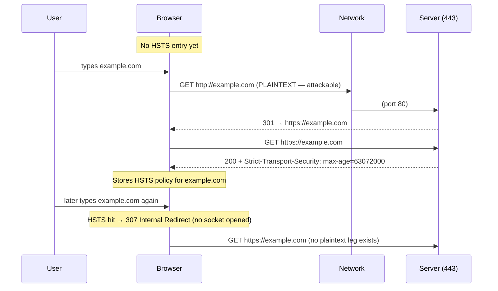
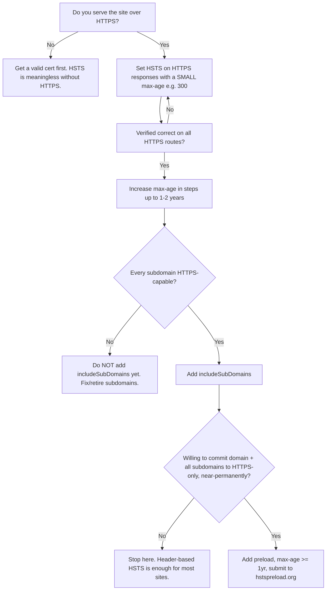

# Strict-Transport-Security

## Quick Summary

`Strict-Transport-Security` (HSTS) is a **response** header, set by the origin server (or a reverse proxy/CDN in front of it), that tells a browser: *"For the next N seconds, only ever talk to this host over HTTPS — never plain HTTP, and if a certificate is invalid, do not let the user click through."* Once a browser has seen a valid HSTS header on an HTTPS response, it upgrades every subsequent request to that host to HTTPS **internally, before any bytes hit the network** (a `307 Internal Redirect`), and it turns TLS warnings into hard, un-bypassable errors. HSTS closes the gap between "user typed `http://` or clicked an `http://` link" and "server redirects to HTTPS" — a gap that is fully exploitable by an active network attacker (SSL stripping). It only takes effect over HTTPS; a browser ignores the header on a plain-HTTP response by design.

## What problem does this header solve?

A site that "supports HTTPS" almost always still listens on port 80 and issues a `301`/`302` redirect from `http://` to `https://`. That redirect is the vulnerability. Consider the very first request of the day:

1. User types `example.com` (no scheme). The browser defaults to `http://example.com`.
2. That plaintext request travels over the network. An attacker on the same coffee-shop Wi-Fi, a malicious router, or a compromised ISP hop intercepts it.
3. The attacker never forwards the `301 → https://`. Instead it proxies the site over HTTP to the victim while talking HTTPS to the origin itself — a **man-in-the-middle SSL-stripping attack** (Moxie Marlinspike, `sslstrip`, 2009). The victim's address bar shows `http://example.com`, everything looks normal, and every keystroke — passwords, session cookies, MFA codes — is readable.

The redirect can't save you because **the attacker controls the plaintext leg and simply deletes the redirect.** No amount of server-side redirecting fixes a protocol downgrade that happens before your server is consulted honestly.

HSTS solves exactly this: after the browser has *once* recorded an HSTS policy for the host, step 1 never produces a network request over HTTP again. The browser rewrites `http://example.com` to `https://example.com` in memory. There is no plaintext leg to strip. It also solves the "click-through" problem — a user faced with a cert warning on an HSTS host cannot proceed, defeating attacks that rely on presenting a self-signed or wrong-host certificate.

## Why was it introduced?

HSTS is defined in **RFC 6797 (November 2012)**, growing out of the ForceHTTPS research (Jackson & Barth, 2008) and the very public SSL-stripping demonstrations of 2009. Before HSTS the only tools were:

- **Server-side redirects** (`301 http → https`) — useless against an active attacker as shown above, because the attacker owns the plaintext hop.
- **`Secure`-flagged cookies** — prevent a session cookie from being *sent* over HTTP, but do nothing to stop the initial page load from being served over stripped HTTP.

The design goal of RFC 6797 was a **declarative, cacheable, host-scoped policy** the browser could remember and enforce autonomously, plus a bootstrapping mechanism (the preload list) to cover the very first visit — the one moment HSTS-by-header cannot protect. It deliberately made the policy expire (`max-age`) so a misconfiguration is self-healing rather than permanently bricking a domain (mostly — see the subdomain pitfall below).

## How does it work?

The header's grammar is small:

```
Strict-Transport-Security: max-age=<seconds> [; includeSubDomains] [; preload]
```

- **`max-age=<seconds>`** (required) — how long the browser must remember and enforce the HTTPS-only policy for this host. Every valid response *refreshes* (slides) the timer. `max-age=0` is the explicit **kill switch**: it tells the browser to delete any stored policy for this host.
- **`includeSubDomains`** (optional) — apply the policy to the host *and every subdomain*. `example.com` with this directive also pins `api.example.com`, `www.example.com`, `anything.example.com`.
- **`preload`** (optional) — a non-RFC signal (invented by browser vendors) that means "I consent to this domain being hard-coded into the browser's built-in preload list." It has no effect on its own beyond the consent flag; see the preload section.

- **Browser behavior:** On receiving the header over a **valid HTTPS connection**, the browser records `(host, max-age, includeSubDomains, timestamp)` in a persistent HSTS store. On every future navigation or subresource request to that host (or subdomains, if set), *before opening a socket*, it rewrites the scheme to `https` and the port from 80→443, emitting an internal `307`. It also sets the connection's error mode so that any TLS failure (expired cert, name mismatch, untrusted CA) becomes a **non-overridable** error page — no "Proceed anyway" link. The header is **ignored entirely if received over plain HTTP** (RFC 6797 §8.1) — otherwise an attacker on the plaintext hop could inject `max-age=0` and neuter it, or inject a huge `max-age` for a host they don't own to cause denial of service.
- **Server behavior:** The origin simply emits the header on HTTPS responses. It does not "enforce" HSTS — enforcement is 100% client-side. The server's job beyond the header is to (a) actually redirect `http → https` for first-time/expired clients and (b) never emit HSTS on the plaintext response (harmless, since browsers ignore it, but pointless).
- **Proxy behavior:** A forward proxy relays the header unchanged (it's end-to-end). A TLS-terminating proxy that *is* the origin from the browser's perspective is where you'd typically set it.
- **CDN behavior:** CDNs (Cloudflare, Fastly, CloudFront) terminate TLS at the edge and are the natural place to add HSTS. Most offer a one-click HSTS toggle. Because the edge is what the browser talks to, the header set there is authoritative for the browser. Be careful: enabling `includeSubDomains`/`preload` at the CDN affects *all* subdomains served through it.
- **Reverse proxy behavior:** Nginx/Apache/HAProxy commonly terminate TLS and inject HSTS via `add_header`. This centralizes the policy so individual app servers don't each need to set it — but watch Nginx's `add_header` inheritance rules (see [Reverse Proxy Considerations](#reverse-proxy-considerations)).

### The internal redirect, visualized



The second visit has **no plaintext request at all** — that is the entire security value.

## HTTP Request Example

HSTS is a response-only header; there is no request counterpart. What HSTS changes is the *scheme the browser chooses* for the request. The observable request after a policy is stored:

```http
GET / HTTP/2
Host: example.com
:scheme: https
```

There is no way for a page to opt a request out; the browser has already committed to HTTPS before the request exists.

## HTTP Response Example

A hardened production response (two-year max-age, all subdomains, preload-eligible):

```http
HTTP/2 200 OK
content-type: text/html; charset=utf-8
strict-transport-security: max-age=63072000; includeSubDomains; preload
```

The kill switch (deployed when you must back out of HSTS — see the pitfalls):

```http
HTTP/2 200 OK
strict-transport-security: max-age=0
```

## Express.js Example

Do **not** hand-roll HSTS; use `helmet`, which validates the value and defaults to safe settings. But understand what it emits and the full manual version so you know what breaks.

```js
const express = require('express');
const helmet = require('helmet');

const app = express();

// If you terminate TLS at a proxy/CDN, Express must know the real protocol,
// otherwise req.secure is false and any http->https redirect logic below misfires.
app.set('trust proxy', 1); // trust the first hop (your LB/reverse proxy). REQUIRED behind a proxy.

app.use(
  helmet.hsts({
    maxAge: 63072000,        // 2 years in seconds. Preload requires >= 1 year (31536000).
    includeSubDomains: true, // extend policy to every subdomain. Only enable once EVERY subdomain is HTTPS.
    preload: true,           // consent flag for hstspreload.org submission. No effect until you actually submit.
  })
);
```

Every line, and what breaks without it:

- `app.set('trust proxy', 1)` — behind a load balancer/CDN, the socket is HTTP between proxy and app, so `req.secure` and `req.protocol` are wrong unless Express trusts `X-Forwarded-Proto`. Remove it and your redirect-to-HTTPS check below will loop or never fire, and you might emit HSTS on what Express thinks is a plaintext response. See [X-Forwarded-Proto](../14-Proxies/X-Forwarded-Proto.md).
- `maxAge: 63072000` — the browser remembers HTTPS-only for 2 years, sliding on each visit. Drop this too low (say 300s) and the protection window barely outlives the session, reopening the SSL-strip gap for infrequent visitors. Set to `0` and you *delete* the policy.
- `includeSubDomains: true` — without it, `api.example.com` is unprotected even though `example.com` is. With it, **every** subdomain must serve valid HTTPS or it becomes unreachable (hard TLS error). This is the classic footgun.
- `preload: true` — merely adds the token; the real commitment happens when you submit at hstspreload.org. Removing the token means you can never be accepted onto the list.

You still need the redirect for first-time/expired clients — HSTS doesn't replace it, it *backstops* it:

```js
// Redirect any plaintext request to HTTPS (for clients with no stored HSTS policy yet).
app.use((req, res, next) => {
  if (req.secure) return next();           // already HTTPS (or trusted X-Forwarded-Proto=https) -> continue
  const host = req.headers.host;           // preserve the host so we don't redirect to the wrong origin
  res.redirect(308, `https://${host}${req.originalUrl}`); // 308 preserves method + body, unlike 301/302
});
```

`308` (not `301`) is used so a `POST http://…` is re-issued as `POST https://…` rather than silently downgraded to `GET`. Omit this redirect and a browser with no stored policy (first visit ever, or after expiry) will simply be served over HTTP — HSTS never gets a chance to bootstrap.

If you want HSTS as part of a full policy bundle, `app.use(helmet())` enables `helmet.hsts()` with a default `maxAge` of ~180 days and `includeSubDomains` on. Override explicitly rather than relying on defaults, because Helmet's defaults change across major versions.

## Node.js Example

Raw `http`/`https`, no framework — useful to see there's no magic:

```js
const https = require('https');
const fs = require('fs');

const server = https.createServer(
  { key: fs.readFileSync('privkey.pem'), cert: fs.readFileSync('fullchain.pem') },
  (req, res) => {
    // Only meaningful over TLS. This server IS the TLS endpoint, so every response here is HTTPS.
    res.setHeader(
      'Strict-Transport-Security',
      'max-age=63072000; includeSubDomains; preload'
    );
    res.writeHead(200, { 'Content-Type': 'text/plain' });
    res.end('secure\n');
  }
);
server.listen(443);

// Companion plaintext listener whose ONLY job is to redirect to HTTPS.
// Note: we do NOT set HSTS here — browsers ignore it over HTTP anyway.
require('http')
  .createServer((req, res) => {
    res.writeHead(308, { Location: `https://${req.headers.host}${req.url}` });
    res.end();
  })
  .listen(80);
```

The key insight the raw version makes obvious: HSTS is *just a `setHeader` call on the TLS server*. All enforcement lives in the browser. The plaintext server exists solely to bootstrap clients that haven't stored a policy yet.

## React Example

React never sets HSTS — it's a server/edge concern, and a client-side SPA has no ability to add response headers to the document that loads it. The header must come from whatever serves `index.html`: your CDN, S3+CloudFront, Nginx, Vercel/Netlify config, or your API gateway.

- **Create React App / Vite SPA on a CDN:** configure HSTS at the CDN or in the static host's headers config (e.g., `netlify.toml`, `vercel.json` `headers`, CloudFront response-headers policy). React code is irrelevant.
- **Next.js:** set it in `next.config.js`, which is the closest thing to "React setting HSTS," and it's really the Next server/edge:

```js
// next.config.js
module.exports = {
  async headers() {
    return [
      {
        source: '/:path*', // apply to every route
        headers: [
          {
            key: 'Strict-Transport-Security',
            value: 'max-age=63072000; includeSubDomains; preload',
          },
        ],
      },
    ];
  },
};
```

What React *does* care about: if HSTS with `includeSubDomains` is active and your SPA fetches from `http://api.…` or an internal subdomain without valid TLS, those requests hard-fail with un-bypassable TLS errors. So HSTS is a constraint on your `fetch`/`axios` base URLs — everything the app talks to on that domain tree must be HTTPS. See [connect-src](./Content-Security-Policy.md) in CSP, which enforces the same discipline at a different layer.

## Browser Lifecycle

1. **Navigation requested** to a host. Before touching the network, the browser consults its HSTS store (which also includes the built-in preload list).
2. **Preload/stored hit?** If the host is on the preload list or has an unexpired stored policy (directly, or via a parent domain's `includeSubDomains`), the browser rewrites scheme→`https`, port 80→443, and issues a `307 Internal Redirect`. No plaintext socket is opened.
3. **TLS handshake.** If the certificate is invalid in *any* way, the browser shows a hard error with **no bypass** for HSTS hosts (a normal host would show a click-through warning).
4. **Response received over HTTPS.** If it carries a valid `Strict-Transport-Security` header, the browser **updates/creates** the stored policy: refreshes `max-age` (sliding expiry), sets/clears `includeSubDomains`. `max-age=0` deletes the entry.
5. **Header over HTTP is discarded** without effect.
6. **Expiry.** When `now > timestamp + max-age` and the site hasn't been revisited to refresh it, the entry lapses and the host reverts to normal (attackable) behavior — hence long `max-age` values.

You can inspect and clear the store at `chrome://net-internals/#hsts` (query, add, delete individual domains) — indispensable for debugging.

## Production Use Cases

- **Any authenticated web app / anything with a login.** HSTS is table stakes; without it, session hijacking via SSL stripping is trivial on hostile networks.
- **Banks, healthcare, gov, e-commerce** — typically `includeSubDomains; preload` with 1–2 year max-age, and on the preload list so even the first-ever visit is protected.
- **API domains** (`api.example.com`) served over HTTPS-only — HSTS prevents accidental plaintext calls from being downgraded and read.
- **Marketing/CMS sites** — even brochureware benefits: it stops attackers from injecting content into a stripped page and protects any embedded forms/analytics.
- **Consolidated policy at the edge** — set once at Cloudflare/Nginx for a whole fleet of services behind one domain, rather than per-service.

## Common Mistakes

- **Enabling `includeSubDomains` before every subdomain is HTTPS-capable.** The instant a browser stores the policy, `legacy-intranet.example.com` (HTTP-only) becomes *unreachable* — internal `307` to HTTPS, TLS handshake fails, hard error, no bypass. This has taken down internal tools and legacy subdomains company-wide. Audit *all* subdomains first.
- **Jumping straight to a huge `max-age` + preload without a ramp.** If your TLS setup is subtly broken (a subdomain, a redirect loop), you've now baked a two-year (or permanent, via preload) outage into every visitor's browser. **Ramp up:** `max-age=300` → confirm → `max-age=86400` → `604800` → `63072000`, only adding `includeSubDomains`/`preload` at the end.
- **Setting HSTS on the HTTP (port 80) response and assuming it does anything.** Browsers ignore it over HTTP. It's not harmful, but people wrongly conclude "HSTS is on" without testing over HTTPS.
- **Forgetting the `http → https` redirect** because "HSTS handles it." It only handles it for clients that already stored the policy. First-timers and expired clients need the redirect to bootstrap.
- **Nginx `add_header` inheritance surprise** — adding `add_header` inside a `location` block silently *drops* HSTS headers set at the `server` level. Result: HSTS present on some routes, missing on others. (See below.)
- **Not knowing how to back out.** Once shipped, you can't just remove the header — clients keep enforcing until expiry. To disable you must serve `max-age=0` and wait for every client to re-visit. Preload removal is worse (weeks/months). Treat preload as near-irreversible.
- **Trusting `X-Forwarded-Proto` without `trust proxy`**, or the reverse — trusting it when the proxy doesn't set it — leading to redirect loops or HSTS on the wrong responses.

## Security Considerations

- **TOFU (Trust On First Use) is the fundamental weakness.** HSTS-by-header only protects a host *after* the browser has seen the header once over a clean HTTPS connection. The **very first visit** (or the first after a store wipe / new device / new browser profile / cleared data) is unprotected — an attacker present on that first request can strip it and never let the header through. **The preload list is the only fix**: browsers ship with a hard-coded list of HSTS domains, so those are protected even on request #0.
- **The preload list & hstspreload.org.** To get on it: serve `max-age >= 31536000` (1 year) **with** `includeSubDomains` **and** `preload`, redirect HTTP→HTTPS on the apex, and submit the domain at [hstspreload.org](https://hstspreload.org). Chrome's list is consumed by Firefox, Safari, and Edge too. **This is a serious, slow-to-reverse commitment:** the whole domain and *all* subdomains are HTTPS-only in browsers globally, baked into browser binaries; removal requires a separate request and rides the browser release train (weeks to months) — meanwhile old browser versions carry the entry effectively forever.
- **`max-age=0` is a legitimate control, and also an attack target** — but only exploitable over HTTPS (an attacker who can serve you a valid-cert HTTPS response for the host can already do worse). Over HTTP it's ignored, so it can't be used to strip your policy on the plaintext hop.
- **HSTS does not protect the very content**, only the transport. It's orthogonal to XSS/CSRF; pair it with [Content-Security-Policy](./Content-Security-Policy.md) and secure cookies. It also does **not** replace certificate pinning — a mis-issued but validly-chained cert still passes HSTS's checks. (HPKP tried to solve that and was deprecated for being too dangerous.)
- **Cookie synergy:** always mark session cookies `Secure` so they're never sent over HTTP even during the pre-HSTS bootstrap window. HSTS + `Secure` cookies together close the loop. See [Set-Cookie](../08-Cookies/Set-Cookie.md).
- **Denial of service by hostile HSTS?** Because the header is ignored over HTTP and scoped to the responding host over HTTPS, an attacker can't set a poisoning HSTS policy for a domain they don't control.

## Performance Considerations

- **Net positive for latency.** The internal `307` upgrade is a memory operation — it *eliminates* the real network `301 http→https` round-trip for returning visitors. Fewer round trips, not more.
- **Zero payload cost worth worrying about** — the header is tiny and applies once per response; with HTTP/2/3 HPACK/QPACK header compression it's effectively free after the first response on a connection.
- **Avoids a redirect hop**, which on mobile/high-latency links is a measurable win (one saved RTT before TLS even begins for stored clients).
- Setting it at the edge/CDN means it's added without your origin doing work per request.

## Reverse Proxy Considerations

**Nginx** — the notorious `add_header` inheritance rule: directives set with `add_header` in an outer block are inherited by an inner block **only if the inner block has no `add_header` of its own**. Any `add_header` inside a `location` wipes out the inherited HSTS. Two robust options:

```nginx
server {
    listen 443 ssl http2;
    server_name example.com;

    # 'always' ensures the header is added even on error responses (4xx/5xx),
    # not just 2xx/3xx. Without 'always', an error page ships without HSTS.
    add_header Strict-Transport-Security "max-age=63072000; includeSubDomains; preload" always;

    # If ANY location below adds its own header, re-declare HSTS there too,
    # or (cleaner) centralize headers in an include file and add it in every block.
}

# Plaintext vhost: only redirect. Do not bother with HSTS here (ignored over HTTP).
server {
    listen 80;
    server_name example.com;
    return 308 https://$host$request_uri;
}
```

**Apache:**

```apache
<VirtualHost *:443>
  Header always set Strict-Transport-Security "max-age=63072000; includeSubDomains; preload"
</VirtualHost>
```

The `always` condition is the analog of Nginx's — emit it on error responses too. **HAProxy:** `http-response set-header Strict-Transport-Security "max-age=63072000; includeSubDomains"`. The universal gotcha: whichever component terminates TLS is the one the browser sees, so decide on a single owner of the header (edge *or* reverse proxy *or* app) to avoid duplicates/conflicts.

## CDN Considerations

- **Cloudflare/Fastly/CloudFront all have first-class HSTS support**, usually a dashboard toggle plus fields for max-age, includeSubDomains, preload. Because the CDN terminates TLS, this is often the *authoritative* place to set it.
- **Duplicate headers:** if both your origin and the CDN set HSTS, the browser may receive two — some CDNs merge/override, some pass both. Pick one owner. If the origin sets it, ensure the CDN forwards rather than strips it.
- **`includeSubDomains` at the CDN affects every subdomain routed through that CDN configuration** — same footgun, wider blast radius. A subdomain served *outside* the CDN over HTTP will break.
- **Preload from the edge:** enabling `preload` at Cloudflare is convenient, but the submission and the multi-year commitment are the same. Cloudflare even warns you.
- **Purge/rollback:** you cannot purge HSTS from clients via a CDN cache purge — it lives in each browser. The only rollback is `max-age=0` served long enough for clients to pick it up.

## Cloud Deployment Considerations

- **AWS ALB/ELB** don't add HSTS themselves; use a CloudFront **response headers policy** (managed `SecurityHeadersPolicy` includes HSTS) or set it in the app. API Gateway can add it via a gateway response or Lambda.
- **GCP** — set it at the app or via an external HTTPS load balancer + Cloud CDN response header config. **Azure** — Front Door / App Gateway rewrite rules, or App Service `web.config`.
- **PaaS (Vercel/Netlify/Heroku/Render):** headers config file (`vercel.json`, `netlify.toml`) or platform header settings; these platforms already force HTTPS but you still add HSTS for the browser-side guarantee.
- **Behind any managed LB, set `trust proxy` (Express) / read `X-Forwarded-Proto`** so your app knows the request was HTTPS at the edge; otherwise redirect logic and `req.secure` are wrong. See [X-Forwarded-Proto](../14-Proxies/X-Forwarded-Proto.md).
- **Health checks** often hit HTTP or an internal hostname — make sure HSTS + forced-HTTPS redirects don't break them (exempt the health path from the redirect, or check over HTTPS).

## Debugging

- **Chrome DevTools:** Network tab → select the document → **Headers** → Response Headers → confirm `strict-transport-security`. When a stored policy fires, you'll see the request as `(from HSTS)` / a `307 Internal Redirect` in the initiator/status. Use **`chrome://net-internals/#hsts`** to *query* a domain's stored policy, *add* one for testing, or **delete** one to reset the TOFU state (essential when a bad policy locks you out during dev).
- **curl:** `curl -sI https://example.com | grep -i strict-transport-security`. curl does *not* enforce HSTS by default, so it always talks the scheme you give it — good for confirming the header exists without a browser's memory interfering.
- **Postman / Bruno:** send a `GET` to the HTTPS URL and inspect response headers; like curl they don't enforce HSTS, so they're useful for verifying the raw header value and that it's absent over HTTP.
- **Node.js:** `require('https').get('https://example.com', r => console.log(r.headers['strict-transport-security']))` to assert the value in a smoke test/CI.
- **Express logging:** log outgoing headers in dev to verify Helmet emitted it: `res.on('finish', () => console.log(res.getHeader('Strict-Transport-Security')))`. In tests, assert with supertest: `.expect('Strict-Transport-Security', /max-age=63072000/)`.
- **Online:** hstspreload.org's checker reports preload-eligibility and flags each requirement you're missing.

## Best Practices

- [ ] Serve the site over HTTPS everywhere and keep an `http → https` **`308`** redirect for bootstrapping.
- [ ] Set HSTS **only** on HTTPS responses; don't bother on port 80.
- [ ] **Ramp `max-age`**: 300 → 86400 → 604800 → 31536000 → 63072000. Never start at years.
- [ ] Add `includeSubDomains` **only after auditing every subdomain** for valid HTTPS.
- [ ] Add `preload` and submit to hstspreload.org **last**, once you're confident — treat it as near-permanent.
- [ ] Use `max-age >= 31536000` (1 yr) if you intend to preload.
- [ ] Pick **one owner** of the header (edge, reverse proxy, or app) to avoid duplicates/conflicts.
- [ ] In Nginx use `add_header … always` and beware `location`-level `add_header` wiping inheritance.
- [ ] Behind a proxy/LB, set `trust proxy` / honor `X-Forwarded-Proto`.
- [ ] Mark cookies `Secure` (belt-and-suspenders for the pre-HSTS window).
- [ ] Document the **rollback** (`max-age=0`) procedure before you deploy, not after.
- [ ] Prefer `helmet.hsts()` over hand-rolling.

## Related Headers

- [Content-Security-Policy](./Content-Security-Policy.md) — its `upgrade-insecure-requests` directive rewrites in-page HTTP subresource URLs to HTTPS (a *content*-level upgrade), complementing HSTS's *transport*-level enforcement. Use both.
- [X-Content-Type-Options](./X-Content-Type-Options.md), [X-Frame-Options](./X-Frame-Options.md) — the rest of the baseline security-header set you ship alongside HSTS (all via `helmet`).
- [Set-Cookie](../08-Cookies/Set-Cookie.md) — mark session cookies `Secure`; HSTS ensures the page load is HTTPS, `Secure` ensures the cookie never rides HTTP.
- [Upgrade-Insecure-Requests](../03-Request-Headers/Upgrade-Insecure-Requests.md) — the request-side signal browsers send when a page opts into upgrading.
- [X-Forwarded-Proto](../14-Proxies/X-Forwarded-Proto.md) — how your app learns the request was HTTPS when TLS terminates upstream.

## Decision Tree



## Mental Model

**HSTS is a browser sticky note that says "this address is HTTPS-only — no exceptions, no click-throughs."** The first honest visit hands the browser the note; from then on the browser refuses to even *dial* the plaintext number, so there's no call for an eavesdropper to intercept. The catch is the *first* dial before any note exists — that's what the preload list fixes by shipping the note pre-written inside the phone itself. And once you've handed out the note, you can't grab it back: you can only mail everyone a "never mind" (`max-age=0`) and wait for each person to read it. So write the note in ink slowly (ramp the max-age), and only laser-etch it into every phone (preload) when you're certain.
