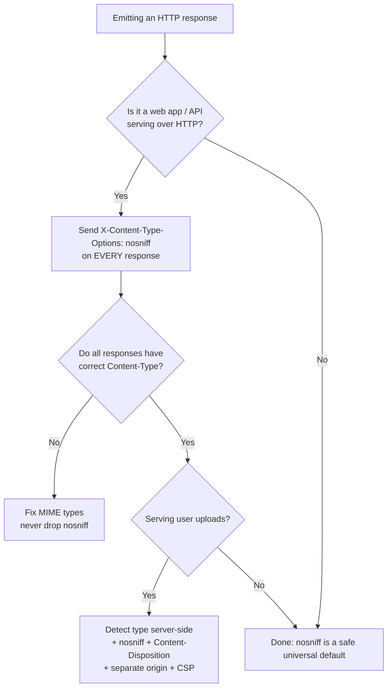

# X-Content-Type-Options

## Quick Summary

`X-Content-Type-Options` is a response-only security header with exactly one meaningful value: `nosniff`. It tells the browser to **stop guessing the type of a resource and trust the [`Content-Type`](../04-Response-Headers/Content-Type.md) you declared, verbatim.** Without it, browsers historically "sniffed" the bytes of a response and could decide a file you served as `text/plain` was *really* HTML or JavaScript, then execute it in your origin's security context. `nosniff` disables that inference entirely and additionally enforces that scripts and stylesheets are only loaded when their declared MIME type is correct (a JavaScript MIME type for `<script>`, `text/css` for `<link rel=stylesheet>`). It is set by the origin server (or a framework like Express via `helmet`), it costs nothing, it has essentially no downside when your `Content-Type` labels are honest, and it closes a real, exploited class of attack — which is why it is considered **mandatory** on every response a modern web app emits.

## What problem does this header solve?

Early browsers wanted to be forgiving. If a server mislabeled a file — served an image as `text/plain`, or an HTML page with no `Content-Type` at all — the browser would inspect the first few hundred bytes ("content sniffing" / "MIME sniffing") and *override the server's declaration* with its own guess so the page still rendered. Helpful for a broken 1998 web server; catastrophic for a 2015 web app that lets users upload files.

Concretely: your app accepts avatar uploads and serves them back from `https://app.example.com/uploads/avatar-123`. You store them and serve them with `Content-Type: image/png` — but an attacker uploads a file whose bytes begin with `<script>...</script>` or `<html>...`. A sniffing browser sees HTML-looking bytes, ignores your `image/png` label, decides "this is actually HTML," renders it as a document **on your origin**, and executes the embedded script with full access to `app.example.com` cookies and DOM. That is stored XSS delivered entirely through content sniffing, even though your server never intended the file to be a document. The same trick turns a mislabeled JSON endpoint into an executable script, or lets a `.txt` become HTML.

`X-Content-Type-Options: nosniff` removes the guessing step. The browser must honor `Content-Type: image/png` as an image, refuse to treat it as a document, and refuse to execute it. The uploaded "polyglot" file becomes inert.

## Why was it introduced?

Microsoft introduced `X-Content-Type-Options: nosniff` in **Internet Explorer 8 (2008)** specifically to let sites opt out of IE's aggressive MIME-sniffing algorithm, which had become a well-understood XSS vector. It was a pragmatic, vendor-specific `X-` header — never a formal IETF RFC.

It proved so useful that the behavior was absorbed into the web platform's living standards. The **WHATWG Fetch Standard** now formally specifies `nosniff`: it defines the exact algorithm browsers run when the header is present, including the two distinct effects — disabling the MIME "sniffing" of the response, *and* enforcing MIME type checks for `script` and `style` request destinations. Every current browser (Chrome, Firefox, Safari, Edge) implements it per the Fetch spec, not the original IE quirk. So while it still wears its legacy `X-` prefix, `nosniff` is a fully standardized, universally supported part of the modern platform — unlike its cousins [`X-XSS-Protection`](./X-XSS-Protection.md) (deprecated) and [`X-Frame-Options`](./X-Frame-Options.md) (superseded by CSP).

## How does it work?

`nosniff` changes browser behavior in two independent ways. Both hinge on the response's declared [`Content-Type`](../04-Response-Headers/Content-Type.md).

- **Browser behavior:** With `nosniff`, the browser (1) **never sniffs** — it uses the declared `Content-Type` as the authoritative MIME type and never overrides it by inspecting bytes. A `text/plain` response is displayed as text, never promoted to HTML. (2) **Enforces destination MIME checks:** a resource requested as a *script* (`<script src>`, worker, module import) is **blocked** unless its `Content-Type` is a JavaScript MIME type (`text/javascript`, `application/javascript`, etc.); a resource requested as a *style* (`<link rel=stylesheet>`) is **blocked** unless its type is `text/css`. Without `nosniff`, browsers would leniently execute a script even if it arrived as `text/plain` or `application/octet-stream`.
- **Server behavior:** The origin *sets* the header on responses. Its only obligation is to also send **correct** `Content-Type` values, because `nosniff` makes the browser trust them absolutely. A server that sends `nosniff` but mislabels its JS bundle as `text/plain` will find the browser refuses to run it.
- **Proxy behavior:** Forward proxies pass the header through unchanged; it does not affect caching or transport. A proxy that (wrongly) rewrites or strips `Content-Type` can break `nosniff`-enforced pages, but proxies do not interpret `nosniff` themselves.
- **CDN behavior:** CDNs must preserve both `Content-Type` and `X-Content-Type-Options` on cached responses. A CDN that "auto-detects" or normalizes content types can undermine the guarantee; most let you configure or pass through the origin's types. The header itself is cache-safe and does not need to appear in [`Vary`](../06-Caching-Headers/Vary.md).
- **Reverse proxy behavior:** Nginx/Apache/HAProxy commonly *inject* this header for all responses (`add_header`), and are responsible for mapping file extensions to correct MIME types (`types { }` / `mime.types`). If the reverse proxy serves a `.js` file as `application/octet-stream`, `nosniff` will cause the browser to reject it.

## HTTP Request Example

There is no request form of this header — it is set only by responses. A normal request that will *benefit* from it looks ordinary:

```http
GET /uploads/avatar-123 HTTP/1.1
Host: app.example.com
Accept: image/avif,image/webp,image/*,*/*;q=0.8
```

## HTTP Response Example

An uploaded image, correctly labeled and protected against being treated as a document:

```http
HTTP/1.1 200 OK
Content-Type: image/png
X-Content-Type-Options: nosniff
Cache-Control: public, max-age=31536000, immutable
Content-Length: 20481
```

A JavaScript bundle — `nosniff` here means the browser will refuse to execute it unless the MIME type is a valid JS type:

```http
HTTP/1.1 200 OK
Content-Type: text/javascript; charset=utf-8
X-Content-Type-Options: nosniff
Cache-Control: public, max-age=31536000, immutable
```

A JSON API response — `nosniff` prevents a browser from ever treating this as HTML/JS even if a `<script>` payload sits inside a string field:

```http
HTTP/1.1 200 OK
Content-Type: application/json; charset=utf-8
X-Content-Type-Options: nosniff
```

## Express.js Example

In production you almost never set this header by hand — you use `helmet`, which enables it **by default**. But it is worth seeing both the manual form and the helmet form so you understand what helmet does.

```js
const express = require('express');
const helmet = require('helmet');
const app = express();

// --- Option A: helmet (recommended). nosniff is ON by default. ---
app.use(helmet()); // Among many headers, this sets `X-Content-Type-Options: nosniff`
                    // on every response. There is no reason to disable it; it is one of
                    // helmet's safest, highest-value defaults.

// If you ever needed just this one header from helmet:
// app.use(helmet.noSniff());

// --- Option B: manual, for clarity or non-helmet stacks ---
app.use((req, res, next) => {
  res.setHeader('X-Content-Type-Options', 'nosniff'); // the ONLY valid value.
  next();                                             // apply to all downstream routes.
});

// The header is only as good as your Content-Type honesty. Serve static files through
// express.static, which sets correct MIME types from file extensions via the `mime` db:
app.use('/assets', express.static('dist/assets', {
  // express.static already emits e.g. `Content-Type: text/javascript` for .js,
  // `text/css` for .css. Combined with nosniff, the browser enforces those types.
}));

// User-uploaded content is the classic danger zone. Serve it with an EXPLICIT,
// trusted Content-Type and nosniff so a malicious "image" cannot become HTML:
app.get('/uploads/:id', async (req, res) => {
  const file = await loadUpload(req.params.id);
  res.setHeader('Content-Type', file.detectedMimeType); // detected server-side, NOT from the client.
  res.setHeader('X-Content-Type-Options', 'nosniff');   // stop the browser sniffing it into HTML.
  res.setHeader('Content-Disposition', 'inline');        // (or `attachment` to force download).
  res.send(file.buffer);
});

app.listen(3000);
```

What breaks if you remove pieces: drop `nosniff` and a crafted upload served as `image/png` can be sniffed into an executable HTML document → stored XSS. Trust the client's `Content-Type` instead of detecting it server-side and an attacker simply *declares* `text/html`, sniffing or not. Mislabel your real `.js` as `text/plain` *with* `nosniff` on, and the browser blocks your own scripts — the header is doing its job; fix the MIME type.

## Node.js Example

Raw `http` sets nothing for you — no `Content-Type`, no `nosniff`. You own every header, which is the whole point of the example: correctness is manual.

```js
const http = require('http');

http.createServer((req, res) => {
  if (req.url === '/data.json') {
    // Declare the type honestly and forbid sniffing. Without the Content-Type,
    // a sniffing browser might render this as HTML; with a wrong type + nosniff,
    // it would refuse to use it as JSON in fetch()'s type-aware paths.
    res.writeHead(200, {
      'Content-Type': 'application/json; charset=utf-8',
      'X-Content-Type-Options': 'nosniff',
    });
    return res.end(JSON.stringify({ ok: true }));
  }
  res.writeHead(404, { 'Content-Type': 'text/plain', 'X-Content-Type-Options': 'nosniff' });
  res.end('not found');
}).listen(3000);
```

The contrast with Express: Express + helmet gives you `nosniff` everywhere for free and correct MIME types via `express.static`; raw `http` gives you neither, so a forgotten `Content-Type` reopens the sniffing hole.

## React Example

React does not — and cannot — set `X-Content-Type-Options`; it is a response header emitted by whatever serves your files. But React apps depend on it heavily and indirectly:

- **Your JS/CSS bundles rely on correct MIME + nosniff.** With `nosniff` on, the host serving `app.[hash].js` **must** send a JavaScript `Content-Type` or the browser refuses to execute your bundle and the app is a blank page. This is a common "works locally, breaks in prod" bug: a misconfigured static host serves `.js` as `application/octet-stream`, and `nosniff` (correctly) blocks it. The fix is the server's MIME map, not removing `nosniff`.
- **Dynamic/module imports and web workers** are script destinations too, so lazy-loaded chunks (`React.lazy(() => import(...))`) are subject to the same MIME enforcement.
- **`fetch` for data.** When your React code fetches JSON, `nosniff` guarantees the browser never reinterprets an API response as HTML/JS, which protects against certain XSS-via-content-type confusion in the rare cases browsers would otherwise render a navigated response.

So React "uses" this header the way a passenger uses a seatbelt anchor: it never touches it, but everything depends on the server having installed it correctly.

## Browser Lifecycle

1. **Response arrives** with a `Content-Type` and (ideally) `X-Content-Type-Options: nosniff`.
2. **Header parsed.** The browser records that sniffing is disabled for this response.
3. **MIME determination.** With `nosniff`, the browser uses the declared `Content-Type` as-is; it does **not** run the byte-sniffing algorithm to override it.
4. **Destination check.** If the resource was requested as a *script* and the type is not a JS MIME type → **block and report a console error**. If requested as *style* and type ≠ `text/css` → **block**. For other destinations (images, documents, fetch), the declared type is simply honored.
5. **Consumption.** The resource is used strictly according to its declared type — an `image/png` can only be an image, never a document; a `text/plain` is displayed as text, never promoted to HTML.
6. **Without `nosniff`,** step 3 becomes a guess: the browser may inspect bytes and override the type, and step 4's script/style checks are relaxed — the historical vulnerability.

## Production Use Cases

- **User-generated content / file hosting:** the single most important place. Any endpoint that serves user uploads must send `nosniff` plus a server-detected `Content-Type` (and often `Content-Disposition: attachment` and a separate origin/sandbox domain).
- **JSON/XML APIs:** prevents a browser from ever rendering an API response as a document, defeating "JSON as HTML" reflection tricks.
- **Static asset delivery:** ensures your JS/CSS are executed only under correct MIME types — a defense-in-depth check that also catches your own server misconfigurations early.
- **Baseline hardening:** shipped on 100% of responses as part of a standard security-header set (with [`Content-Security-Policy`](./Content-Security-Policy.md), [`X-Frame-Options`](./X-Frame-Options.md), [`Strict-Transport-Security`](./Strict-Transport-Security.md)).

## Common Mistakes

- **Believing it is optional.** It is treated as mandatory; leaving it off keeps the sniffing attack surface open on uploads and mislabeled files. Security scanners flag its absence.
- **Sending `nosniff` while lying in `Content-Type`.** If you mark your JS as `text/plain` or `application/octet-stream`, `nosniff` will (correctly) block it. Teams sometimes "fix" this by removing `nosniff` — exactly backwards. Fix the MIME type.
- **Trusting the client-supplied `Content-Type` for uploads.** An attacker just declares `text/html`. Always detect the type server-side (magic bytes) and set it yourself.
- **Expecting it to stop all XSS.** It only closes the *sniffing/MIME-confusion* class. It does nothing about reflected/DOM XSS in your own HTML — that is [`Content-Security-Policy`](./Content-Security-Policy.md)'s job.
- **Using non-`nosniff` values.** There is no `X-Content-Type-Options: sniff` or numeric form; anything other than `nosniff` is ignored.

## Security Considerations

- **Closes MIME-confusion XSS**, especially "polyglot" uploads that are valid images *and* valid HTML/JS. With `nosniff`, the declared type wins and the polyglot is inert.
- **Mitigates certain content-type-based download attacks.** Combined with `Content-Disposition: attachment`, `nosniff` stops a browser from executing a "download" inline by re-sniffing it as HTML.
- **Defense in depth, not a silver bullet.** It complements — never replaces — [`Content-Security-Policy`](./Content-Security-Policy.md). CSP restricts *what can run*; `nosniff` restricts *how the browser classifies bytes*. Use both.
- **Isolate untrusted content further.** For truly hostile uploads, `nosniff` + a **separate origin** (e.g. `usercontent.example.net`) + `Content-Disposition: attachment` + a restrictive CSP is the layered standard, because it also contains any residual execution to a throwaway origin with no cookies.
- **No downside/attack of its own.** There is no known way `nosniff` weakens security; the only "risk" is breaking resources you have mislabeled, which is a bug to fix.

## Performance Considerations

Effectively zero cost. The header is a few bytes, is not part of the cache key, adds no round trips, and disabling sniffing can *marginally* speed up MIME resolution (the browser skips the byte-inspection step). The only performance-adjacent gotcha is operational: a wrong MIME type + `nosniff` blocks a resource entirely, which reads as a functional/perf failure (blank page, missing styles) until the `Content-Type` is corrected.

## Reverse Proxy Considerations

Nginx is a common place to both set the header globally and to guarantee correct MIME types (which `nosniff` depends on):

```nginx
http {
  include       mime.types;          # maps extensions -> correct Content-Type (.js -> text/javascript, etc.)
  default_type  application/octet-stream;

  server {
    # Inject nosniff on every response. `always` ensures it is added even on error
    # responses (4xx/5xx), which otherwise skip add_header.
    add_header X-Content-Type-Options "nosniff" always;

    location /assets/ {
      # mime.types already sets Content-Type; nosniff makes the browser enforce it.
      # If a .js here were served as octet-stream, the browser would refuse to run it.
      root /var/www;
    }
  }
}
```

Key points: keep `mime.types` current (older maps served `.js` as `application/x-javascript` or `.mjs` as octet-stream, which `nosniff` rejects for modules). Use `always` so the header is present on errors too. If you set the header both at the app (helmet) and the proxy, you may get a duplicate — pick one layer to own it.

## CDN Considerations

- **Preserve `Content-Type` and the header.** A CDN that normalizes or re-detects content types can break `nosniff`-enforced pages; configure pass-through of origin content types.
- **Cloudflare / Fastly / CloudFront** all forward `X-Content-Type-Options` from the origin, and most can inject it via a rule/transform if your origin does not. It is cache-safe and needs no `Vary`.
- **Edge-served uploads:** if you serve user content from a CDN-backed bucket (S3 + CloudFront), set the object's `Content-Type` correctly at upload and add `nosniff` via response-headers policy — buckets otherwise default to `application/octet-stream`, which breaks under `nosniff` for legitimate scripts.

## Cloud Deployment Considerations

- **Object storage (S3/GCS/Azure Blob):** set the object metadata `Content-Type` explicitly on upload and attach `X-Content-Type-Options: nosniff` via the CDN/bucket response headers. Buckets are a top source of "served as octet-stream" bugs.
- **Load balancers / API gateways (ALB, API Gateway, Apigee):** generally pass the header through; some let you add default security headers at the edge — a good place to guarantee `nosniff` on 100% of responses regardless of backend.
- **Managed platforms (Vercel, Netlify):** set correct MIME types automatically and let you add `nosniff` via `headers` config; many frameworks (Next.js) or `helmet` in a Node runtime add it for you.

## Debugging

- **Chrome DevTools → Network → (request) → Headers:** confirm `X-Content-Type-Options: nosniff` and the exact `Content-Type`. If a script/style is blocked, the **Console** shows a clear error like *"Refused to execute script … because its MIME type ('text/plain') is not executable, and strict MIME type checking is enabled."*
- **curl:** `curl -sD - -o /dev/null https://app.example.com/assets/app.js` prints response headers only — verify both `Content-Type` and `X-Content-Type-Options`.
- **Postman / Bruno:** inspect the Headers tab of the response; add a test assertion (`expect(pm.response.headers.get('X-Content-Type-Options')).to.eql('nosniff')`) to lock it into a security regression suite.
- **Node.js / Express logging:** log `res.getHeaders()` on `finish` to confirm the header is present on every route, including error handlers. A common miss is error responses (from a custom error middleware) that forget the security headers.

## Best Practices

- [ ] Send `X-Content-Type-Options: nosniff` on **every** response (use `helmet`, which does this by default).
- [ ] Ensure every response has a **correct, honest** [`Content-Type`](../04-Response-Headers/Content-Type.md) — `nosniff` makes the browser trust it absolutely.
- [ ] Serve JS as a JavaScript MIME type and CSS as `text/css`, or `nosniff` will block them.
- [ ] For user uploads, **detect the type server-side** (never trust the client) and add `nosniff` + often `Content-Disposition: attachment`.
- [ ] Serve untrusted content from a **separate origin** and pair with a restrictive [`Content-Security-Policy`](./Content-Security-Policy.md).
- [ ] Add the header on error responses too (`add_header ... always` in Nginx; verify custom error middleware in Express).
- [ ] Treat a "blocked script/style" error as a MIME-type bug to fix, **never** by removing `nosniff`.

## Related Headers

- [Content-Type](../04-Response-Headers/Content-Type.md) — the header `nosniff` forces the browser to trust; the two are inseparable. `nosniff` is only as safe as your `Content-Type` is honest.
- [Content-Security-Policy](./Content-Security-Policy.md) — the primary, modern XSS control. `nosniff` handles MIME-confusion XSS; CSP restricts what scripts can run at all. Use both.
- [X-Frame-Options](./X-Frame-Options.md) — sibling `X-` security header for clickjacking; part of the same baseline hardening set.
- [X-XSS-Protection](./X-XSS-Protection.md) — a legacy, now-deprecated XSS control; unlike it, `nosniff` is standardized and still recommended.
- [Strict-Transport-Security](./Strict-Transport-Security.md) — another baseline security header commonly shipped alongside `nosniff`.

## Decision Tree



## Mental Model

Think of `Content-Type` as the **label on a shipping box** and `X-Content-Type-Options: nosniff` as a company policy that says: *"Trust the label. Do not open boxes to guess what's inside."* Without the policy, an overly-clever clerk (the browser) opens each box, sees something that *looks* like a live grenade (HTML/JS bytes), and treats it as one regardless of the label — so an attacker just hides a grenade in a box marked "photos" and the clerk arms it. With `nosniff`, the clerk handles every box strictly by its label: a box marked "image" is filed as an image and never opened, and a box that's supposed to contain a "tool" (a script) but is mislabeled "paperwork" (`text/plain`) is refused rather than misused. The safety of the whole system then rests on one discipline: **label your boxes truthfully.**
