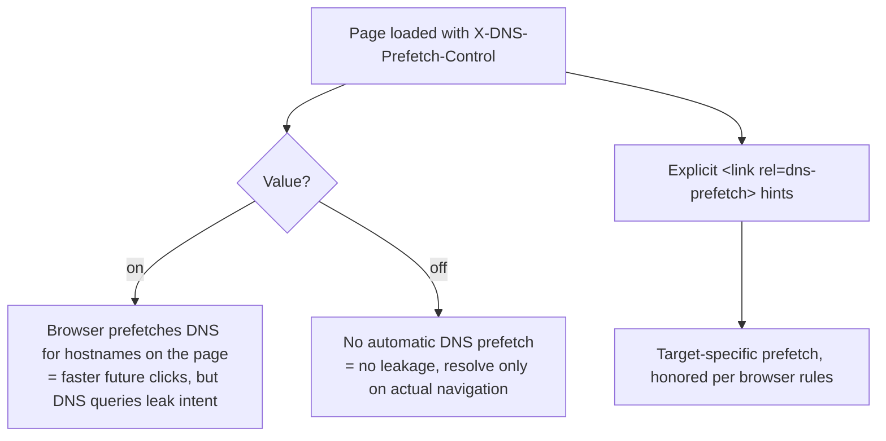

# X-DNS-Prefetch-Control

## Quick Summary

`X-DNS-Prefetch-Control` is a **response** header (a non-standard but widely-supported convention) that lets a page **turn browser DNS prefetching on or off** — `X-DNS-Prefetch-Control: on` enables it, `off` disables it. DNS prefetching is a browser optimization where, *before* a user clicks a link, the browser proactively resolves the DNS of hostnames it finds on the page (in `href`s, etc.), so that if the user does click, the DNS lookup is already done and navigation feels faster. This header is a **privacy/security control masquerading as a performance knob**: enabling prefetch trades a small speed gain for the fact that the browser makes DNS queries to third-party domains the user never visited (leaking browsing intent to DNS resolvers and those domains' authoritative servers), while disabling it prevents that leakage. It sits in the security-headers chapter because its main deliberate use is **`off`** — hardening privacy-sensitive sites (webmail, admin panels, anything where the mere hostnames on a page are sensitive) against passive DNS-based information disclosure. It's a minor header compared to [CSP](./Content-Security-Policy.md) or [HSTS](./Strict-Transport-Security.md), but it's part of a thorough hardening posture and is set by `helmet` by default.

## What problem does this header solve?

Browsers, by default, often **prefetch DNS** for links and resources on a page to shave the ~20–120ms DNS-resolution latency off a future navigation. Usually harmless and helpful. But it creates two subtle problems:

1. **Privacy leakage.** DNS prefetching resolves hostnames the user hasn't chosen to visit. On a page listing links to `secret-project.example.com`, `competitor-research.example.com`, or third-party trackers, the browser fires DNS queries for all of them — visible to the user's DNS resolver (ISP, corporate network) and to those domains' authoritative DNS servers. That leaks *browsing intent* and can reveal the contents/links of a private page (e.g. an email listing sensitive domains) merely by loading it.

2. **Unwanted third-party contact.** Prefetching can cause the browser to reach out to third parties (analytics, ad domains) earlier and more broadly than intended, which some privacy/compliance regimes want to suppress.

`X-DNS-Prefetch-Control: off` solves both by telling the browser not to prefetch DNS for the page — the browser only resolves hostnames when the user actually navigates/loads them. Conversely, `on` re-enables the optimization where you *want* the speed and the leakage is acceptable (e.g. a public content site linking to your own CDNs).

## Why was it introduced?

DNS prefetching originated as a browser performance feature (Firefox and Chrome, late 2000s), and `X-DNS-Prefetch-Control` emerged as the header to **control** it — following the informal `X-` naming convention (later deprecated for new headers by RFC 6648). It was never formally standardized in an RFC, but it's broadly supported and documented (MDN). It exists because prefetching is a *default-on* optimization with privacy side effects, and sites needed a way to *opt out* (or explicitly opt in) at the page level. Over time the emphasis shifted from "speed knob" to "privacy control": security-hardening tools (like `helmet`) set it to `off` by default, reflecting the consensus that the privacy cost often outweighs the modest latency benefit for sensitive applications. The modern, more granular alternative for *opting in* to speculative resolution is the `<link rel="dns-prefetch">` / `preconnect` resource hints, which target specific hosts rather than a blanket policy.

## How does it work?

The header sets a page-wide policy for automatic DNS prefetching. `on` allows the browser's prefetch heuristics to run; `off` disables them for the page.



- **Browser behavior:** With `on`, the browser may proactively resolve DNS for hostnames it discovers (links, some resources). With `off`, it suppresses automatic prefetching (though explicit `<link rel="dns-prefetch">` hints and actual navigations still resolve as needed, per browser). Behavior and defaults vary by browser and context (e.g. HTTPS pages historically had different default prefetch behavior).
- **Server behavior:** The origin sets the header to express the site's policy (commonly `off` for hardening).
- **Proxy/CDN behavior:** Pass it through; can inject it centrally.
- **Reverse proxy behavior:** A convenient place to set `off` site-wide.

## HTTP Request Example

`X-DNS-Prefetch-Control` is a **response** header; there is no request-side form. A normal navigation triggers the page whose response carries the policy:

```http
GET /inbox HTTP/1.1
Host: mail.example.com
```

## HTTP Response Example

Hardening a privacy-sensitive page (disable prefetch):

```http
HTTP/1.1 200 OK
Content-Type: text/html; charset=utf-8
X-DNS-Prefetch-Control: off
```

Explicitly enabling it on a public performance-focused page:

```http
HTTP/1.1 200 OK
Content-Type: text/html; charset=utf-8
X-DNS-Prefetch-Control: on
```

## Express.js Example

```js
const express = require('express');
const app = express();

// 1) helmet sets X-DNS-Prefetch-Control: off by default (privacy hardening).
const helmet = require('helmet');
app.use(helmet()); // includes X-DNS-Prefetch-Control: off

// 2) Explicit control per section: off for sensitive areas, on for public/perf pages.
app.use('/app', (req, res, next) => {
  res.set('X-DNS-Prefetch-Control', 'off');   // sensitive app: don't leak link hostnames.
  next();
});

app.use('/marketing', (req, res, next) => {
  res.set('X-DNS-Prefetch-Control', 'on');    // public site: accept the speed/leak trade-off.
  next();
});

// 3) When you DO want prefetch, prefer targeted resource hints over blanket 'on'.
app.get('/marketing/home', (req, res) => {
  res.set('X-DNS-Prefetch-Control', 'on');
  res.type('html').send(`<!doctype html>
    <link rel="dns-prefetch" href="//cdn.example.com">
    <link rel="preconnect" href="//cdn.example.com" crossorigin>
    ...`);
});

app.listen(3000);
```

Why each piece matters: `helmet()` (route 1) turns prefetch **off** by default — a deliberate privacy stance you inherit automatically, worth knowing because it *disables* a browser optimization you might otherwise expect. Route 2 shows the real decision: `off` for authenticated/sensitive areas (where the hostnames on a page could reveal what a user is working on), `on` for public marketing pages where speed matters and there's nothing to leak. Route 3 makes the nuance explicit: rather than a blanket `on`, targeted `<link rel="dns-prefetch">`/`preconnect` hints let you prefetch *only* the hosts you control/trust (your CDN), getting the speed benefit without broadly leaking every link's hostname.

## Node.js Example

Raw `http`:

```js
const http = require('http');

http.createServer((req, res) => {
  const sensitive = req.url.startsWith('/account') || req.url.startsWith('/admin');
  // Disable DNS prefetch on sensitive pages to avoid leaking link hostnames.
  res.setHeader('X-DNS-Prefetch-Control', sensitive ? 'off' : 'on');
  res.setHeader('Content-Type', 'text/html; charset=utf-8');
  res.end('<!doctype html><p>page</p>');
}).listen(3000);
```

The policy in one line: `off` where hostnames-on-page are sensitive, `on` where speed wins and leakage is acceptable.

## React Example

React doesn't set `X-DNS-Prefetch-Control` (server header), but React devs interact with the underlying feature via resource hints:

1. **Server sets the blanket policy; you add targeted hints in the document head.** For a public app where you want faster navigation to known third parties (your CDN, an API host), add `<link rel="dns-prefetch">`/`preconnect` in your HTML template / `<head>` (or via React's document head management):

```jsx
// In your document <head> (e.g. index.html or a Head component):
// Targeted prefetch/preconnect — works alongside X-DNS-Prefetch-Control from the server.
function ResourceHints() {
  return (
    <>
      <link rel="dns-prefetch" href="//cdn.example.com" />
      <link rel="preconnect" href="//api.example.com" crossOrigin="" />
    </>
  );
}
```

2. **Sensitive apps should be served `off`.** If your React app is an authenticated dashboard/webmail-style app, the server should send `X-DNS-Prefetch-Control: off` so the browser doesn't resolve the (possibly sensitive) hostnames your UI links to.

3. **It's not a React concern to set the header** — it's server config; React's role is choosing *targeted* hints when speed matters.

## Browser Lifecycle

1. The page response includes `X-DNS-Prefetch-Control: on|off`.
2. With `on`, the browser's prefetch heuristics may resolve DNS for hostnames discovered on the page (ahead of user action).
3. With `off`, automatic prefetching is suppressed; DNS is resolved only when a resource/navigation actually requires it.
4. Explicit `<link rel="dns-prefetch">`/`preconnect` hints are handled per browser rules (generally honored as targeted opt-ins).
5. Exact defaults and honoring differ across browsers and over time; treat the header as a hint, not a guarantee.

## Production Use Cases

- **Privacy hardening** of authenticated apps (webmail, banking, admin, healthcare) where link hostnames reveal user activity → `off`.
- **Compliance-driven suppression** of early third-party contact.
- **Performance on public content sites** where prefetch speeds navigation and there's nothing sensitive → `on`, ideally with targeted hints.
- **Default secure baseline** via `helmet` (`off`) as part of a hardening checklist.

## Common Mistakes

- **Assuming it's a major security control.** It's a minor privacy knob; don't rely on it in place of [CSP](./Content-Security-Policy.md), [HSTS](./Strict-Transport-Security.md), etc.
- **Blanket `on` on sensitive pages.** Leaks link hostnames to resolvers/third parties. Use `off` there.
- **Expecting consistent cross-browser behavior.** Defaults and honoring vary; it's advisory.
- **Confusing it with resource hints.** `<link rel="dns-prefetch">` is a *targeted opt-in*; the header is a *blanket policy*. For selective speed-ups, prefer the link hints.
- **Forgetting helmet turns it off.** If you *wanted* prefetch and use helmet defaults, it's disabled — override to `on` where appropriate.
- **Thinking `off` blocks all DNS.** It only suppresses *speculative* prefetch; actual navigations still resolve DNS.

## Security Considerations

- **Privacy/information disclosure is the core concern.** Prefetch reveals *browsing intent* — the hostnames on a page — to DNS resolvers and authoritative servers before the user acts. `off` mitigates this passive leak, valuable for pages whose link contents are sensitive.
- **Not a strong boundary.** It doesn't prevent a determined observer from learning about actual navigations; it only suppresses *speculative* lookups. Treat it as defense-in-depth.
- **Interaction with DoH/DoT:** if the user uses encrypted DNS, resolver-level leakage is reduced, but authoritative-server contact (and third-party awareness) can still occur with prefetch on.
- **Complements CSP:** [CSP](./Content-Security-Policy.md) restricts what a page can *load*; this header restricts speculative *DNS resolution* — different layers.

## Performance Considerations

- **`on` can speed up navigation** by pre-resolving DNS (saving tens of ms per new hostname on click) — real but modest.
- **`off` forgoes that speed** to protect privacy; the cost is a small added latency on first contact with a new host.
- **Targeted hints are the best of both:** `<link rel="dns-prefetch">`/`preconnect` prefetch only chosen hosts, getting speed for your known dependencies without leaking every link's hostname.
- **Negligible header cost;** the trade-off is speed vs privacy, not bytes.

## Reverse Proxy Considerations

Nginx setting the policy per area:

```nginx
server {
  # Sensitive app: disable prefetch.
  location /app/ {
    proxy_pass http://app_upstream;
    add_header X-DNS-Prefetch-Control "off" always;
  }

  # Public marketing: enable prefetch.
  location /www/ {
    proxy_pass http://marketing_upstream;
    add_header X-DNS-Prefetch-Control "on" always;
  }
}
```

Key points: set `off` on authenticated/sensitive paths and `on` (or omit, and use targeted hints) on public performance paths. A central proxy makes a consistent policy easy.

## CDN Considerations

- **Pass-through / edge injection:** CDNs forward the header and can inject it via rules; set `off` for sensitive properties, `on` for public ones.
- **Resource hints at the edge:** some CDNs auto-insert `preconnect`/`dns-prefetch` for their own hosts — consistent with a targeted-hint strategy.
- **Consistency:** apply the same policy across all pages of a property to avoid mixed behavior.

## Cloud Deployment Considerations

- **Managed hosts (Vercel/Netlify):** set via `_headers`/config; typically `off` for app routes, optional `on` for marketing.
- **API responses:** irrelevant (it applies to HTML documents the browser renders, not JSON APIs).
- **LB/gateway:** pass through or inject centrally.

## Debugging

- **Chrome DevTools → Network:** DNS resolution timing appears in the request timing breakdown; with prefetch on, some hosts resolve earlier. There's no dedicated "prefetch" panel, so infer from timing/`chrome://net-export` traces.
- **`chrome://net-internals` / net-export:** capture DNS events to see prefetch activity.
- **curl:** `curl -sD - -o /dev/null https://host/ | grep -i x-dns-prefetch-control` to confirm the header value.
- **Privacy test:** load a sensitive page on a controlled network and observe (via DNS logs) whether hostnames from the page are being resolved speculatively — `off` should suppress that.
- **helmet check:** confirm whether your framework/helmet is already sending `off`.

## Best Practices

- [ ] Set `X-DNS-Prefetch-Control: off` on authenticated/sensitive pages to avoid leaking link hostnames.
- [ ] Use `on` (or omit) on public performance-focused pages where leakage is acceptable.
- [ ] Prefer **targeted** `<link rel="dns-prefetch">`/`preconnect` hints over blanket `on` for controlled speed-ups.
- [ ] Know that `helmet` sets it to `off` by default — override where you want prefetch.
- [ ] Treat it as **defense-in-depth**, not a primary security control.
- [ ] Apply a consistent policy across a property.
- [ ] Remember it only affects *speculative* DNS, not actual navigations.

## Related Headers

- [Content-Security-Policy](./Content-Security-Policy.md) — controls what resources a page may load (a stronger, related control).
- [Referrer-Policy](./Referrer-Policy.md) — another privacy control (what referrer info leaks on navigation).
- [Strict-Transport-Security](./Strict-Transport-Security.md) — core transport-security hardening.
- [Permissions-Policy](./Permissions-Policy.md) — controls powerful browser features; part of the same hardening family.
- `Link` (`rel=dns-prefetch`/`preconnect`) — the targeted resource-hint alternative for opting in per host.

## Decision Tree

```mermaid
flowchart TD
    A[Setting DNS prefetch policy] --> B{Is the page authenticated/sensitive?<br/>Do link hostnames reveal user intent?}
    B -- Yes --> C[X-DNS-Prefetch-Control: off]
    B -- No, public content --> D{Want faster navigation?}
    D -- Yes, specific hosts --> E[Use targeted dns-prefetch/preconnect hints<br/>(optionally 'on')]
    D -- Yes, broadly --> F[X-DNS-Prefetch-Control: on<br/>(accept leakage)]
    D -- No --> C
```

## Mental Model

Think of DNS prefetching as a **valet who, the moment you walk into a restaurant, quietly phones ahead to *every* address on your evening's itinerary** — the bar, the theater, your friend's apartment — so that whichever you head to next, a car is already warming up. Convenient (`on`): your next trip starts instantly. But the valet just *told the phone operator (your DNS resolver) and each of those places* that you're likely coming — before you've decided anything. If your itinerary is a private list (an inbox full of sensitive links), that's a real leak of your intentions. `X-DNS-Prefetch-Control: off` tells the valet "don't call ahead — only phone the place I actually choose to go, when I choose it." And if you want *some* speed without broadcasting everything, you hand the valet a short, specific list — "just warm up the car for the theater" (targeted `<link rel="dns-prefetch">`) — getting a head start on the destinations you trust while keeping the rest of your evening private.
