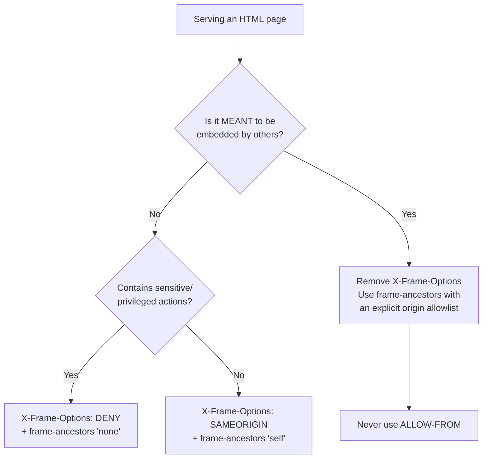

# X-Frame-Options

## Quick Summary

`X-Frame-Options` is a response-only security header that controls whether a browser is allowed to render your page inside a `<frame>`, `<iframe>`, `<embed>`, or `<object>`. It exists to stop **clickjacking** — an attack where a malicious site loads your real, logged-in page in an invisible frame and tricks the user into clicking your buttons. It has two meaningful values today: `DENY` (never frame this page, anywhere) and `SAMEORIGIN` (only pages from the same origin may frame it). A third value, `ALLOW-FROM uri`, is **deprecated and inconsistently supported** — do not use it. The header is a legacy, browser-specific mechanism that has been formally **superseded by the [`Content-Security-Policy`](./Content-Security-Policy.md) `frame-ancestors` directive**, which is more expressive and standardized. Best practice in 2026 is to set **both**: `frame-ancestors` for modern browsers, and `X-Frame-Options` as a fallback for old clients and to satisfy security scanners. `helmet` sets `X-Frame-Options: SAMEORIGIN` by default.

## What problem does this header solve?

Clickjacking (UI-redressing). An attacker builds a page — say a "You won a prize, click here!" game — and inside it loads your banking or admin site in an `<iframe>`, made invisible with `opacity: 0` and precisely positioned so that your "Transfer funds" or "Delete account" button sits exactly under the attacker's decoy "Claim prize" button. The victim is already logged into your site (their cookies ride along with the framed request), so when they click the decoy, they are really clicking *your* button, in *their* authenticated session, on *your* origin. No XSS, no stolen password — the attacker just borrows the user's existing session and hijacks a click.

The browser's Same-Origin Policy does **not** prevent framing: cross-origin framing is allowed by default, and the framing page cannot read the framed page's DOM, but it does not need to — it only needs the user to click. `X-Frame-Options` solves this by letting your server declare, per response, *who is allowed to put this page in a frame at all*. If your login page says `DENY`, no attacker page can frame it, and the invisible-overlay trick is impossible.

## Why was it introduced?

Clickjacking was publicly demonstrated in **2008** (Robert Hansen and Jeremiah Grossman), and browser vendors needed a fast defense. Microsoft shipped `X-Frame-Options` in **Internet Explorer 8 (January 2009)**, and Firefox, Safari, and Chrome followed within the year. It was never standardized by the IETF as a first-class RFC at introduction; it was later *documented* in the informational **RFC 7034 (2013)** — which explicitly notes that its behavior was already inconsistent across browsers, particularly for `ALLOW-FROM`.

Because it was a bolted-on, header-value-parsing mechanism (rather than a general framing policy), the web platform replaced it with something better: the **`frame-ancestors` directive of [`Content-Security-Policy`](./Content-Security-Policy.md)** (CSP Level 2, ~2014). `frame-ancestors` can express a *list* of allowed origins (including wildcards and `'self'`/`'none'`), is defined in a single standard, and browsers agree on its semantics. Where a browser supports both, **`frame-ancestors` takes precedence** and `X-Frame-Options` is ignored. `X-Frame-Options` persists purely as a compatibility fallback and a checkbox for older security audits.

## How does it work?

The header is evaluated by the browser at the moment it tries to *embed* your response in a framing context. It never affects top-level navigation.

- **Browser behavior:** When the browser is about to render a resource inside a `<frame>`/`<iframe>`/`<embed>`/`<object>`, it reads the framed response's `X-Frame-Options`. `DENY` → refuse to render, show a blank/error frame. `SAMEORIGIN` → render only if the **top-level** document's origin equals the framed resource's origin (browsers today check the top origin, not just the immediate parent). Otherwise, block. If [`Content-Security-Policy: frame-ancestors`](./Content-Security-Policy.md) is also present, the browser uses that and **ignores `X-Frame-Options`**.
- **Server behavior:** The origin *sets* the header on responses it does not want framed (login, admin, transactional, dashboard pages). It is the sole source of the policy; there is no request counterpart.
- **Proxy behavior:** Forward proxies pass it through; they do not interpret framing. A proxy that strips response headers can silently remove your clickjacking protection.
- **CDN behavior:** CDNs cache and forward the header. It is safe to cache and does not require `Vary`. A CDN can also inject it globally if the origin forgets. Beware CDN features that "optimize" or rewrite headers.
- **Reverse proxy behavior:** Nginx/Apache frequently set this header for all responses via `add_header`. Watch for *duplicate* headers if both the app (helmet) and the proxy set it — multiple/conflicting `X-Frame-Options` values cause some browsers to ignore the header entirely.

## HTTP Request Example

There is no request form of `X-Frame-Options`. A framing attempt is just the browser fetching your page because a *different* page embedded it; the request itself looks normal, but the browser records the framing context:

```http
GET /account/settings HTTP/1.1
Host: bank.example.com
Sec-Fetch-Dest: iframe
Sec-Fetch-Site: cross-site
Cookie: session=abc123
```

The `Sec-Fetch-Dest: iframe` / `Sec-Fetch-Site: cross-site` fetch-metadata hints tell the *server* this is a cross-site frame load — a modern, complementary signal you can also act on. The framing decision itself is enforced by the browser using the response header below.

## HTTP Response Example

A page that must never be framed (login, payment, admin):

```http
HTTP/1.1 200 OK
Content-Type: text/html; charset=utf-8
X-Frame-Options: DENY
Content-Security-Policy: frame-ancestors 'none'
Cache-Control: no-store
```

A general app page that only your own origin may frame (e.g. your own widget/dashboard shell):

```http
HTTP/1.1 200 OK
Content-Type: text/html; charset=utf-8
X-Frame-Options: SAMEORIGIN
Content-Security-Policy: frame-ancestors 'self'
```

Note both pages send `X-Frame-Options` **and** the equivalent `frame-ancestors` — modern browsers honor `frame-ancestors`, older ones fall back to `X-Frame-Options`, and scanners see both.

## Express.js Example

```js
const express = require('express');
const helmet = require('helmet');
const app = express();

// --- helmet default: X-Frame-Options: SAMEORIGIN on every response ---
// helmet() sets SAMEORIGIN. But note: modern helmet ALSO sets a CSP that you should
// configure with frame-ancestors — the two together are the recommended combo.
app.use(
  helmet({
    // Configure CSP explicitly so frame-ancestors is present (the modern control).
    contentSecurityPolicy: {
      directives: {
        // 'none' => no site (not even yours) may frame these pages. Matches DENY.
        // Use ["'self'"] instead to allow same-origin framing (matches SAMEORIGIN).
        'frame-ancestors': ["'none'"],
      },
    },
    // X-Frame-Options is on by default at SAMEORIGIN. To force DENY app-wide:
    xFrameOptions: { action: 'deny' }, // -> X-Frame-Options: DENY (helmet v7+ option name)
  })
);

// --- Per-route override, e.g. a page that IS meant to be embedded (an oEmbed widget) ---
app.get('/embed/widget/:id', (req, res) => {
  // Deliberately allow framing by trusted partner origins. X-Frame-Options CANNOT
  // express an allowlist (ALLOW-FROM is dead), so we RELY on CSP frame-ancestors here
  // and must REMOVE the restrictive X-Frame-Options helmet set, or the widget won't frame.
  res.removeHeader('X-Frame-Options'); // remove SAMEORIGIN/DENY so partners can embed.
  res.setHeader(
    'Content-Security-Policy',
    "frame-ancestors https://partner-a.com https://partner-b.com"
  ); // the ONLY way to allowlist framers today: CSP, not X-Frame-Options.
  res.render('widget', { id: req.params.id });
});

// --- Manual, non-helmet form for clarity ---
app.get('/login', (req, res) => {
  res.setHeader('X-Frame-Options', 'DENY');                 // legacy fallback.
  res.setHeader('Content-Security-Policy', "frame-ancestors 'none'"); // modern control.
  res.render('login');
});

app.listen(3000);
```

Why each line matters: helmet's default `SAMEORIGIN` protects most pages for free. Forcing `DENY` on truly sensitive pages is stricter. For an *embeddable* widget you must **remove** the restrictive `X-Frame-Options` (because it cannot express an allowlist) and lean entirely on `frame-ancestors` — leaving `SAMEORIGIN` in place would block your partners; adding `ALLOW-FROM` would be ignored by most browsers. Removing all framing protection from the login page reopens clickjacking.

## Node.js Example

Raw `http` sets nothing; you must add both headers on every response you want protected:

```js
const http = require('http');

http.createServer((req, res) => {
  // Clickjacking protection is opt-in with raw http — nothing is added for you.
  res.setHeader('X-Frame-Options', 'DENY');                  // legacy browsers.
  res.setHeader('Content-Security-Policy', "frame-ancestors 'none'"); // modern browsers (wins where supported).
  res.writeHead(200, { 'Content-Type': 'text/html; charset=utf-8' });
  res.end('<h1>Sensitive page — never frameable</h1>');
}).listen(3000);
```

The difference from Express: helmet gives you `SAMEORIGIN` (and a CSP hook) automatically across all routes; with raw `http` you must remember these headers on each handler, including error responses — a frequent omission.

## React Example

React never sets `X-Frame-Options` — it has no access to response headers, and the header protects the *document* React renders into, which is served by your web server or SSR framework (Next.js, Remix), not by React components.

React's relevant, indirect concerns:

- **The document that hosts your SPA** (`index.html` for CSR, the SSR HTML for Next.js) must carry `X-Frame-Options`/`frame-ancestors`. In Next.js you set this in `next.config.js` `headers()` or middleware; in a static host, via its headers config; behind Express, via helmet. React itself is oblivious.
- **Your app cannot detect it was framed via this header** (JS can't read response headers of its own document). Legacy "framebusting" JS (`if (top !== self) top.location = self.location`) was the pre-header workaround and is unreliable and bypassable — `X-Frame-Options`/`frame-ancestors` is the correct, browser-enforced replacement. Do not rely on framebusting scripts.
- **If you build an embeddable React widget** meant to be iframed by customers, you go the *other* direction: you must **not** send `DENY`/`SAMEORIGIN` on the widget's document, and instead use `frame-ancestors <partner-origins>` to allowlist who may embed it.

## Browser Lifecycle

1. **A page contains** `<iframe src="https://target.example/...">` (possibly invisible).
2. **The browser fetches** the framed URL, sending the user's cookies (framing does not strip credentials).
3. **Response received.** The browser reads `X-Frame-Options` (and `Content-Security-Policy: frame-ancestors`).
4. **Precedence check.** If `frame-ancestors` is present, the browser evaluates it and **ignores** `X-Frame-Options`.
5. **Decision:** `DENY` / `frame-ancestors 'none'` → block, render nothing. `SAMEORIGIN` / `frame-ancestors 'self'` → allow only if the top-level document's origin matches. An allowlist (`frame-ancestors https://a.com`) → allow only listed origins.
6. **Blocked frames** show empty and log a console error like *"Refused to display '…' in a frame because it set 'X-Frame-Options' to 'DENY'."*
7. **The header has no effect** on top-level navigation, `fetch`, XHR, images, or scripts — only on framing (`frame`/`iframe`/`embed`/`object`).

## Production Use Cases

- **Authentication & account pages:** `DENY` — login, password change, MFA, payment confirmation. These are the prime clickjacking targets and should never be framed.
- **Admin dashboards / internal tools:** `DENY` or `SAMEORIGIN` — high-privilege actions must not be embeddable by third parties.
- **General app pages:** `SAMEORIGIN` (helmet default) — allows your own origin to frame components (e.g. a modal preview) while blocking foreign framers.
- **Intentionally embeddable content:** oEmbed widgets, share buttons, chat widgets — use `frame-ancestors <allowed origins>` and **remove** `X-Frame-Options`, since it cannot allowlist.
- **Baseline hardening:** shipped app-wide alongside [`X-Content-Type-Options`](./X-Content-Type-Options.md), [`Strict-Transport-Security`](./Strict-Transport-Security.md), and CSP.

## Common Mistakes

- **Using `ALLOW-FROM`.** It is deprecated, was only ever supported by IE/old Firefox, is ignored by Chrome/Safari/modern Firefox, and can even cause the header to be treated as invalid. To allow specific framers, use CSP `frame-ancestors`.
- **Setting only `X-Frame-Options` and skipping `frame-ancestors`.** You get legacy coverage but miss the standardized, more expressive control that modern browsers actually prefer. Set both.
- **Duplicate/conflicting headers.** App (helmet) *and* reverse proxy both setting `X-Frame-Options` can yield two values; browsers may then ignore the header entirely. Own it in exactly one layer.
- **Expecting it to stop `fetch`/XHR/hotlinking.** It only governs framing. It does not stop image hotlinking, API scraping, or cross-origin `fetch` (that is CORS' domain).
- **Framebusting JavaScript instead of the header.** JS framebusters are bypassable (sandboxed iframes, `beforeunload` tricks). Use the browser-enforced header.
- **`SAMEORIGIN` and multi-domain apps.** If `app.example.com` frames content from `cdn.example.com`, `SAMEORIGIN` blocks it (different origin). Use `frame-ancestors https://app.example.com` for cross-subdomain framing.

## Security Considerations

- **This is a defense against clickjacking/UI-redress specifically** — not XSS, CSRF, or data theft. Combine with anti-CSRF tokens (clickjacking and CSRF are related: both abuse ambient authority).
- **`frame-ancestors` is strictly stronger.** It supports allowlists, is standardized, and where present, overrides `X-Frame-Options`. Treat `X-Frame-Options` as the fallback, not the primary.
- **Nested framing.** Modern browsers evaluate `SAMEORIGIN`/`frame-ancestors` against the *whole ancestor chain* / top document, closing the old "attacker frames a same-origin page that itself frames the target" bypass.
- **Sandboxed iframes** (`<iframe sandbox>`) still respect these headers; sandbox restricts the framed content's capabilities but does not override the framee's framing policy.
- **Cookies and framing:** because framed requests carry cookies, the clickjacking risk is real for any authenticated page. Setting `SameSite=Lax`/`Strict` on session cookies is complementary defense-in-depth, but framing protection should not rely on it alone.

## Performance Considerations

Negligible. A tiny static header, not part of the cache key, no `Vary` needed, no extra round trips. The only "performance" impact is functional: an over-broad `DENY`/`SAMEORIGIN` can block legitimate embedding (a partner integration, an internal preview iframe), which surfaces as a broken feature rather than slowness.

## Reverse Proxy Considerations

Set it globally in Nginx, and prefer to also emit `frame-ancestors` via CSP:

```nginx
server {
  # Legacy fallback for old browsers, plus scanner compliance.
  add_header X-Frame-Options "SAMEORIGIN" always;   # `always` => added on error responses too.

  # Modern, authoritative control (overrides X-Frame-Options where supported).
  add_header Content-Security-Policy "frame-ancestors 'self'" always;

  location /login {
    # Stricter policy for sensitive pages. NOTE: a nested add_header block REPLACES,
    # it does not merge, inherited add_header directives in Nginx — so restate BOTH here.
    add_header X-Frame-Options "DENY" always;
    add_header Content-Security-Policy "frame-ancestors 'none'" always;
    proxy_pass http://app_upstream;
  }
}
```

Gotchas: Nginx `add_header` in a `location` block *replaces* (does not append to) headers from the parent block — restate every header you still want. Avoid setting `X-Frame-Options` in both Nginx and the app (helmet) to prevent duplicates. Use `always` so protection is present on 4xx/5xx too.

## CDN Considerations

- **Cloudflare / Fastly / CloudFront** forward the origin's `X-Frame-Options` and `frame-ancestors`, and can inject them via transform rules / response-header policies if the origin omits them — a convenient place to enforce a baseline across all apps behind the CDN.
- **Cache-safe:** no `Vary` needed; the framing policy does not depend on request headers.
- **Watch for header-rewriting features** (some "security" or "optimization" toggles) that could add a conflicting second `X-Frame-Options`. Verify the *final* response headers a browser sees, not just the origin's.

## Cloud Deployment Considerations

- **Load balancers / API gateways (ALB, API Gateway, Apigee, Kong):** typically pass the header through; many can inject default security headers — a good enforcement point for `X-Frame-Options` + `frame-ancestors` across all services.
- **Managed platforms (Vercel, Netlify, Cloudflare Pages):** configure via their `headers`/config files; Next.js apps commonly set both headers in `next.config.js` `headers()`.
- **Object storage / static sites (S3 + CloudFront):** buckets don't set these headers; add them via the CDN's response-headers policy so even static HTML is framing-protected.
- **Micro-frontends:** if you legitimately embed one app inside another across subdomains, replace blanket `SAMEORIGIN`/`DENY` with a precise `frame-ancestors` allowlist rather than disabling protection.

## Debugging

- **Chrome DevTools → Network → (document) → Headers:** confirm `X-Frame-Options` and `Content-Security-Policy`. When a frame is blocked, the **Console** prints *"Refused to display '…' in a frame because it set 'X-Frame-Options' to '…'"* or a `frame-ancestors` CSP violation.
- **curl:** `curl -sD - -o /dev/null https://app.example.com/login` shows the framing headers. Check for accidental duplicates (two `X-Frame-Options` lines).
- **Manual repro:** create a local `test.html` with `<iframe src="https://target/...">` and open it — a blocked frame renders empty with a console error.
- **Postman / Bruno:** inspect the response Headers tab; add an assertion that sensitive routes return `DENY` and that CSP contains `frame-ancestors`.
- **Express logging:** log `res.getHeaders()` on `finish` to verify both headers are present per route, including error handlers and the embeddable-widget exception.

## Best Practices

- [ ] Send framing protection on **every** page (use `helmet`, which defaults to `X-Frame-Options: SAMEORIGIN`).
- [ ] Always pair `X-Frame-Options` with the equivalent [`Content-Security-Policy: frame-ancestors`](./Content-Security-Policy.md) — modern control + legacy fallback.
- [ ] Use `DENY` / `frame-ancestors 'none'` on login, payment, admin, and other high-value pages.
- [ ] **Never use `ALLOW-FROM`** — to allowlist framers, use `frame-ancestors <origins>` and remove `X-Frame-Options` on those specific routes.
- [ ] Set the header in exactly **one** layer (app *or* proxy/CDN) to avoid duplicates that browsers may ignore.
- [ ] Emit it on error responses too (`always` in Nginx; check custom Express error middleware).
- [ ] Replace any legacy JavaScript "framebusting" with these browser-enforced headers.

## Related Headers

- [Content-Security-Policy](./Content-Security-Policy.md) — its `frame-ancestors` directive **supersedes** `X-Frame-Options`: more expressive (allowlists), standardized, and preferred by browsers when both are present.
- [X-Content-Type-Options](./X-Content-Type-Options.md) — sibling `X-` security header; part of the same baseline hardening set.
- [Strict-Transport-Security](./Strict-Transport-Security.md) — commonly shipped alongside for transport hardening.
- [Referrer-Policy](./Referrer-Policy.md) — another response security header in the standard bundle.
- `Set-Cookie` `SameSite` attribute — complementary defense: `SameSite=Lax/Strict` reduces the ambient authority that clickjacking (and CSRF) abuse.

## Decision Tree



## Mental Model

Think of your web page as a document you're handing to someone, and `X-Frame-Options` as the instruction printed on it: *"This may only be displayed inside a window I control."* Clickjacking is a con artist who slides your real, signed document underneath their own decoy paperwork so that when the victim signs the top sheet, the signature bleeds through onto yours. `DENY` says "this document may never be placed underneath anything." `SAMEORIGIN` says "only my own folders may hold it." The header is the old, blunt version of the rule; [`frame-ancestors`](./Content-Security-Policy.md) is the modern version that can name exactly which folders (origins) are trusted. And `ALLOW-FROM` was an early attempt at that allowlist that most notaries (browsers) never learned to read — so you write the allowlist in the language they *do* understand: CSP.
