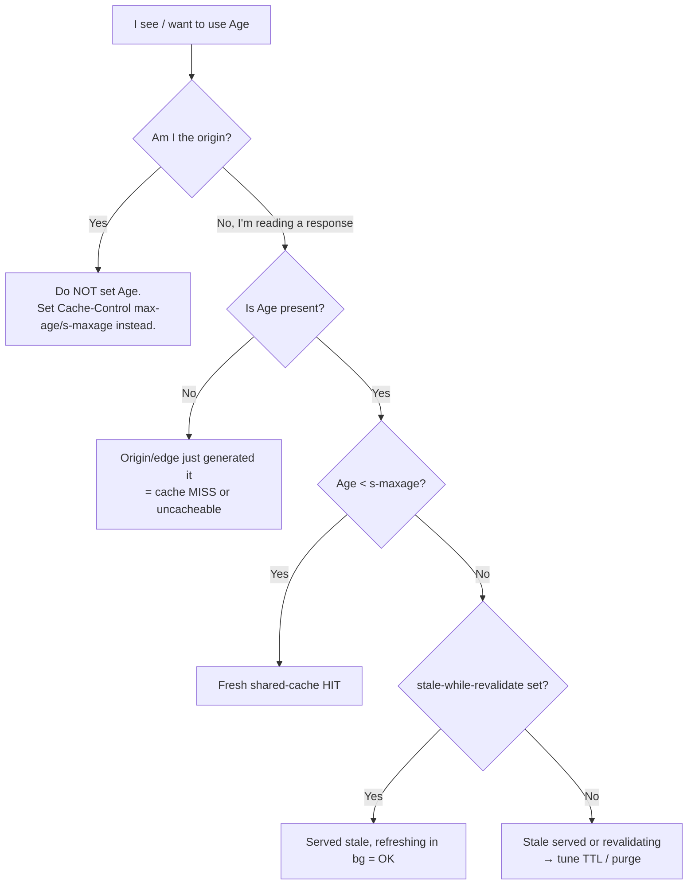

# Age

## Quick Summary

`Age` is a **response** header, added by **shared caches** (CDNs, reverse proxies, forward proxies), that states — in seconds — *how long ago this response was generated by the origin*, as estimated by the cache. `Age: 137` means "the copy you're holding was produced by the origin 137 seconds ago and has been sitting in cache since." It is the header that lets you *see caching happening*: an origin never sends `Age` (its responses are age 0 by definition), so the mere **presence** of `Age` on a response proves a shared cache served it, and its **value** tells you how fresh that cached copy is relative to the resource's [`Cache-Control: max-age`](./Cache-Control.md). Caches use `Age` internally to compute whether a stored response is still fresh (`max-age - Age > 0`) and to propagate accurate freshness through a chain of caches; you use it, in practice, mostly as a **debugging and observability signal** to answer "was this a cache hit, and how stale is it?"

## What problem does this header solve?

Caching is only correct if every cache in the chain agrees on *how much of a response's lifetime has already elapsed*. Consider a response with `Cache-Control: max-age=300`. If a CDN edge fetched it 250 seconds ago and now a second cache (or the browser) receives it, that downstream cache must not treat it as a fresh-for-300-more-seconds object — it only has 50 seconds of freshness left. Without a shared notion of elapsed time, each cache would restart the clock, and a `max-age=300` object could effectively live for 300 seconds *at every tier*, ballooning to far longer than the origin intended. Stale data would linger; a "5-minute" cache could become a 25-minute cache across five hops.

`Age` solves this by carrying the *accumulated elapsed time* down the chain. Each cache adds the time the response spent sitting in it (plus transit time), so the value grows monotonically toward the origin's `max-age`. Downstream caches subtract `Age` from `max-age` to get the *remaining* freshness. It converts caching from "each tier independently guesses" into "the whole chain accounts for real elapsed time."

The second problem it solves is purely operational: **cache observability**. Engineers constantly need to answer "is my CDN actually caching this, or am I hitting the origin every time?" The presence and magnitude of `Age` is the most reliable, vendor-neutral answer.

## Why was it introduced?

`Age` is part of HTTP/1.1's caching model from the beginning (RFC 2068, 1997; RFC 2616, 1999), now specified in **RFC 9111 §5.1 (2022, "HTTP Caching")**. It was introduced specifically to make **multi-tier caching correct**. HTTP/1.0 had a much weaker caching story; HTTP/1.1 formalized shared caches, hierarchies of proxies, and the arithmetic of freshness — and that arithmetic *requires* a way to track elapsed time across caches whose clocks may not be perfectly synchronized. RFC 9111 even defines a precise algorithm (`corrected_initial_age`, `resident_time`, etc.) for computing `Age` that deliberately **over-estimates** rather than under-estimates, because serving something as *fresher than it really is* is the dangerous error, while erring toward *slightly staler* is safe. That conservative-by-design philosophy is why `Age` is the trustworthy backbone of freshness math.

## How does it work?

The cache computes `Age` from two components: how old the response already was when this cache received it (derived from the origin's [`Date`](../04-Response-Headers/Date.md) header and any upstream `Age`), plus how long it has since resided in this cache. RFC 9111's algorithm takes the maximum of several estimates to stay conservative. The result is emitted as an integer number of seconds.

Freshness is then: **fresh while `Age < max-age`** (or `< s-maxage` for shared caches). When `Age` reaches or exceeds the limit, the stored copy is *stale* and must be revalidated ([`ETag`](./ETag.md)/[`If-None-Match`](../12-Conditional-Requests/If-None-Match.md)) or refetched before reuse.

```mermaid
sequenceDiagram
    participant B as Browser
    participant CDN as CDN edge
    participant O as Origin
    B->>CDN: GET /news (t=0)
    CDN->>O: GET /news (MISS)
    O-->>CDN: 200, Date: 12:00:00<br/>Cache-Control: s-maxage=300 (no Age)
    Note over CDN: Store at t=0. Age=0.
    CDN-->>B: 200, Age: 0
    Note over CDN: 120s pass...
    B->>CDN: GET /news (t=120)
    Note over CDN: resident 120s → Age=120<br/>120 < 300 → still fresh → HIT
    CDN-->>B: 200, Age: 120
    Note over CDN: 200 more s pass...
    B->>CDN: GET /news (t=320)
    Note over CDN: Age=320 ≥ 300 → STALE → revalidate
    CDN->>O: GET /news, If-None-Match
    O-->>CDN: 304 Not Modified
    Note over CDN: Refresh; Age resets toward 0
    CDN-->>B: 200, Age: 0
```

- **Browser behavior:** The browser (a *private* cache) reads any incoming `Age` to initialize its own freshness accounting for the stored copy, then continues aging it locally. The browser does **not** emit `Age` on requests, and its own cache doesn't add `Age` to responses it serves back to your JS. It mostly *consumes* `Age`.
- **Server behavior:** The origin **must not** send `Age` (its own fresh responses are age 0). If you see the origin emitting `Age`, something is wrong (or there's a cache you didn't know about in front of it). Origins care about `Age` only for debugging.
- **Proxy behavior:** A shared forward proxy computes and adds/updates `Age` exactly per the RFC algorithm, accumulating its resident time.
- **CDN behavior:** CDNs are the primary `Age` emitters. `Age` reflects how long the edge has held the object; a low/zero `Age` with a `HIT` status means a just-populated edge, a high `Age` means a long-lived hot object. CDNs update `Age` as the object ages and reset it on revalidation/refetch. See [CDN Considerations](#cdn-considerations).
- **Reverse proxy behavior:** Nginx's `proxy_cache` adds `Age` to responses it serves from cache, reflecting `now - time_cached` (roughly), and uses it in freshness decisions.

## HTTP Request Example

`Age` is a *response-only* header — clients never send it. The relevant request is just an ordinary GET whose response *may* come back with `Age`:

```http
GET /news/latest HTTP/1.1
Host: www.example.com
Accept: text/html
```

(There is no request-side `Age`. Its entire life is on the response.)

## HTTP Response Example

A CDN-served cache hit that's 137 seconds into a 300-second shared lifetime:

```http
HTTP/1.1 200 OK
Content-Type: text/html; charset=utf-8
Date: Mon, 07 Jul 2026 12:02:17 GMT
Cache-Control: public, max-age=60, s-maxage=300
Age: 137
ETag: W/"news-v88"
X-Cache: HIT
```

Read it as: the origin generated this at the `Date` timestamp; the edge has held it 137s; since `s-maxage=300`, it has `300 − 137 = 163s` of shared freshness left. Note `Age (137) > max-age (60)` — a *browser* receiving this would already consider it stale for its private cache and revalidate, even though the CDN still considers it fresh under `s-maxage`.

A fresh origin response (note the **absence** of `Age`):

```http
HTTP/1.1 200 OK
Content-Type: text/html; charset=utf-8
Date: Mon, 07 Jul 2026 12:04:34 GMT
Cache-Control: public, max-age=60, s-maxage=300
ETag: W/"news-v88"
X-Cache: MISS
```

No `Age` + `X-Cache: MISS` = the origin (or an edge that just fetched) produced this now.

## Express.js Example

Express/an origin should **not** emit `Age` — but you frequently want to **read** it (when your app sits behind a CDN and calls other cached services) and to **assert its absence** in tests. You also want to set `Cache-Control` so that the caches computing `Age` behave correctly:

```js
const express = require('express');
const app = express();

// 1) As an ORIGIN: set the lifetimes that downstream caches will age against.
//    We deliberately do NOT set Age — caches compute it. s-maxage governs the
//    shared-cache (CDN) lifetime; max-age governs the browser's private cache.
app.get('/news/latest', async (req, res) => {
  const html = await renderLatestNews();
  res.set('Cache-Control', 'public, max-age=60, s-maxage=300');
  res.set('ETag', currentNewsEtag());       // lets caches revalidate cheaply when Age hits the limit.
  res.type('html').send(html);
});

// 2) As a CLIENT of a cached upstream: read Age to know how stale the data you
//    just fetched actually is, and to decide whether to force a revalidation.
async function fetchUpstream(url) {
  const r = await fetch(url);
  const age = parseInt(r.headers.get('age') || '0', 10);
  const maxAge = 300; // known contract with the upstream
  if (age > maxAge * 0.9) {
    // The cached copy is nearly stale; log it so we can tune TTLs or add SWR.
    console.warn('Upstream copy near-stale', { url, age });
  }
  return { data: await r.json(), age };
}

// 3) Observability middleware: surface whether OUR responses came back through a
//    CDN in downstream logs (useful when app-to-app calls traverse an internal CDN).
app.use((req, res, next) => {
  res.on('finish', () => {
    // On the way IN, req has no Age; this is for responses WE received elsewhere.
  });
  next();
});

app.listen(3000);
```

Why each piece matters: in route 1, the split `max-age=60, s-maxage=300` means the CDN (aging against `s-maxage`) holds the object 5× longer than any browser (aging against `max-age`) — a common pattern for "cache hard at the edge, revalidate quickly in the browser." You never touch `Age` here; letting the cache own it is correct. In helper 2, parsing `Age` is how a *client* of a cached API measures real staleness — indispensable when SLAs depend on data freshness. If you removed the `ETag` in route 1, then when `Age` crosses the limit the cache would have to do a full refetch instead of a cheap `304`.

## Node.js Example

Raw `http` as an origin — again, do **not** set `Age`, and observe it as a client:

```js
const http = require('http');

// Origin: never emits Age.
http.createServer((req, res) => {
  res.setHeader('Cache-Control', 'public, s-maxage=300, max-age=60');
  res.setHeader('Content-Type', 'application/json');
  // (No res.setHeader('Age', ...) — that's the cache's job.)
  res.end(JSON.stringify({ now: 'value' }));
}).listen(3000);

// Client: read Age from a cached response to gauge staleness.
http.get('http://cdn.example.com/data.json', (res) => {
  const age = parseInt(res.headers['age'] || '0', 10);
  const servedByCache = 'age' in res.headers; // presence ⇒ a shared cache handled it
  console.log({ servedByCache, age, status: res.statusCode });
  res.resume();
});
```

The key contrast: as an origin you emit `Date` + `Cache-Control` and let the fabric compute `Age`; as a client you read `Age` (and its mere presence) to understand the caching topology in front of you.

## React Example

React never reads or sets `Age` directly — `fetch` in the browser can expose it via `Response.headers.get('age')`, but only for **same-origin** responses or when the server allows it via [`Access-Control-Expose-Headers`](../07-CORS/Access-Control-Expose-Headers.md) (`Age` is *not* a CORS-safelisted response header, so cross-origin JS can't see it by default).

The relationship is indirect but real:

1. **Perceived freshness.** When a React app fetches CDN-cached data, `Age` tells you how stale the rendered data might be. If your UI shows "as of X," you can read `Age` (same-origin, or CORS-exposed) to compute the true "as of" time rather than assuming "now."

```jsx
function useFreshData(url) {
  const [state, setState] = React.useState({ data: null, ageSec: 0 });
  React.useEffect(() => {
    fetch(url).then(async (r) => {
      // Only readable if same-origin OR the server exposes Age via CORS.
      const ageSec = parseInt(r.headers.get('age') || '0', 10);
      setState({ data: await r.json(), ageSec });
    });
  }, [url]);
  return state; // e.g. show "updated 137s ago" using ageSec
}
```

2. **Debugging SSR/CDN.** When a Next.js page seems to show stale content, inspecting `Age` on the document/data response in DevTools tells you the edge is serving an old cached copy — the fix is TTL/`Cache-Control` tuning or a purge, not React code.

3. **Why React can't usually see it cross-origin:** it's a deliberate CORS restriction; if you need it in the browser for a third-party API, that API must add `Access-Control-Expose-Headers: Age`.

## Browser Lifecycle

1. **Response arrives with `Age: N`** → the browser initializes the stored copy's age at `N` (not 0), because a shared cache already consumed some of its lifetime.
2. The browser continues **aging it locally** as wall-clock time passes.
3. **Freshness check** before reuse: fresh while `initial Age + local elapsed < max-age`. Because `Age` seeded the clock, a copy that arrived already-old expires sooner in the browser than a freshly-minted one.
4. When it crosses the limit → **revalidate** (`If-None-Match`/`If-Modified-Since`) or refetch.
5. The browser **does not** re-emit `Age` to page JS on its own cache hits; JS only sees the `Age` that was on the network response.

## Production Use Cases

- **Cache-hit verification:** the fastest vendor-neutral way to confirm a CDN/reverse proxy is caching — `Age` present and > 0 = a shared cache served it.
- **Staleness SLAs:** measuring `Age` on cached API responses to guarantee "data no older than N seconds," and alerting when `Age` approaches `s-maxage`.
- **TTL tuning:** watching the distribution of `Age` values in logs to see whether objects live long enough to be worth caching (if `Age` is almost always tiny, your TTL or traffic is too low for effective caching).
- **Multi-tier freshness correctness:** ensuring a browser + CDN + reverse-proxy chain doesn't over-extend a resource's intended lifetime — `Age` is what keeps the arithmetic honest.
- **Stale-while-revalidate diagnostics:** with `stale-while-revalidate`, `Age` can legitimately exceed `max-age` briefly while a background revalidation runs; watching `Age` confirms SWR is working.

## Common Mistakes

- **Setting `Age` on an origin response.** Origins must not emit it; doing so confuses downstream freshness math (they'll think the object is older than it is and expire it early).
- **Assuming `Age` present ⇒ stale.** `Age` just means "a cache served it"; whether it's stale depends on `Age` vs `max-age`/`s-maxage`.
- **Ignoring the `max-age` vs `s-maxage` split.** A response can be *fresh at the CDN* (`Age < s-maxage`) but *stale in the browser* (`Age > max-age`) simultaneously; forgetting this leads to "why is the browser revalidating when the CDN says HIT?" confusion.
- **Expecting to read `Age` cross-origin in JS.** It's not CORS-safelisted; you need `Access-Control-Expose-Headers: Age`.
- **Trusting `Age` for security/audit.** It's an estimate produced by intermediaries and can be affected by clock skew; use it for observability, not as a trusted timestamp.
- **Confusing `Age` with `Date`.** [`Date`](../04-Response-Headers/Date.md) is *when the origin generated the response*; `Age` is *how long ago that was, per the cache*. They're related (`Age ≈ now − Date` for a single cache) but not identical, especially across clock-skewed hops.

## Security Considerations

- **Low-sensitivity, but a topology signal.** `Age` reveals that caching exists and roughly how hot an object is — minor information disclosure, generally acceptable. It does not itself leak private data.
- **Stale-content risk after security fixes.** If you patch a vulnerability or revoke content, a high-`Age` cached copy can keep serving the old version until it expires or is purged. `Age` is your *indicator* of this exposure window; the *fix* is an active cache purge/invalidation, not waiting for `Age` to catch up.
- **Clock-skew safety by design.** The RFC's conservative (over-estimating) `Age` algorithm exists so that skew makes objects appear *older* (safe: earlier revalidation) rather than *younger* (unsafe: serving stale as fresh). Don't "correct" it toward under-estimation.
- **Not an authentication or integrity signal.** Never gate any decision on a client-visible `Age`; intermediaries set it and it's trivially influenced.

## Performance Considerations

- **`Age` is the pulse of your cache efficiency.** A healthy hot object shows a range of `Age` values up to near its TTL; consistently tiny `Age` means low reuse (traffic too low, TTL too short, or a poor cache key/`Vary`).
- **It costs nothing on the wire** (a few bytes) and is compressed by HTTP/2/3.
- **Interplay with `s-maxage`/`max-age`:** tuning these is how you trade freshness for hit ratio; `Age` is the measurement you tune *against*. Longer `s-maxage` → higher potential `Age` → better hit ratio, worse worst-case staleness.
- **`stale-while-revalidate`** lets `Age` exceed `max-age` while serving instantly and refreshing in the background — the best of both, and `Age` is how you confirm it's engaged.

## Reverse Proxy Considerations

Nginx adds `Age` to cached responses and uses it for freshness:

```nginx
proxy_cache_path /var/cache/nginx keys_zone=app:50m inactive=10m;

server {
  location / {
    proxy_pass http://app_upstream;
    proxy_cache app;
    proxy_cache_valid 200 5m;              # objects fresh for 5m; Age counts up toward this.

    add_header Age $upstream_http_age;     # usually nginx sets Age itself for cache hits.
    add_header X-Cache-Status $upstream_cache_status;   # HIT/MISS/EXPIRED/STALE/UPDATING.

    proxy_cache_use_stale error timeout updating;  # serve stale (high Age) while refreshing.
  }
}
```

Key points: `$upstream_cache_status` paired with `Age` gives the full picture — a `HIT` with `Age: 200` under a 5m validity is a healthy warm cache; `EXPIRED`/`STALE` means `Age` crossed the limit. `proxy_cache_use_stale ... updating` is nginx's stale-while-revalidate and will legitimately serve responses whose `Age` exceeds the configured freshness while a background fetch runs.

## CDN Considerations

- **`Age` is your primary hit/miss oracle** across CDNs, but each also ships a vendor-specific status header you should cross-check:
  - **Cloudflare:** `cf-cache-status: HIT|MISS|EXPIRED|REVALIDATED|DYNAMIC` alongside `Age`. `Age` reflects edge residency; `cf-cache-status: DYNAMIC` + no `Age` = not cached.
  - **Fastly:** `Age` plus `X-Cache: HIT`/`MISS` and `X-Cache-Hits`; Fastly's shielding means `Age` can accumulate across two Fastly tiers.
  - **AWS CloudFront:** `Age` plus `X-Cache: Hit from cloudfront` / `Miss from cloudfront`.
  - **Akamai:** `Age` plus pragma/`X-Cache` debug headers.
- **Shielding / multi-tier CDNs** accumulate `Age` across tiers (edge + shield), which is correct RFC behavior — the value reflects total time since origin generation.
- **`Age` resets on revalidation/refetch:** when the edge revalidates and gets `304`, or refetches a new body, `Age` drops back toward 0.
- **CDNs generally ignore your origin's stray `Age`** and compute their own; still, don't send one.

## Cloud Deployment Considerations

- **API Gateways with caching (AWS API Gateway):** may or may not emit `Age`; confirm and use their `X-Cache` equivalent. If absent, you can't rely on `Age` to detect gateway cache hits.
- **Load balancers (ALB/GCLB):** don't cache, don't add `Age` — its presence means a cache *behind or in front of* the LB handled it.
- **Managed edge platforms (Vercel/Netlify):** expose cache status via their own headers (`x-vercel-cache: HIT|MISS|STALE`) in addition to `Age`; use both.
- **Object storage + CDN:** S3/GCS themselves don't emit `Age`; a fronting CDN does. A high `Age` on an asset served "from S3" actually means it's being served from the CDN's cache of S3.

## Debugging

- **Chrome DevTools → Network → Headers:** look for `Age` under Response Headers. Present + nonzero = shared-cache hit. Combine with the size column (a tiny transfer can also indicate a `304`).
- **curl:** `curl -sD - -o /dev/null https://example.com/asset.js | grep -i '^age\|cache\|x-cache'` — repeat a few times and watch `Age` climb (confirming a warm cache) or stay 0/absent (no caching). A sudden reset to a low `Age` indicates a refetch/revalidation.
- **Postman / Bruno:** assert `Age` exists and is within an expected band, e.g. Bruno: `expect(Number(res.headers.age)).to.be.below(300)`.
- **Node.js:** `('age' in res.headers)` on a client response tells you a cache was involved; the value tells you how stale.
- **Express logging:** when calling cached upstreams, log the returned `Age` per request to build a staleness histogram.
- **Warm-up check:** hit a URL twice in quick succession; the second response's `Age` (small but > 0) confirms the first populated the cache.

## Best Practices

- [ ] **Never set `Age` on origin responses** — let caches compute it.
- [ ] Set explicit [`Cache-Control`](./Cache-Control.md) `max-age`/`s-maxage` so caches have a limit to age against; `Age` is meaningless without it.
- [ ] Use `Age` (and vendor `X-Cache`/`cf-cache-status`) as your **cache-hit verification** in tests and dashboards.
- [ ] Alert when `Age` approaches `s-maxage` on data with freshness SLAs, or adopt `stale-while-revalidate`.
- [ ] Remember `Age` can legitimately exceed `max-age` under `stale-while-revalidate` — don't treat that as a bug.
- [ ] To read `Age` in cross-origin browser JS, add [`Access-Control-Expose-Headers: Age`](../07-CORS/Access-Control-Expose-Headers.md).
- [ ] Don't trust `Age` as a precise timestamp; it's an intentionally-conservative estimate.
- [ ] Pair `Age` monitoring with active **purge/invalidation** for security-sensitive content — don't wait for `Age` to expire it.

## Related Headers

- [Cache-Control](./Cache-Control.md) — defines `max-age`/`s-maxage`, the limits `Age` is measured against; the two together decide freshness.
- [Expires](./Expires.md) — the legacy absolute-time freshness header; freshness = `Expires > Date + Age`.
- [Date](../04-Response-Headers/Date.md) — origin generation time; `Age ≈ now − Date` for a single cache and the anchor for the age calculation.
- [ETag](./ETag.md) / [If-None-Match](../12-Conditional-Requests/If-None-Match.md) — how a cache cheaply refreshes an object once `Age` crosses the limit.
- [Last-Modified](./Last-Modified.md) / [If-Modified-Since](../12-Conditional-Requests/If-Modified-Since.md) — the date-based revalidation alternative.
- [Vary](./Vary.md) — determines *which variant's* `Age` you're looking at.
- [Access-Control-Expose-Headers](../07-CORS/Access-Control-Expose-Headers.md) — required to read `Age` from cross-origin JS.
- [CDN Caching Overview](../15-CDNs/CDN-Caching-Overview.md) — where `Age` is most visible and useful.

## Decision Tree



## Mental Model

Think of `Age` as the **"baked at" clock on a loaf of bread as it moves through a chain of bakeries and shops**. The origin oven has no age label — bread out of the oven is, by definition, fresh (age 0). The moment a shop (cache) puts it on the shelf, it starts a timer, and every shop that passes it along adds the time it sat on *their* shelf, so the number only grows. When you pick up the loaf, the `Age` label tells you exactly how long since it left the oven — and you compare that to the "best before" window (`max-age`/`s-maxage`) to decide if it's still good. If a loaf has *no* `Age` label, you know it came straight from the oven (a cache miss). And because nobody wants to sell stale bread as fresh, every shop rounds the timer *up* if unsure — better to re-bake a still-good loaf than to sell an old one as new.
