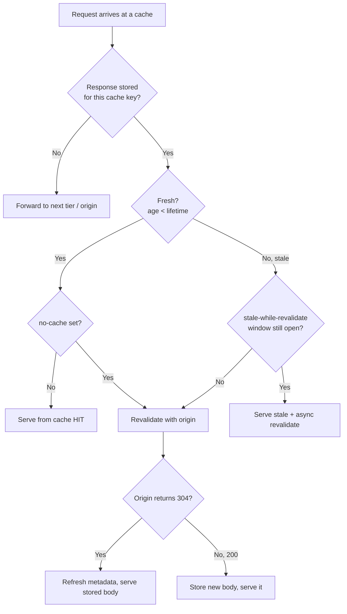
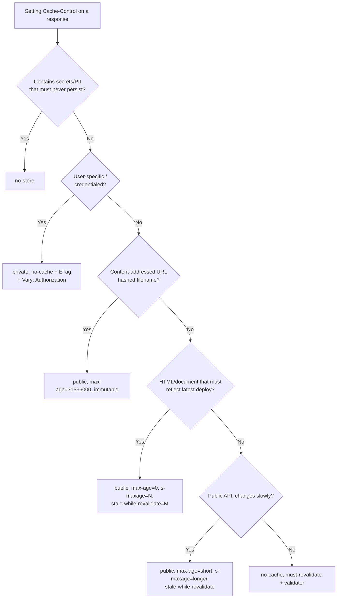

# Cache-Control

## Quick Summary

`Cache-Control` is the master switch for HTTP caching. It is a directive-carrying header that appears on **both requests and responses**, and it governs every cache in the path — the browser's private cache, forward proxies, corporate/ISP caches, reverse proxies (Nginx, Varnish), and CDNs (Cloudflare, Fastly, CloudFront). Its directives answer three questions: *may this response be stored?* (`no-store`, `private`, `public`), *how long is it fresh?* (`max-age`, `s-maxage`), and *what must a cache do when it is stale?* (`no-cache`, `must-revalidate`, `stale-while-revalidate`, `stale-if-error`). It supersedes the legacy [`Expires`](./Expires.md) header, works hand-in-glove with the validators [`ETag`](./ETag.md) and [`Last-Modified`](./Last-Modified.md), and its correctness depends on [`Vary`](./Vary.md) for cache-key partitioning. Get it right and you serve most traffic from cache at near-zero latency; get it wrong and you either hammer your origin or serve users stale, wrong, or leaked-private content.

## What problem does this header solve?

Without caching, every byte a user needs is re-fetched from origin on every navigation: your logo, your 300 KB JS bundle, your fonts, your API responses. That is catastrophic for latency (every asset pays a full RTT plus origin compute), for origin cost (you scale servers to serve unchanged bytes), and for the user (slow pages, wasted mobile data). The naive fix — "cache everything forever" — is worse: you can never ship a bug fix because browsers keep serving the old file, and shared caches leak one user's authenticated dashboard to the next user.

`Cache-Control` solves the *precise* version of the problem: **who may store a response, for how long, and how to safely re-use or re-validate it** — with different answers for a hashed asset (cache forever), an HTML document (revalidate constantly), an authenticated API response (never store in shared caches), and a personalized page (store per-user or not at all). It gives the origin fine-grained, per-response control over a distributed, multi-tier cache hierarchy it does not own.

## Why was it introduced?

HTTP/1.0 (informational RFC 1945, 1996) had only two crude tools: the `Expires` header (an absolute date after which the response is stale) and the `Pragma: no-cache` request hint. Both were inadequate. `Expires` depends on client and server clocks agreeing — clock skew silently breaks freshness. `Pragma` was never formally a response directive and only ever meaningfully carried `no-cache`. Neither could distinguish a *private* (browser-only) cache from a *shared* (proxy/CDN) cache, express relative lifetimes, or describe revalidation policy.

HTTP/1.1 (RFC 2068, 1997, then RFC 2616, 1999) introduced `Cache-Control` as a rich, extensible, directive-based caching model. The caching rules were later cleanly re-specified in **RFC 7234 (2014)** and again in **RFC 9111 (2022, "HTTP Caching")**, which is the current authoritative reference. Individual extension directives arrived over time: `immutable` (RFC 8246, 2017) and `stale-while-revalidate` / `stale-if-error` (RFC 5861, 2010). The design goal was a header that is relative (no clock dependency for `max-age`), tier-aware (`private` vs `public`, `max-age` vs `s-maxage`), and forward-compatible (unknown directives are ignored, so new ones can be added without breaking old caches).

## How does it work?

A cache stores a response keyed by (method + URL + the request headers named in [`Vary`](./Vary.md)). On a later request it checks **freshness**: is the stored response still within its lifetime? If fresh, it is served directly (a cache *hit*) without touching the origin. If stale, the cache either revalidates with the origin (a conditional request using [`If-None-Match`](../12-Conditional-Requests/If-None-Match.md) / [`If-Modified-Since`](../12-Conditional-Requests/If-Modified-Since.md)) or, where permitted, serves the stale copy while refreshing in the background. `Cache-Control` directives drive every one of those decisions.

Freshness lifetime is computed in priority order: `s-maxage` (shared caches only) → `max-age` → `Expires` → heuristic. The response's current age (see [`Age`](./Age.md)) is compared against that lifetime.



### Browser behavior

The browser maintains a **private** cache (per-profile, on disk/memory). It honors `no-store` (never write to disk), `private` (fine — it *is* a private cache), `max-age`/`Expires` for freshness, and `no-cache` (store, but revalidate before every reuse). `must-revalidate` forbids serving stale after expiry. `immutable` tells the browser not even to conditionally revalidate on reload — a critical optimization because a plain page reload otherwise adds `Cache-Control: max-age=0` to sub-resource requests, forcing revalidation of everything. The browser is also the only cache that meaningfully honors **request** `Cache-Control` directives (`no-cache`, `max-age=0`) generated by user actions like reload / hard-reload.

### Server behavior

The origin server *sets* the response `Cache-Control` and is the source of truth. It may also *read* request `Cache-Control` (e.g., honor a `no-cache` from the client, though most origins ignore it). Frameworks default to conservative values: Express `res.sendFile`/`express.static` emit `Cache-Control: public, max-age=0` plus `ETag`/`Last-Modified` so files are cached-but-always-revalidated unless you override. The server must ensure the directives it emits match reality — e.g., never `public` on a response gated by `Authorization`.

### Proxy behavior

A shared forward proxy (corporate, ISP) obeys `no-store` (don't store), `private` (don't store — it is shared), `s-maxage` (its freshness lifetime, overriding `max-age`), `public` (may store even normally-uncacheable responses), and `proxy-revalidate` (must revalidate when stale, like `must-revalidate` but only for shared caches). `no-transform` forbids it from recompressing/transcoding the body.

### CDN behavior

A CDN is a giant shared cache at the edge, and it treats `s-maxage` as its primary freshness signal (falling back to `max-age`). CDNs frequently *reinterpret* directives via their own config: Cloudflare's "Edge Cache TTL" and `cf-` directives, Fastly's `Surrogate-Control` (a CDN-only twin of `Cache-Control` that the CDN strips before responding, so browsers never see it). Most CDNs implement `stale-while-revalidate`/`stale-if-error` for resilience, and honor `private`/`no-store` by refusing to cache. Critically, a CDN caches per its own cache key, which you must align with [`Vary`](./Vary.md) — a wrong `Vary` on a CDN is how one user's response gets served to another.

### Reverse proxy behavior

Nginx (`proxy_cache`), Varnish, and HAProxy sit in front of your app as shared caches. Nginx honors `Cache-Control`/`Expires` from the upstream to decide cacheability and TTL, but can be told to ignore them (`proxy_ignore_headers Cache-Control`) and impose its own (`proxy_cache_valid`). It respects `private`/`no-store`/`no-cache` unless overridden. Because it is a shared cache, `s-maxage` and `proxy-revalidate` apply.

## HTTP Request Example

Request directives are hints from the client (usually the browser, driven by user action):

```http
GET /api/products/42 HTTP/1.1
Host: shop.example.com
Cache-Control: no-cache
Accept: application/json
```

`Cache-Control: no-cache` here means "I have a possibly-cached copy, but revalidate it with the origin before serving" — this is what Chrome sends sub-resources on a normal reload. A hard reload (Ctrl+Shift+R) sends `Cache-Control: no-store` (or `no-cache` for the document), bypassing caches entirely.

## HTTP Response Example

A hashed, immutable static asset — cache aggressively, forever, everywhere:

```http
HTTP/1.1 200 OK
Content-Type: application/javascript; charset=utf-8
Cache-Control: public, max-age=31536000, immutable
ETag: "9f2c-a1b2c3"
Content-Length: 40812
```

An authenticated API response — never store in a shared cache, revalidate in the browser:

```http
HTTP/1.1 200 OK
Content-Type: application/json
Cache-Control: private, no-cache
ETag: "user-42-v7"
Vary: Authorization
```

An HTML document with a CDN — short shared TTL, then serve-stale for resilience:

```http
HTTP/1.1 200 OK
Content-Type: text/html; charset=utf-8
Cache-Control: public, max-age=0, s-maxage=60, stale-while-revalidate=600, stale-if-error=86400
```

## Express.js Example

```js
const express = require('express');
const path = require('path');
const crypto = require('crypto');
const app = express();

// 1) Hashed, content-addressed assets (e.g. /assets/app.9f2c1a.js).
//    The filename changes whenever content changes, so the URL is a perfect
//    cache key — we can cache for a year and skip revalidation entirely.
app.use('/assets', express.static(path.join(__dirname, 'dist/assets'), {
  immutable: true,          // emits `immutable`: browser won't revalidate even on reload.
  maxAge: '365d',           // -> Cache-Control: max-age=31536000. One year is the conventional "forever".
  etag: false,              // no validator needed: URL uniqueness IS the version. Saves ETag compute + 304s.
  lastModified: false,      // same reasoning; suppress Last-Modified to keep responses lean.
}));
// If you removed `immutable`, a plain reload would send `max-age=0` and force a
// conditional GET on every asset — thousands of needless 304 round-trips.

// 2) HTML documents: must always reflect the latest deploy, but we still want
//    CDN offload. max-age=0 => browser revalidates; s-maxage=60 => CDN holds 60s.
app.get(['/', '/products', '/products/:id'], (req, res, next) => {
  res.set('Cache-Control',
    'public, max-age=0, s-maxage=60, stale-while-revalidate=600, stale-if-error=86400');
  // public: allow shared caches to store despite no cookies-based auth here.
  // max-age=0: the browser must revalidate the document before reuse (fresh HTML).
  // s-maxage=60: the CDN serves this HTML from edge for 60s -> absorbs traffic spikes.
  // stale-while-revalidate=600: for 10 min past expiry, CDN serves stale instantly
  //   and refreshes in the background -> users never wait on origin.
  // stale-if-error=86400: if origin is down, keep serving stale for a day -> resilience.
  next();
});

// 3) Authenticated / personalized API: never let a shared cache store it,
//    and force revalidation so a logged-out user never sees cached private data.
app.get('/api/me', requireAuth, (req, res) => {
  const body = JSON.stringify(req.user.profile);
  const etag = '"' + crypto.createHash('sha1').update(body).digest('base64') + '"';
  res.set('Cache-Control', 'private, no-cache'); // private: browser only. no-cache: revalidate every reuse.
  res.set('Vary', 'Authorization');              // cache key must include the credential -> no cross-user leaks.
  res.set('ETag', etag);                         // lets the browser's no-cache revalidation return a cheap 304.
  if (req.headers['if-none-match'] === etag) {
    return res.status(304).end();                // body unchanged -> 304, no payload. Pairs with no-cache.
  }
  res.type('application/json').send(body);
});
// Remove `private` and a corporate proxy could cache /api/me and serve Alice's
// profile to Bob. Remove `no-cache` (or set a max-age) and the browser could show
// a stale profile after the user edits it. Remove `Vary: Authorization` and even a
// correct `private` browser cache could serve a previous user on a shared machine
// keyed only by URL.

// 4) Truly secret responses (password reset token, one-time download): no-store.
app.get('/api/reset-token', requireAuth, (req, res) => {
  res.set('Cache-Control', 'no-store'); // never written to any cache, disk or memory. Strongest directive.
  res.json({ token: issueOneTimeToken(req.user) });
});

app.listen(3000);
```

Every directive above is load-bearing: `immutable` removes reload revalidations; `s-maxage` splits browser vs CDN lifetimes; `private` blocks shared-cache leakage; `no-cache` guarantees freshness of mutable authenticated data; `no-store` handles secrets; `Vary: Authorization` fixes the cache key.

## Node.js Example

The raw `http` module differs only in that *nothing* is set for you — no default `ETag`, no `Cache-Control`. You are fully responsible:

```js
const http = require('http');
const crypto = require('crypto');

http.createServer((req, res) => {
  if (req.url === '/api/config') {
    const body = JSON.stringify({ theme: 'dark', flags: ['beta'] });
    const etag = '"' + crypto.createHash('sha1').update(body).digest('hex') + '"';

    // Public, shared-cacheable for 5 min at the edge, revalidate in-browser.
    res.setHeader('Cache-Control', 'public, max-age=0, s-maxage=300');
    res.setHeader('ETag', etag);
    res.setHeader('Content-Type', 'application/json');

    if (req.headers['if-none-match'] === etag) {
      res.statusCode = 304;      // conditional GET matched -> send no body.
      return res.end();          // MUST end with no payload; body on 304 is a protocol error.
    }
    res.statusCode = 200;
    return res.end(body);
  }
  res.statusCode = 404;
  res.end();
}).listen(3000);
```

The key contrast: Express's `express.static` and `res.send` auto-generate `ETag` and a default `Cache-Control`; raw `http` gives you zero defaults, which is safer (no accidental caching) but means you must set directives on *every* response deliberately.

## React Example

React never sets `Cache-Control` directly — it has no access to response headers. Its relationship to the header is entirely *indirect*, in two places:

1. **The build output.** Tools like Vite/webpack emit content-hashed filenames (`app.9f2c1a.js`). This is what makes `Cache-Control: immutable, max-age=31536000` safe: a code change produces a new filename, so the URL is the version. The `index.html` that references those files must itself be served with a short/revalidated `Cache-Control` so new deploys are picked up. This split — immutable assets, revalidated HTML — is the canonical SPA caching strategy, and React's toolchain is designed around it.

2. **Data fetching in the browser.** When React code calls `fetch`, the browser's HTTP cache applies `Cache-Control` transparently. You can influence the *request* directive:

```jsx
function useProfile() {
  const [profile, setProfile] = React.useState(null);
  React.useEffect(() => {
    // cache: 'no-cache' -> browser sends `Cache-Control: no-cache`, forcing a
    // conditional revalidation (If-None-Match) even if the cached copy is fresh.
    // Pairs with a server that emits ETag + `private, no-cache`.
    fetch('/api/me', { cache: 'no-cache', credentials: 'include' })
      .then(r => r.json())
      .then(setProfile);
  }, []);
  return profile;
}
```

The Fetch `cache` option (`'default'`, `'no-store'`, `'reload'`, `'no-cache'`, `'force-cache'`, `'only-if-cached'`) maps directly onto request `Cache-Control` semantics. Data libraries (TanStack Query, SWR) add their *own* in-memory cache layer on top; that is orthogonal to the HTTP cache — both can be active, and confusing the two is a common source of "why is my data stale" bugs.

## Browser Lifecycle

1. **Request initiated** (navigation, `fetch`, ``). The browser computes the cache key (URL + `Vary` headers) and looks in its HTTP cache.
2. **Cache lookup.** If a stored response exists, compute its **age** (from `Date`, [`Age`](./Age.md), and time in cache) and its **freshness lifetime** (`max-age`, else `Expires`, else heuristic).
3. **Fresh + no `no-cache`** → serve from cache, no network. DevTools shows `(disk cache)` / `(memory cache)`, status `200`.
4. **Fresh but `no-cache`** → issue a conditional request (`If-None-Match`/`If-Modified-Since`) before reuse.
5. **Stale** → if `stale-while-revalidate` window is open, serve stale immediately and revalidate in background; else issue a conditional request.
6. **Revalidation.** Origin returns `304 Not Modified` → browser refreshes stored headers and serves the stored body (tiny payload). Origin returns `200` → replace stored entry.
7. **`no-store`** → the response is never written to cache; step 2 always misses.
8. **Reload nuance.** Normal reload adds `max-age=0` to sub-resource requests (forcing revalidation) *unless* `immutable` is set. Hard reload adds `no-cache`/`no-store`, bypassing the cache.

## Production Use Cases

- **Content-hashed static assets (JS/CSS/fonts/images):** `Cache-Control: public, max-age=31536000, immutable`. Cache forever; the hash in the filename is the cache-buster. Eliminates ~all revalidation traffic.
- **HTML shell / SSR pages:** `public, max-age=0, s-maxage=60, stale-while-revalidate=600`. Browser always revalidates (fresh deploys), CDN absorbs load, SWR hides origin latency. The backbone of Next.js ISR and Vercel's edge caching.
- **Authenticated JSON APIs:** `private, no-cache` + `ETag` + `Vary: Authorization`. Per-user browser caching with cheap 304 revalidation; shared caches forbidden.
- **Public, slowly-changing APIs (product catalog, config):** `public, max-age=60, s-maxage=300, stale-while-revalidate=60`. Cheap edge offload for read-heavy public data.
- **Secrets / one-time resources:** `no-store`. Reset tokens, signed one-time URLs, anything that must never persist.
- **Real-time / always-dynamic endpoints (dashboards, prices):** `no-store` or `no-cache, must-revalidate` depending on whether any staleness is acceptable.

## Common Mistakes

- **`no-cache` ≠ "don't cache."** `no-cache` means *store, but revalidate before every use*. The "don't store at all" directive is `no-store`. Confusing them either wastes revalidation RTTs or accidentally persists data you meant to keep out of cache.
- **`public` on authenticated responses.** `public` can make a shared cache store a response even when `Authorization` is present. Combined with a missing/incorrect `Vary`, this leaks one user's data to another. Use `private` for anything user-specific.
- **Long `max-age` on non-hashed assets.** `Cache-Control: max-age=31536000` on `/app.js` (no hash) means users run stale code for a year with no way to bust it except a URL change. Only use long TTLs on content-addressed URLs.
- **Forgetting `s-maxage` differs from `max-age`.** Setting only `max-age=60` gives *both* browser and CDN a 60s life. Often you want `max-age=0, s-maxage=60` (browser revalidates, CDN caches).
- **Relying on `max-age=0` to mean "revalidate."** `max-age=0` alone makes the response *immediately stale*; a cache may still serve it stale unless you add `must-revalidate` (or use `no-cache`). For guaranteed revalidation use `no-cache`.
- **Setting `Cache-Control` but leaving a conflicting `Expires`.** If both are present, `Cache-Control: max-age` wins for HTTP/1.1 caches, but stale intermediaries or misconfig can cause confusion. Prefer `Cache-Control` and drop `Expires`.
- **`immutable` without content hashing.** If the URL is stable but content changes, `immutable` means users are stuck with the old version until they clear cache. Only pair `immutable` with hashed URLs.

## Security Considerations

- **Cross-user leakage via shared caches** is the headline risk. Any response derived from credentials, cookies, or session must be `private` (or `no-store`) so no shared cache (proxy/CDN/reverse proxy) stores it. A single `public` on `/api/me` behind a CDN can serve Alice's profile to every subsequent visitor.
- **`no-store` for sensitive data.** Bank balances, PII, tokens, and password-reset pages should use `no-store` so nothing lands on disk where malware or a shared machine's next user could read it. Historically browsers had "don't cache HTTPS pages to disk" heuristics; do not rely on them — be explicit.
- **`Vary` correctness is a security control**, not just a performance one. `Vary: Authorization`/`Cookie` ensures the cache key includes the credential so responses aren't cross-served. See the [`Vary`](./Vary.md) dangers section.
- **Cache poisoning.** If an attacker can influence a cached response (via an unkeyed input reflected into the body/headers) and the response is `public`, the poison is served to everyone. Keep every input that affects the response in the cache key (`Vary`) and never cache responses that reflect untrusted headers.
- **Back button and `no-store`.** `no-store` also affects the browser's back-forward cache (bfcache) and history navigation display of sensitive pages — a deliberate property for logout flows.

## Performance Considerations

- **Cache hits are the single biggest web-perf win**: zero network for the browser cache, single-edge-RTT for a CDN hit. Aggressive, correct caching of static assets can cut origin traffic by 90%+.
- **`immutable` removes reload-revalidation storms.** Without it, every normal reload triggers a conditional GET per asset; a page with 60 assets pays 60 RTTs of 304s even though nothing changed.
- **`stale-while-revalidate` decouples user latency from origin latency.** Users get instant (stale) responses while the cache refreshes async — critical for slow origins.
- **`s-maxage` offloads origin.** Even a 10-second `s-maxage` on a hot endpoint collapses a thundering herd into one origin request per edge per 10s.
- **304 responses are cheap but not free** — they still cost an RTT. For assets that truly never change, `immutable` + long `max-age` beats revalidation. For mutable data, 304 (via [`ETag`](./ETag.md)) beats re-downloading the full body.
- **Over-caching hurts too:** stale HTML means users don't see fixes; balance `s-maxage` with SWR for the sweet spot.

## Reverse Proxy Considerations

Nginx as a shared cache honoring upstream `Cache-Control`, with sensible overrides:

```nginx
proxy_cache_path /var/cache/nginx levels=1:2 keys_zone=app_cache:100m
                 max_size=10g inactive=60m use_temp_path=off;

server {
  location /assets/ {
    proxy_pass http://app_upstream;
    proxy_cache app_cache;
    # Trust the upstream's long max-age/immutable for hashed assets:
    proxy_cache_valid 200 365d;
    add_header X-Cache-Status $upstream_cache_status;  # HIT/MISS/EXPIRED for debugging.
  }

  location /api/ {
    proxy_pass http://app_upstream;
    proxy_cache app_cache;
    # Respect Cache-Control: private/no-store/no-cache from the app (default behavior).
    # Collapse concurrent misses into one upstream request (thundering-herd guard):
    proxy_cache_lock on;
    # Serve stale on origin trouble — the Nginx analogue of stale-if-error:
    proxy_cache_use_stale error timeout updating http_500 http_502 http_503 http_504;
    proxy_cache_background_update on;                  # like stale-while-revalidate.
    add_header X-Cache-Status $upstream_cache_status;
  }
}
```

Key points: Nginx will **not** cache a response marked `private`/`no-store`/`no-cache`/`Set-Cookie` by default (good). `proxy_cache_valid` can *override* upstream TTLs; use it only where you intend to. `proxy_ignore_headers Cache-Control Expires` lets Nginx impose its own policy — powerful and dangerous. `s-maxage` from the app is what Nginx should treat as its lifetime (it is a shared cache).

## CDN Considerations

- **Cloudflare:** By default caches only static file extensions and ignores `Cache-Control` on many types unless you set a Cache Rule / Page Rule ("Cache Everything"). It honors `s-maxage` for edge TTL and respects `private`/`no-store`. Use `cf-cache-status` (HIT/MISS/EXPIRED/DYNAMIC) to debug. Cloudflare also supports `stale-while-revalidate` and origin-shield collapsing.
- **Fastly / Varnish-based CDNs:** Prefer `Surrogate-Control` — a CDN-only header that overrides `Cache-Control` at the edge and is *stripped before reaching the browser*. This lets you cache 1 year at the edge (`Surrogate-Control: max-age=31536000`) while telling browsers `Cache-Control: no-cache`. Fastly's instant purge + long surrogate TTL is a powerful pattern.
- **CloudFront:** Uses Cache Policies; `s-maxage`/`max-age` map to edge TTL within the policy's min/max bounds. Watch that the origin's `Vary` matches CloudFront's configured cache-key headers.
- **Universal gotcha:** the CDN's cache key must include every request dimension that changes the response. If your response depends on `Accept-Encoding` or `Authorization` but the CDN key ignores it, you serve wrong bytes. Always align `Cache-Control` cacheability with a correct [`Vary`](./Vary.md).

## Cloud Deployment Considerations

- **Application Load Balancers (AWS ALB, GCP HTTPS LB)** generally do not cache and pass `Cache-Control` through untouched — but they *do* terminate TLS and may add/rewrite headers; verify with a direct curl through the LB.
- **API Gateways (AWS API Gateway, Apigee, Kong):** many have their own response cache keyed by method+path+configured params. This cache may ignore your `Cache-Control` unless configured to honor it — an API Gateway caching an authenticated response is a classic leak. Explicitly disable gateway caching for authenticated routes or configure it to key on the auth token.
- **Managed platforms (Vercel, Netlify, Cloudflare Pages):** these interpret `Cache-Control`/`s-maxage`/`stale-while-revalidate` at their edge to power ISR/edge caching. Vercel specifically reads `s-maxage` and `stale-while-revalidate` from your function responses. `no-store` disables their edge cache.
- **Multi-tier stacking:** Browser → CDN → API Gateway → LB → App. Each shared tier reads `s-maxage`; the browser reads `max-age`. Design directives for the whole chain, not just one hop.

## Debugging

- **Chrome DevTools → Network:** the **Size** column shows `(disk cache)`/`(memory cache)` on hits; click a request → Headers to see response `Cache-Control`. Enable **Disable cache** (while DevTools open) to force misses. The **Status** shows `304` on revalidation. Right-click columns to add a "Cache-Control" column.
- **curl:** `curl -sD - -o /dev/null https://example.com/app.js` dumps response headers only. Add `-H 'If-None-Match: "abc"'` to test revalidation (expect `304`). `curl -v` shows the request `Cache-Control` you send.
- **Postman / Bruno:** both show full response headers; Postman's console reveals whether *it* served from its own cache. Bruno (git-based, code-first) is handy for versioning a suite of cache-behavior assertions (`res.headers['cache-control']` in a test script).
- **Node.js:** log `req.headers['cache-control']` and `req.headers['if-none-match']` on the server to see what the client sent; inspect `res.getHeaders()` before `res.end()` to confirm what you emit.
- **Express logging:** a tiny middleware — `app.use((req,res,next)=>{res.on('finish',()=>console.log(req.url,res.statusCode,res.getHeader('cache-control')));next();})` — prints the effective directive and status per response.
- **Edge status headers:** watch `cf-cache-status` (Cloudflare), `x-cache` (CloudFront/Fastly, e.g. `Hit from cloudfront`), and your Nginx `X-Cache-Status`.

## Best Practices

- [ ] Serve content-hashed assets with `public, max-age=31536000, immutable` and no `ETag`/`Last-Modified`.
- [ ] Serve HTML with `max-age=0` (browser revalidates) plus `s-maxage` for CDN offload.
- [ ] Mark every credentialed/personalized response `private`; never `public`.
- [ ] Use `no-store` (not `no-cache`) for secrets and PII you must never persist.
- [ ] Pair `no-cache`/`private` responses with an [`ETag`](./ETag.md) so revalidation returns cheap 304s.
- [ ] Set [`Vary`](./Vary.md) to include every credential/negotiation header that changes the response.
- [ ] Use `stale-while-revalidate` to hide origin latency and `stale-if-error` for resilience.
- [ ] Prefer `Cache-Control` over [`Expires`](./Expires.md); drop `Expires` when both would be set.
- [ ] Split browser vs shared lifetimes explicitly with `max-age` + `s-maxage`.
- [ ] Verify effective behavior end-to-end (browser, CDN, reverse proxy) with `curl -I` and edge cache-status headers.

## Related Headers

- [Expires](./Expires.md) — legacy absolute-date freshness; `Cache-Control: max-age` overrides it.
- [ETag](./ETag.md) — the strong/weak validator used for `no-cache`/stale revalidation via [If-None-Match](../12-Conditional-Requests/If-None-Match.md).
- [Last-Modified](./Last-Modified.md) — the weaker, date-based validator used via [If-Modified-Since](../12-Conditional-Requests/If-Modified-Since.md).
- [Age](./Age.md) — how a shared cache reports how long it has held the response; compared against `max-age`/`s-maxage`.
- [Vary](./Vary.md) — defines the cache key; correctness of `Cache-Control` depends on it.
- [Content-Encoding](../10-Compression/Content-Encoding.md) — `no-transform` protects it; `Vary: Accept-Encoding` keeps compressed/uncompressed variants distinct.
- [CDN Caching Overview](../15-CDNs/CDN-Caching-Overview.md) and [Conditional Requests Overview](../12-Conditional-Requests/Conditional-Requests-Overview.md).

## Decision Tree



## Mental Model

Think of `Cache-Control` as the **shipping label you slap on every response as it leaves the warehouse (origin)**, read by every courier and depot (browser, proxy, CDN, reverse proxy) along the route. `max-age`/`s-maxage` is the "best before" date. `private` means *deliver only to the addressee, no depot may keep a copy*; `public` means *any depot may shelve it*. `no-store` is "incinerate after reading — keep no record." `no-cache` is "you may shelve it, but phone the warehouse to confirm it's still current before handing it to anyone." `immutable` is "this box's contents never change — don't bother phoning." `stale-while-revalidate` is "if it's a bit past date, hand over the shelved one now and quietly re-order a fresh one." The warehouse controls the whole supply chain by what it writes on the label — and one wrong label (`public` on a personal parcel) ships the wrong person's package to a stranger.
