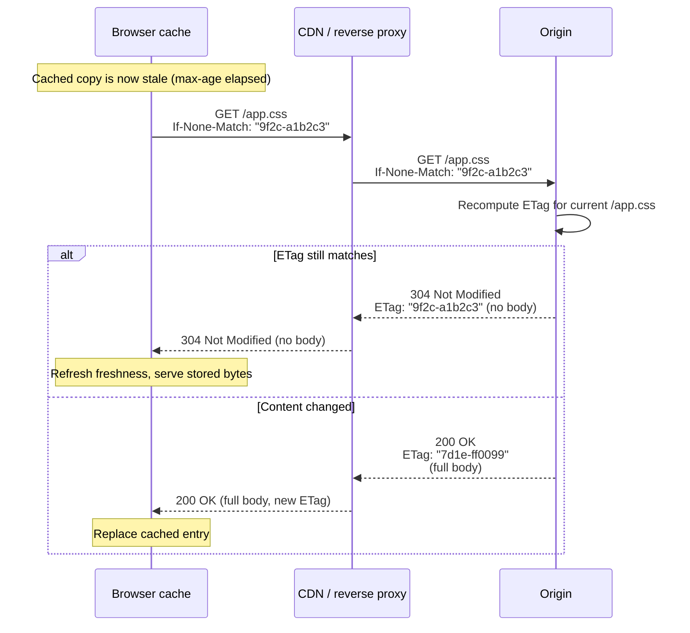
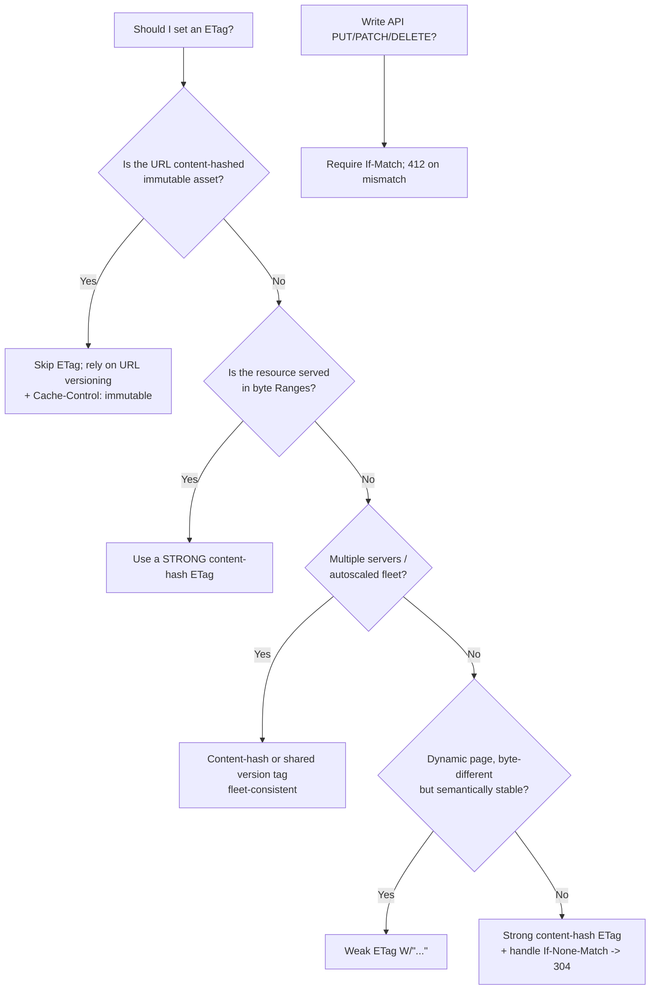

# ETag

## Quick Summary

`ETag` (Entity Tag) is a **response** header that carries an opaque validator string identifying a specific version of a resource's representation — e.g. `ETag: "9f2c-a1b2c3"`. It is the cache's fingerprint: when a cached copy goes stale, the client asks the origin "is version `"9f2c-a1b2c3"` still current?" via [`If-None-Match`](../12-Conditional-Requests/If-None-Match.md), and the origin answers with a cheap `304 Not Modified` (body unchanged) or a full `200` (new body). `ETag` is the *validator* half of the caching model whose *freshness* half is [`Cache-Control`](./Cache-Control.md) / [`Expires`](./Expires.md): freshness decides *whether* to revalidate, `ETag` decides *what happens* when you do. It comes in two flavors — **strong** (`"abc"`, byte-for-byte identical) and **weak** (`W/"abc"`, semantically equivalent) — and it is also the concurrency-control token used by [`If-Match`](../12-Conditional-Requests/Conditional-Requests-Overview.md) to prevent lost updates. Set it well and revalidation costs a header round-trip instead of a full download; set it badly (or inconsistently across servers) and you either break caching or serve wrong bytes.

## What problem does this header solve?

Freshness alone is not enough. [`Cache-Control: max-age`](./Cache-Control.md) tells a cache *how long* it may reuse a response without asking, but eventually every cached copy expires. At that moment the cache faces a choice: re-download the whole resource (wasteful if it hasn't actually changed) or find out cheaply whether it changed. `ETag` provides the cheap path. The origin stamps each version of a representation with a validator; the cache stores it; on expiry the cache echoes it back and the origin can reply `304 Not Modified` with *no body* — saving the entire payload while confirming the cached bytes are still correct.

The other problem it solves is **the lost-update / mid-air-collision problem** in write APIs. Two clients `GET` a resource, both edit it, both `PUT` it back — the second silently clobbers the first. `ETag` + [`If-Match`](../12-Conditional-Requests/Conditional-Requests-Overview.md) turns the second write into a *conditional* write: "only apply this update if the resource is still at the version I read." If it moved on, the origin returns `412 Precondition Failed` and the client must re-read and merge. This is optimistic concurrency control delivered by an HTTP header.

## Why was it introduced?

HTTP/1.0 shipped with only [`Last-Modified`](./Last-Modified.md) + `If-Modified-Since` for validation — a date-based scheme. Dates have three fatal weaknesses: they have **1-second granularity** (a file changed twice in one second looks unchanged), they **depend on filesystem timestamps** (which reset on deploy, restore, or `rsync`), and they cannot express "semantically the same but byte-different" (e.g. a dynamically rendered page whose timestamp changed but whose content did not).

HTTP/1.1 (RFC 2068, 1997; RFC 2616, 1999) introduced `ETag` as an **opaque, content-derived validator** that sidesteps clocks entirely. The rules were re-specified cleanly in **RFC 7232 (2014, "Conditional Requests")** and carried forward into **RFC 9110 (2022, "HTTP Semantics")**, the current authority. The "opaque" property is the whole point: the client must never parse or interpret the tag — it only ever compares it for equality and echoes it back. That opacity lets the server choose *any* generation strategy (content hash, version counter, inode+mtime+size) without the client caring.

## How does it work?

The origin computes a validator for the representation it is about to send and puts it in `ETag`. A cache stores the response along with that tag. When the stored copy becomes stale (per [`Cache-Control`](./Cache-Control.md)), the cache issues a **conditional GET** echoing the tag in [`If-None-Match`](../12-Conditional-Requests/If-None-Match.md). The origin recomputes/looks up the current tag and compares:

- **Match** → the representation is unchanged → `304 Not Modified`, no body. The cache refreshes freshness metadata and serves the stored body.
- **No match** → `200 OK` with the new body and a new `ETag`. The cache replaces its entry.

For writes, the client sends [`If-Match`](../12-Conditional-Requests/Conditional-Requests-Overview.md) with the tag it read; the origin applies the write only if the current tag still matches, else `412 Precondition Failed`.



### Browser behavior

The browser stores the `ETag` with the cached response. When it decides to revalidate (freshness lapsed, or `Cache-Control: no-cache`, or a normal reload adding `max-age=0`), it automatically attaches `If-None-Match` with the stored tag. On `304` it reuses the cached body transparently; the JS/`fetch` layer sees a normal `200`-like result (the browser hides the 304 from `fetch` in most cases, surfacing the cached response). The browser never interprets the tag — pure equality echo.

### Server behavior

The origin is the source of truth: it *generates* the `ETag` and *evaluates* incoming `If-None-Match`/`If-Match`. Express auto-generates a weak `ETag` for `res.send` bodies and a strong-ish one for `res.sendFile`/`express.static` (from size + mtime). A correct origin must generate the **same tag for the same representation every time**, including across process restarts and across every server behind a load balancer — otherwise revalidation always misses.

### Proxy behavior

A shared forward proxy caches the response with its tag and revalidates upstream on staleness exactly like a browser, forwarding `If-None-Match`. It must pass `ETag` through untouched (opaque). A proxy that recompresses a body (violating `no-transform`) but keeps the original strong `ETag` corrupts validation — the tag no longer matches the bytes.

### CDN behavior

A CDN stores `ETag` per cache-key variant and performs origin revalidation on stale objects, collapsing many client conditionals into few origin conditionals (origin shielding). CDNs are the tier most sensitive to **cross-server ETag inconsistency**: if your origin fleet emits different tags for identical bytes, the CDN's revalidations churn and hit-ratio collapses. Many CDNs also generate their *own* ETag if the origin omits one.

### Reverse proxy behavior

Nginx passes upstream `ETag` through and, for statically served files, generates its own from `mtime` + size (hex-encoded). It uses stored ETags to answer/forward conditional requests. `gzip on` historically **stripped or weakened** ETags (see the gzip pitfall below) because compressing the body changed the bytes while the strong tag stayed the same.

## HTTP Request Example

A conditional GET revalidating a cached asset:

```http
GET /assets/app.css HTTP/1.1
Host: shop.example.com
If-None-Match: "9f2c-a1b2c3"
Accept-Encoding: gzip, br
```

A conditional write guarding against lost updates:

```http
PUT /api/articles/42 HTTP/1.1
Host: api.example.com
If-Match: "v7-8f3a"
Content-Type: application/json

{"title":"Updated title","body":"..."}
```

## HTTP Response Example

A strong validator on a static asset (unchanged → later returns 304):

```http
HTTP/1.1 200 OK
Content-Type: text/css; charset=utf-8
Cache-Control: public, max-age=0, s-maxage=300
ETag: "9f2c-a1b2c3"
Content-Length: 40812
```

A weak validator on a dynamically rendered, semantically-stable page:

```http
HTTP/1.1 200 OK
Content-Type: text/html; charset=utf-8
Cache-Control: private, no-cache
ETag: W/"home-v128"
Vary: Accept-Encoding
```

The successful revalidation reply (note: **no body**, and it echoes the same tag):

```http
HTTP/1.1 304 Not Modified
ETag: "9f2c-a1b2c3"
Cache-Control: public, max-age=0, s-maxage=300
```

A failed conditional write:

```http
HTTP/1.1 412 Precondition Failed
Content-Type: application/json

{"error":"stale_version","current_etag":"v9-11cc"}
```

## Express.js Example

```js
const express = require('express');
const crypto = require('crypto');
const app = express();
app.use(express.json());

// 1) Express's built-in ETag. By default it emits a WEAK ETag derived from a
//    hash of the response body for res.send()/res.json() bodies.
app.set('etag', 'strong');   // force byte-exact strong tags (default is 'weak').
// app.set('etag', false);   // disable entirely (e.g. when you set your own).
// app.set('etag', (body, encoding) => myHash(body)); // custom generator fn.

// 2) Content-hash ETag for an API resource. Deterministic across restarts and
//    across every node in the fleet, because it depends ONLY on the bytes.
app.get('/api/products/:id', async (req, res) => {
  const product = await db.products.find(req.params.id);
  const body = JSON.stringify(product);
  // Strong validator: same bytes -> same tag, anywhere, forever.
  const etag = '"' + crypto.createHash('sha1').update(body).digest('base64') + '"';

  res.set('Cache-Control', 'public, max-age=0, s-maxage=60');
  res.set('ETag', etag);

  // Honor the client's revalidation. If-None-Match may be a comma list or "*".
  const inm = req.headers['if-none-match'];
  if (inm && inm.split(',').map(s => s.trim()).includes(etag)) {
    return res.status(304).end();   // 304 MUST carry no body; sending one is a protocol error.
  }
  res.type('application/json').send(body);
});

// 3) Optimistic concurrency on writes with If-Match. Prevents lost updates.
app.put('/api/products/:id', async (req, res) => {
  const current = await db.products.find(req.params.id);
  const currentEtag = '"' + version(current) + '"';   // e.g. a monotonically bumped row version.
  const ifMatch = req.headers['if-match'];

  if (!ifMatch) {
    return res.status(428).json({ error: 'precondition_required' }); // demand a version to guard the write.
  }
  if (ifMatch !== '*' && ifMatch !== currentEtag) {
    // The client edited an older version -> refuse and make them re-read/merge.
    return res.status(412).set('ETag', currentEtag).json({ error: 'stale_version' });
  }
  const updated = await db.products.update(req.params.id, req.body);
  res.set('ETag', '"' + version(updated) + '"').json(updated);
});

app.listen(3000);
```

Why each piece matters: `app.set('etag', 'strong')` upgrades Express's default weak tag to a byte-exact one — needed if any downstream cache serves ranges or requires strong validators. The SHA-1-of-body strategy in route 2 is **fleet-safe** because it ignores mtime/inode; every server computes the identical tag, so CDN revalidation actually hits. The `If-None-Match` parse handles the comma-separated list form and `*`. In route 3, returning `412` (not silently overwriting) is what makes the API safe under concurrency; `428 Precondition Required` forces clients to opt into the guard. Remove the `.status(304).end()` branch and every revalidation re-sends the full body — you keep the RTT cost but lose all the payload savings.

## Node.js Example

Raw `http` gives you nothing automatically — no ETag, no conditional handling. You own all of it:

```js
const http = require('http');
const crypto = require('crypto');

http.createServer((req, res) => {
  if (req.url === '/api/config') {
    const body = JSON.stringify({ theme: 'dark', flags: ['beta'] });
    // Strong content hash: deterministic, fleet-safe, gzip-independent (computed on the
    // ORIGINAL bytes before any Content-Encoding is applied).
    const etag = '"' + crypto.createHash('sha1').update(body).digest('hex') + '"';

    res.setHeader('ETag', etag);
    res.setHeader('Cache-Control', 'public, max-age=0, s-maxage=300');
    res.setHeader('Content-Type', 'application/json');

    if (req.headers['if-none-match'] === etag) {
      res.statusCode = 304;   // matched -> confirm without payload.
      return res.end();       // no body on 304.
    }
    res.statusCode = 200;
    return res.end(body);
  }
  res.statusCode = 404;
  res.end();
}).listen(3000);
```

The contrast with Express: `express.static` derives its tag from **file size + mtime** (`"<size-hex>-<mtime-hex>"`), which is fast but *not* fleet-safe if mtimes differ across servers — whereas a content hash always is. Choose deliberately.

## React Example

React never reads or sets `ETag` directly — it has no access to raw response headers, and `304` is resolved by the browser's HTTP cache before your code sees anything. The relationship is indirect but real in three ways:

1. **`fetch` revalidation.** When React code `fetch`es an endpoint that returned an `ETag`, the browser stores the tag and, on the next fetch (if the cached copy is stale or you pass `cache: 'no-cache'`), sends `If-None-Match` automatically. Your `.then(r => r.json())` transparently receives the cached body on a `304`.

```jsx
function useProduct(id) {
  const [product, setProduct] = React.useState(null);
  React.useEffect(() => {
    // 'no-cache' forces conditional revalidation (If-None-Match) even when fresh;
    // pairs with a server that emits ETag + Cache-Control: no-cache.
    fetch(`/api/products/${id}`, { cache: 'no-cache' })
      .then(r => r.json())
      .then(setProduct);
  }, [id]);
  return product;
}
```

2. **Optimistic concurrency in mutations.** If your API uses `If-Match`, your React mutation must carry the last-seen tag. You typically read it from the fetch `Response.headers.get('etag')` and store it beside the entity, then send it back on `PUT`/`PATCH`, handling a `412` by re-fetching.

3. **Build assets.** React toolchains (Vite/webpack) emit content-hashed filenames, which makes URL-level cache-busting the primary mechanism; for those, an `ETag` is redundant (the URL *is* the version), and it's common to disable ETag on immutable assets to save the origin compute and the 304 RTT.

## Browser Lifecycle

1. **First response** carries `ETag` → browser stores the tag with the cached body and its freshness metadata.
2. **Later request**: if the cached copy is **fresh**, it's served with no network and the `ETag` is irrelevant.
3. **Stale (or `no-cache`, or reload)** → browser issues a conditional GET, auto-attaching `If-None-Match: <stored tag>` (and `If-Modified-Since` if it also has [`Last-Modified`](./Last-Modified.md)).
4. **`304 Not Modified`** → browser reuses the stored body, updates freshness from the 304's headers. DevTools shows status `304`, tiny transfer size.
5. **`200 OK`** → browser replaces the cached entry with the new body + new `ETag`.
6. **Range requests**: for `Range` + `If-Range: <etag>`, the browser resumes a partial download only if the tag still matches (strong validators only) — otherwise it refetches the whole thing.

## Production Use Cases

- **API response revalidation:** `Cache-Control: no-cache` + strong content-hash `ETag`. Clients revalidate constantly but pay only a header RTT + 304 when data is unchanged — huge for large JSON payloads.
- **Static assets behind a CDN:** the CDN revalidates stale objects with the origin via `If-None-Match`, collapsing traffic; a stable `ETag` keeps hit-ratio high.
- **Optimistic locking on write APIs:** `ETag` + `If-Match` for `PUT`/`PATCH`/`DELETE` to prevent lost updates in collaborative editing, inventory, or config systems.
- **Resumable downloads:** `ETag` as the `If-Range` validator so a resumed range download is guaranteed to stitch onto the same version.
- **GraphQL/REST gateways:** compute an `ETag` from the serialized response to enable 304s even for computed responses that have no natural file mtime.

## Common Mistakes

- **Weak tag where a strong one is required.** `Range` requests and byte-serving need a **strong** validator; a weak `W/"..."` tag makes `If-Range` refetch the whole resource. Use strong tags for anything served in ranges.
- **Non-deterministic tags across the fleet.** Deriving the tag from inode/mtime means two servers (or a server after `rsync`/redeploy) emit different tags for identical bytes → every revalidation misses → 304s never happen. Prefer a **content hash** or a shared **version counter**.
- **gzip/ETag mismatch.** Compressing the body while keeping the *strong* tag of the uncompressed bytes makes the tag no longer describe the transmitted representation. Either compute the tag on the original representation and treat encodings as variants (`Vary: Accept-Encoding`), or use a weak tag. (Details below.)
- **Sending a body with 304.** A `304` MUST have no message body; some frameworks will if you `res.send()` instead of `res.status(304).end()`.
- **Forgetting the list/`*` forms.** `If-None-Match` can be `"a", "b"` or `*`; naive `===` comparison breaks legitimate revalidations.
- **Quoting mistakes.** ETags are quoted strings. Emitting `ETag: 9f2c` (unquoted) is malformed and some caches reject it.
- **Overwriting on missing `If-Match`.** Treating a write without `If-Match` as "just do it" reintroduces the lost-update bug; consider `428 Precondition Required`.

## Security Considerations

- **ETags as supercookies / tracking vector.** Because the browser faithfully echoes a per-user unique `ETag` back on every revalidation, a server can assign each visitor a distinct tag and *track them even after cookies are cleared* — the notorious "ETag tracking" technique. Never derive ETags from user identity; derive them purely from resource content. Privacy-hardened setups sometimes strip ETags for this reason.
- **Information disclosure.** If your tag is `"inode-mtime-size"`, you leak filesystem metadata and file sizes. Prefer opaque hashes.
- **Cache poisoning interplay.** A stable, content-derived ETag is a defense: it makes it harder to serve mismatched bodies, but the real guard is a correct [`Vary`](./Vary.md) cache key. An attacker who can vary an unkeyed input while the ETag stays constant can pin a poisoned entry.
- **Timing / hash choice.** SHA-1/`base64` is fine for a validator (collision resistance is *nice* but even MD5-level is acceptable since the tag is not a security token) — but don't reuse a security-sensitive secret as the ETag source.

## Performance Considerations

- **304 saves the payload, not the RTT.** Revalidation still costs one round-trip; for assets that truly never change, `Cache-Control: immutable` + long `max-age` (skip revalidation entirely) beats even a 304. For mutable data, a 304 beats re-downloading a large body.
- **ETag generation cost.** Hashing every response body on every request adds CPU. For large static files, size+mtime is cheaper than a full content hash; for hot dynamic endpoints, cache the computed tag alongside the data.
- **Weak vs strong and compression.** Weak tags let you treat gzip/br variants as equivalent, avoiding a combinatorial explosion of strong tags per encoding — at the cost of losing byte-range support.
- **Fleet consistency drives hit ratio.** Inconsistent tags across origin nodes silently destroy CDN/browser revalidation efficiency; the fix (content hash) is a pure performance win.

## Reverse Proxy Considerations

Nginx generates ETags for static files and, historically, dropped them when gzip was enabled. Modern Nginx keeps a **weak** ETag through gzip:

```nginx
server {
  gzip on;
  gzip_types text/css application/javascript application/json;

  location /assets/ {
    root /var/www;
    # Nginx auto-generates ETag: "<mtime-hex>-<size-hex>" for static files.
    # With gzip on, Nginx converts the strong ETag to a WEAK one (W/"...") so it
    # still validates the semantically-equal (but differently-compressed) representation.
    etag on;              # default; keep it for conditional-GET support.
    add_header Cache-Control "public, max-age=0, s-maxage=300";
  }

  location /api/ {
    proxy_pass http://app_upstream;
    # Pass the app's ETag straight through (opaque). Do NOT let Nginx rewrite it.
    proxy_cache app_cache;
    proxy_cache_valid 200 60s;
    add_header X-Cache-Status $upstream_cache_status;   # HIT/MISS/EXPIRED for debugging.
  }
}
```

Key points: for a **multi-server** static fleet, mtime-based tags differ per node — either serve statics from a CDN/object store with stable tags, or switch to content-hashed filenames and disable ETag. Never let a body-transforming proxy keep a *strong* tag it no longer matches.

## CDN Considerations

- **Cloudflare / CloudFront / Fastly** all store the `ETag` per cache-key variant and revalidate the origin with `If-None-Match` when an edge object goes stale, returning `304` to collapse traffic. A stable origin `ETag` is essential for a good hit ratio.
- **Cross-node inconsistency is the #1 CDN ETag bug.** If your origin autoscaling group emits `"inode-mtime"` tags, each instance produces different tags; the CDN sees a "changed" resource on every revalidation and re-pulls the full body. Use content hashes.
- **Compression at the edge.** If the CDN compresses (Brotli at edge), it may rewrite the `ETag` to a weak form; ensure `Vary: Accept-Encoding` so compressed/uncompressed variants stay distinct.
- **Some CDNs synthesize an ETag** when the origin omits one, enabling 304s even for origins that only sent `Last-Modified`.

## Cloud Deployment Considerations

- **Object storage (S3, GCS, Azure Blob):** these set `ETag` automatically — for S3 a single-part upload's ETag is the object's MD5, but a **multipart** upload's ETag is *not* an MD5 of the whole object (it's a hash-of-part-hashes with a `-N` suffix). Do not assume S3 ETag == content MD5.
- **Load balancers (ALB/GCLB):** pass `ETag` through untouched; they don't validate.
- **API Gateways:** if the gateway has its own response cache, ensure it forwards `If-None-Match`/`If-Match` and doesn't strip `ETag`; some gateways need explicit config to pass conditional headers.
- **Serverless (Lambda/Cloud Functions):** since each invocation is stateless, compute the tag from the response content (or a stored version), never from ephemeral local file mtimes.

## Debugging

- **Chrome DevTools → Network:** click a request → Headers to see response `ETag` and request `If-None-Match`. A `304` row with a tiny Size confirms revalidation worked. "Disable cache" forces full 200s to inspect fresh tags.
- **curl:** `curl -sD - -o /dev/null https://example.com/app.css` to read the `ETag`. Then `curl -sD - -o /dev/null -H 'If-None-Match: "9f2c-a1b2c3"' https://example.com/app.css` — expect `304`. Test writes with `-X PUT -H 'If-Match: "v7"'` (expect `412` if stale).
- **Postman / Bruno:** both show the `ETag`; capture it into a variable and echo it in `If-None-Match` on the next request. Bruno test script: `expect(res.getStatus()).to.equal(304)` for a revalidation suite.
- **Node.js:** log `req.headers['if-none-match']` and `req.headers['if-match']` to see what clients send; log `res.getHeader('etag')` before `res.end()`.
- **Express logging:** `app.use((req,res,next)=>{res.on('finish',()=>console.log(req.method,req.url,res.statusCode,'etag=',res.getHeader('etag'),'inm=',req.headers['if-none-match']));next();});`
- **Fleet consistency check:** `for h in node1 node2 node3; do curl -sD - -o /dev/null --resolve app:443:$IP https://app/asset.css | grep -i etag; done` — the tags must be identical.

## Best Practices

- [ ] Generate ETags **deterministically from content** (or a shared version), never from per-node inode/mtime, so every server and the CDN agree.
- [ ] Use a **strong** ETag when the resource is byte-served (`Range`/`If-Range`); weak is fine for semantic equivalence.
- [ ] Always answer a matching [`If-None-Match`](../12-Conditional-Requests/If-None-Match.md) with `304` and **no body**.
- [ ] Parse `If-None-Match` as a comma list and handle `*`.
- [ ] Guard write APIs with [`If-Match`](../12-Conditional-Requests/Conditional-Requests-Overview.md) → return `412` on mismatch, consider `428` when it's missing.
- [ ] Pair `ETag` with an explicit [`Cache-Control`](./Cache-Control.md) freshness directive — validators without freshness force revalidation every time.
- [ ] For content-hashed immutable assets, **skip** `ETag` (the URL is the version) to save 304 RTTs.
- [ ] Keep ETags opaque and content-derived — never encode user identity (tracking) or filesystem metadata (disclosure).
- [ ] Set [`Vary: Accept-Encoding`](./Vary.md) so compressed variants get distinct cached entries and consistent validators.

## Related Headers

- [If-None-Match](../12-Conditional-Requests/If-None-Match.md) — the request header that echoes the `ETag` for read revalidation; drives the `304` flow.
- [If-Match](../12-Conditional-Requests/Conditional-Requests-Overview.md) — the write-side counterpart for optimistic concurrency; mismatch → `412`.
- [Last-Modified](./Last-Modified.md) — the weaker, date-based validator; `ETag` is preferred and takes precedence when both are present.
- [If-Modified-Since](../12-Conditional-Requests/If-Modified-Since.md) — the date-based revalidation request paired with `Last-Modified`.
- [Cache-Control](./Cache-Control.md) — decides *whether* to revalidate (`no-cache`, `max-age`); `ETag` decides *what happens* when you do.
- [Expires](./Expires.md) — legacy freshness; same freshness/validator split as `Cache-Control`.
- [Vary](./Vary.md) — the cache key that must include `Accept-Encoding` so ETags map to the right variant.
- [Conditional Requests Overview](../12-Conditional-Requests/Conditional-Requests-Overview.md) — the full 304/412 model.

## Decision Tree



## Mental Model

Think of an `ETag` as the **wax seal with a version number pressed onto a sealed document**. When a courier (cache) already holds a copy and isn't sure it's current, they don't re-request the whole document — they show the origin the seal number and ask "still `"9f2c"`?" The origin glances at its records: same seal → "yes, use the copy you have" (`304`, nothing shipped); different seal → "no, here's the new document with a new seal" (`200`). For writes, `If-Match` is a notary rule: "only accept my amendments if the document still bears the exact seal I saw when I started editing" — if someone else re-sealed it first, your amendment is rejected (`412`) and you must re-read. The seal is deliberately **opaque**: nobody reads meaning into it, they only check whether two seals are identical — which is why the origin is free to mint it however it likes, as long as it mints the *same* seal for the *same* document on every server, every time.
