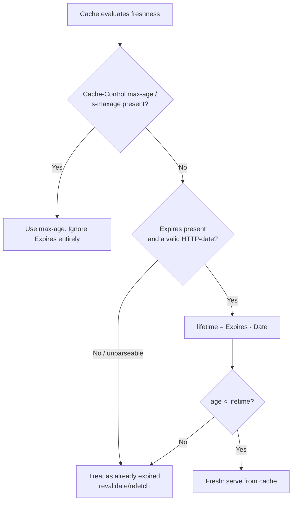
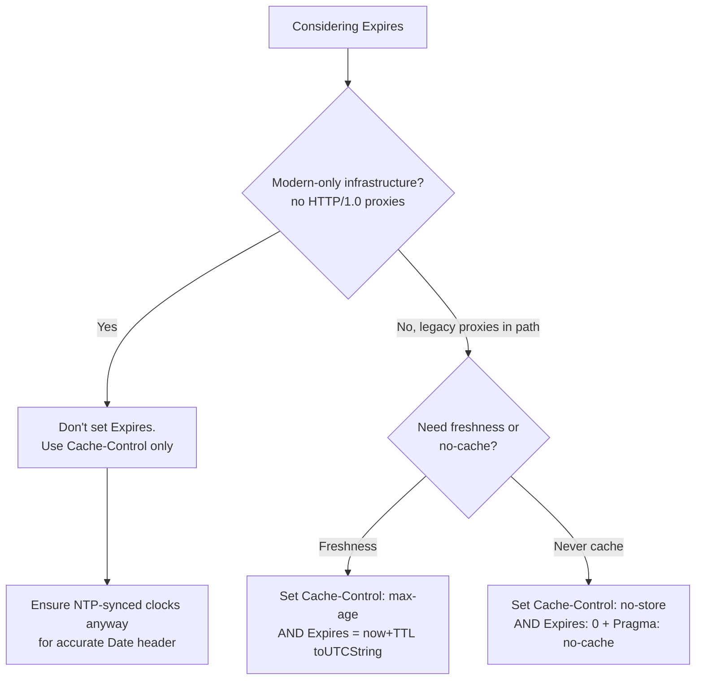

# Expires

## Quick Summary

`Expires` is a **response** header carrying a single absolute HTTP-date after which the response is considered stale. It is the original HTTP/1.0 freshness mechanism, set by the origin server and read by every cache in the path (browser, proxy, CDN, reverse proxy). It answers exactly one question — *"on what wall-clock instant does this become stale?"* — and nothing else (no `private`/`public`, no revalidation policy, no shared-vs-private distinction). It is almost entirely superseded by [`Cache-Control: max-age`](./Cache-Control.md), which **takes strict precedence whenever both are present**. Its Achilles' heel is that it depends on the client and server clocks being in agreement; clock skew silently corrupts freshness. Today you set it, if at all, only as a fallback for ancient HTTP/1.0-only intermediaries — and even that is rarely worth the risk.

## What problem does this header solve?

`Expires` solved the very first version of the caching problem in 1996: *how does a cache know when a stored response is too old to reuse without asking the origin again?* Before it, a cache had no standardized freshness signal at all — it either re-fetched everything (defeating the point of caching) or guessed. `Expires` gave the origin a way to stamp each response with an expiry instant, so a cache could serve the stored copy directly until that moment and only then revalidate or re-fetch. That single capability — origin-declared freshness lifetime — is what made HTTP caching viable at all.

The problem it *fails* to solve — and the reason `Cache-Control` exists — is everything beyond a bare expiry date: it can't say "browser only" vs "shared caches too," can't express a lifetime relative to now (only an absolute date, hostage to clock skew), and can't describe what to do once stale.

## Why was it introduced?

`Expires` appears in HTTP/1.0 (RFC 1945, 1996) as the sole positive freshness control, alongside the crude `Pragma: no-cache` request hint. The web of that era was mostly static documents served through forward proxies (corporate and ISP caches were the dominant caching tier, browsers less so), and an absolute-date expiry was a natural, simple model borrowed from how documents were thought about: "valid until this date."

Its limitations became obvious quickly. Absolute dates require synchronized clocks; a server whose clock is 3 hours fast issues content that clients treat as already expired, or vice versa. There was no way to distinguish private from shared caching, no relative TTL, no revalidation policy. HTTP/1.1 (RFC 2068 in 1997, then RFC 2616) introduced [`Cache-Control`](./Cache-Control.md) to fix all of this and explicitly defined that `max-age` **overrides** `Expires`. The current spec, **RFC 9111 (HTTP Caching, 2022)**, retains `Expires` for backward compatibility and codifies the precedence and the "treat invalid/past dates as already-expired" rules. It survives purely as a legacy fallback.

## How does it work?

A cache computes a response's freshness lifetime. If `Cache-Control: max-age` (or `s-maxage` for shared caches) is present, that wins and `Expires` is ignored entirely. Otherwise, the freshness lifetime is `Expires` value minus the `Date` header value (the origin's timestamp on the response). The cache compares the response's current [`Age`](./Age.md) against that lifetime to decide fresh vs stale.



Two important rules from RFC 9111: an `Expires` value that is not a valid HTTP-date (including the common hack `Expires: 0`) **must be treated as already expired**, and an `Expires` in the past means the response is stale immediately.

### Browser behavior

The browser's private cache uses `Expires` for freshness only when no `Cache-Control: max-age` is present. It computes `Expires − Date`. Because the browser has its own (usually correct) clock, and `Date` is the server's clock, skew between the two directly distorts the computed lifetime — a subtle bug that `max-age` (purely relative, no clock comparison) avoids.

### Server behavior

The origin sets `Expires` to an absolute date. Frameworks that emit it (e.g. older Apache configs, `express.static` if you use the legacy `expires` style) compute it as `now + TTL` at response time. The server should also emit an accurate `Date` header (it does automatically) since caches subtract it. If you set `Cache-Control: max-age`, most frameworks will not bother setting `Expires` because it is redundant.

### Proxy behavior

A shared forward proxy uses `Expires` the same way — only in the absence of `Cache-Control`. Old HTTP/1.0-only proxies that don't understand `Cache-Control` rely on `Expires` exclusively, which is the *sole* remaining reason to send it. Such a proxy can't distinguish private from shared caching (Expires has no `private`), so a bare `Expires` on a personalized response is a leakage risk on legacy infrastructure.

### CDN behavior

Modern CDNs prefer `s-maxage`/`max-age` and use `Expires` only as a fallback. Many CDNs will happily honor `Expires` for edge TTL if no `Cache-Control` is present, but you should never rely on it — set `s-maxage` explicitly. Some CDNs rewrite or strip `Expires`.

### Reverse proxy behavior

Nginx and Varnish read `Expires` from the upstream to derive cache validity when `Cache-Control` is absent. Nginx's own `expires` directive *generates* `Expires` (and a matching `Cache-Control: max-age`) for downstream clients. Because Nginx sets both, downstream `Cache-Control` wins anyway.

## HTTP Request Example

`Expires` is a **response-only** header — it is never sent on a request. The client instead sends conditional/request-caching headers:

```http
GET /styles/main.css HTTP/1.1
Host: cdn.example.com
If-Modified-Since: Wed, 01 Jul 2026 10:00:00 GMT
```

If the previously cached response's `Expires` has passed, the browser revalidates using [`If-Modified-Since`](../12-Conditional-Requests/If-Modified-Since.md) (paired with the earlier [`Last-Modified`](./Last-Modified.md)) or [`If-None-Match`](../12-Conditional-Requests/If-None-Match.md) (paired with [`ETag`](./ETag.md)).

## HTTP Response Example

Legacy freshness via `Expires` alone (note `Date` — caches subtract it):

```http
HTTP/1.1 200 OK
Content-Type: text/css
Date: Tue, 07 Jul 2026 12:00:00 GMT
Expires: Tue, 07 Jul 2026 13:00:00 GMT
Last-Modified: Mon, 06 Jul 2026 09:00:00 GMT
```

This response is fresh for 1 hour (`13:00 − 12:00`). The idiomatic "expire immediately" hack:

```http
HTTP/1.1 200 OK
Cache-Control: no-cache
Expires: 0
Date: Tue, 07 Jul 2026 12:00:00 GMT
```

`Expires: 0` is not a valid HTTP-date, so per spec it means "already expired" — a belt-and-suspenders companion to `Cache-Control: no-cache` for ancient caches.

## Express.js Example

```js
const express = require('express');
const app = express();

// Legacy-fallback freshness: set BOTH Cache-Control (modern) and Expires (old caches).
// Modern caches use max-age; HTTP/1.0-only intermediaries fall back to Expires.
app.get('/legacy/report.pdf', (req, res) => {
  const ttlSeconds = 3600;
  res.set('Cache-Control', `public, max-age=${ttlSeconds}`); // authoritative for HTTP/1.1+ caches.
  res.set('Expires', new Date(Date.now() + ttlSeconds * 1000).toUTCString());
  // ^ absolute date = now + 1h, in the required GMT/HTTP-date format via toUTCString().
  //   Express does NOT set Expires for you; you must build the RFC 1123 date string.
  //   If you set max-age but omit Expires, you simply lose the legacy fallback (usually fine).
  //   If you set Expires but omit max-age, you're at the mercy of clock skew (avoid).
  res.sendFile('/srv/reports/report.pdf');
});

// The "never cache" pair for maximum compatibility across old and new caches:
app.get('/account/statement', requireAuth, (req, res) => {
  res.set('Cache-Control', 'private, no-cache, no-store, must-revalidate'); // modern: definitive.
  res.set('Expires', '0');   // invalid date => "already expired" for HTTP/1.0 caches. Belt + braces.
  res.set('Pragma', 'no-cache'); // HTTP/1.0 request-directive echo some ancient proxies respect.
  res.json(getStatement(req.user));
});

app.listen(3000);
```

Every line: `Cache-Control` is the real control for modern caches; `Expires` is the compatibility shim; building the date with `toUTCString()` is mandatory because caches only parse the RFC 1123 GMT format. Removing `Expires` here costs you nothing on modern infra — it matters only if HTTP/1.0-only proxies are in your path.

## Node.js Example

Raw `http` differs only in that you must format the date yourself and set both headers explicitly — no framework help:

```js
const http = require('http');

http.createServer((req, res) => {
  const ttl = 300; // 5 minutes
  const expires = new Date(Date.now() + ttl * 1000).toUTCString();
  res.setHeader('Cache-Control', `public, max-age=${ttl}`); // wins on modern caches.
  res.setHeader('Expires', expires);                        // legacy fallback.
  res.setHeader('Content-Type', 'application/json');
  // Node sets the Date header automatically; caches compute lifetime as Expires - Date.
  res.end(JSON.stringify({ status: 'ok' }));
}).listen(3000);
```

The only meaningful difference from Express is the absence of any defaults — the mechanics of `Expires` are identical.

## React Example

React never touches `Expires` directly. Its relationship is entirely indirect: when React code issues a `fetch`, the browser's HTTP cache applies whatever freshness the origin declared — and if the origin used `Expires` (with no `Cache-Control`), the browser honors it transparently. React developers effectively never *set* `Expires`; the build toolchain and the server config do. The one thing to know: because SPA data APIs almost always send `Cache-Control`, `Expires` is functionally dead in a modern React stack — you will see it only on legacy backends. There is no React API that reads or writes it; treat it as invisible infrastructure.

## Browser Lifecycle

1. **Response stored.** Browser records the response plus its `Date` and `Expires`.
2. **Freshness check on reuse.** If `Cache-Control: max-age` exists, `Expires` is ignored — stop. Otherwise compute `lifetime = Expires − Date`.
3. **Compare to age.** If the response's current [`Age`](./Age.md) < lifetime → serve from cache (hit, no network).
4. **Invalid/past `Expires`** (e.g. `Expires: 0`, or a date already elapsed) → treated as stale → revalidate via `If-Modified-Since`/`If-None-Match` or re-fetch.
5. **Revalidation result.** `304` → refresh stored headers (including a new `Expires`) and reuse the body; `200` → replace the entry.
6. **Clock-skew caveat.** Because step 2 subtracts the *server's* `Date` from the `Expires` date, a server clock error shifts the effective lifetime for every client — the structural flaw `max-age` was designed to eliminate.

## Production Use Cases

- **HTTP/1.0-only intermediary compatibility.** The one legitimate modern reason to emit `Expires`: a known ancient proxy or appliance in the request path that does not understand `Cache-Control`. Set both headers.
- **Belt-and-suspenders "never cache."** `Expires: 0` alongside `Cache-Control: no-cache, no-store` and `Pragma: no-cache` for maximum-compatibility no-cache behavior on unknown/legacy infrastructure (login pages, statements).
- **Static file servers with legacy config.** Apache `ExpiresByType`/`mod_expires` and Nginx `expires` directives generate `Expires` (and matching `Cache-Control`) for static assets — you inherit `Expires` whether or not you asked for it.
- **Debugging/education.** Reading `Expires` on third-party responses to understand legacy caching behavior.

In greenfield systems, the correct number of `Expires` headers you set is usually **zero** — use `Cache-Control` exclusively.

## Common Mistakes

- **Setting `Expires` without `Cache-Control` and getting bitten by clock skew.** A server clock a few hours off makes content expire early or late for everyone. Always prefer/pair `max-age`.
- **Setting both with conflicting values.** `Cache-Control: max-age=60` + `Expires: <1 hour from now>` — the `Expires` is silently ignored by modern caches, but confuses humans reading the response. Keep them consistent or drop `Expires`.
- **Using a non-GMT / wrong-format date.** `Expires` must be an RFC 1123 HTTP-date in GMT. A localized or ISO-8601 string is unparseable and treated as already-expired. Always use `toUTCString()`.
- **Believing `Expires: 0` means "cache for 0 seconds."** It is not a number of seconds — it is an *invalid date*, which the spec defines as "already expired." It works, but for a different reason than most assume.
- **Relying on `Expires` for shared-cache safety.** It has no `private`/`public` notion; a personalized response guarded only by `Expires` can be stored by a shared cache. Use `Cache-Control: private`.
- **Forgetting the `Date` dependency.** If an intermediary strips/rewrites `Date`, the `Expires − Date` computation breaks. This is another reason `max-age` (no `Date` dependency) is more robust.

## Security Considerations

`Expires` carries no access-scope semantics — it cannot say "private" — so it is **not** a safe way to keep sensitive responses out of shared caches. Any personalized/authenticated response protected only by an `Expires` date can legally be stored and re-served by a shared proxy or CDN. Always use [`Cache-Control: private`](./Cache-Control.md) or `no-store` for confidentiality; treat `Expires` purely as a freshness hint, never as a security control. The `Expires: 0` idiom is a *hardening* helper (forces expiry on legacy caches) but only meaningful alongside `Cache-Control: no-store`. Additionally, clock-skew-induced over-long lifetimes can cause a cache to serve stale — potentially security-relevant — content (e.g., a revoked file) longer than intended; another argument for relative `max-age`.

## Performance Considerations

Functionally, a correct `Expires` and an equivalent `max-age` yield identical hit rates — both let caches serve stored responses without hitting origin. The performance *risk* is entirely from clock skew: a client whose clock disagrees with the server's `Date` computes the wrong lifetime, causing either premature revalidation (extra RTTs, lower hit rate) or over-long caching (stale content). Because `Expires` gives no revalidation policy, no `stale-while-revalidate`, and no shared/private split, you lose all the advanced performance levers `Cache-Control` provides. There is no scenario where `Expires` outperforms `max-age`; at best it matches it, at worst clock skew degrades your hit rate.

## Reverse Proxy Considerations

Nginx's `expires` directive is the common way `Expires` enters a stack — and notably it sets **both** headers:

```nginx
location ~* \.(jpg|jpeg|png|gif|css|js)$ {
    expires 30d;
    # ^ generates:  Expires: <now + 30d>  AND  Cache-Control: max-age=2592000
    #   So downstream HTTP/1.1 caches use max-age; HTTP/1.0-only caches use Expires.
    add_header Cache-Control "public";  # augment the auto-generated Cache-Control.
}

location = /health {
    expires -1;   # generates Expires in the past + Cache-Control: no-cache => never cached.
}
```

`expires -1` / `expires off` control generation. When Nginx acts as a *caching* reverse proxy, it reads the upstream `Expires` (only if upstream sent no `Cache-Control`) to decide `proxy_cache` validity — but you should set `proxy_cache_valid` or have the app send `s-maxage` rather than trust `Expires`.

## CDN Considerations

- **Cloudflare** honors `Expires` for edge freshness only when `Cache-Control` is absent, and always prefers `s-maxage`/`max-age`. Don't rely on `Expires` for edge TTL — set `Cache-Control`.
- **Fastly/Varnish** compute TTL from `Cache-Control`/`Surrogate-Control` first, `Expires` as fallback. Fastly can be configured to ignore `Expires` entirely in VCL.
- **CloudFront** uses `Cache-Control: max-age`/`s-maxage`; if only `Expires` is present it uses it, subject to the Cache Policy's min/max TTL clamps.
- **Universal advice:** never depend on `Expires` at the CDN tier — its clock-skew fragility is amplified across a global edge network with many clocks. Set explicit `s-maxage`.

## Cloud Deployment Considerations

- **Load balancers** pass `Expires` through unmodified (they rarely cache), but some add/rewrite the `Date` header, which — since caches compute `Expires − Date` — can shift effective lifetimes. Verify `Date` integrity end-to-end.
- **API gateways** with response caching key off their own config and typically ignore `Expires`; do not expect an API Gateway cache to honor it.
- **Managed edge platforms (Vercel/Netlify)** read `Cache-Control`/`s-maxage`/`stale-while-revalidate`, not `Expires`, for their edge/ISR caching. `Expires` alone will generally *not* enable edge caching on these platforms.
- **Time synchronization matters:** ensure all origin instances run NTP so their `Date` (and any generated `Expires`) is accurate; a single mis-clocked instance behind a load balancer serves subtly wrong expiry to a fraction of traffic.

## Debugging

- **Chrome DevTools → Network → Headers:** look for `Expires` and `Date`; the effective freshness is `Expires − Date`. If `Cache-Control: max-age` is also present, remember DevTools shows both but the browser uses `max-age`.
- **curl:** `curl -sD - -o /dev/null https://example.com/style.css | grep -iE 'expires|date|cache-control'` shows all three so you can compute the lifetime and spot skew (compare `Date` to your own clock).
- **Postman / Bruno:** inspect the response Headers tab for `Expires`; in Bruno you can assert format, e.g. `expect(res.headers.expires).to.match(/GMT$/)`.
- **Node.js:** log `res.getHeader('Expires')` and `res.getHeader('Date')` before `res.end()` to confirm you emit a valid GMT date.
- **Express logging:** middleware printing `res.getHeader('expires')` on `finish` confirms what actually went out (frameworks/proxies may have added or stripped it).
- **Clock-skew check:** compare the server's `Date` header against your machine's clock; a large delta explains "why is this expiring at the wrong time."

## Best Practices

- [ ] Prefer [`Cache-Control: max-age`](./Cache-Control.md) for all freshness; treat `Expires` as legacy.
- [ ] Only emit `Expires` when a known HTTP/1.0-only intermediary requires it — and then also emit `max-age`.
- [ ] If you set `Expires`, always build the value with `toUTCString()` (RFC 1123 GMT format).
- [ ] Never rely on `Expires` for shared-cache confidentiality; use `Cache-Control: private`/`no-store`.
- [ ] Keep `Expires` and `max-age` consistent if both are present, to avoid confusing operators.
- [ ] Ensure origin clocks are NTP-synced so `Date` (and derived lifetimes) are accurate.
- [ ] Use `Expires: 0` only as a compatibility companion to `Cache-Control: no-store`, never alone.
- [ ] In greenfield/React/CDN stacks, default to emitting no `Expires` at all.

## Related Headers

- [Cache-Control](./Cache-Control.md) — the modern replacement; `max-age`/`s-maxage` override `Expires` and add scope/revalidation semantics `Expires` lacks.
- [Date](../04-Response-Headers/Date.md) — caches compute freshness as `Expires − Date`; its accuracy is essential.
- [Age](./Age.md) — the counterpart caches compare against the `Expires`-derived lifetime.
- [Last-Modified](./Last-Modified.md) / [If-Modified-Since](../12-Conditional-Requests/If-Modified-Since.md) — the date-based revalidation used once an `Expires` lifetime elapses.
- [ETag](./ETag.md) / [If-None-Match](../12-Conditional-Requests/If-None-Match.md) — the stronger validator for the same post-expiry revalidation.

## Decision Tree



## Mental Model

`Expires` is a **printed "best before" date stamped on the carton**, while [`Cache-Control: max-age`](./Cache-Control.md) is a **"good for N days from the moment you receive it" sticker**. The printed date assumes everyone's calendar and clock agree — if the factory's clock is wrong, every store shelves the product for the wrong length of time, and there's no way to fix it after printing. The relative sticker sidesteps all of that: each recipient just counts forward from when *they* got it. That is precisely why the industry moved from the stamped date (`Expires`) to the relative sticker (`max-age`), and why, when both appear on the carton, everyone trusts the sticker.
