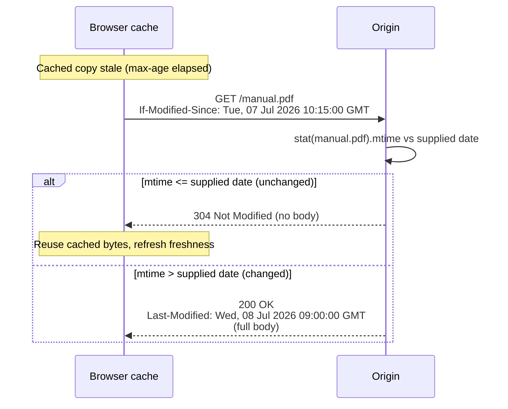
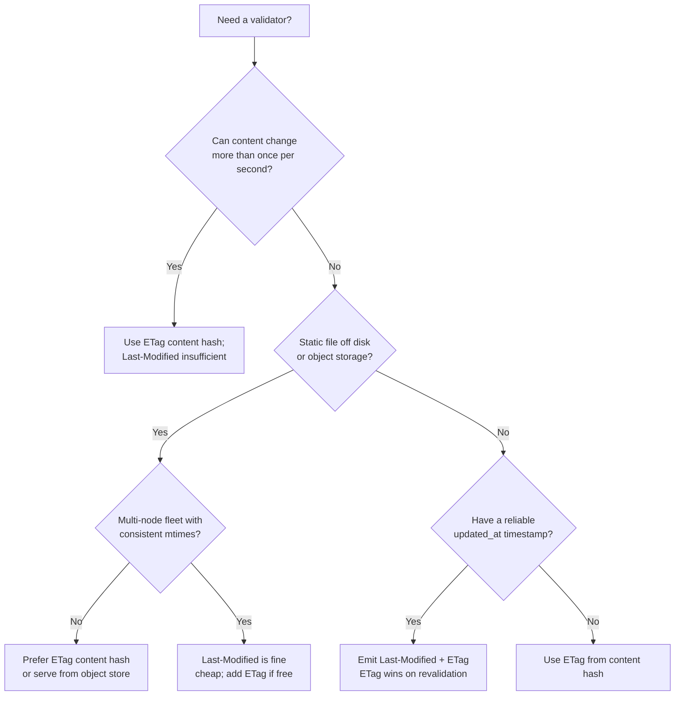

# Last-Modified

## Quick Summary

`Last-Modified` is a **response** header carrying an HTTP-date that says "this representation was last changed at this instant" — e.g. `Last-Modified: Tue, 07 Jul 2026 10:15:00 GMT`. It is the *date-based validator*: the older, coarser sibling of [`ETag`](./ETag.md). A cache stores that date and, when the copy goes stale, asks the origin "has it changed since then?" via [`If-Modified-Since`](../12-Conditional-Requests/If-Modified-Since.md); the origin replies `304 Not Modified` (unchanged) or `200` (new body + new date). Like `ETag`, it is the *validator* half of the caching model whose *freshness* half is [`Cache-Control`](./Cache-Control.md) / [`Expires`](./Expires.md). It is cheaper to produce than a content hash (it's just a filesystem `mtime`) but strictly weaker: it has **1-second granularity**, it's a **weak validator** by definition, and it breaks the moment timestamps diverge across a fleet or a redeploy resets them. When both are available, `ETag` is preferred; `Last-Modified` shines as a zero-cost fallback and as the `304` mechanism for plain static files.

## What problem does this header solve?

The same problem [`ETag`](./ETag.md) solves — avoiding re-downloading unchanged bytes — but it predates `ETag` and solves it with the one piece of metadata every filesystem already tracks: modification time. When a cache's copy expires, it would be wasteful to re-fetch a 2 MB PDF that hasn't been touched in a year. `Last-Modified` lets the cache ask a date-shaped question ("changed since Tue 07 Jul?") and lets the origin answer with a bodyless `304`, saving the whole payload while confirming the cached copy is still valid.

Its unique value is **cost**: for a static file, the origin needs no hashing, no version store, no extra computation — it just `stat()`s the file. That makes it the natural default for web servers serving files off disk, and a sensible fallback for any origin that can't cheaply produce a strong validator.

## Why was it introduced?

`Last-Modified` (with its request partner `If-Modified-Since`) is the **original** HTTP validation mechanism, present in HTTP/1.0 (RFC 1945, 1996), well before `ETag`. In 1996 the web was overwhelmingly static files served off a filesystem, and mtime was the obvious, free "version" of a resource. The model: server sends `Last-Modified`, client caches it, client later sends `If-Modified-Since` with that exact date, server compares and returns `304` or `200`.

Its weaknesses became apparent as the web dynamised, and HTTP/1.1 (RFC 2068/2616) added [`ETag`](./ETag.md) to fix them: sub-second changes are invisible to a 1-second-resolution date; mtime is a poor "version" for dynamically generated content; and mtimes are not stable across servers or deploys. The current authority for both mechanisms is **RFC 9110 (2022, "HTTP Semantics")** (validation) and **RFC 9111 (2022, "HTTP Caching")** (freshness). `Last-Modified` was kept because it is free and universally understood — a good-enough validator when a strong one is unavailable.

## How does it work?

The origin sends `Last-Modified: <HTTP-date>`. A cache stores it with the response. When the copy is stale (per [`Cache-Control`](./Cache-Control.md)), the cache issues a conditional GET with [`If-Modified-Since`](../12-Conditional-Requests/If-Modified-Since.md) set to that exact date. The origin compares the resource's current modification time against the supplied date:

- **Not modified since** (current mtime ≤ the date) → `304 Not Modified`, no body.
- **Modified** (current mtime > the date) → `200 OK` with the new body and an updated `Last-Modified`.

When both `Last-Modified` and `ETag` are present and a client sends both `If-Modified-Since` and [`If-None-Match`](../12-Conditional-Requests/If-None-Match.md), the origin **must** evaluate the ETag (`If-None-Match`) and **ignore** the date — the strong/opaque validator wins.



### Browser behavior

The browser stores `Last-Modified` with the cached response and, on revalidation, sends `If-Modified-Since` with that value (alongside `If-None-Match` if it also has an `ETag`). On `304` it transparently reuses the stored body. Browsers also use `Last-Modified` to compute a **heuristic freshness** lifetime when no explicit `max-age`/`Expires` is present: typically ~10% of the age since last modification (the "LM-factor"), so a file last changed 100 days ago may be treated as fresh for ~10 days — a subtle source of "why is it still cached" surprises.

### Server behavior

The origin *sets* `Last-Modified` (from file mtime, DB `updated_at`, or a rendered-content timestamp) and *evaluates* incoming `If-Modified-Since`. Express `express.static` and `res.sendFile` set it automatically from the file's mtime. The origin must ensure the date it reports is truthful and monotonic — a timestamp that goes backwards (e.g. restored from backup) can make a cache believe a new version is old.

### Proxy behavior

A shared proxy caches with the date and forwards `If-Modified-Since` upstream on staleness, passing `Last-Modified` through unchanged. It participates in the same `304` collapsing as any other cache.

### CDN behavior

CDNs store `Last-Modified` per variant and revalidate the origin with `If-Modified-Since`. Because the date is coarse and mtime-derived, CDNs are exposed to the same **fleet inconsistency** problem as [`ETag`](./ETag.md): if origin nodes report different mtimes for identical files, revalidation misses. Many CDNs prefer/emit `ETag` when both exist.

### Reverse proxy behavior

Nginx sets `Last-Modified` from the file's mtime for static content and answers `If-Modified-Since` directly from disk without touching the upstream. For proxied responses it passes the upstream's `Last-Modified` through. `if_modified_since` directive controls how strictly Nginx compares (`exact` vs `before`).

## HTTP Request Example

A conditional GET revalidating with a stored date:

```http
GET /manual.pdf HTTP/1.1
Host: docs.example.com
If-Modified-Since: Tue, 07 Jul 2026 10:15:00 GMT
```

When the browser has *both* validators, it sends both — and the origin must prefer the ETag:

```http
GET /app.css HTTP/1.1
Host: shop.example.com
If-None-Match: "9f2c-a1b2c3"
If-Modified-Since: Tue, 07 Jul 2026 10:15:00 GMT
```

## HTTP Response Example

A static file with a date validator:

```http
HTTP/1.1 200 OK
Content-Type: application/pdf
Cache-Control: public, max-age=0, s-maxage=3600
Last-Modified: Tue, 07 Jul 2026 10:15:00 GMT
Content-Length: 284913
```

Both validators present (belt-and-suspenders; ETag wins on revalidation):

```http
HTTP/1.1 200 OK
Content-Type: text/css; charset=utf-8
Cache-Control: public, max-age=0, s-maxage=300
ETag: "9f2c-a1b2c3"
Last-Modified: Tue, 07 Jul 2026 10:15:00 GMT
```

The successful revalidation reply:

```http
HTTP/1.1 304 Not Modified
Last-Modified: Tue, 07 Jul 2026 10:15:00 GMT
Cache-Control: public, max-age=0, s-maxage=3600
```

## Express.js Example

```js
const express = require('express');
const app = express();

// 1) express.static sets Last-Modified from file mtime automatically and handles
//    If-Modified-Since for you, returning 304 when the file is untouched.
app.use('/files', express.static('uploads', {
  lastModified: true,        // default true: emit Last-Modified from fs mtime.
  etag: true,                // default true: ALSO emit ETag (size+mtime). ETag wins on revalidation.
  cacheControl: true,
  maxAge: '1h',              // freshness; without it, browsers apply LM-factor heuristic caching.
}));
// If you drop lastModified AND etag, static files can never return 304 -> every
// stale-revalidation re-downloads the full file.

// 2) Dynamic resource using a DB timestamp as the validator. Cheap: no hashing.
app.get('/api/articles/:id', async (req, res) => {
  const article = await db.articles.find(req.params.id);
  const lastModified = article.updatedAt.toUTCString();  // HTTP-date, GMT, 1-second resolution.

  res.set('Cache-Control', 'public, max-age=0, s-maxage=60');
  res.set('Last-Modified', lastModified);

  // Manual If-Modified-Since check. Compare at 1-SECOND granularity: parse both to ms,
  // floor to seconds to avoid sub-second false "modified" results.
  const ims = req.headers['if-modified-since'];
  if (ims) {
    const since = Math.floor(new Date(ims).getTime() / 1000);
    const modified = Math.floor(article.updatedAt.getTime() / 1000);
    if (Number.isFinite(since) && modified <= since) {
      return res.status(304).end();   // unchanged at 1s resolution -> no body.
    }
  }
  res.json(article);
});

// 3) PREFERRED: pair a strong ETag WITH Last-Modified. ETag defeats the 1-second
//    granularity problem; Last-Modified stays as a human-readable, CDN-friendly hint.
app.get('/api/config', async (req, res) => {
  const cfg = await loadConfig();
  const body = JSON.stringify(cfg);
  const etag = '"' + require('crypto').createHash('sha1').update(body).digest('base64') + '"';
  res.set('ETag', etag);                               // primary validator (sub-second safe, fleet-safe).
  res.set('Last-Modified', cfg.updatedAt.toUTCString());// secondary hint.
  res.set('Cache-Control', 'public, max-age=0, s-maxage=120');
  if (req.headers['if-none-match'] === etag) return res.status(304).end(); // ETag checked first.
  res.type('application/json').send(body);
});

app.listen(3000);
```

Why it matters: route 2 shows the **critical 1-second flooring** — comparing raw millisecond timestamps to an `If-Modified-Since` (which only carries whole seconds) would report a resource "modified" whenever `updatedAt` has a sub-second fraction newer than the truncated header value, defeating caching. Route 3 is the production-recommended shape: `ETag` as the authoritative validator (checked first), `Last-Modified` retained as a cheap, readable secondary. Remove `maxAge` in route 1 and browsers fall back to heuristic (LM-factor) freshness — sometimes caching a file for days unexpectedly.

## Node.js Example

Raw `http` sets nothing for you; you must produce the date and evaluate `If-Modified-Since` yourself:

```js
const http = require('http');
const fs = require('fs');

http.createServer((req, res) => {
  if (req.url === '/manual.pdf') {
    const stat = fs.statSync('./manual.pdf');
    const lastModified = stat.mtime.toUTCString();   // HTTP-date form, seconds resolution.

    res.setHeader('Last-Modified', lastModified);
    res.setHeader('Cache-Control', 'public, max-age=0, s-maxage=3600');
    res.setHeader('Content-Type', 'application/pdf');

    const ims = req.headers['if-modified-since'];
    // Compare at whole-second resolution (mtime may carry ms; the header does not).
    if (ims && Math.floor(stat.mtimeMs / 1000) <= Math.floor(new Date(ims).getTime() / 1000)) {
      res.statusCode = 304;
      return res.end();          // no body on 304.
    }
    res.statusCode = 200;
    return fs.createReadStream('./manual.pdf').pipe(res);
  }
  res.statusCode = 404;
  res.end();
}).listen(3000);
```

The contrast with Express: `express.static` does all of this (stat, date, 304, and range handling) automatically; raw `http` requires you to floor to seconds and stream the body manually. Note `stat.mtimeMs` carries millisecond precision that the HTTP-date **cannot** represent — the flooring is what keeps the comparison correct.

## React Example

React never touches `Last-Modified` directly — it has no access to response headers, and `304` is resolved by the browser's HTTP cache before your `fetch` resolves. The dependency is indirect:

1. **Automatic revalidation.** When React `fetch`es a resource that carried `Last-Modified`, the browser stores the date and, on the next stale fetch (or with `cache: 'no-cache'`), sends `If-Modified-Since` automatically. Your code just sees the (possibly cached) body.

```jsx
function useArticle(id) {
  const [article, setArticle] = React.useState(null);
  React.useEffect(() => {
    // 'no-cache' forces conditional revalidation; the browser attaches
    // If-Modified-Since (and If-None-Match if an ETag was stored).
    fetch(`/api/articles/${id}`, { cache: 'no-cache' })
      .then(r => r.json())
      .then(setArticle);
  }, [id]);
  return article;
}
```

2. **Static asset heuristic caching.** For a React app's images/PDFs served with only `Last-Modified` and no `Cache-Control`, the browser applies LM-factor heuristic freshness — which can make assets appear "stuck" cached. This is why React build pipelines prefer explicit `Cache-Control` + content-hashed filenames over relying on `Last-Modified`.

React itself has no concept of the header; you control it entirely on the server.

## Browser Lifecycle

1. **First response** carries `Last-Modified` → stored with the cached body.
2. **No explicit freshness?** Browser may compute heuristic freshness ≈ 10% of (now − Last-Modified) — the LM-factor.
3. **Fresh copy** → served with no network; the date is irrelevant.
4. **Stale / reload / `no-cache`** → conditional GET with `If-Modified-Since: <stored date>` (plus `If-None-Match` if an ETag exists).
5. **`304`** → reuse stored body, refresh freshness. DevTools: status `304`, tiny transfer.
6. **`200`** → replace the cached entry and its `Last-Modified`.
7. **`If-Range: <date>`** → resume a `Range` download only if the resource is unchanged since that date; note strong validators (ETag) are safer for ranges than a coarse date.

## Production Use Cases

- **Static file serving off disk/object store:** the free, default validator for images, PDFs, downloads — zero compute, automatic `304`s.
- **Fallback validator** when a strong `ETag` is impractical (e.g. streaming a large generated file where hashing is too expensive).
- **DB-backed resources** using `updated_at` as `Last-Modified` for cheap conditional GETs on read-heavy endpoints.
- **CDN origin offload:** lets a CDN revalidate stale objects cheaply even for origins that only track mtime.
- **`If-Range` resumable downloads** for large files where the client already trusts the timestamp is stable.

## Common Mistakes

- **Ignoring the 1-second granularity.** HTTP-dates have no sub-second field. A resource modified twice within the same second looks unchanged, so a cache can serve the *first* version after the *second* edit. High-write resources need `ETag`, not dates.
- **Comparing at millisecond precision.** Comparing raw `mtimeMs` (with fractions) against a whole-second `If-Modified-Since` reports spurious "modified" on every request. Floor both to seconds.
- **Non-monotonic timestamps.** Restoring from backup, `rsync` without `-t`, or redeploys can reset mtime *backwards*, making caches treat a new file as old (serving stale) or forwards (needless refetch).
- **Fleet inconsistency.** Different mtimes for identical files across autoscaled nodes → revalidation misses. Same failure mode as inode-based ETags.
- **Wrong date format / non-GMT.** `Last-Modified` must be an HTTP-date in GMT (`toUTCString()` in Node). Local time or ISO-8601 is malformed.
- **Relying on it where sub-second correctness matters.** Config, feature flags, prices — anything that can change multiple times a second — must use `ETag`.
- **Body on 304.** Same rule as ETag: `304` must carry no body.

## Security Considerations

- **Information disclosure.** `Last-Modified` reveals when content was last changed — sometimes sensitive (e.g. reveals deploy times, or that a "static" page was edited after an incident). It's usually benign but be aware you're exposing timestamps.
- **Weak-validator misuse for ranges.** Using a coarse date as an `If-Range` validator risks stitching together bytes from two different versions if the resource changed within the same second; strong `ETag` is safer for byte-range resumption.
- **Not a security control.** `Last-Modified` is a cache-correctness hint, not authentication or integrity protection. Freshness/leak prevention lives in [`Cache-Control`](./Cache-Control.md) (`private`/`no-store`) and [`Vary`](./Vary.md), not here.
- **Cache poisoning.** As with any cached response, correctness depends on a correct `Vary` cache key; the validator does not prevent poisoning by itself.

## Performance Considerations

- **Cheapest validator to produce.** A `stat()` beats hashing the body — ideal for large static files where content hashing would be costly.
- **304 saves payload, costs an RTT.** Same trade-off as [`ETag`](./ETag.md): for truly immutable content, `Cache-Control: immutable` + long `max-age` avoids the revalidation RTT entirely.
- **Heuristic freshness is a double-edged sword.** LM-factor caching can offload the origin for free — or serve stale content unexpectedly. Set explicit `Cache-Control` to control it.
- **Coarser than ETag.** The 1-second floor means high-frequency changes go undetected; use `ETag` for those, accepting its hashing cost.

## Reverse Proxy Considerations

```nginx
server {
  location /files/ {
    root /var/www;
    # Nginx sets Last-Modified from the file mtime automatically and answers
    # If-Modified-Since from disk without hitting any upstream.
    if_modified_since exact;          # compare the date EXACTLY (default 'exact');
                                      # 'before' treats any IMS >= mtime as not-modified.
    add_header Cache-Control "public, max-age=0, s-maxage=3600";
  }

  location /api/ {
    proxy_pass http://app_upstream;
    proxy_cache app_cache;
    proxy_cache_valid 200 60s;
    # Pass upstream Last-Modified/ETag through; Nginx uses them to revalidate.
    add_header X-Cache-Status $upstream_cache_status;
  }
}
```

Key points: for a **multi-node static fleet**, mtimes differ per node unless you deploy with `rsync -t`/`--times` or serve from a shared object store — otherwise `If-Modified-Since` misses across nodes. `if_modified_since before` is more lenient (any request date at/after mtime → 304). Prefer content-hashed filenames + `ETag` where sub-second correctness matters.

## CDN Considerations

- **All major CDNs** store `Last-Modified` and revalidate origins with `If-Modified-Since`. When both `ETag` and `Last-Modified` are present, most prefer the `ETag`.
- **Fleet/mtime inconsistency** is the main CDN pitfall — identical files with differing mtimes across origin nodes cause revalidation misses and re-pulls. Use stable object storage or content hashing.
- **Object storage** (S3/GCS) sets `Last-Modified` to the upload time, which is stable and CDN-friendly — a good reason to serve statics from a bucket.
- **Clock/date parsing** is universal and robust across CDNs, unlike opaque-ETag handling which occasionally gets rewritten during edge compression.

## Cloud Deployment Considerations

- **Object storage (S3/GCS/Azure Blob):** `Last-Modified` = object upload time; stable across the fleet since it's central — often *more reliable* than filesystem mtime on ephemeral instances.
- **Ephemeral/serverless (Lambda, containers):** local file mtimes reset on every cold start/deploy; never derive `Last-Modified` from a bundled file's mtime — derive it from the data's `updated_at` in a datastore.
- **Load balancers / API gateways:** pass `Last-Modified` and `If-Modified-Since` through; verify a caching gateway forwards `If-Modified-Since` so 304s reach the origin.
- **CI/CD:** deploys that rewrite all files reset mtimes to deploy time — every client then sees "modified" once. Content-hashed URLs sidestep this churn.

## Debugging

- **Chrome DevTools → Network:** click a request → Headers to see response `Last-Modified` and request `If-Modified-Since`. A `304` row with tiny Size confirms date revalidation. "Disable cache" forces full 200s.
- **curl:** `curl -sD - -o /dev/null https://example.com/manual.pdf` to read `Last-Modified`, then `curl -sD - -o /dev/null -H 'If-Modified-Since: Tue, 07 Jul 2026 10:15:00 GMT' https://example.com/manual.pdf` — expect `304`. Use `-z <file>` to have curl send `If-Modified-Since` from a local file's mtime.
- **Postman / Bruno:** show `Last-Modified`; copy it into an `If-Modified-Since` header on the next request. Bruno test: `expect(res.getStatus()).to.equal(304)`.
- **Node.js:** log `req.headers['if-modified-since']`; compare `new Date(ims).getTime()` against your resource timestamp (floored to seconds).
- **Express logging:** `app.use((req,res,next)=>{res.on('finish',()=>console.log(req.url,res.statusCode,'lm=',res.getHeader('last-modified'),'ims=',req.headers['if-modified-since']));next();});`
- **Granularity trap check:** edit a file twice within one second and confirm whether your origin returns `304` incorrectly — proof you need an `ETag`.

## Best Practices

- [ ] Prefer [`ETag`](./ETag.md) as the primary validator; keep `Last-Modified` as a cheap secondary hint.
- [ ] When comparing `If-Modified-Since`, **floor both sides to whole seconds** to match HTTP-date resolution.
- [ ] Always emit `Last-Modified` in GMT HTTP-date form (`Date#toUTCString()`), never local time or ISO-8601.
- [ ] For high-write resources (config, prices, flags), use `ETag` — the 1-second granularity is disqualifying.
- [ ] Ensure timestamps are **monotonic and fleet-consistent** (shared object store or `rsync --times`); avoid mtime resets.
- [ ] Set explicit [`Cache-Control`](./Cache-Control.md) freshness so browsers don't apply surprising LM-factor heuristic caching.
- [ ] Answer a matching [`If-Modified-Since`](../12-Conditional-Requests/If-Modified-Since.md) with `304` and **no body**.
- [ ] When both validators are sent, evaluate [`If-None-Match`](../12-Conditional-Requests/If-None-Match.md) and ignore the date.
- [ ] For content-hashed immutable assets, prefer URL versioning + `immutable` over date validation.

## Related Headers

- [If-Modified-Since](../12-Conditional-Requests/If-Modified-Since.md) — the request header that echoes `Last-Modified` to revalidate; drives the `304` flow.
- [If-Unmodified-Since](../12-Conditional-Requests/Conditional-Requests-Overview.md) — the write-side date counterpart (analogous to `If-Match`) for concurrency control.
- [ETag](./ETag.md) — the preferred, sub-second-precise, opaque validator; takes precedence when both are present.
- [If-None-Match](../12-Conditional-Requests/If-None-Match.md) — the ETag-based revalidation request the origin must prefer over the date.
- [Cache-Control](./Cache-Control.md) — decides *whether/when* to revalidate; `Last-Modified` decides *what happens* when a cache does.
- [Expires](./Expires.md) — legacy absolute-date freshness; also date-based, but freshness rather than validation.
- [Date](../04-Response-Headers/Date.md) — the response generation time; used with `Last-Modified` in age/heuristic calculations.
- [Conditional Requests Overview](../12-Conditional-Requests/Conditional-Requests-Overview.md) — the full validation model.

## Decision Tree



## Mental Model

Think of `Last-Modified` as the **"last edited" date pencilled on a document's cover**. A courier holding a copy asks the archive "any changes since the 7th of July?" — if the cover date hasn't moved, the archive says "no, keep what you have" (`304`) without shipping the document again. It's free (every document already has a date on the cover) and human-readable, but it's *coarse*: the date is written only to the day-and-second, so two edits within the same second both read as "the 7th at 10:15:00" and the courier can't tell them apart. That's why, when precision matters, you upgrade to the wax-seal version number of an [`ETag`](./ETag.md) — and when both are on the document, everyone trusts the seal over the pencilled date. `Last-Modified` is the good-enough, no-cost validator; `ETag` is the precise one you reach for when the cover date can lie.
