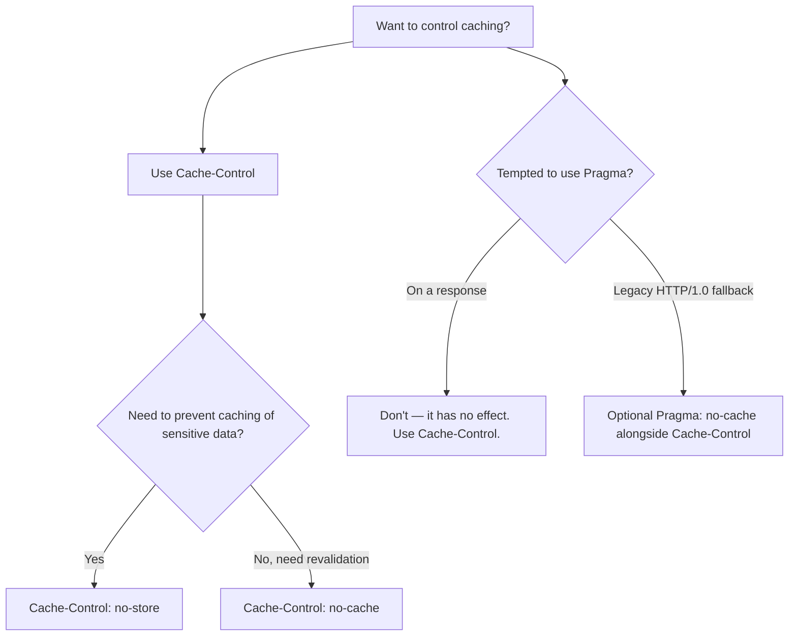

# Pragma

## Quick Summary

`Pragma` is a **legacy HTTP/1.0** header — usable on both requests and responses — whose only surviving value is `Pragma: no-cache`. It predates [`Cache-Control`](./Cache-Control.md) and was the HTTP/1.0 way to say "don't serve a cached copy." In modern HTTP it is **effectively obsolete**: [`Cache-Control`](./Cache-Control.md) supersedes it entirely, and `Pragma` is only defined for **backward compatibility with ancient HTTP/1.0 caches**. On a *request*, `Pragma: no-cache` is treated like `Cache-Control: no-cache` (force revalidation) *if* `Cache-Control` is absent; on a *response*, `Pragma` has **no standardized caching effect at all** (despite being widely — and pointlessly — copy-pasted into response header sets alongside `Cache-Control: no-cache`). The practical guidance is unambiguous: **use [`Cache-Control`](./Cache-Control.md)**; include `Pragma: no-cache` only as a belt-and-suspenders concession to hypothetical HTTP/1.0-only intermediaries (which barely exist anymore). It's in this handbook so you recognize it, understand *why* it's redundant, and stop cargo-culting it into responses where it does nothing.

## What problem does this header solve?

In the **HTTP/1.0** era, there was no rich caching-control vocabulary — no `max-age`, no `s-maxage`, no `no-store`, no `must-revalidate`. The one lever available to say "don't just hand me a stale cached copy — check with the origin" was `Pragma: no-cache`. It solved the narrow problem of **forcing revalidation** in a world of primitive caches. When a user hit "reload," or an application needed fresh data, `Pragma: no-cache` on the request told intermediary caches not to satisfy it from cache without checking.

That problem is now solved far better by [`Cache-Control`](./Cache-Control.md), which expresses freshness, revalidation, storage, and scope with precision. So today `Pragma` solves essentially *nothing new* — its entire remaining purpose is **compatibility**: if (hypothetically) a request passes through an HTTP/1.0-only cache that doesn't understand `Cache-Control`, that ancient cache might still honor `Pragma: no-cache`. Given how vanishingly rare such caches are, this is a legacy safety net, not a real requirement.

## Why was it introduced?

`Pragma` was defined in **HTTP/1.0 (RFC 1945, 1996)** as a general-purpose "implementation-specific directive" mechanism, with `no-cache` as the one standardized token. When **HTTP/1.1 (RFC 2068/2616, 1997–1999)** introduced the vastly more capable [`Cache-Control`](./Cache-Control.md), `Pragma` was **deprecated for caching** and retained only for backward compatibility. **RFC 9111 (2022, "HTTP Caching")** is explicit: `Pragma` is obsolete, its only defined value is `no-cache`, it applies meaningfully only to **requests** (as a fallback when `Cache-Control` is absent), and it has **no defined behavior on responses**. The reason it lingers in codebases is pure inertia — decades of tutorials and boilerplate paired `Pragma: no-cache` with `Cache-Control: no-cache` on responses, propagating a redundant, ineffective habit.

## How does it work?

The behavior differs sharply between request and response, and depends on whether [`Cache-Control`](./Cache-Control.md) is present.

```mermaid
flowchart TD
    A[Pragma: no-cache seen] --> B{Request or response?}
    B -- Request --> C{Cache-Control present?}
    C -- Yes --> D[Ignore Pragma; Cache-Control wins]
    C -- No --> E[Treat like Cache-Control: no-cache<br/>(force revalidation) — legacy fallback]
    B -- Response --> F[No standardized caching effect<br/>(modern caches ignore it)]
```

- **Request `Pragma: no-cache`:** if [`Cache-Control`](./Cache-Control.md) is **absent**, caches should treat it like `Cache-Control: no-cache` (revalidate before serving). If `Cache-Control` **is present**, `Pragma` is ignored (Cache-Control takes precedence).
- **Response `Pragma: no-cache`:** **no standardized effect.** Modern caches ignore it; they obey the response's [`Cache-Control`](./Cache-Control.md). Putting it on responses is harmless but useless.

Behavior by tier:
- **Browser behavior:** May send `Pragma: no-cache` on forced reloads (historically), and treats a request `Pragma: no-cache` as a revalidation hint if `Cache-Control` is absent. It does **not** act on response `Pragma`.
- **Server behavior:** Should rely on [`Cache-Control`](./Cache-Control.md) for all caching directives; setting response `Pragma` accomplishes nothing standardized.
- **Proxy/CDN behavior:** Modern proxies/CDNs obey `Cache-Control`; they may honor a *request* `Pragma: no-cache` only as an HTTP/1.0 fallback, and ignore *response* `Pragma`.
- **Reverse proxy behavior:** Same — configure caching via `Cache-Control`, not `Pragma`.

## HTTP Request Example

A legacy forced-revalidation request (fallback when no `Cache-Control`):

```http
GET /data HTTP/1.1
Host: api.example.com
Pragma: no-cache
```

The modern equivalent (what you should actually use / what browsers send):

```http
GET /data HTTP/1.1
Host: api.example.com
Cache-Control: no-cache
```

When both are present, `Cache-Control` wins and `Pragma` is ignored:

```http
GET /data HTTP/1.1
Host: api.example.com
Cache-Control: no-cache
Pragma: no-cache
```

## HTTP Response Example

The redundant boilerplate you'll see everywhere (the `Pragma` line does nothing standardized):

```http
HTTP/1.1 200 OK
Content-Type: application/json
Cache-Control: no-store, no-cache, must-revalidate
Pragma: no-cache
Expires: 0

{"sensitive": true}
```

The **effective** version — `Cache-Control` alone does the job:

```http
HTTP/1.1 200 OK
Content-Type: application/json
Cache-Control: no-store

{"sensitive": true}
```

## Express.js Example

```js
const express = require('express');
const app = express();

// 1) CORRECT: use Cache-Control. Pragma on responses is unnecessary.
app.get('/api/account', (req, res) => {
  res.set('Cache-Control', 'no-store'); // don't cache sensitive data anywhere.
  res.json({ balance: 4210 });
});

// 2) The common (harmless but pointless) legacy boilerplate. The Pragma/Expires
//    lines add nothing that Cache-Control doesn't already do for modern caches.
app.get('/api/legacy', (req, res) => {
  res.set('Cache-Control', 'no-cache, no-store, must-revalidate');
  res.set('Pragma', 'no-cache'); // <-- no standardized effect on responses.
  res.set('Expires', '0');       // <-- superseded by Cache-Control; belt-and-suspenders only.
  res.json({ data: '...' });
});

// 3) Reading a REQUEST Pragma (rare): treat as revalidation hint if no Cache-Control.
app.use((req, res, next) => {
  const wantsFresh =
    (req.headers['cache-control'] || '').includes('no-cache') ||
    (!req.headers['cache-control'] && req.headers['pragma'] === 'no-cache');
  req.forceRevalidate = wantsFresh;
  next();
});

app.listen(3000);
```

Why each piece matters: route 1 is the correct modern approach — **`Cache-Control` alone** expresses your intent to every current cache. Route 2 shows the ubiquitous legacy trio (`Cache-Control` + `Pragma` + `Expires: 0`); the `Pragma` and `Expires` lines are **belt-and-suspenders for ancient HTTP/1.0 caches** and have no effect on anything modern — harmless, but don't mistake them for doing real work. Route 3 is the only place `Pragma` has *any* standardized meaning: reading a **request** `Pragma: no-cache` as a revalidation signal *when `Cache-Control` is absent*. In practice browsers send `Cache-Control`, so even this rarely triggers.

## Node.js Example

Raw `http`:

```js
const http = require('http');

http.createServer((req, res) => {
  // Correct: control caching via Cache-Control only.
  res.setHeader('Cache-Control', 'no-store');
  // res.setHeader('Pragma', 'no-cache'); // unnecessary; no response-side effect.
  res.setHeader('Content-Type', 'application/json');
  res.end('{"ok":true}');
}).listen(3000);
```

The lesson: set [`Cache-Control`](./Cache-Control.md); don't bother with response `Pragma`.

## React Example

React has essentially no direct relationship with `Pragma`:

1. **`fetch` cache modes replace it.** To force fresh data, use the fetch `cache` option — `fetch(url, { cache: 'no-store' })` or `{ cache: 'no-cache' }` — which the browser translates into proper `Cache-Control` request directives, **not** `Pragma`.

```jsx
// Force a fresh fetch (revalidate / bypass cache) — the modern way.
fetch('/api/data', { cache: 'no-store' })   // or { cache: 'no-cache' } to revalidate
  .then(r => r.json());
// Do NOT try to set Pragma manually; use the cache option.
```

2. **Don't hand-set `Pragma` on requests.** It's redundant with `Cache-Control` (which the fetch cache option manages) and has no benefit.

3. **Server responses to your React app** should use `Cache-Control` to control caching; a `Pragma` in the response has no effect on how the browser caches your API data.

## Browser Lifecycle

1. On a forced reload or a `fetch` with a no-cache/no-store mode, the browser sends `Cache-Control` request directives (and, historically, may include `Pragma: no-cache` for legacy compatibility).
2. A cache receiving a **request** with `Pragma: no-cache` and **no** `Cache-Control` may revalidate before serving (HTTP/1.0 fallback).
3. On **responses**, the browser obeys [`Cache-Control`](./Cache-Control.md); a response `Pragma` is ignored for caching.
4. Net effect: `Pragma` almost never changes modern browser behavior — `Cache-Control` governs.

## Production Use Cases

- **None that require it** in modern systems — [`Cache-Control`](./Cache-Control.md) covers every case.
- **Legacy compatibility:** including `Pragma: no-cache` (request or response) as a defensive nod to hypothetical HTTP/1.0-only caches — rarely necessary.
- **Recognizing it in existing code** so you don't assume it's doing something it isn't.
- **Auditing/cleanup:** removing pointless response `Pragma`/`Expires: 0` boilerplate in favor of clear `Cache-Control`.

## Common Mistakes

- **Thinking response `Pragma: no-cache` prevents caching.** It has **no standardized response effect**; only [`Cache-Control`](./Cache-Control.md) does. Relying on it can leave content cached unexpectedly.
- **Using `Pragma` instead of `Cache-Control`.** Always use `Cache-Control`; `Pragma` is a fallback at best.
- **Assuming it overrides `Cache-Control`.** It doesn't — `Cache-Control` takes precedence when both are present.
- **Cargo-culting the legacy trio** (`Cache-Control` + `Pragma` + `Expires: 0`) and believing all three are load-bearing. Only `Cache-Control` matters for modern caches.
- **Expecting `Pragma` values other than `no-cache` to work.** Only `no-cache` is standardized.
- **Debugging caching by tweaking `Pragma`.** Fix [`Cache-Control`](./Cache-Control.md) instead.

## Security Considerations

- **Don't rely on `Pragma` to protect sensitive data from caching.** Because response `Pragma` has no effect, using it (instead of `Cache-Control: no-store`) to keep private data out of caches is a **real risk** — the data may still be cached. Always use [`Cache-Control: no-store`](./Cache-Control.md) for sensitive responses.
- **False sense of security:** the presence of `Pragma: no-cache` on a response can make developers *believe* caching is disabled when it isn't. Verify with `Cache-Control`.
- **No other security relevance;** it's a legacy caching hint, not a protection mechanism.

## Performance Considerations

- **No meaningful performance role today.** Caching performance is governed by [`Cache-Control`](./Cache-Control.md) (`max-age`/`s-maxage`/`stale-while-revalidate`/etc.), not `Pragma`.
- **Negligible overhead** (a few bytes) if included for legacy reasons.
- **Avoid using `Pragma` to force revalidation** in performance-sensitive paths; express intent precisely with `Cache-Control` so caches behave predictably.

## Reverse Proxy Considerations

Nginx and other proxies key their caching on [`Cache-Control`](./Cache-Control.md), not `Pragma`:

```nginx
server {
  location /api/ {
    proxy_pass http://app_upstream;
    proxy_cache api_cache;
    # Caching decisions come from Cache-Control (proxy_no_cache/proxy_cache_bypass),
    # NOT from Pragma. Configure with Cache-Control-aware rules.
    proxy_cache_bypass $http_cache_control;   # bypass on request Cache-Control (not Pragma).
    add_header X-Cache-Status $upstream_cache_status;
  }
}
```

Key points: don't build proxy caching logic around `Pragma`; use `Cache-Control`. If you must honor a legacy request `Pragma: no-cache`, do so only as a fallback when `Cache-Control` is absent.

## CDN Considerations

- **CDNs obey [`Cache-Control`](./Cache-Control.md)** (and their own config), not response `Pragma`. A response `Pragma: no-cache` will **not** stop a CDN from caching — use `Cache-Control: no-store`/`private` to prevent edge caching of sensitive content.
- **Request `Pragma`** may be honored as an HTTP/1.0 fallback for revalidation, but modern clients send `Cache-Control`.
- **Cleanup opportunity:** the legacy `Pragma`/`Expires: 0` boilerplate can be dropped from CDN-fronted responses in favor of explicit `Cache-Control`.

## Cloud Deployment Considerations

- **Everywhere:** control caching via [`Cache-Control`](./Cache-Control.md) in your app/CDN/LB config; `Pragma` is not a caching knob on these platforms.
- **API Gateways / managed hosts:** their caching honors `Cache-Control`, not `Pragma`.
- **Don't use `Pragma`** to try to disable caching of sensitive serverless responses — use `Cache-Control: no-store`.

## Debugging

- **Chrome DevTools → Network:** caching behavior reflects [`Cache-Control`](./Cache-Control.md); a `Pragma` header in the response won't change whether the entry is cached. Check `Cache-Control` when diagnosing caching.
- **curl:** `curl -sD - -o /dev/null https://host/resource | grep -i 'cache-control\|pragma'` — note that only `Cache-Control` governs behavior.
- **Test caching, not `Pragma`:** to verify something isn't cached, inspect `Cache-Control` and observe `Age`/`X-Cache` on repeated requests — don't rely on the presence of `Pragma`.
- **Legacy cleanup check:** grep your codebase for `Pragma` on responses and confirm the accompanying `Cache-Control` actually expresses the intent.

## Best Practices

- [ ] **Use [`Cache-Control`](./Cache-Control.md)** for all caching directives — request and response.
- [ ] For sensitive data, use `Cache-Control: no-store` (not `Pragma`) to prevent caching.
- [ ] Treat response `Pragma: no-cache` as **decorative** — it has no standardized effect.
- [ ] Include `Pragma: no-cache` on responses only if you specifically want an HTTP/1.0 fallback (rarely needed).
- [ ] On the client, force freshness via `fetch(..., { cache: 'no-store' | 'no-cache' })`, not manual `Pragma`.
- [ ] When auditing, don't assume the legacy `Pragma`/`Expires: 0` trio is doing real work — verify `Cache-Control`.
- [ ] Don't build proxy/CDN caching logic around `Pragma`.

## Related Headers

- [Cache-Control](./Cache-Control.md) — the modern, authoritative caching header that fully supersedes `Pragma`.
- [Expires](./Expires.md) — the other legacy freshness header (absolute date); also superseded by `Cache-Control`, often paired with `Pragma` in old boilerplate.
- [ETag](./ETag.md) / [If-None-Match](../12-Conditional-Requests/If-None-Match.md) — validators used in the revalidation `Pragma`/`Cache-Control: no-cache` triggers.
- [Age](./Age.md) — how caches report staleness (governed by `Cache-Control`, not `Pragma`).
- [Vary](./Vary.md) — cache-key correctness (unrelated to `Pragma`, but part of the caching picture).
- [HTTP Versions and Headers](../01-Introduction/HTTP-Versions-and-Headers.md) — the HTTP/1.0→1.1 evolution that made `Pragma` obsolete.

## Decision Tree



## Mental Model

Think of `Pragma: no-cache` as a **handwritten note in an obsolete dialect that only a handful of very old librarians still read.** Back in the HTTP/1.0 days, it was the *only* way to tell the library "don't just give me whatever's on the shelf — go check the archive for the current version." But then the library adopted a rich, precise ordering system ([`Cache-Control`](./Cache-Control.md)) — with proper forms for "never file this," "re-verify before lending," "keep for exactly 5 minutes" — and every modern librarian uses *that*. The old note still gets stapled to requests and responses out of habit, and on a *request* a rare ancient librarian might still honor it if no modern form is attached. But stapling it to a *response* and expecting the library to act on it is like leaving a note in a dead language on a book's cover: the modern staff simply don't read it and follow the official form instead. So if you truly need a book kept out of circulation (sensitive data), you must fill out the *real* form (`Cache-Control: no-store`) — trusting the old note to do it is how private books end up on the public shelf anyway.
