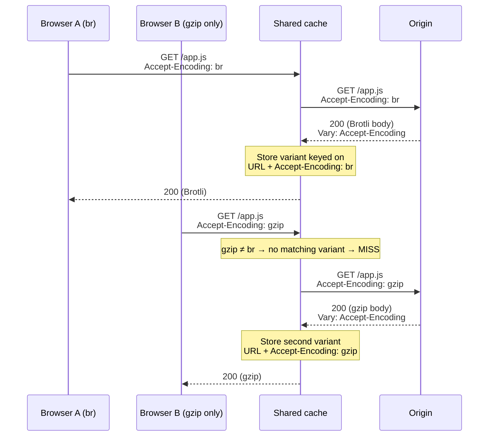
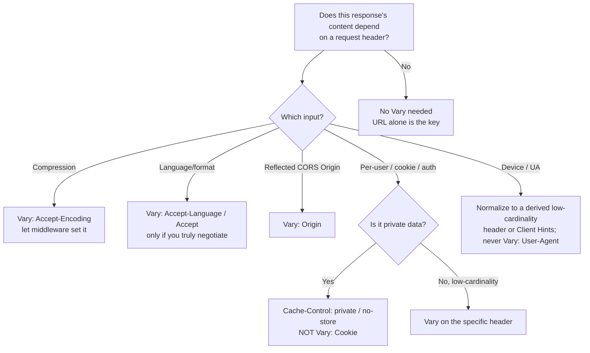

# Vary

## Quick Summary

`Vary` is a **response** header that tells every cache *which request headers were used to select this particular representation* — e.g. `Vary: Accept-Encoding, Accept-Language`. It is the header that extends a cache's key from "just the URL" to "the URL **plus** these named request headers." Without it, a cache assumes one URL maps to exactly one response and will happily serve a gzip-compressed body to a client that can't decode it, or an English page to a French speaker, or — worst of all — a logged-in user's private page to an anonymous visitor. `Vary` is the *cache-correctness* half of content negotiation: the [`Accept`](../03-Request-Headers/Accept.md) family and cookies decide *what* representation to send, and `Vary` records *which of those inputs mattered* so shared caches ([CDNs](../15-CDNs/CDN-Caching-Overview.md), [reverse proxies](../16-Reverse-Proxies/Reverse-Proxy-Overview.md), the browser cache) don't cross the wires. Set it too narrow and you serve wrong bytes; set it too wide (`Vary: *` or `Vary: User-Agent`) and your hit ratio collapses to near zero.

## What problem does this header solve?

A cache's fundamental assumption is: *the URL is the key.* Same URL → same response, reusable for everyone. Content negotiation breaks that assumption. The same URL `/index.html` can legitimately return a gzip body or a Brotli body or an identity body ([`Accept-Encoding`](../10-Compression/Accept-Encoding.md)); an English or a Japanese page ([`Accept-Language`](../03-Request-Headers/Accept-Language.md)); JSON or HTML ([`Accept`](../03-Request-Headers/Accept.md)). Each of those is a different *representation* of the same *resource*, chosen by looking at a request header.

If a shared cache stores the first representation it sees and serves it to everyone, disaster follows: the second visitor — whose browser advertised different capabilities — gets a response chosen for the *first* visitor. A Brotli body arrives at a client that only understands gzip and renders as binary garbage. A German page is served to an English user. `Vary` solves this by telling the cache: "this stored copy is only valid for requests whose `Accept-Encoding` (etc.) matches the one that produced it." The cache then keeps *separate entries per variant* and matches incoming requests against the right one.

The most dangerous version of this bug is **caching private data**. If `/account` returns a page personalized by [`Cookie`](../08-Cookies/Cookie.md) and a shared cache stores it without accounting for the cookie, user A's balance page gets served to user B. This is a real, repeated class of production incident — and it is why `Vary` (or, more safely, `Cache-Control: private`) exists.

## Why was it introduced?

`Vary` arrived with HTTP/1.1 (RFC 2068, 1997; RFC 2616, 1999) precisely because HTTP/1.1 formalized **proactive content negotiation** — the `Accept-*` family. Once a server was allowed to return different bytes for the same URL based on request headers, caches needed a machine-readable signal describing that dependency, or caching and negotiation would be mutually incompatible. `Vary` was that signal.

It is now specified in **RFC 9110 §12.5.5 (2022, "HTTP Semantics")**. The design is deliberately minimal: it names *header field names only* (not values), leaving the cache to compare the actual values of those headers between the stored request and the new one. The special value `*` means "this response depends on things beyond request headers (e.g. client IP, time of day) — do not reuse it for a different request at all without revalidating." The header has grown *more* important over time, not less, because CDNs made shared caching universal and because modern negotiation (compression, [Client Hints](../03-Request-Headers/Accept.md), device adaptation) all funnel through it.

## How does it work?

When the origin produces a response whose content depended on request header `H`, it adds `H` to `Vary`. A cache that stores the response records both the response *and the value of `H` from the request that produced it*. On a later request for the same URL, the cache compares the new request's `H` against each stored variant's `H`; it may reuse a variant only if they match (per the header's normalization rules). If no stored variant matches, it's a cache miss and the cache forwards to the origin.



- **Browser behavior:** The browser's private cache also honors `Vary`. It stores the request headers alongside the cached response and, before reusing a cached entry, checks that the *named* request headers on the new request match those of the stored one. If they differ, the browser revalidates or refetches. This is why toggling language or auth state can bypass a browser-cached copy.
- **Server behavior:** The origin is responsible for emitting a correct, complete `Vary` that lists *every* request header its content-selection logic actually read. Omitting one is a correctness bug; adding irrelevant ones is a performance bug.
- **Proxy behavior:** A shared forward proxy stores multiple variants per URL keyed by the `Vary`-named headers and matches incoming requests to the right variant, exactly like a CDN.
- **CDN behavior:** This is where `Vary` matters most. The CDN's **cache key** is normally URL-based; `Vary` expands it. But CDNs treat some `Vary` values specially — many *ignore or refuse to cache* on high-cardinality values like `User-Agent`, and most implement `Accept-Encoding` compression variance internally rather than trusting the raw header. See [CDN Considerations](#cdn-considerations).
- **Reverse proxy behavior:** Nginx's `proxy_cache` honors `Vary` and will store separate cache entries per variant; a response with `Vary: *` (or, in some configs, `Vary: Cookie`) is treated as uncacheable.

## HTTP Request Example

Two clients hitting the same URL with different capabilities:

```http
GET /index.html HTTP/1.1
Host: www.example.com
Accept-Encoding: gzip, br
Accept-Language: fr-FR, fr;q=0.9, en;q=0.5
```

```http
GET /index.html HTTP/1.1
Host: www.example.com
Accept-Encoding: gzip
Accept-Language: en-US, en;q=0.9
```

These are the *same resource* but two *representations*; `Vary` is what keeps their cached copies apart.

## HTTP Response Example

A negotiated page that varies on both compression and language:

```http
HTTP/1.1 200 OK
Content-Type: text/html; charset=utf-8
Content-Encoding: br
Content-Language: fr
Cache-Control: public, max-age=300
Vary: Accept-Encoding, Accept-Language
ETag: W/"home-fr-v12"
```

A private, per-user response that must **never** be shared — prefer `private` over `Vary: Cookie`:

```http
HTTP/1.1 200 OK
Content-Type: text/html; charset=utf-8
Cache-Control: private, no-store
Vary: Cookie
```

An API endpoint that returns JSON or HTML depending on `Accept`:

```http
HTTP/1.1 200 OK
Content-Type: application/json
Cache-Control: public, max-age=60
Vary: Accept, Accept-Encoding
```

## Express.js Example

```js
const express = require('express');
const app = express();

// 1) Content negotiation with a CORRECT Vary. res.format() inspects Accept and
//    chooses a representation — so the response depends on Accept and MUST say so.
app.get('/api/report/:id', async (req, res) => {
  const report = await db.reports.find(req.params.id);

  // Tell caches this response was selected using Accept AND Accept-Encoding.
  // Express adds 'Accept-Encoding' automatically only if compression middleware
  // runs; we set both explicitly so the contract is not accidental.
  res.vary('Accept');                 // appends 'Accept' to Vary (dedup-safe).
  res.set('Cache-Control', 'public, max-age=60');

  res.format({
    'application/json': () => res.json(report),
    'text/html': () => res.send(renderHtml(report)),
    default: () => res.status(406).send('Not Acceptable'),
  });
});

// 2) The dangerous case: a personalized response. Do NOT rely on Vary: Cookie to
//    keep it private on shared caches — many caches ignore Vary: Cookie or key
//    poorly on it. Mark it private/no-store instead.
app.get('/account', requireAuth, (req, res) => {
  res.set('Cache-Control', 'private, no-store'); // shared caches won't store it at all.
  // res.vary('Cookie') is not enough on its own; 'private' is the real guard.
  res.send(renderAccount(req.user));
});

// 3) Compression variance. The compression middleware negotiates gzip/br from
//    Accept-Encoding, so every compressed response depends on it.
const compression = require('compression');
app.use(compression()); // this middleware calls res.vary('Accept-Encoding') for you.

app.listen(3000);
```

Why each piece matters: `res.vary('Accept')` appends to any existing `Vary` (it de-duplicates and preserves prior entries — critical because the compression middleware also appends `Accept-Encoding`; a naive `res.set('Vary', 'Accept')` would *clobber* the encoding entry and break compression caching). In route 2, the teaching point is that `Vary: Cookie` is a *trap*: it is theoretically correct but practically unsafe, because cookies are so high-cardinality that either the cache never hits or, if it mishandles the header, it leaks private data — `Cache-Control: private` is the header that actually protects you. In route 3, `compression()` sets `Vary: Accept-Encoding` itself; removing it while keeping compression on would let a shared cache serve a Brotli body to a gzip-only client.

## Node.js Example

Raw `http` gives you nothing — you must set `Vary` yourself, and you must **append** rather than overwrite if other code paths already set it:

```js
const http = require('http');
const zlib = require('zlib');

http.createServer((req, res) => {
  if (req.url === '/data.json') {
    const body = JSON.stringify({ ok: true });
    const accepts = req.headers['accept-encoding'] || '';

    // This response's bytes depend on Accept-Encoding → declare it.
    res.setHeader('Vary', 'Accept-Encoding');
    res.setHeader('Content-Type', 'application/json');
    res.setHeader('Cache-Control', 'public, max-age=60');

    if (/\bbr\b/.test(accepts)) {
      res.setHeader('Content-Encoding', 'br');
      return res.end(zlib.brotliCompressSync(body));
    }
    if (/\bgzip\b/.test(accepts)) {
      res.setHeader('Content-Encoding', 'gzip');
      return res.end(zlib.gzipSync(body));
    }
    return res.end(body); // identity
  }
  res.statusCode = 404;
  res.end();
}).listen(3000);
```

If you later add a language-negotiation branch here, you must upgrade `Vary` to `Accept-Encoding, Accept-Language` — forgetting is a silent correctness bug that only shows up when a shared cache is in front of you.

## React Example

React never sets `Vary` (it's a response header from the server), but React apps are *victims or beneficiaries* of it constantly:

1. **`fetch` and the browser cache.** When your React code fetches an endpoint that returns `Vary: Accept-Encoding`, the browser stores per-encoding variants automatically — you get correct behavior for free. But if your app sends a custom request header (say `Accept-Language` set from a language switcher) to a URL whose server *forgot* to `Vary: Accept-Language`, the browser (or an intervening CDN) may serve a cached copy in the wrong language. The fix is server-side, but the symptom appears in React.

```jsx
function useLocalizedContent(lang) {
  const [data, setData] = React.useState(null);
  React.useEffect(() => {
    // If the server does NOT emit `Vary: Accept-Language`, a shared cache may
    // return the wrong language here even though we asked for a specific one.
    fetch('/api/content', { headers: { 'Accept-Language': lang } })
      .then(r => r.json())
      .then(setData);
  }, [lang]);
  return data;
}
```

2. **SSR / Next.js.** Server-rendered React that personalizes output (A/B test bucket, device class, locale) must emit an accurate `Vary` (or use per-request cache keys) or the framework's edge/CDN cache will cross-serve variants. Next.js's data cache and CDN integration rely on correct `Vary`/cache headers to keep variants distinct.

3. **Build assets.** Content-hashed bundle URLs sidestep negotiation entirely (URL is the version), so those assets typically only carry `Vary: Accept-Encoding` for compression.

## Browser Lifecycle

1. **First response** carries `Vary: H1, H2` → the browser stores the response *and* the values of `H1`/`H2` from the request that produced it.
2. **Later request** for the same URL → the browser compares the new request's `H1`/`H2` against the stored variant's.
3. **Match** → the stored copy is a candidate; normal freshness/validator rules ([`Cache-Control`](./Cache-Control.md)/[`ETag`](./ETag.md)) then decide reuse vs revalidate.
4. **Mismatch** → the stored copy cannot be used; the browser makes a fresh request (which may create a second stored variant).
5. **`Vary: *`** → the browser must revalidate with the origin every time; effectively uncacheable for reuse.
6. The browser stores a *bounded* number of variants; high-cardinality `Vary` headers evict aggressively, wasting cache space.

## Production Use Cases

- **Compression:** `Vary: Accept-Encoding` on every compressible response so gzip/br/identity variants stay separate. This is the single most common and most necessary use.
- **Internationalization:** `Vary: Accept-Language` on server-negotiated localized pages/APIs.
- **API content negotiation:** `Vary: Accept` when an endpoint returns JSON or HTML (or different API versions) based on the `Accept` header.
- **CORS:** `Vary: Origin` when `Access-Control-Allow-Origin` is computed by reflecting the request `Origin` — without it, a cache can serve an ACAO for the wrong origin and break CORS. (See [Access-Control-Allow-Origin](../07-CORS/Access-Control-Allow-Origin.md).)
- **Client Hints / device adaptation:** `Vary: Sec-CH-DPR, Width` (or `Vary: DPR`) when serving different image resolutions per device.
- **Authenticated variation done safely:** usually *not* `Vary: Cookie`, but `Cache-Control: private` — the correct tool for per-user responses.

## Common Mistakes

- **Forgetting `Vary: Accept-Encoding`.** The classic bug: a shared cache stores a Brotli body and serves it to a gzip-only client → corrupted/binary page. Compression middleware usually adds it, but hand-rolled compression doesn't.
- **Clobbering an existing `Vary`.** Calling `res.set('Vary', 'Accept')` after compression already set `Vary: Accept-Encoding` deletes the encoding entry. Always **append** (`res.vary(...)`).
- **`Vary: User-Agent`.** UA strings are near-infinite cardinality; this fragments the cache into millions of near-duplicate entries and destroys hit ratio. Use Client Hints or server-side device detection with a *normalized* `Vary` value instead.
- **`Vary: Cookie` for privacy.** Theoretically correct, practically dangerous and hit-ratio-killing. Use `Cache-Control: private`/`no-store`.
- **Reflecting `Origin` in `Access-Control-Allow-Origin` without `Vary: Origin`.** A cache serves the ACAO for origin A to origin B → CORS breakage or a security hole.
- **`Vary` without corresponding negotiation.** Declaring `Vary: Accept-Language` while always returning English wastes cache slots for zero benefit.
- **Case/format assumptions.** `Vary` names header *fields*; the cache compares *values* with header-specific normalization. Don't assume byte-exact matching semantics for all headers.

## Security Considerations

- **Cache poisoning / private-data leakage is the headline risk.** The canonical incident: a personalized response gets cached by a shared cache that didn't account for the personalizing input, and one user's data is served to another. Defenses: mark private responses `Cache-Control: private, no-store`; when you *do* rely on `Vary`, ensure the cache actually honors it (test it).
- **Unkeyed-input cache poisoning.** If your response reflects a request header (e.g. `X-Forwarded-Host` into an absolute URL) but you don't `Vary` on it *and the cache doesn't key on it*, an attacker can poison the cached entry for everyone. `Vary` is part of the fix (make the input keyed), though the deeper fix is not reflecting untrusted input at all.
- **`Vary: Origin` for CORS correctness.** Omitting it when you reflect `Origin` can leak a permissive CORS header to an origin that shouldn't have it.
- **Do not `Vary` on secret-bearing headers** (like `Authorization`) as a substitute for `private` — you still risk the response landing in a shared cache that mishandles it. Use `Cache-Control: private`.

## Performance Considerations

- **`Vary` directly controls hit ratio.** Each distinct combination of `Vary`-named header values is a separate cache entry. Two variants (gzip/br) is fine; thousands (per-UA, per-cookie) is catastrophic.
- **Normalize before you vary.** If you must vary on something high-cardinality, normalize it first (e.g. map the UA to `mobile|desktop` and vary on a derived, low-cardinality header) so the cache stores 2 variants, not 2 million.
- **`Accept-Encoding` normalization.** Raw `Accept-Encoding` strings differ slightly between browsers; smart caches (and CDNs) normalize them to a small set (`br`, `gzip`, `identity`) before keying, so you get 2–3 variants instead of dozens. If you cache yourself, do the same.
- **HTTP/2/3 header compression** makes the `Vary` header's wire cost negligible; the cost is entirely in cache fragmentation, not bytes.

## Reverse Proxy Considerations

Nginx honors `Vary` in `proxy_cache`, but with sharp edges:

```nginx
proxy_cache_path /var/cache/nginx keys_zone=app:100m;

server {
  location / {
    proxy_pass http://app_upstream;
    proxy_cache app;
    proxy_cache_valid 200 5m;

    # Nginx keys on this string; Vary from upstream ADDS the named request
    # headers to the effective key. A response with `Vary: *` is NOT cached.
    proxy_cache_key "$scheme$host$request_uri";

    # Normalize Accept-Encoding to avoid variant explosion: collapse to gzip or "".
    # (Do this in http{} with a map; shown inline for clarity.)
    # If upstream sends `Vary: Cookie`, nginx will effectively not cache it usefully.
    add_header X-Cache-Status $upstream_cache_status;
  }
}
```

Key points: Nginx will refuse to cache a response with `Vary: *`. If upstream emits `Vary: User-Agent`, nginx keys per-UA and your hit ratio dies — strip or normalize it at the proxy (`proxy_hide_header Vary` then re-add a sane one, carefully). For compression, terminate/normalize `Accept-Encoding` at the proxy so you store a bounded set of variants.

## CDN Considerations

- **CDNs treat `Vary` selectively.** Most honor `Vary: Accept-Encoding` (often via their *own* internal compression logic rather than the raw header) and `Vary: Accept-Language`, but **many ignore or refuse to cache** `Vary: User-Agent`, `Vary: Cookie`, or long `Vary` lists because they'd shred the cache. Read your CDN's docs — behavior differs across Cloudflare, Fastly, CloudFront, Akamai.
- **Cloudflare** historically caches based on its own rules and does not vary on arbitrary headers for the free/standard cache; enterprise "custom cache key" and "Vary for images" features let you opt into specific variance. It normalizes `Accept-Encoding` itself.
- **Fastly (VCL)** gives you full control: you can manipulate `Vary` and construct precise cache keys in `vcl_fetch`/`vcl_hash`.
- **CloudFront** requires you to explicitly whitelist which headers are forwarded and included in the cache key (Cache Policy) — `Vary` alone isn't enough; the header must also be in the CDN's key config.
- **Universal rule:** `Vary` is a *hint the origin sends*, but the CDN's *own cache-key configuration* is the source of truth. Align the two: if you `Vary: X` but the CDN doesn't key on `X`, you get cross-served variants; if the CDN keys on `X` but you don't `Vary`, you may fragment unnecessarily. See [Cache Keys and Vary](../15-CDNs/Cache-Keys-and-Vary.md).

## Cloud Deployment Considerations

- **API Gateways (AWS API Gateway, Apigee):** if they cache responses, confirm they honor `Vary` or replicate the variance in their own cache-key settings; several ignore `Vary` entirely and key only on method + path + specified parameters.
- **Load balancers:** L7 LBs generally pass `Vary` through untouched and do not cache, so no special handling — but any caching layer *behind* them does.
- **Managed edge (Vercel, Netlify, Cloudflare Pages):** these platforms have opinionated caching; personalization must use their documented per-request/`private` mechanisms, and `Vary` support varies by platform tier.
- **Object storage (S3/GCS) fronted by a CDN:** the object's stored `Vary` (if any) plus the CDN's cache-policy determine variance — keep them consistent, and prefer content-hashed keys for immutable assets.

## Debugging

- **Chrome DevTools → Network → Headers:** read the response `Vary`. If you suspect cross-serving, compare the request headers named in `Vary` across two requests that got the same (wrong) cached body.
- **curl:** `curl -sD - -o /dev/null -H 'Accept-Encoding: br' https://example.com/app.js` then repeat with `gzip` and confirm the `Content-Encoding` differs and any `X-Cache`/`Age` reflects distinct variants. Use `-H 'Accept-Encoding:'` (empty) to force identity.
- **Postman / Bruno:** send the same URL with different `Accept-*` headers and assert the body/encoding changes and that `Vary` lists those headers.
- **Node.js:** log both `req.headers['accept-encoding']`/`['accept-language']` and the `Vary` you emit to confirm they align.
- **Express logging:** `app.use((req,res,next)=>{res.on('finish',()=>console.log(req.url,'vary=',res.getHeader('vary')));next();})`.
- **Cache-cross-serve test:** hit the URL through the CDN with variant A, then variant B, and confirm you don't receive A's body for B (inspect `Content-Encoding`/`Content-Language` and any `X-Cache: HIT`).

## Best Practices

- [ ] Emit `Vary: Accept-Encoding` on **every** compressible response (let compression middleware do it, and don't clobber it).
- [ ] **Append**, never overwrite, `Vary` (`res.vary(...)`), so multiple middlewares can each add their dependency.
- [ ] Add `Vary: Origin` whenever you compute [`Access-Control-Allow-Origin`](../07-CORS/Access-Control-Allow-Origin.md) by reflecting the request `Origin`.
- [ ] Add `Vary: Accept-Language` / `Vary: Accept` only when you genuinely negotiate on them.
- [ ] **Never** `Vary: User-Agent` — normalize to a low-cardinality derived header or use Client Hints.
- [ ] For per-user/private content, use `Cache-Control: private` (or `no-store`) instead of `Vary: Cookie`.
- [ ] Keep the `Vary` list **minimal** — every entry multiplies cache entries.
- [ ] Ensure your CDN's cache-key config **matches** the headers you `Vary` on.
- [ ] Normalize high-cardinality inputs (encoding, device) before they influence the cache key.

## Related Headers

- [Accept](../03-Request-Headers/Accept.md) / [Accept-Language](../03-Request-Headers/Accept-Language.md) / [Accept-Encoding](../10-Compression/Accept-Encoding.md) — the request headers you typically `Vary` on; they drive negotiation, `Vary` records it.
- [Content-Encoding](../10-Compression/Content-Encoding.md) / [Content-Language](../04-Response-Headers/Content-Language.md) — the response counterparts describing the *chosen* variant.
- [Cache-Control](./Cache-Control.md) — decides cacheability/freshness; `private`/`no-store` is the correct alternative to `Vary: Cookie`.
- [ETag](./ETag.md) — the validator; a cache matches the right *variant* via `Vary` first, then revalidates that variant via `ETag`.
- [Age](./Age.md) — how old a cached (variant) copy is.
- [Access-Control-Allow-Origin](../07-CORS/Access-Control-Allow-Origin.md) — pair with `Vary: Origin` when reflected.
- [Cache Keys and Vary](../15-CDNs/Cache-Keys-and-Vary.md) — the CDN-side deep dive.
- [Content Negotiation Overview](../11-Content-Negotiation/Content-Negotiation-Overview.md) — the framing chapter.

## Decision Tree



## Mental Model

Think of a cache as a **coat-check counter** where the ticket is normally just the URL. `Vary` is the counter clerk writing extra details on the ticket stub: "coat #42, **size L, blue**." Now when you come back, the clerk doesn't just match the number — they match the number *and* the details, so a small red coat never gets handed to someone holding a large-blue ticket. Add too few details (`forgot Accept-Encoding`) and people get the wrong coat (a Brotli body to a gzip client). Add too many details (`Vary: User-Agent`) and every coat needs its own unique ticket, the racks overflow, and the clerk can never find a reusable match — the whole point of a coat check evaporates. And for a coat you'd never lend to a stranger (a private, per-user page), you don't write clever details on the ticket at all — you tell the clerk "**don't check this one in**" (`Cache-Control: private`).
