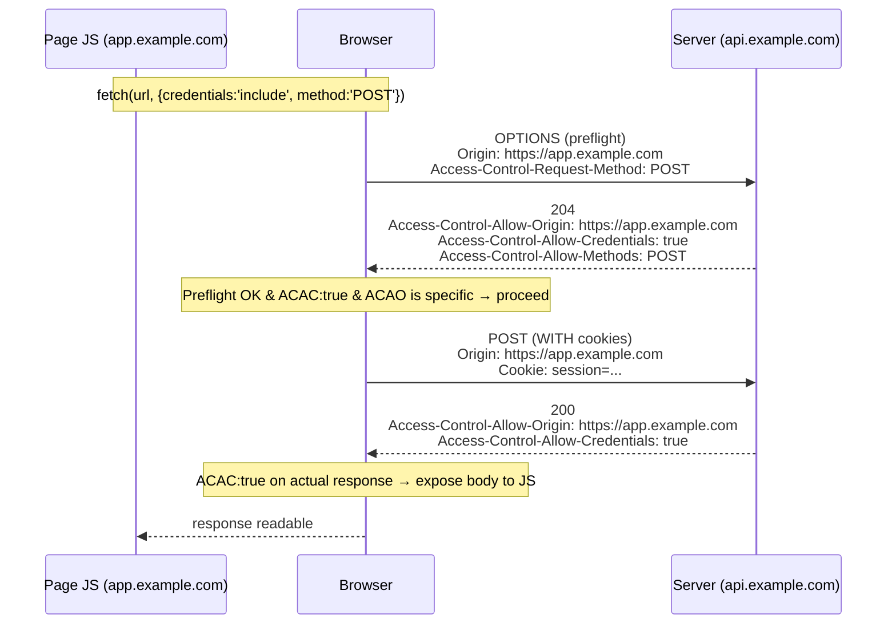
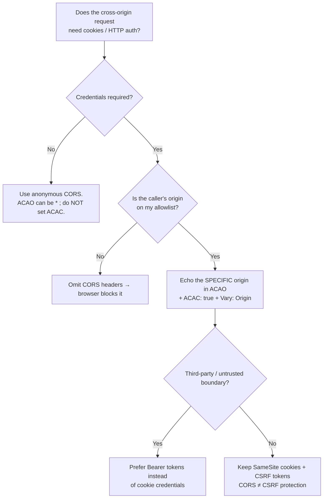

# Access-Control-Allow-Credentials

## Quick Summary

`Access-Control-Allow-Credentials` is a **response** header, sent by the server, whose only legal value is `true`. It is the switch that tells a browser: "for this cross-origin request, you are allowed to **include credentials** (cookies, HTTP authentication, and TLS client certs) *and* to expose the response to the calling JavaScript." Credentialed cross-origin requests are the dangerous case CORS was built to fence off, so the browser demands an explicit, unambiguous opt-in from the server before it will (a) attach the user's cookies to the request and (b) let the page read the response. Crucially, it comes with a hard, non-negotiable constraint enforced by the browser: when credentials are involved, [`Access-Control-Allow-Origin`](./Access-Control-Allow-Origin.md) **must be a specific origin, never the wildcard `*`**, and the same "no wildcard" rule applies to [`Access-Control-Allow-Headers`](./Access-Control-Allow-Headers.md), [`Access-Control-Allow-Methods`](./Access-Control-Allow-Methods.md), and [`Access-Control-Expose-Headers`](./Access-Control-Expose-Headers.md). Get this pairing wrong and either your authenticated API silently drops cookies, or you open a cross-site data-theft hole.

## What problem does this header solve?

The [Same-Origin Policy](../07-CORS/CORS-Overview.md) exists largely to protect **ambient authority** — the cookies and auth state a browser automatically attaches to requests. If any website could make a `fetch('https://bank.example/account', { credentials: 'include' })` and *read the response*, then any malicious page you visited could silently pull your bank balance, your email, your internal admin data — because your browser would helpfully send your logged-in cookies. CORS relaxes the Same-Origin Policy in a *controlled* way, and credentialed requests are the highest-risk relaxation.

`Access-Control-Allow-Credentials` is the server's explicit consent to that risk. Without it, the browser still enforces the safe default: for a cross-origin `fetch`/XHR made *without* credentials, cookies are not sent; and even if a request *tries* to include credentials, the browser will **refuse to hand the response to JavaScript** unless the server responds with `Access-Control-Allow-Credentials: true`. This lets a server run a genuinely authenticated cross-origin API (say `api.example.com` serving an SPA on `app.example.com`) while ensuring *only* origins the server explicitly names can make credentialed calls and read the results.

## Why was it introduced?

CORS was standardized to safely relax the Same-Origin Policy for `XMLHttpRequest` (and later `fetch`). The original **W3C CORS Recommendation (2014)**, now folded into the WHATWG **Fetch Standard** (the living spec), had to distinguish two fundamentally different threat levels: *anonymous* cross-origin reads (a public API, low risk) and *credentialed* cross-origin reads (access to the victim's authenticated session, high risk). A single header couldn't safely cover both, because the permissive convenience of `Access-Control-Allow-Origin: *` is fine for anonymous data but catastrophic for authenticated data.

So the spec created a deliberate two-tier model: `*` is allowed for anonymous requests, but the moment credentials enter the picture the browser requires `Access-Control-Allow-Credentials: true` **and** forbids every wildcard. This "wildcards and credentials are mutually exclusive" rule is the single most important safety invariant in CORS, and this header is the flag that triggers it. It exists precisely because the designers refused to let developers accidentally combine "send the victim's cookies" with "let any origin read the response."

## How does it work?

The header participates in both the **preflight** and the **actual** response, and the browser checks it at two distinct moments.

For a *credentialed* request (`fetch(url, { credentials: 'include' })`, or an XHR with `withCredentials = true`), the flow is:



- **On the preflight (`OPTIONS`) response:** if the eventual request will carry credentials, the browser requires `Access-Control-Allow-Credentials: true` here (and a specific `Access-Control-Allow-Origin`). If it's missing or `ACAO` is `*`, the preflight fails and the real request is never sent.
- **On the actual response:** the header must be present *again* as `true` (it is not "remembered" from the preflight), or the browser blocks JavaScript from reading the body — even though the server already processed the request and possibly mutated state.
- **The browser is the sole enforcer.** The server always *sees* the cookies it was sent (subject to [`SameSite`](../08-Cookies/Set-Cookie.md)); this header does not stop the request from reaching the server or from having side effects. It only controls whether the *response* is exposed to the calling script. This is why CSRF protection is still needed independently.

Behavior by tier:

- **Browser behavior:** Enforces the whole contract — decides whether to attach credentials, whether to send the request at all (after preflight), and whether to expose the response. Also enforces "no wildcards with credentials."
- **Server behavior:** Must *decide per request* whether to allow credentials for the requesting origin, echo the specific origin into `Access-Control-Allow-Origin`, and set `Access-Control-Allow-Credentials: true`. Should add [`Vary: Origin`](../06-Caching-Headers/Vary.md).
- **Proxy/CDN behavior:** Must not cache a credentialed CORS response under a key that ignores `Origin`, or one origin's `ACAO`/`ACAC` could be served to another. `Vary: Origin` is essential; many setups mark credentialed responses `private`.
- **Reverse proxy behavior:** Often the place CORS headers are injected; must reflect a *validated* origin, never a blanket `*` with credentials.

## HTTP Request Example

A credentialed preflight, then the real request:

```http
OPTIONS /api/profile HTTP/1.1
Host: api.example.com
Origin: https://app.example.com
Access-Control-Request-Method: GET
Access-Control-Request-Headers: authorization
```

```http
GET /api/profile HTTP/1.1
Host: api.example.com
Origin: https://app.example.com
Cookie: session=eyJ...        ← attached only because the request opted into credentials
Authorization: Bearer eyJ...
```

## HTTP Response Example

A correct credentialed CORS response — **specific** origin, `ACAC: true`, and `Vary: Origin`:

```http
HTTP/1.1 200 OK
Content-Type: application/json
Access-Control-Allow-Origin: https://app.example.com
Access-Control-Allow-Credentials: true
Vary: Origin
Cache-Control: private
```

The corresponding preflight response:

```http
HTTP/1.1 204 No Content
Access-Control-Allow-Origin: https://app.example.com
Access-Control-Allow-Credentials: true
Access-Control-Allow-Methods: GET, POST, PUT, DELETE
Access-Control-Allow-Headers: authorization, content-type
Access-Control-Max-Age: 600
Vary: Origin
```

The **broken** combination the browser will reject (wildcard + credentials):

```http
HTTP/1.1 200 OK
Access-Control-Allow-Origin: *
Access-Control-Allow-Credentials: true    ← illegal pairing; browser blocks the response
```

## Express.js Example

```js
const express = require('express');
const cookieParser = require('cookie-parser');
const app = express();
app.use(cookieParser());

// An explicit allowlist. NEVER reflect arbitrary origins with credentials on.
const ALLOWED = new Set([
  'https://app.example.com',
  'https://admin.example.com',
]);

app.use((req, res, next) => {
  const origin = req.headers.origin;

  // 1) Only echo an origin we actually trust. Reflecting any origin + credentials
  //    is equivalent to Access-Control-Allow-Origin: * with cookies = data theft.
  if (origin && ALLOWED.has(origin)) {
    res.set('Access-Control-Allow-Origin', origin);   // MUST be specific, not '*', for credentials.
    res.set('Access-Control-Allow-Credentials', 'true'); // the opt-in to send/read cookies.
    // 2) Because ACAO now depends on the request's Origin, caches must key on it.
    res.vary('Origin');
  }

  // 3) Handle the preflight: answer OPTIONS with the allowed methods/headers.
  if (req.method === 'OPTIONS' && origin && ALLOWED.has(origin)) {
    res.set('Access-Control-Allow-Methods', 'GET, POST, PUT, DELETE, OPTIONS');
    res.set('Access-Control-Allow-Headers', 'Content-Type, Authorization');
    res.set('Access-Control-Max-Age', '600');
    return res.status(204).end();   // preflight needs no body.
  }
  next();
});

app.get('/api/profile', (req, res) => {
  // The cookie WAS sent by the browser (subject to SameSite) regardless of CORS;
  // CORS only governs whether the RESPONSE is exposed to the caller's JS.
  if (!req.cookies.session) return res.status(401).json({ error: 'no_session' });
  res.json({ user: lookup(req.cookies.session) });
});

app.listen(3000);
```

Using the `cors` package equivalently:

```js
const cors = require('cors');
app.use(cors({
  origin: (origin, cb) => cb(null, ALLOWED.has(origin)), // dynamic allowlist → echoes the origin
  credentials: true,                                      // sets Access-Control-Allow-Credentials: true
}));
// The cors package sets Vary: Origin for you when origin is a function/array.
```

Why each piece matters: the allowlist in step 1 is the whole ballgame — `res.set('Access-Control-Allow-Origin', origin)` **reflects** the caller's origin, which is only safe *because* we gate it behind `ALLOWED.has(origin)`. Reflecting unconditionally while also sending `ACAC: true` is the textbook CORS misconfiguration that lets `evil.com` read authenticated responses. `res.vary('Origin')` (step 2) stops a shared cache from serving `app.example.com`'s `ACAO` to `admin.example.com`. Remove `Access-Control-Allow-Credentials: true` and the browser sends the request but refuses to give your SPA the JSON — you'd see the network call succeed in DevTools yet get a CORS error in the console.

## Node.js Example

Raw `http` — you own every check:

```js
const http = require('http');
const ALLOWED = new Set(['https://app.example.com']);

http.createServer((req, res) => {
  const origin = req.headers.origin;
  const trusted = origin && ALLOWED.has(origin);

  if (trusted) {
    res.setHeader('Access-Control-Allow-Origin', origin); // specific, not '*'
    res.setHeader('Access-Control-Allow-Credentials', 'true');
    res.setHeader('Vary', 'Origin');
  }

  if (req.method === 'OPTIONS') {
    if (trusted) {
      res.setHeader('Access-Control-Allow-Methods', 'GET, POST, OPTIONS');
      res.setHeader('Access-Control-Allow-Headers', 'Content-Type, Authorization');
    }
    res.statusCode = 204;
    return res.end();
  }

  // ... normal handling; cookies in req.headers.cookie are present regardless of CORS.
  res.setHeader('Content-Type', 'application/json');
  res.end(JSON.stringify({ ok: true }));
}).listen(3000);
```

The lesson mirrors Express: the header is trivial to *set*; the discipline is in only setting it for validated origins and never combining it with `*`.

## React Example

React (via `fetch`/`axios`) is the party that must **opt into** credentials — and it's a two-sided contract: the client asks to send credentials, the server must consent with this header.

```jsx
// fetch: credentials: 'include' makes the browser attach cookies cross-origin
// AND requires the server to reply with Access-Control-Allow-Credentials: true.
async function getProfile() {
  const res = await fetch('https://api.example.com/api/profile', {
    method: 'GET',
    credentials: 'include',   // without this, cookies are NOT sent cross-origin.
  });
  if (!res.ok) throw new Error('unauthorized');
  return res.json();          // only readable because server sent ACAC: true + specific ACAO.
}

// axios equivalent:
import axios from 'axios';
const api = axios.create({
  baseURL: 'https://api.example.com',
  withCredentials: true,      // same effect as fetch credentials: 'include'.
});
```

Key points for React devs:
1. `credentials: 'include'` (or axios `withCredentials: true`) is **required on the client** — the server header alone doesn't send cookies; the client must ask.
2. If the server responds with `Access-Control-Allow-Origin: *` while you send credentials, the browser throws a CORS error even though the request succeeded server-side. The console message ("The value of the 'Access-Control-Allow-Origin' header ... must not be the wildcard '*' when the request's credentials mode is 'include'") is the tell.
3. For same-origin SPAs (`app` and `api` on the same origin) you don't need CORS at all; this whole dance is only for cross-origin credentialed calls.

## Browser Lifecycle

1. **JS calls** `fetch(url, { credentials: 'include' })` cross-origin.
2. If the request is "non-simple" (custom headers, non-GET/POST, etc.), the browser sends a **preflight `OPTIONS`** first.
3. The browser inspects the preflight response: it needs `Access-Control-Allow-Credentials: true` **and** a specific `Access-Control-Allow-Origin` matching the page's origin. If not, it **fails the preflight** and never sends the real request.
4. On success, the browser sends the **actual request with cookies/auth attached**.
5. The browser inspects the actual response: again requires `ACAC: true` + specific `ACAO`, or it **blocks JS from reading the body** (though the server already ran the handler).
6. If everything checks out, the response — and, per [`Access-Control-Expose-Headers`](./Access-Control-Expose-Headers.md), the allowed response headers — is handed to JS.
7. Any `Set-Cookie` in the response is stored subject to [`SameSite`](../08-Cookies/Set-Cookie.md)/`Secure` rules, independent of CORS.

## Production Use Cases

- **SPA + separate API subdomain with cookie sessions:** `app.example.com` calling `api.example.com` with cookie-based auth — the canonical case requiring `ACAC: true` + specific origin.
- **Cross-subdomain authenticated dashboards:** an admin console on one subdomain hitting shared authenticated services on another.
- **Third-party embeddable widgets** that must act on the user's session on the parent site (rare and risky — usually better via tokens).
- **Federated microservices behind a gateway** where the browser talks to multiple origins that share a session cookie scoped to the parent domain.
- **Switching from cookies to `Authorization: Bearer` tokens** is the common way to *avoid* this header entirely (Bearer tokens aren't "credentials" in the CORS sense, so anonymous-mode CORS + a token header often suffices — though the token header still triggers preflight).

## Common Mistakes

- **`Access-Control-Allow-Origin: *` with `Access-Control-Allow-Credentials: true`.** Illegal; the browser blocks it. You must echo a specific origin.
- **Reflecting *any* origin unconditionally with credentials on.** The classic vulnerability: `res.set('ACAO', req.headers.origin)` without an allowlist + `ACAC: true` = every website can read your authenticated responses. Always gate on an allowlist.
- **Setting `ACAC` on the preflight but not the actual response (or vice-versa).** Both responses need it; the browser checks twice.
- **Forgetting `Vary: Origin`.** A shared cache can then serve one origin's CORS headers to another → breakage or a security hole.
- **Client forgets `credentials: 'include'`/`withCredentials`.** Cookies aren't sent, the API returns 401, and it looks like a server bug.
- **Assuming CORS blocks the request from reaching the server.** It doesn't for simple requests, and even for preflighted ones the *actual* request runs server-side on success — so state can change even when JS can't read the reply. **CSRF protection is still required.**
- **`Access-Control-Allow-Credentials: false` expecting it to "disable" credentials.** Only `true` is meaningful; anything else is treated as absent.

## Security Considerations

- **This header is a data-exfiltration gate.** Combined with a reflected/over-broad `ACAO`, it lets malicious origins read the victim's authenticated responses. The mitigation is a strict server-side **origin allowlist** — never reflect arbitrary origins when credentials are enabled.
- **CORS is not CSRF protection.** Because the actual request still reaches the server with cookies attached, an attacker can still *trigger side effects* (a `POST` that changes state) even if they can't read the response. Use [`SameSite=Lax/Strict`](../08-Cookies/Set-Cookie.md) cookies and/or CSRF tokens.
- **Null and file origins.** Be wary of `Origin: null` (sandboxed iframes, `file://`, some redirects); never allowlist `null` with credentials.
- **Subdomain trust creep.** Allowlisting `*.example.com` broadly means a single XSS'd or attacker-controlled subdomain can read authenticated data from your APIs. Keep the list tight and explicit.
- **Cache key correctness.** Without `Vary: Origin` (or `private`), a CDN can leak one origin's credentialed response headers to another.
- **Prefer tokens for third parties.** For anything beyond your own first-party origins, `Authorization: Bearer` tokens (which the caller must obtain and attach) are safer than cookie-based credentialed CORS.

## Performance Considerations

- **Credentialed requests almost always preflight.** Cookies plus custom headers make the request "non-simple," so you pay an extra `OPTIONS` round-trip. Mitigate with a generous [`Access-Control-Max-Age`](./Access-Control-Max-Age.md) to cache the preflight.
- **`Vary: Origin` fragments the cache** by origin — fine (origins are low-cardinality) but it does reduce shared-cache reuse; credentialed responses are usually `private`/uncacheable anyway.
- **Cookie payload on every request** adds bytes; for high-volume APIs, token-in-header auth can be leaner and avoids some caching pitfalls.
- **Extra header on every response** is negligible on the wire (HTTP/2/3 compresses it).

## Reverse Proxy Considerations

Injecting credentialed CORS at Nginx must still validate the origin — you cannot use a static `*`:

```nginx
map $http_origin $cors_origin {
  default "";
  "https://app.example.com"   $http_origin;   # allowlist by exact match
  "https://admin.example.com" $http_origin;
}

server {
  location /api/ {
    if ($cors_origin) {
      add_header Access-Control-Allow-Origin  $cors_origin always;
      add_header Access-Control-Allow-Credentials true always;
      add_header Vary Origin always;
    }
    if ($request_method = OPTIONS) {
      add_header Access-Control-Allow-Origin  $cors_origin always;
      add_header Access-Control-Allow-Credentials true always;
      add_header Access-Control-Allow-Methods "GET, POST, PUT, DELETE, OPTIONS" always;
      add_header Access-Control-Allow-Headers "Content-Type, Authorization" always;
      add_header Access-Control-Max-Age 600 always;
      return 204;
    }
    proxy_pass http://app_upstream;
  }
}
```

Key points: the `map` implements the allowlist so `$cors_origin` is empty (headers omitted) for untrusted origins — never `add_header Access-Control-Allow-Origin *` alongside credentials. `always` ensures the headers are added even on error responses. `Vary: Origin` prevents cross-origin cache bleed.

## CDN Considerations

- **Cloudflare/CloudFront/Fastly must key on `Origin`** for credentialed CORS responses, or a cached `ACAO`/`ACAC` for one origin gets served to another. Ensure `Vary: Origin` is honored *and* that the CDN's cache key includes `Origin` (on CloudFront you must whitelist `Origin` in the Cache Policy).
- Most credentialed responses should be `Cache-Control: private` or uncacheable — personalized authenticated data rarely benefits from shared caching anyway.
- Some CDNs offer managed CORS rules; ensure they implement the allowlist rather than a blanket wildcard when credentials are in play.
- Preflight (`OPTIONS`) responses can be cached at the edge to save round-trips, but again keyed by `Origin` + `Access-Control-Request-*`.

## Cloud Deployment Considerations

- **API Gateways (AWS API Gateway, Apigee):** their built-in CORS support often defaults to `*`; for credentialed APIs you must configure a specific origin (or reflect from an allowlist via a mapping/authorizer) and enable `Access-Control-Allow-Credentials`.
- **Load balancers:** typically pass through; if the LB injects CORS, apply the same allowlist rule.
- **Serverless (Lambda/Cloud Functions):** you set these headers in code per response; centralize the allowlist so every function agrees.
- **Managed edge (Vercel/Netlify):** configure CORS in `vercel.json`/`_headers` or middleware; avoid static `*` with credentials — use middleware to reflect a validated origin.

## Debugging

- **Chrome DevTools → Network:** on a blocked credentialed request, the Console shows the exact CORS error ("must not be the wildcard '*' when credentials mode is 'include'" or "'Access-Control-Allow-Credentials' header ... is ''"). The Network entry's Headers tab shows what the server actually returned.
- **curl (simulate the preflight):** `curl -i -X OPTIONS https://api.example.com/api/profile -H 'Origin: https://app.example.com' -H 'Access-Control-Request-Method: GET'` — verify `Access-Control-Allow-Credentials: true` and a specific `Access-Control-Allow-Origin`.
- **curl (actual, with cookie):** `curl -i https://api.example.com/api/profile -H 'Origin: https://app.example.com' -b 'session=...'` and confirm `ACAC: true` + specific `ACAO`.
- **Postman / Bruno:** note that these tools **don't enforce CORS** (no browser sandbox) — a request that works in Postman can still be blocked in the browser. Use them to inspect the raw headers, not to validate CORS behavior.
- **Node.js/Express logging:** log `req.headers.origin`, `req.headers.cookie`, and the CORS headers you set, on both `OPTIONS` and the real method.
- **Test the negative case:** send an origin *not* on the allowlist and confirm the CORS headers are absent and the browser blocks it.

## Best Practices

- [ ] Use `Access-Control-Allow-Credentials: true` **only** with a specific, allowlisted [`Access-Control-Allow-Origin`](./Access-Control-Allow-Origin.md) — never `*`.
- [ ] Maintain a strict server-side **origin allowlist**; never reflect arbitrary origins with credentials on.
- [ ] Set the header on **both** the preflight and the actual response.
- [ ] Always add [`Vary: Origin`](../06-Caching-Headers/Vary.md) when the `ACAO` depends on the request origin.
- [ ] On the client, remember to set `credentials: 'include'` / `withCredentials: true`.
- [ ] Keep CSRF defenses ([`SameSite`](../08-Cookies/Set-Cookie.md) cookies, tokens) — CORS is **not** CSRF protection.
- [ ] Mark credentialed responses `Cache-Control: private` (or uncacheable) unless you've carefully keyed the cache on `Origin`.
- [ ] Prefer `Authorization: Bearer` tokens over cookie-credentialed CORS for third-party/cross-boundary access.
- [ ] Never allowlist `null` as an origin.

## Related Headers

- [Access-Control-Allow-Origin](./Access-Control-Allow-Origin.md) — must be a *specific* origin (never `*`) whenever this header is `true`; the two are inseparable.
- [Access-Control-Allow-Methods](./Access-Control-Allow-Methods.md) / [Access-Control-Allow-Headers](./Access-Control-Allow-Headers.md) — on preflight responses; also may not be `*` when credentials are involved.
- [Access-Control-Expose-Headers](./Access-Control-Expose-Headers.md) — which response headers JS may read; `*` there is likewise ignored under credentials.
- [Access-Control-Request-Method](./Access-Control-Request-Method.md) / [Access-Control-Request-Headers](./Access-Control-Request-Headers.md) — the preflight request headers the browser sends.
- [Origin](../03-Request-Headers/Origin.md) — the request header you validate against your allowlist.
- [Cookie](../08-Cookies/Cookie.md) / [Set-Cookie](../08-Cookies/Set-Cookie.md) — the credentials this header gates; `SameSite` governs whether they're even sent.
- [Vary](../06-Caching-Headers/Vary.md) — required (`Vary: Origin`) for correct caching of reflected CORS responses.
- [CORS Overview](./CORS-Overview.md) — the full model this header lives in.

## Decision Tree



## Mental Model

Think of `Access-Control-Allow-Credentials: true` as a **VIP wristband policy at a members-only club that also handles your wallet**. Anonymous CORS is like letting anyone read the public menu posted outside — harmless, so a blanket "everyone welcome" sign (`*`) is fine. But the moment a request wants to walk in *carrying your wallet* (your cookies/session) and *read your account*, the club can't accept a generic "everyone welcome" sign — it must check a **specific guest list** and stamp a wristband that says "yes, *this exact person* may act on the member's behalf." That's why `ACAC: true` and a wildcard origin are mutually exclusive: you cannot simultaneously say "anyone at all" and "carrying this member's wallet." And remember — the bouncer (browser) only controls whether *you* get to *see* what's inside; the club has already taken your wallet-carrying request at the door, which is exactly why you still need a separate anti-pickpocket rule (CSRF protection) even after CORS is set up correctly.
